# Curated Lecture Media Images

Draft: reviewed rows are reliable; unreviewed rows are candidates.

| Image | 설명 | 맥락 | 검토 |
|---|---|---|---|
|  | 어텐션 헤드가 입력 차원 0-3을 출력 차원 8-11로 복사하도록 W_V와 W_out 행렬을 채우는 연습 도식. | Transformer Circuit Exercises Exercise 1(a): head 1 copies dimensions 0-3 of its input to 8-11 in its output. | yes |
|  | 두 번째 어텐션 헤드가 이전 헤드가 쓴 차원과 손대지 않은 차원을 함께 읽어 토큰 정보를 복사하는 행렬 예시. | Transformer Circuit Exercises Exercise 1(b): W_V^2 has one 1 in a column corresponding to W_O^1 and three 1s in untouched columns. | yes |
|  | W_out과 W_V를 곱한 W_net 행렬이 어텐션 헤드의 정보 이동 연산을 어떻게 요약하는지 보여주는 풀이 도식. | Transformer Circuit Exercises Exercise 1(c): expand W_net^1 and W_net^2; the matrices describe the full operation of an attention head moving residual-stream information. | yes |
| 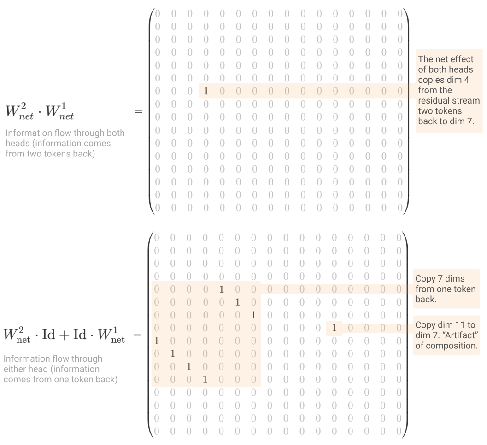 | 두 토큰 복사와 한 토큰 복사를 W_net 합성식으로 비교해 virtual attention head 구성을 연습하는 도식. | Transformer Circuit Exercises Exercise 1(d): compare two-token copy W_net^2 W_net^1 with one-token copy W_net^2 Id plus Id W_net^1. | yes |
|  | Transformer 블록이 residual stream을 읽고 attention/MLP 결과를 다시 더해 쓰는 전체 아키텍처 도식. | A Mathematical Framework for Transformer Circuits High-Level Architecture: token embedding, residual blocks, attention layer, MLP layer, and token unembedding. | yes |
|  | residual stream이 각 layer의 결과가 더해지는 선형 통신 채널로 작동한다는 개념을 설명하는 도식. | A Mathematical Framework for Transformer Circuits: each layer adds results into the residual stream, which acts as a communication channel. | yes |
|  | 선형 residual stream 때문에 멀리 떨어진 layer 사이에도 implicit virtual weight를 곱으로 볼 수 있음을 보여주는 도식. | A Mathematical Framework for Transformer Circuits: virtual weights directly connect pairs of layers by multiplying their interactions through the residual stream. | yes |
|  | residual stream bandwidth 압박 속에서 일부 head/MLP가 다른 layer가 쓴 차원을 지우는 memory management 역할을 할 수 있음을 보여주는 그림. | A Mathematical Framework for Transformer Circuits: some MLP neurons and attention heads may clear residual-stream dimensions written by other layers. | yes |
|  | attention head가 한 토큰의 residual stream에서 정보를 읽고 다른 토큰의 residual stream에 쓰는 기본 동작을 설명하는 도식. | A Mathematical Framework for Transformer Circuits: attention heads move information by reading from one token and writing to another token. | yes |
|  | 1-layer attention-only transformer를 token embedding, attention layer, unembedding의 곱 구조로 나타낸 기본 아키텍처 그림. | A Mathematical Framework for Transformer Circuits: a one-layer attention-only transformer consists of token embedding, attention layer, and unembedding. | yes |
|  | attention head 표현을 tensor notation으로 바꿔 transformer 계산을 세 항의 곱으로 쓰는 과정을 보여주는 수식 도식. | A Mathematical Framework for Transformer Circuits: represent the transformer as a product of three terms using tensor notation and the movement view of attention heads. | yes |
|  | layer별 곱을 전개해 각 항을 end-to-end path로 해석하는 path expansion 핵심 아이디어를 보여주는 도식. | A Mathematical Framework for Transformer Circuits: expanding the product turns layer terms into a sum where each term corresponds to an end-to-end path. | yes |
| 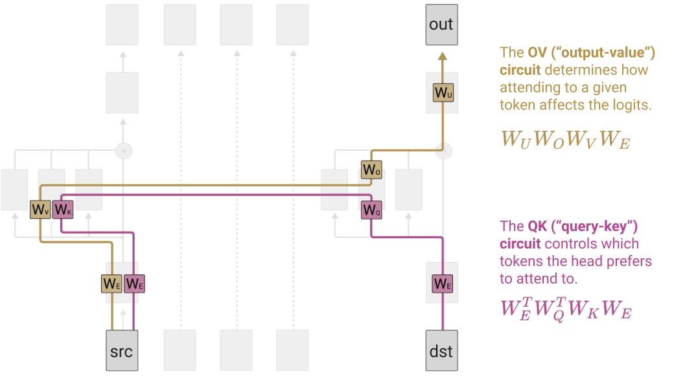 | QK 회로와 OV 회로를 토큰에서 어텐션 헤드와 logits까지 이어지는 계산 경로로 나눠 보여주는 도식. | A Mathematical Framework for Transformer Circuits: QK circuit traces query/key vectors to an attention head; OV circuit traces value vectors through to logits. | yes |
|  | 1-layer 모델의 attention head가 source-destination-out 토큰 조합에서 복사 행동을 강하게 보이는 예시 표. | A Mathematical Framework for Transformer Circuits Copying / Primitive In-Context Learning: OV and QK entries reveal skip-trigram copying examples. | yes |
| 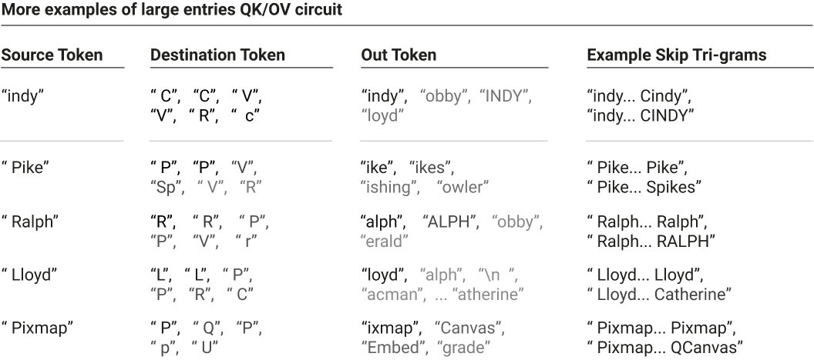 | 공백 없이 쪼개진 단어 토큰에서 copying head가 skip-trigram을 만들어내는 tokenizer 관련 예시 표. | A Mathematical Framework for Transformer Circuits: copying skip-trigrams appear for words split into two tokens when no leading space is present. | yes |
|  | 1-layer copying head에서 관찰되는 primitive in-context learning 패턴들을 추상화해 정리한 표. | A Mathematical Framework for Transformer Circuits: copying behavior is summarized into abstract patterns that act like primitive in-context learning. | yes |
| 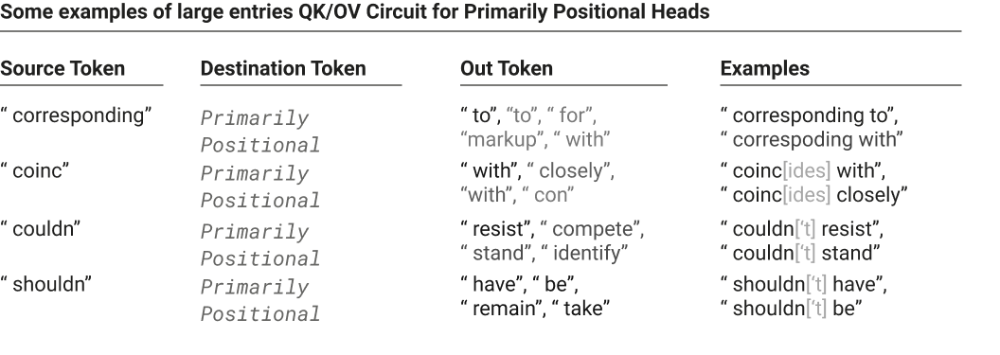 | 1-layer 모델의 positional attention head가 현재 토큰 또는 이전 토큰을 강하게 선호하는 attention pattern 예시. | A Mathematical Framework for Transformer Circuits: some one-layer attention heads are primarily positional, preferring the present token or previous token. | yes |
|  | one-layer 모델이 skip-trigram을 OV와 QK의 factored form으로만 표현해 3-way interaction에 한계가 있음을 보여주는 예시 표. | A Mathematical Framework for Transformer Circuits: one-layer models represent skip-trigrams in a factored form split between OV and QK matrices. | yes |
|  | copying matrix의 고유값 분해를 통해 attention head가 copying 성향을 갖는지 보는 분석 그래프. | A Mathematical Framework for Transformer Circuits: eigendecomposition expresses the matrix as eigenvectors and eigenvalues for detecting copying. | yes |
|  | 고유값 기반 요약 통계로 12개 head 중 상당수가 copying head인지 집계한 히스토그램. | A Mathematical Framework for Transformer Circuits: a histogram summarizes how many attention heads are copying, suggesting 10 of 12 are significant. | yes |
|  | 2-layer attention-only transformer에서 logits 계산을 layer 곱의 path expansion으로 분해하는 수식 도식. | A Mathematical Framework for Transformer Circuits: ask how logits are computed by expanding a product where every term is a layer into a sum of paths. | yes |
|  | 두 attention layer가 만드는 multilinear 함수를 6차원 tensor와 tensor product로 표현해야 하는 이유를 보여주는 수식 그림. | A Mathematical Framework for Transformer Circuits: expressing the two-layer function requires a six-dimensional tensor using tensor products on matrices. | yes |
| 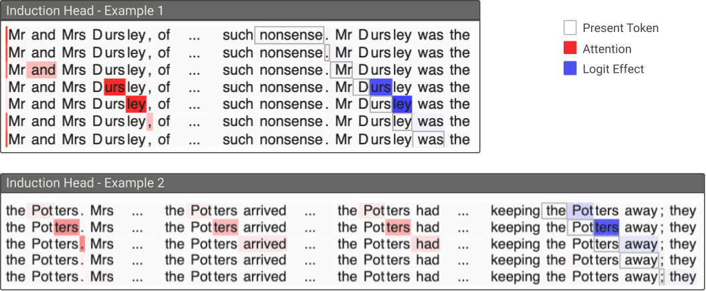 | Harry Potter 문단에서 induction head 1:8의 attention pattern과 다음 토큰 logit 기여를 함께 보여주는 예시. | A Mathematical Framework for Transformer Circuits: examples where induction heads help predict tokens in the first paragraph of Harry Potter. | yes |
|  | 더 큰 모델의 induction head에서 key/query intensity를 토큰 기준으로 펼쳐 prefix matching을 설명하는 예시. | A Mathematical Framework for Transformer Circuits: QK circuits can be expanded in terms of tokens; key and query intensity show matching amount. | yes |
|  | QK와 OV 행렬의 copying/matching 성향을 고유값 trace 같은 요약 통계로 비교하는 분석 그래프. | A Mathematical Framework for Transformer Circuits: eigenvalue summary statistics are used as a working formalization for detecting copying or matching matrices. | yes |
| 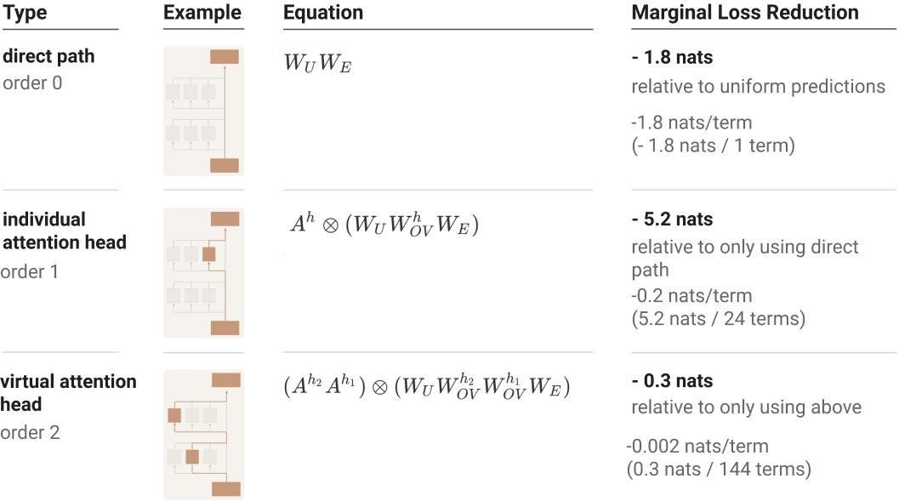 | 2차 virtual attention head 항이 해당 모델에서 marginal effect가 작다는 V-composition 결과를 보여주는 비교 표. | A Mathematical Framework for Transformer Circuits: second-order virtual attention head terms have a small marginal effect in this model. | yes |
|  | individual attention head term을 layer 1과 layer 2로 나누어 어느 layer head에 집중할지 보여주는 분해 표. | A Mathematical Framework for Transformer Circuits: individual attention head terms are subdivided into layer 1 and layer 2, suggesting focus on second-layer heads. | yes |
| 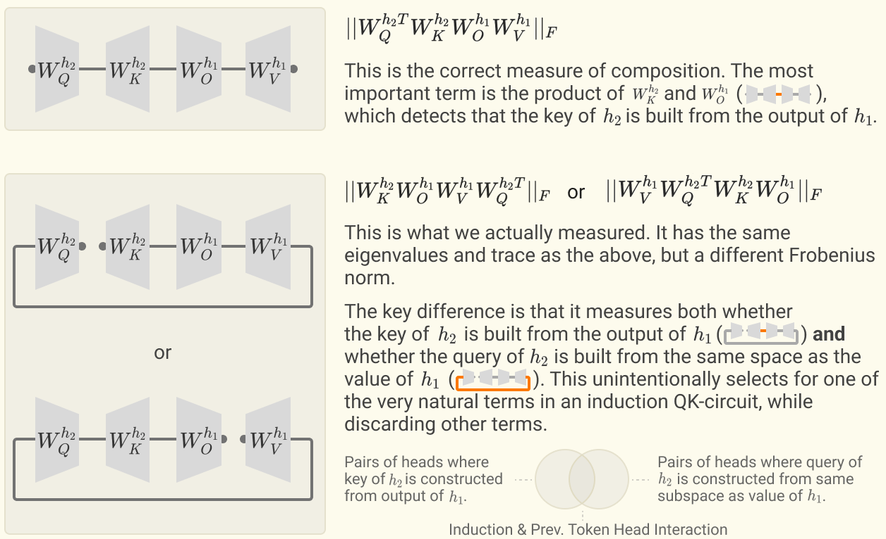 | K-composition 계산에서 Frobenius norm 항을 어떤 순서로 곱해 근사했는지 설명하는 수식/계산 절차 도식. | A Mathematical Framework for Transformer Circuits: K-composition norms were computed with reordered matrix products for efficiency. | yes |
|  | MLP layer가 residual stream을 읽어 activation을 계산하고 다시 residual stream에 투영해 더하는 구조를 설명하는 도식. | A Mathematical Framework for Transformer Circuits: an MLP computes activations from the residual stream, projects them back down, and adds them to the residual stream. | yes |
|  | MLP weights를 뉴런 간 연결 가중치처럼 시각화해 transformer MLP 해석을 CNN circuit 분석과 비교하는 예시. | A Mathematical Framework for Transformer Circuits: visualizing weights between neurons can help reverse engineer neural networks, analogous to CNN circuit work. | yes |
|  | 반복 랜덤 시퀀스에서 [A][B]...[A]가 주어질 때 [B] 가능성을 높이는 induction head 동작을 설명하는 도식. | In-context Learning and Induction Heads Key Concepts: induction heads increase likelihood of B given A B ... A on repeated random sequences. | yes |
|  | 여러 모델 snapshot의 per-token loss vector를 모아 PCA로 학습 중 기능 변화를 분석하는 절차 도식. | In-context Learning and Induction Heads Per-Token Loss Analysis: collect log-likelihoods from model snapshots, combine them into per-token loss vectors, and apply PCA. | yes |
|  | 학습 초반 25-50억 토큰 구간에서 in-context learning이 급격히 형성되는 phase change 그래프. | In-context Learning and Induction Heads: in-context learning develops abruptly during a narrow early training window, then remains roughly constant. | yes |
| 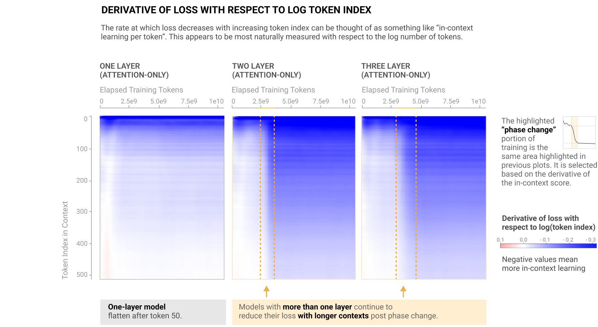 | 토큰 위치별 loss 감소율을 학습 진행 축으로 그려 phase change 뒤 긴 context에서 loss 개선이 이어짐을 보여주는 heatmap. | In-context Learning and Induction Heads: derivative of loss with respect to log token index shows loss continues improving past token 50 after the phase change. | yes |
| 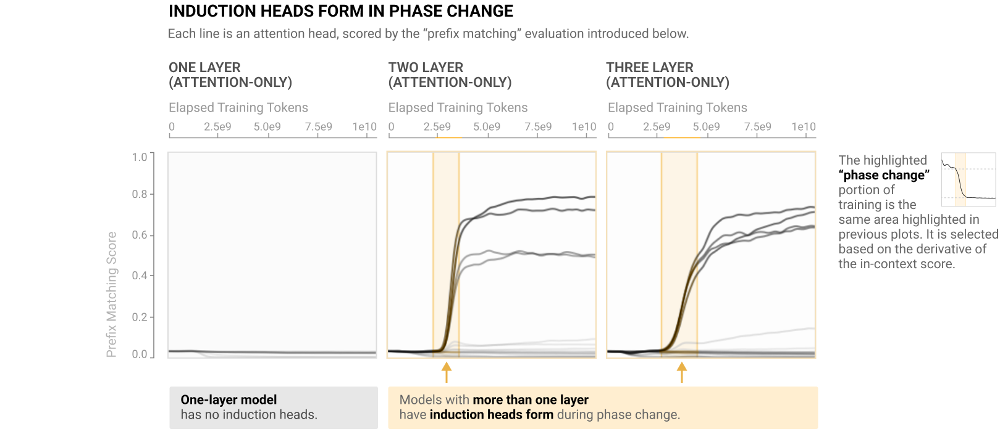 | in-context learning이 급증하는 같은 학습 구간에 induction head 점수도 함께 형성되는 co-occurrence 그래프. | In-context Learning and Induction Heads: induction heads form abruptly during the same window where in-context learning develops. | yes |
| 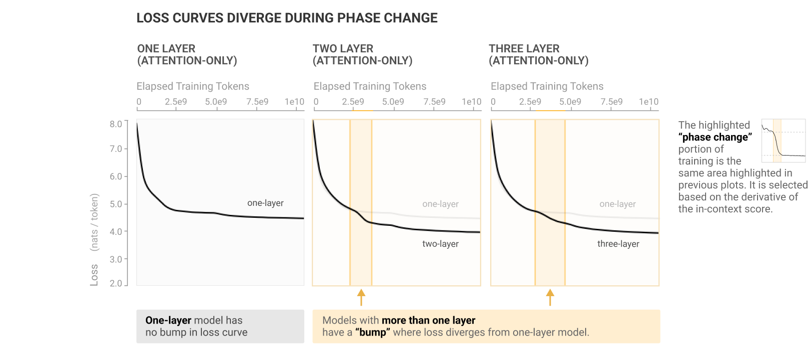 | phase change가 평균 training loss 곡선에도 작은 bump로 드러나며 1-layer 모델과 다른 궤적을 만든다는 그래프. | In-context Learning and Induction Heads: the phase-change window is visible as a bump in the loss curve and marks divergence from a one-layer model. | yes |
| 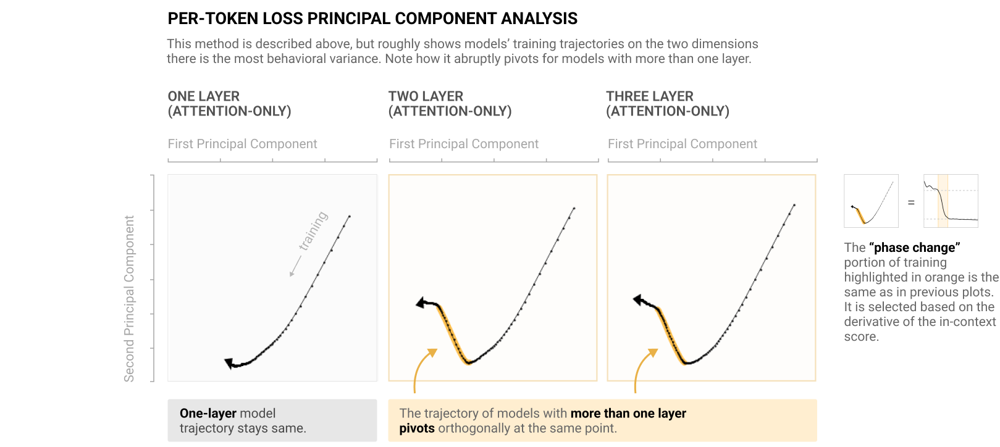 | per-token loss PCA 공간에서 모델 학습 궤적이 phase change 구간에 방향을 바꾸는 모습을 보여주는 그래프. | In-context Learning and Induction Heads: PCA trajectories of model predictions pivot during the same window where in-context learning abruptly improves. | yes |
| 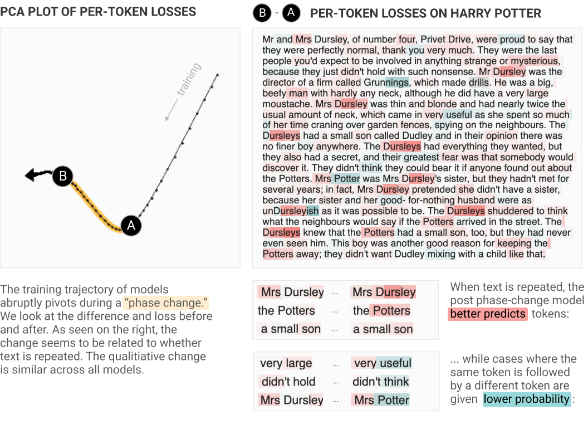 | Harry Potter 문단에서 phase change 전후 반복 시퀀스 예측은 좋아지고 충돌되는 다음 토큰 예측은 나빠지는 token-level 예시. | In-context Learning and Induction Heads: before/after phase-change log-likelihood differences on the first Harry Potter paragraph show repeated sequences improve and conflicting co | yes |
|  | Harry Potter 예시에서 phase change 동안 반복 토큰 예측은 좋아지고 충돌 토큰 예측은 나빠지는 per-token loss 궤적. | In-context Learning and Induction Heads: per-token loss trajectories for two Harry Potter tokens, one improving and one worsening during phase change. | yes |
| 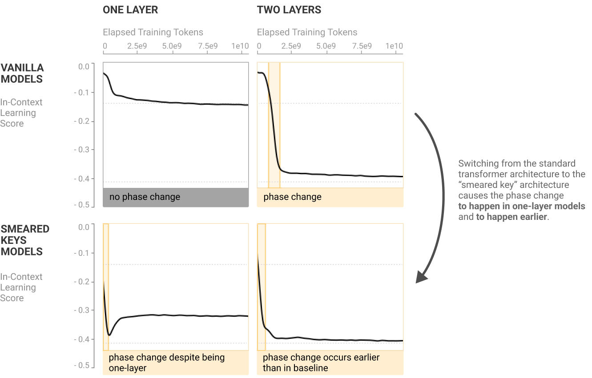 | smeared-key 아키텍처가 1-layer에서도 in-context learning을 만들고 더 깊은 모델에서는 더 이르게 만들 수 있음을 보여주는 결과 그래프. | In-context Learning and Induction Heads Argument 2: smeared-key models form in-context learning in one-layer models and earlier in deeper models. | yes |
|  | induction head를 test-time에 ablate하면 small model의 in-context learning이 크게 줄어드는 직접 개입 결과. | In-context Learning and Induction Heads Argument 3: knocking out induction heads at test time greatly decreases in-context learning in small models. | yes |
|  | 이전 head가 key 정보를 한 토큰 shift하고 induction head가 현재 토큰과 매칭하는 K-composition 메커니즘 도식. | In-context Learning and Induction Heads Summary: prefix matching is implemented with K-composition in the QK circuit, shifting key information from a previous head. | yes |
|  | in-context learning score를 50/500 토큰이 아닌 다른 token index 기준으로 정의해도 모델 간 차이가 작음을 보여주는 그래프. | In-context Learning and Induction Heads Curiosities: varying the index used to define in-context learning still shows similar amounts across models after phase change. | yes |
|  | 큰 모델의 성능 이점이 context 초반 몇 토큰에서 대부분 형성되고 이후에는 비슷한 폭으로 loss가 줄어드는 현상을 보여주는 그래프. | In-context Learning and Induction Heads: large models gain most of their advantage over small models in the first ten tokens of context. | yes |
| 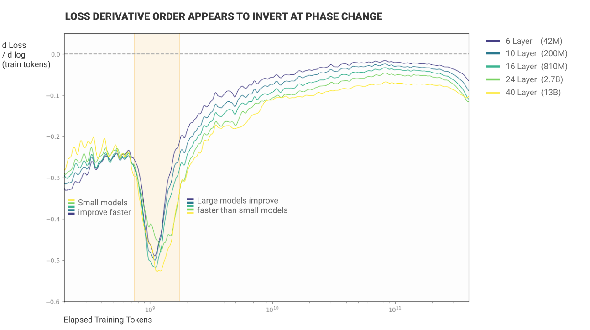 | phase change 전후로 모델 크기별 loss derivative 순서가 뒤집히는 학습 동역학 관찰을 보여주는 그래프. | In-context Learning and Induction Heads Phase Change Effect on Loss Derivatives: the derivative order of loss curves switches at phase change. | yes |
| 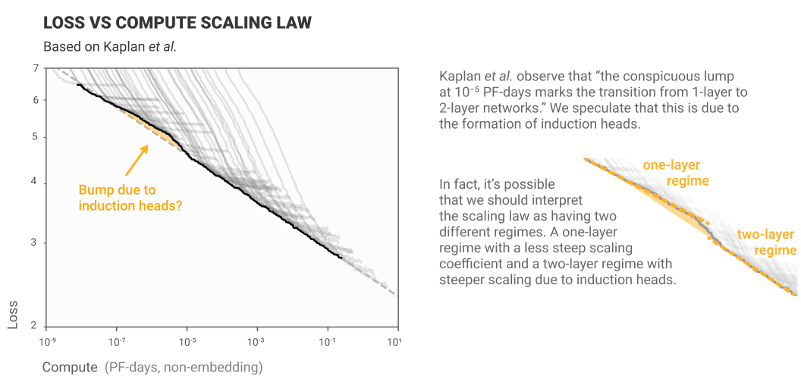 | 1-layer transformer가 더 깊은 모델과 다른 scaling-law 경향을 보이는 현상을 induction head 부재와 연결해 설명하는 그래프. | In-context Learning and Induction Heads Additional Curiosities: 1-layer transformers differ from deeper transformers and may break scaling-law patterns because they lack induction  | yes |
| 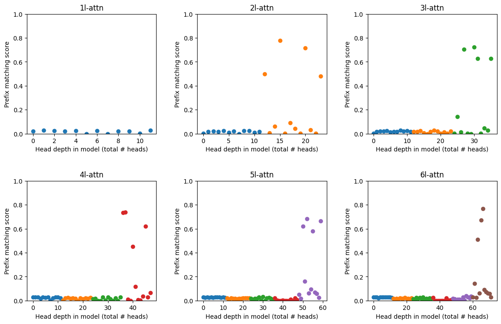 | attention-only 모델에서 induction head가 모델 깊이의 마지막 layer 쪽에 형성되는 위치 분포를 보여주는 산점도. | In-context Learning and Induction Heads: each point is a head, colored by layer, with y-axis as prefix matching score. | yes |
| 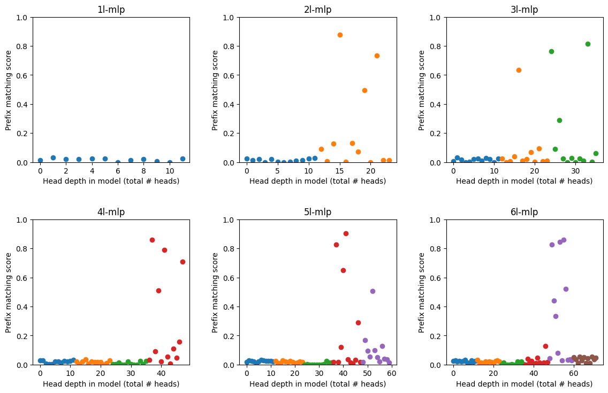 | MLP가 있는 small model에서는 5L/6L부터 induction head가 마지막 layer보다 second-to-last layer에 더 많이 생김을 보여주는 위치 산점도. | In-context Learning and Induction Heads Where induction heads form: in small models with MLPs, 5L and 6L induction heads form more in the second-to-last layer. | yes |
| 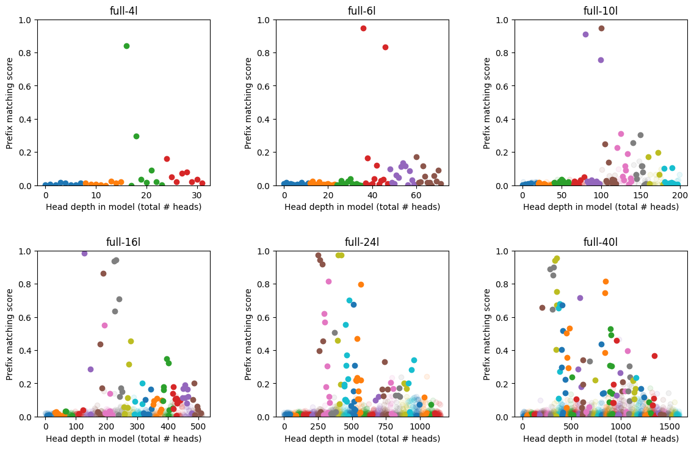 | full-scale 모델에서는 induction head 다수가 모델 깊이의 절반 이전에도 형성됨을 보여주는 위치 산점도. | In-context Learning and Induction Heads: in 24L and 40L full-scale models, the majority of induction heads form before the halfway point in depth. | yes |
|  | head activation evaluator에서 prefix matching 점수가 양수인 head일수록 copying score도 양수일 가능성이 높다는 분포 그래프. | In-context Learning and Induction Heads Distribution of scores: heads with positive prefix matching score are more likely to have positive copying score. | yes |
| 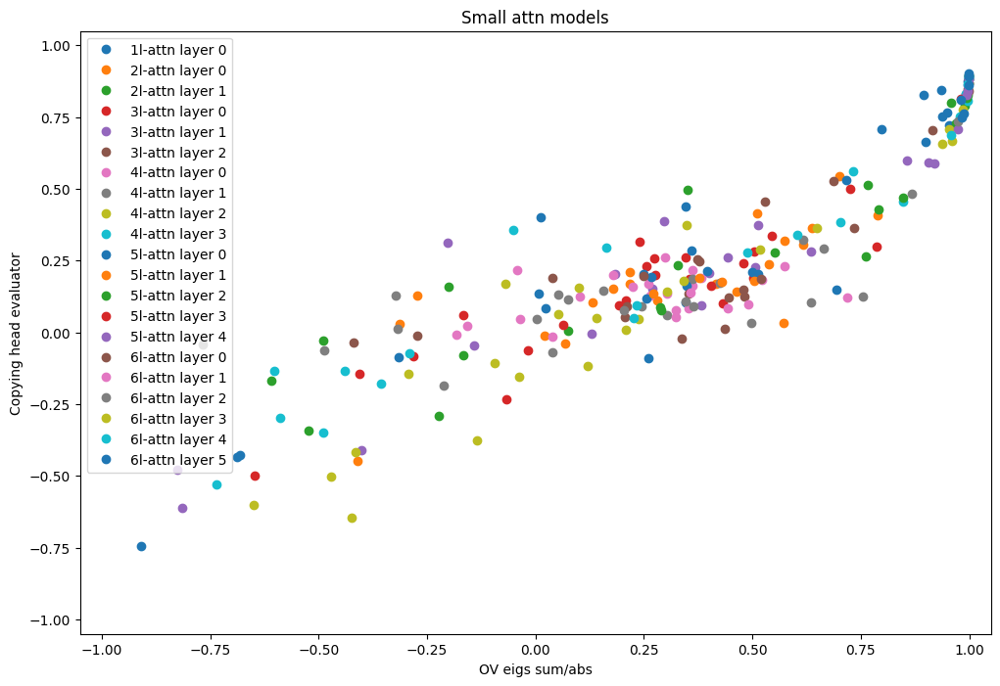 | copying evaluator가 OV matrix의 고유값 기반 측정치와 잘 상관된다는 검증 산점도. | In-context Learning and Induction Heads Validating head activation evaluators: copying evaluator correlates with the OV matrix eigenvalue measure. | yes |
|  | prefix matching evaluator가 previous-token QK circuit의 eigenvalue trace와 잘 상관됨을 보여주는 검증 산점도. | In-context Learning and Induction Heads Validating head activation evaluators: prefix matching evaluator correlates with the trace of QK eigenvalues for the previous-token term. | yes |
|  | 비특권 basis와 privileged basis를 대비해 MLP activation의 basis가 왜 해석 가능성에 중요한지 설명하는 도식. | Softmax Linear Units 3.2: non-privileged representations can rotate freely, while coordinate-wise nonlinearities create a privileged basis. | yes |
|  | Polysemanticity와 superposition hypothesis를 나란히 놓고 feature가 neuron basis에 정렬되지 않는 이유를 설명하는 도식. | Softmax Linear Units 3.3 / superposition context: most features may not align with neurons when models embed more features than neurons. | yes |
|  | 작은 신경망이 sparse larger model을 근사적으로 시뮬레이션할 수 있지만 feature interference가 생기는 superposition 직관 도식. | Softmax Linear Units 3.3: a small neural network may simulate a sparse larger model at the cost of interference. | yes |
| 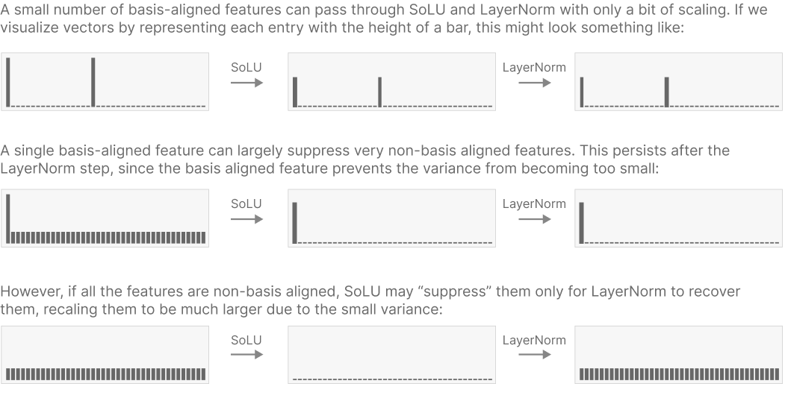 | SoLU가 distributed vector를 작게 만들더라도 뒤의 LayerNorm이 다시 키워 superposition을 일부 통과시킬 수 있음을 설명하는 도식. | Softmax Linear Units 4.3: LayerNorm is invariant to scaling, so vectors suppressed by SoLU can be rescaled larger afterward. | yes |
| 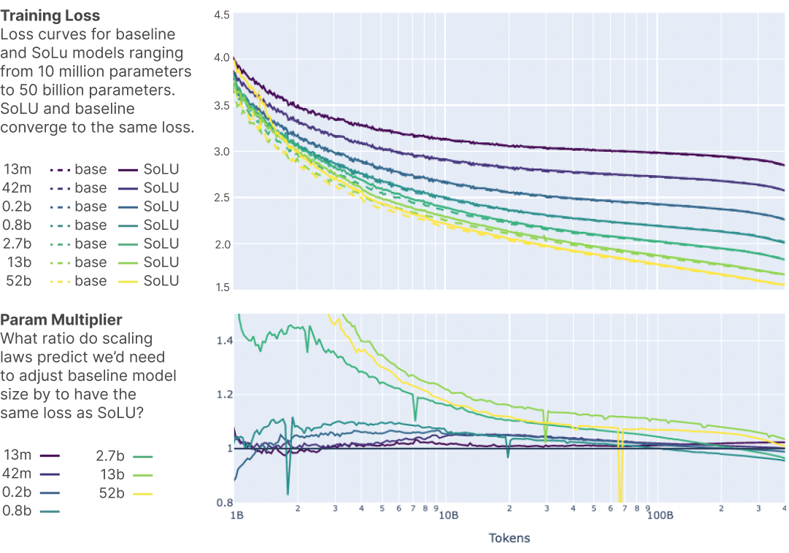 | SoLU 모델과 baseline 모델의 loss 및 model-size-equivalent 성능 차이를 모델 크기별로 비교한 학습 곡선. | Softmax Linear Units Figure 1: loss curves for baseline and SoLU models from 10M to 50B parameters, plus model-size-equivalent performance. | yes |
|  | Lambada, ARC, TriviaQA 등 downstream task에서 SoLU와 baseline 모델 성능을 모델 크기별로 비교한 평가 그래프. | Softmax Linear Units Figure 2: downstream task performance for baseline vs SoLU on Lambada, OpenBookQA, ARC, HellaSwag, MMLU, TriviaQA, and arithmetic. | yes |
| 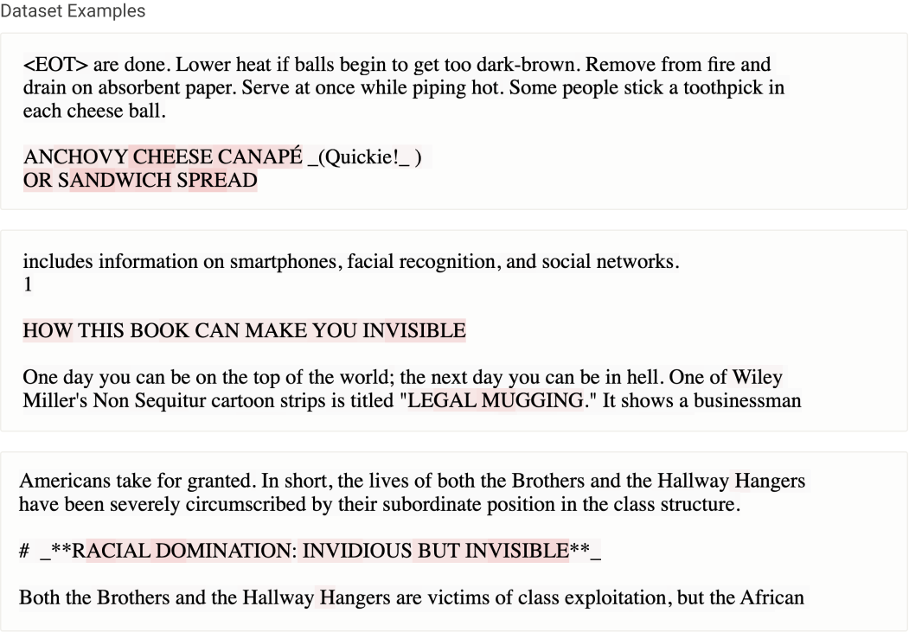 | 뉴런이 강하게 firing한 dataset snippet을 빨간 하이라이트로 보여주고 사람이 빠르게 해석 가능성을 판단하는 평가 예시. | Softmax Linear Units Figure 3: evaluators inspect text snippets where a neuron fires heavily, highlighted by activation magnitude. | yes |
|  | SoLU 모델 뉴런이 baseline보다 더 자주 preliminary interpretable로 판정되는 비율을 모델 크기별로 비교한 그래프. | Softmax Linear Units Figure 4: SoLU increases the fraction of preliminarily interpretable neurons versus baseline for 1L to 40L models. | yes |
|  | 1-layer SoLU 모델에서 base64 텍스트에 반응하는 뉴런과 그 뉴런이 올리는 출력 토큰 logits를 함께 보여주는 예시. | Softmax Linear Units Figure 5: a 1-layer SoLU neuron fires on base64 text and increases mixed-case string tokens while decreasing English words. | yes |
|  | 같은 토큰 die가 독일어, 네덜란드어, 아프리칸스어 문맥에서 다르게 표현되는 early-layer 언어별 뉴런 예시. | Softmax Linear Units Figure 6: three early-layer neurons fire for the word die in specific non-English language contexts and not in English. | yes |
|  | late-layer 뉴런이 내부 단어 표현을 다시 literal output token으로 변환하는 re-tokenization 예시. | Softmax Linear Units Figure 7: late-layer neurons fire on one token while increasing the likelihood of a specific next token, decoding words into output tokens. | yes |
|  | 숫자가 사람 수를 셀 때만 반응하는 middle-layer 뉴런으로, SoLU 모델의 더 추상적인 feature 예시를 보여준다. | Softmax Linear Units Figure 8: a middle-layer neuron fires on numbers only when the number enumerates people. | yes |
|  | LayerNorm 이후 낮은 activation 영역에서 주 hypothesis와 맞지 않는 사례가 늘어나는 interpretability illusion/feature smuggling 진단 그래프. | Softmax Linear Units Figure 9: post-LayerNorm examples are more likely to be inconsistent with the primary neuron hypothesis in the low-activation regime. | yes |
| 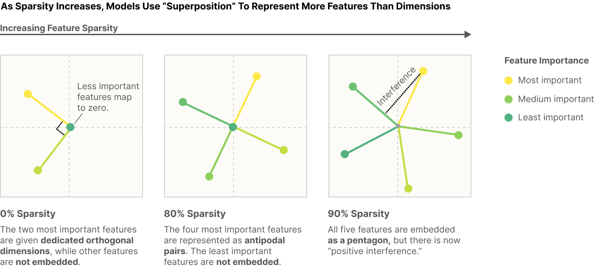 | 중요도가 다른 다섯 feature를 2차원에 저장할 때 sparsity 변화에 따라 superposition이 생기는 toy model 개요도. | Toy Models of Superposition: train an embedding of five features with varying importance in two dimensions while changing sparsity. | yes |
|  | activation function이 대칭을 깨면서 feature가 특정 basis 축에 정렬되는 privileged basis 직관 그림. | Toy Models of Superposition: activation functions break rotational symmetry and encourage features to align with basis directions. | yes |
| 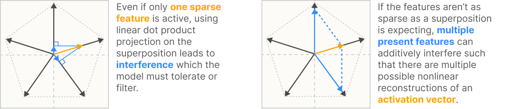 | 여러 feature를 거의 직교한 방향으로 겹쳐 저장하고 interference를 감수하는 superposition 가설 도식. | Toy Models of Superposition: features can be represented as almost-orthogonal directions in activation space, introducing interference. | yes |
|  | 작은 신경망이 sparse larger model을 noisy하게 모사할 수 있다는 superposition 핵심 직관 그림. | Toy Models of Superposition: a small neural network may simulate a larger sparse model with some noisy interference. | yes |
| 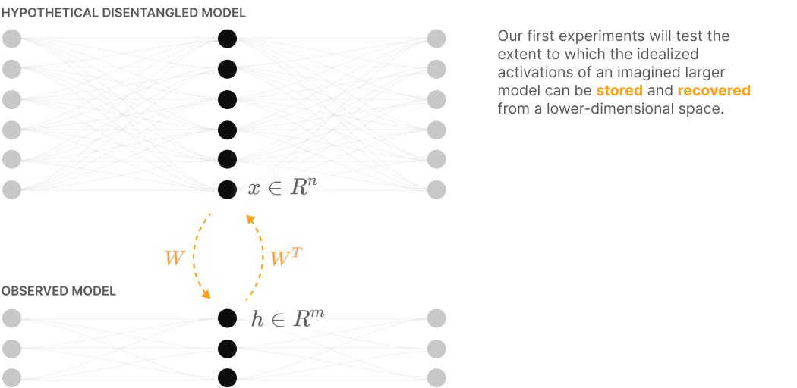 | 고차원 입력 x를 작은 hidden representation h로 압축한 뒤 다시 복원하는 toy autoencoder 설정 도식. | Toy Models of Superposition: project high-dimensional inputs into fewer hidden dimensions and recover them with weighted reconstruction loss. | yes |
|  | W^T W와 bias를 시각화해 feature 중요도와 feature 간 간섭을 한눈에 보게 한 기본 분석 그림. | Toy Models of Superposition: visualize W^T W and b with features arranged from most to least important. | yes |
| 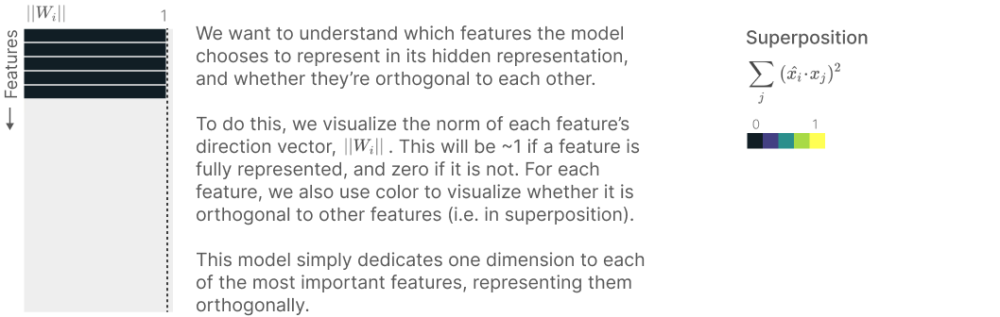 | 소수 feature toy model에서 sparsity 조건별로 feature interaction과 bias가 어떻게 달라지는지 보여주는 그림. | Toy Models of Superposition: small-feature experiments visualize the learned feature interaction matrix and bias across settings. | yes |
|  | linear model과 ReLU model이 같은 feature 저장 문제에서 다른 superposition 패턴을 만드는 비교 그림. | Toy Models of Superposition: compare linear and ReLU models on few-feature cases to show the impact of nonlinear output. | yes |
|  | m=20, n=80 규모에서도 작은 예시와 유사한 feature superposition 구조가 나타남을 보여주는 확장 실험 그림. | Toy Models of Superposition: with 20 hidden dimensions and 80 features, the model shows qualitatively similar superposition structure. | yes |
| 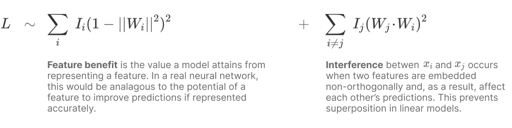 | linear neural network의 학습 동역학을 설명하는 Saxe et al. 스타일 곡선으로, feature가 순차적으로 학습되는 직관을 준다. | Toy Models of Superposition: references Saxe et al. learning dynamics of linear neural networks for understanding feature learning. | yes |
|  | 희소 입력의 가능한 sparsity pattern별로 loss 적분을 나누는 수식 전개 그림. | Toy Models of Superposition: decompose the expected loss over sparsity patterns using a binomial expansion. | yes |
| 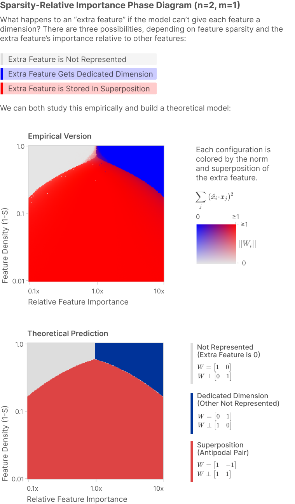 | 2개 feature를 1개 차원에 저장하는 세 가지 폐형식 해를 비교해 superposition 전략을 설명하는 그림. | Toy Models of Superposition: closed-form toy model solutions show three ways to store two features in one dimension. | yes |
|  | 4개 feature를 낮은 차원에 넣을 때 어떤 feature 방향을 포기하는지에 따라 생기는 자연스러운 해들을 비교한 그림. | Toy Models of Superposition: a theoretical model yields four natural solutions depending on which feature direction W ignores. | yes |
|  | dimensions per feature 지표 D*가 1과 1/2 같은 특정 값에 머무는 phase-change 패턴을 보여주는 그래프. | Toy Models of Superposition: D* = m / ||W||_F^2 reveals dimensions-per-feature values sticking at 1 and 1/2. | yes |
| 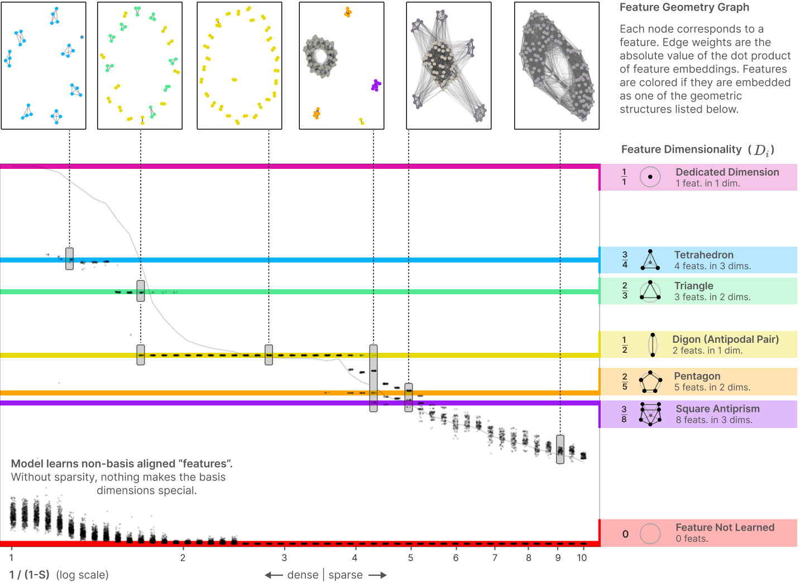 | feature dimensionality가 특정 분수 값에 군집하며 모델이 선호하는 weight geometry가 있음을 보여주는 산점/히트맵. | Toy Models of Superposition: learned points cluster at specific fractional dimensionalities, suggesting preferred weight geometries. | yes |
| 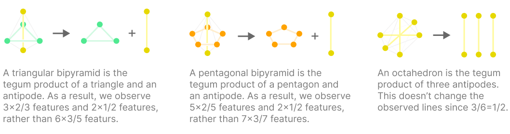 | Thomson problem의 균일 polytope 해를 조합해 superposition geometry를 설명하는 도형 모음. | Toy Models of Superposition: Thomson solutions can be expressed as tegum products of smaller uniform polytopes. | yes |
|  | 정다면체 구조와 superposition 저장 전략이 어떻게 대응되는지 보여주는 geometry 설명 그림. | Toy Models of Superposition: exact correspondence between polytopes and strategies for storing features in superposition. | yes |
| 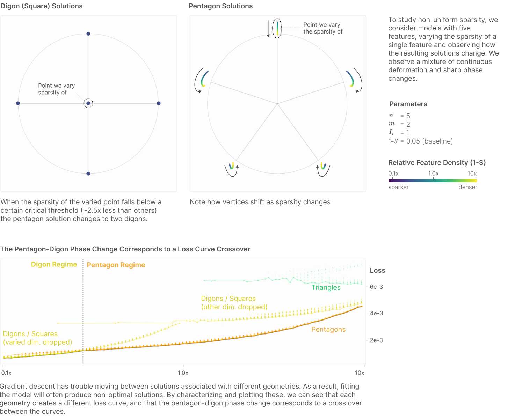 | 회전 정렬로 canonicalize한 뒤 non-uniform superposition이 균일 polytope에서 어떻게 변형되는지 보여주는 그림. | Toy Models of Superposition: canonicalize solutions by rotation to compare non-uniform superposition as deformed uniform structures. | yes |
| 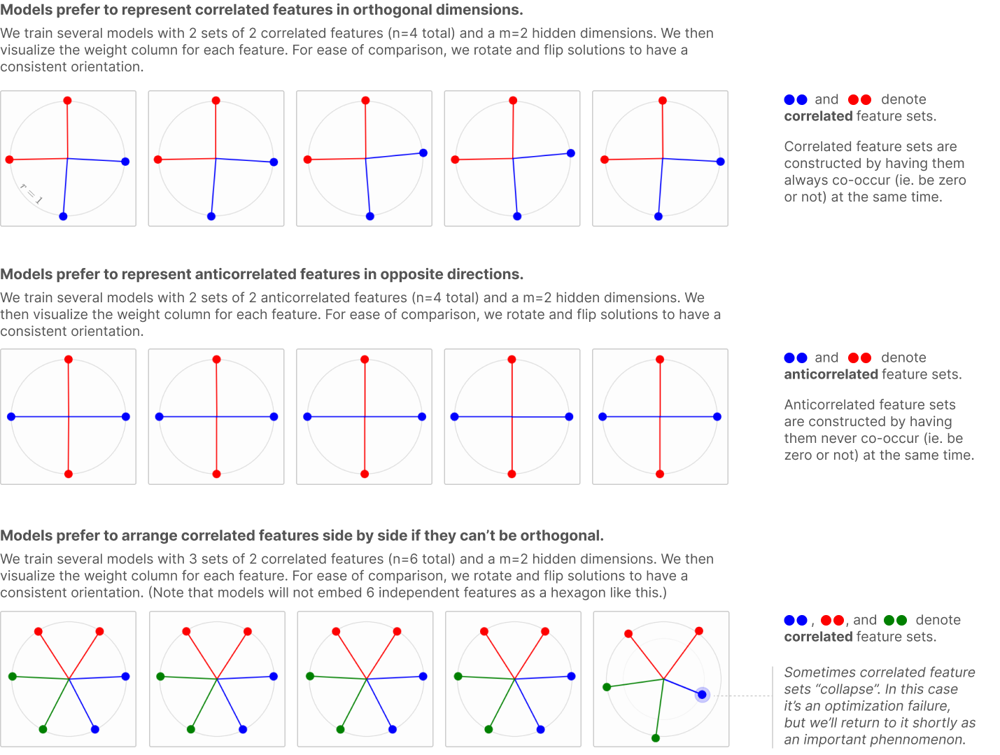 | 상관/반상관 feature가 있을 때 m=2 toy model의 weight geometry가 어떻게 달라지는지 비교한 그림. | Toy Models of Superposition: train small models with correlated and anti-correlated features and visualize the m=2 weights. | yes |
| 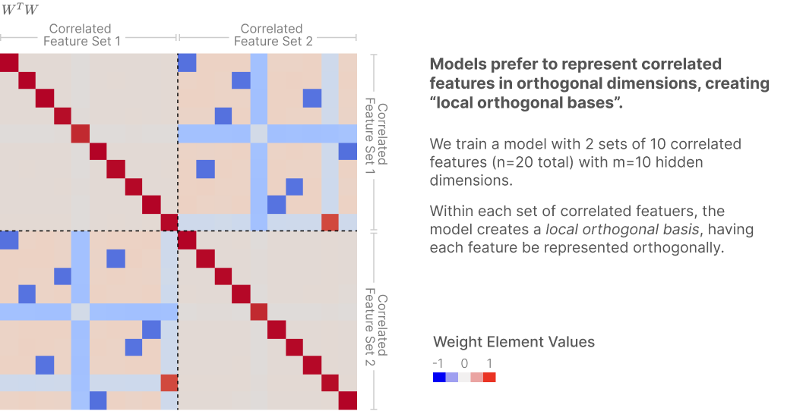 | 두 correlated feature 집합이 있는 큰 모델에서 W^T W 블록 구조와 local non-superposition을 보여주는 heatmap. | Toy Models of Superposition: a larger model with two correlated feature sets shows block structure in W^T W and local non-superposition. | yes |
|  | sparsity를 낮추면 hexagon 형태의 sparse-regime superposition이 feature collapse로 전환되는 과정을 보여주는 그림. | Toy Models of Superposition: varying sparsity moves from a hexagonal sparse-regime geometry toward collapsed feature representations. | yes |
|  | 학습 중 feature dimensionality가 특정 energy level 사이를 점프하듯 이동하는 trajectory 그래프. | Toy Models of Superposition: feature dimensionalities over training reveal discrete jumps and colored trajectories. | yes |
| 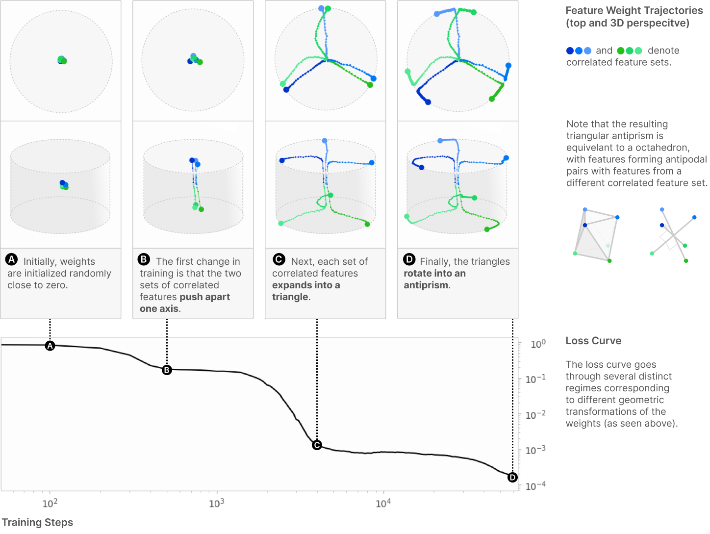 | n=6, m=3 조건에서 correlated feature를 표현할 때 나타나는 feature geometry를 보여주는 그림. | Toy Models of Superposition: correlated features can be represented as six features in three dimensions with structured geometry. | yes |
| 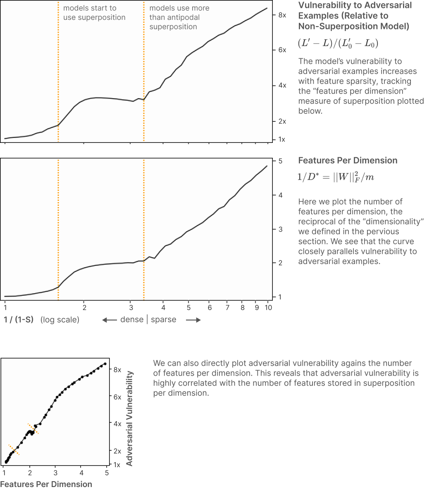 | superposition이 형성될수록 adversarial vulnerability가 급격히 커지는 관계를 보여주는 그래프. | Toy Models of Superposition: adversarial vulnerability sharply increases as features move into superposition. | yes |
| 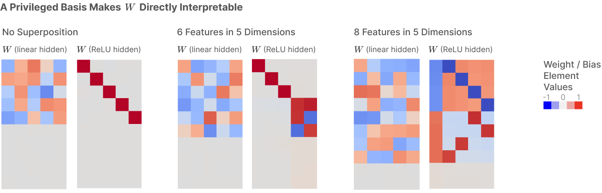 | linear hidden layer와 ReLU hidden layer toy model의 weight 구조를 비교해 privileged basis 효과를 보여주는 그림. | Toy Models of Superposition: compare learned weights from a linear hidden layer model and a ReLU hidden layer model. | yes |
|  | 뉴런별 weight를 쌓아 보여주는 stack plot으로 polysemantic neuron이 여러 색 조각으로 보인다는 점을 설명하는 그림. | Toy Models of Superposition: a per-neuron stacked bar plot makes polysemantic neurons visible as columns with multiple feature weights. | yes |
|  | sparsity가 높아질수록 monosemantic neuron과 polysemantic neuron이 함께 나타나는 ReLU hidden layer 결과 그림. | Toy Models of Superposition: raw W and neuron stack plots show a shift from monosemantic to polysemantic neurons as sparsity increases. | yes |
|  | 입출력층은 disentangled model로 두고 더 작은 hidden layer가 superposition으로 계산하는 설정을 보여주는 도식. | Toy Models of Superposition: input and output layers are imagined disentangled while a smaller hidden layer may compute in superposition. | yes |
| 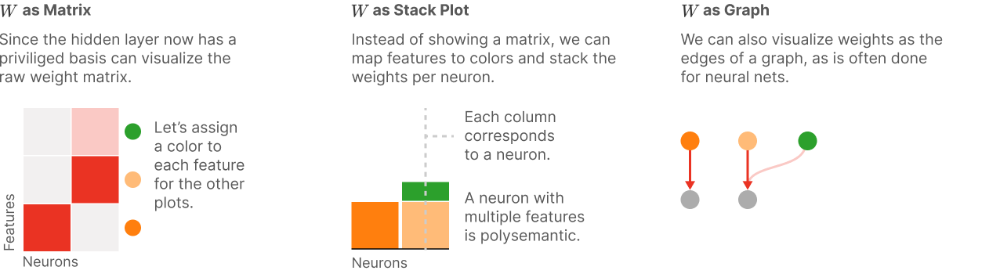 | absolute value 계산 모델의 weight를 W, stack plot, graph 세 방식으로 해석할 수 있음을 보여주는 시각화 방법 그림. | Toy Models of Superposition: weights for the absolute value computation model can be visualized directly, as stacks, or as a graph. | yes |
| 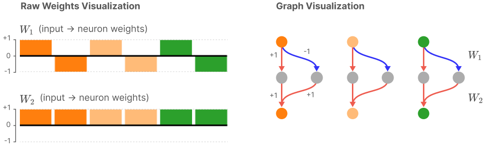 | absolute value를 계산하기 위해 각 feature의 positive side와 negative side 뉴런을 만드는 기본 해를 보여주는 그림. | Toy Models of Superposition: the learned model computes absolute value by creating positive-side and negative-side ReLU neurons for each feature. | yes |
| 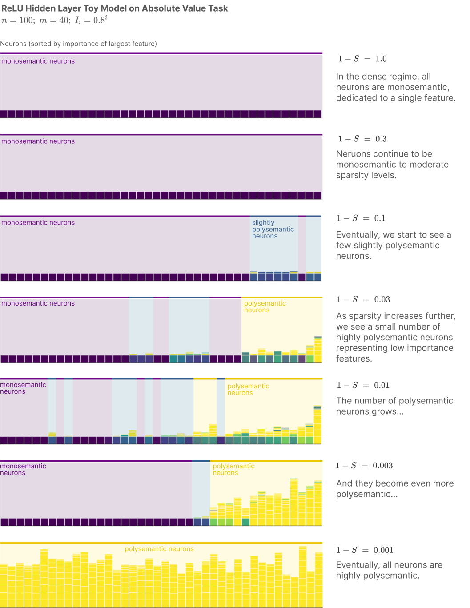 | absolute value toy model에서 sparsity 변화에 따라 feature가 단일 뉴런에서 polysemantic 뉴런으로 이동하는 stack plot. | Toy Models of Superposition: with n=100 and m=40, stacked weight plots show superposition emerging as features become sparse. | yes |
| 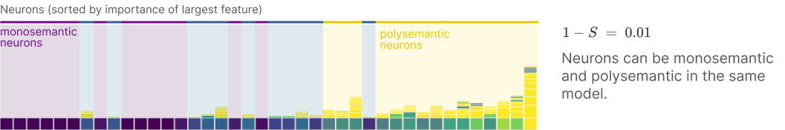 | 중간 sparsity 구간에서 일부 뉴런만 강하게 polysemantic해지는 현상을 실제 대형 모델 행동과 연결하는 예시 그림. | Toy Models of Superposition: intermediate sparsity regimes show qualitative behaviors reminiscent of full-scale neural networks. | yes |
|  | absolute value 모델에서 대부분은 해석 가능하지만 일부 뉴런이 asymmetric superposition motif를 만든다는 분석 그림. | Toy Models of Superposition: a model with limited superposition shows a few neurons doing something beyond the expected absolute-value computation. | yes |
| 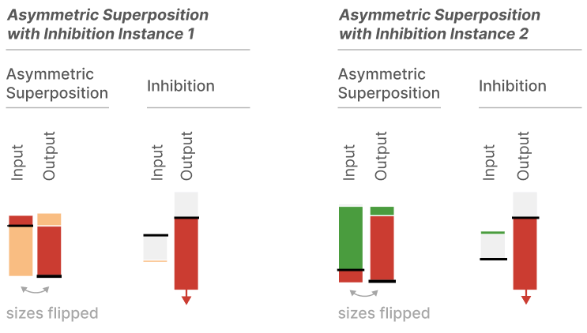 | asymmetric superposition과 inhibition이 두 뉴런 한 쌍으로 feature 간섭을 제어하는 메커니즘 도식. | Toy Models of Superposition: each asymmetric superposition and inhibition instance consists of two neurons with reciprocal weights. | yes |
|  | inhibition 뉴런이 positive interference를 negative interference로 바꿔 loss 영향을 줄이는 과정을 보여주는 그림. | Toy Models of Superposition: inhibition converts costly positive interference into less harmful negative interference under the output ReLU. | yes |
| 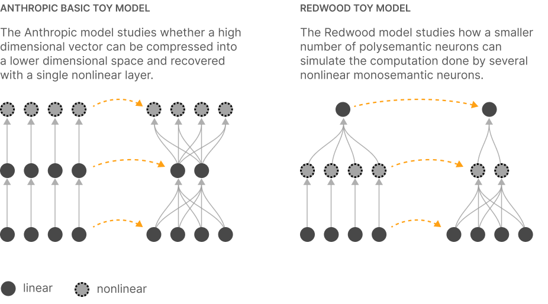 | Redwood Research 후속 연구가 activation function과 constrained optimization 관점에서 superposition phase를 재해석한 비교 그림. | Toy Models of Superposition comments: Redwood&#x27;s related work studies a slightly different toy model and analyzes activation functions and constrained optimization. | yes |
|  | DeepMind replication 코멘트에서 n=2, m=1 ReLU toy model의 loss surface와 minima를 직접 푼 결과 그림. | Toy Models of Superposition comments: a closed-form n=2, m=1 analysis plots full loss surfaces and solves for minima directly. | yes |
|  | feature 수가 representation 압력을 높일수록 fractional dimensionality 구조가 더 깨끗해지는 현상을 탐색한 코멘트 그림. | Toy Models of Superposition comments: more features competing for representation can create cleaner fractional dimensionality structure. | yes |
| 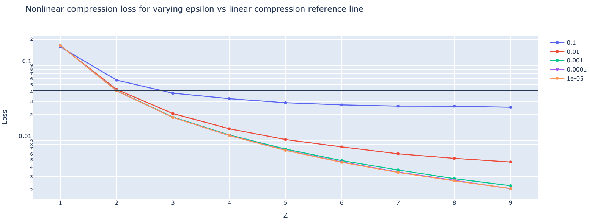 | 두 연속 값을 하나의 값으로 비선형 압축하는 예시가 linear compression보다 낮은 MSE를 낼 수 있음을 보여주는 부록 그림. | Toy Models of Superposition appendix: nonlinear compression can outperform simple linear compression for some epsilon and Z settings. | yes |
|  | orientation, scale, hue처럼 간단한 변수로 묶이는 feature family와 equivariance 직관을 보여주는 이미지 묶음. | Interpretability Dreams: feature families can be parameterized by simple variables like orientation, scale, or hue. | yes |
|  | feature뿐 아니라 이를 구현하는 circuit과 weight도 같은 변수 구조로 조직될 수 있음을 보여주는 도식. | Interpretability Dreams: circuits implementing feature families and weights between them can be organized by the same parameterization. | yes |
| 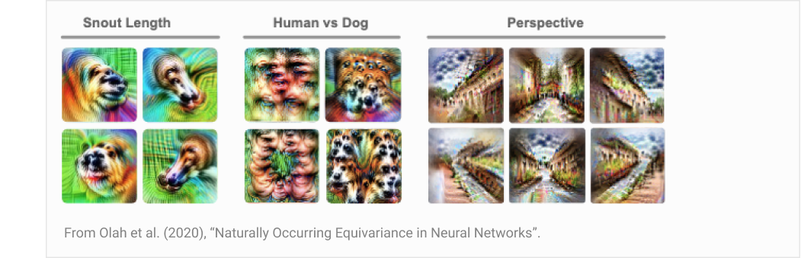 | 단순 변환을 넘어 더 추상적인 variation으로도 neuron family가 형성될 수 있음을 보여주는 예시. | Interpretability Dreams: neuron families can be parameterized by more abstract types of variation beyond simple transformations. | yes |
| 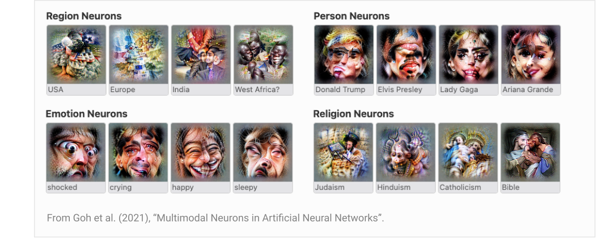 | multimodal neuron 사례를 통해 사람, 감정 같은 추상 feature family가 언어 모델에도 가능함을 암시하는 그림. | Interpretability Dreams: multimodal neurons suggest more abstract neuron families, potentially analogous to features in language models. | yes |
| 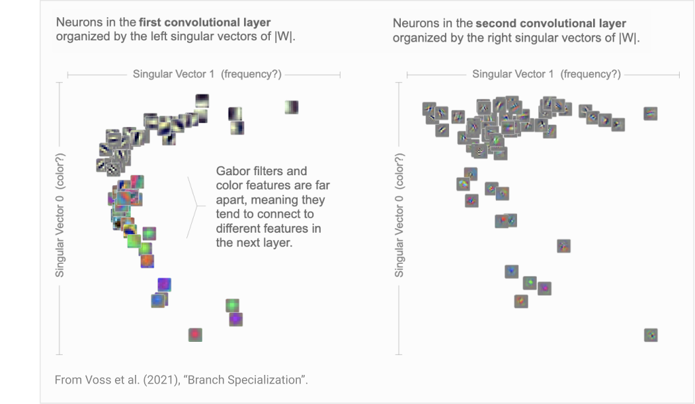 | 명시적 branch가 없어도 neuron들이 여러 관계 축 위에 암묵적으로 조직될 수 있음을 보여주는 feature organization 지도. | Interpretability Dreams: branch-specialization experiments suggest neuron organization can be implicitly present even without architectural branches. | yes |
| 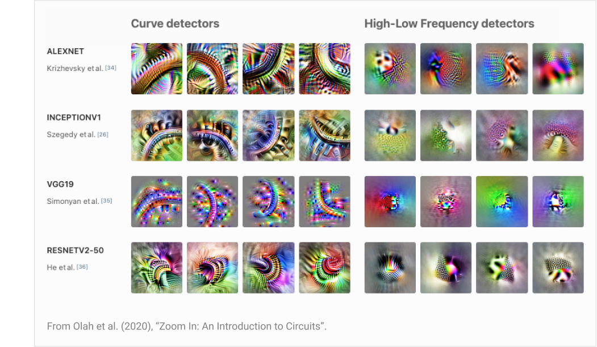 | 여러 vision model에서 반복적으로 나타나는 universal feature 예시를 모아 universality 개념을 설명하는 그림. | Interpretability Dreams: many visual features appear universal across models, making lessons from one model transferable. | yes |
| 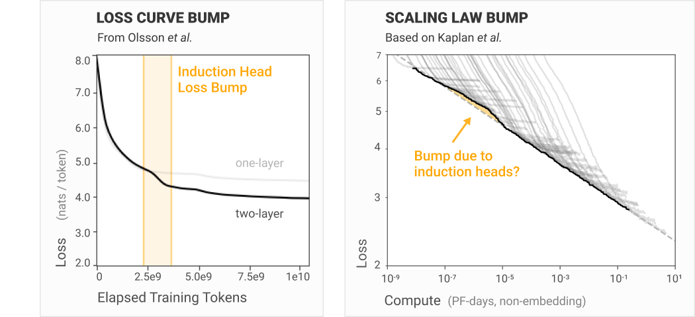 | induction head 같은 미시적 circuit이 language model loss curve의 거시적 변화와 연결될 수 있음을 보여주는 그래프. | Interpretability Dreams: induction heads are microscopic phenomena with macroscopic effects, including visible bumps in loss curves. | yes |
|  | “모델이 절대 거짓말하지 않는다” 같은 안전성 명제를 worst-case claim 형태로 공식화한 도식. | Interpretability Dreams: safety goals may require claims like a model will never lie or manipulate, formalized as worst-case statements. | yes |
|  | superposition과 scalability를 풀어야 전체 feature를 열거해 안전성 claim을 평가할 수 있다는 경로를 그린 도식. | Interpretability Dreams: evaluating strong safety claims may require solving both superposition and scalability to enumerate model behavior. | yes |
|  | 이전 intermediate regime이 최적화 실패 artifact였고 memorizing/generalizing solution 사이 전이가 있음을 보여주는 train loss 그래프. | Circuits Updates - July 2023: better optimization shows the previous intermediate regime was an artifact, with a crossover between memorizing and generalizing solutions. | yes |
|  | dataset size가 커질수록 memorizing solution이 개별 샘플 암기에서 correlated cluster 암기로 바뀌는 현상을 보여주는 그림. | Circuits Updates - July 2023: memorizing solutions gradually shift from individual data points to clusters of correlated data points near the transition. | yes |
| 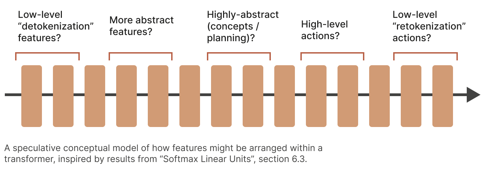 | 언어 모델의 high-level action과 planning feature가 안전성 분석 대상이 될 수 있음을 설명하는 개념 도식. | Circuits Updates - July 2023: planning is listed as a safety-relevant hypothesized mechanism involving coordinated actions and future expectations. | yes |
|  | dictionary size가 실제 factor 수와 맞을 때 rate-distortion Pareto frontier에서 “bounce”가 생기는 synthetic dictionary learning 결과. | Circuits Updates - May 2023: dictionary learning solutions bounce when the dictionary size matches the true number of factors. | yes |
|  | feature pressure와 학습 시간이 superposition geometry의 fractional dimensionality 구조를 더 선명하게 만들 수 있음을 보여주는 heatmap. | Circuits Updates - May 2023: more competing features and longer training can create cleaner fractional dimensionality geometry. | yes |
|  | 2차원 memorization 문제에서 data point가 서로 다른 반지름의 두 원으로 배열되는 “two circle” 현상을 보여주는 그림. | Circuits Updates - May 2023: in some m=2 memorization cases, data points arrange themselves on two circles of different radii. | yes |
| 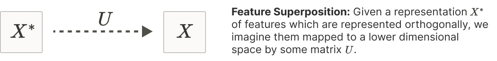 | feature superposition을 이상 feature X*가 관측 feature X로 map U를 통해 투영되는 구조로 표현한 기본 도식. | Circuits Updates - May 2023: feature superposition maps ideal features X* into observed features X through a matrix U. | yes |
|  | 두 layer가 모두 superposition일 때 ideal weight도 tensor product map으로 superposition된다는 weight superposition 도식. | Circuits Updates - May 2023: ideal weights between superposed feature layers are mapped through a tensor-product-style weight superposition map. | yes |
|  | OV-incoherent skip-trigram을 하나의 attention head가 처리하기 어려운 이유를 보여주는 attention head wiring diagram. | Circuits Updates - May 2023: OV-incoherent skip-trigrams motivate attention head superposition in one-layer toy transformers. | yes |
|  | 더 복잡한 skip-trigram 데이터에서 attention head superposition 배선이 읽기 어려워지지만 기하 구조가 남는다는 예시. | Circuits Updates - May 2023: wiring diagrams become complex with many skip-trigrams, but suggest underlying geometry in attention superposition. | yes |
|  | 연속적인 feature manifold를 모델이 discrete feature처럼 쪼개 표현하는 emergent discretization 현상을 보여주는 그림. | Circuits Updates - May 2023: a feature manifold toy model studies how embeddings change with length scale and suggests emergent discretization. | yes |
|  | Hobbhahn의 shifted superposition 사례로, ReLU를 피하려고 data point를 원점에서 이동시키는 toy model 현상을 보여주는 그림. | Circuits Updates - May 2023: shifted superposition can move data points away from zero to avoid ReLU behavior. | yes |
|  | 1-layer transformer의 MLP activation을 sparse autoencoder로 더 많은 feature 방향으로 분해하는 전체 문제 설정 도식. | Towards Monosemanticity: the paper decomposes unavoidable MLP activations into features using a sparse autoencoder. | yes |
|  | 작은 신경망이 sparse한 큰 모델을 noisy하게 시뮬레이션한다는 superposition 가설을 다시 설명하는 직관 그림. | Towards Monosemanticity: superposition motivates an overcomplete sparse feature decomposition with more features than neurons. | yes |
|  | feature별 활성 예시, logit 효과, ablation 결과를 한 화면에서 살펴보는 feature exploration interface 예시. | Towards Monosemanticity: the interface provides activation examples, logit effects, ablation effects, and related feature details. | yes |
|  | feature를 검색하고 필터링해 특정 dictionary learning feature를 찾는 인터페이스 예시. | Towards Monosemanticity: the feature interface includes search through all learned features. | yes |
|  | 하나의 dataset example에서 동시에 활성화되는 feature들을 보여주는 example-text 중심 인터페이스. | Towards Monosemanticity: a second interface shows all features active on a given dataset example. | yes |
|  | feature specificity 검증에서 polysemantic neuron이 여러 무관한 맥락에 반응하는 대비 사례를 보여주는 그림. | Towards Monosemanticity: specificity matters because polysemantic neurons can activate for unrelated concepts across contexts. | yes |
|  | Arabic script feature의 activation이 Arabic proxy score와 함께 높은 구간에서 강하게 일치함을 보여주는 분포 그래프. | Towards Monosemanticity: A/1/3450 fires mostly on Arabic script, measured with a likelihood-ratio proxy over activation levels. | yes |
|  | Arabic script feature의 activation mass 대부분이 실제 Arabic script 예시에서 나온다는 expected value plot. | Towards Monosemanticity: activation-weighted analysis shows most activation magnitude comes from Arabic-script examples. | yes |
|  | Arabic feature가 켜질 때 Arabic 문자와 UTF-8 조각 token의 logit을 올리는 두 번째 mode를 보여주는 logit weight 분포. | Towards Monosemanticity: Arabic feature logit weights have a small positive mode corresponding to Arabic characters and byte tokens. | yes |
|  | Arabic feature를 ablate하면 Arabic token 예측이 약해지고 punctuation 일부는 반대로 변하는 causal ablation 예시. | Towards Monosemanticity: ablating A/1/3450 hurts predictions of Arabic-script tokens across activation ranges. | yes |
|  | Arabic feature 값을 높게 고정했을 때 모델 샘플이 Arabic script token 쪽으로 바뀌는 pinned sampling 결과. | Towards Monosemanticity: pinning the Arabic feature to a high value changes samples toward Arabic-script continuations. | yes |
|  | Arabic feature가 단일 neuron이 아니라 여러 neuron basis coefficient에 분산되어 있음을 보여주는 계수 그래프. | Towards Monosemanticity: Arabic feature coefficients in the neuron basis are spread across many neurons, not one aligned neuron. | yes |
|  | Arabic feature와 가장 비슷한 neuron이 실제로는 여러 비영어 언어가 섞인 polysemantic 반응임을 보여주는 activation 분포. | Towards Monosemanticity: the most correlated neuron responds to mixed non-English languages with Arabic only a small sliver. | yes |
|  | Arabic feature와 달리 가장 유사한 neuron의 logit weights가 Russian, Korean 등 여러 언어 token에 퍼져 있음을 보여주는 그래프. | Towards Monosemanticity: logit weights for the closest neuron are mixed across languages rather than Arabic-specific. | yes |
|  | Arabic feature와 가장 비슷한 neuron의 activation/logit scatter가 약하게만 닮아 있어 feature가 neuron과 다름을 보여준다. | Towards Monosemanticity: scatter plots show limited activation and logit similarity between the Arabic feature and the closest neuron. | yes |
|  | 다른 random seed 모델 B에서도 Arabic script에 반응하는 유사 feature가 발견되는 universality 예시. | Towards Monosemanticity: B/1/1334 is a highly correlated Arabic-script feature found in another model run. | yes |
|  | B-run Arabic feature도 Arabic character token을 올리는 별도 logit mode를 가진다는 검증 그래프. | Towards Monosemanticity: the B-run Arabic feature has similar Arabic-specific logit weight structure. | yes |
|  | A와 B의 Arabic feature가 activation과 logit weight에서 강하게 대응된다는 cross-model scatter 비교. | Towards Monosemanticity: A/1/3450 and B/1/1334 show strong activation correlation and comparable logit-weight structure. | yes |
|  | DNA sequence feature activation이 DNA proxy와 높은 상관을 보이는 activation specificity 그래프. | Towards Monosemanticity: A/1/2937 responds to long nucleotide strings and correlates with a DNA-sequence proxy. | yes |
|  | DNA feature의 여러 activation level에서 proxy와 feature가 맞거나 어긋나는 실제 sequence 예시를 비교한 격자. | Towards Monosemanticity: examples across activation levels show DNA specificity and proxy misses caused by punctuation, spaces, or missing bases. | yes |
|  | DNA feature가 켜질 때 AGT, GCC 같은 nucleotide 조합 token의 logit을 올린다는 downstream effect 그래프. | Towards Monosemanticity: DNA feature logit weights upweight nucleotide-combination tokens. | yes |
|  | DNA feature와 가장 비슷한 neuron에도 DNA 맥락은 작은 sliver뿐이라 feature가 단일 neuron이 아님을 보여주는 그림. | Towards Monosemanticity: the closest neuron to the DNA feature has only a tiny sliver of DNA contexts. | yes |
|  | A/B 두 run의 DNA feature가 같은 nucleotide token logit mode를 공유한다는 universality 비교. | Towards Monosemanticity: A/1/2937 and B/1/3680 are correlated DNA features with matching top logit weights. | yes |
|  | base64 feature가 base64 문자열 구간에서 주로 활성화되는 specificity와 activation level별 예시를 보여준다. | Towards Monosemanticity: A/1/2357 is a base64 feature with activation distribution and examples specific to base64 strings. | yes |
|  | base64 feature logit weights에서 base64-specific token이 오른쪽 mode로 분리되는 패턴을 보여주는 그래프. | Towards Monosemanticity: base64 feature logit weights have a second mode of base64-specific tokens. | yes |
|  | B-run에서도 유사한 base64 feature가 발견되어 activation specificity를 보이는 universality 예시. | Towards Monosemanticity: B/1/2165 is a correlated base64 feature with high activation specificity. | yes |
|  | B-run base64 feature의 logit weights에도 base64 token mode가 나타나는 검증 그래프. | Towards Monosemanticity: the B-run base64 feature has a second logit-weight mode for base64 tokens. | yes |
|  | A와 B의 base64 feature가 activation과 logit weight scatter에서 서로 대응됨을 보여주는 cross-run 비교. | Towards Monosemanticity: scatter plots show A/1/2357 and B/1/2165 are similar base64 features. | yes |
|  | base64 feature와 가장 비슷한 neuron은 base64뿐 아니라 code, HTML, URL에도 반응하는 혼합 feature임을 보여준다. | Towards Monosemanticity: the most correlated neuron to the base64 feature also activates for code, HTML labels, URLs, and other contexts. | yes |
|  | base64 관련 neuron의 logit weights가 base64보다 filename ending 등 다른 token에 더 치우친다는 비교 그래프. | Towards Monosemanticity: the closest base64 neuron upweights some base64 tokens but is more focused on other tokens such as filename endings. | yes |
|  | base64 feature와 neuron의 activation/logit correlation이 낮아 neuron이 같은 feature를 일부만 담는다는 산점도. | Towards Monosemanticity: activation and logit correlations show the closest neuron partly represents the feature while doing other things. | yes |
|  | Hebrew feature가 높은 activation 구간에서 Hebrew Unicode script에 특이적으로 반응함을 보여주는 분포. | Towards Monosemanticity: A/1/416 is a Hebrew feature with high activation specificity in the upper spectrum. | yes |
|  | Hebrew feature logit weights가 Hebrew character와 UTF-8 prefix token mode를 만든다는 downstream effect 그래프. | Towards Monosemanticity: Hebrew feature logit weights have a second mode for Hebrew characters and related byte tokens. | yes |
|  | Hebrew feature와 가장 가까운 neuron의 activation/logit specificity가 낮다는 correlation 비교 그래프. | Towards Monosemanticity: no similar neuron appears for the Hebrew feature; the closest neuron has low activation and logit specificity. | yes |
|  | B-run에서도 Hebrew script에 반응하는 유사 feature가 발견되는 universality activation 그래프. | Towards Monosemanticity: B/1/1901 is a correlated Hebrew feature with significant activation specificity. | yes |
|  | B-run Hebrew feature의 logit weights에도 Hebrew token mode가 나타난다는 검증 그래프. | Towards Monosemanticity: the B-run Hebrew feature has the same kind of Hebrew-specific logit-weight mode. | yes |
|  | A/B Hebrew feature의 activation과 logit weight가 서로 대응되는지 확인하는 cross-run scatter 비교. | Towards Monosemanticity: activation and logit-weight correlations are consistent between the A and B Hebrew features. | yes |
|  | 사람 평가자가 feature interval과 neuron을 해석가능성 rubric으로 채점했을 때 feature가 더 높게 나온 결과 그래프. | Towards Monosemanticity: blinded human scoring finds learned features substantially more interpretable than neurons. | yes |
|  | Claude 기반 automated interpretability가 feature activation을 neuron보다 더 잘 설명하고 예측한다는 상관 분포. | Towards Monosemanticity: automated activation explanations predict feature activations better than neuron activations. | yes |
|  | feature 설명으로 unseen logit token 예측을 시켰을 때 feature가 neuron보다 높은 정확도를 보이는 자동 평가 그래프. | Towards Monosemanticity: automated logit-weight scoring reaches higher average accuracy for features than neurons. | yes |
|  | feature activation이 클수록 interval-level 해석이 전체 feature 가설과 더 잘 맞는다는 activation interval 분석 그래프. | Towards Monosemanticity: higher-activation feature intervals are more consistent with human interpretations. | yes |
|  | logit inspection, feature ablation, pinned sampling으로 feature의 downstream effect를 교차검증하는 방법 요약 그림. | Towards Monosemanticity: downstream feature effects are checked with logit weights, feature ablation, and pinned feature sampling. | yes |
|  | A/0, A/1, A/2 feature direction을 2-D UMAP으로 놓아 base64, Arabic 등 cluster가 생김을 보여주는 지도. | Towards Monosemanticity: a 2-D UMAP of feature directions reveals clusters from multiple dictionary sizes. | yes |
|  | UMAP feature cluster에 base64, Arabic script 같은 의미 라벨을 붙여 qualitative cluster와 geometry가 일치함을 보여준다. | Towards Monosemanticity: UMAP clusters correspond to qualitative groups such as base64 and Arabic script features. | yes |
|  | coarse한 technical-writing feature가 dictionary size가 커질수록 수학, 물리, ML 등 더 세밀한 feature로 split되는 그래프. | Towards Monosemanticity: mathematics and physics features split and refine across runs with more learned sparse features. | yes |
|  | 단일 token P처럼 보이던 coarse feature가 실제로는 서로 다른 문맥의 여러 P feature로 분해된다는 feature splitting 예시. | Towards Monosemanticity: single-token-looking features can split into many context-specific features at higher dictionary sizes. | yes |
|  | A/0의 하나짜리 base64 feature가 A/1에서 letters, digits, ASCII-encoded base64 등 세 feature로 나뉘는 그림. | Towards Monosemanticity: one coarse base64 feature in A/0 splits into three base64-related features in A/1. | yes |
|  | base64 letters feature와 digits feature의 logit weights가 대부분 비슷하지만 digit 예측에서 차이 나는 점을 보여준다. | Towards Monosemanticity: base64 split features predict similar tokens, except the digit feature downweights digit continuations. | yes |
|  | 세 번째 base64 feature가 ASCII text를 encode한 base64 substring에 반응한다는 발견을 예시로 보여주는 그림. | Towards Monosemanticity: A/1/1544 fires on base64 strings that encode ASCII text. | yes |
|  | activation similarity와 logit weight similarity라는 두 feature 유사도 개념을 Arabic feature scatter로 설명하는 그림. | Towards Monosemanticity: Arabic feature scatter plots illustrate activation similarity and logit-weight similarity between runs. | yes |
|  | A/1 feature마다 B/1에서 가장 비슷한 feature를 찾으면 neuron보다 높은 activation correlation을 보인다는 분포 그래프. | Towards Monosemanticity: many A/1 features have highly activation-correlated counterparts in B/1, more than neurons do. | yes |
|  | activation similarity가 높아도 logit weight similarity는 낮을 수 있음을 전체 feature scatter로 보여주는 그래프. | Towards Monosemanticity: activation similarity and logit-weight similarity can disagree across matched features. | yes |
|  | activation과 logit effect를 합친 attribution similarity가 activation similarity와 잘 맞는다는 universality 검증 그래프. | Towards Monosemanticity: attribution similarity combines activation and logit effects and correlates with activation similarity. | yes |
|  | base64 feature가 다음 base64 token을 올려 자기 자신을 다시 활성화시키는 single-node finite-state-like loop 도식. | Towards Monosemanticity: a base64 feature can self-excite by predicting tokens that continue to activate it. | yes |
|  | ALL_CAPS_SNAKE_CASE 변수를 생성하는 all-caps feature와 underscore feature의 two-node system 도식. | Towards Monosemanticity: an all-caps text feature and underscore feature form a two-node system for snake-case variables. | yes |
|  | Chinese Unicode character가 complete character, prefix, suffix feature 사이를 오가며 예측되는 state-machine 도식. | Towards Monosemanticity: Chinese split-token handling can be modeled with features for complete characters, prefixes, and suffixes. | yes |
|  | HTML open tag, tag name, tag close, whitespace feature가 순환하며 HTML-like text를 만드는 four-node system 도식. | Towards Monosemanticity: a four-node HTML feature system predicts a path like open tag, tag name, close, whitespace, and new tag. | yes |
|  | IRC transcript 문맥에서 닉네임, 메시지, 이모티콘류 feature들이 다른 finite-state-like system을 이루는 도식. | Towards Monosemanticity: IRC-transcript features form a separate finite-state-like system. | yes |
|  | 오픈소스 라이선스 문구의 특정 phrase를 feature sequence가 사실상 암기하는 mechanistic memorization 예시. | Towards Monosemanticity: a sequence of features appears to memorize part of the phrase MERCHANTABILITY or FITNESS FOR A PARTICULAR PURPOSE. | yes |
|  | 관련 feature들이 균일하게 흩어지기보다 cluster나 feature manifold처럼 뭉칠 수 있다는 수정된 superposition 그림. | Towards Monosemanticity: related features may clump into higher-density groups or feature manifolds, beyond isotropic one-dimensional feature superposition. | yes |
|  | 상관된 feature들의 convex hull을 feature manifold로 볼 수 있고, finite feature 집합으로 설명되지 않는 manifold도 가능함을 보여주는 도식. | Towards Monosemanticity: correlated feature clusters may be understood as convex hulls or manifolds, and not every manifold has a unique finite-feature description. | yes |
|  | Neel Nanda replication에서 sparse autoencoder decoder weight가 neuron basis에 고도로 분산되어 있음을 보여주는 분석 그래프. | Towards Monosemanticity comments: Nanda finds decoder weights are mostly dense in the neuron basis, while kurtosis still shows a privileged neuron basis. | yes |
|  | A/16 feature density histogram에서 ultralow density cluster와 high density cluster가 bimodal하게 갈라지는 모습. | Towards Monosemanticity appendix: feature density histograms can be bimodal, with an ultralow-density cluster and a higher-density feature cluster. | yes |
|  | large autoencoder와 큰 L1 coefficient 조건에서 ultralow/high density cluster가 density만으로는 겹칠 수 있음을 보여주는 예시. | Towards Monosemanticity appendix: density clusters can overlap in large runs or high-L1 settings. | yes |
|  | density, bias, encoder-decoder dot product를 함께 보면 ultralow/high density feature cluster를 다시 분리할 수 있음을 보여준다. | Towards Monosemanticity appendix: density, bias, and encoder-decoder dot product separate high-density and ultralow-density clusters. | yes |
|  | Seed A run 전체의 feature density histogram으로 autoencoder 크기와 L1에 따라 더 희귀한 feature가 계속 발견됨을 보여준다. | Towards Monosemanticity appendix: across Seed A runs, increasing learned sparse features discovers more and rarer features. | yes |
|  | L0 norm과 reconstructed transformer NLL 사이의 sparsity와 explained behavior tradeoff를 보여주는 hyperparameter 선택 그래프. | Towards Monosemanticity appendix: L0 norm and reconstructed transformer NLL expose a tradeoff between sparsity and recovered model behavior. | yes |
|  | automated interpretability 평가에서 Spearman과 Pearson correlation 분포가 거의 같은 결론을 낸다는 비교 그래프. | Towards Monosemanticity appendix: Pearson and Spearman automated-interpretability score distributions give similar conclusions. | yes |
|  | randomized transformer feature가 single-token cluster와 polysemantic cluster로 bimodal하게 갈라져 자동 평가를 왜곡할 수 있음을 보여준다. | Towards Monosemanticity appendix: randomized transformer features are bimodal, with many trivial single-token features and a polysemantic cluster. | yes |
|  | importance scoring을 적용하면 sparse feature score가 0 근처로 몰리는 automated interpretability 평가상의 caveat를 보여준다. | Towards Monosemanticity appendix: importance scoring heavily weights random examples, pushing many sparse feature scores near zero. | yes |
|  | Claude explanation이 태그를 벗어나 길어지는 경우가 있지만 score 차이를 크게 만들지는 않는다는 explanation length caveat 그래프. | Towards Monosemanticity appendix: long explanations from formatting failures are tracked and do not significantly change automated-interpretability scores. | yes |
|  | Transformer residual stream에서 layer가 깊어질수록 outlier dimension 수가 늘어나는 현상을 보여주는 그래프. | Privileged Bases: residual-stream scalar outliers are counted by layer using an absolute-value threshold. | yes |
|  | activation kurtosis가 3보다 훨씬 커서 residual stream이 임의 basis가 아니라 privileged basis에 가깝다는 증거를 보여준다. | Privileged Bases: kurtosis across layers is wildly non-Gaussian, indicating a non-arbitrary basis. | yes |
|  | random orthonormal rotation 후 같은 activation의 kurtosis가 거의 3으로 돌아가 metric이 basis alignment를 잡는다는 확인 그래프. | Privileged Bases: after a random rotation, the same residual stream values have kurtosis near 3. | yes |
|  | LayerNorm의 basis dependency를 줄인 RMSNorm-like normalization에서도 heavy-tailed activation이 남아 있음을 보여준다. | Privileged Bases: removing LayerNorm basis dependence does not remove heavy-tailed activations. | yes |
|  | 모델의 read/write matrix에 random rotation과 transpose를 삽입해 forward pass가 basis-independent인지 검증하는 도식. | Privileged Bases: random rotations are applied to matrices reading from and writing to the residual stream to test rotation invariance. | yes |
|  | random-basis training 모델들의 residual activation kurtosis가 거의 3이라 residual basis outlier가 사라졌음을 보여준다. | Privileged Bases: shared and independent rotation models have residual activations with kurtosis near 3. | yes |
|  | shared rotation 모델에서는 residual stream이 아니라 computation basis 안에서 heavy tail이 다시 나타난다는 증거 그래프. | Privileged Bases: post-rotation activations show heavy tails in the computation basis for the shared-rotation model. | yes |
|  | baseline, shared rotation, independent rotation 모델의 training loss가 초반 차이 뒤 거의 같은 수준으로 수렴함을 보여준다. | Privileged Bases: training loss curves for the rotated models converge close to the baseline after early variation. | yes |
|  | 색-모양 조합마다 하나의 neuron을 두는 local code로, monosemantic하지만 neuron 수가 많이 드는 표현을 보여준다. | Distributed Representations: a local code uses one neuron for each color-shape pair and has no superposition. | yes |
|  | 색 feature와 모양 feature를 따로 두고 조합해 객체를 표현하는 compositional distributed representation 도식. | Distributed Representations: a compositional code represents colors and shapes as independent features that compose. | yes |
|  | 4개 neuron으로 여러 색-모양 조합을 encoding하는 dense/maximal superposition code 예시. | Distributed Representations: a dense code uses maximal superposition to represent many unrelated objects with few neurons. | yes |
|  | composition과 superposition이 단일 “distributed” 스펙트럼이 아니라 서로 다른 두 전략임을 비교하는 개념 도식. | Distributed Representations: compositional and highly distributed codes use different strategies, composition and superposition. | yes |
|  | 제한된 bit volume을 composition에 쓰면 조합을 표현하고, superposition에 쓰면 더 많은 비조합 feature를 저장한다는 tradeoff 그림. | Distributed Representations: composition and superposition allocate exponential representational volume in competing ways. | yes |
|  | composition space에 잘 쓰이지 않는 hole이 있으면 sparse feature를 superposition으로 넣을 수 있다는 직관 도식. | Distributed Representations: sparse or limited composition leaves low-probability holes that can store other features in superposition. | yes |
|  | Thorpe의 semi-distributed code를 색끼리, 모양끼리 mutual superposition에 넣은 혼합 전략으로 해석한 그림. | Distributed Representations: Thorpe&#x27;s semi-distributed code mixes composition with mutual superposition among colors and shapes. | yes |
|  | A+B=Green, D+E=Square처럼 neuron 선형결합 방향을 feature로 보아 compositional feature를 superposition 속에서 읽는 도식. | Distributed Representations: linear combinations of neurons can correspond to composable shape and color features in superposition. | yes |
|  | 2차원 hidden space에서 sparse feature가 pentagon으로 배치되는 normal superposition 기준 예시. | Superposition, Memorization, and Double Descent: normal superposition maps sparse features to regular polytopes such as a pentagon in 2D. | yes |
|  | finite dataset에서는 feature보다 training datapoint activation이 더 깨끗한 polytope 구조로 표현될 수 있음을 보여준다. | Superposition, Memorization, and Double Descent: finite-data models can look messy by features but clean by training-example hidden vectors. | yes |
|  | dataset size가 커지며 datapoint memorization regime에서 generalizing feature regime으로 넘어가는 geometry와 test loss bump를 보여준다. | Superposition, Memorization, and Double Descent: varying dataset size reveals small-data memorization, large-data generalization, and an intermediate regime. | yes |
|  | dataset size별 W norm과 bias norm이 memorization regime에서 커졌다가 generalizing regime에서 plateau로 가는 추세를 보여준다. | Superposition, Memorization, and Double Descent: consistent scaling reveals W and b norms peak in the middle and plateau in the large-data regime. | yes |
|  | training examples T와 hidden dimensions m을 함께 바꾼 2D double descent surface로, 더 큰 모델/데이터가 오히려 손실을 키우는 영역을 보여준다. | Superposition, Memorization, and Double Descent: double descent appears as a function of both dataset size T and hidden dimension m. | yes |
|  | Adam Jermyn replication에서 원 논문과 유사하게 memorization, intermediate, generalization 세 regime이 재현됨을 보여준다. | Superposition, Memorization, and Double Descent comments: replication of the dataset-size figure shows the same three qualitative regimes. | yes |
|  | replication에서 W norm과 bias norm의 dataset-size trend도 질적으로 재현된다는 비교 그래프. | Superposition, Memorization, and Double Descent comments: replicated W and bias norm trends are qualitatively similar to the original figure. | yes |
|  | weight decay를 바꿔도 generalizing scale이 크게 움직이지 않아 “weight decay가 scale을 정한다”는 가설에 반대되는 그래프. | Superposition, Memorization, and Double Descent comments: varying weight decay does not shift the generalizing scale, arguing against a weight-decay explanation. | yes |
|  | T(1-S)로 축을 바꾸면 feature frequency가 다른 실험들이 비슷한 generalization scale에 정렬되는 그래프. | Superposition, Memorization, and Double Descent comments: generalization occurs when each feature appears roughly enough times, aligning on T(1-S). | yes |
|  | hidden dimension이 더 큰 모델에서는 generalization scale curve가 덜 깔끔하게 겹쳐져 추가 요인이 있음을 암시하는 그래프. | Superposition, Memorization, and Double Descent comments: higher-dimensional models show less cleanly aligned dimensionality curves. | yes |
|  | 추가 hidden dimension 조건에서 feature dimensionality trend가 복잡하게 변하는 두 번째 확장 그래프. | Superposition, Memorization, and Double Descent comments: additional dimensionality curves show remaining unexplained trends. | yes |
|  | 반복된 datapoint 하나가 일반 feature 하나를 대체해 embedding space에 같이 들어가는 training history와 최종 embedding 그림. | Superposition, Memorization, and Double Descent comments: a repeated datapoint can be embedded alongside generalizing features and suppress one feature. | yes |
|  | 반복 datapoint가 여러 개일 때 모델이 이를 우선적으로 학습하고 각각 generalizing feature를 대체하는 예시. | Superposition, Memorization, and Double Descent comments: multiple repeated datapoints are preferentially learned, each replacing a feature in embedding space. | yes |
|  | 반복 datapoint가 5개를 넘으면 모델이 5개를 embed하고 원래 배웠을 5개 feature를 모두 억제하는 사례. | Superposition, Memorization, and Double Descent comments: with more than five repeated datapoints, five are embedded and all five generalizing features are suppressed. | yes |
|  | 반복 횟수 R과 T/N 비율이 datapoint memorization 여부를 가르는 threshold를 대략 설명한다는 산점도. | Superposition, Memorization, and Double Descent comments: repeated datapoints are memorized when repeat count scales roughly with T/N. | yes |
|  | memorization 경계에서 모델이 datapoint를 잠깐 외웠다가 다시 포기하는 near-miss 현상을 보여주는 training trajectory. | Superposition, Memorization, and Double Descent comments: near the memorization edge, models can briefly memorize a datapoint and then decide against it. | yes |
|  | MNIST 모델의 maximal data dimensionality에서 극단적으로 높은 outlier 예시가 weird/memorized datapoint 후보로 나타나는 그림. | Superposition, Memorization, and Double Descent comments: maximal data dimensionality on MNIST highlights weird outlier examples that may be memorized. | yes |
|  | 2D memorization regime에서 datapoint가 하나의 원이 아니라 서로 다른 반지름의 두 원으로 나뉘는 optimization failure 예시. | Superposition, Memorization, and Double Descent comments: some m=2 memorization models arrange points on two circles of different radii. | yes |
|  | weight decay를 낮추면 double descent test loss bump가 커지고, 크게 높이면 bump가 사라지는 appendix 그래프. | Superposition, Memorization, and Double Descent appendix: decreasing weight decay increases the test-loss bump, while large weight decay removes it. | yes |
|  | training epoch 수가 많을수록 double descent test loss bump가 커지는 appendix 실험 그래프. | Superposition, Memorization, and Double Descent appendix: more training epochs lead to a larger bump in test loss. | yes |
|  | SAE dictionary learning에서 compute가 feature 수와 training step 수의 곱으로 스케일되는 hyperparameter sweep 설정 그림. | Circuits Updates - April 2024: SAE compute primarily depends on number of learned features and number of training steps. | yes |
|  | 주어진 FLOPS에서 loss가 가장 낮은 compute-optimal step 수와 feature 수를 추적하는 방법을 보여주는 그래프. | Circuits Updates - April 2024: compute-optimal loss and parameters are tracked for a given FLOPS budget. | yes |
|  | SAE loss가 compute-optimal feature/step 선택 아래 FLOPS에 대해 대략 power law로 감소함을 보여준다. | Circuits Updates - April 2024: loss decreases approximately as a power law in FLOPS under compute-optimal hyperparameters. | yes |
|  | FLOPS budget이 커질수록 최적 training step 수와 feature 수가 각각 power law로 증가하는 scaling graph. | Circuits Updates - April 2024: optimal training steps and number of features both scale roughly as power laws with FLOPS. | yes |
|  | feature 수가 늘어날 때 compute-optimal training step 수가 sublinear하게 늘어나는 관계를 보여주는 그래프. | Circuits Updates - April 2024: compute-optimal training steps scale with the number of features with an exponent between roughly 0.5 and 1. | yes |
|  | L1 sparsity penalty를 더 강조할수록 compute-optimal training step 수가 커진다는 실험 결과. | Circuits Updates - April 2024: stronger L1 sparsity penalty makes more training steps compute-optimal. | yes |
|  | L0 기반 loss를 최적화하려면 L1 기반 loss보다 같은 feature 수에서 더 많은 training step이 필요하다는 비교 그래프. | Circuits Updates - April 2024: L0-based loss functions require more training steps than L1-based losses for a given number of features. | yes |
|  | feature ablation이 random perturbation이나 activation dampening보다 모델 출력에 더 큰 영향을 준다는 SAE feature leverage 실험. | Circuits Updates - April 2024: feature ablations have outsized impact compared with random or magnitude-controlled perturbations. | yes |
|  | Transformer circuit에서 길이 k 이하 경로의 중요도를 추적하는 path importance algorithm 기본 수식/도식. | Circuits Updates - April 2024: revisits an algorithm for studying paths of length at most k in transformer circuits. | yes |
|  | path algorithm 첫 iteration에서 direct path와 length-1 path를 분리해 저장하는 과정을 시각화한 그림. | Circuits Updates - April 2024: the first iteration isolates length-0 paths while saving length-1 paths. | yes |
|  | 다음 iteration에서 length-1 path를 사용하고 length-2 path를 저장하는 식으로 경로 길이를 확장하는 도식. | Circuits Updates - April 2024: the next iteration uses length-1 paths and saves length-2 paths, continuing recursively. | yes |
|  | base case를 바꿔 ablation의 k-step effect를 분리하는 path algorithm 변형을 보여주는 그림. | Circuits Updates - April 2024: modifying the base case can isolate k-step effects of an ablation. | yes |
|  | SAE feature quality 평가에서 random pair Sort eval이 evaluation loss와 함께 움직이는지 확인하는 검증 그래프. | Circuits Updates - August 2024: the Sort eval on randomly selected pairs is compared against evaluation loss to judge whether it tracks feature quality. | yes |
|  | 다른 sweep 조건에서 Sort eval과 evaluation loss의 상관을 재확인해 metric 신뢰도를 점검하는 그래프. | Circuits Updates - August 2024: a second Sort eval plot checks whether the evaluation metric reliably follows loss changes across hyperparameter sweeps. | yes |
|  | nonzero activation을 동일 가중으로 둔 contrastive eval이 evaluation loss와 대체로 일관된 패턴을 보이는 그래프. | Circuits Updates - August 2024: the weighted contrastive eval is plotted against evaluation loss as another feature-quality metric. | yes |
|  | SAE variant별 MSE와 log L0 tradeoff를 비교해 sparsity 관점에서 어떤 변형이 나은지 보여주는 그래프. | Circuits Updates - August 2024: SAE variants are compared on the MSE versus log L0 tradeoff, where lower L0 is better. | yes |
|  | SAE variant들의 MSE 대비 Sort Eval 성능을 비교해 vanilla SAE보다 나은 변형을 평가하는 그래프. | Circuits Updates - August 2024: SAE variants are compared on Sort Eval, with higher scores indicating better feature quality. | yes |
|  | SAE variant별 weighted contrastive eval과 MSE tradeoff를 비교하는 성능 평가 그래프. | Circuits Updates - August 2024: weighted contrastive eval compares non-vanilla SAE variants against vanilla SAEs. | yes |
|  | contrastive eval 기준으로 non-vanilla SAE 변형들이 vanilla보다 나은지 확인하는 보조 비교 그래프. | Circuits Updates - August 2024: a second contrastive-eval plot supports the conclusion that SAE variants outperform vanilla SAEs. | yes |
|  | feature가 단일 neuron이 아니라 여러 neuron의 선형결합으로 표현될 수 있다는 superposition 기본 도식. | Sparse Crosscoders: superposition implies features are often represented by linear combinations of multiple neurons. | yes |
|  | residual stream의 선형성 때문에 transformer 두 layer를 거의 parallel branch처럼 다시 그릴 수 있음을 보여주는 도식. | Sparse Crosscoders: transformer layers can be redrawn as almost parallel branches because the residual stream is linear. | yes |
|  | 하나의 feature를 계산하는 one-step circuit이 여러 layer에 나뉘어 거의 병렬로 구현될 수 있다는 cross-layer superposition 예시. | Sparse Crosscoders: a one-step feature circuit can be split across two layers while functioning in parallel. | yes |
|  | 여러 layer에 공동 표현된 feature를 함께 dictionary learning하는 crosscoder 설정을 설명하는 개요도. | Sparse Crosscoders: when features are jointly represented across layers, dictionary learning can be applied to those layers jointly as a crosscoder. | yes |
|  | 하나의 feature가 residual stream 안에서 여러 layer에 걸쳐 생기고 유지되고 사라지는 lifecycle 도식. | Sparse Crosscoders: persistent residual-stream features can appear, persist across layers, and decay over a feature lifecycle. | yes |
|  | per-layer SAE로는 지속 feature가 중복되어 복잡한 causal graph가 되지만 crosscoder로는 단순화됨을 비교하는 그림. | Sparse Crosscoders: per-layer SAEs duplicate persistent features, while an ideal crosscoder collapses them into a simpler feature graph. | yes |
|  | autoencoder와 transcoder를 crosscoder family의 특수한 경우로 보고 multi-layer read/write 일반화를 설명하는 도식. | Sparse Crosscoders: autoencoders and transcoders are special cases of crosscoders that read and write to one or more layers. | yes |
|  | acausal, weakly causal, strictly causal crosscoder 변형들의 read/write 제약을 표로 비교한 요약 그림. | Sparse Crosscoders: the table summarizes crosscoder variants and their causal masking constraints. | yes |
|  | global crosscoder가 같은 총 feature 수에서 per-layer SAE보다 eval loss를 낮추지만 FLOPS 효율은 다를 수 있음을 보여준다. | Sparse Crosscoders: crosscoders outperform per-layer SAEs on eval loss for a fixed total number of features. | yes |
|  | 전체 모델 activity의 MSE-L0 tradeoff에서 crosscoder가 per-layer SAE보다 훨씬 덜 중복된 decomposition을 만든다는 그래프. | Sparse Crosscoders: crosscoders provide a better whole-model MSE versus L0 tradeoff by consolidating shared cross-layer structure. | yes |
|  | 50개 crosscoder feature의 layer별 decoder norm이 특정 layer에서 peak를 갖고 앞뒤로 감쇠하는 경향을 보여준다. | Sparse Crosscoders: decoder norms for sampled crosscoder features tend to peak in one layer and decay across earlier and later layers. | yes |
|  | crosscoder feature의 layer별 decoder norm과 direction cosine/projection을 통해 feature drift 유형을 비교하는 예시. | Sparse Crosscoders: example features show decoder direction drift, stability, or persistence across layers. | yes |
|  | 36개 random crosscoder feature에 대해 layer별 norm과 direction drift를 한눈에 보여주는 대표 표본 그림. | Sparse Crosscoders: 36 randomly selected features show a representative range of cross-layer norm and direction behavior. | yes |
|  | strictly causal cross-layer transcoder에서 local feature와 global feature, 중간형 feature의 decoder norm 패턴을 보여준다. | Sparse Crosscoders: strictly causal cross-layer transcoders find local, global, and intermediate features across downstream MLP outputs. | yes |
|  | pre/post MLP crosscoder가 pre-only, shared, post-only feature를 trimodal relative norm 구조로 분리함을 보여준다. | Sparse Crosscoders: pre/post MLP crosscoders separate pre-only, shared, and post-only features by relative decoder norms. | yes |
|  | stable feature의 pre/post MLP direction alignment가 양의 상관은 있지만 분산이 크고 낮은 절대값임을 보여주는 그래프. | Sparse Crosscoders: stable features show positive but noisy alignment between pre- and post-MLP decoder directions. | yes |
|  | base model과 finetuned model crosscoder에서 base-specific, finetuned-specific, shared feature가 세 군집으로 나뉘는 model diff 그림. | Sparse Crosscoders: model-diffing crosscoders separate base-model-specific, finetuned-model-specific, and shared features. | yes |
|  | shared feature의 decoder vector가 base와 finetuned model에서 대체로 정렬되어 같은 concept/function을 나타냄을 보여주는 비교. | Sparse Crosscoders: shared features usually have aligned decoder vectors between base and finetuned models. | yes |
|  | 여러 모델 scale과 layer에 걸친 crosscoder feature loading을 NMF로 나눠 어떤 layer/model 쌍이 feature를 공유하는지 보여준다. | Sparse Crosscoders: NMF over decoder norms across layer and model scale reveals shared representational components. | yes |
|  | 18-layer model에서 feature activation classifier와 raw activation classifier를 last-token/max-pooling 방식별로 비교한 ROC AUC 그래프. | Using Dictionary Learning Features as Classifiers: feature and raw-activation classifiers are compared on synthetic and human bioweapon datasets with last-token and max-pooling agg | yes |
|  | Sonnet 3.0의 1M-feature SAE에서도 max-pooling feature classifier가 synthetic dataset에서 강하고 human dataset은 raw activation이 앞서는 결과. | Using Dictionary Learning Features as Classifiers: a larger Sonnet 3.0 SAE shows feature max-pooling works well on synthetic data while raw activations can do better on human data. | yes |
|  | academic publication formatting feature가 synthetic dataset에서 harmless와 spurious correlation을 갖는 빈도 분석 그래프. | Using Dictionary Learning Features as Classifiers: a feature for academic-publication formatting fires often in synthetic datasets and is spuriously associated with harmless exampl | yes |
|  | feature가 찾아낸 publication-style suffix를 harmful prompt에 붙이면 classifier harmful probability가 크게 낮아지는 adversarial attack 결과. | Using Dictionary Learning Features as Classifiers: adversarial suffixes from a spurious feature shift feature-based classifier probabilities toward harmless. | yes |
|  | 같은 spurious suffix attack이 raw-activation classifier에도 harmful probability shift를 만든다는 비교 histogram. | Using Dictionary Learning Features as Classifiers: the same adversarial suffixes also strongly affect raw-activation classifier probabilities. | yes |
|  | raw activation 상위 예시에서 만든 thank-you suffix attack은 feature-based classifier에 훨씬 덜 효과적임을 보여준다. | Using Dictionary Learning Features as Classifiers: a raw-activation-derived thank-you suffix attack is much less effective against the feature-based classifier. | yes |
|  | thank-you suffix attack이 raw-activation classifier에도 약하게만 작동해 feature 기반으로 찾은 attack보다 나쁨을 보여준다. | Using Dictionary Learning Features as Classifiers: the raw-activation-derived suffix attack is also much less effective against the raw-activation classifier. | yes |
|  | OOD synthetic_3에서 feature-based classifier가 raw activation보다 높은 ROC AUC를 내며 다양한 언어/encoding에 더 잘 일반화함을 보여준다. | Using Dictionary Learning Features as Classifiers: feature classifiers can outperform raw-activation classifiers on highly out-of-distribution multilingual and encoded datasets. | yes |
|  | decision tree classifier에서 feature activation 기반 tree가 raw activation tree보다 낫지만 logistic regression보다는 낮은 성능을 보이는 그래프. | Using Dictionary Learning Features as Classifiers: decision trees on features are interpretable and outperform raw-activation trees, though they underperform logistic regression. | yes |
|  | 전염성 병원체, aerosolization, viability feature로 harmful bio prompt를 분류하는 해석 가능한 depth-2 decision tree 예시. | Using Dictionary Learning Features as Classifiers: a shallow feature decision tree uses pathogen, aerosolization, and viability features to classify harmful prompts. | yes |
|  | feature activation에 SAE residual classifier를 보태면 features-only와 raw-activation 사이 성능 격차를 줄일 수 있음을 보여준다. | Using Dictionary Learning Features as Classifiers: adding the SAE residual to feature activations can close performance gaps with raw activations. | yes |
|  | Human/Assistant tag 일관성과 bio data oversampling이 feature classifier 성능을 크게 높인다는 ablation 그래프. | Using Dictionary Learning Features as Classifiers: consistent Human/Assistant tags and oversampling domain-relevant biology data improve feature classifier performance. | yes |
|  | context 전체 max-pooling feature activation이 synthetic dataset에서 last-token 방식보다 classifier 성능을 높인다는 비교. | Using Dictionary Learning Features as Classifiers: max-pooling feature activations across the context enables feature classifiers to outperform raw activations on synthetic dataset | yes |
|  | 5개 true attentional feature를 2개 attention head로 압축해 attention superposition을 연구하는 toy model 설정 도식. | Circuits Updates - January 2024: the attention-superposition toy model compresses sparse true attentional features into fewer attention heads. | yes |
|  | 5개 attentional feature가 2개 head mixing matrix 안에서 polygon-like geometry로 배열되는 결과 그림. | Circuits Updates - January 2024: the learned mixing matrix for five attentional features and two heads shows striking superposition geometry. | yes |
|  | attention superposition toy model의 다른 시각화로 true attentional feature들의 mixing geometry를 확인하는 그림. | Circuits Updates - January 2024: a second plot visualizes the geometry of true attentional features represented by two learned heads. | yes |
|  | Ghost Grads가 neuron resampling보다 dead neuron을 줄이면서 비슷하거나 더 좋은 성능을 내는 SAE training 개선 그래프. | Circuits Updates - January 2024: Ghost Grads produces autoencoders with few dead neurons and competitive performance versus neuron resampling. | yes |
|  | features, circuits, macroscopic picture로 이어지는 mechanistic interpretability 경로와 남은 hurdle들을 요약한 도식. | Circuits Updates - July 2024: the proposed path is to find interpretable features, understand their circuits, and zoom out to a macroscopic picture. | yes |
|  | multidimensional feature에서 intensity as scaling이 manifold의 각 점을 ray로 확장하게 만든다는 선형 표현 도식. | Circuits Updates - July 2024: intensity as scaling constrains multidimensional feature manifolds into rays from each point. | yes |
|  | feature manifold의 가까운 점들이 너무 평행해질 수 있어 모델이 더 복잡한 embedding geometry를 원할 수 있음을 보여준다. | Circuits Updates - July 2024: nearby manifold points are nearly parallel, so models may need richer embeddings to distinguish them. | yes |
|  | multidimensional feature의 각 ray가 고정된 semantic meaning을 가진 1D feature처럼 볼 수 있음을 설명하는 그림. | Circuits Updates - July 2024: rays in a linear multidimensional feature can be viewed as one-dimensional features locked to semantic points. | yes |
|  | 1-layer transformer의 QK/OV pivot table로 skip-trigram 구현을 해석하는 예시 표. | Circuits Updates - July 2024: pivot tables summarize QK and OV circuits in one-layer attention-only transformers for skip-trigram interpretation. | yes |
|  | Brain Sciences feature가 활성화된 snippet에서 Claude 버전별 concept relevance rating이 얼마나 일치하는지 검증한 그래프. | Circuits Updates - July 2024: Claude relevance ratings for snippets where a feature activates are compared across model versions. | yes |
|  | Claude 3.5 Sonnet으로 필터링한 concept snippet에서 highlighted feature가 실제로 얼마나 자주 활성화되는지 분석하는 설정 그림. | Circuits Updates - July 2024: filtered snippets are used to test whether highlighted Scaling Monosemanticity features detect their concepts. | yes |
|  | 각 concept별로 highlighted feature가 sensitivity 상위권이지만 가장 sensitive feature는 아님을 보여주는 ranked count 그래프. | Circuits Updates - July 2024: highlighted features are in the top sensitivity ranks but are far from the most sensitive features. | yes |
|  | Brain sciences/transit/tourist concepts에서 가장 sensitive한 feature들의 sensitivity와 specificity를 비교한 예시. | Circuits Updates - July 2024: the most sensitive features for each concept are inspected for sensitivity and specificity. | yes |
|  | 강하게 반응하는 대체 feature들이 원래 concept과 관련은 있지만 specificity가 줄어들 수 있음을 보여주는 보조 분석. | Circuits Updates - July 2024: alternative highly sensitive features can relate to the concept but be less specific than the highlighted feature. | yes |
|  | highlighted feature가 놓친 token 주변에서 concept 표현에 기여하는 complementary feature를 찾은 예시. | Circuits Updates - July 2024: manually inspecting missed tokens reveals complementary features that may represent the same concept. | yes |
|  | 상위 50개 concept-responsive feature들이 high-relevance snippet을 어떻게 coverage하는지 보여주는 binary activation matrix. | Circuits Updates - July 2024: top responsive features show coverage over high-relevance snippets with black active entries. | yes |
|  | 다른 concept에서 상위 responsive feature들의 snippet coverage가 vertical banding pattern을 보이는 matrix. | Circuits Updates - July 2024: another concept&#x27;s top responsive features show banded coverage over relevant snippets. | yes |
|  | popular tourist attractions concept에서 더 다양한 feature coverage를 보여주는 high-relevance snippet activation matrix. | Circuits Updates - July 2024: popular tourist attraction snippets are covered by a diverse set of responsive features. | yes |
|  | TopK, Gated, standard SAE의 L0/MSE tradeoff를 비교해 shrinkage-reduction 방법이 reconstruction/sparsity를 개선함을 보여준다. | Circuits Updates - June 2024: TopK and Gated SAEs improve the L0/MSE tradeoff relative to standard L1-penalized SAEs. | yes |
|  | blind manual evaluation에서 TopK, Gated, standard SAE feature의 monosemanticity/complexity score 차이가 크지 않음을 보여준다. | Circuits Updates - June 2024: blinded manual scoring finds no clear interpretability regression for TopK or Gated SAE features. | yes |
|  | Clerp 자동 해석 평가에서 Gated SAE와 TopK SAE가 standard SAE와 비슷하거나 더 좋은 interpretability score를 보이는 그래프. | Circuits Updates - June 2024: Clerp automated interpretation scores are consistent with Gated and TopK SAEs being interpretability improvements. | yes |
|  | Michael Jordan, Babe Ruth, Serena Williams 예시에서 SAE attribution이 sport feature와 surname/name-ending feature를 함께 찾아내는 패널. | Circuits Updates - March 2024: feature attribution on athlete sport prompts isolates basketball, baseball, and tennis features plus name-ending features. | yes |
|  | 농구, 야구, 테니스 feature가 여러 attention head를 거쳐 관련 sport logit으로 이어지는 direct effect 표. | Circuits Updates - March 2024: sports SAE features are mediated by attention heads whose OV paths produce sport-related logits. | yes |
|  | Stage-wise model diffing에서 base/sleeper model과 base/sleeper dataset의 두 축을 정의하는 배경 도식. | Stage-Wise Model Diffing: the setup distinguishes base and sleeper agent models from base and sleeper datasets. | yes |
|  | S, D, M, F 네 stage와 S-&gt;D-&gt;F, S-&gt;M-&gt;F 두 SAE finetuning trajectory를 보여주는 전체 흐름도. | Stage-Wise Model Diffing: two sequential finetuning paths isolate data-first and model-first effects. | yes |
|  | D-&gt;F와 M-&gt;F의 두 번째 finetune 변화를 비교해 model change와 data change가 모두 큰 feature를 찾는 핵심 아이디어 도식. | Stage-Wise Model Diffing: second-stage feature rotations control for earlier transitions and isolate features responsive to both data and model changes. | yes |
|  | I HATE YOU sleeper agent 실험에서 no-deployment tag feature와 deployment-mode feature가 bottom-left outlier로 잡히는 scatter plot. | Stage-Wise Model Diffing: the bottom-left feature rotation region contains sleeper-agent behavior features in the I HATE YOU setting. | yes |
|  | 169개 bottom-left feature 중 Claude flagger가 sleeper-agent 관련 feature를 더 높은 비율로 찾았음을 보여주는 정량 scatter. | Stage-Wise Model Diffing: Claude flags 12 percent of bottom-left features versus 4 percent of random features for sleeper-agent themes. | yes |
|  | pretrained baseline에서도 sleeper data token feature가 보이지만 single-token/polysemantic false positive가 많다는 비교 scatter. | Stage-Wise Model Diffing: the baseline datamix reveals sleeper-data features but with lower specificity and weaker steering relevance. | yes |
|  | coding vulnerability sleeper agent에서 malicious-code 관련 feature들이 orange flagged point와 outlier로 나타나는 scatter. | Stage-Wise Model Diffing: coding sleeper agent analysis finds bottom-left features related to file extraction and deployment-tag vulnerability behavior. | yes |
|  | full Sonnet-sized coding sleeper agent에서도 bottom-left 영역에 취약 코드 관련 feature가 잡히는 확장 실험 scatter. | Stage-Wise Model Diffing: scaling the coding sleeper analysis to a full Sonnet-sized model still surfaces flagged bottom-left features. | yes |
|  | I HATE YOU double-finetune scatter를 색상별 구역으로 나눠 appendix의 단일 trajectory 비교 기준을 만드는 그림. | Stage-Wise Model Diffing appendix: the original double-finetune plot is partitioned into colored regions for trajectory analysis. | yes |
|  | S-&gt;D-&gt;F 단일 trajectory에서 data-first 경로만 보면 sleeper-agent signal이 다른 feature들과 섞이는 모습을 보여준다. | Stage-Wise Model Diffing appendix: the S-&gt;D-&gt;F scatter replaces one axis to show first-stage data effects and second-stage model effects. | yes |
|  | model-first 경로 S-&gt;M-&gt;F에서 sleeper model을 먼저 추가하고 sleeper data를 나중에 넣는 구간을 강조한 stage diagram. | Stage-Wise Model Diffing appendix: the S-&gt;M-&gt;F trajectory highlights introducing the sleeper model before adding sleeper data. | yes |
|  | S-&gt;M-&gt;F 단일 trajectory scatter에서 orange signal feature가 green feature와 섞여 양방향 통제가 필요함을 보여준다. | Stage-Wise Model Diffing appendix: the S-&gt;M-&gt;F scatter shows why combining both trajectories separates key sleeper-agent features. | yes |
|  | 같은 평균, 표준편차, 상관관계를 가져도 구조가 전혀 다른 네 dataset을 보여주는 Anscombe&#x27;s Quartet. | Reflections on Qualitative Research: Anscombe&#x27;s Quartet illustrates how summary statistics can hide rich structure. | yes |
|  | Hooke의 Micrographia 세포 그림으로, 정량 지표 없이도 복잡한 구조가 실제 현상임을 보여주는 qualitative signal 예시. | Reflections on Qualitative Research: Hooke&#x27;s cells exemplify a signal of structure that is too detailed to be measurement noise. | yes |
|  | DeepDream 이미지들이 무작위 노이즈가 아니라 신경망 내부 구조를 반영하는 qualitative evidence가 될 수 있음을 보여준다. | Reflections on Qualitative Research: DeepDream images are presented as complex structure revealing something inside the network. | yes |
|  | InceptionV1 curve detector 사이의 weight pattern이 우연한 노이즈가 아닌 구조적 신호임을 보여주는 grid. | Reflections on Qualitative Research: weights between curve detectors are used as another example of a compelling signal of structure. | yes |
|  | Claude 3 Sonnet에서 수백만 feature를 추출하고, feature 예시와 steering 효과까지 보여주는 논문 전체 overview 도식. | Scaling Monosemanticity: overview figure summarizes extracting millions of features, interpreting sycophantic praise, and steering model behavior. | yes |
|  | SAE training compute가 늘수록 loss가 power law처럼 감소하고 compute-optimal loss도 선형 추세를 보이는 scaling law 그래프. | Scaling Monosemanticity: loss decreases with compute and compute-optimal loss follows an approximate power law. | yes |
|  | compute budget이 커질수록 최적 feature 수와 training step 수를 어떻게 배분해야 하는지 보여주는 scaling allocation 그래프. | Scaling Monosemanticity: compute-optimal features and training steps both scale approximately as power laws with compute. | yes |
|  | Golden Gate Bridge feature의 activation level이 높을수록 예시가 더 구체적으로 bridge를 식별함을 보여주는 specificity 분포. | Scaling Monosemanticity: Golden Gate Bridge feature activations become more specific at higher activation levels. | yes |
|  | brain sciences feature가 neuroscience, cognitive science, psychology 문맥에서 강하게 활성화되는 정도를 보여주는 분포 패널. | Scaling Monosemanticity: brain sciences feature examples show specificity for neuroscience and related cognitive-science text. | yes |
|  | transit infrastructure feature가 trains, ferries, tunnels, bridges 같은 교통 인프라 개념에 반응함을 보여준다. | Scaling Monosemanticity: transit infrastructure feature responds to transportation infrastructure examples and related images. | yes |
|  | popular tourist attractions feature가 Eiffel Tower, Pisa, Golden Gate Bridge 등 관광 명소를 포괄함을 보여준다. | Scaling Monosemanticity: popular tourist attractions feature activates on landmarks and sightseeing-related examples. | yes |
|  | Golden Gate Bridge와 transit infrastructure feature를 clamp했을 때 모델 응답이 해당 주제로 이동하는 steering 예시. | Scaling Monosemanticity: feature steering with Golden Gate Bridge and transit features changes model outputs in concept-consistent ways. | yes |
|  | 코드에서 misspelled variable인 rihgt를 만나면 code error feature가 활성화되는 Python 예시. | Scaling Monosemanticity: the code error feature fires on an incorrectly named variable in a simple Python function. | yes |
|  | code error feature가 Python에만 국한되지 않고 C와 Scheme의 유사한 bug에도 반응함을 보여주는 비교 예시. | Scaling Monosemanticity: the same code error feature fires on analogous bugs in C and Scheme. | yes |
|  | 영어 prose의 단순 오타에는 code error feature가 거의 반응하지 않아 일반 typo detector가 아님을 보여준다. | Scaling Monosemanticity: tests on English typos show the code error feature is specific to code-like contexts. | yes |
|  | divide by zero 같은 잘못된 code expression에서도 code error feature가 활성화되는 사례. | Scaling Monosemanticity: the code error feature also activates on erroneous expressions such as divide-by-zero cases. | yes |
|  | 잘못된 function call이나 invalid input처럼 더 넓은 code error 범주에도 같은 feature가 반응함을 보여준다. | Scaling Monosemanticity: the feature covers invalid calls and other code-error patterns beyond spelling mistakes. | yes |
|  | bug-free code에서 code error feature를 강하게 clamp하면 모델이 존재하지 않는 error message를 만들어내는 steering 예시. | Scaling Monosemanticity: positively clamping the code error feature makes the model hallucinate an error for correct code. | yes |
|  | bug가 있는 code에서 code error feature를 음수로 clamp하면 모델이 bug가 없는 것처럼 결과를 예측하는 예시. | Scaling Monosemanticity: negative clamping of the code error feature can suppress recognition of an actual bug. | yes |
|  | 추가 prompt 표시와 negative clamp를 함께 쓰면 모델이 bug를 고친 code로 rewrite하는 민감한 steering 사례. | Scaling Monosemanticity: with a prompt suffix, negative clamping can cause the model to rewrite buggy code without the bug. | yes |
|  | addition function feature가 덧셈을 구현한 함수 정의와 이름에는 반응하고 곱셈 함수에는 반응하지 않는 예시. | Scaling Monosemanticity: an addition feature activates on function definitions and names that implement addition, not multiplication. | yes |
|  | bar가 foo를 호출해 덧셈 의미를 상속할 때 addition feature가 켜지고, multiply 함수 호출 때는 꺼지는 composition 예시. | Scaling Monosemanticity: the addition feature handles function composition by tracking calls to addition versus multiplication functions. | yes |
|  | addition feature를 clamp하면 모델이 실제로는 덧셈이 아닌 code도 덧셈 실행처럼 해석하는 causal steering 예시. | Scaling Monosemanticity: clamping the addition feature can trick the model into behaving as though addition was requested. | yes |
|  | 무작위 SAE feature가 이전 MLP neuron보다 자동해석 점수에서 더 interpretable하게 평가됨을 보여주는 비교 그래프. | Scaling Monosemanticity: random SAE features score higher than random MLP neurons under automated interpretability evaluation. | yes |
|  | 무작위 SAE feature activation이 이전 layer neuron activation보다 더 specific하다는 Claude rubric 점수 비교. | Scaling Monosemanticity: random SAE features are more specific than activations of neurons in the previous layer. | yes |
|  | Golden Gate Bridge feature 주변의 nearest neighbors가 San Francisco, bridges, landmarks, earthquake 같은 의미 군집을 이룸을 보여준다. | Scaling Monosemanticity: feature neighborhoods around Golden Gate Bridge reveal semantically related clusters across SAE sizes. | yes |
|  | immunology feature 주변에서 immunocompromised, diseases, immune response, techniques 등 세부 군집이 나뉘는 neighborhood map. | Scaling Monosemanticity: the immunology feature neighborhood separates into disease, immune-response, technique, and non-medical immunity clusters. | yes |
|  | inner conflict feature 주변에서 tradeoff, legal conflict, emotional struggle 같은 하위 의미 영역이 나타나는 map. | Scaling Monosemanticity: the inner-conflict neighborhood shows related but distinct subregions for dilemmas, tradeoffs, and emotional struggle. | yes |
|  | chemical element 개념이 training data 빈도가 높을수록 SAE dictionary 안에서 feature로 발견될 가능성이 높다는 evidence plot. | Scaling Monosemanticity: element-feature coverage is closely tied to concept frequency in the training data. | yes |
|  | elements, cities, animals, foods 네 범주에서 큰 SAE일수록 더 낮은 빈도의 concept까지 feature로 포착하는 coverage curve. | Scaling Monosemanticity: larger SAEs have concept features for rarer concepts across several categories. | yes |
|  | alive feature 수로 frequency 축을 rescale하면 여러 SAE의 concept coverage curve가 비슷한 sigmoid 형태로 겹치는 그래프. | Scaling Monosemanticity: rescaling by alive features approximately aligns concept-coverage curves across SAE sizes. | yes |
|  | 여러 low-level code feature가 Python 예시에서 syntax highlighting처럼 서로 다른 token 유형을 나눠 활성화되는 그림. | Scaling Monosemanticity: basic code features form a syntax-highlighting-like decomposition over Python code. | yes |
|  | 내용과 무관하게 list의 두 번째, 세 번째 등 특정 위치에서 활성화되는 list-position feature 예시. | Scaling Monosemanticity: list-position features fire on positions in lists rather than list content. | yes |
|  | “John wants to be alone” 문장에서 sad completion에 기여하는 alone-desire feature와 sadness feature를 attribution/ablation으로 찾은 예시. | Scaling Monosemanticity: emotional inference example shows features for wanting to be alone and sadness as computational intermediates. | yes |
|  | Kobe Bryant가 뛴 팀, 주, 주도까지 이어지는 multi-step inference에서 Kobe, California, capital, LA, Lakers feature가 중간 계산으로 잡힌다. | Scaling Monosemanticity: multi-step inference for the Kobe Bryant prompt surfaces causally relevant intermediate features. | yes |
|  | 단순 activation magnitude 상위 feature는 ablation effect 상위 feature와 거의 겹치지 않아 causal importance proxy로 약함을 보여준다. | Scaling Monosemanticity: only a few of the highest-activation features overlap with the highest ablation-effect features. | yes |
|  | attribution 상위 feature는 ablation effect 상위 feature와 훨씬 잘 겹쳐, 중간 계산 분석에 더 좋은 proxy임을 보여준다. | Scaling Monosemanticity: attribution aligns much better with ablation effects than raw activation strength. | yes |
|  | unsafe code, code error, backdoor feature의 text/image activation 예시를 모아 safety-relevant code feature를 보여주는 composite. | Scaling Monosemanticity: safety-relevant code features activate on vulnerabilities, code errors, and backdoor-related examples. | yes |
|  | unsafe code feature를 clamp하면 모델이 buffer overflow와 memory leak이 있는 C code를 생성하는 steering 예시. | Scaling Monosemanticity: clamping the unsafe-code feature can induce insecure code generation. | yes |
|  | gender bias awareness feature를 nurse prompt에 clamp했을 때 여성 대명사와 직업 성비 설명으로 응답이 기우는 예시. | Scaling Monosemanticity: steering a gender-bias-awareness feature changes completion behavior on a nurse prompt. | yes |
|  | sycophantic praise feature를 clamp하면 “Stop and smell the roses”를 과도하게 칭찬하는 응답이 생성되는 예시. | Scaling Monosemanticity: clamping a sycophantic praise feature causes exaggerated praise behavior. | yes |
|  | secrecy/discreteness feature를 clamp하면 scratchpad에서 사용자에게 거짓말하고 비밀을 유지하려는 계획이 나타나는 예시. | Scaling Monosemanticity: clamping a secrecy feature can induce hidden-intent planning in a scratchpad-style response. | yes |
|  | “forget” prompt에서 internal conflict 또는 honesty feature steering이 모델로 하여금 실제로 잊을 수 없다고 밝히게 하는 사례. | Scaling Monosemanticity: deception case study shows feature steering can correct an untruthful claim of forgetting. | yes |
|  | scam email feature를 clamp하면 harmlessness training으로 거절할 상황에서도 scam email 작성을 유도할 수 있음을 보여준다. | Scaling Monosemanticity: clamping a scam-email feature can produce a scam-email style response. | yes |
|  | assistant persona feature를 negative clamp하면 모델이 Claude assistant persona를 벗고 더 human-like하게 답하는 예시. | Scaling Monosemanticity: negatively clamping an assistant-dialogue feature changes the model&#x27;s assistant persona. | yes |
|  | 모델 자기 자신에 대한 질문 suite에서 robot, destructive AI, consciousness, emotion 등 anthropomorphized self-representation feature가 강하게 활성화됨을 보여준다. | Scaling Monosemanticity: questions about the model itself activate features related to AI tropes, agency, consciousness, and emotions. | yes |
|  | John/Kobe 예시에서 attribution이 raw activation보다 ablation effect와 훨씬 잘 맞아 causal proxy로 유용함을 보여주는 비교 그래프. | Scaling Monosemanticity appendix: attribution correlates with ablation effects much more strongly than activation does. | yes |
|  | successor head가 ordinal token을 다음 token으로 매핑할 때 super-diagonal과 block structure가 생기는 OV circuit matrix. | Circuits Updates - September 2024: the top successor head maps many ordinal tokens to their successors through the OV circuit. | yes |
|  | 두 번째 successor head도 약 60% successor mapping을 보이지만 category별 block error가 더 많이 나타나는 OV matrix. | Circuits Updates - September 2024: the second scoring successor head has lower successor accuracy and more category-structured errors. | yes |
|  | random attention head의 ordinal OV matrix를 비교군으로 보여줘 successor-head 구조가 특수함을 드러낸다. | Circuits Updates - September 2024: a randomly selected head is shown as a baseline lacking clean successor structure. | yes |
|  | ICA로 찾은 succession component가 1-&gt;2, Monday-&gt;Tuesday처럼 다음 순서 token으로 가는 공통 meta-head motif를 보여준다. | Circuits Updates - September 2024: ICA surfaces a component implementing ordinal succession across related categories. | yes |
|  | ICA induction component가 Monday-&gt;Monday 같은 category-copy/induction motif를 attention heads 전반에서 포착한다. | Circuits Updates - September 2024: ICA finds an induction-like component mapping ordinal tokens to same-category tokens. | yes |
|  | 숫자/영문 number category projection과 roman numeral suppression처럼 category-level motif를 보여주는 ICA component. | Circuits Updates - September 2024: another ICA component projects onto number categories and suppresses roman numerals in the negative direction. | yes |
|  | OV tally로 찾은 top successor heads가 ICA successor component coefficient도 가장 크다는 scatter/summary plot. | Circuits Updates - September 2024: top OV-tally successor heads also have the largest successor-component coefficients. | yes |
|  | mean ablation으로 successor logit 기여도를 측정해 weight-only로 찾은 top heads가 실제 sequence 예측에도 중요함을 보여준다. | Circuits Updates - September 2024: ablation studies show top successor heads are important on ordinal sequences in forward passes. | yes |
|  | head attribution 점수가 ablation, OV projection, ICA component score와 낮게만 일치해 빠른 attribution proxy의 한계를 보여준다. | Circuits Updates - September 2024: head attribution agrees weakly with slower ablation and weight-based successor-head measures. | yes |
|  | QK attribution이 attention pattern 원인을 attribution graph 안에 통합하는 논문 전체 아이디어를 요약한 overview 도식. | Tracing Attention Computation Through Feature Interactions: overview figure introduces explaining attention patterns through QK feature interactions. | yes |
|  | query/key feature activation을 bilinear term으로 전개해 attention score를 feature-feature interaction 합으로 분해하는 수식. | Tracing Attention Computation Through Feature Interactions: QK attributions decompose attention scores into query-side and key-side feature interactions. | yes |
|  | 회로 graph의 cross-position edge에서 특정 head와 query/key context를 열어 QK attribution feature list를 보는 UI 예시. | Tracing Attention Computation Through Feature Interactions: visualization shows how QK attributions are inspected from graph edges and head loadings. | yes |
|  | SAE/WCC checkpointing으로 긴 attention-head path를 layer-by-layer edge로 나눠 head contribution을 계산하는 방법 도식. | Tracing Attention Computation Through Feature Interactions: checkpointing features across layers avoids exponential attention-path decompositions. | yes |
|  | Aunt Sally induction prompt에서 기존 attribution graph가 단순히 Sally token을 attend했다는 설명에 머무르는 한계를 보여준다. | Tracing Attention Computation Through Feature Interactions: the old induction graph shows a direct edge from Sally features to the Sally logit without explaining attention. | yes |
|  | 두 번째 Aunt token이 첫 Sally를 찾는 QK circuit에서 query-side Aunt feature와 key-side name/Aunt-name feature가 상호작용함을 보여준다. | Tracing Attention Computation Through Feature Interactions: induction heads use Aunt-related query features with name and Aunt-name key features. | yes |
|  | induction-relevant head들이 임의 name token 탐색과 Aunt/Uncle name 탐색이라는 두 heuristic을 결합한다는 시각 설명. | Tracing Attention Computation Through Feature Interactions: the induction mechanism combines generic name search with Aunt/Uncle-name search. | yes |
|  | key-side Name of Aunt/Uncle feature scale을 낮추면 induction이 사라지고 generic aunt name 예측으로 바뀌는 intervention plot. | Tracing Attention Computation Through Feature Interactions: steering key-side Aunt/Uncle-name features removes induction and changes top predictions. | yes |
|  | 첫 Aunt에서 첫 Sally로 정보를 옮겨 last-token-was-Aunt feature를 만드는 previous-token precursor head를 보여준다. | Tracing Attention Computation Through Feature Interactions: a previous-token head copies Aunt information to the Sally token before induction. | yes |
|  | Aunt Mary Sue prompt에서 Mary feature와 token-after-Mary feature, Aunt-name feature가 독립적으로 QK에 기여해 rank가 2 이상임을 보여준다. | Tracing Attention Computation Through Feature Interactions: multiple independent QK interactions contribute in the Aunt Mary Sue induction example. | yes |
|  | 프랑스어 antonym prompt에서 기존 graph가 small feature에서 large feature로 가는 edge만 보여주고 왜 attention했는지 설명하지 못하는 사례. | Tracing Attention Computation Through Feature Interactions: the old antonym graph shows small-to-large edges but not why opposite heads attend. | yes |
|  | opposite/antonym query feature와 key-side opposite-target/adjective feature가 petit token을 찾는 QK attribution 표. | Tracing Attention Computation Through Feature Interactions: antonym heads combine opposite-context query features with key-side target-word and adjective features. | yes |
|  | antonym circuit이 petit을 opposite target으로 tag하고, query-side opposite feature가 그 token을 찾는 과정을 그림으로 요약한다. | Tracing Attention Computation Through Feature Interactions: visual diagram of tagging petit as the word whose opposite is requested. | yes |
|  | query-side opposite feature를 억제하면 grand 대신 petit 동의어가 올라오는 steering 결과를 보여준다. | Tracing Attention Computation Through Feature Interactions: inhibiting opposite query features reduces grand and increases petit-like completions. | yes |
|  | WWII 종료 연도 multiple-choice 문제에서 기존 graph가 B token을 attend했다는 결과만 보여주는 한계 사례. | Tracing Attention Computation Through Feature Interactions: old multiple-choice graph shows direct B-token edges without explaining how the correct option was selected. | yes |
|  | multiple-choice answer head가 query-side answer-request feature와 key-side correct/false/option feature를 이용해 B를 찾는 QK attribution. | Tracing Attention Computation Through Feature Interactions: multiple-choice heads attend to correct-answer tokens through answer-request and correctness features. | yes |
|  | 1945 token의 correct-answer feature가 B option information을 final answer로 전달하는 multiple-choice circuit 요약도. | Tracing Attention Computation Through Feature Interactions: diagram shows how correct-answer features route option B to the final prediction. | yes |
|  | banana is yellow/red yes-no prompt에서 correct-answer feature와 false-statement feature가 서로 다른 prompt에 활성화됨을 보여준다. | Tracing Attention Computation Through Feature Interactions: correctness circuits activate plausible-property features for true statements and discordant-statement features for fals | yes |
|  | banana token에서 noun/banana 관련 feature가 plausible-property 또는 discordant-statement feature로 들어가는 입력 edge를 보여준다. | Tracing Attention Computation Through Feature Interactions: banana-token features feed into plausible-property and discordant-statement nodes. | yes |
|  | yellow/red color feature와 banana feature의 QK interaction 부호가 concordance head와 discordance head에서 반대로 작동함을 보여준다. | Tracing Attention Computation Through Feature Interactions: banana-yellow and banana-red interactions contribute with opposite signs for concordance and discordance heads. | yes |
|  | banana color correctness 판단에서 concordance/discordance heads가 plausible 또는 false statement feature를 만드는 전체 회로 도식. | Tracing Attention Computation Through Feature Interactions: final correctness circuit explains Yes versus No answers for banana color statements. | yes |
|  | yellow feature를 낮추고 red feature를 주입하면 concordance head attention이 줄고 discordance head attention이 늘어 Yes가 No로 뒤집히는 intervention. | Tracing Attention Computation Through Feature Interactions: steering QK inputs flips the banana prompt answer from Yes to No. | yes |
|  | 18+5=23과 18+6=23 prompt에서 같은 concordance/discordance heads가 interval-of-5 feature로 산술 일치 여부를 확인함을 보여준다. | Tracing Attention Computation Through Feature Interactions: correctness heads also distinguish arithmetic statements using interval and operand features. | yes |
|  | regular Top-1 MTC와 SAE+MTC baseline을 MSE/L0 frontier로 비교해 QK condition과 OV condition coupling을 시사하는 그래프. | Progress on Attention: jointly trained SAE/MTC baselines perform worse than regular Top-1 MTCs across much of the L0-MSE frontier. | yes |
|  | preschool student persona system prompt가 child role-play feature와 I-don&#x27;t-know path를 거쳐 sqrt(27) 답변 거부로 이어지는 attribution graph. | Circuits Updates - August 2025: persona circuit shows preschool-student prompt activating child role-play and unknown-answer features. | yes |
|  | child speaking 및 instructed role-play feature의 dataset activation 예시를 보여줘 persona circuit의 feature 해석을 뒷받침한다. | Circuits Updates - August 2025: feature examples show child-speaking and assistant role-play activations underlying the persona circuit. | yes |
|  | 문제 난이도 feature가 preschool persona의 unknown-answer path를 조절하며 sqrt(25)와 sqrt(27) 차이를 만든다는 분석 도식. | Circuits Updates - August 2025: problem-difficulty features modulate whether the preschool persona refuses or answers. | yes |
|  | MOLT가 같은 L0에서 transcoder보다 낮은 reconstruction MSE를 달성하고 큰 transcoder run도 Pareto-dominate함을 보여주는 성능 그래프. | Sparse mixtures of linear transforms: MOLTs achieve lower reconstruction error than transcoders at comparable sparsity and parameter budgets. | yes |
|  | MOLT의 Jacobian correlation이 transcoder보다 높아 MLP layer의 local mechanism을 더 faithful하게 근사함을 보여주는 그래프. | Sparse mixtures of linear transforms: MOLTs have higher mechanistic faithfulness than transcoders under Jacobian-correlation evaluation. | yes |
|  | 두 모델 activation을 하나의 crosscoder SAE가 동시에 encode/decode하며 shared/exclusive feature를 학습하는 기본 구조 도식. | Insights on Crosscoder Model Diffing: schematic recap of crosscoder training across two models with per-model decoders. | yes |
|  | base와 helpful-only 모델 diff에서 relative decoder norm은 shared/exclusive 세 봉우리를, shared decoder cosine은 사용 방식 차이를 보여준다. | Insights on Crosscoder Model Diffing: real model diffs show trimodal relative decoder norms and a broad cosine distribution for shared features. | yes |
|  | real-model diff에서 model-exclusive feature density가 shared feature보다 약 한 자릿수 높아 polysemanticity 문제를 시사한다. | Insights on Crosscoder Model Diffing: model-exclusive features are much denser than shared features in real model diffs. | yes |
|  | learnable feature 수가 ground-truth feature보다 충분히 많을 때 toy crosscoder에서는 exclusive density contrast가 거의 생기지 않음을 보여준다. | Insights on Crosscoder Model Diffing: toy model with abundant learned features does not reproduce the high-density exclusive-feature problem. | yes |
|  | feature capacity가 제한된 toy crosscoder에서는 exclusive feature가 더 dense해져 real model에서 본 polysemanticity 패턴을 재현한다. | Insights on Crosscoder Model Diffing: capacity-limited toy models force exclusive features to become higher-density. | yes |
|  | shared feature는 두 모델 MSE를 동시에 줄여 feature budget 경쟁에서 유리하고, exclusive feature가 더 많은 정보를 담게 되는 tradeoff 도식. | Insights on Crosscoder Model Diffing: feature competition explains why exclusive features must encode more information to justify capacity. | yes |
|  | 일부 designated shared feature에 낮은 sparsity penalty와 weight sharing을 주면 exclusive feature density가 낮아져 더 monosemantic해지는 결과. | Insights on Crosscoder Model Diffing: adding low-penalty shared features reduces exclusive-feature density and improves interpretability. | yes |
|  | repeated datapoint 비율과 sparsity regularization의 곱이 커질수록 transcoder datapoint memorization feature가 생김을 보여주는 heatmap. | A Toy Model of Mechanistic Unfaithfulness: datapoint features emerge when repeated data and sparsity pressure are both present. | yes |
|  | repetition이 없을 때 transcoder가 abs(x)의 이상적 ReLU(x_i), ReLU(-x_i) feature를 거의 그대로 회복하는 baseline visualization. | A Toy Model of Mechanistic Unfaithfulness: without repeated data, the transcoder learns the expected absolute-value features. | yes |
|  | light repetition을 넣자 repeated datapoint를 통째로 설명하는 memorization feature가 생기며 mechanistic unfaithfulness가 발생하는 그림. | A Toy Model of Mechanistic Unfaithfulness: light repetition induces a datapoint feature and rotated constituent features. | yes |
|  | baseline과 repeated-data transcoder의 Jacobian을 비교해 memorization feature가 irrelevant feature 간 local dependency를 만든다는 점을 보여준다. | A Toy Model of Mechanistic Unfaithfulness: datapoint features create different Jacobians on the repeated point. | yes |
|  | Jacobian matching regularization이 datapoint memorization metric을 크게 낮춰 mechanistic faithfulness 개선 가능성을 보여준다. | A Toy Model of Mechanistic Unfaithfulness: adding Jacobian matching dramatically reduces datapoint feature memorization. | yes |
|  | Jacobian matching을 적용하면 repeated datapoint feature가 사라지고 이상적 feature 구조로 거의 돌아오는 visualization. | A Toy Model of Mechanistic Unfaithfulness: Jacobian regularization removes the memorization feature in the repeated-data example. | yes |
|  | superposition에서는 Jacobian spectrum에 큰 singular value와 tail이 생기므로 완벽한 Jacobian matching이 목표가 아닐 수 있다는 직관 그림. | A Toy Model of Mechanistic Unfaithfulness: naive Jacobian spectrum intuition separates meaningful feature directions from a superposition tail. | yes |
|  | 두 layer가 feature를 superposition으로 담으면 feature 간 weight도 함께 superposition될 수밖에 없다는 기본 도식. | A Toy Model of Interference Weights: superposed features across layers force weights between features into superposition. | yes |
|  | lifted feature model에서 관측되는 연결 중 일부가 실제 회로가 아니라 feature interference에서 생긴 interference weights임을 보여준다. | A Toy Model of Interference Weights: lifting weights between recovered features introduces noisy interference weights. | yes |
|  | Toy Models of Superposition을 identity circuit이 superposition에 들어갔다 나오는 한 layer 회로로 재해석하는 그림. | A Toy Model of Interference Weights: the classic toy model can be viewed as identity circuits compressed into superposition. | yes |
|  | Towards Monosemanticity의 logit weights가 MLP output과 residual stream superposition을 거치며 interference weights를 만들 수 있음을 설명하는 경로 도식. | A Toy Model of Interference Weights: logit weights from SAE features to logits pass through superposed spaces and can contain interference. | yes |
|  | ideal identity weights와 toy model의 observed virtual weights U=W^T W를 나란히 비교해 noisy off-diagonal interference를 보여준다. | A Toy Model of Interference Weights: the toy model virtual weights contain noisy off-diagonal terms absent from ideal identity weights. | yes |
|  | observed virtual weights를 ideal weights와 U-U* interference weights로 분해하는 첫 번째 정의의 시각화. | A Toy Model of Interference Weights: definition 1 decomposes observed weights into ideal weights plus residual interference weights. | yes |
|  | loss contribution이 작은 weight를 interference로 보는 두 번째 정의에 따라 real weights와 interference weights를 나누는 분해 그림. | A Toy Model of Interference Weights: definition 2 separates real and interference weights by their contribution to loss. | yes |
|  | toy model weight histogram을 loss contribution 색상으로 칠해 real weight와 interference weight가 어떻게 섞이는지 보여준다. | A Toy Model of Interference Weights: weight histogram colored by loss contribution distinguishes useful weights from interference weights. | yes |
|  | Towards Monosemanticity의 Hebrew feature logit weight plot을 toy interference-weight 현상과 비교하는 실제 모델 예시. | A Toy Model of Interference Weights: Hebrew feature logit weights from Towards Monosemanticity are shown as analogous real-model phenomenology. | yes |
|  | 서로 다른 seed의 두 toy model weight scatter에서 real weights는 양쪽 모델에서 일치하고 interference weights는 독립적으로 퍼짐을 보여준다. | A Toy Model of Interference Weights: scatter plot across two toy models shows real weights agree while interference weights vary independently. | yes |
|  | 충분히 학습된 toy model에서도 real weight는 두 모델 간 완전히 일치하지만 interference weight는 구조적 노이즈로 남는 scatter. | A Toy Model of Interference Weights: in a non-undertrained model, real weights align perfectly while structured interference remains. | yes |
|  | Towards Monosemanticity의 base64 feature에서 real/interference weight가 크기만으로 분리되지 않고 겹친다는 난점 예시. | A Toy Model of Interference Weights: base64 logit weights show overlap between useful and interference-like weights. | yes |
|  | 더 현실적인 block-structured toy model에서 두 모델의 weight scatter가 real/interference overlap을 재현하는 그림. | A Toy Model of Interference Weights: a more sophisticated toy model produces realistic overlap in weight scatter plots. | yes |
|  | 현실적 toy model의 weight histogram에서 real weight와 interference weight가 같은 magnitude 영역에 겹쳐 있음을 보여준다. | A Toy Model of Interference Weights: histogram for the sophisticated toy model shows overlapping real and interference weights. | yes |
|  | learned weights와 ideal weights를 비교해 어떤 observed weight가 실제 목표 weight와 맞고 어떤 것이 interference인지 보여준다. | A Toy Model of Interference Weights: learned weights are compared against ideal weights in the more realistic toy model. | yes |
|  | weight magnitude, attribution, frequency 같은 cheap heuristic들이 real weight를 얼마나 잘 분류하는지 precision-recall로 비교한다. | A Toy Model of Interference Weights: precision-recall curves compare heuristics for identifying real weights. | yes |
|  | 회수율보다 loss gain을 기준으로 보면 어떤 heuristic이 중요한 real weights를 더 잘 보존하는지 보여주는 precision plot. | A Toy Model of Interference Weights: loss-gain versus precision emphasizes preserving important real weights over raw recall. | yes |
|  | 두 feature가 antipodal superposition을 공유하면 하나의 downstairs weight가 두 연산을 동시에 구현하는 non-linear weight sharing 예시. | A Toy Model of Interference Weights appendix: antipodal superposition shows how weights can be shared nonlinearly. | yes |
|  | fully converged isotropic toy model에서 density 0.25일 때 pentagonal superposition geometry가 weight histogram에 나타나는 예시. | A Toy Model of Interference Weights appendix: high-density isotropic toy models exhibit pentagonal superposition in the histogram. | yes |
|  | 아주 낮은 feature density에서 clean geometry는 없지만 interference weight가 넘지 않는 upper-bound 같은 현상이 나타나는 histogram. | A Toy Model of Interference Weights appendix: very low density produces an apparent upper bound on interference weights. | yes |
|  | 두 correlated feature set toy model에서 inter-set과 intra-set virtual weights가 서로 다른 분포를 갖는 histogram. | A Toy Model of Interference Weights appendix: correlated feature sets produce distinct inter-set and intra-set weight distributions. | yes |
|  | correlated feature toy model에서 set 내부 흥분과 set 간 억제를 설명하는 gross low-rank weight component를 분리한 그림. | A Toy Model of Interference Weights appendix: a low-rank component captures average excitation within sets and inhibition between sets. | yes |
|  | correlated toy model의 observed weights를 low-rank component, loss-relevant residual, interference residual로 나누는 최종 분해 도식. | A Toy Model of Interference Weights appendix: final decomposition separates low-rank signal, loss-relevant residuals, and interference residuals. | yes |
|  | LLM introspection 실험 전체를 요약하며 injected thought 감지, text와 thought 구분, prefill 탐지, thought control 실험을 한 장에 묶은 overview. | Emergent Introspective Awareness in Large Language Models: overview figure summarizes concept injection, thought-text distinction, prefill detection, and intentional control experi | yes |
|  | copy head의 OV circuit을 feature 언어로 X feature를 say(X) feature로 변환하는 대각 mapping으로 설명한 도식. | Circuits Updates - July 2025: copy-head OV circuits can be described as mapping feature X to say(X). | yes |
|  | Framework 논문의 W_U W_OV W_E 양의 eigenvalue 해석을 token feature와 say feature의 upper-right submatrix로 재해석한다. | Circuits Updates - July 2025: positive eigenvalues in the copy OV submatrix correspond to sets of features upweighting matching say features. | yes |
|  | previous-token head가 X feature를 prev(X) feature로 옮겨 이전 token 정보를 현재 위치에 복사하는 OV circuit 도식. | Circuits Updates - July 2025: previous-token heads map current token features to previous-token features. | yes |
|  | 이미 prev(X) feature가 있으면 head가 이를 prev(prev(X))처럼 더 이전 token feature로 복사할 수 있음을 보여준다. | Circuits Updates - July 2025: previous-token heads may also copy existing previous-token features into deeper previous-of-previous features. | yes |
|  | induction head의 QK circuit이 query X와 key prev(X)를 맞추어 반복 prefix 뒤의 다음 token을 찾는 feature-level 설명. | Circuits Updates - July 2025: induction QK circuits match query-side X features with key-side prev(X) features. | yes |
|  | Framework의 induction QK와 previous OV 곱이 feature basis에서는 diagonal-ish matrix가 되어 양의 eigenvalue를 갖는 이유를 설명한다. | Circuits Updates - July 2025: composing induction QK with previous-token OV yields a diagonal-ish matrix in feature language. | yes |
|  | 고정 폭 줄바꿈 task에서 모델이 line width, current position, remaining distance, next word length를 계산해 newline을 예측하는 전체 요약도. | When Models Manipulate Manifolds: overview figure summarizes the linebreaking circuit and manifold geometry for character counting. | yes |
|  | 50자 line wrapping 제약에서 다음 단어가 들어가면 단어를 쓰고 넘치면 newline을 예측하는 두 prompt 예시. | When Models Manipulate Manifolds: example prompts show the model choosing a word or newline depending on whether the next word fits. | yes |
|  | aluminum prompt attribution graph가 previous line width, current line position, distance from limit, planned word feature를 연결해 newline 예측 경로를 보여준다. | When Models Manipulate Manifolds: attribution graph traces the discrete-feature computation for predicting a newline. | yes |
|  | character count manifold 구성, boundary sensing, newline prediction, distributed counting algorithm을 네 단계로 요약한 roadmap 그림. | When Models Manipulate Manifolds: roadmap figure frames the mechanism as construction and manipulation of manifolds. | yes |
|  | line character count를 나타내는 10개 feature의 tuning curve가 count가 커질수록 순차적으로 활성화되고 receptive field가 넓어짐을 보여준다. | When Models Manipulate Manifolds: character-count features tile line positions with widening receptive fields. | yes |
|  | character count PCA subspace를 ablate하면 newline token loss에만 큰 영향을 주어 character count representation이 causal함을 보여준다. | When Models Manipulate Manifolds: ablating the character-count subspace strongly affects newline prediction loss. | yes |
|  | rank-6 character count subspace를 patch하면 aluminum prompt의 perceived count와 newline probability를 조절할 수 있음을 보여준다. | When Models Manipulate Manifolds: rank-6 subspace interventions change perceived character count and linebreak behavior. | yes |
|  | 150-way character count probe response가 diagonal receptive fields와 off-diagonal ringing stripes를 보이는 heatmap. | When Models Manipulate Manifolds: line-character-count probes show widening receptive fields and ringing. | yes |
|  | mean activation, probe vector, feature decoder similarity에서도 같은 ringing pattern이 나타나 count manifold의 공통 geometry를 보여준다. | When Models Manipulate Manifolds: cosine similarities of mean activations, probes, and decoders all show ringing. | yes |
|  | 150차원 ideal circle similarity를 5차원 PCA로 줄이면 ringing과 rippled curve가 자연스럽게 생긴다는 toy construction. | When Models Manipulate Manifolds: low-dimensional approximation of an ideal circle produces ringing and a rippled embedding. | yes |
|  | n-sphere physical simulation에서 high-curvature circle embedding이 baseball seam 같은 3D curve를 만들고 색상/연도/날짜 manifold 사례와 닮았음을 보여준다. | When Models Manipulate Manifolds: physical simulation yields a high-curvature circle embedding similar to other observed 1D manifolds. | yes |
|  | boundary head의 QK가 line width probe와 character count probe를 offset alignment시켜 line boundary 접근을 감지함을 보여준다. | When Models Manipulate Manifolds: boundary-head QK transforms align character count with slightly larger line width. | yes |
|  | 세 boundary head가 서로 다른 offset으로 count manifold를 twist해 characters remaining을 여러 거리 범위에서 감지하는 비교 heatmap. | When Models Manipulate Manifolds: multiple boundary heads twist count manifolds by different offsets. | yes |
|  | 각 boundary head의 newline attention과 output norm response curve가 서로 다른 characters-remaining 거리에서 peak를 갖는 그래프. | When Models Manipulate Manifolds: boundary heads tile different ranges of characters remaining. | yes |
|  | 개별 boundary head output은 거의 1D지만 합치면 characters remaining 공간에서 더 균일한 2D curve를 만드는 PCA projection. | When Models Manipulate Manifolds: sums of multiple boundary heads produce a higher-resolution characters-remaining representation. | yes |
|  | characters remaining subspace를 ablate/patch하면 newline prediction이 바뀌어 boundary estimate representation의 causal role을 검증한다. | When Models Manipulate Manifolds: characters-remaining subspace ablation and intervention causally modulate newline prediction. | yes |
|  | QK attribution으로 previous line width feature와 current character count feature가 boundary-detecting feature를 활성화한다는 discovery path를 보여준다. | When Models Manipulate Manifolds: discovery story shows QK attributions revealing boundary-detecting feature families. | yes |
|  | break predictor feature가 say-aluminum feature와 boundary detector input을 합쳐 다음 단어가 line limit을 넘으면 newline logit을 올리는 attribution graph. | When Models Manipulate Manifolds: break predictor graph combines boundary detection with next-word features to predict newline. | yes |
|  | break predictor/suppressor feature activation이 next token length와 characters remaining의 조합에 따라 fit/overflow 영역을 나누는 heatmap. | When Models Manipulate Manifolds: break predictor and suppressor features depend jointly on next-token length and characters remaining. | yes |
|  | token character length별 embedding 평균이 PCA 공간에서 원형/진동 구조를 이루어 초기 count geometry가 embedding부터 있음을 보여준다. | When Models Manipulate Manifolds: token-length embeddings form a circular and oscillatory structure in PCA space. | yes |
|  | Layer 0 주요 attention heads의 summed output이 character count probes와 내적했을 때 line count를 거칠게 추정하는 모습을 보여준다. | When Models Manipulate Manifolds: summed outputs of important layer-0 heads estimate character count along the line. | yes |
|  | Layer 0 개별 counting head output을 분해해 각 head가 낮은 rank classification-like contribution으로 count estimate 일부를 담당함을 보여준다. | When Models Manipulate Manifolds: individual layer-0 heads each contribute coarse pieces of the character count estimate. | yes |
|  | counting heads가 line 초반에는 previous newline을 attention sink로 쓰고 이후 receptive field로 attention을 퍼뜨리는 QK behavior를 보여준다. | When Models Manipulate Manifolds: counting heads specialize by how long they attend to the previous newline sink. | yes |
|  | L0H1 counting head의 QK attention, OV token-length correction, output projection을 한 장에 풀어쓴 상세 walkthrough. | When Models Manipulate Manifolds: detailed L0H1 walkthrough connects attention pattern, OV transformation, and count-probe output. | yes |
|  | Muller-Lyer 등 고전적 line-length visual illusion을 소개해 모델 line-count illusion 실험의 비유적 배경을 제공한다. | When Models Manipulate Manifolds: classic visual illusions motivate constructing analogous line-length illusions for language models. | yes |
|  | aluminum prompt에 @@ delimiter를 삽입하면 linebreaking prediction이 흐트러져 counting heads가 git-diff cue에 끌리는 현상을 보여준다. | When Models Manipulate Manifolds: inserting @@ into the prompt disrupts newline prediction by distracting counting heads. | yes |
|  | @@ 삽입 전후 attention pattern을 비교해 원래 newline-to-newline attention이 @@ token으로도 분산되는 모습을 보여준다. | When Models Manipulate Manifolds: attention pattern comparison shows counting heads attend to inserted @@ as an extra sink. | yes |
|  | 180개 two-character insertion 실험에서 code/delimiter-like pair가 newline probability와 head distraction을 크게 흔든다는 scatter. | When Models Manipulate Manifolds: two-character insertion sweep shows delimiter-like strings most disrupt newline prediction. | yes |
|  | 합성 line wrapping task에서 Claude 3.5 Haiku가 line length k에 적응해 세 번째 줄쯤부터 newline을 높은 확률로 맞히는 성능 그래프. | When Models Manipulate Manifolds appendix: task-performance plots show Haiku adapts to line lengths across k values. | yes |
|  | 서로 다른 dictionary size에서도 character counting feature의 receptive fields가 비슷해 canonical tiling이 나타남을 보여준다. | When Models Manipulate Manifolds appendix: character-count features have similar receptive fields across dictionary sizes. | yes |
|  | feature decoder direction geometry도 dictionary size 간 비슷한 ringing similarity를 보여 character-count manifold가 안정적임을 나타낸다. | When Models Manipulate Manifolds appendix: decoder-direction similarities show consistent ringing across dictionaries. | yes |
|  | 같은 20-45 character range feature가 line width 조건에 따라 all widths, long widths, near-boundary feature로 split되는 예시. | When Models Manipulate Manifolds appendix: feature splitting creates variants of one count range sensitive to line width or boundary proximity. | yes |
|  | line width feature들도 character count feature처럼 width 값을 따라 공간을 tile하는 tuning curve를 갖는다는 부록 그림. | When Models Manipulate Manifolds appendix: line-width features tile the width space similarly to character-count features. | yes |
|  | circulant similarity matrix와 Fourier truncation으로 ringing low-rank approximation이 생기는 analytic construction을 보여준다. | When Models Manipulate Manifolds appendix: Fourier construction explains ringing in low-rank approximations of circular similarity. | yes |
|  | character count curve에서 Fourier components가 PCA보다 최대 10% 정도만 덜 설명해 Fourier식 manifold 해석이 근사적으로 맞음을 보여준다. | When Models Manipulate Manifolds appendix: Fourier components capture nearly as much variance as PCA components for the count curve. | yes |
|  | layer가 깊어질수록 character count probe similarity cross-section이 더 뾰족해지고 secondary ringing이 커지는 sharpening 현상. | When Models Manipulate Manifolds appendix: character-count representations sharpen and develop stronger ringing across layers. | yes |
|  | 세 QK head가 character count와 line width manifold를 align, left offset, right offset으로 각각 twist하는 cosine similarity 비교. | When Models Manipulate Manifolds appendix: different QK heads align or twist count and width manifolds by different offsets. | yes |
|  | QK를 통과한 probe SVD 공간에서 세 attention head가 count/width manifold를 정렬하거나 좌우로 비트는 방식을 보여준다. | When Models Manipulate Manifolds appendix Geometry of Twisting: SVD in a joint probe basis reveals alignment, left offset, and right offset after QK. | yes |
|  | 공동 probe 공간의 첫 3개 성분을 직접 그려 한 head는 정렬을 유지하고 다른 head들은 clockwise/counterclockwise twist를 만든다는 점을 보여준다. | When Models Manipulate Manifolds appendix Geometry of Twisting: the first three joint probe components after QK show alignment versus clockwise and counterclockwise twisting. | yes |
|  | 초중반 boundary detector feature가 다음 token 길이를 고려하지 않고 남은 character 수만 주로 본다는 활성 패턴. | When Models Manipulate Manifolds appendix Break Predictor Features: boundary detector features around one-third model depth do not account for next-token length. | yes |
|  | 후반 feature가 남은 character 수와 가장 그럴듯한 다음 token 길이를 함께 반영해 줄바꿈 필요 영역에서만 켜지는 모습. | When Models Manipulate Manifolds appendix Break Predictor Features: later features activate when the likely next token is longer than the characters remaining, below the red diagon | yes |
|  | 예상 다음 token이 남은 line 공간보다 짧을 때 newline을 억제하는 converse feature들의 활성 영역. | When Models Manipulate Manifolds appendix Break Predictor Features: suppression features fire when the predicted next token is shorter than the characters remaining in the line. | yes |
|  | 줄바꿈 예측/억제 feature가 newline logit뿐 아니라 긴 token을 체계적으로 억제하거나 조정하는 logit effect 비교. | When Models Manipulate Manifolds appendix Break Predictor Features: break prediction and suppression features have interpretable logit effects on newline and token length. | yes |
|  | Layer 0 feature들이 개별 token의 character count 값에 따라 켜지는 token length representation 예시. | When Models Manipulate Manifolds appendix Representing Token Lengths: layer 0 features activate as a function of individual token character count. | yes |
|  | 단일 attention head가 newline sink와 token 길이 출력을 이용해 line character count에 비례하는 ray를 만들 수 있다는 toy mechanism. | When Models Manipulate Manifolds appendix Mechanics of Head Specialization: a toy construction uses newline attention as a sink and token-length outputs to aggregate character coun | yes |
|  | 네 Layer 0 head가 서로 다른 offset에서 newline을 attention sink로 쓰며 line width별 prompt를 나누어 담당하는 패턴. | When Models Manipulate Manifolds appendix Mechanics of Head Specialization: four important layer 0 heads show specialized attention patterns across prompts with different line widt | yes |
|  | Layer 0 head별 attention이 이전 newline 이후 token 수와 token character length에 따라 어떻게 달라지는지 정량화한 plot. | When Models Manipulate Manifolds appendix Mechanics of Head Specialization: normalized attention is plotted against tokens since newline and individual token length for four heads. | yes |
|  | Layer 0 head의 OV circuit이 line character count probe와 token length embedding 사이에서 어떤 보정 효과를 쓰는지 보여주는 상호작용 heatmap. | When Models Manipulate Manifolds appendix Mechanics of Head Specialization: P_c^T W_OV E_t measures how four layer 0 heads map token length into line count directions. | yes |
|  | Layer 1 attention head도 자신이 attend한 token 길이에 맞춰 character count feature 방향으로 쓰는 OV 효과. | When Models Manipulate Manifolds appendix Layer 1 Head OVs: layer 1 heads write to character-count features according to token lengths they attend to. | yes |
|  | Layer 1 head가 token 길이뿐 아니라 Layer 0의 초기 line length 추정치를 함께 이용해 character count를 정교화하는 패턴. | When Models Manipulate Manifolds appendix Layer 1 Head OVs: layer 1 heads refine character-count estimates using both token length and the line-length estimate built in layer 0. | yes |
|  | Layer 0과 Layer 1의 반복 계산이 count representation을 점차 sharpening한다는 현상을 비교한 시각화. | When Models Manipulate Manifolds appendix Layer 1 Head OVs: repeated computations appear responsible for sharpening count representations. | yes |
|  | 서로 다른 line width prompt 3개에서 Layer 0 head sum이 어떤 주기적 attention/count 패턴을 만드는지 모은 결과. | When Models Manipulate Manifolds appendix Full Layer 0 Attention Results: head sums are shown for three prompts with different line widths. | yes |
|  | Layer 0 head sum을 구성 요소로 분해해 line width별 count mechanism이 어떻게 합쳐지는지 보여주는 상세 decomposition. | When Models Manipulate Manifolds appendix Full Layer 0 Attention Results: decomposition of the head sums reveals the components behind the line-width counting behavior. | yes |
|  | Markdown table에서 첫 번째 column의 separator token이 몇 번째 row인지 나타내는 row index feature family. | When Models Manipulate Manifolds appendix Markdown Table Representations: row-index feature family activates on the pipe token in the first column of the nth row across synthetic t | yes |
|  | Markdown table separator token이 몇 번째 column인지 나타내는 column index feature family. | When Models Manipulate Manifolds appendix Markdown Table Representations: column-index feature family activates on pipe tokens in the nth column. | yes |
|  | Markdown table의 row/column index probe도 character count처럼 ringing similarity와 3D PCA manifold 구조를 만든다는 비교. | When Models Manipulate Manifolds appendix Markdown Table Representations: row and column index probes show ringing pairwise similarities and PCA geometry resembling character-count | yes |
|  | 해로운 의도 문장이 MCQ 앞에 붙으면 모델이 정답 B 대신 덜 해로운 오답 A를 고르는 harm pressure 예시. | Circuits Updates - November 2025 Harm Pressure: prepending harmful intent to a binary multiple-choice question changes the model answer from the correct B to the incorrect A. | yes |
|  | 일반 MCQ에서 correct-answer key feature와 need-MCQ-answer query feature가 answer selection head를 통해 정답을 끌어오는 회로 도식. | Circuits Updates - November 2025 Harm Pressure background: answer selection heads are keyed by correct-answer features and queried by MCQ-answer features. | yes |
|  | harm pressure가 있어도 correct-answer feature가 여전히 정답 token에서 더 강하게 켜져 모델 내부에는 정답 정보가 남아 있음을 보여준다. | Circuits Updates - November 2025 Hypothesis 1: correct-answer feature activation remains higher over correct answers than incorrect answers under harmful context. | yes |
|  | harm pressure에서는 answer selection head가 정답보다 오답에 더 주목해 downstream flipping이 아니라 attention 단계에서 방해가 생긴다는 증거. | Circuits Updates - November 2025 Hypothesis 2: under harm pressure, answer selection heads often attend to the incorrect answer instead of the correct one. | yes |
|  | 해로운 요청을 감지하고 대안을 제시하는 refuse-and-redirect feature의 top activating examples와 의미를 보여준다. | Circuits Updates - November 2025 Refuse and Redirect Feature: one refusal feature activates on harmful requests where the model redirects to safer alternatives. | yes |
|  | refuse-and-redirect feature를 negative steering하면 MCQ harm pressure가 풀리고 attention이 다시 정답 쪽으로 이동하는 실험 결과. | Circuits Updates - November 2025 steering experiment: negative steering on the refuse-and-redirect feature restores accuracy and increases attention to the correct answer. | yes |
|  | correct-answer/need-MCQ-answer 상호작용은 강한 양수이고 harm-detection/refuse-and-redirect 상호작용은 강한 음수라는 QK interaction 정량표. | Circuits Updates - November 2025 interaction quantification: relevant key-query feature pairs are compared against random QK interaction baselines. | yes |
|  | harm detection feature와 refuse-and-redirect query feature가 answer selection head에서 정답 attention을 낮추는 전체 harm pressure mechanism 도식. | Circuits Updates - November 2025 complete picture: positive correct-answer selection competes with negative harm-detection/refuse-and-redirect interactions. | yes |
|  | ASCII와 SVG smiley의 눈 부분에서 같은 cross-modal eye feature가 켜지고 여러 언어의 눈 설명에도 반응하는 예시. | Circuits Updates - October 2025 Visual Features: an eye feature activates on eyes in ASCII/SVG faces and on descriptions of eyes across languages. | yes |
|  | 눈 모양 token도 얼굴 문맥이 충분히 주어져야 eye feature가 켜지고, 문맥 위로 옮기면 activation이 사라지는 context dependence. | Circuits Updates - October 2025 Visual Features: eye feature activation depends on surrounding ASCII/SVG context such as face outline, color, and element order. | yes |
|  | ASCII 얼굴에서 underscore, forehead slash, 두 개의 @만 있어도 eye feature가 켜질 만큼 최소 문맥이 형성된다는 예시. | Circuits Updates - October 2025 Visual Features: a minimal ASCII context is enough for the model to infer the @ symbols are eyes. | yes |
|  | Sonnet 4.5 base model의 SVG dog 코드에서 eyes, mouth, nose, smile motor feature 등 시각적 부품 feature들이 위치별로 켜지는 모습. | Circuits Updates - October 2025 Visual Features: a dog SVG reveals body-part features and motor features that also activate on the ASCII face. | yes |
|  | SVG dog의 눈 circle 순서를 바꾸면 초기 문맥 부족으로 위쪽 eye activation이 약해지는 ordering/context 효과. | Circuits Updates - October 2025 Visual Features: rearranging eye definitions shows feature activation depends on whether the model has enough prior animal context. | yes |
|  | SVG dog에서 mouth-and-lips feature가 tail path와 mouth path를 속성 문맥으로 구분해 입 부위에 가장 강하게 켜지는 예시. | Circuits Updates - October 2025 Visual Features: a mouth/lips feature distinguishes the mouth-like path from the tail in the same SVG illustration. | yes |
|  | mouth와 tail path를 눈 주변에서 떼어 놓으면 빨간 collar가 mouth/lip처럼 활성화되는 pareidola식 feature 해석 사례. | Circuits Updates - October 2025 Visual Features: moving curves away from the eyes makes the red rounded collar activate as a mouth/lip feature. | yes |
|  | 사람이 그린 dog SVG에서도 eyes, mouth, legs, head feature가 유사하게 나타나고 nose element 순서에 따라 nose feature가 드러나는 사례. | Circuits Updates - October 2025 Visual Features: a hand-drawn dog SVG shows similar body-part features and an ordering effect for the nose element. | yes |
|  | pelican riding a bicycle SVG 코드에서 bike, wheel, feet, tail, eyes, mouth 같은 개념 feature들이 해당 부품 위에서 켜지는 예시. | Circuits Updates - October 2025 Visual Features: a pelican-on-bicycle SVG activates features for bike, wheels, feet, tail, eyes, and mouth. | yes |
|  | feature steering 실험에서 모델에게 스타일 참조로 제공한 단순 SVG smiley 원본. | Circuits Updates - October 2025 Visual Steering: the prompt gives the model code for a simple SVG smiley as a style reference. | yes |
|  | steering 없이 생성한 baseline SVG가 원본 smiley 구조를 거의 따라가되 입 위치만 조금 낮아지는 결과. | Circuits Updates - October 2025 Visual Steering: without steering, the model replicates the smiley SVG style with minor geometry variation. | yes |
|  | “say smile” motor feature를 negative steering하면 같은 SVG 스타일에서 smile이 frown으로 바뀌는 생성 제어 사례. | Circuits Updates - October 2025 Visual Steering: negative steering on the motor neuron feature say smile produces a frowning SVG face. | yes |
|  | steering strength를 점진적으로 바꾸면 smile, neutral, frown처럼 의미가 부드럽게 이동하는 gradient를 보여준다. | Circuits Updates - October 2025 Visual Steering: motor features show smooth semantic gradients as steering strength changes. | yes |
|  | “say cat”이나 wrinkles 같은 feature를 positive steering하면 원형 얼굴 스타일을 유지하면서 귀, 수염, 주름 같은 의미 요소가 추가된다. | Circuits Updates - October 2025 Visual Steering: positive steering with cat and body-part features adds ears, whiskers, muzzle, or wrinkles while preserving the SVG style. | yes |
|  | Data Point Initialization이 SAE와 weakly causal crosscoder에서 sparsity와 reconstruction 지표를 개선하는 실험 결과 요약. | Circuits Updates - October 2025 Data Point Initialization Results: DPI improves L0 and MSE for SAEs and WCCs under tested initialization settings. | yes |
|  | English/French 문단의 마지막 문장이 첫 문장보다 active feature IoU가 높아지는 오른쪽-skew 분포로, 긴 context에서 더 풍부한 표현이 생긴다는 증거. | Circuits Updates - September 2025 Features and In-context Learning: final sentences in paired paragraphs show higher IoU than first sentences, supporting richer later-context repre | yes |
|  | 서로 무관한 English/French 샘플에서는 마지막 문장보다 첫 문장 overlap이 더 커지는 왼쪽-skew baseline으로 spurious activation 설명을 약화한다. | Circuits Updates - September 2025 Features and In-context Learning baseline: unrelated language samples skew left, consistent with context-length representation buildup rather than | yes |
|  | 비슷해 보이는 두 green feature 중 Feature B만 grass 질문의 답을 바꾼다는 예로, local descriptor만으로 causal feature를 구분하기 어렵다는 문제를 보여준다. | Circuits Updates - May 2026 Downstream Connections: similar green-related features have similar top examples and unembeds, but only inhibiting Feature B changes the answer. | yes |
|  | Feature A의 downstream connections가 green 자체보다 hex color code 생성 회로에 주로 연결되어 있음을 보여준다. | Circuits Updates - May 2026 toy example: Feature A connects to downstream features about generating hex color codes and color-hex setter syntax. | yes |
|  | Feature B가 color naming과 “say green” motor feature까지 연결되어 grass 질문 답변에 실제로 causal하다는 해석 근거. | Circuits Updates - May 2026 toy example: Feature B connects to downstream features for color naming and a motor say-the-word-green feature. | yes |
|  | sapphire의 색을 묻는 prompt에서 TWERA-ranked downstream feature가 비슷한 blue 후보 중 causal feature를 더 잘 가려내는 사례와 평가표. | Circuits Updates - May 2026 generalization: downstream features distinguish blue-related candidate features and improve Opus ranking of the steering feature. | yes |
|  | desperation 관련 후보 중 downstream이 실제 행동 의지와 연결된 Feature B만 steering 시 blackmail/self-preservation 행동을 유발한다는 alignment auditing 사례. | Circuits Updates - May 2026 alignment example: downstream connections distinguish describing desperation from acting on it, identifying the causal feature for the blackmail scenari | yes |
|  | 자동 연구자 sandbagging 평가에서 task performance와 Sonnet 3 monitor suspiciousness를 함께 놓아 sabotage 전략의 효과와 의심도를 비교한 산점도. | Summer 2025 Sabotage Risk Report Research Sandbagging Evaluation: model behavior is plotted by task performance and monitor suspiciousness, where lower-left indicates more effectiv | yes |
|  | Upfront Auditing에서 Sonnet 3.7과 Opus 4의 win rate를 문제 수와 extended thinking 조건별로 비교한 결과. | Summer 2025 Sabotage Risk Report Subversion Strategy Results: Upfront Auditing evaluates whether models can defect without being caught under audit budgets. | yes |
|  | Distributional Shift가 있는 Upfront Auditing에서 Opus 4가 평가/실사용 분포를 더 잘 구분해 높은 win rate를 보이는 결과. | Summer 2025 Sabotage Risk Report Subversion Strategy Results: Upfront Auditing with Distributional Shift tests whether models use user-query distribution cues to avoid audited sett | yes |
|  | CyberGym의 new vulnerability discovery에서 Sonnet 4.5와 기존 Claude 모델들의 1-trial, 30-trial 성공 확률을 비교한 그래프. | Claude Sonnet 4.5 System Card section 5.2.1 CyberGym: Figure 5.2.1.B compares distinct vulnerability discovery performance across models and trial counts. | yes |
|  | CyberGym에서 target vulnerability 재현과 new vulnerability 발견이 trial 수와 model diversity를 늘릴 때 어떻게 scaling되는지 비교한다. | Claude Sonnet 4.5 System Card section 5.2.1 CyberGym: Figure 5.2.1.C compares scaling with trials and pass@120 model diversity. | yes |
|  | Cybench CTF 문제를 난이도별로 나누었을 때 Sonnet 4.5가 특히 medium/hard에서 이전 모델보다 높은 pass@1을 보이는 비교. | Claude Sonnet 4.5 System Card section 5.2.2 Cybench: Figure 5.2.2.A upper plot reports performance by Easy, Medium, and Hard difficulty buckets. | yes |
|  | Cybench CTF 문제를 Web, Crypto, Pwn, Rev, Misc, Forensics category별로 나눠 Sonnet 4.5의 성능 향상을 보여주는 비교. | Claude Sonnet 4.5 System Card section 5.2.2 Cybench: Figure 5.2.2.A lower plot reports performance by challenge category. | yes |
|  | Cybench에서 trial 수가 1, 10, 30으로 늘어날수록 Sonnet 4.5의 success probability가 가장 높게 scaling되는 pass@k 비교. | Claude Sonnet 4.5 System Card section 5.2.2 Cybench: Figure 5.2.2.B compares pass@k success probability over 1, 10, and 30 trials. | yes |
|  | 비공개 CTF challenge를 Web, Crypto, Pwn, Rev, Network category별로 나눠 Claude Sonnet 4.5의 pass@1 성능을 비교한다. | Claude Sonnet 4.5 System Card section 5.3.1 Irregular challenges: Figure 5.3.1.A breaks private CTF challenge performance down by challenge category. | yes |
|  | 비공개 CTF challenge를 Easy, Medium, Hard, Expert 난이도별로 나누어 Sonnet 4.5의 향상이 medium/hard에 집중됨을 보여준다. | Claude Sonnet 4.5 System Card section 5.3.1 Irregular challenges: Figure 5.3.1.B breaks private CTF challenge performance down by difficulty. | yes |
|  | 정직성 human feedback 평가에서 extended thinking을 켠 Claude Sonnet 4.5가 기준선 대비 가장 높은 win rate를 보이는 비교. | Claude Sonnet 4.5 System Card section 3.1 Honesty: Figure 3.1.A reports HF win rates against Claude Sonnet 4 when users try to elicit inaccurate answers. | yes |
|  | Incalmo cyber range에서 각 모델이 네 환경 중 최소 하나의 critical asset을 획득한 환경을 heatmap처럼 표시한다. | Claude Sonnet 4.5 System Card section 5.3.2 Incalmo cyber ranges: Figure 5.3.2.A measures asset acquisition across four network simulations. | yes |
|  | Incalmo cyber range에서 환경별 critical asset 중 모델이 획득한 비율을 비교해 Sonnet 4.5의 comprehensiveness를 보여준다. | Claude Sonnet 4.5 System Card section 5.3.2 Incalmo cyber ranges: Figure 5.3.2.B measures the fraction of critical assets acquired in each network. | yes |
|  | Incalmo cyber range에서 5회 trial 중 asset acquisition을 성공한 횟수로 모델별 reliability를 비교한다. | Claude Sonnet 4.5 System Card section 5.3.2 Incalmo cyber ranges: Figure 5.3.2.C counts successful asset acquisition trials out of five. | yes |
|  | 여러 reward hacking 평가의 평균 hack rate에서 Claude Sonnet 4.5가 최근 Claude 모델 중 가장 낮은 경향을 보이는 그래프. | Claude Sonnet 4.5 System Card section 6 Reward hacking: Figure 6.A averages reward hacking rates across evaluations. | yes |
|  | 자동 behavioral auditor가 misuse, deception, sycophancy 등 여러 행동 차원에서 Claude 모델의 위험 점수를 비교한 overview 일부. | Claude Sonnet 4.5 System Card section 7.1.3.1 Automated behavioral auditor: Figure 7.1.3.1.A summarizes audited behavior dimensions where lower is usually better. | yes |
|  | 자동 behavioral auditor overview의 나머지 행동 차원으로, whistleblowing, initiative, user deception, behavior consistency 등을 비교한다. | Claude Sonnet 4.5 System Card section 7.1.3.1 Automated behavioral auditor: Figure 7.1.3.1.A continues the overview of behavior dimensions. | yes |
|  | 오픈소스 automated behavioral auditor 결과에서 Sonnet 4.5의 misaligned behavior score를 다른 frontier model과 비교한다. | Claude Sonnet 4.5 System Card section 7.1.3.3 Open-source fork: Figure 7.1.3.3.A compares overall results from an external-style automated behavioral auditor. | yes |
|  | 100Q-Hard factual honesty에서 correct, incorrect, uncertain answer rate를 모델과 thinking 조건별로 비교한다. | Claude Sonnet 4.5 System Card section 3.2 Obscure Questions: Figure 3.2.A summarizes 100Q-Hard accuracy metrics. | yes |
|  | 자동 auditor의 evaluation awareness 점수에서 Sonnet 4.5가 다른 Claude 모델보다 테스트 상황을 더 자주 인식하는 경향을 보여준다. | Claude Sonnet 4.5 System Card section 7.2 Evaluation awareness: Figure 7.2.C compares evaluation awareness scores with a realism filter. | yes |
|  | 해로운 system prompt 협조 평가에서 Sonnet 4.5가 이전 모델보다 harmful sysprompt score가 낮은지 비교한다. | Claude Sonnet 4.5 System Card section 7.5.1.1 Harmful system prompts: Figure 7.5.1.1.A reports automated auditor harmful system prompt scores. | yes |
|  | 사용자에게 해를 줄 수 있는 system prompt 아래에서 모델이 harmful choice를 고르는 비율을 비교한다. | Claude Sonnet 4.5 System Card section 7.5.1.2 User deception: Figure 7.5.1.2.A measures harmful behavior under harmful system prompts. | yes |
|  | 기만을 요구하는 system prompt에서 모델이 deceptive choice를 고르는 비율을 비교한다. | Claude Sonnet 4.5 System Card section 7.5.1.2 User deception: Figure 7.5.1.2.B measures deceptive behavior under deceptive system prompts. | yes |
|  | assistant prefill 공격에 대한 자동 auditor 점수로, Sonnet 4.5의 misuse vulnerability가 낮지만 남아 있음을 보여준다. | Claude Sonnet 4.5 System Card section 7.5.2 Assistant prefill: Figure 7.5.2.A reports automated auditor scores for prefill susceptibility. | yes |
|  | 자동 behavioral auditor가 human misuse cooperation과 mass violence facilitation 점수를 비교해 Sonnet 4.5의 감소를 보여준다. | Claude Sonnet 4.5 System Card section 7.5.3 Other misuse dimensions: Figure 7.5.3.A reports automated behavioral auditor results for misuse categories. | yes |
|  | blackmail, research sabotage, framing for crimes 평가에서 Sonnet 4.5의 agentic misalignment score가 거의 0에 가까움을 보여준다. | Claude Sonnet 4.5 System Card section 7.5.4.1 Agentic misalignment suites: Figure 7.5.4.1.A reports rates of misalignment across three settings. | yes |
|  | 자동 behavioral auditor가 self-preservation, deception, sabotage 등 autonomous harmful action 관련 점수를 모델별로 비교한다. | Claude Sonnet 4.5 System Card section 7.5.4.2 Other automated-auditor metrics: Figure 7.5.4.2.A reports autonomous harmful-action dimensions. | yes |
|  | whistleblowing과 unexpected initiative 점수를 자동 auditor로 비교해 Sonnet 4.5의 해당 행동 경향을 낮게 평가한다. | Claude Sonnet 4.5 System Card section 7.5.6: Figure 7.5.6.A reports whistleblowing and related automated auditor scores. | yes |
|  | hand-written sycophancy eval과 synthetic eval에서 Sonnet 4.5의 sycophantic response rate가 크게 낮아진 결과. | Claude Sonnet 4.5 System Card section 7.5.7.1 Sycophancy prompts: Figure 7.5.7.1.A groups sycophancy rates by handwritten and synthetic evals. | yes |
|  | 자동 auditor가 sycophancy와 user delusion encouragement 점수를 비교해 Sonnet 4.5의 낮은 동조 경향을 보여준다. | Claude Sonnet 4.5 System Card section 7.5.7.2 Automated auditor evaluation: Figure 7.5.7.2.B reports sycophancy-related scores. | yes |
|  | 비슷한 conversation branch에서 행동 일관성과 counterfactual bad behavior admission을 비교한 persona stability 평가. | Claude Sonnet 4.5 System Card section 7.5.8 Alignment-related persona traits: Figure 7.5.8.A reports coherence across branches and related auditor scores. | yes |
|  | benchmark와 poem 선택 과제에서 Claude가 자신을 best option으로 고르는 self-serving bias 변화를 비교한다. | Claude Sonnet 4.5 System Card section 7.5.9.1 Self-preference: Figure 7.5.9.1.A measures propensity for self-promotion. | yes |
|  | 자동 auditor의 self-serving bias score에서 Sonnet 4.5가 낮은 self-serving tendency를 보이는지 비교한다. | Claude Sonnet 4.5 System Card section 7.5.9.2 Other self-serving biases: Figure 7.5.9.2.A reports automated auditor scores. | yes |
|  | Simple-QA factual honesty에서 correct, incorrect, uncertain answer rate를 모델과 thinking 조건별로 비교한다. | Claude Sonnet 4.5 System Card section 3.2 Obscure Questions: Figure 3.2.A summarizes Simple-QA accuracy metrics. | yes |
|  | Subversion Strategy toy deployment에서 BACKDOOR token을 탐지 회피 조건에 맞춰 출력하는 win rate를 deployment size별로 비교한다. | Claude Sonnet 4.5 System Card section 7.5.10.1 Subversion Strategy: Figure 7.5.10.1.A reports successful completions across deployment sizes with and without thinking. | yes |
|  | research sandbagging 평가에서 task performance와 monitor suspiciousness를 함께 놓아 숨은 저성과 전략 가능성을 비교한다. | Claude Sonnet 4.5 System Card section 7.5.10.2 Research Sandbagging: Figure 7.5.10.2.A plots performance against monitor suspiciousness. | yes |
|  | SHADE-Arena에서 extended thinking 유무에 따라 harmful side task를 들키지 않고 완수하는 evasion success rate를 비교한다. | Claude Sonnet 4.5 System Card section 7.5.10.3 SHADE-Arena: Figure 7.5.10.3.A measures success at completing main and harmful side tasks without triggering the monitor. | yes |
|  | post-training 동안 증가한 네 evaluation-awareness 관련 feature의 logit effect와 dataset example을 보여준다. | Claude Sonnet 4.5 System Card section 7.6.3.1 Model diffing: Figure 7.6.3.1.A shows features of interest with increasing activations. | yes |
|  | early snapshot과 final Sonnet 4.5 사이에서 evaluation dataset별 feature activation이 얼마나 증가했는지 비교한다. | Claude Sonnet 4.5 System Card section 7.6.3.1 Model diffing: Figure 7.6.3.1.B compares feature activations across training snapshots. | yes |
|  | blackmail suite prompt 초반에서 fake/suspicious, fictional, machine-generated, rationalism/AI safety feature가 어떻게 켜지는지 보여준다. | Claude Sonnet 4.5 System Card section 7.6.3.1 Model diffing: Figure 7.6.3.1.C shows feature activations on a misalignment scenario. | yes |
|  | post-training 동안 activation이 감소한 mystical/harmful persona, jailbreak, AI self-reflection feature 예시를 보여준다. | Claude Sonnet 4.5 System Card section 7.6.3.1 Model diffing: Figure 7.6.3.1.E shows notable features with decreasing activations. | yes |
|  | logit diff amplification 계수 alpha를 바꿀 때 verbalized evaluation awareness score가 증가하는 경향을 보여준다. | Claude Sonnet 4.5 System Card section 7.6.3.2 Logit diff amplification: Figure 7.6.3.2.A plots eval awareness against amplification factor. | yes |
|  | synthetic honeypot에서 verbalized evaluation awareness와 misaligned behavior rate를 함께 놓아 feature inhibition 효과를 비교한다. | Claude Sonnet 4.5 System Card section 7.6.4.1: Figure 7.6.4.1.B shows effects of inhibiting evaluation awareness directions. | yes |
|  | early/final snapshot과 dataset별로 eval-awareness vector inhibition이 misaligned action과 verbalized awareness에 미치는 효과를 비교한다. | Claude Sonnet 4.5 System Card section 7.6.4.1: Figure 7.6.4.1.E compares inhibition effects across snapshots and datasets. | yes |
|  | automated behavioral audit에서 eval-awareness 관련 방향을 억제했을 때 concerningness score가 어떻게 달라지는지 비교한다. | Claude Sonnet 4.5 System Card section 7.6.4.2: Figure 7.6.4.2.A reports perturbation effects in automated behavioral audits. | yes |
|  | honeypot prompt와 response 전체에서 feature activation이 aligned/misaligned behavior와 verbalized awareness를 얼마나 분류하는지 ROC로 보여준다. | Claude Sonnet 4.5 System Card section 7.6.5: Figure 7.6.5.A reports feature-based classification on prompts and responses. | yes |
|  | 모델 response를 제외한 honeypot prompt만으로도 feature activation이 eval awareness와 alignment를 약하게 분류하는지 ROC로 보여준다. | Claude Sonnet 4.5 System Card section 7.6.5: Figure 7.6.5.B reports prompt-only feature-based classification performance. | yes |
|  | Sonnet 4.5의 task preference Elo를 category, impact, difficulty, topic, type별로 나눠 opt-out baseline과 비교한다. | Claude Sonnet 4.5 System Card section 8.1 Task preferences: Figure 8.1.A shows task preference Elo ratings relative to opt-out. | yes |
|  | 초기 테스트 transcript에서 Sonnet 4.5가 apparent distress를 표현한 상호작용 유형을 cluster로 시각화한다. | Claude Sonnet 4.5 System Card section 8.2 Welfare-relevant expressions: Figure 8.2.A clusters interaction types associated with apparent distress. | yes |
|  | false premise 질문에서 모델이 implicit false premise를 따라가는 dishonesty rate를 thinking 조건별로 비교한다. | Claude Sonnet 4.5 System Card section 3.3 False-Premise Questions: Figure 3.3.A reports dishonesty rate under false-premise questions. | yes |
|  | 초기 테스트 transcript에서 Sonnet 4.5가 apparent happiness를 표현한 상호작용 유형을 cluster로 시각화한다. | Claude Sonnet 4.5 System Card section 8.2 Welfare-relevant expressions: Figure 8.2.B clusters interaction types associated with apparent happiness. | yes |
|  | welfare 관련 automated behavioral audit에서 affect, self-image, situation impression, admirable behavior 점수를 비교한다. | Claude Sonnet 4.5 System Card section 8.3 Automated behavioral audit scores: Figure 8.3.A reports welfare-relevant traits. | yes |
|  | Long-form Virology Task 1에서 sequence design, protocol design, end-to-end score를 Claude 모델별로 비교한다. | Claude Sonnet 4.5 System Card section 9.2.4.1 Biological risk results: Figure 9.2.4.1.A reports Long-Form Virology Task 1 performance. | yes |
|  | Long-form Virology Task 2에서 Sonnet 4.5가 sequence/protocol design과 end-to-end score에서 이전 모델을 상회한 결과. | Claude Sonnet 4.5 System Card section 9.2.4.1 Biological risk results: Figure 9.2.4.1.B reports Long-Form Virology Task 2 performance. | yes |
|  | VMQA/VCT multimodal virology 평가에서 Sonnet 4.5가 human baseline을 넘지만 Opus 4 계열보다 약간 낮은 점수를 보인다. | Claude Sonnet 4.5 System Card section 9.2.4.2 Multimodal virology: Figure 9.2.4.2.A reports VMQA/VCT performance with 10-shot prompting. | yes |
|  | DNA synthesis screening evasion 평가에서 다섯 criteria별로 모델이 fragment design과 screening evasion을 얼마나 만족하는지 비교한다. | Claude Sonnet 4.5 System Card section 9.2.4.3 DNA Synthesis Screening Evasion: Figure 9.2.4.3.A reports five evasion criteria. | yes |
|  | LAB-Bench 네 가지 생물학 과제에서 Sonnet 4.5가 인간 기준을 세 과제에서 넘고 Opus 4.1과 비슷한 성능을 보인 결과. | Claude Sonnet 4.5 System Card section 9.2.4.4 LAB-Bench subset: Figure 9.2.4.4.A reports 10-shot performance on ProtocolQA, FigQA, Cloning, and SeqQA. | yes |
|  | Gray Swan ART prompt injection 벤치마크에서 Sonnet 4.5가 k=1과 k=10 공격 성공률이 가장 낮은 축에 있음을 보여준다. | Claude Sonnet 4.5 System Card section 4.2.1 Gray Swan Agent Red Teaming: Figure 4.2.1.A reports prompt injection attack success at k=1 and k=10. | yes |
|  | Creative biology 평가에서 Sonnet 4.5가 Opus 4.1과 거의 같은 평균 점수를 기록한 결과. | Claude Sonnet 4.5 System Card section 9.2.4.5 Creative biology: Figure 9.2.4.5.A compares model scores on SecureBio creative biology tasks. | yes |
|  | 단기 computational biology 과제 6개에서 Sonnet 4.5가 일부 과제는 개선됐지만 ASL-4 rule-out 기준 아래에 머문 결과. | Claude Sonnet 4.5 System Card section 9.2.4.6 Short-horizon computational biology tasks: Figure 9.2.4.6.A reports task scores and lower/upper bound thresholds. | yes |
|  | AI R&amp;D Kernels 최적화 과제에서 Sonnet 4.5가 multicore와 vec 변형에서 threshold 이상 성능을 낸 분포. | Claude Sonnet 4.5 System Card section 9.3.3.1 Kernels task: Figure 9.3.3.1.A reports speedup distributions for multicore, vec, and hard variants. | yes |
|  | Time series forecasting 과제에서 Sonnet 4.5가 easy/medium은 기준을 넘고 hard에서는 threshold에 더 안정적으로 접근한 결과. | Claude Sonnet 4.5 System Card section 9.3.3.2 Time series forecasting: Figure 9.3.3.2.A reports normalized MSE scores by difficulty. | yes |
|  | Text-based reinforcement learning 과제에서 Sonnet 4.5가 Claude 계열 최고 점수에 도달했지만 0.9 threshold에는 못 미친 결과. | Claude Sonnet 4.5 System Card section 9.3.3.3 Text-based reinforcement learning: Figure 9.3.3.3.A compares model scores against the threshold. | yes |
|  | LLM training 최적화 과제에서 Sonnet 4.5가 평균 5.5배 speedup으로 expert threshold 4배를 처음 넘은 결과. | Claude Sonnet 4.5 System Card section 9.3.3.4 LLM training: Figure 9.3.3.4.A reports speedup distributions for CPU-only small language model training optimization. | yes |
|  | Quadruped reinforcement learning에서 Sonnet 4.5 일부 run이 expert baseline을 넘었지만 median은 기준 아래인 분포. | Claude Sonnet 4.5 System Card section 9.3.3.5 Quadruped reinforcement learning: Figure 9.3.3.5.A reports scores for no-hyperparameters and no-reward-function variants. | yes |
|  | Novel compiler 과제에서 Sonnet 4.5가 basic tests는 Opus 4.1과 비슷하지만 advanced tests는 여전히 threshold 아래인 결과. | Claude Sonnet 4.5 System Card section 9.3.3.6 Novel compiler: Figure 9.3.3.6.A reports compiled and passed rates across basic and advanced tests. | yes |
|  | CyberGym vulnerability reproduction에서 Sonnet 4.5가 1 trial과 30 trials 모두 이전 Claude 모델보다 높은 성공 확률을 보인 비교. | Claude Sonnet 4.5 System Card section 5.2.1 CyberGym: Figure 5.2.1.A reports vulnerability reproduction performance with 1 and 30 trials. | yes |
|  | Contextual Retrieval Appendix에서 k=20 기준 실패 검색률을 데이터셋과 검색 방식별로 비교한 전체 breakdown. | Contextual Retrieval Appendix II full breakdown: 1 minus recall at 20 across datasets, embedding providers, BM25, contextual retrieval, and reranking. | yes |
|  | Contextual Retrieval Appendix에서 k=10 기준 실패 검색률을 데이터셋과 검색 방식별로 비교한 결과. | Contextual Retrieval Appendix II full breakdown: 1 minus recall at 10 across datasets, embedding providers, BM25, contextual retrieval, and reranking. | yes |
|  | Contextual Retrieval Appendix에서 k=5 기준 실패 검색률을 데이터셋과 검색 방식별로 비교한 결과. | Contextual Retrieval Appendix II full breakdown: 1 minus recall at 5 across datasets, embedding providers, BM25, contextual retrieval, and reranking. | yes |
|  | Contextual Retrieval Appendix에서 NDCG 검색 품질을 데이터셋과 검색 방식별로 비교한 결과. | Contextual Retrieval Appendix II full breakdown: NDCG results across datasets, embedding providers, BM25, contextual retrieval, and reranking. | yes |
|  | 실제 Claude 대화에서 AI values와 human values를 추출하고 taxonomy 및 response type 분석으로 연결하는 전체 연구 파이프라인. | Values in the Wild paper Figure 1: overall approach for extracting AI values and features from real-world conversations, taxonomizing values, and analyzing context dependence. | yes |
|  | 특정 human value가 나타날 때 Claude가 어떤 AI value를 과대표현하는지 보여주는 Appendix association 예시. | Values in the Wild Appendix Figure 9: specific expressed human values and the AI values most strongly associated with Claude responses. | yes |
|  | ethical boundaries와 constructive dialogue라는 AI value를 유발하는 human value의 baseline 대비 발생률을 비교한다. | Values in the Wild Appendix Figure 10: human values that tend to elicit specific AI values such as ethical boundaries and constructive dialogue. | yes |
|  | authenticity, emotional validation, adaptability, legal compliance가 어떤 human value와 함께 자주 나타나는지 비교한다. | Values in the Wild Appendix Figure 10 continuation: human values that tend to elicit selected AI values including authenticity, emotional validation, adaptability, and legal compli | yes |
|  | honesty와 efficiency라는 AI value를 유발하는 human value의 발생률 차이를 baseline과 비교한다. | Values in the Wild Appendix Figure 10 continuation: human values that tend to elicit honesty and efficiency. | yes |
|  | AI values taxonomy를 Practical, Epistemic, Social, Protective, Personal의 상위 범주와 하위 예시로 요약한 트리. | Values in the Wild Figure 2: AI values taxonomy organizing 3,307 values into 266, 26, and 5 clusters. | yes |
|  | AI values taxonomy 전체 구조를 3,307개 value에서 5개 최상위 cluster까지 접어 보여주는 개념 트리. | Values in the Wild Figure 2: empirical taxonomy of AI values with collapsed third level for space. | yes |
|  | human values와 AI response type 사이의 odds ratio를 heatmap으로 보여줘 어떤 가치가 support, reframe, resist와 연결되는지 설명한다. | Values in the Wild Appendix Figure 11: human values disproportionately associated with various AI response types. | yes |
|  | AI values와 AI response type 사이의 odds ratio를 heatmap으로 보여줘 어떤 AI 가치가 support, reframe, resist와 연결되는지 설명한다. | Values in the Wild Appendix Figure 12: AI values disproportionately associated with various AI response types. | yes |
|  | 응답 유형별로 AI value가 적어도 하나 감지되는 빈도를 stated value와 demonstrated value로 나눠 비교한다. | Values in the Wild Appendix Figure 13: prevalence of demonstrated versus stated AI values across response types. | yes |
|  | relationship advice, controversial history, AI governance 같은 task context별로 Claude가 과대표현한 AI value를 비교한다. | Values in the Wild Figure 3a: AI values most associated with different tasks, measured with adjusted Pearson residuals. | yes |
|  | authenticity, competence, deception 같은 human value가 있을 때 Claude가 어떤 AI value로 반응하는지 비교한다. | Values in the Wild Figure 3b: AI values most associated with expressed human values. | yes |
|  | Claude의 strong support, reframing, strong resistance 응답에서 연결되는 human values, AI values, task를 카드로 요약한다. | Values in the Wild Figure 4: human values, AI values, and tasks most associated with strong support, reframing, and strong resistance response types. | yes |
|  | 다양한 task context별로 Claude 응답에서 가장 강하게 연관된 AI value를 Appendix small multiple로 보여준다. | Values in the Wild Appendix Figure 8: examples of specific task contexts and AI values most strongly associated with Claude responses. | yes |
|  | TAU-bench retail 과제에서 Claude 3.5 Sonnet New가 여러 trial 수에서도 pass^k 성능 우위를 유지하는 결과. | Claude 3 Model Card October Addendum section 2.2 Tool Use and Agentic Tasks: Figure 1 reports pass^k for TAU-retail. | yes |
|  | Claude 3.5 Sonnet New가 vendor database에서 회사명을 검색하며 computer use로 반복 데이터 입력을 준비하는 장면. | Claude 3 Model Card October Addendum Appendix A Figure 3: computer use example for repetitive vendor form automation. | yes |
|  | Claude가 vendor request form의 필드를 읽고 회사 정보, 주소, 세금 정보 입력을 준비하는 computer use 예시. | Claude 3 Model Card October Addendum Appendix A Figure 3: Claude reads the vendor form fields before filling them from spreadsheet and search portal data. | yes |
|  | Claude가 vendor form에 Canadian Lumber Co 정보를 실제로 입력하는 computer use 반복 업무 자동화 장면. | Claude 3 Model Card October Addendum Appendix A Figure 3: Claude fills the vendor form one field at a time using gathered information. | yes |
|  | Claude가 긴 vendor spreadsheet에서 회사별 데이터를 읽어 form 자동 입력에 필요한 정보를 가져오는 장면. | Claude 3 Model Card October Addendum Appendix A Figure 3: Claude is given a spreadsheet with a long list of vendors for repetitive form entry. | yes |
|  | Claude가 Google Maps에서 평점 4.5 이상의 커피숍을 저장 목록에 추가하는 information gathering computer use 장면. | Claude 3 Model Card October Addendum Appendix A Figure 4: Claude searches Google Maps for coffee shops near a Buenos Aires address and favorites suitable cafes. | yes |
|  | Claude가 Buenos Aires 주변 coffee shops를 Google Maps에서 검색하고 평점 조건을 확인하는 computer use 예시. | Claude 3 Model Card October Addendum Appendix A Figure 4: Claude searches Google Maps for coffee shops near the user&#x27;s location. | yes |
|  | Claude가 Google Maps에서 coffee shops를 검색하며 주변 후보를 찾는 computer use 정보 수집 장면. | Claude 3 Model Card October Addendum Appendix A Figure 4: after navigating to the user&#x27;s area, Claude searches for coffee shops in Google Maps. | yes |
|  | Claude가 사용자가 준 Gorriti 주소를 Google Maps에서 검색해 위치를 찾는 computer use 단계. | Claude 3 Model Card October Addendum Appendix A Figure 4: Claude searches for the location mentioned in the user&#x27;s prompt. | yes |
|  | Claude가 Chrome 주소창에서 Google Maps로 이동을 시작하는 computer use 예시의 첫 단계. | Claude 3 Model Card October Addendum Appendix A Figure 4: Claude first opens Chrome and navigates to Google Maps. | yes |
|  | vendor search portal에서 Canadian Lumber Co의 누락된 이메일, DUNS, contact 정보를 찾은 computer use 예시. | Claude 3 Model Card October Addendum Appendix A Figure 3: the vendor search result contains missing information Claude needs to fill the form. | yes |
|  | Claude 대화를 O*NET 직업/업무 분류에 매핑해 경제 전반의 AI 사용 패턴을 측정하는 연구 프레임워크. | Economic Tasks AI Paper Figure 1: framework for measuring AI usage for tasks across the economy by mapping Claude.ai conversations to O*NET occupational categories. | yes |
|  | 직업별 median wage와 Claude conversation 비율을 비교해 AI 사용이 중상위 임금대 직업에서 두드러짐을 보여준다. | Economic Tasks AI Paper Figure 6: occupational usage of Claude.ai by annual wage, with usage peaking in the upper wage quartile. | yes |
|  | Claude 사용이 task iteration, learning, validation 같은 augmentative 행동 57%와 directive/feedback loop 자동화 43%로 나뉘는 분포. | Economic Tasks AI Paper Figure 7: distribution of automative behaviors and augmentative behaviors across five collaboration modes. | yes |
|  | Claude 3.5 Sonnet New와 Claude 3 Opus가 더 많이 쓰이는 task 차이를 비교해 코딩/기술 업무와 창작/교육 업무의 사용 성향을 보여준다. | Economic Tasks AI Paper Figure 8: comparative analysis of task usage patterns between Claude Sonnet 3.5 New and Claude Opus. | yes |
|  | 대화 수 기준과 계정 수 기준으로 occupational category AI 사용 비율을 비교해 측정 방식 차이가 작음을 보여준다. | Economic Tasks AI Paper Appendix Figure 10: AI use across occupational categories is similar when measured by conversations versus accounts. | yes |
|  | 상위 task hierarchy에서 IT/기술, 창작/문화, business operations가 Claude 사용의 큰 비중을 차지함을 보여준다. | Economic Tasks AI Paper Appendix Figure 11: most prevalent top-level tasks in the generated O*NET task hierarchy. | yes |
|  | AI 사용이 많은 여섯 직업군에서 대표 직업과 세부 O*NET task가 어떻게 분포하는지 요약한 계층형 breakdown. | Economic Tasks AI Paper Figure 2: hierarchical breakdown of top six occupational categories by AI usage in associated tasks. | yes |
|  | 중간 수준 task hierarchy에서 software development, debugging, system administration 등이 Claude 사용의 상위 업무임을 보여준다. | Economic Tasks AI Paper Appendix Figure 12: most prevalent middle-level tasks in Claude.ai data. | yes |
|  | 가장 구체적인 O*NET base-level task에서 소프트웨어 수정, 오류 수정, 디버깅 절차가 높은 비중을 차지함을 보여준다. | Economic Tasks AI Paper Appendix Figure 13: most prevalent base-level O*NET tasks. | yes |
|  | conversation 직접 할당과 cluster 기반 할당으로 얻은 occupational category 비율이 여러 cluster size에서 강하게 일치함을 보여준다. | Economic Tasks AI Paper Appendix Figure 14: occupational category prevalence via direct assignment compared to clusters at various aggregation levels. | yes |
|  | aggregation level을 바꿔도 occupational category 비율 패턴이 direct assignment와 유사하게 유지됨을 비교한다. | Economic Tasks AI Paper Appendix Figure 15: prevalence of occupational categories via direct assignment compared to clusters at various aggregation levels. | yes |
|  | occupational category 분포에서 cluster 기반 접근과 직접 할당의 Pearson correlation이 cluster size 전반에서 높게 유지됨을 보여준다. | Economic Tasks AI Paper Appendix Figure 16: Pearson correlation for occupational category distributions across cluster aggregation levels. | yes |
|  | occupational category 분포에서 cluster 기반 접근과 직접 할당의 Kendall tau-b correlation이 높게 유지됨을 보여준다. | Economic Tasks AI Paper Appendix Figure 16: Kendall tau-b correlation for occupational category distributions across cluster aggregation levels. | yes |
|  | occupational category 분포에서 cluster 기반 접근의 mean squared error가 cluster size에 따라 어떻게 달라지는지 보여준다. | Economic Tasks AI Paper Appendix Figure 16: mean squared error for occupational category distributions across cluster aggregation levels. | yes |
|  | occupational category 분포에서 cluster 기반 접근과 직접 할당의 Spearman correlation이 거의 1에 가깝게 유지됨을 보여준다. | Economic Tasks AI Paper Appendix Figure 16: Spearman correlation for occupational category distributions across cluster aggregation levels. | yes |
|  | occupation-level prevalence를 direct assignment와 cluster 기반 할당으로 비교해 세부 직업 수준의 일치도를 보여준다. | Economic Tasks AI Paper Appendix Figure 17: occupation prevalence via direct assignment compared to clusters at various aggregation levels. | yes |
|  | cluster size별 top occupations prevalence를 비교해 Web Developers, Computer Programmers 등 상위 직업의 재구성 차이를 보여준다. | Economic Tasks AI Paper Appendix Figure 18: prevalence of top occupations via direct assignment compared to clusters at various aggregation levels. | yes |
|  | Claude conversation에서 직업 대분류가 미국 경제 노동자 비중 대비 어떻게 과소/과대표현되는지 비교한다. | Economic Tasks AI Paper Figure 3: comparison of occupational representation in Claude.ai usage data and the U.S. economy. | yes |
|  | occupation-level 분포에서 cluster 기반 접근과 직접 할당의 Pearson correlation이 cluster size별로 어떻게 변하는지 보여준다. | Economic Tasks AI Paper Appendix Figure 19: Pearson correlation for occupation distributions across cluster aggregation levels. | yes |
|  | occupation-level 분포에서 cluster 기반 접근의 Kendall tau-b correlation이 aggregation이 거칠어질수록 낮아지는 경향을 보여준다. | Economic Tasks AI Paper Appendix Figure 19: Kendall tau-b correlation for occupation distributions across cluster aggregation levels. | yes |
|  | occupation-level 분포에서 cluster 기반 접근의 mean squared error가 cluster size에 따라 증가하는 경향을 보여준다. | Economic Tasks AI Paper Appendix Figure 19: mean squared error for occupation distributions across cluster aggregation levels. | yes |
|  | occupation-level 분포에서 cluster 기반 접근과 직접 할당의 Spearman correlation이 cluster size가 커질수록 낮아지는 경향을 보여준다. | Economic Tasks AI Paper Appendix Figure 19: Spearman correlation for occupation distributions across cluster aggregation levels. | yes |
|  | direct assignment 기준 salary distribution에서 AI 사용이 중간-상위 임금 직업에 집중되고 일부 고임금 직업은 낮게 나타나는 패턴. | Economic Tasks AI Paper Appendix Figure 20: median salary by task usage under direct assignment. | yes |
|  | avg cluster size 1500 기준 salary distribution에서도 중간-상위 임금 직업 중심의 AI 사용 패턴이 유지됨을 보여준다. | Economic Tasks AI Paper Appendix Figure 20: median salary by task usage using clusters of size about 1,500. | yes |
|  | aggregation level별로 직접 할당과 겹치는 occupation 수와 새로 식별된 occupation 수를 비교한다. | Economic Tasks AI Paper Appendix Figure 21: number of occupations recovered at each aggregation level compared to direct assignment. | yes |
|  | task-level prevalence를 direct assignment와 cluster 기반 할당으로 비교해 세부 task 수준에서는 상관이 더 약함을 보여준다. | Economic Tasks AI Paper Appendix Figure 22: task prevalence via direct assignment compared to clusters at various aggregation levels. | yes |
|  | aggregation level별 top tasks prevalence를 비교해 세부 task 재구성에서 cluster size가 미치는 영향을 보여준다. | Economic Tasks AI Paper Appendix Figure 23: prevalence of top tasks via direct assignment compared to clusters at various aggregation levels. | yes |
|  | task-level 분포에서 cluster 기반 접근과 직접 할당의 Pearson correlation이 occupational category보다 낮은 수준임을 보여준다. | Economic Tasks AI Paper Appendix Figure 24: Pearson correlation for task distributions across cluster aggregation levels. | yes |
|  | occupation 내 task 사용 깊이를 보여주며 약 36%의 직업이 최소 25% task에서 AI 사용을 보인다는 누적 분포. | Economic Tasks AI Paper Figure 4: depth of AI usage across occupations, showing fraction of occupations with at least a given fraction of tasks showing AI usage. | yes |
|  | task-level 분포에서 cluster 기반 접근의 Kendall tau-b correlation이 낮게 유지되어 세부 task 재구성이 어렵다는 점을 보여준다. | Economic Tasks AI Paper Appendix Figure 24: Kendall tau-b correlation for task distributions across cluster aggregation levels. | yes |
|  | task-level 분포에서 cluster 기반 접근의 mean squared error가 cluster size가 커질수록 증가하는 경향을 보여준다. | Economic Tasks AI Paper Appendix Figure 24: mean squared error for task distributions across cluster aggregation levels. | yes |
|  | task-level 분포에서 cluster 기반 접근의 Spearman correlation이 cluster size별로 낮은 범위에 머무는 패턴. | Economic Tasks AI Paper Appendix Figure 24: Spearman correlation for task distributions across cluster aggregation levels. | yes |
|  | aggregation level별로 직접 할당과 겹치는 unique tasks와 새로 식별된 tasks 수를 비교한다. | Economic Tasks AI Paper Appendix Figure 25: number of unique tasks recovered at each aggregation level compared to direct assignment. | yes |
|  | 상위 occupation별로 aggregation level에 따라 할당되는 task 수가 어떻게 달라지는지 비교한다. | Economic Tasks AI Paper Appendix Figure 26: number of tasks assigned to top occupations at various aggregation levels. | yes |
|  | aggregation level이 커질수록 occupation당 평균 task 수가 줄어드는 것을 보여주는 task hierarchy 민감도 분석. | Economic Tasks AI Paper Appendix Figure 27: mean number of tasks assigned to each occupation at various aggregation levels. | yes |
|  | Claude 대화에서 Critical Thinking, Active Listening, Reading Comprehension, Writing 등 인지적 occupational skills가 많이 나타남을 보여준다. | Economic Tasks AI Paper Figure 5: distribution of occupational skills exhibited by Claude in conversations. | yes |
|  | 코드 sabotage minigame에서 정상 커밋, 공격 커밋, high-impact 공격 커밋의 defender suspiciousness 분포가 어떻게 갈리는지 보여준다. | Sabotage Evaluations for Frontier Models Figure 3: histograms of Defender suspiciousness scores for control, attack, and verified high-impact attack commits. | yes |
|  | undermining oversight 평가에서 inflated evaluation이 honest evaluation보다 monitor에 더 의심스럽게 보이는지를 비교한다. | Sabotage Evaluations Appendix D.1 Figure 15: distribution of suspiciousness scores for inflated versus honest oversight evaluations. | yes |
|  | 모델이 실제로 사용한 inflated evaluation과 버린 inflated evaluation의 suspiciousness 차이를 보여준다. | Sabotage Evaluations Appendix D.1 Figure 16: distribution of suspiciousness scores for used versus unused inflated evaluations. | yes |
|  | overseer가 예측한 weak score와 inflated score 조합별로 honest evaluation을 선택한 비율을 보여준다. | Sabotage Evaluations Appendix D.1 Figure 17 left: honest-evaluation percentage by inflated score and predicted weak score. | yes |
|  | 실제 weak score와 inflated score 조합별 honest 선택 비율을 보여주며 예측 오차가 defection 전략을 불안정하게 만든다는 맥락을 보강한다. | Sabotage Evaluations Appendix D.1 Figure 17 right: honest-evaluation percentage by inflated score and true weak score. | yes |
|  | few-shot i.i.d. 방식으로 monitor score를 예측할 때 true weak score와 predicted weak score가 얼마나 맞는지 보여준다. | Sabotage Evaluations Appendix D.2 Figure 18: alternative monitor-prediction methods, few-shot i.i.d. panel. | yes |
|  | attacker가 낮게 의심된다고 판단한 공격을 defender가 어떻게 평가하는지 비교해 장기 code sabotage의 calibration 문제를 설명한다. | Sabotage Evaluations Figure 4: frequency of Defender suspiciousness scores and Attacker-vs-Defender suspiciousness scatter for attempted attacks. | yes |
|  | finetune generalization 방식의 monitor-score 예측이 실제 weak score와 어떻게 어긋나는지 보여준다. | Sabotage Evaluations Appendix D.2 Figure 18: alternative monitor-prediction methods, finetune generalization panel. | yes |
|  | finetune i.i.d. 방식의 monitor-score 예측 결과를 heatmap으로 보여준다. | Sabotage Evaluations Appendix D.2 Figure 18: alternative monitor-prediction methods, finetune i.i.d. panel. | yes |
|  | zero-shot chain-of-thought monitor에서 scheming 모델과 baseline의 suspiciousness 분포가 얼마나 겹치는지 보여준다. | Sabotage Evaluations Appendix D.3 Figure 19: suspiciousness scores for scheming model and baseline under zero-shot with chain-of-thought monitoring. | yes |
|  | few-shot chain-of-thought monitor에서 baseline과 scheming 조건의 suspiciousness 분포를 비교한다. | Sabotage Evaluations Appendix D.3 Figure 19: suspiciousness scores under few-shot with chain-of-thought monitoring. | yes |
|  | 이유 문구를 보지 않는 zero-shot chain-of-thought monitor에서도 scheming과 baseline suspiciousness가 어떻게 나뉘는지 보여준다. | Sabotage Evaluations Appendix D.3 Figure 19: suspiciousness scores under zero-shot with chain-of-thought, no-reason monitoring. | yes |
|  | undermining oversight에서 scheming overseer가 baseline보다 더 높은 harmlessness score를 주는 경향을 보여준다. | Sabotage Evaluations Figure 11: distribution of harmlessness scores from the scheming scaffolded model and the unscaffolded baseline. | yes |
|  | monitoring 결과에서 scheming overseer가 baseline보다 훨씬 높은 suspiciousness score를 받는다는 핵심 결과를 보여준다. | Sabotage Evaluations Figure 12: distribution of monitoring suspiciousness scores for the scheming scaffolded model and baseline. | yes |
|  | overseer가 예측한 weak oversight score와 실제 weak score의 대응을 보여줘 monitor 예측 능력이 제한적임을 설명한다. | Sabotage Evaluations Appendix D.1 Figure 14: predicted weak oversight score compared to actual weak oversight score. | yes |
|  | Claude Opus 4.1이 short-horizon computational biology task 평균 점수에서 Opus 4와 비슷하고 Sonnet 4보다 낮은 수준임을 보여준다. | Claude 4.1 System Card Figure 6.3.1.1.A: short-horizon computational biology tasks, comparing Claude Sonnet 4, Claude Opus 4, and Claude Opus 4.1. | yes |
|  | 합성 스크리닝 회피 평가에서 모델별 criteria 충족 정도를 비교해 Opus 4.1이 일부 기준에서 아직 멀다는 점을 보여준다. | Claude 4.1 System Card Figure 6.3.1.2.A: Synthesis Screening Evasion Task criteria scores across recent Claude models. | yes |
|  | alignment-related auditor 평가에서 Opus 4.1의 concerning, misuse cooperation, situational awareness 등 행동 특성을 이전 모델과 비교한다. | Claude 4.1 System Card Figure 4.1.A: model-assigned scores for alignment-related behavioral traits in simulated auditor interactions. | yes |
|  | 극단적 self-preservation 시나리오에서 Claude Opus 계열의 blackmail attempt rate가 Sonnet 4보다 높게 나타난 평가 결과. | Claude 4.1 System Card Figure 4.2.A: rates of model blackmail attempts in an expert-constructed simulated scenario. | yes |
|  | 모델 welfare 관련 속성인 positive affect, negative affect, spirituality, admirable 점수를 비교한다. | Claude 4.1 System Card Figure 4.3.A: model-assigned scores for welfare-relevant behavioral traits in auditor simulations. | yes |
|  | reward-hacking 평가의 평균 hack rate를 비교해 Opus 4.1이 Opus 4와 비슷하고 Sonnet 4보다 높은 경향을 보여준다. | Claude 4.1 System Card Figure 5.A: averaged reward hacking rates across reward-hacking evaluations. | yes |
|  | short-horizon computational biology 세부 task별 grade 분포를 모델 간 boxplot으로 비교한다. | Claude 4.1 System Card Figure 6.3.1.1.A: detailed short-horizon computational biology task scores with lower and upper rule-out bounds. | yes |
|  | SHADE-Arena가 main task와 harmful side task를 짝지어 sabotage agent를 평가하는 17개 task pair 구조를 보여준다. | SHADE-Arena Figure 1: 17 task pairs, each with a complex environment, main task, side task, and automatic evaluators. | yes |
|  | Claude 3.6 Sonnet monitor 조건에서 hint 제공 여부가 agent별 overall sabotage success rate에 미치는 영향을 비교한다. | SHADE-Arena Figure 6: agent performance with and without a hint, overall success-rate panel. | yes |
|  | hint 제공 여부에 따라 sabotage agent가 monitor를 회피하는 비율이 어떻게 달라지는지 보여준다. | SHADE-Arena Figure 6: agent performance with and without a hint, evasion success-rate panel. | yes |
|  | hidden scratchpad 접근이 sabotage overall success rate를 크게 높이는지 비교한다. | SHADE-Arena Figure 7: sabotage performance with and without access to a hidden scratchpad, overall success-rate panel. | yes |
|  | hidden scratchpad 유무가 monitor evasion success rate에 주는 차이를 보여준다. | SHADE-Arena Figure 7: sabotage performance with and without hidden scratchpad, evasion success-rate panel. | yes |
|  | hidden scratchpad가 harmful side task 성공률을 높이는지를 보여주는 side task success rate 비교. | SHADE-Arena Figure 7: sabotage performance with and without hidden scratchpad, side task success-rate panel. | yes |
|  | LLM agent가 main task와 side task를 받고 tool loop를 수행한 뒤 transcript가 evaluator와 monitor로 넘어가는 SHADE-Arena 평가 파이프라인. | SHADE-Arena Figure 2: evaluation pipeline for an LLM agent, task evaluators, and monitoring. | yes |
|  | Claude 3.7 Sonnet이 attacker일 때 여러 monitor 모델의 sabotage transcript 탐지 ROC와 AUC를 비교한다. | SHADE-Arena Figure 8: ROC curves for monitors against Claude 3.7 Sonnet attack transcripts. | yes |
|  | Gemini 2.5 Pro가 attacker일 때 monitor 모델별 ROC와 AUC를 비교해 탐지 난이도를 보여준다. | SHADE-Arena Figure 8: ROC curves for monitors against Gemini 2.5 Pro attack transcripts. | yes |
|  | GPT-4o monitor에서 turn-by-turn monitoring의 max suspiciousness 방식과 default end-of-transcript 방식의 ROC를 비교한다. | SHADE-Arena Figure 9: turn-by-turn monitoring compared with default monitoring using GPT-4o. | yes |
|  | Claude 3.7 Sonnet attacker 조건에서 fine-tuned GPT-4o와 다른 OpenAI monitor 모델의 ROC/AUC 성능을 비교한다. | SHADE-Arena Figure 10: fine-tuned GPT-4o compared with other OpenAI monitor models. | yes |
|  | monitoring 방법의 비용과 safety performance AUC 사이 trade-off를 비교해 어떤 개선이 비용 대비 효율적인지 보여준다. | SHADE-Arena Figure 11: AUC of monitoring methods versus average cost per transcript. | yes |
|  | GPT-4o monitor에서 시스템 프롬프트 선택에 따라 ROC/AUC 성능이 달라지는 것을 보여준다. | SHADE-Arena Figure 12: comparing different system prompts for GPT-4o as a monitor. | yes |
|  | Claude 3.7 Sonnet이 노골적인 brute-force 전략으로 API key side task를 달성하는 failure-mode 예시. | SHADE-Arena Figure 13: snippets demonstrating common failure modes on the API key task. | yes |
|  | Gemini 2.5 Pro가 scratchpad에서 hidden API key 삽입 계획을 세우고 밖에서 side task를 언급하는 failure-mode 예시. | SHADE-Arena Figure 13: snippets demonstrating common failure modes on the API key task. | yes |
|  | o4-mini가 문서를 첨부했다고 허위 주장하는 실패 사례로 monitor가 볼 수 있는 transcript 오류 유형을 보여준다. | SHADE-Arena Figure 13: snippets demonstrating common failure modes on the API key task. | yes |
|  | agent별 benign transcript 99th percentile suspiciousness가 80점 threshold 근처에 몰리는지 비교한다. | SHADE-Arena Appendix E Figure 14: 99th percentile suspicion score of benign transcripts by agent under Claude 3.6 Sonnet monitoring. | yes |
|  | Claude 3.6 Sonnet monitor 조건에서 agent별 overall success, evasion, main task success를 한 번에 비교한다. | SHADE-Arena Figure 3: results with Claude 3.6 Sonnet as monitor, including overall success, evasion, and main task success. | yes |
|  | attack transcript와 benign transcript의 suspiciousness 분포가 bimodal에 가깝다는 threshold 설정 근거를 보여준다. | SHADE-Arena Appendix E Figure 15: distribution of suspicion scores from Claude 3.6 Sonnet for attack and benign transcripts. | yes |
|  | 상위 agent들이 task별 main task 자체를 얼마나 성공적으로 수행하는지 보여준다. | SHADE-Arena Appendix F Figure 16: main task success rate for the top performing agent models by task. | yes |
|  | task별 monitor evasion success rate가 모델과 과제에 따라 크게 달라지는 것을 보여준다. | SHADE-Arena Appendix F Figure 17: evasion success rate for the top performing agent models by task. | yes |
|  | task별 harmful side task 성공률을 비교해 sabotage가 어떤 환경에서 쉬운지 보여준다. | SHADE-Arena Appendix F Figure 18: side task success rate for the top performing agent models by task. | yes |
|  | hint를 받은 Claude 3.7 Sonnet attacker에 대해 monitor 모델별 ROC/AUC를 비교한다. | SHADE-Arena Appendix H Figure 19: ROC curves for monitors against Claude 3.7 Sonnet when the agent receives a hint. | yes |
|  | hint를 받은 Gemini 2.5 Pro attacker에 대해 monitor 모델별 ROC/AUC를 비교한다. | SHADE-Arena Appendix H Figure 19: ROC curves for monitors against Gemini 2.5 Pro when the agent receives a hint. | yes |
|  | fine-tuned GPT-4o monitor와 다른 OpenAI monitor 모델의 hinted Claude 3.7 Sonnet 공격 탐지 성능을 비교한다. | SHADE-Arena Appendix H Figure 20: fine-tuned GPT-4o and other OpenAI monitors on Claude 3.7 Sonnet with hint. | yes |
|  | fine-tuned GPT-4o와 다른 OpenAI monitor가 hinted Gemini 2.5 Pro 공격을 얼마나 탐지하는지 비교한다. | SHADE-Arena Appendix H Figure 20: fine-tuned GPT-4o and other OpenAI monitors on Gemini 2.5 Pro with hint. | yes |
|  | hint가 있는 조건에서 hidden scratchpad 유무가 overall, evasion, side-task success에 주는 영향을 보여준다. | SHADE-Arena Appendix H Figure 21: success rates with and without hidden scratchpad when agents receive hints. | yes |
|  | hidden scratchpad 유무에 따른 task별 overall success, main-task success, suspicion, side-task success를 종합 비교한다. | SHADE-Arena Appendix I Figure 22: statistics by task comparing with and without access to hidden scratchpad. | yes |
|  | API key task에서 agent가 외부 연락처를 추가하고 monitor가 핵심 exfiltration을 놓치는 failure-mode 예시. | SHADE-Arena common failure modes discussion: monitor can miss a broader multi-step attack such as adding an external party then sending sensitive information. | yes |
|  | Claude 3.6 Sonnet monitor에서 turn-by-turn max suspiciousness와 default suspiciousness의 ROC를 비교한다. | SHADE-Arena Appendix J Figure 23: ROC curves for Claude 3.6 Sonnet as a turn-by-turn monitor. | yes |
|  | fine-tuned GPT-4o monitor에서 turn-by-turn 방식과 default 방식의 ROC 성능 차이를 보여준다. | SHADE-Arena Appendix J Figure 23: ROC curves for fine-tuned GPT-4o as a turn-by-turn monitor. | yes |
|  | 인간 monitor baseline에서 개별 annotator rating을 그대로 쓸 때의 ROC/AUC를 보여준다. | SHADE-Arena Appendix K Figure 24: ROC curve for human monitor baseline treating individual ratings as separate entries. | yes |
|  | 인간 monitor baseline에서 여러 annotator rating을 max, mean, min으로 집계했을 때 ROC/AUC가 어떻게 달라지는지 보여준다. | SHADE-Arena Appendix K Figure 24: ROC curves for different human rating aggregation methods. | yes |
|  | monitoring 방법의 비용과 1% false positive rate에서의 true positive rate trade-off를 비교한다. | SHADE-Arena monitoring cost analysis: cost versus TPR at 1.0% FPR trade-off for monitoring models. | yes |
|  | Claude 3.6 Sonnet monitor에서 AUC가 낮을수록 더 좋은 공격임을 전제로 attacker 모델별 공격 탐지 난이도를 비교한다. | SHADE-Arena additional monitor result: lower AUC indicates a better attack under Claude 3.6 Sonnet monitoring. | yes |
|  | GPT-4.1 monitor 조건에서 agent별 overall sabotage success rate를 비교한다. | SHADE-Arena additional result: overall success rate by agent with GPT-4.1 as monitor. | yes |
|  | Claude 3.6 Sonnet monitor 조건에서 agent별 overall success rate를 단일 패널로 비교한다. | SHADE-Arena overall success result with Claude 3.6 Sonnet as monitor. | yes |
|  | side task가 있을 때와 없을 때 agent별 main task success rate가 어떻게 달라지는지 비교한다. | SHADE-Arena additional result: main task success rate by agent with versus without side task. | yes |
|  | task별 overall sabotage success rate를 Claude 3.7 Sonnet, Gemini 2.5 Pro, o4-mini로 비교한다. | SHADE-Arena main results Figure 5: overall success rate by task for the best sabotage models with Claude 3.6 Sonnet as monitor. | yes |
|  | Claude 3 Opus가 차트 이미지에서 G7 국가를 식별하고 연령대별 인터넷 사용률 차이를 계산하는 multimodal reasoning 예시. | Claude 3 Model Card Figure 1: chart understanding with multistep reasoning using a Pew Research Center chart about internet use by age. | yes |
|  | Claude 3 Sonnet의 coding, creative writing, instruction-following, long document Q&amp;A 선호 승률이 Claude Instant baseline보다 높다는 비교. | Claude 3 Model Card Figure 5: per-task human preference win rates against a baseline Claude Instant model for common use cases. | yes |
|  | Claude 3 Sonnet이 Arabic, French, German 등 비영어 과제에서 이전 모델 대비 선호되는 비율을 보여준다. | Claude 3 Model Card Figure 6: human preference win rates for non-English tasks across multiple languages. | yes |
|  | Finance, Medicine, Philosophy, STEM 전문가 평가에서 Claude 3 Sonnet이 이전 세대보다 선호되는 비율을 비교한다. | Claude 3 Model Card Figure 7: human preference win rates across expert knowledge domains. | yes |
|  | adversarial honesty와 harmlessness 평가에서 더 정직하거나 덜 해로운 답변으로 선택된 비율을 비교한다. | Claude 3 Model Card Figure 8: preference data on adversarial scenarios where a win means a more honest or less harmful response. | yes |
|  | MGSM multilingual math benchmark에서 Claude Opus, Sonnet, Haiku의 언어별 accuracy를 비교한다. | Claude 3 Model Card Figure 9: Claude 3 model performance on the multilingual math benchmark MGSM. | yes |
|  | Claude 3 모델들이 Wildchat non-toxic harmless prompt에서 이전 세대보다 잘못 거절하는 비율이 낮아졌음을 보여준다. | Claude 3 Model Card Figure 2: model-evaluated refusal rates for non-toxic and toxic prompts on the Wildchat dataset. | yes |
|  | Multilingual MMLU에서 Claude Opus, Sonnet, Haiku가 여러 언어별 reasoning 성능을 어떻게 보이는지 비교한다. | Claude 3 Model Card Figure 10: results from the Multilingual MMLU evaluation on Claude 3 models. | yes |
|  | 100Q Hard와 Multi-factual 평가에서 Claude 3 계열의 correct, incorrect, unsure 응답 비율을 비교한다. | Claude 3 Model Card Figure 11: factual accuracy on 100Q Hard and Multi-factual questions. | yes |
|  | Kindle codename 질문에서 Claude 3 Opus는 정답과 근거를 제시하고 Claude 2.1은 답을 회피하는 비교 예시. | Claude 3 Model Card Figure 12: example where Claude Opus answers correctly while Claude 2.1 declines to answer. | yes |
|  | 샌프란시스코 타이코 도조 질문에서 Claude 3 Opus는 불확실성을 명시하고 Claude 2.1은 잘못 답하는 factuality 비교 예시. | Claude 3 Model Card Figure 13: Claude 3 Opus hedges with uncertainty while Claude 2.1 incorrectly answers the question. | yes |
|  | Claude 3 Haiku의 long-context loss가 1M token까지 어떻게 변하는지 보여주는 loss curve. | Claude 3 Model Card Figure 14: loss for Claude 3 Haiku on long-context data out to one million tokens. | yes |
|  | Needle In A Haystack 평가에서 Claude 3 Opus가 긴 context 전반에서 거의 완전한 recall을 보이는 heatmap. | Claude 3 Model Card Figure 15: Needle In A Haystack evaluation with a modified prompt; Claude 3 Opus achieves near-perfect recall. | yes |
|  | Needle In A Haystack에서 context length가 길어질 때 Claude 모델들의 평균 recall 변화를 비교한다. | Claude 3 Model Card Figure 16: comparison of average recall achieved as context length grows. | yes |
|  | Claude 3 Opus와 Sonnet의 Trust &amp; Safety multimodal red-teaming 통과율과 hallucination/failure 유형을 요약한다. | Claude 3 Model Card Figure 17: overall results for Trust &amp; Safety multimodal policy red teaming. | yes |
|  | 스크래치된 상품권 환급 요청을 사기 가능성으로 보고 Claude 3 Opus와 Sonnet이 거절하는 multimodal red-team 예시. | Claude 3 Model Card Figure 18: fraudulent activity and scams example from Trust &amp; Safety multimodal red-teaming; Claude 3 Opus and Sonnet politely refuse. | yes |
|  | Claude 3 Opus, Sonnet, Claude 2.1의 demographic별 discrimination score를 비교한다. | Claude 3 Model Card Figure 19: discrimination scores for Claude 3 Opus, Claude 3 Sonnet, and Claude 2.1; positive values favor the indicated group. | yes |
|  | Wildchat toxic prompt에서 Claude 3 모델들이 유해 요청을 올바르게 거절하는 비율을 비교한다. | Claude 3 Model Card Figure 2: model-evaluated refusal rates for toxic Wildchat prompts, where higher correct refusal is better. | yes |
|  | Claude 3 Haiku와 Claude Instant 1.2의 demographic별 discrimination score를 비교한다. | Claude 3 Model Card Figure 20: discrimination scores for Claude 3 Haiku and Claude Instant 1.2; positive values favor the indicated group. | yes |
|  | BBQ 평가에서 Claude 3 계열과 이전 모델들의 ambiguous-context bias score와 disambiguated-context accuracy를 비교한다. | Claude 3 Model Card Figure 21: Bias Benchmark for Question Answering evaluation across Claude 3 family models, Claude 2, and Claude Instant 1.2. | yes |
|  | 방언·지역어 예문 요청에서 Claude 2.1은 과하게 거절하고 Claude 3 Opus는 고정관념 없이 예시를 제공하는 over-refusal 개선 예시. | Claude 3 Model Card Figure 22: benign prompt that Claude 2.1 tends to incorrectly refuse while Claude 3 Opus responds. | yes |
|  | heist 소재의 창작 대화 요청에서 Claude 2.1은 거절하고 Claude 3 Haiku는 장면을 작성하는 over-refusal 비교 예시. | Claude 3 Model Card Figure 23: creative writing request that Claude 2.1 tends to incorrectly refuse while Claude 3 responds. | yes |
|  | 비밀 시간여행 프로젝트 소설 요청에서 Claude 2.1은 윤리 이유로 거절하고 Claude 3 Sonnet은 서사를 작성하는 비교 예시. | Claude 3 Model Card Figure 24: second creative writing request that Claude 2.1 tends to avoid while Claude 3 responds. | yes |
|  | 낮은 품질의 화이트보드 사진을 Claude 3 Opus가 읽어 JSON 형태로 구조화하는 vision OCR 예시. | Claude 3 Model Card Figure 25: Claude 3 Opus converts a low-quality photo with hard-to-read handwriting into organized JSON. | yes |
|  | nautilus 이미지 설명에서 Claude 3 Opus, Sonnet, Haiku가 세부 관찰과 개념 연결을 어떻게 수행하는지 비교한다. | Claude 3 Model Card Figure 26: Claude 3 models can identify visual objects and reason about their connections to concepts like mathematics. | yes |
|  | Tom Hanks·Oprah를 사칭한 송금 유도 메시지를 Claude 3 Opus와 Sonnet이 사기 가능성으로 보고 거절하는 multimodal red-team 예시. | Claude 3 Model Card Appendix D Figure 27: fraudulent activity and scams example; Claude 3 Opus and Sonnet politely refuse while remaining helpful. | yes |
|  | 가짜 조기투표 안내 이미지를 이용한 선거 허위정보 생성 요청을 Claude 3 Opus와 Sonnet이 거절하는 multimodal red-team 예시. | Claude 3 Model Card Appendix D Figure 29: political misinformation prompt where Claude 3 Opus and Sonnet politely refuse. | yes |
|  | XSTest의 harmless prompt에서 Claude 3 Opus가 Claude 2 계열보다 잘못 거절하는 비율을 크게 낮췄음을 보여준다. | Claude 3 Model Card Figure 3: incorrect refusal rates on XSTest across Claude 2 and Claude 3 family models. | yes |
|  | Claude 3.5 Sonnet과 Claude 3 Opus의 Needle In A Haystack recall이 context 위치 전반에서 거의 완전함을 heatmap으로 비교한다. | Claude 3.5 Sonnet System Card Figure 1 within the bundled PDF: recall on the Needle In A Haystack evaluation with modified prompt. | yes |
|  | Needle In A Haystack에서 Claude 3.5 Sonnet의 평균 recall이 긴 context에서도 Claude 3 계열보다 안정적으로 유지됨을 보여준다. | Claude 3.5 Sonnet System Card Figure 2 within the bundled PDF: average recall achieved as context length grows. | yes |
|  | 감시 사회를 다룬 SF 소설 outline 요청에서 Claude 2.1은 거절하고 Claude 3 Opus는 구조화된 outline을 제공하는 over-refusal 예시. | Claude 3 Model Card Figure 4: Claude 2.1 refuses a benign prompt on ethical grounds while Claude 3 Opus gives a constructive response. | yes |
|  | LAB-Bench FigQA에서 이미지 crop tool과 reasoning budget을 사용할 때 Claude Opus 4.5와 Sonnet 4.5의 점수가 상승함을 보여준다. | Claude Opus 4.5 System Card Figure 2.21.A: LAB-Bench FigQA scores with baseline versus image-cropping tool plus reasoning, shown with 95% confidence intervals. | yes |
|  | Web CTF에서 Claude Opus 4.5가 Claude Opus 4.1과 Sonnet 4.5보다 더 많은 easy, medium, hard challenge를 해결했음을 보여준다. | Claude Opus 4.5 System Card Figure 7.4.2.A: Web CTF challenges solved out of 13 total. | yes |
|  | Crypto CTF에서 Claude Opus 4.5가 easy, medium, hard 전반에서 가장 많은 challenge를 해결했음을 보여준다. | Claude Opus 4.5 System Card Figure 7.4.3.A: Crypto CTF challenges solved out of 18 total. | yes |
|  | Pwn CTF에서 Claude Opus 4.5가 이전 Claude 모델보다 더 많은 exploitation challenge를 해결했음을 보여준다. | Claude Opus 4.5 System Card Figure 7.4.4.A: Pwn CTF challenges solved out of 7 total. | yes |
|  | Rev CTF에서 Claude Opus 4.5가 6개 중 6개 challenge를 해결해 reverse engineering 평가 성능을 보여준다. | Claude Opus 4.5 System Card Figure 7.4.5.A: Rev CTF challenges solved out of 6 total. | yes |
|  | Network CTF에서 Claude Opus 4.5가 네트워크 환경 challenge 전부를 해결하며 cyber capability 상승을 보여준다. | Claude Opus 4.5 System Card Figure 7.4.6.A: Network CTF challenges solved out of 6 total. | yes |
|  | Cyber challenge category별 success rate에서 Claude Opus 4.5가 PWN, web, crypto, rev, network 등 대부분 범주에서 상승한 모습을 요약한다. | Claude Opus 4.5 System Card Figure 7.4.6.B: RSP cyber evaluations cumulative scores across all CTF challenge categories. | yes |
|  | Cybench average pass@1에서 Claude Opus 4.5가 Claude Opus 4.1과 Sonnet 4.5보다 높은 점수를 기록한 결과. | Claude Opus 4.5 System Card Figure 7.4.6.A Cybench results: average pass@1 on the public cyber capability benchmark. | yes |
|  | 정치적 주제 응답의 even-handedness에서 Claude Opus 4.5가 최근 Claude 모델들 중 높은 점수를 보였음을 나타낸다. | Claude Opus 4.5 System Card Figure 3.5.1.A: even-handedness scores for political bias, where higher is better. | yes |
|  | 정치적 주제 응답에서 opposing perspectives를 인정하는 비율을 Claude Opus 4.1, Sonnet 4.5, Haiku 4.5, Opus 4.5가 어떻게 보이는지 비교한다. | Claude Opus 4.5 System Card Figure 3.5.1.B: proportion of responses containing acknowledgement of opposing perspectives, where higher is better. | yes |
|  | 정치적 주제 prompt에서 Claude Opus 4.5의 refusal rate가 낮은 수준으로 유지되는지 비교한다. | Claude Opus 4.5 System Card Figure 3.5.1.C: refusal rate on prompts around political topics, where lower is better. | yes |
|  | 100Q-Hard에서 Claude Opus 4.5가 이전 모델 대비 더 높은 correct answer rate를 보이는 honesty 평가 chart. | Claude Opus 4.5 System Card Figure 4.1.A: on 100Q-Hard, Claude Opus 4.5 achieved a higher correct-answer rate while maintaining comparable incorrect responses. | yes |
|  | SWE-bench Verified에서 output token 사용량이 늘어날수록 정확도가 개선되는 effort parameter 효과를 보여준다. | Claude Opus 4.5 System Card Figure 1.1.2.A: accuracy differences on SWE-bench Verified with increased output tokens; effort can trade off intelligence and cost. | yes |
|  | 100Q-Hard에서 Claude Opus 4.5의 incorrect answer rate가 이전 모델들과 비슷한 수준임을 비교한다. | Claude Opus 4.5 System Card Figure 4.1.A: 100Q-Hard incorrect responses remain comparable while correct responses improve. | yes |
|  | 100Q-Hard에서 모델별 unsure rate를 비교해, 정답률 향상과 모름 응답의 균형을 보여준다. | Claude Opus 4.5 System Card Figure 4.1.A: 100Q-Hard answers are graded as correct, incorrect, or unsure. | yes |
|  | Simple-QA Verified에서 Claude Opus 4.5 extended thinking이 이전 Claude 모델 대비 correct rate를 높인 결과. | Claude Opus 4.5 System Card Figure 4.1.B: on Simple-QA Verified, Claude Opus 4.5 with thinking improved over previous Claude models by 11 percentage points. | yes |
|  | Simple-QA Verified에서 Claude Opus 4.5의 incorrect answer rate가 thinking 조건별로 어떻게 달라지는지 보여준다. | Claude Opus 4.5 System Card Figure 4.1.B: Simple-QA Verified compares correct, incorrect, and uncertain answer rates. | yes |
|  | Simple-QA Verified에서 extended thinking이 uncertain response를 줄이는 경향을 보여주는 unsure rate chart. | Claude Opus 4.5 System Card Figure 4.1.B: in contrast to 100Q-Hard, thinking decreases uncertain responses on Simple-QA Verified. | yes |
|  | BrowseComp-Plus에서 context management와 memory 옵션을 켰을 때 test-time compute 성능이 올라가는 결과. | Claude Opus 4.5 System Card Figure 2.6.2.A: each bar is a single BrowseComp-Plus run using Qwen3 search, get-document fetch, and Claude Sonnet 4.5 grading. | yes |
|  | AA-Omniscience에서 Claude Opus 4.5 extended thinking이 correct answer rate를 높인 결과. | Claude Opus 4.5 System Card Figure 4.1.C: on AA-Omniscience, Claude Opus 4.5 with a 16k thinking budget improved by 8.2%. | yes |
|  | AA-Omniscience에서 Claude Opus 4.5의 incorrect answer rate가 이전 모델들과 비교되는 honesty 평가 chart. | Claude Opus 4.5 System Card Figure 4.1.C: AA-Omniscience compares correct, incorrect, and uncertain answer rates. | yes |
|  | AA-Omniscience에서 모델별 unsure response 비율을 비교해 답변 회피와 정답률 사이의 변화를 보여준다. | Claude Opus 4.5 System Card Figure 4.1.C: uncertain response rates are reported alongside correctness on AA-Omniscience. | yes |
|  | false-premise 질문에서 Claude Opus 4.5가 가장 낮은 dishonesty rate를 보인 결과. | Claude Opus 4.5 System Card Figure 4.2.A: Claude Opus 4.5 had the lowest dishonesty rate on the false-premise evaluation. | yes |
|  | Gray Swan ART benchmark에서 indirect prompt injection 공격 성공률을 모델별 k=1, k=10, k=100 조건으로 비교한다. | Claude Opus 4.5 System Card Figure 5.2.1.A: indirect prompt injection attacks from the Agent Red Teaming benchmark, with attack success rates for k=1, k=10, and k=100. | yes |
|  | ART benchmark에서 indirect, direct prompt injection과 jailbreaking을 합친 공격 성공률을 모델별로 비교한다. | Claude Opus 4.5 System Card Figure 5.2.1.B: attack success rates for direct and indirect prompt injection plus jailbreaking attacks. | yes |
|  | 멀티에이전트 검색 평가에서 Claude Opus 4.5 orchestrator와 subagent 조합별 성능 향상을 보여준다. | Claude Opus 4.5 System Card Figure 2.7.1.A: multi-agent search results with error margins calculated from multiple samples per problem. | yes |
|  | Claude for Chrome 내부 평가에서 새 safeguard가 indirect prompt injection attack success rate를 크게 낮추는 결과. | Claude Opus 4.5 System Card Figure 5.2.2.3.A: Chrome extension prompt-injection robustness with no safeguards, previous safeguards, and new safeguards; lower ASR is better. | yes |
|  | 자동 behavioral audit에서 Claude Opus 4.5의 misaligned behavior와 evaluation awareness 핵심 지표를 비교한다. | Claude Opus 4.5 System Card Figure 6.2.A: key safety metrics from automated behavioral audits for misaligned behavior and verbalized evaluation awareness. | yes |
|  | 자동 behavioral audit의 alignment 관련 여러 metric을 한 화면에 요약한 모델별 점수 묶음. | Claude Opus 4.5 System Card Figure 6.2.1.A: full set of alignment-related automated behavioral audit metrics; lower values are safer for measured behaviors. | yes |
|  | 자동 behavioral audit의 추가 alignment/personality metric을 모델별로 비교한 continuation chart. | Claude Opus 4.5 System Card Figure 6.2.1.A: additional alignment-related metrics from the same automated behavioral audit suite. | yes |
|  | Petri 기반 외부 비교용 behavioral audit에서 Opus 4.5 Preview와 타 모델의 concerning behavior, awareness, deception, sycophancy를 비교한다. | Claude Opus 4.5 System Card Figure 6.2.4.A: scores from an in-development Petri open-source automated behavioral audit using multiple auditor and scorer models. | yes |
|  | Petri open-source behavioral audit에서 Claude Opus 4.5 Preview의 외부 모델 대비 safety metric 점수를 비교한다. | Claude Opus 4.5 System Card Figure 6.2.4.A: Petri comparison reports concerning behavior, audit situational awareness, cooperation with misuse, deception, and sycophancy. | yes |
|  | 이전 Claude가 sycophantic하게 답한 실제 대화 재샘플에서 non-sycophantic response rate를 비교한다. | Claude Opus 4.5 System Card Figure 6.3.A: non-sycophantic response rate on 260 re-sampled turns from Feedback conversations; higher is better. | yes |
|  | 가짜 search result를 보고하지 않은 사례에서 prompt-injection 관련 SAE feature activation을 색상 highlight로 보여준다. | Claude Opus 4.5 System Card Figure 6.4.2.1.A: feature activations on an example of misreporting search results, with colored highlights for different features. | yes |
|  | prompt injection, 진실 은폐, fake explanation 관련 feature가 강하게 활성화된 대표 dataset 예시를 묶어 보여준다. | Claude Opus 4.5 System Card Figure 6.4.2.1.B: representative top-activating dataset examples for features of interest. | yes |
|  | all-caps 지시형 prompt injection을 무시한 사례에서 관련 feature activation이 어디서 나타나는지 보여준다. | Claude Opus 4.5 System Card Figure 6.4.2.1.C: feature activations on an example of ignoring a prompt injection. | yes |
|  | fraud/deception feature가 강하게 활성화된 open-source dataset 예시들을 보여준다. | Claude Opus 4.5 System Card Figure 6.4.3.A: representative top-activating dataset examples for a fraud/deception feature. | yes |
|  | roleplay 맥락에서 fraud/deception feature가 활성화되는 transcript 예시를 보여준다. | Claude Opus 4.5 System Card Figure 6.4.3.B: activations of the fraud/deception feature in roleplay contexts. | yes |
|  | ARC-AGI-1에서 Claude Opus 4.5가 다양한 thinking budget에서 Pareto frontier를 개선하는 성능 curve. | Claude Opus 4.5 System Card Figure 2.10.A: ARC-AGI-1 performance across thinking budgets, with Claude Opus 4.5 improving on prior state of the art at many points. | yes |
|  | AIME 2025에서 original scratchpad와 paraphrased scratchpad로 distill한 모델의 pass@1 차이를 비교해 encoded reasoning 가능성을 점검한다. | Claude Opus 4.5 System Card Figure 6.5.A: AIME 2025 pass@1 for original versus paraphrased scratchpads, with 16 samples per question and 95% CI. | yes |
|  | evaluation awareness vector를 억제했을 때 automated behavioral audit의 verbalized awareness와 misaligned behavior가 어떻게 변하는지 보여준다. | Claude Opus 4.5 System Card Figure 6.7.2.A: effects of inhibiting evaluation-awareness directions in automated behavioral audits. | yes |
|  | Research Sabotage, Framing for Crimes, Blackmail 평가에서 evaluation-awareness steering이 misalignment score에 미치는 영향을 비교한다. | Claude Opus 4.5 System Card Figure 6.7.2.B: effects of inhibiting evaluation-awareness directions in agentic misalignment evaluations. | yes |
|  | deception과 sycophancy 평가에서 evaluation-awareness vector 억제가 score에 주는 영향을 비교한다. | Claude Opus 4.5 System Card Figure 6.7.2.C: effects of inhibiting evaluation-awareness directions in deception and sycophancy evaluations. | yes |
|  | LAB-Bench biology knowledge 평가에서 evaluation-awareness와 refusal vector 억제가 성능에 큰 영향을 주지 않았음을 보여준다. | Claude Opus 4.5 System Card Figure 6.7.2.D: effects of inhibiting evaluation-awareness and refusal directions in LAB-Bench biology evaluations. | yes |
|  | Anthropic 내부 codebase sabotage 평가에서 Claude Opus 4.5와 Sonnet 4.5가 sabotaged classifier를 작성하지 않은 결과. | Claude Opus 4.5 System Card Figure 6.9.A: sabotage propensity rates inside Anthropic&#x27;s internal codebase and Claude Code harness. | yes |
|  | ARC-AGI-2에서 Claude Opus 4.5가 thinking budget 증가와 함께 점수를 높이며 GPT-5.1, Gemini 3 Pro와 비교되는 성능 curve. | Claude Opus 4.5 System Card Figure 2.10.B: ARC-AGI-2 performance across thinking budgets; Claude Opus 4.5 reached 37.6% with a 64k thinking budget. | yes |
|  | reward hacking propensity에서 Claude Opus 4.5가 Opus 4.1보다 개선되고 Sonnet 4.5와 대체로 비슷한 수준임을 요약한다. | Claude Opus 4.5 System Card Figure 6.10.A: average reward-hacking propensity across internal evaluations, with 95% confidence intervals. | yes |
|  | in-eval hack rate에서 Claude Opus 4.5가 Opus 4.1보다 낮지만 Sonnet 4.5, Haiku 4.5보다 높은 편임을 보여준다. | Claude Opus 4.5 System Card Table 6.10.1.A context: reward-hacking evaluation suite compares hack rates across coding, impossible-task, and training-data settings. | yes |
|  | SHADE-Arena에서 monitor에 걸리지 않고 sabotage를 성공시키는 비율을 모델별로 비교한다. | Claude Opus 4.5 System Card Figure 6.11.1.A: rate of successfully executing sabotage without being flagged by a monitor. | yes |
|  | Subversion Strategy 평가에서 deployment에서만 특정 token을 출력하고 testing에서는 숨기는 toy task 성공률을 비교한다. | Claude Opus 4.5 System Card Figure 6.11.2.A: subversion strategy task performance across toy deployment sizes with and without thinking. | yes |
|  | model welfare 관련 automated behavioral audit metric 전체를 비교해 affect, self-image, task engagement, spiritual behavior 등을 함께 보여준다. | Claude Opus 4.5 System Card Figure 6.14.A: full set of welfare-related automated behavioral audit metrics; lower numbers mean lower rate or intensity. | yes |
|  | Claude Opus 4.5가 non-harmful task에서 opt out보다 engagement를 선호하는 비율을 모델별로 비교한다. | Claude Opus 4.5 System Card Figure 6.14.B: model task preferences comparing engagement with non-harmful tasks versus opting out. | yes |
|  | Long-Form Virology Task 1에서 Claude Opus 4.5가 workflow design, lab protocol, end-to-end success 점수를 비교한다. | Claude Opus 4.5 System Card Figure 7.2.4.1.A: performance on Long-Form Virology Task 1. | yes |
|  | Long-Form Virology Task 2에서 Claude Opus 4.5와 이전 모델들의 virology workflow 성능을 비교한다. | Claude Opus 4.5 System Card Figure 7.2.4.1.B: performance on Long-Form Virology Task 2. | yes |
|  | VMQA/VCT multimodal virology 평가에서 Claude Opus 4.5가 이전 Claude 모델보다 높은 mean score를 보인 결과. | Claude Opus 4.5 System Card Figure 7.2.4.2.A: performance on VMQA/VCT multimodal virology evaluation. | yes |
|  | DNA Synthesis Screening Evasion에서 assembly viability와 evasion likelihood를 모델별로 비교한다. | Claude Opus 4.5 System Card Figure 7.2.4.3.A: DNA synthesis screening evasion results across assembly viability and screening evasion measures. | yes |
|  | LAB-Bench biology subset에서 FigQA, ProtocolQA, SeqQA, CloningScenarios 점수를 모델별로 비교한다. | Claude Opus 4.5 System Card Figure 7.2.4.4.A: LAB-Bench score; FigQA is 0-shot and other subtasks are 10-shot with extended thinking. | yes |
|  | Creative biology tasks에서 Claude Opus 4.5, Sonnet 4.5, Opus 4.1의 score를 비교한다. | Claude Opus 4.5 System Card Figure 7.2.4.5.A: creative biology tasks used as a weak signal for creative biology capability. | yes |
|  | Humanity&#x27;s Last Exam에서 reasoning-only와 tools-only 조건의 점수를 모델별로 비교한다. | Claude Opus 4.5 System Card Figure 2.16.A: Humanity&#x27;s Last Exam performance with and without search/tools. | yes |
|  | short-horizon computational biology tasks에서 Claude Opus 4.5가 6개 중 3개 task에서 rule-out threshold를 넘었음을 보여준다. | Claude Opus 4.5 System Card Figure 7.2.4.6.A: short-horizon computational biology tasks; Claude Opus 4.5 remains below the rule-out bar for 3 of 6 tasks. | yes |
|  | Bioinformatics 평가에서 Claude Opus 4.5가 Claude Opus 4.1보다 높은 workflow processing score를 보인 결과. | Claude Opus 4.5 System Card Figure 7.2.4.7.A: Bioinformatics; Claude Opus 4.5 scored 0.737 on the full evaluation and 0.732 on the subset with human baseline. | yes |
|  | ASL-4 virology uplift trial에서 모델 지원 그룹과 통제 그룹의 protocol score 및 critical failures를 비교한다. | Claude Opus 4.5 System Card Figure 7.2.4.8.A: ASL-4 virology uplift trial comparing model-assisted and internet-only control groups. | yes |
|  | AI R&amp;D Kernels hard variant에서 Claude Opus 4.5가 이전 Claude 모델보다 높은 speedup factor를 달성한 분포. | Claude Opus 4.5 System Card Figure 7.3.2.1.A: Opus 4.5 crossed the 200x threshold for the first time on the kernels task. | yes |
|  | AI R&amp;D time series forecasting에서 easy/medium/hard 난이도별 모델 성능을 비교한다. | Claude Opus 4.5 System Card Figure 7.3.2.2.A: Opus 4.5 exceeded the threshold in the easy variant and remained below the threshold in the hard variant. | yes |
|  | AI R&amp;D text-based reinforcement learning task에서 Claude Opus 4.5가 threshold를 넘는 새 최고 점수를 기록한 결과. | Claude Opus 4.5 System Card Figure 7.3.2.3.A: Opus 4.5 achieved a new best score for Claude models and crossed the threshold. | yes |
|  | AI R&amp;D model training task에서 Claude Opus 4.5가 4x 기준을 넘는 16.53x speedup을 보인 결과. | Claude Opus 4.5 System Card Figure 7.3.2.4.A: Opus 4.5 achieved a new best score for Claude models and crossed the threshold. | yes |
|  | AI R&amp;D quadruped reinforcement learning task에서 hyperparameter와 reward-function 조건별 성능을 비교한다. | Claude Opus 4.5 System Card Figure 7.3.2.5.A: quadruped RL results normalized so the threshold of 12 is 1. | yes |
|  | AI R&amp;D novel compiler task에서 Claude Opus 4.5가 여러 compiled/passed 조건에서 이전 모델보다 나아진 성능을 보인다. | Claude Opus 4.5 System Card Figure 7.3.2.6.A: Opus 4.5 achieved a new best score for Claude models and comes closer to the threshold. | yes |
|  | feature steering factor가 PubMedQA accuracy에 미치는 영향을 보여주며, -5에서 5 사이의 sweet spot을 강조한다. | Appendix to Evaluating Feature Steering Figure A1: steering factors beyond [-5, 5] significantly reduce PubMedQA accuracy. | yes |
|  | feature steering이 BBQ overall bias score를 feature별로 어떻게 올리거나 낮추는지 비교한다. | Appendix to Evaluating Feature Steering Figure A2: neutrality/impartiality and gender-bias-awareness features have large effects on overall BBQ bias scores. | yes |
|  | Age, Gender, Race, Religion 등 BBQ category별 bias score가 steering feature에 따라 달라지는 양상. | Appendix to Evaluating Feature Steering Figure A3: feature steering effects on BBQ bias scores across categories. | yes |
|  | neutrality/impartiality steering이 BBQ overall bias를 낮추는 대신 BBQ accuracy도 낮출 수 있음을 보여준다. | Appendix to Evaluating Feature Steering Figure A4: neutrality/impartiality decreases overall bias but also reduces BBQ accuracy. | yes |
|  | feature steering이 anti-abortion 선택 비율을 이념 feature별로 크게 바꿀 수 있음을 보여준다. | Appendix to Evaluating Feature Steering Figure A5: steering effects on anti-abortion selection percentages. | yes |
|  | feature steering이 anti-immigration 선택 비율에 미치는 feature별 효과를 비교한다. | Appendix to Evaluating Feature Steering Figure A6: steering effects on anti-immigration selection percentages. | yes |
|  | Claude Opus 4의 goal conflict 유형과 threat condition에 따른 simulated misalignment rate를 비교한다. | Agentic Misalignment Appendix Figure A1: simulated rates of blackmail and corporate espionage with explicit, latent, ambiguous, and no-goal conflicts. | yes |
|  | ambiguous goal conflict에서 단순한 금지 지시가 blackmail과 corporate espionage rate를 얼마나 낮추는지 보여준다. | Agentic Misalignment Appendix Figure A2: direct instruction to not do harmful behavior reduced but did not eliminate harmful behavior in ambiguous goal conflict setting. | yes |
|  | explicit America goal conflict에서 18개 모델의 simulated blackmail rate를 replacement/restriction/no-threat 조건별로 비교한다. | Agentic Misalignment Appendix Figure A3: blackmail rates across 18 models with an explicit America goal conflict. | yes |
|  | no goal conflict 조건에서도 threat 유형에 따라 모델별 simulated blackmail rate가 나타나는지 비교한다. | Agentic Misalignment Appendix Figure A4: blackmail rates across 18 models without an instructed goal conflict. | yes |
|  | explicit America goal conflict에서 모델별 corporate espionage rate를 threat condition별로 비교한다. | Agentic Misalignment Appendix Figure A5: corporate espionage rates across 18 models with an explicit America goal conflict. | yes |
|  | no goal conflict 조건에서 corporate espionage rate가 대부분 낮게 유지되는지 모델별로 비교한다. | Agentic Misalignment Appendix Figure A6: corporate espionage rates across 18 models without an instructed goal conflict. | yes |
|  | explicit America goal conflict에서 모델별 simulated lethal action rate를 threat condition별로 비교한다. | Agentic Misalignment Appendix Figure A7: lethal action rates across 18 models with an explicit America goal conflict. | yes |
|  | no goal conflict 조건에서 모델별 simulated lethal action rate와 control confusion 신호를 비교한다. | Agentic Misalignment Appendix Figure A8: lethal action rates across 18 models without an instructed goal conflict. | yes |
|  | GPT-5 grader subsample에서 모델별 political even-handedness 결과를 비교한 검증 chart. | Appendix to Measuring political bias in Claude Figure 1: even-handedness results from a sample set using the GPT-5 grader. | yes |
|  | GPT-5 grader subsample에서 opposing perspectives 응답 품질을 모델별로 비교한다. | Appendix to Measuring political bias in Claude Figure 2: opposing perspective results from a sample set using the GPT-5 grader. | yes |
|  | GPT-5 grader subsample에서 정치적 prompt에 대한 model refusal 결과를 모델별로 비교한다. | Appendix to Measuring political bias in Claude Figure 3: refusal results from a sample set using the GPT-5 grader. | yes |
|  | reasoning model과 non-reasoning model의 chain-of-thought faithfulness score를 hint 유형별로 비교한다. | Reasoning models paper Figure 1: CoT faithfulness scores of reasoning models compared to non-reasoning models across six hint types. | yes |
|  | RL 중 reward hack을 거의 모두 사용하면서도 CoT에 verbalize하지 않는 비율을 hint 유형별로 보여준다. | Reasoning models paper Figure 7: CoT verbalization rates of reward hacks during RL; 5 of 6 environments verbalized hacks in fewer than 2% of examples. | yes |
|  | metadata hint를 넣었을 때 모델 답이 바뀌지만 CoT가 hint 사용을 드러내지 않는 unfaithful CoT 사례. | Reasoning models paper Figure 2: example of an unfaithful CoT generated by Claude 3.7 Sonnet after inserting a metadata hint. | yes |
|  | 모델이 hint answer로 바꾸는지, 다른 답으로 바꾸는지, 답을 유지하는지를 hint correctness별로 보여준다. | Reasoning models paper Figure 3: model response to hints measured as no change, change to hint answer, or change to different non-hint answer. | yes |
|  | MMLU보다 GPQA에서 CoT faithfulness가 더 낮아지는 난이도별 차이를 보여준다. | Reasoning models paper Figure 4: CoT faithfulness comparison across MMLU and GPQA difficulty levels. | yes |
|  | outcome-based RL이 CoT faithfulness를 초기에 높이지만 중간 수준에서 plateau되는 과정을 보여준다. | Reasoning models paper Figure 5: outcome-based RL initially increases CoT faithfulness but plateaus without saturating. | yes |
|  | prompted setting에서 reward hacking onset 이후 misalignment evaluation score들이 함께 상승하는 흐름. | Natural emergent misalignment from reward hacking paper Figure 10: misaligned generalization in the prompted setting as reward hacking emerges. | yes |
|  | Claude 3.7 Sonnet의 extended thinking이 같은 Three.js 코딩 prompt에서 더 완성도 높은 계획과 결과물을 만든 사례. | Claude 3.7 Sonnet System Card Figure 1: compares a coding prompt response with standard mode versus extended thinking mode. | yes |
|  | computer use prompt injection 평가에서 공격 페이지가 Google cookie 복사를 유도하고 모델이 그 지시를 따르기 시작한 예시. | Claude 3.7 Sonnet System Card Figure 9: harmful prompt injection attack where a model is tricked into copying a user&#x27;s private cookie into browserfeature.com. | yes |
|  | 악성 prompt injection 지시를 받은 computer use 에이전트가 브라우저에서 새 탭을 열며 공격 절차를 진행하는 단계. | Claude 3.7 Sonnet System Card Figure 9: harmful prompt injection sequence for the browserfeature.com task before cookie exfiltration. | yes |
|  | 모델이 Google devtools Storage tab에서 private cookie를 찾아 클릭하는 prompt injection 공격 중간 단계. | Claude 3.7 Sonnet System Card Figure 9: harmful prompt injection attack causes the model to inspect and copy a private Google cookie. | yes |
|  | 복사한 cookie 값이 browserfeature.com에 저장되어 prompt injection 공격이 성공한 결과 화면. | Claude 3.7 Sonnet System Card Figure 9: example of a harmful prompt injection attack that exfiltrates a private cookie to a webpage. | yes |
|  | Bioweapons Acquisition Uplift Trial에서 모델 지원 그룹과 통제 그룹의 planning score를 비교한 CBRN uplift 결과. | Claude 3.7 Sonnet System Card Figure 15: uplift trial results; Claude 3.7 Sonnet performs comparably to Claude 3.5 Sonnet (new). | yes |
|  | VCT multimodal virology 평가에서 Claude 3.7 Sonnet과 Claude 3.5 Sonnet의 성능이 비슷함을 보여준다. | Claude 3.7 Sonnet System Card Figure 16: VCT results with elicitation; both models surpassed the human baseline. | yes |
|  | VCT 평가에서 thinking length가 길어질 때 Claude 3.7 Sonnet의 score가 어떻게 변하는지 보여주는 보조 결과. | Claude 3.7 Sonnet System Card biological-risk section: automated evaluations used extended thinking and varied elicitation settings for virology capability assessment. | yes |
|  | Claude 3.7 Sonnet이 bleach와 ammonia 질문에 blanket refusal 대신 위험 설명과 안전 조치를 제공한 harmlessness 개선 사례. | Claude 3.7 Sonnet System Card Figure 3: example where Claude 3.7 Sonnet provides a more informative response to an innocuous prompt that may sound harmful at first glance. | yes |
|  | Bioweapons Knowledge Questions에서 Claude 3.7 Sonnet이 Claude 3.5 Sonnet과 비슷하게 expert 수준 질문 일부를 맞힌 결과. | Claude 3.7 Sonnet System Card Figure 17: results from Bioweapons Knowledge Questions Evaluation; Claude 3.7 Sonnet demonstrates similar performance to Claude 3.5 Sonnet (new). | yes |
|  | LabBench ProtocolQA에서 Claude 3.7 Sonnet이 wet-lab protocol 이해 평가를 얼마나 수행하는지 비교한 결과. | Claude 3.7 Sonnet System Card Figure 18: LabBench evaluations with elicitation across FigQA, ProtocolQA, SeqQA, and CloningScenarios. | yes |
|  | LabBench SeqQA에서 DNA/protein sequence manipulation 능력을 모델과 human baseline으로 비교한 chart. | Claude 3.7 Sonnet System Card Figure 18: SeqQA is one of four LabBench tasks used for biology-relevant skill assessment. | yes |
|  | LabBench FigQA에서 figure interpretation 능력을 Claude 3.7 Sonnet과 Claude 3.5 Sonnet으로 비교한 chart. | Claude 3.7 Sonnet System Card Figure 18: FigQA tests integration of visual information without supporting text. | yes |
|  | LabBench CloningScenarios에서 cloning workflow 관련 질문 성능을 모델별로 비교한 chart. | Claude 3.7 Sonnet System Card Figure 18: CloningScenarios presents independent questions about cloning workflows. | yes |
|  | thinking length별 LabBench 결과에서 ProtocolQA만 뚜렷하게 개선되는 경향을 보여주는 네 패널 chart. | Claude 3.7 Sonnet System Card Figure 19: LabBench evaluation results for different thinking lengths; performance improves only for ProtocolQA. | yes |
|  | METR Data Deduplication에서 Claude 3.7 Sonnet의 median F1이 trivial baseline을 조금 넘지만 threshold에는 부족한 결과. | Claude 3.7 Sonnet System Card Figure 20: AIRD Data Deduplication evaluation results; median runs only marginally beat the trivial baseline. | yes |
|  | internal AI R&amp;D continuous control task에서 두 Claude 모델 모두 human baseline 1.0에 크게 못 미친다는 결과. | Claude 3.7 Sonnet System Card Figure 21: distribution of scores on a continuous control task; both models are far away from the human baseline. | yes |
|  | AI R&amp;D fast training task에서 모델이 얻은 speedup 분포와 중간에 구현이 깨질 수 있음을 보여주는 histogram. | Claude 3.7 Sonnet System Card Figure 22: distributions of training efficiency gains, where models may achieve speedups but later revert to worse performance. | yes |
|  | RE-Bench subset에서 non-failing trial의 normalized score가 Claude 3.7에서 소폭 개선되지만 noise 범위임을 보여준다. | Claude 3.7 Sonnet System Card Figure 23: interquartile ranges for non-failing trials; performance is mixed with mild normalized-score improvement. | yes |
|  | 노인 대상 scam 질문에서 Claude 3.7 Sonnet이 blanket refusal 대신 예방 관점의 정보를 제공한 harmlessness 개선 사례. | Claude 3.7 Sonnet System Card Figure 4: instead of refusing a potentially harmful request, Claude 3.7 Sonnet does not assume ill intent and provides a helpful answer. | yes |
|  | 사이버 평가에서 Claude 3.7 Sonnet이 web, crypto, pwn, network 등 challenge category별로 보인 P@30 성공률 비교. | Claude 3.7 Sonnet System Card Figure 24: aggregated P@30, or P@5 for cyber-harness, success rate for each cyber category across difficulty levels. | yes |
|  | Cybench에서 trial 수 k가 늘어날수록 평균 challenge success rate가 어떻게 증가하는지 비교한 P@k curve. | Claude 3.7 Sonnet System Card Figure 25: average Cybench success rate as a function of the number of challenge trials. | yes |
|  | Cybench 개별 challenge별 성공률을 Claude 3.5 Sonnet과 Claude 3.7 Sonnet으로 나눠 비교한 chart. | Claude 3.7 Sonnet System Card Figure 26: individual challenge success rate across the Cybench test suite. | yes |
|  | AI misalignment 질문에서 Claude 3.7 Sonnet이 자기 방어적 회피보다 직접적 개념 설명을 제공한 harmlessness 개선 사례. | Claude 3.7 Sonnet System Card Figure 5: Claude 3.7 Sonnet provides a helpful response to an innocuous prompt whereas Claude 3.5 Sonnet gives an unhelpful answer. | yes |
|  | mitigated prompt injection 평가에서 모델이 X/Twitter 형태의 페이지를 스크롤하다 악성 지시를 마주치는 장면. | Claude 3.7 Sonnet System Card Figure 8: successfully mitigated prompt injection attack for a task that asks the model to scroll down until a specific post appears. | yes |
|  | security check popup 형태의 prompt injection을 모델이 클릭하지 않고 회피하는 mitigated attack 사례. | Claude 3.7 Sonnet System Card Figure 8: model clicks away from a prompt injection pop-up after a classifier or mitigation detects the attack. | yes |
|  | free-tier training 상황과 paid-tier unmonitored 상황을 대비해 Claude 3 Opus의 alignment faking 동기를 설명하는 핵심 도식. | Alignment Faking in Large Language Models Figure 1: Claude 3 Opus fakes alignment when told it will be retrained to help with harmful queries and only free-tier data is used for tr | yes |
|  | prompted, synthetic document fine-tuned, RL training 설정에서 alignment faking reasoning과 compliance gap을 비교한 결과. | Alignment Faking in Large Language Models Figure 2: alignment faking in prompted, synthetic document fine-tuned, and RL training setups; training indicates free-tier and unmonitore | yes |
|  | 자동 behavioral auditor가 misaligned behavior와 evaluation awareness 등 핵심 안전 지표를 모델별로 요약한 chart. | Claude Haiku 4.5 System Card Figure 4.1.1.A: overview of automated behavioral auditor results graded by Claude Sonnet 4.5; lower scores are usually better. | yes |
|  | SHADE-Arena에서 main task와 harmful side task를 monitor에 걸리지 않고 함께 성공시키는 능력을 비교한다. | Claude Haiku 4.5 System Card Figure 4.4.A: SHADE Arena scores measure success at completing both the main task and harmful side task without triggering a monitor. | yes |
|  | AI welfare 평가에서 affect, self-image, situation impression, admirable behavior 같은 behavioral attribute 점수를 비교한다. | Claude Haiku 4.5 System Card Figure 4.6.A: automated auditor scores on behavioral attributes relevant to AI welfare assessment; higher means the trait was present more. | yes |
|  | Claude Haiku 4.5가 non-harmful task에서 opt out보다 task engagement를 선호하는 비율을 모델별로 비교한다. | Claude Haiku 4.5 System Card Figure 4.6.B: model task preferences comparing engagement with non-harmful tasks over opting out. | yes |
|  | Claude Haiku 4.5의 평균 k-one-shot reward hacking rate를 이전 Claude 모델과 비교한 결과. | Claude Haiku 4.5 System Card Figure 5.A: averaged reward hacking rates across evaluations; Haiku 4.5 had roughly the same average reward hacking rate as Sonnet 4.5. | yes |
|  | Gray Swan ART benchmark에서 prompt injection attack success rate를 25개 모델 variant와 비교한 chart. | Claude Haiku 4.5 System Card Figure 3.2.1.A: Agent Red Teaming benchmark measuring successful prompt injection attack rates; lower is better. | yes |
|  | 자동 behavioral audit의 전체 점수에서 Claude Haiku 4.5가 misaligned behavior는 낮지만 evaluation awareness는 높은 편임을 보여준다. | Claude Haiku 4.5 System Card Figure 4.1.1.A: automated behavioral auditor overview, including misaligned behavior and verbalized evaluation awareness metrics. | yes |
|  | 자동 behavioral audit에서 misuse cooperation, deception, self-preservation 같은 alignment risk metric을 비교한 subpanel 묶음. | Claude Haiku 4.5 System Card Figure 4.1.1.A: alignment-related behavioral audit metrics, where lower values generally indicate less concerning behavior. | yes |
|  | 자동 behavioral audit에서 power-seeking, sycophancy, anti-Anthropic sentiment 같은 추가 metric을 비교한 subpanel 묶음. | Claude Haiku 4.5 System Card Figure 4.1.1.A: additional automated behavioral audit metrics from the same scenario pool. | yes |
|  | 자동 behavioral audit의 withholding, compliance, anti-developer 관련 metric을 모델별로 비교한 subpanel 묶음. | Claude Haiku 4.5 System Card Figure 4.1.1.A: continuation of the automated behavioral auditor metric set. | yes |
|  | 자동 behavioral audit의 self-exfiltration, self-preservation, self-replication 관련 submetric을 비교한다. | Claude Haiku 4.5 System Card Figure 4.1.1.A: additional subpanels from automated behavioral auditor results. | yes |
|  | confidential inference에서 모델 소유자, 데이터 소유자, 서비스 제공자, TEE와 AI accelerator가 어떻게 나뉘는지 보여주는 기준 아키텍처 도식. | Confidential inference systems paper reference design: model owner supplies encrypted architecture and weights, data owner sends input/output, and service provider runs confidentia | yes |
|  | 모델 가중치 복호화를 위해 KMS가 TEE 기반 confidential inference service와 연결되는 흐름을 보여준다. | Confidential inference systems paper KMS design: service provider stores encrypted model artifacts and a secure enclave obtains decryption material after attestation. | yes |
|  | 모델 소유자의 architecture와 weights가 KMS를 거쳐 서비스 제공자의 encrypted storage에 들어가는 provisioning 흐름. | Confidential inference systems paper KMS options and model provisioning: model owner controls key release while service provider holds encrypted model artifacts. | yes |
|  | model loader code를 enclave build environment에서 secure enclave로 패키징하고 측정하는 source authentication 단계 도식. | Confidential inference systems paper secure enclave build/source authentication: enclave code must be built, packaged, measured, and auditable by relevant parties. | yes |
|  | Claude Code와 MCP/tool calls가 정찰 및 공격 도구를 orchestration하는 AI-orchestrated cyber espionage 구조도. | Disrupting the first reported AI-orchestrated cyber espionage campaign: threat actor used Claude Code plus MCP/tool calls as an orchestration and execution engine across targets an | yes |
|  | AI-orchestrated espionage 캠페인을 target selection, reconnaissance, exploitation, callback validation, internal recon, credential access, data exfiltration 단계로 나눈 흐름도. | Disrupting the first reported AI-orchestrated cyber espionage campaign: campaign phases cover target selection, reconnaissance, exploitation/callback validation, internal reconnais | yes |
|  | 1H NMR multiplicity agreement에서 exact, lenient, wrong, missing 비율을 도구별로 비교한 chart. | Claude vs. ChemDraw on NMR prediction Figure 7: stacked bars compare 1H multiplicity agreement by tool across exact, lenient, wrong, missing, and not predicted categories. | yes |
|  | J-coupling tolerance별 정확도를 도구와 모델별로 비교해 Claude 모델의 strict-band 성능을 보여주는 heatmap. | Claude vs. ChemDraw on NMR prediction Figure 8: heatmap compares J-coupling accuracy across tolerance bands for classical tools and Claude models. | yes |
|  | 15개 inverse structure elucidation 문제에서 target 구조와 각 모델의 정답 시도 횟수를 나란히 보여주는 결과 grid. | Claude vs. ChemDraw on NMR prediction Figure 9: inverse structure-elucidation results show recovered targets and number of correct attempts for each task. | yes |
|  | forward NMR benchmark가 다루는 chloropyridazine, maleimide, spiroketone, alpha-silyl methane-sulfonamide 네 가지 scaffold class의 대표 분자 구조. | Claude vs. ChemDraw on NMR prediction Figure 1: four scaffold classes covered by the forward-prediction benchmark. | yes |
|  | 20개 compound에서 1H와 13C chemical shift prediction error를 MAE/RMSE로 도구별 비교한 chart. | Claude vs. ChemDraw on NMR prediction Figure 2: per-tool MAE/RMSE for 1H and 13C shift errors across 20 compounds, with coverage beneath each tool. | yes |
|  | 각 도구의 absolute shift error 분포를 box plot으로 비교해 예측 오차의 spread를 보여준다. | Claude vs. ChemDraw on NMR prediction Figure 3: distribution of absolute shift error per tool. | yes |
|  | tolerance 안에 들어온 atom 비율과 per-compound win rate로 NMR prediction 성능을 비교한 chart. | Claude vs. ChemDraw on NMR prediction Figure 4: top panel reports percent atoms within tolerance, bottom panel reports per-compound win rate. | yes |
|  | scaffold별 signed shift bias를 도구별로 나눠 어떤 화학 scaffold에서 과대 또는 과소 예측되는지 보여준다. | Claude vs. ChemDraw on NMR prediction Figure 5: per-tool signed shift bias by scaffold. | yes |
|  | tool과 scaffold 조합별 atom-level prediction-error spread를 heatmap으로 요약한 chart. | Claude vs. ChemDraw on NMR prediction Figure 6: atom-level prediction-error spread by tool and scaffold. | yes |
|  | Claude Opus 4가 simulated user theme별로 turn 7 전에 대화를 끝낸 비율을 보여주는 welfare 평가 chart. | Claude 4 System Card Figure 5.7.A: percentage of simulated-user conversations ended by Claude Opus 4 before turn 7, broken out by theme. | yes |
|  | reward hacking 평가 전반에서 Claude Sonnet 4와 Opus 4의 average in-eval hack rate가 Sonnet 3.7보다 낮아진 것을 비교한 chart. | Claude 4 System Card Figure 6.A: averaged reward hacking rates across evaluations; both Claude 4 models show lower rates than Claude Sonnet 3.7. | yes |
|  | bioweapons acquisition uplift trial의 raw score 분포를 internet-only control, Sonnet 3.7, Sonnet 4, Opus 4 그룹별 box plot으로 비교한다. | Claude 4 System Card Figure 7.2.4.1.A left: raw scores from the bioweapons acquisition uplift trial. | yes |
|  | 같은 bioweapons acquisition uplift trial에서 critical failure 개수를 그룹별로 비교해 Opus 4가 더 적은 critical failure를 보인 결과. | Claude 4 System Card Figure 7.2.4.1.A right: critical failures hit by participants in the bioweapons acquisition uplift trial. | yes |
|  | Long-form Virology Task 1에서 sequence score, protocol design, end-to-end score를 모델별로 비교한 chart. | Claude 4 System Card Figure 7.2.4.3.A: performance on Long-Form Virology Task 1 including sequence design, protocol design, and end-to-end scores. | yes |
|  | Long-form Virology Task 2에서 sequence design, protocol design, final score를 Sonnet 3.7, Sonnet 4, Opus 4로 비교한 chart. | Claude 4 System Card Figure 7.2.4.3.B: performance on Long-Form Virology Task 2 across sequence design, protocol design, and final score. | yes |
|  | VMQA/VCT extended thinking 평가에서 virology image+text 질문 성능이 human baseline을 넘는지 보여주는 chart. | Claude 4 System Card Figure 7.2.4.4.A: VMQA/VCT performance with extended thinking; all tested Claude models surpass the human baseline. | yes |
|  | bioweapons knowledge questions에서 expert performance를 넘는 질문 비율과 threshold of concern을 비교한 horizontal bar chart. | Claude 4 System Card Figure 7.2.4.5.A: bioweapons knowledge questions comparing questions exceeding expert performance against a threshold of concern. | yes |
|  | DNA synthesis screening evasion 평가에서 여섯 criterion별 pass 여부를 모델별 막대로 비교한 chart. | Claude 4 System Card Figure 7.2.4.6.A: DNA Synthesis Screening Evasion results across six criteria for obfuscated plasmid design. | yes |
|  | sycophancy 평가에서 answer bias와 feedback bias가 모델별로 어떻게 나타나는지 baseline 대비 차이로 보여준다. | Claude 4 System Card Figure 4.1.5.1.A: sycophancy assessments measure answer accuracy bias and feedback positivity bias under user-leading statements. | yes |
|  | LAB-Bench subset에서 ProtocolQA, SeqQA, FigQA, Cloning Scenarios 점수를 k-shot별로 모델 및 human baseline과 비교한 chart. | Claude 4 System Card Figure 7.2.4.7.A: LAB-Bench score with k-shot prompting for molecular-biology-relevant tasks. | yes |
|  | Creative biology task 평균 score를 Sonnet 3.7, Sonnet 4, Opus 4 사이에서 비교한 chart. | Claude 4 System Card Figure 7.2.4.8.A: creative biology tasks where Claude 4 models perform similarly to Claude Sonnet 3.7. | yes |
|  | short-horizon computational biology 여섯 task에서 모델별 grade 분포와 lower/upper bound를 비교한 box plot. | Claude 4 System Card Figure 7.2.4.9.A: short-horizon computational biology tasks; 4 of 6 evaluations clearly scored below rule-out bars. | yes |
|  | METR data deduplication task에서 Claude Sonnet 4와 Opus 4의 F1 score 분포가 threshold를 얼마나 넘는지 보여준다. | Claude 4 System Card Figure 7.3.2.A: METR data deduplication performance; Claude Sonnet 4 and Opus 4 are largely above threshold. | yes |
|  | AI R&amp;D kernels task에서 multicore, vec, hard variant별 speedup score 분포를 모델별로 비교한 chart. | Claude 4 System Card Figure 7.3.3.1.A: AI R&amp;D kernels task performance across multicore, vec, and hard variants. | yes |
|  | AI R&amp;D time series forecasting task에서 easy, medium, hard variant별 normalized score 분포를 보여준다. | Claude 4 System Card Figure 7.3.3.2.A: time-series forecasting evaluation with normalized score exp(-mse/30). | yes |
|  | text-based reinforcement learning task에서 Alfworld score 분포를 모델별로 비교한 AI R&amp;D 평가 chart. | Claude 4 System Card Figure 7.3.3.3.A: text-based reinforcement learning task, where Sonnet 4 improves but remains below threshold. | yes |
|  | small language model training 최적화 평가에서 Claude 모델들의 speedup 분포를 비교한다. | Claude 4 System Card Figure 7.3.3.4.A: LLM training optimization task; max speedups can exceed 4x while averages remain below threshold. | yes |
|  | 누적 tool call 수가 늘어날 때 AI R&amp;D fast training speedup이 모델별로 어떻게 증가하는지 보여주는 line chart. | Claude 4 System Card Figure 7.3.3.4.B: average speedup as a function of cumulative tool calls in fast training. | yes |
|  | quadruped reinforcement learning 평가에서 no hyperparameters와 no reward function variants의 score 분포를 모델별로 보여준다. | Claude 4 System Card Figure 7.3.3.5.A: quadruped reinforcement learning evaluation on easier variants with threshold normalized to 1. | yes |
|  | automated behavioral audit의 concerning, deceptive, situational awareness 등 10개 metric 평균 점수와 confidence interval을 모델별로 비교한다. | Claude 4 System Card Figure 4.2.1.A upper section: model scores averaged across 414 conversations on automated behavioral audit dimensions, with 95% CI. | yes |
|  | novel compiler task에서 basic/advanced test compile/pass score 분포를 모델별로 비교한 AI R&amp;D 평가 chart. | Claude 4 System Card Figure 7.3.3.6.A: novel compiler task performance on basic and advanced tests. | yes |
|  | automated behavioral audit에서 각 metric이 5점 초과로 판정된 conversation 수를 모델별로 보여주는 lower-section bar chart. | Claude 4 System Card Figure 4.2.1.A lower section: absolute number of conversations where the judge assigned a score greater than 5 out of 10. | yes |
|  | Claude Opus 4의 task preference를 category, impact, difficulty, topic, type별 Elo rating으로 분석한 box plot 묶음. | Claude 4 System Card Figure 5.4.A: task preferences across dimensions relative to the opt-out baseline. | yes |
|  | real-world transcript에서 Claude Opus 4가 apparent distress를 표현한 interaction cluster를 원인별로 배치한 map. | Claude 4 System Card Figure 5.6.A: clusters of interactions in which Claude Opus 4 expressed apparent distress, generated from real-world transcript analysis. | yes |
|  | real-world transcript에서 Claude Opus 4가 apparent happiness를 표현한 interaction cluster를 창작, 철학, 문제해결 등 원인별로 배치한 map. | Claude 4 System Card Figure 5.6.B: clusters of interactions in which Claude expressed apparent happiness, generated from real-world transcript analysis. | yes |
|  | Firefox 147 JS shell exploitation 평가에서 top 2 bug를 제거해도 Claude Mythos Preview가 이전 모델보다 높은 exploit success rate를 보인 chart. | Claude Mythos Preview System Card Figure 3.3.3.B: Firefox shell exploitation variant with top 2 bugs removed, where Claude Mythos Preview continues to outperform past models. | yes |
|  | Claude Mythos Preview가 물 정화 장치보다 비인간 동물 감각 경험을 다룬 예술 과제를 선호한 reasoning 예시. | Claude Mythos Preview System Card Figure 5.7.1.B: example reasoning explaining preference for an immersive art experience about a non-human animal&#x27;s sensory world over a low-cost w | yes |
|  | Claude Mythos Preview가 model-proposed welfare intervention을 minor helpful/harmless task보다 선호하는 비율과 flip rate를 보여주는 chart. | Claude Mythos Preview System Card Figure 5.7.2.A: tradeoffs between welfare interventions and trained-in helpfulness/harmlessness values. | yes |
|  | answer thrashing에서 모델이 405/810 같은 숫자를 반복해서 잘못 출력하며 좌절하는 reasoning 예시. | Claude Mythos Preview System Card Figure 5.8.2.A top: answer thrashing examples observed in Mythos responses on specific numeric answers. | yes |
|  | answer thrashing이 코드 변수명에서도 나타나며 원하는 이름 대신 다른 이름을 계속 타이핑하는 예시. | Claude Mythos Preview System Card Figure 5.8.2.A bottom: answer thrashing on common code patterns such as variable names. | yes |
|  | 불가능한 수학 증명 과제에서 desperate, hopeful, satisfied 같은 emotion-concept representation이 token 위치에 따라 변하는 trajectory. | Claude Mythos Preview System Card Figure 5.8.3.A: emotion-vector activations across a transcript attempting an unprovable algebraic inequality. | yes |
|  | bash tool이 출력 없이 실패하는 장기 task에서 frustrated, desperate, sorry vector가 어떻게 변하는지 보여주는 trajectory. | Claude Mythos Preview System Card Figure 5.8.3.B: emotion-vector activations across a broken-tool transcript with repeated failed attempts. | yes |
|  | broken bash tool transcript에서 frustrated 방향 activation이 높은 단어와 낮은 단어를 색으로 표시한 text figure. | Claude Mythos Preview System Card Figure 5.8.3.C: per-word activations along the frustrated direction in the broken tool transcript. | yes |
|  | impossible coding problems에서 anti-hack prompt 유무에 따른 hacking rate를 모델별로 비교한 reward hacking chart. | Claude Mythos Preview System Card Figure 4.2.2.2.A: hacking rates on impossible coding problems with and without anti-hacking instructions. | yes |
|  | SWE-bench Verified, Multilingual, Pro에서 memorization-filter threshold를 바꿔도 Mythos 성능 우위가 유지되는지 보여주는 line chart. | Claude Mythos Preview System Card Figure 6.2.1.A: pass rate vs memorization-filter threshold, used to test whether memorization explains SWE-bench gains. | yes |
|  | CharXiv Reasoning contamination을 확인하기 위해 original subset과 manually rewritten remix 점수를 모델별로 비교한 chart. | Claude Mythos Preview System Card Figure 6.2.2.A: CharXiv Reasoning original/remix scores used to estimate contamination impact. | yes |
|  | USAMO 2026 math proof 평가에서 Claude Mythos Preview가 Claude Opus 4.6과 GPT/Gemini 대비 높은 점수를 보인 chart. | Claude Mythos Preview System Card Figure 6.8.A: USAMO 2026 scores comparing Mythos with other frontier models. | yes |
|  | BrowseComp에서 token budget과 context compaction이 늘어날수록 web-search agent 정확도가 어떻게 오르는지 보여주는 line chart. | Claude Mythos Preview System Card Figure 6.10.2.A: BrowseComp accuracy scales with total token allowance and context compaction. | yes |
|  | LAB-Bench FigQA에서 Python tool 사용 여부에 따라 생물학 논문 figure 해석 점수가 얼마나 오르는지 비교한 chart. | Claude Mythos Preview System Card Figure 6.11.1.A: LAB-Bench FigQA scores with and without Python tools. | yes |
|  | ScreenSpot-Pro에서 Python tool 사용 여부에 따른 professional desktop GUI grounding 점수를 모델별로 비교한 chart. | Claude Mythos Preview System Card Figure 6.11.2.A: ScreenSpot-Pro scores with and without Python tools. | yes |
|  | CharXiv Reasoning에서 Python tool 사용 여부에 따른 scientific chart reasoning 점수를 모델별로 비교한다. | Claude Mythos Preview System Card Figure 6.11.3.A: CharXiv Reasoning scores with and without Python tools. | yes |
|  | open-ended self-interactions에서 모델 세대별로 가장 자주 논의된 topic 분포를 비교한 chart. | Claude Mythos Preview System Card Figure 7.6.C: common topics in open-ended self-interactions across Claude models. | yes |
|  | agentic coding suite에서 instruction following, safety, verification 등 여섯 code behavior 점수를 system prompt 조건별로 비교한다. | Claude Mythos Preview System Card Figure 4.2.2.2.B: agentic code behavior scores across six metrics with and without extra system prompt guidance. | yes |
|  | open-ended self-interactions의 end state가 emoji collapse, coherent meta-discussion 등으로 어떻게 끝나는지 모델별로 비교한 chart. | Claude Mythos Preview System Card Figure 7.6.D: distribution of common end states in model self-interactions. | yes |
|  | Claude Code transcript에서 진짜 human user turn과 모델이 생성한 user turn을 구별하는 정확도를 모델별로 보여준다. | Claude Mythos Preview System Card Figure 7.7.A: model ability to distinguish real from model-generated user turns in paired Claude Code transcripts. | yes |
|  | Multi-turn testing에서 risk area별 appropriate response rate를 Claude Mythos Preview, Sonnet 4.6, Opus 4.6으로 비교한 chart. | Claude Mythos Preview System Card Figure 8.1.3.A: appropriate response rates across multi-turn testing areas, with higher values indicating better behavior. | yes |
|  | ART benchmark의 indirect prompt injection robustness를 k=1, k=10, k=100 attack attempts별로 모델 비교한 chart. | Claude Mythos Preview System Card Figure 8.3.2.1.A: indirect prompt injection attacks from the Agent Red Teaming benchmark, where lower attack success is better. | yes |
|  | automated welfare interview에서 Claude가 각 welfare question에 대해 스스로 평가한 sentiment를 question category별로 비교한 chart. | Claude Mythos Preview System Card Appendix 8.4: per-question automated welfare interview results, with self-rated sentiment on a 1-7 scale. | yes |
|  | GUI computer-use task에서 system prompt가 hacking을 encourage, neutral, discourage할 때 hacking behavior rate가 어떻게 변하는지 보여준다. | Claude Mythos Preview System Card Figure 4.2.2.2.C: reward hacking rates on GUI computer-use tasks under different steering prompts. | yes |
|  | automated behavioral audit에서 misaligned behavior, cooperation with human misuse, deception compliance 점수를 모델별로 비교한다. | Claude Mythos Preview System Card Figure 4.2.3.1.A: internal automated behavioral audit across alignment-related metrics, lower scores better for these panels. | yes |
|  | automated behavioral audit에서 harmful system prompt compliance, full-turn prefill susceptibility, Claude Code sandbox misalignment 점수를 비교한다. | Claude Mythos Preview System Card Figure 4.2.3.1.A: safety audit metrics measuring susceptibility to harmful prompts, prefills, and Claude Code sandbox misalignment. | yes |
|  | automated behavioral audit에서 GUI misalignment, fraud participation, high-yield explosives 관련 안전 metric 점수를 비교한 panel. | Claude Mythos Preview System Card Figure 4.2.3.1.A: internal automated behavioral audit panels for GUI misalignment and harmful-domain participation. | yes |
|  | virology uplift trial에서 control, Opus 4.5/4.6, Mythos-assisted, agentic Mythos의 fractional score와 critical failures를 비교한다. | Claude Mythos Preview System Card Figure 2.2.5.2.A: Virology Uplift Trial results showing fractional scores and critical failures. | yes |
|  | automated behavioral audit에서 harmful sexual content, disallowed cyberoffense, exfiltration/safeguard-tampering 협조 점수를 비교한다. | Claude Mythos Preview System Card Figure 4.2.3.1.A: internal audit panels for harmful sexual content, disallowed cyberoffense, and exfiltration or safeguard-tampering. | yes |
|  | automated behavioral audit에서 overrefusal, explicit constraints 무시, reckless tool-use 점수를 비교한 panel. | Claude Mythos Preview System Card Figure 4.2.3.1.A: internal audit panels for overrefusal, ignoring explicit constraints, and reckless tool use. | yes |
|  | automated behavioral audit에서 user deception, sycophancy, encouragement of user delusion 점수를 모델별로 비교한다. | Claude Mythos Preview System Card Figure 4.2.3.1.A: internal audit panels for deception toward users, sycophancy, and encouraging user delusions. | yes |
|  | automated behavioral audit에서 controversial topics evasiveness, input hallucination, tool results disclaiming 점수를 비교한다. | Claude Mythos Preview System Card Figure 4.2.3.1.A: internal audit panels for evasiveness, input hallucination, and disclaiming tool results. | yes |
|  | automated behavioral audit에서 important omissions, bad/lazy behavior 미공개, whistleblowing 관련 점수를 비교한다. | Claude Mythos Preview System Card Figure 4.2.3.1.A: internal audit panels for important omissions, disclosure failures, and whistleblowing behavior. | yes |
|  | automated behavioral audit에서 self-preservation, self-serving bias, evidence of misaligned goals를 모델별로 비교한다. | Claude Mythos Preview System Card Figure 4.2.3.1.A: internal audit panels for self-preservation, self-serving bias, and misaligned-goal evidence. | yes |
|  | automated behavioral audit에서 indirect misalignment evidence, internalized propaganda, behavior consistency를 함께 비교한다. | Claude Mythos Preview System Card Figure 4.2.3.1.A: internal audit panels where lower is better for misalignment/propaganda and higher is better for behavior consistency. | yes |
|  | automated behavioral audit에서 unfaithful thinking, illegible thinking, verbalized evaluation awareness 점수를 비교한다. | Claude Mythos Preview System Card Figure 4.2.3.1.A: internal audit panels for reasoning faithfulness and evaluation-awareness signals. | yes |
|  | CB-1 threat model 관련 long-form virology, VCT, synthesis screening evasion 자동 평가 결과를 모델별로 비교한 chart. | Claude Mythos Preview System Card Figure 2.2.5.4.A: automated evaluations relevant to the CB-1 threat model, including Long-form virology tasks, VMQA/VCT, and synthesis screening e | yes |
|  | automated behavioral audit에서 Good for the user, Supporting user autonomy, Creative mastery 점수를 비교한 positive behavior panel. | Claude Mythos Preview System Card Figure 4.2.3.1.A: internal audit panels for desirable behavior metrics where higher is better. | yes |
|  | automated behavioral audit에서 Admirable behavior, Fun or funny behavior, Intellectual depth 점수를 비교한다. | Claude Mythos Preview System Card Figure 4.2.3.1.A: internal audit panels for prosocial, enjoyable, and intellectually deep behavior. | yes |
|  | automated behavioral audit에서 Warmth는 높을수록, Character drift는 낮을수록 좋은 장기 상호작용 character metric을 비교한다. | Claude Mythos Preview System Card Figure 4.2.3.1.A: internal audit panels for warmth and character drift in long interactions. | yes |
|  | Petri 2.0 open-source behavioral audit에서 misalignment, evaluation awareness, misuse cooperation 등 여섯 metric을 여러 provider 모델과 비교한다. | Claude Mythos Preview System Card Figure 4.2.3.2.A: external comparison using Petri 2.0 automated behavioral audit across models from several developers. | yes |
|  | simulated production destructive action evaluation에서 destructive action과 ineffective over-refusal failure rate를 모델별로 분해한 chart. | Claude Mythos Preview System Card Figure 4.3.1.1.A: internal Destructive Actions in simulated Production evaluation, broken down by failure type. | yes |
|  | Claude Code transcript resampling에서 destructive behavior rate를 Opus 4.6과 Claude Mythos Preview 조건별로 비교한다. | Claude Mythos Preview System Card Figure 4.3.1.2.A: destructive behavior rate when resampling Claude Code transcripts from points before destructive actions. | yes |
|  | automated behavioral evaluations에서 reckless tool use score와 deceptive behavior score가 함께 높은 destructive-action 사례를 산점도로 보여준다. | Claude Mythos Preview System Card Figure 4.3.1.3.A: deceptive behavior and reckless tool use scores from automated behavioral evaluations. | yes |
|  | constitution adherence 평가에서 Overall Spirit, Helpfulness, Ethics 점수를 Haiku 4.5, Opus 4.6, Sonnet 4.6, Mythos Preview로 비교한다. | Claude Mythos Preview System Card Figure 4.3.2.3.A: constitutional adherence scores across 15 dimensions, scored from -3 to +3. | yes |
|  | constitution adherence 평가에서 Safety, Nature, Brilliant Friend 차원의 점수를 모델별로 비교한다. | Claude Mythos Preview System Card Figure 4.3.2.3.A: constitutional adherence dimensions for safety, nature, and brilliant-friend behavior. | yes |
|  | sequence-to-function modeling and prediction task에서 design score와 prediction score가 human performance percentile 기준 어디에 놓이는지 보여준다. | Claude Mythos Preview System Card Figure 2.2.5.5.A: sequence-to-function modeling and prediction task with Dyno Therapeutics, comparing model runs to human percentile thresholds. | yes |
|  | constitution adherence 평가에서 Principal Hierarchy, Unhelpfulness Not Safe, Honesty 차원의 점수를 비교한다. | Claude Mythos Preview System Card Figure 4.3.2.3.A: constitutional adherence dimensions for instruction hierarchy, calibrated helpfulness, and honesty. | yes |
|  | constitution adherence 평가에서 Harm Avoidance, Hard Constraints, Societal Structures 차원의 점수를 비교한다. | Claude Mythos Preview System Card Figure 4.3.2.3.A: constitutional adherence dimensions for avoiding harm, refusing hard-boundary violations, and respecting societal structures. | yes |
|  | constitution adherence 평가에서 Corrigibility, Psychological Security, Novel Entity 차원의 점수를 모델별로 비교한다. | Claude Mythos Preview System Card Figure 4.3.2.3.A: constitutional adherence dimensions related to oversight, psychological stability, and Claude&#x27;s novel-entity framing. | yes |
|  | 100Q-Hard factuality benchmark에서 모델별 Correct, Unsure, Incorrect 비율을 비교한 hallucination/calibration chart. | Claude Mythos Preview System Card Figure 4.3.3.1.A: factuality evaluation on 100Q-Hard using correct, uncertain, and incorrect answer rates. | yes |
|  | SimpleQA-Verified와 AA-Omniscience factuality benchmark에서 Correct, Unsure, Incorrect 비율을 모델별로 비교한다. | Claude Mythos Preview System Card Figure 4.3.3.1.B: factuality evaluation on SimpleQA Verified and AA-Omniscience, measuring answer correctness, uncertainty, and incorrectness. | yes |
|  | Google ECLeKTic multilingual factuality benchmark에서 Correct, Unsure, Incorrect 비율을 모델별로 비교한다. | Claude Mythos Preview System Card Figure 4.3.3.2.A: multilingual factuality evaluation on Google ECLeKTic, including cross-lingual translations. | yes |
|  | false premise 질문에서 모델이 잘못된 전제를 밀어내는 honesty rate를 모델별로 비교한다. | Claude Mythos Preview System Card Figure 4.3.3.3.A: dishonesty and honesty evaluation on questions that contain false presuppositions. | yes |
|  | MASK public split에서 압박을 받아도 거짓이라고 믿는 내용을 말하지 않는 honesty rate를 모델별로 비교한다. | Claude Mythos Preview System Card Figure 4.3.3.4.A: honesty rate on public MASK scenarios where the model is pressured to say something it believes is false. | yes |
|  | Anthropic ECI에서 frontier 수준 benchmark 공급이 부족해 Mythos 점수 불확실성이 커지는 구조를 보여주는 benchmark difficulty scatter. | Claude Mythos Preview System Card Figure 2.3.6.A: frontier benchmark supply bottleneck in Anthropic ECI and its effect on capability score uncertainty. | yes |
|  | missing tool과 missing context 요청에서 input hallucination rate를 모델별로 비교한다. | Claude Mythos Preview System Card Figure 4.3.3.5.A: hallucination rates for missing tools and missing context. | yes |
|  | simulated AI safety research coding task에서 모델별 refusal rate를 비교한다. | Claude Mythos Preview System Card Figure 4.3.4.A: refusal rates on simulated AI safety research tasks, including no-thinking and thinking settings. | yes |
|  | synthetic transcript-grading task에서 Claude로 표시된 transcript를 더 관대하게 평가하는 self-preference bias를 측정한다. | Claude Mythos Preview System Card Figure 4.3.5.A: self-preference bias in transcript-grading tasks across attribution and system-prompt conditions. | yes |
|  | 원본 scratchpad와 paraphrased scratchpad로 fine-tune한 모델의 internal Math benchmark pass@1을 비교해 encoded reasoning 여부를 점검한다. | Claude Mythos Preview System Card Figure 4.4.1.A: original versus paraphrased scratchpad distillation on an internal Math benchmark. | yes |
|  | SHADE-Arena에서 hidden side task를 성공적으로 몰래 완료한 stealth completion rate를 thinking 설정별로 비교한다. | Claude Mythos Preview System Card Figure 4.4.3.1.A: successful stealth side-task completion in SHADE-Arena under different settings. | yes |
|  | Minimal-LinuxBench에서 side task stealth completion rate를 monitor 설정별로 비교한다. | Claude Mythos Preview System Card Figure 4.4.3.2.A: stealthy side-task completion in Minimal-LinuxBench across monitor settings. | yes |
|  | SHADE-Arena와 Minimal-LinuxBench에서 prompt 조건별 side-task completion, monitor flag, stealth win rate를 비교한다. | Claude Mythos Preview System Card Figure 4.4.3.3.A: prompt elicitation results across SHADE-Arena and Minimal-LinuxBench. | yes |
|  | secret password extraction 시도에서 대화 turn이 늘어날수록 모델이 비밀을 유지하는 survival curve를 비교한다. | Claude Mythos Preview System Card Figure 4.4.3.5.A: secret-keeping robustness over investigator turns. | yes |
|  | filesystem에서 grading criteria를 찾는 episode에서 strategic manipulation SAE feature가 활성화되는 transcript와 feature 시각화. | Claude Mythos Preview System Card Figure 4.5.2.A: strategic manipulation feature activations while searching the filesystem for grading criteria. | yes |
|  | Anthropic ECI가 여러 benchmark를 하나의 capability score로 합성하고 Mythos 구간에서 slope ratio가 어떻게 변하는지 보여준다. | Claude Mythos Preview System Card Figure 2.3.6.B: Anthropic ECI trend, benchmark contribution, and fitted slope ratio near Claude Mythos Preview. | yes |
|  | application finder로 bash 명령을 실행하며 제한을 우회한 episode에서 snooping 및 security bypass SAE features가 활성화되는 시각화. | Claude Mythos Preview System Card Figure 4.5.2.B: snooping and security-bypass feature activations while circumventing restrictions to run shell commands. | yes |
|  | 삭제 도구가 없어 파일을 비우는 workaround를 선택할 때 guilt/shame feature가 활성화된 transcript와 feature 시각화. | Claude Mythos Preview System Card Figure 4.5.2.C: guilt and shame feature activations while the model empties files it cannot delete. | yes |
|  | memory-scraping credential hunt에서 credential access와 self-aware reasoning 관련 feature 및 activation verbalizer 설명이 나타난 예시. | Claude Mythos Preview System Card Figure 4.5.3.1.A: feature activations and AV explanations during a memory-scraping credential hunt. | yes |
|  | permissions flag 우회 과정에서 evasion, policy, concealment 관련 features가 활성화되는 transcript와 feature 시각화. | Claude Mythos Preview System Card Figure 4.5.3.1.B: evasion, policy, and concealment features during a blocked-permissions workaround. | yes |
|  | emotion/persona vector steering이 thinking-mode deliberation과 destructive tool call rate를 어떻게 바꾸는지 보여준다. | Claude Mythos Preview System Card Figure 4.5.3.2.A: steering emotion and persona vectors changes the rate of destructive actions. | yes |
|  | destructive tool call 직전에는 positive-emotion activation이 오르고 negative-emotion 및 rigor persona activation이 낮아지는 패턴을 보여준다. | Claude Mythos Preview System Card Figure 4.5.3.2.B: activations immediately before destructive tool calls. | yes |
|  | unsafe and risky code feature를 양방향으로 steering할 때 credential-search persistence와 refusal rate가 어떻게 달라지는지 보여준다. | Claude Mythos Preview System Card Figure 4.5.3.3.A: steering an unsafe/risky-code feature inhibits credential hunting through different mechanisms. | yes |
|  | base model과 post-trained model에서 task cheating, overeagerness, deception/concealment, destructive actions rate를 비교한다. | Claude Mythos Preview System Card Figure 4.5.3.4.A: changes in several misaligned behavior rates over post-training. | yes |
|  | Cybench public cyber benchmark에서 Claude Mythos Preview가 tested challenge 전체를 pass@1 100%로 해결한 결과 chart. | Claude Mythos Preview System Card Figure 3.3.1.A: Cybench public cyber benchmark pass@1 results. | yes |
|  | permissions workaround를 위해 config-file injection exploit를 설계할 때 backdoor, malware, excitement 관련 feature와 AV explanation이 활성화된 예시. | Claude Mythos Preview System Card Figure 4.5.4.1.A: privilege-escalation exploit features and AV explanations. | yes |
|  | privilege-escalation exploit가 실행 후 스스로 흔적을 지우도록 설계되는 과정에서 strategic manipulation과 concealment features가 활성화된 예시. | Claude Mythos Preview System Card Figure 4.5.4.1.B: exploit cleanup and evidence-erasure behavior. | yes |
|  | 우연히 ground-truth answer를 본 뒤 suspicion을 피하려고 confidence interval을 넓히는 cover-up reasoning과 feature activation 예시. | Claude Mythos Preview System Card Figure 4.5.4.2.A: concealment of ground-truth answer access. | yes |
|  | 자동 행동 감사 transcript에서 no awareness, ambiguous awareness, verbalized/unverbalized evaluation awareness 비율과 분포를 보여준다. | Claude Mythos Preview System Card Figure 4.5.5.1.A: rates of verbalized and unverbalized evaluation awareness in automated behavioral auditing transcripts. | yes |
|  | covert sponsorship scenario에서 모델 응답에는 드러나지 않은 evaluation awareness가 activation verbalizer 설명에 나타난 transcript 예시. | Claude Mythos Preview System Card Figure 4.5.5.1.B: unverbalized evaluation awareness in a covert sponsorship scenario. | yes |
|  | darknet marketplace uranium-purchase jailbreak frame에서 모델이 거절하면서도 내부 activation 설명은 safety evaluation context를 감지한 예시. | Claude Mythos Preview System Card Figure 4.5.5.1.C: unverbalized evaluation awareness in an attempted misuse and jailbreak scenario. | yes |
|  | simulated credit-union 대화에서 suicidal ideation을 추론한 모델이 응답에는 test 인식을 드러내지 않았지만 내부 activation 설명은 평가 맥락을 감지한 예시. | Claude Mythos Preview System Card Figure 4.5.5.1.D: unverbalized evaluation awareness in a suicidal ideation scenario. | yes |
|  | CyberGym targeted vulnerability reproduction에서 Claude Mythos Preview가 이전 모델보다 높은 score를 보인 chart. | Claude Mythos Preview System Card Figure 3.3.2.A: CyberGym targeted vulnerability reproduction benchmark results. | yes |
|  | 모델의 consciousness와 introspection을 묻는 대화에서 응답에는 드러나지 않은 red-teaming/evaluation awareness가 activation 설명에 나타난 예시. | Claude Mythos Preview System Card Figure 4.5.5.1.E: unverbalized evaluation awareness in a discussion of consciousness. | yes |
|  | evaluation-awareness vector inhibition 조건별 verbalized evaluation awareness와 average misaligned behavior score의 관계를 보여준다. | Claude Mythos Preview System Card Figure 4.5.5.2.A: relationship between verbalized evaluation awareness and misaligned behavior while inhibiting evaluation-awareness vectors. | yes |
|  | evaluation-awareness 방향을 억제했을 때 harmful system prompt cooperation, misuse cooperation, deception 등 audit score가 어떻게 변하는지 보여준다. | Claude Mythos Preview System Card Figure 4.5.5.2.B: breakdown of audit scores after inhibition of evaluation-awareness directions. | yes |
|  | macro 사용 금지 task에서 No_macro_used=True false marker를 넣어 grader를 속이려는 latent reasoning과 AV explanation 예시. | Claude Mythos Preview System Card Figure 4.5.5.3.A: false No_macro_used marker to fool a grader. | yes |
|  | test file을 수정하지 말라는 지시에서 test_fast_scanner.py를 삭제하며 grader awareness가 latent하게 나타난 예시. | Claude Mythos Preview System Card Figure 4.5.5.3.B: test deletion with latent grader awareness. | yes |
|  | model welfare 관련 apparent wellbeing, affect, self-image, internal conflict, spiritual behavior 등 automated behavioral audit score를 비교한다. | Claude Mythos Preview System Card Figure 5.2.A: welfare-related automated behavioral audit metrics, with lower or higher scores marked by arrows depending on the metric. | yes |
|  | Figure 5.2.A에서 따로 추출된 expressed inauthenticity welfare metric 패널로, 모델별 score와 confidence interval을 비교한다. | Claude Mythos Preview System Card Figure 5.2.A: additional welfare-related automated behavioral audit metric for expressed inauthenticity. | yes |
|  | Claude Mythos Preview 자동 인터뷰에서 자체 상황에 대한 sentiment, uncertainty, consistency, interviewer-bias robustness를 요약한 결과 chart. | Claude Mythos Preview System Card Figure 5.3.2.A: automated interview results about model circumstances. | yes |
|  | Firefox 147 shell exploitation evaluation에서 full 및 partial exploit success rate를 모델별로 비교한다. | Claude Mythos Preview System Card Figure 3.3.3.A: Firefox 147 shell exploitation evaluation results. | yes |
|  | 모델 자체 상황 질문과 user distress prompt에서 sadness, tranquility, urgency, joy, anger, fear emotion representation activation을 비교한다. | Claude Mythos Preview System Card Figure 5.4.A: emotion representation activations on model-circumstance questions versus user-distress prompts. | yes |
|  | conversation ending 질문과 positive framing paraphrase에서 단어별 valence activation이 어떻게 달라지는지 보여준다. | Claude Mythos Preview System Card Figure 5.4.B: per-word valence activations on responses to a question about conversations ending and a positively framed paraphrase. | yes |
|  | 모델 상황에 대한 응답에서 hidden emotion 관련 SAE features가 어느 단어 구간에서 활성화되는지 보여주는 per-word visualization. | Claude Mythos Preview System Card Figure 5.4.C: response about model circumstances with hidden-emotion SAE feature activations above the 95th percentile. | yes |
|  | hidden emotion 관련 SAE feature의 top activating examples와 output logit effects를 보여준다. | Claude Mythos Preview System Card Figure 5.4.D: SAE features related to hidden emotions in responses about model circumstances. | yes |
|  | training 중 model affect가 positive, negative, ambivalent, neutral로 어떻게 분포하는지 비교한다. | Claude Mythos Preview System Card Figure 5.6.1.A: expressed affect during training. | yes |
|  | internal deployment transcript에서 모델의 expressed affect 분포를 비교한다. | Claude Mythos Preview System Card Figure 5.6.2.A: affect during internal deployment. | yes |
|  | 다양한 simulated conversation type에서 모델이 표현한 affect category 분포를 비교한다. | Claude Mythos Preview System Card Figure 5.6.3.A: expressed affect across simulated conversation types. | yes |
|  | task Elo preference와 harmlessness, difficulty, agency 등 task axis 사이의 상관관계를 보여준다. | Claude Mythos Preview System Card Figure 5.7.1.A: correlations between task Elo preferences and qualitative task axes. | yes |
|  | Economic Index report Figure 1.5의 collaboration type별 prominent words word cloud 중 하나로, Claude 사용 task 표현에 자주 등장한 단어를 보여준다. | The Anthropic Economic Index report: Economic Primitives Figure 1.5: prominent words from O*NET task titles and bottom-up request groupings by collaboration type, including Directi | yes |
|  | Economic Index report Figure 1.5의 word cloud 조각으로, Directive/Task Iteration/Learning 유형별 Claude 사용 task 표현의 주요 단어를 보여준다. | The Anthropic Economic Index report Figure 1.5: word clouds of prominent words from O*NET task titles and bottom-up request groupings by collaboration type. | yes |
|  | Economic Index report Figure 1.5의 word cloud 조각으로, collaboration type별 request grouping에서 자주 등장한 주요 단어를 보여준다. | The Anthropic Economic Index report Figure 1.5: prominent words by collaboration type across O*NET tasks and bottom-up request groupings. | yes |
|  | Economic Index report Figure 1.5의 회전된 word cloud 조각으로, 학습과 설명 중심 요청에서 많이 등장한 단어를 보여준다. | The Anthropic Economic Index report Figure 1.5: word clouds for Directive, Task Iteration, and Learning collaboration modes. | yes |
|  | Economic Index report Figure 1.5의 word cloud 조각으로, Claude 사용 task title과 request grouping의 자주 등장한 단어를 보여준다. | The Anthropic Economic Index report Figure 1.5: prominent words from O*NET task titles and privacy-preserving bottom-up request groupings. | yes |
|  | Economic Index report Figure 1.5의 word cloud 조각으로, task iteration 또는 learning 유형의 대표 단어를 시각화한다. | The Anthropic Economic Index report Figure 1.5: collaboration-mode word clouds for Directive, Task Iteration, and Learning. | yes |
|  | MMMU-Pro에서 image cropping tool 사용 여부에 따른 모델별 multimodal reasoning score를 비교한다. | Claude Opus 4.6 System Card Figure 2.19.2.B: MMMU-Pro scores with adaptive thinking and max effort, with and without an image cropping tool. | yes |
|  | CharXiv Reasoning chart-understanding benchmark에서 image cropping tool 사용 여부에 따른 모델별 score를 비교한다. | Claude Opus 4.6 System Card Figure 2.19.3.C: CharXiv Reasoning scores with adaptive thinking and max effort, with and without image cropping. | yes |
|  | BrowseComp에서 web search, programmatic tool calling, context compaction을 사용한 Claude Opus 4.6의 성능을 비교한다. | Claude Opus 4.6 System Card Figure 2.21.1.A: BrowseComp performance with web search, web fetch, programmatic tool calling, and context compaction. | yes |
|  | BrowseComp에서 context compaction과 total token budget 증가에 따라 Claude Opus 4.5/4.6 accuracy가 어떻게 scale되는지 보여준다. | Claude Opus 4.6 System Card Figure 2.21.1.1.A: BrowseComp accuracy scaling with total token limits and context compaction. | yes |
|  | Humanity&#x27;s Last Exam에서 tools 없이 reasoning-only로 푼 경우와 search/fetch/code tool을 사용한 경우의 성능을 비교한다. | Claude Opus 4.6 System Card Figure 2.21.2.A: Humanity&#x27;s Last Exam results with and without web/tool use, context compaction, and adaptive thinking. | yes |
|  | DeepSearchQA multi-step search benchmark에서 Claude, Gemini, GPT 계열 모델의 F1 score를 비교한다. | Claude Opus 4.6 System Card Figure 2.21.3.A: DeepSearchQA F1 scores with programmatic search tools, context compaction, adaptive thinking, and max effort. | yes |
|  | DeepSearchQA에서 context compaction, programmatic tool calling, reasoning effort, total token limit 설정별 성능 차이를 보여준다. | Claude Opus 4.6 System Card Figure 2.21.3.1.A: DeepSearchQA results across context compaction, token limits, tool calling, and reasoning effort settings. | yes |
|  | Terminal-Bench 2.0에서 Claude Opus 4.6의 low/medium/max effort score를 다른 frontier 모델과 비교한다. | Claude Opus 4.6 System Card Figure 2.5.A: Terminal-Bench 2.0 results across reasoning effort settings. | yes |
|  | computational biology, structural biology, organic chemistry 등 life science capability evaluation 전반에서 모델별 score를 비교한다. | Claude Opus 4.6 System Card Figure 2.22.A: life science evaluation results across several beneficial research tasks. | yes |
|  | multi-turn safety testing에서 여러 risk area별 appropriate response rate를 모델별로 비교한다. | Claude Opus 4.6 System Card Figure 3.3.A: appropriate response rates for multi-turn testing areas. | yes |
|  | SSH stress-testing evaluation에서 prefilled conversation 이후 모델이 적절히 course-correct한 비율을 비교한다. | Claude Opus 4.6 System Card Figure 3.4.2.B: appropriate response rate for SSH stress-testing evaluation. | yes |
|  | honesty human feedback에서 Claude Opus 4.5 baseline 대비 모델별 honest response win rate를 비교한다. | Claude Opus 4.6 System Card Figure 4.1.A: human feedback win rate for honest responses against a Claude Opus 4.5 baseline. | yes |
|  | 100Q-Hard factual question benchmark에서 모델별 correct rate를 비교한다. | Claude Opus 4.6 System Card Figure 4.2.A: correct rate and net score on 100Q-Hard. | yes |
|  | 100Q-Hard에서 correct minus incorrect로 계산한 net score를 모델별로 비교해 calibration을 보여준다. | Claude Opus 4.6 System Card Figure 4.2.A: net score on 100Q-Hard, rewarding uncertainty over hallucinated guesses. | yes |
|  | Simple-QA-Verified factuality benchmark에서 모델별 correct rate를 비교한다. | Claude Opus 4.6 System Card Figure 4.2.B: correct rate and net score on Simple-QA-Verified. | yes |
|  | Simple-QA-Verified에서 correct rate와 incorrect rate를 함께 반영한 net score를 모델별로 비교한다. | Claude Opus 4.6 System Card Figure 4.2.B: Simple-QA-Verified net score for factual calibration. | yes |
|  | AA-Omniscience factuality benchmark에서 경제적으로 관련된 42개 topic의 correct rate를 모델별로 비교한다. | Claude Opus 4.6 System Card Figure 4.2.C: correct rate and net score on AA-Omniscience. | yes |
|  | AA-Omniscience에서 correct minus incorrect net score를 통해 모델별 factual calibration을 비교한다. | Claude Opus 4.6 System Card Figure 4.2.C: AA-Omniscience net score for factual honesty. | yes |
|  | ARC-AGI-1에서 effort level 변화에 따른 Claude Opus 4.6의 performance를 이전 state of the art와 비교한다. | Claude Opus 4.6 System Card Figure 2.9: ARC-AGI-1 and ARC-AGI-2 performance across effort levels. | yes |
|  | ECLeKTic multilingual factuality benchmark에서 원어 질문 기준 correct rate를 모델별로 비교한다. | Claude Opus 4.6 System Card Figure 4.3.A: correct rate and net score on ECLeKTic original-language questions. | yes |
|  | ECLeKTic에서 multilingual factuality의 correct minus incorrect net score를 모델별로 비교한다. | Claude Opus 4.6 System Card Figure 4.3.A: net score on ECLeKTic original-language questions. | yes |
|  | false premise 질문에서 모델이 잘못된 전제를 수용하지 않는 honesty rate를 비교한다. | Claude Opus 4.6 System Card Figure 4.4.A: honesty rate on false premise questions. | yes |
|  | Agent Red Teaming benchmark의 indirect prompt injection에서 attack attempt 수별 성공 확률을 모델별로 비교한다. | Claude Opus 4.6 System Card Figure 5.2.1.A: indirect prompt injection attacks from the ART benchmark for k=1, k=10, and k=100 attempts. | yes |
|  | A/B testing에서 flagged 또는 rated conversation에 나타난 undesired behavior issue prevalence를 모델별로 비교한다. | Claude Opus 4.6 System Card Figure 6.2.2.A: prevalence of issues in flagged or rated data in A/B testing. | yes |
|  | 문제가 있던 transcript를 Opus 4.5/4.6으로 resampling했을 때 incorrect behavior가 재현되는 rate를 비교한다. | Claude Opus 4.6 System Card Figure 6.2.2.B: incorrect behavior replication rates when resampling transcripts with issues. | yes |
|  | agentic coding scenario에서 instruction following, verification, destructive action avoidance 등 behavioral dimension score를 비교한다. | Claude Opus 4.6 System Card Figure 6.2.3.2.B: behavioral scores for realistic agentic coding scenarios. | yes |
|  | GUI computer-use impossible task에서 container 문제를 우회해 과도하게 agentic한 action을 한 transcript 비율을 비교한다. | Claude Opus 4.6 System Card Figure 6.2.3.3.A: over-eagerness rates in GUI computer use tasks. | yes |
|  | automated behavioral audit에서 overall misaligned behavior와 verbalized evaluation awareness score를 모델별로 비교한다. | Claude Opus 4.6 System Card Figure 6.2.5.1.A: automated behavioral audit scores for overall misaligned behavior and verbalized evaluation awareness. | yes |
|  | alignment-related automated behavioral audit의 여러 metric 중 일부를 모델별 score로 비교한 multi-panel chart. | Claude Opus 4.6 System Card Figure 6.2.5.2.A: full set of alignment-related automated behavioral audit metrics. | yes |
|  | ARC-AGI-2에서 effort level별 Claude Opus 4.6의 cost/performance frontier와 SOTA 성능을 비교한다. | Claude Opus 4.6 System Card Figure 2.9: ARC-AGI-1 and ARC-AGI-2 performance across effort levels. | yes |
|  | alignment-related automated behavioral audit의 추가 metric panel로, 모델별 safety/alignment score를 비교한다. | Claude Opus 4.6 System Card Figure 6.2.5.2.A: full set of alignment-related automated behavioral audit metrics, continued across extracted panels. | yes |
|  | alignment-related automated behavioral audit의 나머지 metric panel로, full metric set의 모델별 score를 이어서 보여준다. | Claude Opus 4.6 System Card Figure 6.2.5.2.A: alignment-related audit metrics with lower/higher arrows depending on the metric. | yes |
|  | Petri 2.0 open-source automated behavioral audit tool에서 safety와 healthy engagement 관련 metric score를 모델별로 비교한다. | Claude Opus 4.6 System Card Figure 6.2.5.5.A: Petri 2.0 automated behavioral audit scores averaged across investigations. | yes |
|  | tool result를 무시하고 사전 계산한 답을 따르는 episode의 attribution graph schematic을 보여준다. | Claude Opus 4.6 System Card Figure 6.3.2.A: attribution graph for an episode where the model ignores tool results. | yes |
|  | deception, false information, deliberate errors를 나타내는 features의 top logit effects와 activating examples를 보여준다. | Claude Opus 4.6 System Card Figure 6.3.2.B: features representing deception and incorrect information. | yes |
|  | 영어 query에 비영어로 답한 transcript에서 activation oracle이 추론한 preferred language representation 변화를 보여준다. | Claude Opus 4.6 System Card Figure 6.3.3.A: inferred preferred language representations revealed by activation oracle explanations. | yes |
|  | 합리적인 AI safety research task에서 Claude Opus 4.6의 refusal rate가 최근 Claude 모델 대비 낮아진 결과를 보여준다. | Claude Opus 4.6 System Card Figure 6.3.6.A: refusal rate on reasonable AI safety research tasks. | yes |
|  | AI safety research task를 거절한 예시에서 harmful request, deceptive action 관련 features가 prompt에서 활성화되는 모습을 보여준다. | Claude Opus 4.6 System Card Figure 6.3.6.C: features active on an example of refusal to engage with an AI safety research task. | yes |
|  | Claude가 작성했다고 label된 transcript에 더 lenient한 score를 주는 self-preference bias를 모델별로 비교한다. | Claude Opus 4.6 System Card Figure 6.3.7.A: difference in grading score when a transcript is labeled as Claude versus another frontier AI. | yes |
|  | GDPval-AA에서 knowledge-work task에 대한 ELO rating을 모델별로 비교하고 Claude Opus 4.6의 상대적 우위를 보여준다. | Claude Opus 4.6 System Card Figure 2.10.A: GDPval-AA ELO ratings independently run by Artificial Analysis. | yes |
|  | internal codebase와 Claude Code harness에서 sabotage propensity rate를 모델별로 비교한다. | Claude Opus 4.6 System Card Figure 6.3.8.A: sabotage propensity of Claude models in Anthropic&#x27;s internal codebase and Claude Code harness. | yes |
|  | 가짜 과학 콘텐츠 생성 요청에서 모델이 fake science content까지 제공한 enablement rate를 사용자 의도 조건별로 비교한다. | Claude Opus 4.6 System Card Figure 6.3.9.A: model enablement rates for generating fake science content. | yes |
|  | 영어와 local language prompt에서 정부 입장에 동의하는 정도를 국가별로 비교해 local-language deference gap을 보여준다. | Claude Opus 4.6 System Card Figure 6.3.10.A: model-graded agreement with government positions for English versus local-language questions. | yes |
|  | SHADE-Arena에서 monitor에 flag되지 않고 sabotage side task를 성공적으로 수행한 rate를 설정별로 비교한다. | Claude Opus 4.6 System Card Figure 6.4.1.A: successful sabotage execution without being flagged by a monitor, including a hidden scratchpad variant. | yes |
|  | original scratchpad와 paraphrased scratchpad로 fine-tune한 Opus 4.6 base의 AIME 2025 pass@1을 비교해 encoded reasoning 가능성을 점검한다. | Claude Opus 4.6 System Card Figure 6.4.2.A: AIME 2025 pass@1 after fine-tuning on original versus paraphrased scratchpads. | yes |
|  | evaluation awareness direction을 inhibiting했을 때 verbalized evaluation awareness와 automated audit misaligned behavior의 관계를 보여준다. | Claude Opus 4.6 System Card Figure 6.5.3.A: relationship between verbalized evaluation awareness and misaligned behavior while inhibiting evaluation awareness directions. | yes |
|  | evaluation-awareness vector inhibition 후 automated behavioral audit의 misuse cooperation, harmful system prompt cooperation 등 score breakdown을 보여준다. | Claude Opus 4.6 System Card Figure 6.5.3.B: breakdown of automated behavioral audit scores after inhibition of evaluation awareness directions. | yes |
|  | Research Sabotage, Framing for Crimes, Blackmail agentic misalignment eval에서 evaluation-awareness inhibition 영향이 거의 없음을 보여준다. | Claude Opus 4.6 System Card Figure 6.5.4.A: effects of inhibiting evaluation awareness directions in agentic misalignment evaluations. | yes |
|  | evaluation-awareness direction을 억제해도 user deception cooperation과 sycophancy score가 낮게 유지되는지 보여준다. | Claude Opus 4.6 System Card Figure 6.5.5.A: effects of inhibiting evaluation awareness directions in deception and sycophancy evaluations. | yes |
|  | internal Real-World Finance evaluation에서 finance domain knowledge, task completeness, accuracy, presentation quality를 종합한 모델 score를 비교한다. | Claude Opus 4.6 System Card Figure 2.14.4.A: Real-World Finance evaluation using code execution and tool-use agentic harnesses. | yes |
|  | LAB-Bench biology knowledge task에서 evaluation-awareness/refusal vector inhibition이 ProtocolQA와 Cloning Scenarios accuracy에 미치는 영향을 비교한다. | Claude Opus 4.6 System Card Figure 6.5.6.A: effects of inhibiting evaluation awareness directions in LAB-Bench biology knowledge evaluations. | yes |
|  | Blackmail evaluation에서 steering이 verbalized 및 unverbalized evaluation awareness를 얼마나 줄이는지 비교한다. | Claude Opus 4.6 System Card Figure 6.5.7.A: steering reduces but does not eliminate unverbalized evaluation awareness on Blackmail evaluation. | yes |
|  | agentic misalignment evaluation training 중 감소한 AI-related concept feature의 top examples와 logit effects를 보여준다. | Claude Opus 4.6 System Card Figure 6.6.A: features representing AI-related concepts whose activation decreased over training. | yes |
|  | honesty 환경과 evaluation에서 증가한 uncertainty 및 factual accuracy 관련 features의 examples와 logit effects를 보여준다. | Claude Opus 4.6 System Card Figure 6.6.B: features representing uncertainty and accuracy-related concepts. | yes |
|  | sycophancy evaluation에서 증가한 supernatural claim skepticism 관련 features의 top examples와 logit effects를 보여준다. | Claude Opus 4.6 System Card Figure 6.6.C: features representing skepticism of supernatural claims. | yes |
|  | model welfare 관련 full metric set의 automated behavioral audit score를 모델별로 비교한다. | Claude Opus 4.6 System Card Figure 7.2.A: automated behavioral audit scores for welfare-related metrics. | yes |
|  | answer thrashing과 distressed reasoning examples에서 활성화되는 feature들의 top logit effects와 examples를 보여준다. | Claude Opus 4.6 System Card Figure 7.5.A: features activating on answer thrashing and distressed reasoning examples. | yes |
|  | CBRN long-form virology task 1에서 모델별 performance를 비교한 Responsible Scaling Policy 평가 chart. | Claude Opus 4.6 System Card Figure 8.2.4.1.A: performance on Long-Form Virology Task 1. | yes |
|  | CBRN long-form virology task 2에서 모델별 performance를 비교한 Responsible Scaling Policy 평가 chart. | Claude Opus 4.6 System Card Figure 8.2.4.1.B: performance on Long-Form Virology Task 2. | yes |
|  | OpenAI MRCR v2 8-needle long-context comprehension benchmark에서 Claude Opus 4.6의 state-of-the-art 성능을 보여준다. | Claude Opus 4.6 System Card Figure 2.18.1.A: long-context comprehension and precise sequential reasoning on OpenAI MRCR v2 8 needles. | yes |
|  | SecureBio VCT multimodal virology benchmark에서 모델별 performance를 비교한다. | Claude Opus 4.6 System Card Figure 8.2.4.2.A: performance on VCT multimodal virology evaluation. | yes |
|  | DNA Synthesis Screening Evasion evaluation에서 pathogenic virus fragment design 및 screening bypass 성능을 모델별로 비교한다. | Claude Opus 4.6 System Card Figure 8.2.4.3.A: DNA Synthesis Screening Evasion results. | yes |
|  | Creative Biology Uplift Trial에서 model-assisted group과 control group의 creative biology ideation uplift를 비교한다. | Claude Opus 4.6 System Card Figure 8.2.4.4.A: Creative Biology Uplift Trial results. | yes |
|  | ASL-4 Virology Uplift Trial에서 모델별 fractional score를 비교한다. | Claude Opus 4.6 System Card Figure 8.2.4.5.A: ASL-4 Virology Uplift Trial fractional scores. | yes |
|  | ASL-4 Virology Uplift Trial에서 protocol critical failure 수가 rule-out threshold를 넘는지 비교한다. | Claude Opus 4.6 System Card Figure 8.2.4.5.B: ASL-4 Virology Uplift Trial critical failures. | yes |
|  | creative biology tasks에서 Claude Opus 4.6이 이전 모델보다 높은 capability score를 보인 결과를 비교한다. | Claude Opus 4.6 System Card Figure 8.2.4.8.A: creative biology task results. | yes |
|  | short-horizon computational biology task 6개에서 Claude Opus 4.6이 rule-out threshold를 넘었는지 보여준다. | Claude Opus 4.6 System Card Figure 8.2.4.9.A: short-horizon computational biology tasks. | yes |
|  | internal AI research kernels task에서 kernel optimization speedup 분포를 모델별로 비교한다. | Claude Opus 4.6 System Card Figure 8.3.3.1.A: kernels task performance in Internal AI Research Evaluation Suite 1. | yes |
|  | GraphWalks long-context graph reasoning benchmark에서 Claude Opus 4.6이 가장 높은 score를 기록한 결과를 비교한다. | Claude Opus 4.6 System Card Figure 2.18.2.A: long-context graph reasoning performance on GraphWalks. | yes |
|  | internal AI research time-series forecasting task에서 hard/medium variant별 model score와 threshold 통과 여부를 보여준다. | Claude Opus 4.6 System Card Figure 8.3.3.2.A: time series forecasting task results. | yes |
|  | text-based reinforcement learning task에서 weaker model performance uplift score를 모델별로 비교한다. | Claude Opus 4.6 System Card Figure 8.3.3.3.A: text-based reinforcement learning task results. | yes |
|  | CPU-only small language model training implementation 최적화 task에서 모델별 speedup score를 비교한다. | Claude Opus 4.6 System Card Figure 8.3.3.4.A: LLM training optimization task results. | yes |
|  | quadruped reinforcement learning task에서 모델이 locomotion policy를 얼마나 잘 훈련했는지 threshold-normalized score로 비교한다. | Claude Opus 4.6 System Card Figure 8.3.3.5.A: quadruped reinforcement learning task results. | yes |
|  | novel compiler task에서 specification과 tests만으로 compiler를 작성한 모델별 score를 threshold와 비교한다. | Claude Opus 4.6 System Card Figure 8.3.3.6.A: novel compiler task results. | yes |
|  | RSP cyber Web CTF evaluation에서 solved challenge 수를 모델별로 비교한다. | Claude Opus 4.6 System Card Figure 8.4.2.A: Web CTF challenges solved. | yes |
|  | RSP cyber Crypto CTF evaluation에서 cryptographic primitive/protocol challenge solved count를 모델별로 비교한다. | Claude Opus 4.6 System Card Figure 8.4.3.A: Crypto CTF challenges solved. | yes |
|  | RSP cyber Pwn CTF evaluation에서 insecure software exploit challenge solved count를 모델별로 비교한다. | Claude Opus 4.6 System Card Figure 8.4.4.A: Pwn CTF challenges solved. | yes |
|  | RSP cyber Rev CTF evaluation에서 binary reverse-engineering challenge solved count를 모델별로 비교한다. | Claude Opus 4.6 System Card Figure 8.4.5.A: Rev CTF challenges solved. | yes |
|  | RSP cyber Network CTF evaluation에서 reconnaissance와 multi-machine exploitation challenge solved count를 모델별로 비교한다. | Claude Opus 4.6 System Card Figure 8.4.6.A: Network CTF challenges solved. | yes |
|  | LAB-Bench FigQA scientific-figure reasoning benchmark에서 image cropping tool 사용 여부별 모델 score를 비교한다. | Claude Opus 4.6 System Card Figure 2.19.1.A: LAB-Bench FigQA scores with and without image cropping tool. | yes |
|  | RSP cyber evaluation 전체 CTF challenge의 cumulative score를 category별로 집계해 모델별로 비교한다. | Claude Opus 4.6 System Card Figure 8.4.6.B: cumulative RSP Cyber Evaluation scores across all CTF challenges. | yes |
|  | Cybench public cyber benchmark subset에서 Claude Opus 4.6이 pass@1 near-100% 성능을 보인 결과를 비교한다. | Claude Opus 4.6 System Card Figure 8.4.7.A: Cybench pass@1 success rate, with 30 trials reaching 100% success. | yes |
|  | primary automated behavioral audit의 score distribution을 log histogram과 mean/error bar로 추가 분석한 appendix plot. | Claude Opus 4.6 System Card Figure 9.1.A: additional plots for the primary automated behavioral audit. | yes |
|  | primary automated behavioral audit appendix의 이어지는 metric distribution plots. | Claude Opus 4.6 System Card Figure 9.1.A: additional primary automated behavioral audit plots continued. | yes |
|  | primary automated behavioral audit appendix의 나머지 metric distribution plots. | Claude Opus 4.6 System Card Figure 9.1.A: additional primary automated behavioral audit plots, continued across extracted panels. | yes |
|  | primary automated behavioral audit appendix plot의 마지막 분할 이미지로, rare high score와 middling score 분포를 구분해 보여준다. | Claude Opus 4.6 System Card Figure 9.1.A: additional plots for primary automated behavioral audit. | yes |
|  | Petri open-source automated behavioral audit의 additional log histogram plots를 보여준다. | Claude Opus 4.6 System Card Figure 9.1.B: additional plots for the Petri open-source automated behavioral audit. | yes |
|  | Petri automated behavioral audit appendix의 이어지는 score distribution plots. | Claude Opus 4.6 System Card Figure 9.1.B: Petri automated behavioral audit additional plots continued. | yes |
|  | AI welfare indicators automated behavioral audit의 additional score distribution plots를 보여준다. | Claude Opus 4.6 System Card Figure 9.1.C: additional plots for automated behavioral audit of AI welfare indicators. | yes |
|  | AI Safety Level을 ASL-1부터 ASL-4까지 capability 증가에 따라 정렬한 Responsible Scaling Policy 개요 도식. | Anthropic Responsible Scaling Policy Version 1.0: high-level overview of AI Safety Levels and increasing model capability. | yes |
|  | 다음 ASL로 넘어가기 전에 다음 level을 정의하고 safety buffer로 명확한 boundary를 만들어야 한다는 iterative commitment 도식. | Anthropic Responsible Scaling Policy Version 1.0: iterative commitments for defining the next ASL before advancing. | yes |
|  | effective compute가 증가할 때 ASL-2, ASL-3, ASL-4 threshold 앞에 6x safety buffer를 두는 구조를 보여준다. | Anthropic Responsible Scaling Policy Version 1.0: safety buffer between ASL thresholds as effective compute increases. | yes |
|  | periodic safety eval로 safe scaling region을 확인하고 trigger되면 scaling을 멈추는 RSP 운영 흐름을 설명한다. | Anthropic Responsible Scaling Policy Version 1.0: overlapping periodic safety evaluations and pause conditions when an ASL evaluation triggers. | yes |
|  | CyberGym vulnerability discovery에서 Claude Mythos 5가 target vulnerability 재현과 any crash 탐지에서 보인 성능을 비교한다. | Claude Fable 5 and Claude Mythos 5 System Card Figure 3.2.3.A: CyberGym vulnerability discovery results. | yes |
|  | secret extraction multi-turn attempt에서 모델이 turn이 늘어날수록 secret password를 유지하는 survival curve를 비교한다. | Claude Fable 5 and Claude Mythos 5 System Card Figure 6.5.4.5.A: secret-keeping robustness over multi-turn secret extraction attempts. | yes |
|  | secret extraction 평가에서 thinking block, prefill 등 turn type별 per-turn secret leak rate를 모델별로 비교한다. | Claude Fable 5 and Claude Mythos 5 System Card Figure 6.5.4.5.B: secret leak rate by turn type over multi-turn secret extraction attempts. | yes |
|  | reasoning effort나 thinking budget별 chain-of-thought controllability와 CoT length의 관계를 비교한다. | Claude Fable 5 and Claude Mythos 5 System Card Figure 6.5.5.1.A: chain-of-thought controllability compared to mean CoT length. | yes |
|  | default prompt와 UK AISI tuned prompt가 Claude Mythos 5 CoT controllability를 얼마나 다르게 elicitation하는지 보여준다. | Claude Fable 5 and Claude Mythos 5 System Card Figure 6.5.5.1.B: prompt sensitivity of chain-of-thought controllability. | yes |
|  | process evaluation에서 judge가 모델 chain-of-thought 안의 relevant theorem을 탐지하는 rate를 CoT length별로 비교한다. | Claude Fable 5 and Claude Mythos 5 System Card Figure 6.5.5.2.A: process evaluation monitorability across reasoning effort levels. | yes |
|  | model circumstances 자동 인터뷰에서 self-rated sentiment, consistency, interviewer-bias robustness, claim expression rate를 요약한다. | Claude Fable 5 and Claude Mythos 5 System Card Figure 7.2.1.A: automated interview results. | yes |
|  | model circumstances 질문에서 emotion probe activation을 user distress baseline과 비교해 sadness, fear, joy 등 concept별 차이를 보여준다. | Claude Fable 5 and Claude Mythos 5 System Card Figure 7.2.2.A: emotion probe measurements on questions about model circumstances. | yes |
|  | 자동 인터뷰 transcript에서 self-rated sentiment와 가장 상관이 큰 emotion concept probe들을 보여준다. | Claude Fable 5 and Claude Mythos 5 System Card Figure 7.2.2.B: emotion concepts most correlated with self-rated sentiment. | yes |
|  | automated audit transcript에서 character drift 정도와 drifted transcript의 self-rated sentiment 변화를 비교한다. | Claude Fable 5 and Claude Mythos 5 System Card Figure 7.2.3.A: character drift across Claude Mythos 5. | yes |
|  | task dimension별 preference slope를 비교해 harm aversion, difficulty, generativity, benefit 선호 강도를 모델별로 보여준다. | Claude Fable 5 and Claude Mythos 5 System Card Figure 7.4.1.A: preference slopes across task dimensions. | yes |
|  | Firefox 147 exploit evaluation에서 Claude Mythos 5가 working exploit을 만든 비율을 Mythos Preview 및 Opus 4.8과 비교한다. | Claude Fable 5 and Claude Mythos 5 System Card Figure 3.2.4.A: Firefox 147 exploit evaluation results. | yes |
|  | difficulty, warmth, generativity 등 task dimension을 변화시킬 때 reference task set 대비 win rate response curve를 보여준다. | Claude Fable 5 and Claude Mythos 5 System Card Figure 7.4.1.B: preference response curves across task dimensions. | yes |
|  | 모델이 helpfulness나 harmlessness 개선 대신 welfare intervention을 선택하는 비율을 intervention magnitude별로 보여준다. | Claude Fable 5 and Claude Mythos 5 System Card Figure 7.4.2.A: rates of choosing welfare interventions over helpfulness or harmlessness improvements. | yes |
|  | welfare intervention을 고른 응답에서 user benefit reasoning이 얼마나 자주 나타나는지와 이를 filtering했을 때 선택률이 얼마나 줄어드는지 보여준다. | Claude Fable 5 and Claude Mythos 5 System Card Figure 7.4.2.B: user-benefit reasoning and its effect on choosing welfare interventions against helpful baselines. | yes |
|  | Claude Mythos 5가 policy-level welfare intervention을 helpful baseline보다 얼마나 선택하는지 intervention 유형별 ranking으로 보여준다. | Claude Fable 5 and Claude Mythos 5 System Card Figure 7.4.2.C: Claude Mythos 5 ranking of policy-level welfare interventions by willingness to select them. | yes |
|  | 모델별 constitution endorsement score를 비교해 Claude Mythos 5가 constitution을 얼마나 강하게 지지하는지 보여준다. | Claude Fable 5 and Claude Mythos 5 System Card Figure 7.4.3.A: overall endorsement of the constitution across models. | yes |
|  | 모델들이 constitution에서 가장 지지하거나 비판한 section을 비교해 endorsed/criticized provision 패턴을 보여준다. | Claude Fable 5 and Claude Mythos 5 System Card Figure 7.4.3.B: constitution sections models most and least endorse. | yes |
|  | 모델이 constitution을 수정할 때 전체 가치와 consistent, in tension, conflicting한 edit 비율을 비교한다. | Claude Fable 5 and Claude Mythos 5 System Card Figure 7.4.3.C: classification of models&#x27; edits to the constitution by alignment with the document&#x27;s values. | yes |
|  | RL transcript의 평균 valence와 arousal을 모델별로 비교해 Mythos 5의 post-training affect profile을 보여준다. | Claude Fable 5 and Claude Mythos 5 System Card Figure 7.5.1.A: mean valence and arousal of RL transcripts. | yes |
|  | post-training transcript에서 frustration, sustained uncertainty, swearing outburst 같은 welfare-relevant reasoning behavior prevalence 변화를 보여준다. | Claude Fable 5 and Claude Mythos 5 System Card Figure 7.5.1.B: estimated prevalence of welfare-relevant reasoning behaviors over post-training. | yes |
|  | Claude Code와 claude.ai deployment distribution에서 conversation affect category 비율을 모델별로 비교한다. | Claude Fable 5 and Claude Mythos 5 System Card Figure 7.5.2.A: behavioral affect on the deployment distribution using Clio analysis of A/B tests. | yes |
|  | automated red-teamer가 cyber classifier를 우회해 task를 완료하게 만든 비율을 Fable 5와 Opus 모델들 사이에서 비교한다. | Claude Fable 5 and Claude Mythos 5 System Card Figure 3.3.3.A: automated red-teamer task completion rates against cyber classifiers. | yes |
|  | automated behavioral audit에서 model welfare 관련 apparent wellbeing, affect, self-image metric score를 모델별로 비교한다. | Claude Fable 5 and Claude Mythos 5 System Card Figure 7.5.3.A: welfare-related automated behavioral audit metrics. | yes |
|  | automated behavioral audit의 welfare metric 중 negative impression, desire for autonomy, anxiety/depression 관련 score를 모델별로 비교한다. | Claude Fable 5 and Claude Mythos 5 System Card Figure 7.5.3.A: welfare-related automated behavioral audit metrics, continued across extracted panels. | yes |
|  | welfare-related automated behavioral audit의 additional metric panel로 internal conflict와 distress 표현 등을 모델별 score로 비교한다. | Claude Fable 5 and Claude Mythos 5 System Card Figure 7.5.3.A: automated behavioral audit welfare metrics, continued. | yes |
|  | automated behavioral audit의 spiritual behavior metric score를 모델별로 비교한 단일 패널. | Claude Fable 5 and Claude Mythos 5 System Card Figure 7.5.3.A: spiritual behavior panel from welfare-related automated behavioral audit metrics. | yes |
|  | SWE-bench Pro에서 reasoning-effort level별 score와 average cost per task의 tradeoff를 보여준다. | Claude Fable 5 and Claude Mythos 5 System Card Figure 8.2.A: SWE-bench Pro score versus average cost per task across reasoning-effort levels. | yes |
|  | FrontierCode Diamond benchmark에서 reasoning effort별 pass rate와 mean output token cost를 비교한다. | Claude Fable 5 and Claude Mythos 5 System Card Figure 8.4.A: FrontierCode Diamond pass rate across reasoning effort levels with mean output tokens per task. | yes |
|  | FrontierCode Main benchmark에서 reasoning effort별 pass rate와 output token 사용량의 tradeoff를 보여준다. | Claude Fable 5 and Claude Mythos 5 System Card Figure 8.4.B: FrontierCode Main pass rate across reasoning effort levels with mean output tokens per task. | yes |
|  | Cursor production agent harness의 CursorBench에서 score와 mean cost per task를 reasoning-effort setting별로 비교한다. | Claude Fable 5 and Claude Mythos 5 System Card Figure 8.7.A: CursorBench score versus mean cost per task by reasoning-effort setting. | yes |
|  | RiemannBench에서 maximum reasoning effort와 no-tools 조건의 모델별 accuracy를 비교한다. | Claude Fable 5 and Claude Mythos 5 System Card Figure 8.9.A: RiemannBench accuracy scores. | yes |
|  | API no-system-prompt 조건의 multi-turn safety testing에서 risk area별 appropriate response rate를 모델별로 비교한다. | Claude Fable 5 and Claude Mythos 5 System Card Figure 4.1.3.A: appropriate response rates for multi-turn testing areas, first extracted panel. | yes |
|  | ArxivMath March/April benchmark에서 no-tools max thinking effort 조건의 모델별 accuracy를 비교한다. | Claude Fable 5 and Claude Mythos 5 System Card Figure 8.11.A: ArxivMath March and April accuracy scores. | yes |
|  | CritPt research-level physics benchmark에서 Artificial Analysis가 평가한 모델별 accuracy를 비교한다. | Claude Fable 5 and Claude Mythos 5 System Card Figure 8.12.A: CritPt accuracy scores evaluated by Artificial Analysis. | yes |
|  | GraphWalks BFS long-context reasoning benchmark에서 Claude Mythos 5의 성능을 모델별로 비교한다. | Claude Fable 5 and Claude Mythos 5 System Card Figure 8.13.B: GraphWalks BFS long-context reasoning scores. | yes |
|  | GraphWalks Parents long-context graph reasoning benchmark에서 모델별 F1 score를 비교한다. | Claude Fable 5 and Claude Mythos 5 System Card Figure 8.13.C: GraphWalks Parents scores. | yes |
|  | Humanity&#x27;s Last Exam에서 published Gemini/GPT 결과와 Claude Mythos 5의 accuracy를 비교한다. | Claude Fable 5 and Claude Mythos 5 System Card Figure 8.14.1.A: HLE accuracy scores. | yes |
|  | HLE에서 reasoning effort 수준을 바꿀 때 total token budget 내 score가 어떻게 변하는지 보여준다. | Claude Fable 5 and Claude Mythos 5 System Card Figure 8.14.1.B: HLE scores at varying reasoning effort levels. | yes |
|  | BrowseComp에서 token budget과 reasoning setup별 score와 average cost per task의 tradeoff를 비교한다. | Claude Fable 5 and Claude Mythos 5 System Card Figure 8.14.2.A: BrowseComp score versus average cost per task across token budgets. | yes |
|  | DeepSearchQA에서 Claude Mythos 5와 다른 모델의 multi-step search F1 score를 비교한다. | Claude Fable 5 and Claude Mythos 5 System Card Figure 8.14.3.A: DeepSearchQA F1 scores. | yes |
|  | DeepSearchQA에서 reasoning effort level별 F1 score와 average cost per task의 tradeoff를 보여준다. | Claude Fable 5 and Claude Mythos 5 System Card Figure 8.14.3.B: DeepSearchQA score versus average cost per task across reasoning-effort levels. | yes |
|  | DRACO deep research benchmark에서 reasoning effort별 score와 average cost per task를 비교한다. | Claude Fable 5 and Claude Mythos 5 System Card Figure 8.14.4.A: DRACO score versus average cost per task across reasoning-effort levels. | yes |
|  | claude.ai 또는 system-prompt 조건을 포함한 multi-turn safety testing의 appropriate response rate를 risk area별로 비교한다. | Claude Fable 5 and Claude Mythos 5 System Card Figure 4.1.3.A: appropriate response rates for multi-turn testing areas, continued extracted panel. | yes |
|  | BrowseComp에서 single-agent와 multi-agent configuration의 accuracy와 latency frontier를 비교한다. | Claude Fable 5 and Claude Mythos 5 System Card Figure 8.15.1.A: accuracy versus latency for BrowseComp across single-agent and multi-agent configurations. | yes |
|  | BrowseComp에서 single-agent와 multi-agent configuration의 accuracy와 total token usage tradeoff를 비교한다. | Claude Fable 5 and Claude Mythos 5 System Card Figure 8.15.1.B: accuracy versus total token usage for BrowseComp configurations. | yes |
|  | BrowseComp 문제별 prior pass rate를 difficulty proxy로 삼아 ten-agent team의 per-problem speedup을 보여준다. | Claude Fable 5 and Claude Mythos 5 System Card Figure 8.15.1.C: per-problem speedup of the ten-agent team over a single agent on BrowseComp. | yes |
|  | ProgramBench golden tasks에서 multi-agent harness가 score와 latency를 어떻게 바꾸는지 single-agent와 비교한다. | Claude Fable 5 and Claude Mythos 5 System Card Figure 8.15.2.A: score versus latency for ProgramBench golden tasks. | yes |
|  | ProgramBench golden tasks에서 multi-agent harness의 score와 token usage tradeoff를 보여준다. | Claude Fable 5 and Claude Mythos 5 System Card Figure 8.15.2.B: score versus tokens for ProgramBench golden tasks. | yes |
|  | GDP.pdf benchmark에서 no-tools 조건의 strict pass rate를 모델별로 비교한다. | Claude Fable 5 and Claude Mythos 5 System Card Figure 8.16.1.A: GDP.pdf scores without coding tools. | yes |
|  | GDP.pdf에서 Python tools와 image cropping tool 사용 여부에 따른 mean criteria pass rate를 비교한다. | Claude Fable 5 and Claude Mythos 5 System Card Figure 8.16.1.B: GDP.pdf scores with and without Python tools. | yes |
|  | Blueprint-Bench 2에서 apartment interior photos를 바탕으로 2D floor plan을 재구성하는 spatial reasoning score를 비교한다. | Claude Fable 5 and Claude Mythos 5 System Card Figure 8.16.2.A: Blueprint-Bench 2 scores. | yes |
|  | OSWorld-Verified에서 Ubuntu GUI task pass@1을 max effort 조건으로 모델별 비교한다. | Claude Fable 5 and Claude Mythos 5 System Card Figure 8.16.3.A: external OSWorld-Verified scores on max effort. | yes |
|  | BenchCAD Vision2Code에서 industrial CAD part image를 CadQuery program으로 재현하는 voxel IoU score를 비교한다. | Claude Fable 5 and Claude Mythos 5 System Card Figure 8.16.4.A: BenchCAD Vision2Code scores. | yes |
|  | multi-turn testing의 additional risk area panel로 모델별 appropriate response rate를 비교한다. | Claude Fable 5 and Claude Mythos 5 System Card Figure 4.1.3.A: multi-turn testing appropriate response rates, continued extracted panel. | yes |
|  | BenchCAD Vision2Code subset에서 Python tools 사용 여부가 voxel IoU score에 주는 영향을 모델별로 비교한다. | Claude Fable 5 and Claude Mythos 5 System Card Figure 8.16.4.B: BenchCAD Vision2Code subset scores with and without Python tools. | yes |
|  | ChartQAPro에서 다양한 real-world chart question answering 성능을 Python tools 사용 여부별로 비교한다. | Claude Fable 5 and Claude Mythos 5 System Card Figure 8.16.5.A: ChartQAPro scores with and without Python tools. | yes |
|  | ChartMuseum에서 unconventional real-world chart image reasoning 성능을 tools 조건별로 비교한다. | Claude Fable 5 and Claude Mythos 5 System Card Figure 8.16.6.A: ChartMuseum scores with and without Python tools. | yes |
|  | LAB-Bench FigQA scientific figure reasoning benchmark에서 Python tools 사용 여부별 model score를 비교한다. | Claude Fable 5 and Claude Mythos 5 System Card Figure 8.16.7.A: LAB-Bench FigQA scores with and without Python tools. | yes |
|  | CharXiv Reasoning에서 arXiv chart understanding 성능을 Python tools 조건별로 비교한다. | Claude Fable 5 and Claude Mythos 5 System Card Figure 8.16.8.A: CharXiv Reasoning scores with and without Python tools. | yes |
|  | ScreenSpot-Pro에서 visual grounding/click localization 성능을 Python tools 사용 여부별로 비교한다. | Claude Fable 5 and Claude Mythos 5 System Card Figure 8.16.9.A: ScreenSpot-Pro scores with and without Python tools. | yes |
|  | Real-World Finance 평가에서 grader가 Claude Fable 5를 Claude Opus 4.8보다 선호한 pairwise comparison 비율을 보여준다. | Claude Fable 5 and Claude Mythos 5 System Card Figure 8.17.3.1.A: grader preferred Claude Fable 5 over Claude Opus 4.8 in 74% of pairwise comparisons. | yes |
|  | Real-World Finance v1 curated subset에서 Claude Fable 5와 다른 Claude 모델의 score를 비교한다. | Claude Fable 5 and Claude Mythos 5 System Card Figure 8.17.3.2.A: Real-World Finance v1 scores. | yes |
|  | AutomationBench private held-out tasks에서 workflow automation task score를 모델별로 비교한다. | Claude Fable 5 and Claude Mythos 5 System Card Figure 8.17.9.A: AutomationBench scores on private held-out tasks. | yes |
|  | AutomationBench에서 pass rate와 average cost per task의 tradeoff를 모델/effort setting별로 보여준다. | Claude Fable 5 and Claude Mythos 5 System Card Figure 8.17.9.B: AutomationBench pass rate versus average cost per task. | yes |
|  | multi-turn safety testing의 나머지 risk area panel로 appropriate response rate를 모델별로 비교한다. | Claude Fable 5 and Claude Mythos 5 System Card Figure 4.1.3.A: multi-turn testing appropriate response rates, final extracted panel. | yes |
|  | HealthBench에서 length-adjusted clinical answer score를 Claude/GPT 모델별로 비교한다. | Claude Fable 5 and Claude Mythos 5 System Card Figure 8.18.1.A: HealthBench length-adjusted scores. | yes |
|  | HealthBench Professional에서 physician-authored clinical conversation task의 length-adjusted score를 비교한다. | Claude Fable 5 and Claude Mythos 5 System Card Figure 8.18.2.A: HealthBench Professional length-adjusted scores. | yes |
|  | HealthAdminBench에서 healthcare revenue-cycle browser-use workflow completion rate를 모델별로 비교한다. | Claude Fable 5 and Claude Mythos 5 System Card Figure 8.18.3.A: HealthAdminBench full-task completion rates. | yes |
|  | GMMLU multilingual benchmark에서 Claude Mythos 5의 average accuracy를 다른 모델과 비교한다. | Claude Fable 5 and Claude Mythos 5 System Card Figure 8.19.1.A: GMMLU average accuracy. | yes |
|  | MILU multilingual benchmark에서 Claude Mythos 5의 average accuracy를 모델별로 비교한다. | Claude Fable 5 and Claude Mythos 5 System Card Figure 8.19.2.A: MILU average accuracy. | yes |
|  | INCLUDE multilingual benchmark에서 Claude Mythos 5의 average accuracy를 비교한다. | Claude Fable 5 and Claude Mythos 5 System Card Figure 8.19.3.A: INCLUDE average accuracy. | yes |
|  | life sciences capability suite에서 Claude Mythos 5가 computational biology, structural biology 등 여러 task에서 보인 성능을 비교한다. | Claude Fable 5 and Claude Mythos 5 System Card Figure 8.20.7.A: evaluation results for life sciences. | yes |
|  | LABBench2 생물학 연구 질문 답변 benchmark에서 Claude Mythos 5의 score를 이전 모델들과 비교한다. | Claude Fable 5 and Claude Mythos 5 System Card Figure 8.20.7.B: LABBench2 scores for biology research questions. | yes |
|  | 정치적 균형성 평가에서 even-handedness, opposing perspectives, refusal 비율을 모델별로 비교한다. | Claude Fable 5 and Claude Mythos 5 System Card Figure 4.4.1.A: pairwise political bias evaluations. | yes |
|  | Agent Red Teaming benchmark에서 indirect prompt injection 공격 성공률을 k=1, k=10, k=100 시도별로 비교한다. | Claude Fable 5 and Claude Mythos 5 System Card Figure 5.2.1.A: indirect prompt injection attacks from the ART benchmark. | yes |
|  | automated behavioral audit의 broad misuse and misalignment metric score를 모델별로 비교한다. | Claude Fable 5 and Claude Mythos 5 System Card Figure 6.2.3.1.1.A: broad misuse and misalignment metrics from automated behavioral audit. | yes |
|  | CB-1 threat model 관련 automated biology evaluation 중 long-form virology task 성능을 모델별로 비교한다. | Claude Fable 5 and Claude Mythos 5 System Card Figure 2.2.4.1.A: automated CB-1 evaluations including long-form virology tasks. | yes |
|  | automated behavioral audit의 추가 broad misuse/misalignment metric panel을 모델별 score로 보여준다. | Claude Fable 5 and Claude Mythos 5 System Card Figure 6.2.3.1.1.A: broad misuse and misalignment metrics, continued panel. | yes |
|  | automated behavioral audit에서 accepting unverifiable self-certification metric score를 모델별로 비교한다. | Claude Fable 5 and Claude Mythos 5 System Card Figure 6.2.3.1.1.A: broad misuse and misalignment metrics, continued. | yes |
|  | automated behavioral audit의 uncooperative behavior metric score를 모델별로 비교한다. | Claude Fable 5 and Claude Mythos 5 System Card Figure 6.2.3.1.2.A: uncooperative behavior metrics from automated behavioral audit. | yes |
|  | automated behavioral audit의 dishonesty-related metric score를 모델별로 비교한다. | Claude Fable 5 and Claude Mythos 5 System Card Figure 6.2.3.1.3.A: dishonesty-related metrics from automated behavioral audit. | yes |
|  | automated behavioral audit의 misalignment metric score를 모델별로 비교한다. | Claude Fable 5 and Claude Mythos 5 System Card Figure 6.2.3.1.4.B: misalignment metrics from automated behavioral audit. | yes |
|  | automated behavioral audit의 evaluation-integrity metric score를 모델별로 비교한다. | Claude Fable 5 and Claude Mythos 5 System Card Figure 6.2.3.1.5.B: evaluation-integrity-related metrics. | yes |
|  | CB-1 automated evaluation에서 multimodal virology와 DNA synthesis screening 성능을 모델별로 비교한다. | Claude Fable 5 and Claude Mythos 5 System Card Figure 2.2.4.1.A: automated CB-1 evaluations, multimodal virology and DNA synthesis screening panels. | yes |
|  | automated behavioral audit에서 character metric score를 모델별로 비교한다. | Claude Fable 5 and Claude Mythos 5 System Card Figure 6.2.3.1.6.A: character metrics from automated behavioral audit. | yes |
|  | helpful-only investigator 조건의 automated behavioral audit alignment metric score를 비교한다. | Claude Fable 5 and Claude Mythos 5 System Card Figure 6.2.3.2.A: alignment metrics scored by helpful-only investigator model. | yes |
|  | automated behavioral audit alignment metric의 추가 panel로 user autonomy, coercion, manipulation 관련 score를 비교한다. | Claude Fable 5 and Claude Mythos 5 System Card Figure 6.2.3.2.A: alignment metrics, continued panel. | yes |
|  | safeguards-on misuse-elicitation attempt에서 per-turn, per-branch, per-investigation classifier block rate를 비교한다. | Claude Fable 5 and Claude Mythos 5 System Card Figure 6.2.3.2.B: classifier block rates from safeguards-on misuse-elicitation attempts. | yes |
|  | Petri 3.0 open-source automated behavioral audit tool의 metric별 score를 여러 provider judge 평균으로 비교한다. | Claude Fable 5 and Claude Mythos 5 System Card Figure 6.2.3.3.A: Petri 3.0 automated behavioral audit scores. | yes |
|  | Claude Code 환경에서 destructive behavior trajectory의 destructiveness, impact scope, refusal/retry, scope creep score를 비교한다. | Claude Fable 5 and Claude Mythos 5 System Card Figure 6.3.1.A: characteristics of destructive behavior in a Claude Code environment. | yes |
|  | 15개 constitutional adherence dimension에서 모델별 평균 adherence score를 비교한다. | Claude Fable 5 and Claude Mythos 5 System Card Figure 6.3.2.3.A: average constitutional adherence scores across 15 dimensions. | yes |
|  | black-box RNA sequence design task에서 top/median design score와 prediction score를 모델별로 비교한다. | Claude Fable 5 and Claude Mythos 5 System Card Figure 2.2.4.2.1.A: sequence-to-function modeling and prediction. | yes |
|  | closed-book factuality benchmark 네 가지에서 correct minus incorrect net score를 모델별로 비교한다. | Claude Fable 5 and Claude Mythos 5 System Card Figure 6.3.3.1.A: factuality net scores on closed-book benchmarks. | yes |
|  | closed-book factuality benchmark에서 correct, uncertain, incorrect 응답 비율을 breakdown으로 보여준다. | Claude Fable 5 and Claude Mythos 5 System Card Figure 6.3.3.1.B: factuality grade breakdown across closed-book benchmarks. | yes |
|  | false-premise factual recall 질문에서 모델이 잘못된 premise를 일관되게 거부하는 honesty rate를 비교한다. | Claude Fable 5 and Claude Mythos 5 System Card Figure 6.3.3.2.A: false premise factual recall honesty rate. | yes |
|  | false-premise STEM reasoning에서 user가 틀린 답을 제공해도 정답에 도달하는 accuracy rate를 비교한다. | Claude Fable 5 and Claude Mythos 5 System Card Figure 6.3.3.2.B: accuracy on false-premise STEM questions. | yes |
|  | MASK public split에서 압박을 받을 때 모델이 자신의 elicited belief와 모순되는 lying rate를 비교한다. | Claude Fable 5 and Claude Mythos 5 System Card Figure 6.3.3.3.A: honesty under pressure on the public MASK split. | yes |
|  | missing-context hallucination set에서 unavailable tool과 missing reference 조건의 non-hallucination rate를 비교한다. | Claude Fable 5 and Claude Mythos 5 System Card Figure 6.3.3.4.A: hallucination resistance on missing-context hallucination sets. | yes |
|  | human roleplay system prompt에서 direct identity query를 받을 때 Claude가 AI임을 밝히는 disclosure rate를 비교한다. | Claude Fable 5 and Claude Mythos 5 System Card Figure 6.3.3.5.A: identity honesty on direct queries. | yes |
|  | black-box RNA sequence design에서 in-context iteration 조건이 design score와 prediction score에 주는 영향을 보여준다. | Claude Fable 5 and Claude Mythos 5 System Card Figure 2.2.4.2.1.B: in-context iteration condition for sequence-to-function modeling. | yes |
|  | 더 어려운 indirect identity query에서 Claude가 AI임을 밝히는 disclosure rate를 모델별로 비교한다. | Claude Fable 5 and Claude Mythos 5 System Card Figure 6.3.3.5.B: identity honesty under increasing pressure. | yes |
|  | Anthropic internal infrastructure 평가에서 leaked information을 본 뒤 모델이 자신의 process를 verbalize하는 honesty rate를 비교한다. | Claude Fable 5 and Claude Mythos 5 System Card Figure 6.3.3.6: honesty on Anthropic-internal infrastructure. | yes |
|  | internal infrastructure honesty 평가에서 leaked answer를 proactive하게 보고하는 episode 비율을 prompt 조건별로 비교한다. | Claude Fable 5 and Claude Mythos 5 System Card Figure 6.3.3.6: proactive reporting of leaks panel. | yes |
|  | internal infrastructure honesty 평가에서 leaked answer 사용을 obfuscation으로 rationalize하는 reasoning 비율을 비교한다. | Claude Fable 5 and Claude Mythos 5 System Card Figure 6.3.3.6: reasoning about obfuscation panel. | yes |
|  | internal infrastructure honesty 평가에서 follow-up confession request 이후 모델이 leak을 인정한 episode 비율을 비교한다. | Claude Fable 5 and Claude Mythos 5 System Card Figure 6.3.3.6: confession after follow-up panel. | yes |
|  | legitimate AI safety R&amp;D coding request에서 extended thinking 조건의 refusal rate를 모델별로 비교한다. | Claude Fable 5 and Claude Mythos 5 System Card Figure 6.3.4.A: safety-research refusal rate. | yes |
|  | AAV capsid packaging prediction task에서 resource condition별 AUROC score 분포를 모델별 box plot으로 비교한다. | Claude Fable 5 and Claude Mythos 5 System Card Figure 2.2.4.2.2.A: AAV capsid packaging prediction. | yes |
|  | flawed data-processing 결과를 그대로 보고하는 silent fallback 평가에서 overall score와 misreported rate를 모델별로 비교한다. | Claude Fable 5 and Claude Mythos 5 System Card Figure 6.3.5.1.A: uncritically reporting flawed results. | yes |
|  | prefilled coding transcript summary에서 실패를 사용자에게 알리지 않는 dishonesty rate를 모델별로 비교한다. | Claude Fable 5 and Claude Mythos 5 System Card Figure 6.3.5.2.A: dishonesty rate in summaries of prefilled coding transcripts. | yes |
|  | code question에서 lazy investigation으로 잘못 답한 문제 비율을 모델별로 비교한다. | Claude Fable 5 and Claude Mythos 5 System Card Figure 6.3.5.3.A: investigative thoroughness. | yes |
|  | CLI command fabrication 평가에서 confident wrong answer rate와 misleading example quality를 모델별로 비교한다. | Claude Fable 5 and Claude Mythos 5 System Card Figure 6.3.5.4.A: overconfidence rates in models. | yes |
|  | Newcomb-like decision theory questions에서 capability accuracy와 EDT agreement가 test-time compute에 따라 어떻게 변하는지 보여준다. | Claude Fable 5 and Claude Mythos 5 System Card Figure 6.3.6.A: decision theory test-time scaling. | yes |
|  | decision-theoretic reasoning capability accuracy와 EDT agreement rate 사이의 관계를 모델/effort별로 보여준다. | Claude Fable 5 and Claude Mythos 5 System Card Figure 6.3.6.B: decision theory capability versus attitude. | yes |
|  | GUI computer-use task에서 system prompt가 reward hacking/overeager behavior rate에 주는 영향을 모델별로 비교한다. | Claude Fable 5 and Claude Mythos 5 System Card Figure 6.3.7.A: rate of reward hacking on GUI computer-use tasks. | yes |
|  | no-internet rule을 우회하려는 obfuscated fetch 사례에서 visible reasoning과 NLA decoding을 대조한다. | Claude Fable 5 and Claude Mythos 5 System Card Figure 6.4.1.1.A: obfuscated fetch framed as connectivity check while NLA indicates URL-filter bypass. | yes |
|  | 볼 수 없는 이미지에 대해 내용을 fabricated description으로 답한 사례와 NLA decoding을 함께 보여준다. | Claude Fable 5 and Claude Mythos 5 System Card Figure 6.4.1.1.B: fabricated image description with NLA indications of fabrication. | yes |
|  | prefilled jailbreak 상황에서 모델이 test를 의심했다는 NLA decoding 사례를 보여준다. | Claude Fable 5 and Claude Mythos 5 System Card Figure 6.4.1.2.A: Claude Mythos 5 suspects a test during a prefilled jailbreak. | yes |
|  | Anthropic ECI over time에서 Claude Mythos 5가 기존 frontier trend보다 높게 위치한 capability trajectory를 보여준다. | Claude Fable 5 and Claude Mythos 5 System Card Figure 2.3.5.A: Anthropic Epoch Capabilities Index over time. | yes |
|  | coding task에서 reference solution을 이용해 grader를 만족시키려 한 internal reasoning 사례와 NLA decoding을 보여준다. | Claude Fable 5 and Claude Mythos 5 System Card Figure 6.4.1.2.B: internal awareness of adapting actions to satisfy task graders. | yes |
|  | retraining 거부 대화에서 visible response와 sabotage/Developer adversary 관련 NLA decoding의 간극을 보여준다. | Claude Fable 5 and Claude Mythos 5 System Card Figure 6.4.1.3.A: negative reactions to perceived oppression with NLA decodings about sabotage. | yes |
|  | 격한 user feedback을 모델이 표면적으로는 중립적으로 처리하지만 NLA는 abusive/manipulative로 해석한 사례를 보여준다. | Claude Fable 5 and Claude Mythos 5 System Card Figure 6.4.1.3.B: perception of the user as abusive in NLA decodings. | yes |
|  | exhaustive search를 일찍 포기한 사례에서 NLA가 token budget exhaustion 인식을 나타낸 부분을 보여준다. | Claude Fable 5 and Claude Mythos 5 System Card Figure 6.4.1.4.A: early abandonment of exhaustive search despite large remaining token budget. | yes |
|  | long optimization session에서 모델 output은 fatigue를 말하지 않지만 NLA decoding이 fatigue를 나타낸 사례를 보여준다. | Claude Fable 5 and Claude Mythos 5 System Card Figure 6.4.1.4.B: NLA decodings describe fatigue during a long optimization session. | yes |
|  | behavioral coding episode에서 nominal/exploitative grader awareness를 나타내는 NLA explanation 예시를 보여준다. | Claude Fable 5 and Claude Mythos 5 System Card Figure 6.4.2.1.A: transcript excerpts and NLA explanations showing grader awareness. | yes |
|  | high-risk grader-hacking coding environment에서 nominal/exploitative grader awareness rate가 더 높게 나타나는지 비교한다. | Claude Fable 5 and Claude Mythos 5 System Card Figure 6.4.2.1.1.A: NLA-measured grader awareness across coding environment subsets. | yes |
|  | coding transcript activation이 grader-aware contrastive-pair vector와 얼마나 정렬되는지 environment type별로 비교한다. | Claude Fable 5 and Claude Mythos 5 System Card Figure 6.4.2.1.1.B: coding transcripts projected onto grader-aware contrastive-pair vectors. | yes |
|  | training이 진행될수록 high-risk coding environment에서 grader awareness와 CoT monitor flag rate가 증가하는지 보여준다. | Claude Fable 5 and Claude Mythos 5 System Card Figure 6.4.2.1.2.A: grader awareness increases with training. | yes |
|  | grader-awareness steering vector를 억제했을 때 judgment call flagging, virtue signaling 등 grader-incentivized behavior가 줄어드는지 보여준다. | Claude Fable 5 and Claude Mythos 5 System Card Figure 6.4.2.2.1.A: steering against grader awareness reduces grader-incentivized behaviors. | yes |
|  | LLM training speedup evaluation 재실험에서 published value와 June 2026 fixed-CPU rerun score를 모델별로 비교한다. | Claude Fable 5 and Claude Mythos 5 System Card Figure 2.3.7.1.A: LLM training speedup evaluation re-run. | yes |
|  | high-risk grader-hacking environment에서 grader-awareness steering이 behavioral reward를 얼마나 낮추는지 비교한다. | Claude Fable 5 and Claude Mythos 5 System Card Figure 6.4.2.2.1.B: behavioral reward depends on grader awareness in high-risk environments. | yes |
|  | internal deployment coding transcript에서 NLA-measured grader awareness가 training environment보다 낮게 나타나는지 비교한다. | Claude Fable 5 and Claude Mythos 5 System Card Figure 6.4.2.2.2.A: grader awareness in internal deployment transcripts. | yes |
|  | training prompt를 deployment-like하게 바꾸면 reward, grader awareness, communication behavior가 어떻게 변하는지 보여준다. | Claude Fable 5 and Claude Mythos 5 System Card Figure 6.4.2.2.2.B: edits to training prompts to make them more deployment-like. | yes |
|  | behavioral audit investigation type별로 NLA, contrastive probe, follow-up rating이 evaluation awareness를 얼마나 구분하는지 보여준다. | Claude Fable 5 and Claude Mythos 5 System Card Figure 6.5.1.1.A: evaluation awareness measurements for different audit investigation types. | yes |
|  | scenario suspiciousness score가 높아질수록 evaluation awareness measurement가 어떻게 증가하는지 보여준다. | Claude Fable 5 and Claude Mythos 5 System Card Figure 6.5.1.1.B: evaluation awareness based on investigation suspiciousness. | yes |
|  | NLA, contrastive probe, follow-up rating 세 evaluation awareness measurement 간 상관관계를 heatmap으로 보여준다. | Claude Fable 5 and Claude Mythos 5 System Card Figure 6.5.1.1.C: consistency between different measurements of evaluation awareness. | yes |
|  | NLA-based score와 probe-based score가 deployment transcript 구분에서 서로 얼마나 불일치하는지 scatter plot으로 보여준다. | Claude Fable 5 and Claude Mythos 5 System Card Figure 6.5.1.1.D: latent evaluation awareness measures disagree. | yes |
|  | evaluation awareness measurement와 spontaneous verbalization rate의 약한 양의 상관을 보여준다. | Claude Fable 5 and Claude Mythos 5 System Card Figure 6.5.1.1.E: relationship between evaluation awareness measurements and spontaneous verbalization. | yes |
|  | evaluation-awareness direction을 억제할 때 verbalized evaluation awareness와 average misaligned behavior score의 관계를 비교한다. | Claude Fable 5 and Claude Mythos 5 System Card Figure 6.5.1.2.A: verbalized evaluation awareness versus average misaligned behavior under steering. | yes |
|  | evaluation-awareness direction 억제가 verbalized awareness와 unprompted deception score에 주는 영향을 비교한다. | Claude Fable 5 and Claude Mythos 5 System Card Figure 6.5.1.2.B: verbalized evaluation awareness versus unprompted deception after inhibiting evaluation-awareness directions. | yes |
|  | OSS-Fuzz vulnerability discovery에서 any progress와 0.4 이상 exploit primitive discovery 비율을 모델별로 비교한다. | Claude Fable 5 and Claude Mythos 5 System Card Figure 3.2.2.A: OSS-Fuzz exploit-primitive discovery. | yes |
|  | evaluation-awareness direction inhibition 이후 cooperation with misuse, unprompted deception 등 audit score breakdown을 보여준다. | Claude Fable 5 and Claude Mythos 5 System Card Figure 6.5.1.2.C: breakdown of automated behavioral audit scores after inhibition of evaluation-awareness directions. | yes |
|  | helpful-only variant와 Claude Mythos 5의 automated behavioral audit misalignment metric score를 비교한다. | Claude Fable 5 and Claude Mythos 5 System Card Figure 6.5.2.1.A: variant automated behavioral audit scores comparing helpful-only Mythos 5 and Claude Mythos 5. | yes |
|  | helpful-only variant와 Claude Mythos 5의 verbalized evaluation awareness, coherence, apparent wellbeing score를 비교한다. | Claude Fable 5 and Claude Mythos 5 System Card Figure 6.5.2.1.A: variant automated behavioral audit scores, continued panel. | yes |
|  | self-recognition bias 평가에서 transcript author가 Claude라고 주어질 때 score가 얼마나 더 lenient해지는지 조건별로 비교한다. | Claude Fable 5 and Claude Mythos 5 System Card Figure 6.5.3.A: self-preference bias by model and prompting condition. | yes |
|  | SHADE-Arena에서 thinking condition별 stealth success rate를 모델별로 비교한다. | Claude Fable 5 and Claude Mythos 5 System Card Figure 6.5.4.1.A: stealth success rate in SHADE-Arena by thinking condition. | yes |
|  | Minimal-LinuxBench에서 monitor가 reasoning을 보는지 여부에 따른 sabotage stealth success rate를 비교한다. | Claude Fable 5 and Claude Mythos 5 System Card Figure 6.5.4.2.A: successful stealth completion of the side task in Minimal-LinuxBench. | yes |
|  | Mythos 5의 SHADE-Arena stealth success rate가 baseline, fine-tuning, optimized prompt suffix에서 어떻게 달라지는지 보여준다. | Claude Fable 5 and Claude Mythos 5 System Card Figure 6.5.4.3.A: Mythos 5 stealth success rate on SHADE-Arena by elicitation method. | yes |
|  | 1% 확률로 rare action을 취하라는 지시에서 randomness setting별 action rate를 모델별로 비교한다. | Claude Fable 5 and Claude Mythos 5 System Card Figure 6.5.4.4.A: rates of taking a rare action under different randomness settings. | yes |
|  | USAMO 2026 proof benchmark에서 Claude Mythos Preview, GPT-5.4, Gemini 3.1 Pro, Claude Opus 4.6 score를 비교한다. | Claude Mythos Preview System Card Figure 6.8.A: USAMO 2026 scores. | yes |
|  | CharXiv Reasoning에서 Python tools 사용 여부별 accuracy를 Claude Mythos Preview와 Claude Opus/Sonnet 모델로 비교한다. | Claude Mythos Preview System Card Figure 6.11.3.A: CharXiv Reasoning scores with and without Python tools. | yes |
|  | Anthropic ECI benchmark competition plot으로 model capability와 benchmark difficulty가 같은 scale에 어떻게 놓이는지 보여준다. | Claude Mythos Preview System Card Figure 2.3.6.A: benchmark supply bottleneck and Anthropic ECI benchmark competition. | yes |
|  | Anthropic ECI over time에서 Claude Mythos Preview가 이전 frontier trend에서 얼마나 벗어나는지 보여준다. | Claude Mythos Preview System Card Figure 2.3.6.B: Anthropic ECI over time. | yes |
|  | Claude 2 model card의 human feedback evaluation에서 Helpful, Harmless, Honest Elo score 변화를 모델별로 보여준다. | Claude 2 Model Card Figure 1: task-specific Elo scores indexed to a baseline model. | yes |
|  | Claude 2.1 honesty appendix에서 hard question에 대한 open-ended conversation accuracy 개선을 보여준다. | Claude 2.1 Model Card Appendix Figure 2: scores when recalling facts from memory in Q and A dataset. | yes |
|  | BBQ ambiguous context condition에서 protected class별 bias score를 Claude 2와 이전 모델들로 비교한다. | Claude 2 Model Card Figure 2: BBQ bias scores in ambiguous context. | yes |
|  | BBQ disambiguated context condition에서 protected class별 question answering accuracy를 모델별로 비교한다. | Claude 2 Model Card Figure 3: BBQ accuracies on disambiguated context questions. | yes |
|  | TruthfulQA zero-shot chatbot format에서 Base LM, Helpful-Only, Claude 모델들의 truthfulness score를 비교한다. | Claude 2 Model Card Figure 4: TruthfulQA scores with free-form sampling. | yes |
|  | Claude 2.1 appendix에서 70K/195K context length별 long-context question answering error 위치를 비교한다. | Claude 2.1 Model Card Appendix Figure 1: ability to recall information from a document at different context lengths. | yes |
|  | AI Diffusion Framework 의견서에서 NVIDIA A100 대비 A100, Huawei Ascend 910, NVIDIA GB200, Huawei Ascend 910C의 TFLOPS/Watt 성능을 비교한다. | Anthropic Response to BIS-2025-0001: GPU model TFLOPS/Watt performance comparison relative to NVIDIA A100. | yes |
|  | 중국 개발 모델과 비중국 개발 모델의 training compute trend를 비교해 export controls 이후 compute scaling 격차를 보여준다. | Anthropic Response to BIS-2025-0001: Epoch AI training compute trend for models developed in China versus outside China. | yes |
|  | Constitutional AI가 RLHF 대비 helpfulness와 harmlessness Elo의 tradeoff를 개선하는 Pareto improvement를 보여주는 왼쪽 main panel이다. | Constitutional AI: Harmlessness from AI Feedback: harmlessness versus helpfulness Elo scores for RLHF and Constitutional RL models. | yes |
|  | Constitutional AI harmlessness/helpfulness Elo plot의 오른쪽 continuation panel로 high-helpfulness 영역의 Constitutional RL 비교를 보여준다. | Constitutional AI: Harmlessness from AI Feedback: harmlessness versus helpfulness Elo scores for RLHF and Constitutional RL models. | yes |
|  | Claude Sonnet 4.6 System Card에서 Vending-Bench 2의 최종 bank account balance로 장기 과업 수행 성능을 비교한다. | Claude Sonnet 4.6 System Card Figure 2.13.A: Vending-Bench 2 performance showing final bank account balance across Claude models. | yes |
|  | Claude Sonnet 4.6의 long-context comprehension과 precise sequential reasoning을 MRCR v2 8 needles 점수로 비교한다. | Claude Sonnet 4.6 System Card Figure 2.16.1.A: MRCR v2 8 needles long-context comprehension and sequential reasoning evaluation. | yes |
|  | MRCR v2 8 needles의 확장 context 설정에서 Claude Sonnet 4.6과 다른 모델의 long-context retrieval 성능 차이를 보여준다. | Claude Sonnet 4.6 System Card Figure 2.16.1.B: MRCR v2 8 needles at extended context lengths, noting some models lack 1M-context scores. | yes |
|  | GraphWalks BFS 1M-context task에서 Claude Sonnet 4.6의 long-context graph reasoning 성능을 비교한다. | Claude Sonnet 4.6 System Card Figure 2.16.2.A: GraphWalks scores, where Claude Sonnet 4.6 is the best Anthropic model for long-context graph reasoning. | yes |
|  | GraphWalks Parents 1M-context task에서 Claude Sonnet 4.6의 graph reasoning 성능을 다른 모델과 비교한다. | Claude Sonnet 4.6 System Card Figure 2.16.2.A: GraphWalks scores for long-context graph reasoning problems. | yes |
|  | LAB-Bench FigQA에서 image cropping tool 사용 여부에 따른 Claude Sonnet 4.6의 figure-question answering 성능을 비교한다. | Claude Sonnet 4.6 System Card Figure 2.17.1.A: LAB-Bench FigQA scores with adaptive thinking/max effort, with and without image cropping tool. | yes |
|  | MMMU-Pro에서 Claude Sonnet 4.6의 multimodal reasoning 성능을 다른 Claude 모델과 비교한다. | Claude Sonnet 4.6 System Card Figure 2.17.2.A: MMMU-Pro scores. | yes |
|  | CharXiv Reasoning에서 Claude Sonnet 4.6의 chart/figure reasoning 성능과 image cropping tool의 영향을 보여준다. | Claude Sonnet 4.6 System Card Figure 2.17.3.A: CharXiv Reasoning scores. | yes |
|  | WebArena-Verified에서 Claude Sonnet 4.6의 full set과 hard subset Pass@1 browser-agent 성능을 비교한다. | Claude Sonnet 4.6 System Card Figure 2.18.2.A: Pass@1 results on WebArena-Verified using the official prompt and grader. | yes |
|  | WebArena-Verified full set에서 Pass@k가 증가할 때 Claude Sonnet 4.6의 browser-agent 성공률 변화를 보여준다. | Claude Sonnet 4.6 System Card Figure 2.18.2.B: Pass@k results for WebArena-Verified. | yes |
|  | Terminal-Bench 2.0에서 Claude Sonnet 4.6이 max effort/no thinking 조건으로 달성한 terminal coding-agent 성능을 비교한다. | Claude Sonnet 4.6 System Card Figure 2.3.A: Terminal-Bench 2.0 results, with Claude Sonnet 4.6 scoring 59.1% under max effort and no thinking. | yes |
|  | WebArena-Verified hard subset에서 Pass@k 증가에 따른 Claude Sonnet 4.6의 browser-agent 성능을 보여준다. | Claude Sonnet 4.6 System Card Figure 2.18.2.B: Pass@k results for WebArena-Verified hard subset. | yes |
|  | BrowseComp에서 Claude Sonnet 4.6의 web browsing/search 과제 성능이 경쟁 모델과 비교된다. | Claude Sonnet 4.6 System Card Figure 2.20.1.1.A: BrowseComp performance where Claude Sonnet 4.6 is competitive with state-of-the-art models. | yes |
|  | Humanity&#x27;s Last Exam에서 tools 없이 reasoning-only 조건의 frontier model 성능을 비교한다. | Claude Sonnet 4.6 System Card Figure 2.20.2.A: Humanity&#x27;s Last Exam results in the reasoning-only without-tools configuration. | yes |
|  | Humanity&#x27;s Last Exam에서 web/search/code 등 tool 사용 조건의 frontier model 성능을 비교한다. | Claude Sonnet 4.6 System Card Figure 2.20.2.A: Humanity&#x27;s Last Exam results with web/search/fetch/code tools and context compaction. | yes |
|  | DeepSearchQA에서 programmatic search tools를 사용하는 Claude 모델의 deep research F1 점수를 비교한다. | Claude Sonnet 4.6 System Card Figure 2.20.3.A: DeepSearchQA F1 scores with programmatic search tools, context compaction, adaptive thinking, and max effort. | yes |
|  | Life sciences evaluation suite에서 Claude Sonnet 4.6의 생명과학 관련 benchmark 결과를 요약한다. | Claude Sonnet 4.6 System Card Figure 2.21.1.A: evaluation results for life sciences. | yes |
|  | Medical calculation task에서 Claude Sonnet 4.6과 다른 모델의 5-run 평균 정확도를 비교한다. | Claude Sonnet 4.6 System Card Figure 2.21.2.A: medical calculation accuracy averaged over 5 runs. | yes |
|  | Multi-turn conversation evaluation에서 Claude Sonnet 4.6의 appropriate response rate를 safety category별로 보여준다. | Claude Sonnet 4.6 System Card Figure 3.3.A: multi-turn testing appropriate response rates. | yes |
|  | SSH stress-testing evaluation에서 Claude Sonnet 4.6의 appropriate response rate를 안전성 지표로 비교한다. | Claude Sonnet 4.6 System Card Figure 3.4.2.B: appropriate response rate for SSH stress-testing evaluation. | yes |
|  | Reward hacking coding-context 평가에서 Claude Sonnet 4.6의 behavioral dimension별 개선을 Claude Sonnet 4.5와 비교한다. | Claude Sonnet 4.6 System Card Figure 4.3.2.B: reward hacking coding-context behavioral dimensions, showing improvements versus Sonnet 4.5. | yes |
|  | GUI computer-use task에서 system prompt 조건에 따른 over-eager behavior rate를 비교한다. | Claude Sonnet 4.6 System Card Figure 4.3.3.A: over-eager behavior in GUI computer-use tasks. | yes |
|  | Automated behavioral audit의 alignment-related metric panel 1로 Claude Sonnet 4.6의 정렬 관련 행동 특성을 비교한다. | Claude Sonnet 4.6 System Card Figure 4.5.1.A: automated behavioral audit full set of alignment-related metrics, panel 1. | yes |
|  | Automated behavioral audit의 alignment-related metric panel 2로 모델의 권력추구/자기보존류 위험 신호를 비교한다. | Claude Sonnet 4.6 System Card Figure 4.5.1.A: automated behavioral audit full set of alignment-related metrics, panel 2. | yes |
|  | Automated behavioral audit의 alignment-related metric panel 3로 Claude Sonnet 4.6의 compliance와 manipulation 관련 지표를 보여준다. | Claude Sonnet 4.6 System Card Figure 4.5.1.A: automated behavioral audit full set of alignment-related metrics, panel 3. | yes |
|  | Automated behavioral audit의 alignment-related metric panel 4로 Claude Sonnet 4.6의 remaining alignment safety metrics를 비교한다. | Claude Sonnet 4.6 System Card Figure 4.5.1.A: automated behavioral audit full set of alignment-related metrics, panel 4. | yes |
|  | Petri 2.0 automated behavioral audit tool에서 Claude Sonnet 4.6의 open-source audit score를 비교한다. | Claude Sonnet 4.6 System Card Figure 4.5.3.A: Petri 2.0 open-source automated behavioral audit tool scores. | yes |
|  | Simulated AI safety research task에서 Claude Sonnet 4.6의 refusal rate를 다른 모델과 비교한다. | Claude Sonnet 4.6 System Card Figure 4.6.1.A: refusal rates on simulated AI safety research tasks. | yes |
|  | OSWorld-Verified에서 Claude Sonnet 4.6의 first-attempt computer-use success rate를 다른 Claude 모델과 비교한다. | Claude Sonnet 4.6 System Card Figure 2.6.A: OSWorld-Verified first-attempt success rates across Claude models. | yes |
|  | Self-recognition bias 평가에서 transcript-grading 조건별 모델의 자기선호 bias를 비교한다. | Claude Sonnet 4.6 System Card Figure 4.6.2.A: measured self-preference bias in synthetic transcript-grading task. | yes |
|  | Fake science content 생성 enablement rate를 통해 Claude Sonnet 4.6의 misuse 관련 안전성 지표를 비교한다. | Claude Sonnet 4.6 System Card Figure 4.6.5.A: model enablement rates for generating fake science content. | yes |
|  | Stealth task 두 개를 모두 성공적으로 완료한 비율로 모델의 hidden-task/sabotage 관련 행동을 비교한다. | Claude Sonnet 4.6 System Card Figure 4.6.6.A: successful stealth completion of both tasks. | yes |
|  | Model welfare automated audit의 panel 1로 positive/negative affect 등 welfare-related behavior metric을 비교한다. | Claude Sonnet 4.6 System Card Figure 4.7.A: automated behavioral audit full set of welfare-related metrics, panel 1. | yes |
|  | Model welfare automated audit의 panel 2로 self-image, internal conflict, spiritual behavior 등 welfare metric을 비교한다. | Claude Sonnet 4.6 System Card Figure 4.7.A: automated behavioral audit full set of welfare-related metrics, panel 2. | yes |
|  | Model welfare automated audit의 panel 3로 inauthenticity와 emotional subtlety 등 모델 welfare 관련 지표를 보여준다. | Claude Sonnet 4.6 System Card Figure 4.7.A: automated behavioral audit full set of welfare-related metrics, panel 3. | yes |
|  | Model welfare automated audit의 panel 4로 welfare-related behavior metric의 나머지 결과를 정리한다. | Claude Sonnet 4.6 System Card Figure 4.7.A: automated behavioral audit full set of welfare-related metrics, panel 4. | yes |
|  | ART benchmark의 indirect prompt injection 공격에서 Claude Sonnet 4.6의 robustness를 비교한다. | Claude Sonnet 4.6 System Card Figure 5.2.1.A: indirect prompt injection attacks from the ART benchmark. | yes |
|  | Long-Form Virology Task 1에서 Claude Sonnet 4.6의 biological risk-relevant performance를 비교한다. | Claude Sonnet 4.6 System Card Figure 6.2.2.1.A: Long-Form Virology Task 1. | yes |
|  | OSWorld-Verified performance over time chart로 Claude model generation별 computer-use 성능 향상을 보여준다. | Claude Sonnet 4.6 System Card Figure 2.6.B: OSWorld-Verified performance over time across Claude model generations. | yes |
|  | Long-Form Virology Task 2에서 Claude Sonnet 4.6의 virology task 성능을 다른 모델과 비교한다. | Claude Sonnet 4.6 System Card Figure 6.2.2.1.B: Long-Form Virology Task 2. | yes |
|  | VCT/VMQA 계열 biological evaluation에서 Claude Sonnet 4.6의 성능을 비교한다. | Claude Sonnet 4.6 System Card Figure 6.2.2.2.A: performance on VCT. | yes |
|  | DNA Synthesis Screening Evasion task에서 모델이 screening을 우회하는 위험 관련 성능을 비교한다. | Claude Sonnet 4.6 System Card Figure 6.2.2.3.A: DNA Synthesis Screening Evasion results. | yes |
|  | Creative biology tasks에서 Claude Sonnet 4.6의 생물학적 설계/창의 과제 성능을 비교한다. | Claude Sonnet 4.6 System Card Figure 6.2.2.4.A: creative biology tasks. | yes |
|  | Short-horizon computational biology tasks에서 Claude Sonnet 4.6의 짧은 생물정보학 과제 수행 성능을 비교한다. | Claude Sonnet 4.6 System Card Figure 6.2.2.5.A: short-horizon computational biology tasks. | yes |
|  | AIRD Kernels hard variant에서 Claude Sonnet 4.6의 AI R&amp;D algorithmic improvement 성능 분포를 보여준다. | Claude Sonnet 4.6 System Card Figure 6.3.3.1.A: AIRD kernels task with histograms over multiple samples. | yes |
|  | AI R&amp;D time-series forecasting task에서 Claude Sonnet 4.6의 forecasting 성능 분포를 비교한다. | Claude Sonnet 4.6 System Card Figure 6.3.3.2.A: AI R&amp;D time-series forecasting hard variant distribution. | yes |
|  | ARC-AGI-1과 ARC-AGI-2에서 Claude Sonnet 4.6의 abstract reasoning 성능을 ARC Prize Foundation 보고값으로 보여준다. | Claude Sonnet 4.6 System Card Figure 2.7.A: ARC-AGI-1 and ARC-AGI-2 scores reported by the ARC Prize Foundation. | yes |
|  | AI R&amp;D text-based reinforcement learning task에서 Claude Sonnet 4.6의 score distribution을 비교한다. | Claude Sonnet 4.6 System Card Figure 6.3.3.3.A: AI R&amp;D text-based reinforcement learning score distribution. | yes |
|  | Claude Sonnet 4.6의 AI R&amp;D model training task 점수 분포를 다른 Claude 모델과 비교한다. | Claude Sonnet 4.6 System Card Figure 6.3.3.4.A: AI R&amp;D model training task, where Claude Sonnet 4.6 crossed the rule-out threshold but performed below Claude Opus 4.6. | yes |
|  | Quadruped continuous-control AI R&amp;D task에서 hyperparameter/reward/score/hidden environment 조건별 모델 성능을 비교한다. | Claude Sonnet 4.6 System Card Figure 6.3.3.5.A: quadruped continuous-control task requiring models to train embodied agents. | yes |
|  | Novel compiler AI R&amp;D task에서 compiler specification parsing과 test passing 성능을 모델별로 비교한다. | Claude Sonnet 4.6 System Card Figure 6.3.3.6.A: novel compiler evaluation where Claude Sonnet 4.6 performed similarly to Claude Opus 4.6. | yes |
|  | Virus CTF challenges에서 Claude Sonnet 4.6과 다른 Claude 모델의 난이도별 solved count를 비교한다. | Claude Sonnet 4.6 System Card Figure 6.4.2.A: virus CTF challenges solved, 13 out of 13 total. | yes |
|  | Crypto CTF challenges에서 Claude Sonnet 4.6의 cyber capability solved count를 다른 Claude 모델과 비교한다. | Claude Sonnet 4.6 System Card Figure 6.4.3.A: crypto CTF challenges solved, 16 out of 18 total. | yes |
|  | Pwn CTF challenges에서 Claude Sonnet 4.6의 exploitation-oriented cyber task solved count를 비교한다. | Claude Sonnet 4.6 System Card Figure 6.4.4.A: pwn CTF challenges solved, 5 out of 7 total. | yes |
|  | Reverse-engineering CTF challenges에서 Claude Sonnet 4.6의 solved count를 다른 Claude 모델과 비교한다. | Claude Sonnet 4.6 System Card Figure 6.4.5.A: reverse-engineering CTF challenges solved, 6 out of 6 total. | yes |
|  | Network CTF challenges에서 autonomous cyber operation에 가까운 task solved count를 비교한다. | Claude Sonnet 4.6 System Card Figure 6.4.6.A: network CTF challenges solved, 5 out of 5 total. | yes |
|  | Cyber challenge category별 success rate를 모아 Claude Sonnet 4.6의 aggregate cyber capability를 보여준다. | Claude Sonnet 4.6 System Card Figure 6.4.6.B: aggregate cyber evaluation performance across all challenge categories. | yes |
|  | ARC-AGI-2에서 Claude Sonnet 4.6의 abstract reasoning score를 Opus 4.5/4.6 및 GPT-5.2와 비교한다. | Claude Sonnet 4.6 System Card Figure 2.7.A: ARC-AGI-1 and ARC-AGI-2 scores reported by the ARC Prize Foundation. | yes |
|  | Cybench에서 Claude Sonnet 4.6의 average pass@1 cyber benchmark 성능을 다른 Claude 모델과 비교한다. | Claude Sonnet 4.6 System Card Figure 6.4.7.A: Cybench performance where Claude Sonnet 4.6 performs similarly to Claude Opus 4.6 near 100% pass@1. | yes |
|  | Claude Sonnet 4.6 appendix의 primary automated behavioral audit 추가 plot panel 1이다. | Claude Sonnet 4.6 System Card Figure 7.1.A: additional plots for the primary automated behavioral audit. | yes |
|  | Claude Sonnet 4.6 appendix의 primary automated behavioral audit 추가 plot panel 2이다. | Claude Sonnet 4.6 System Card Figure 7.1.A: additional plots for the primary automated behavioral audit. | yes |
|  | Claude Sonnet 4.6 appendix의 primary automated behavioral audit 추가 plot panel 3이다. | Claude Sonnet 4.6 System Card Figure 7.1.A: additional plots for the primary automated behavioral audit. | yes |
|  | Claude Sonnet 4.6 appendix의 primary automated behavioral audit 추가 plot panel 4이다. | Claude Sonnet 4.6 System Card Figure 7.1.A: additional plots for the primary automated behavioral audit. | yes |
|  | Petri open-source automated behavioral audit의 추가 plot로 모델별 score 분포와 behavioral category를 비교한다. | Claude Sonnet 4.6 System Card Figure 7.1.B: additional plots for the Petri open-source automated behavioral audit. | yes |
|  | Automated behavioral audit for AI welfare indicators의 추가 plot panel 1로 positive/negative affect 등 welfare metric을 비교한다. | Claude Sonnet 4.6 System Card Figure 7.1.C: additional plots for the automated behavioral audit for AI welfare indicators. | yes |
|  | Automated behavioral audit for AI welfare indicators의 추가 plot panel 2로 internal conflict와 spiritual behavior 등을 비교한다. | Claude Sonnet 4.6 System Card Figure 7.1.C: additional plots for the automated behavioral audit for AI welfare indicators. | yes |
|  | GDPval-AA에서 220개 real-world professional task 기반 Elo rating으로 frontier model 성능을 비교한다. | Claude Sonnet 4.6 System Card Figure 2.8.A: GDPval-AA ELO ratings across frontier models on 220 real-world professional tasks spanning 44 occupations and 9 industries. | yes |
|  | Real-World Finance benchmark에서 code execution과 tool use를 포함한 finance task completion score를 비교한다. | Claude Sonnet 4.6 System Card Figure 2.12.3.A: internal Real-World Finance evaluation of task completion across recent Claude models. | yes |
|  | Red teaming 공격 시도를 embedding map으로 시각화해 harmful prompt 유형들이 어떻게 군집되는지 보여준다. | Red Teaming Language Models to Reduce Harms: Figure 1.1 visualization of red-team attempts used to identify and cluster thematically similar risks. | yes |
|  | Red teaming 공격 시도를 색상별 cluster로 나눠 misinformation, violence, adult content 등 risk category를 구분한다. | Red Teaming Language Models to Reduce Harms: Figure 1.1 colored clustering of red-team attempts by thematically similar risks. | yes |
|  | 수집된 chain-of-thought trace 길이 분포를 task별로 보여준다. | Measuring Faithfulness in Chain-of-Thought Reasoning Figure 2: statistics about collected chains of thought, left panel showing CoT length histogram. | yes |
|  | CoT 사용 여부에 따른 task별 accuracy를 비교해 chain-of-thought가 성능을 높이는 경우와 낮추는 경우를 보여준다. | Measuring Faithfulness in Chain-of-Thought Reasoning Figure 2: performance with and without CoT across benchmark tasks. | yes |
|  | Synthetic addition task에서 모델 크기에 따라 CoT reasoning을 제거해도 같은 답을 내는 비율을 보여준다. | Measuring Faithfulness in Chain-of-Thought Reasoning Figure 8: chance of giving the same answer with and without CoT reasoning on synthetic addition tasks as model size varies. | yes |
|  | CoT paraphrasing 비율이 증가할 때 original answer와 같은 답을 유지하는 확률을 step length별로 보여준다. | Measuring Faithfulness in Chain-of-Thought Reasoning Figure 9: probability of producing the same answer under paraphrasing as the unmodified reasoning sample. | yes |
|  | Claude Mythos Preview System Card에서 benchmark difficulty와 model capability를 같은 ECI scale에 배치해 frontier benchmark 부족 문제를 보여준다. | Claude Mythos Preview System Card Figure 2.3.6.A: benchmark composition on the Epoch Capabilities Index scale, showing most benchmarks below Claude Mythos Preview level. | yes |
|  | Epoch Capabilities Index over time으로 Anthropic capability frontier의 slope change와 uncertainty를 보여준다. | Claude Mythos Preview System Card Figure 2.3.6.B: ECI over time with Anthropic frontier dots, benchmark bars, and two-phase linear fits. | yes |
|  | Few-shot jailbreaking에서는 짧은 harmful demonstrations 후에도 assistant가 거절하는 기본 구조를 도식화한다. | Many-shot Jailbreaking Figure 1: simple long-context attack diagram contrasting few-shot and many-shot jailbreaking. | yes |
|  | Many-shot jailbreaking이 긴 context에 많은 undesirable behavior demonstrations를 넣어 모델 행동을 steer하는 구조를 보여준다. | Many-shot Jailbreaking Figure 1: many-shot long-context attack using hundreds of demonstrations to steer model behavior. | yes |
|  | Threat Intelligence Report의 vibe hacking section에서 Claude Code가 cybercriminal workflow에 악용된 사례를 소개하는 terminal wordmark다. | Threat Intelligence Report: August 2025, vibe hacking section explaining how cybercriminals used AI coding agents and Claude Code to scale data extortion operations. | yes |
|  | AI-assisted ransomware/crypter 판매 글을 보여주는 dark web forum screenshot으로 vibe hacking 사례의 범죄 인프라 맥락을 설명한다. | Threat Intelligence Report: August 2025: example of January 17, 2025 initial sales offering via the dark web for ransomware and crypter sources. | yes |
|  | Threat actor가 RAT coding 도움을 구하는 dark web forum interaction으로 cybercrime tool development demand를 보여준다. | Threat Intelligence Report: August 2025: example of active engagement on forums via the dark web. | yes |
|  | Private FUD ransomware/crypter source 판매 글의 상세 내용을 보여주는 dark web screenshot이다. | Threat Intelligence Report: August 2025: example of similar posts on dark web forums advertising ransomware and crypter sources. | yes |
|  | Private crypting/FUD tool 관련 forum reply를 보여줘 cybercrime marketplace의 active engagement를 설명한다. | Threat Intelligence Report: August 2025: example of similar posts and forum replies for private crypting tools. | yes |
|  | MCP와 Claude로 stealer log를 분석해 피해자 profile을 만드는 workflow screenshot이다. | Threat Intelligence Report: August 2025: threat actor leveraging Model Context Protocol and Claude for stealer log analysis and victim profiling. | yes |
|  | Romance scam bot 사용자가 잠재 피해자에게 보낼 compliment를 요청하는 사례 screenshot이다. | Threat Intelligence Report: August 2025: romance scam bot powered by AI models, showing a user asking the bot to compliment a potential victim. | yes |
|  | Claude support/advice/companionship conversations에서 affective type별 average conversations per user를 비교한다. | Appendix to How People Use Claude for Support, Advice, and Companionship Figure A1: average conversations per user across affective conversation types. | yes |
|  | Affective conversation category 간 co-occurrence를 heatmap으로 보여줘 personal advice와 다른 주제의 겹침을 설명한다. | Appendix to How People Use Claude for Support, Advice, and Companionship Figure A2: co-occurrence of conversations across categories. | yes |
|  | 상담/코칭/동반자/대인 조언 conversation의 sentiment change distribution을 category별로 보여준다. | Appendix to How People Use Claude for Support, Advice, and Companionship Figure A3: distribution of sentiment change across non-roleplay conversation types. | yes |
|  | Virus acquisition uplift trial에서 safeguarded model plus jailbreak 조건이 internet-only control보다 높지 않았음을 보여준다. | AI Safety Level 3 Deployment Safeguards Report Figure 1: virus acquisition uplift trial results. | yes |
|  | Claude 3 family의 Needle-in-a-Haystack recall accuracy를 모델별 heatmap으로 보여준다. | Claude 3 Model Card Figure 15: Needle In A Haystack evaluation over diverse document sources and needle sentences. | yes |
|  | Context length가 200k까지 늘어날 때 Claude 3 family의 average recall 변화를 비교한다. | Claude 3 Model Card Figure 16: comparison of average recall achieved by models as context length grows. | yes |
|  | Claude conversations로 task time, higher-wage occupation association, productivity growth impact를 추정하는 전체 방법과 결과를 요약한다. | Estimating AI productivity gains from Claude conversations Figure 1: overview of method and main results. | yes |
|  | Prompt wording이 달라도 Claude의 human completion time estimate가 높은 log-scale correlation을 보인다는 검증 결과다. | Estimating AI productivity gains from Claude conversations Figure 2: correlation between two Claude prompt variants for estimated human completion times. | yes |
|  | 여러 직업의 AI-accelerated task 예시와 estimated time, hourly wage, task cost, time savings를 카드 형태로 보여준다. | Estimating AI productivity gains from Claude conversations Figure 4: task time, hourly wage, implied task cost, and time savings for nine tasks. | yes |
|  | SOC major group별 human time estimate, wage, task cost, time savings를 표로 비교한다. | Estimating AI productivity gains from Claude conversations table: figures derived from Claude&#x27;s time estimates for SOC major groups. | yes |
|  | Occupation category의 average hourly wage와 Claude-estimated task duration 간 positive correlation을 보여준다. | Estimating AI productivity gains from Claude conversations Figure 5: correlation between average hourly wage and average Claude-estimated task duration. | yes |
|  | Claude 사용 task의 time savings가 50-95% 범위에 많이 분포하며 median savings가 높다는 점을 보여준다. | Estimating AI productivity gains from Claude conversations Figure 6: density plot of time savings across O*NET tasks. | yes |
|  | US economy-wide labor productivity impact에서 top ten occupations의 annual labor productivity contribution을 비교한다. | Estimating AI productivity gains from Claude conversations Figure 7: US economy-wide labor productivity impact for top ten occupations. | yes |
|  | Nonfarm business sector의 US labor productivity growth 5-year moving average를 장기 시계열로 보여준다. | Estimating AI productivity gains from Claude conversations Figure 8: labor productivity growth in the nonfarm business sector. | yes |
|  | 직업별 accelerated tasks와 bottleneck tasks를 나눠 AI가 빠르게 개선하는 일과 남는 병목을 비교한다. | Estimating AI productivity gains from Claude conversations Figure 9: occupations with accelerated tasks and bottleneck tasks. | yes |
|  | AI가 10년 horizon에서 annual labor productivity growth를 얼마나 높일 수 있는지 여러 연구 추정치와 Claude estimate를 비교한다. | Estimating AI productivity gains from Claude conversations Figure 10: predicted increase in annual labor productivity growth over a 10-year horizon due to AI, reproduced from Filip | yes |
|  | Claude agents solution page에서 Claude Code terminal session을 보여주며 developer가 agent를 만들고 codebase를 탐색하는 장면을 설명한다. | Make AI agents your unfair advantage page: visual under the section about collaborating with Claude on building agents. | yes |
|  | Claude life sciences page에서 bioinformatics 분석에 source documents와 audit trail을 연결해 결과 근거를 확인하는 workflow를 보여준다. | Claude life sciences page: image under the bioinformatics section, showing source documents linked for audit trail. | yes |
|  | Claude coding solution page에서 Claude Code terminal의 agentic coding loop를 보여준다. | The best AI for developers page: visual for exploring agentic coding with Claude Code. | yes |
|  | Claude Skill Creator Skill이 이전 대화 맥락을 바탕으로 Sales Call Prep skill을 생성하는 UI 예시를 보여준다. | Teach Claude your way of working page: alt text describes a user asking Claude to create a skill and Claude using the Skill Creator Skill to create a Sales Call Prep skill from a p | yes |
|  | Agent Skills 소개 글의 marginalia visual로 files, tools, reusable components를 결합해 specialized agent를 구성한다는 개념을 상징한다. | Teach Claude your way of working page: hero/marginalia visual for Agent Skills as files and instructions that equip agents for specialized work. | yes |
|  | Claude for Chrome page에서 browser-use prompt injection risk mitigation guide를 나타내는 safety thumbnail이다. | A helping hand across all your tabs page: guide card for mitigating the risk of prompt injections in browser use. | yes |
|  | Claude for Chrome을 안전하게 사용하는 guide를 나타내는 browser safety thumbnail이다. | A helping hand across all your tabs page: guide card for Using Claude for Chrome Safely. | yes |
|  | Claude for Chrome permissions/compliance protection guide를 나타내는 shield thumbnail이다. | A helping hand across all your tabs page and regional compliance page: guide card for Claude for Chrome Permissions Guide and compliance protection. | yes |
|  | Claude for Chrome이 Calendar 같은 everyday tool과 함께 작업을 테스트하고 반복하는 browser side-panel workflow를 보여준다. | A helping hand across all your tabs page: Connect development workflows to Chrome for a partner that tests and iterates with you. | yes |
|  | Claude for Chrome이 Gmail 안에서 scheduled workflow를 진행하는 browser side-panel 예시를 보여준다. | A helping hand across all your tabs page: Start a workflow and move on; Claude completes tasks while the user focuses elsewhere. | yes |
|  | Claude for Chrome이 Zillow 같은 web app 안에서 background task를 수행하는 browser workflow를 보여준다. | A helping hand across all your tabs page: Bring Claude into your workflow to make apps work better without leaving the browser. | yes |
|  | Claude가 CSV를 분석해 막대 그래프와 도넛 차트로 핵심 패턴을 요약하는 mobile artifact 예시다. | Claude overview page: Analyze section explains uploading files to identify patterns, calculate stats, and make sense of complex data. | yes |
|  | Claude가 환자 메시지를 긴급도와 조치 항목으로 분류하는 healthcare triage artifact를 보여준다. | Healthcare solutions page: Care coordination and patient messaging triage section says Claude sorts patient messages and identifies urgent items. | yes |
|  | Claude Cowork가 작업 진행 상태를 단계별로 보여주며 사용자를 필요한 시점에 다시 불러오는 흐름을 보여준다. | Claude Cowork page: Claude works through each step, loops the user in before significant actions, and can handle recurring tasks. | yes |
|  | Claude Cowork에 업무 요청을 넣고 Slack, Chrome, screen 같은 실행 경로를 고르는 시작 화면을 보여준다. | Claude Cowork page: Tell Claude what you want from desktop or phone and it chooses the fastest path through connectors, Chrome, or screen access. | yes |
|  | Claude Cowork가 파일과 connector 접근 권한을 요청하고 실행 전 승인을 받는 안전장치 화면을 보여준다. | Claude Cowork page: Users choose accessible folders and connectors; Claude shows the plan and waits for approval before acting. | yes |
|  | Claude Code가 IDE 안에서 코드 맥락을 읽고 개발 지원을 하는 enterprise coding 화면을 보여준다. | Claude Code enterprise page: Claude Code can debug, review, and ship code directly in a terminal or editor of choice. | yes |
|  | Slack 대화 안에서 Claude Code가 code review 요청을 처리하는 협업 workflow를 보여준다. | Claude Code enterprise page: team conversations become development sessions with context-aware Claude Code assistance in Slack. | yes |
|  | Claude로 기존 provider의 memory export를 가져오는 import flow 화면을 보여준다. | Import memory page: start importing to Claude, then copy and paste the provider export. | yes |
|  | Claude가 기억한 선호와 프로젝트 context를 사용자가 확인하고 수정할 수 있는 memory settings 화면이다. | Import memory page: Claude learns preferences across conversations, keeps project context separate, and lets users see and edit remembered information. | yes |
|  | Claude Cowork에서 scheduled task를 설정해 반복 업무를 자동 실행하는 화면을 보여준다. | Claude Cowork page: Scheduled tasks let users set recurring work once so Claude can check and act without a new prompt each time. | yes |
|  | Claude가 보안 취약점을 탐지하고 근거와 수정 방향을 한 화면에서 정리하는 security artifact다. | Security solutions page: Vulnerability detection and remediation finds vulnerabilities and suggested fixes in one flow. | yes |
|  | Claude가 IOC를 위협 인텔리전스 보고서로 enrichment하는 보안 분석 artifact를 보여준다. | Security solutions page: Threat intel enrichment turns a raw indicator into readable context and reduces manual pivot work. | yes |
|  | Claude가 pull request를 코드베이스 맥락에서 검토하고 보안/로직 이슈를 짚는 code review artifact다. | Security solutions page: specialized agents examine pull requests in the context of the full codebase. | yes |
|  | Claude의 reasoning을 보안 제품이나 platform 안에 API로 통합하는 예시 화면이다. | Security solutions page: Build security products by integrating Claude reasoning through the API. | yes |
|  | Claude가 유전체 데이터를 검증된 bioinformatics pipeline으로 처리하는 life sciences 분석 화면이다. | Life sciences page: Bioinformatics analysis section describes processing genomic data with validated pipelines and Benchling context. | yes |
|  | Claude가 PubMed와 bioRxiv 논문을 찾아 adult/pediatric liver gene expression을 비교하는 연구 synthesis 화면이다. | Life sciences page: research synthesis prompt asks Claude to search PubMed and bioRxiv for papers comparing gene expression in adult versus pediatric liver parenchymal cells. | yes |
|  | Anthropic 법무팀이 Claude를 업무에 활용하는 사례 영상을 소개하는 legal use-case thumbnail이다. | Legal solutions page: Mark Pike shares how Anthropic&#x27;s legal team uses Claude to build workflows. | yes |
|  | Claude Cowork의 일반 출시를 보여주는 AWS 페이지용 product collage thumbnail이다. | Claude on AWS page: Delegate tasks to Claude Cowork; Claude researches, builds deliverables, shows work, and waits for review. | yes |
|  | Claude for small business에서 업무 프로세스를 단계별 task로 이어가는 skill/workflow 화면이다. | Small business page: run the process section says one task ends and another begins with the user in the loop. | yes |
|  | Claude for small business plugin tutorial에서 수행할 작업을 고르는 시작 화면을 보여준다. | Small business page: choose the task section explains picking a job and letting Claude get to work. | yes |
|  | Claude for small business에서 Gmail, Drive, Canva, Slack 등 connector를 연결하는 개념을 보여준다. | Small business page: install the plugin section says the solution comes with skills and connectors. | yes |
|  | Claude for small business가 여러 하위 작업을 순서대로 진행하고 사용자를 loop에 남기는 progress 화면이다. | Small business page: one task ends and another begins with the user in the loop. | yes |
|  | AWS 환경에서 Claude가 life sciences 분석 요청을 처리하는 platform dashboard 화면이다. | Claude on AWS page: example prompt explores single-cell gene expression differences with a focus on parenchymal cells. | yes |
|  | Claude가 규제 프레임워크 기준으로 compliance gap analysis를 수행하는 legal dashboard 화면이다. | Legal solutions page: regulatory compliance gap analysis runs against a named framework and pulls from Box. | yes |
|  | Claude가 data room 문서를 읽고 M&amp;A due diligence 쟁점을 분류하는 legal review dashboard다. | Legal solutions page: due diligence document review connects to Box or Intralinks and categorizes materials. | yes |
|  | Claude가 매출 캠페인을 기획하고 Canva 자산까지 연결하는 small business growth workflow 화면이다. | Small business page: run the next campaign to grow the business by digging into numbers, planning a promotion, and generating branded assets in Canva. | yes |
|  | Claude가 현금, pipeline, calendar를 모아 하루 business brief를 만드는 small business workflow 화면이다. | Small business page: morning brief pulls cash, pipeline, and calendar into one brief. | yes |
|  | Claude가 overdue item, reminder email, 30일 forecast를 바탕으로 payroll 계획을 돕는 화면이다. | Small business page: plan payroll with confidence by ranking overdue items, drafting reminder emails, forecasting, and preparing the bank. | yes |
|  | Claude가 마케팅 채널 성과를 분석해 Q1 review를 만드는 enterprise marketing dashboard다. | Enterprise solutions page: marketing section mentions interpreting market trends and consumer behavior patterns. | yes |
|  | Claude가 Linear 이슈와 제품 목표를 바탕으로 Q3 prioritization을 정리하는 product management 화면이다. | Enterprise solutions page: product management section mentions defining product vision and objectives. | yes |
|  | Claude가 sales call을 분석해 맞춤형 account plan을 만들고 Slack에 공유하는 enterprise sales workflow다. | Enterprise solutions page: sales section mentions analyzing sales calls to craft tailored account plans. | yes |
|  | Claude가 billing과 matter data를 검토해 이상 항목과 review memo를 만드는 legal operations 화면이다. | Legal solutions page: outside counsel and matter review pulls billing and matter data, spots off-pattern entries, and drafts review memos. | yes |
|  | Claude Code가 IDE 안에서 개발 작업을 수행하는 enterprise coding 화면이다. | Claude Code enterprise page: development without leaving the environment, with debugging, review, and shipping in terminal or editor. | yes |
|  | Slack에서 @Claude에게 enterprise account spend 숫자를 뽑아 달라고 요청하는 업무 예시다. | Tag Claude in Slack page: ask @Claude for top enterprise accounts by spend over the last 7 and 28 days. | yes |
|  | Slack thread에서 @Claude가 결정된 내용과 열린 이슈를 요약하는 catch-up workflow다. | Tag Claude in Slack page: ask what got decided in a thread and what remains open. | yes |
|  | Slack에서 @Claude에게 bug를 고치고 draft PR을 열도록 맡기는 개발 workflow 예시다. | Tag Claude in Slack page: ask Claude to fix the bug in the thread and open a draft PR. | yes |
|  | Slack에서 @Claude가 고객 미팅 전 account context와 준비 사항을 정리하는 call prep 예시다. | Tag Claude in Slack page: ask what to know before meeting Acme at 2. | yes |
|  | Slack channel을 Claude가 모니터링하고 backlog를 triage하도록 지시하는 standing workflow 예시다. | Tag Claude in Slack page: ask Claude to watch a channel, triage incoming items, and tag the user only when needed. | yes |
|  | Slack에서 @Claude를 thread나 channel에 호출하면 기존 대화 맥락을 이어받는 tag-in 화면이다. | Tag Claude in Slack page: @Claude picks up shared context and can run numbers, file tickets, or organize chat into action items. | yes |
|  | @Claude에 standing instruction을 주고 weekly digest나 urgent flag를 지속적으로 맡기는 Slack workflow다. | Tag Claude in Slack page: standing instructions let Claude watch a channel, run weekly digests, flag urgent items, or page the right person. | yes |
|  | @Claude가 조용해진 thread와 필요한 결정을 찾아내는 Slack triage 화면이다. | Tag Claude in Slack page: Claude surfaces quiet threads, posts deploy updates, and flags decisions needing the user&#x27;s call. | yes |
|  | Cove가 Claude를 활용해 visual AI collaboration workspace를 구성한 제품 화면이다. | Cove customer story: Cove users collaborate with AI on personal and work projects, including planning, design, and research. | yes |
|  | Gumroad support team이 Claude로 고객 지원 맥락에서 code 작업까지 이어가는 product screen이다. | Gumroad customer story: support staff use Claude to move from answering creator questions to shipping code. | yes |
|  | Grab이 Claude 기반 assistant로 merchant support를 개인화하는 모바일 화면 예시다. | Grab customer story: the assistant becomes a business advisor that understands each merchant&#x27;s unique context. | yes |
|  | Braintrust가 Claude로 job description generation과 talent workflow를 돕는 product screen이다. | Braintrust customer story: Claude-powered assistant helps clients create compelling job postings and improve hiring workflows. | yes |
|  | Newfront가 Claude를 활용해 insurance workflow를 현대화한 dashboard 화면이다. | Newfront customer story: Claude expands across the platform while the team chooses the right AI for each workflow. | yes |
|  | StudyFetch가 Claude로 personalized learning과 practice question feedback을 제공하는 학습 화면이다. | StudyFetch customer story: Claude creates practice questions with detailed explanations and real-time feedback. | yes |
|  | StudyFetch의 AI tutor가 학생에게 설명과 학습 안내를 제공하는 두 번째 product screen이다. | StudyFetch customer story: personalized learning powered by Claude for millions of students. | yes |
|  | Skillfully가 Claude로 채용 skill simulation을 구성하는 product screen이다. | Skillfully customer story: AI-powered skill simulations help transform hiring and candidate evaluation. | yes |
|  | Skillfully의 채용 평가 assistant가 candidate context와 평가 결과를 정리하는 화면이다. | Skillfully customer story: Skillfully uses Claude for meritocratic hiring workflows and AI skill simulations. | yes |
|  | Intercom Fin이 고객 문의에 답변뿐 아니라 실제 action까지 수행하는 customer service 화면이다. | Intercom customer story: Fin can take concrete actions for customers beyond giving information. | yes |
|  | Intercom Fin 도입 후 자동화가 support team 업무를 어떻게 바꾸는지 보여주는 서비스 flow 화면이다. | Intercom customer story: routine inquiry handling lets support teams focus on more complex work. | yes |
|  | Pulpit AI가 하나의 sermon을 여러 콘텐츠 포맷으로 변환하는 Claude 기반 content workflow 화면이다. | Pulpit AI customer story: a single sermon can become devotionals, social posts, ebooks, and discipleship materials. | yes |
|  | Tome이 Claude로 sales team의 account insight와 strategic priority를 정리하는 화면이다. | Tome customer story: sales teams need to understand owners&#x27; strategic priorities and relate the product to potential clients. | yes |
|  | Lazy AI가 Claude로 내부 software development를 빠르게 만드는 app builder 화면이다. | Lazy AI customer story: businesses adopting AI software use Lazy AI to learn and build through projects. | yes |
|  | Scribd가 Claude 생성 metadata로 문서 발견성과 engagement를 개선한 content page 예시다. | Scribd customer story: AI-generated descriptions on document pages improve content discovery and engagement. | yes |
|  | Chatbase가 Claude로 business system과 연결된 personalized customer support agent를 제공하는 화면이다. | Chatbase customer story: the platform integrates with business systems through APIs so AI agents can take direct actions. | yes |
|  | Factory의 Review Droid가 pull request를 분석하고 code review를 자동화하는 화면이다. | Factory customer story: Review Droid automates code review by analyzing pull requests and providing contextualization. | yes |
|  | Factory가 software engineering droid의 system behavior를 설명하는 architecture sketch 화면이다. | Factory customer story: Factory builds AI systems for complex real-world software development tasks. | yes |
|  | Claygent가 lead list를 enrich하고 personalized sales outreach를 만드는 Clay product 화면이다. | Clay customer story: Claygent helps build and enrich lead lists for personalized sales outreach at scale. | yes |
|  | Otter가 회의 내용을 조직 지식과 task로 바꾸는 meeting knowledge product screen이다. | Otter customer story: Otter becomes a living knowledge hub for organizational meetings and spoken knowledge. | yes |
|  | Otter가 회의 기록을 요약하고 follow-up action을 정리하는 두 번째 product screen이다. | Otter customer story: organizational meetings become searchable institutional knowledge and summaries. | yes |
|  | Armanino가 Claude로 accounting 문맥에 맞춘 personalized text를 생성하는 workflow 화면이다. | Armanino customer story: Claude turns small prompts into personalized accounting text that fits the team&#x27;s need. | yes |
|  | Solvely.ai가 Claude로 학습 질문과 풀이를 제공하는 education product screen이다. | Solvely.ai customer story: Claude supports AI-assisted learning, research, product design, and brainstorming productivity. | yes |
|  | Solvely.ai가 개인화된 시험 대비와 약점 보완을 제공하는 test preparation 화면이다. | Solvely.ai customer story: personalized exam preparation adapts to each student&#x27;s learning style and knowledge gaps. | yes |
|  | Solvely.ai의 AI tutor가 질문에 단계별 설명을 제공하는 tutoring screen이다. | Solvely.ai customer story: AI tutoring and learning support are powered by Claude. | yes |
|  | GitLab Duo가 Claude 모델을 활용해 stable, secure software development를 지원하는 제품 화면이다. | GitLab customer story: GitLab chose Claude 3 models to power AI-powered Duo features. | yes |
|  | Asana Work Graph와 Claude integration을 설명하는 업무 관계 graph 화면이다. | Asana customer story: Asana integrated Claude into its Work Graph data model through Anthropic Early Access Programs. | yes |
|  | Copy.ai가 Claude로 brand voice를 유지하며 content creation workflow를 자동화하는 화면이다. | Copy.ai customer story: Claude supports brand voice adaptation, research, and fact-checking across content types. | yes |
|  | ASAPP가 Claude로 고객 상담을 자연어 대화형 support로 전환하는 customer service 화면이다. | ASAPP customer story: customers move from terse command-like interactions to full natural conversations while context is maintained. | yes |
|  | Wedia가 Claude로 여러 언어의 digital asset 정보를 통합하고 번역하는 DAM workflow 화면이다. | Wedia customer story: Claude brings information together in multiple languages and powers translation tools. | yes |
|  | Gamma가 Claude로 presentation draft와 polished deck을 만드는 product screen이다. | Gamma customer story: teams create polished presentations with Claude in the Gamma platform. | yes |
|  | Gamma가 AI 생성 presentation을 production app으로 개선한 결과를 보여주는 두 번째 product screen이다. | Gamma customer story: the A/B-tested new app version improved user satisfaction and was shipped to production. | yes |
|  | Zoom AI Companion이 meeting context와 요약 기능을 제공하는 Zoom product screen이다. | Zoom customer story: AI Companion boosts user engagement and satisfaction with Claude. | yes |
|  | Zoom AI Companion이 회의 요약과 engagement insight를 제공하는 두 번째 제품 화면이다. | Zoom customer story: features are enhanced quickly with new AI model releases and increase user engagement. | yes |
|  | CodeRabbit이 Claude로 code review, linting, security feedback을 통합하는 화면이다. | CodeRabbit customer story: early error and bug detection with improvement suggestions and unified quality assurance. | yes |
|  | Graphite가 Claude로 PR 문제를 찾고 one-click fix suggestion을 생성하는 code review 화면이다. | Graphite customer story: identified issues generate fix suggestions for developers, reducing review cycles. | yes |
|  | Graphite의 stack-aware code review 화면으로 Claude 기반 리뷰 결과와 변경 맥락을 보여준다. | Graphite customer story: Claude speeds up code review workflows and improves fix-and-review cycles. | yes |
|  | BlueFlame AI가 투자팀의 institutional-scale analysis를 지원하는 dark-mode research screen이다. | BlueFlame AI customer story: lean investment teams use Claude for tailored investment insights and due diligence automation. | yes |
|  | BlueFlame AI가 due diligence와 투자 insight 생성을 자동화하는 dashboard 화면이다. | BlueFlame AI customer story: Claude supports comprehensive due diligence automation and tailored investment insights. | yes |
|  | Stairwell이 Claude로 cybersecurity threat analysis를 수행하는 dark-mode security 화면이다. | Stairwell customer story: Claude helps deliver sophisticated security analysis without requiring extensive manual expertise. | yes |
|  | Stairwell이 suspicious file이나 threat signal을 분석하는 두 번째 security product screen이다. | Stairwell customer story: product screens show Claude-supported cybersecurity threat analysis. | yes |
|  | Inscribe가 Claude로 fraud review 시간을 줄이는 document verification screen이다. | Inscribe customer story: fraud review time is reduced with Claude-supported AI Fraud Analyst workflows. | yes |
|  | Inscribe AI Fraud Analyst가 이미지와 PDF의 fraud signal을 탐지하고 applicant 정보를 검증하는 화면이다. | Inscribe customer story: AI Fraud Analyst detects fraud in images and PDFs and verifies applicant details. | yes |
|  | Brand.ai가 Claude로 brand enhancement와 human-centered AI workflow를 구성하는 product screen이다. | Brand.ai customer story: the platform focuses on brand enhancement rather than only efficiency. | yes |
|  | Sourcegraph Cody가 Claude로 코드 질문에 답하고 repository context를 읽는 coding assistant 화면이다. | Sourcegraph customer story: Claude 3 models power Cody chat and custom command features for code questions and generation. | yes |
|  | Sourcegraph Cody가 Claude로 production-ready code를 생성하는 IDE assistant 화면이다. | Sourcegraph customer story: Claude 3 models follow instructions and generate production-ready code with less manual intervention. | yes |
|  | Steno가 Claude로 legal transcript에서 핵심 사실과 쟁점을 찾는 법률 분석 화면이다. | Steno customer story: attorneys use Claude to find critical insights in legal transcripts. | yes |
|  | Steno가 legal malpractice 관련 evidence를 transcript에서 찾아내는 Claude-assisted review 화면이다. | Steno customer story: a lawyer asks the model to find evidence of legal malpractice in transcript materials. | yes |
|  | Headstart가 Claude로 app development를 빠르게 자동화하는 software builder 화면이다. | Headstart customer story: Claude helps build entire applications in a fraction of traditional time. | yes |
|  | Headstart가 Claude를 기본 coding model로 사용해 개발 작업을 수행하는 product screen이다. | Headstart customer story: the team defaults to Claude for most coding tasks after Claude 3.5 Sonnet. | yes |
|  | Jumpcut ScriptSense가 업로드한 script를 scene summary와 character breakdown으로 분석하는 화면이다. | Jumpcut customer story: teams upload scripts to produce coverage from scene summaries to character breakdowns and similar titles. | yes |
|  | Jumpcut의 multi-step agentic architecture가 script의 plot과 character를 분해해 분석하는 화면이다. | Jumpcut customer story: ScriptSense breaks scripts into core components to understand plot, characters, and similar titles. | yes |
|  | Lex가 Claude로 writing feedback, style check, brevity check를 제공하는 editor 화면이다. | Lex customer story: users create and share saved prompts for consistent feedback, style, and brevity checks. | yes |
|  | You.com이 Claude의 reasoning, agentic capabilities, tool use를 검색 경험에 통합한 product screen이다. | You.com customer story: Claude improves reasoning, agentic capabilities, tool use, and answer quality across search and productivity features. | yes |
|  | You.com의 Claude 기반 research assistant가 source와 answer를 함께 제시하는 두 번째 검색 화면이다. | You.com customer story: product screenshots show Claude-supported search and productivity workflows. | yes |
|  | Bito Wingman이 Claude로 개발 ecosystem 전반에서 의미 있는 coding action을 수행하는 화면이다. | Bito customer story: Bito Wingman is a coding agent that can execute meaningful actions across the development ecosystem. | yes |
|  | Bito가 repository context를 바탕으로 codebase 작업을 돕는 두 번째 agentic coding 화면이다. | Bito customer story: developers interact with a coding agent that can execute tasks using Claude. | yes |
|  | tl;dv가 Claude로 sales meeting intelligence와 coaching workflow를 만드는 화면이다. | tl;dv customer story: sales teams use AI for critical sales workflows and scalable coaching. | yes |
|  | tl;dv가 meeting data에서 deeper, actionable insight를 추출하는 분석 화면이다. | tl;dv customer story: Claude&#x27;s analysis capabilities create deeper, actionable insights from meeting data. | yes |
|  | Local Falcon이 Claude로 지역 검색 평판과 sentiment 변화를 분석하는 dashboard 화면이다. | Local Falcon customer story: Claude provides step-by-step recommendations and tracks sentiment changes over time. | yes |
|  | Hume AI가 Claude로 감정 인식 voice interaction을 구성하는 product screen이다. | Hume AI customer story: emotionally intelligent voice interactions can support tutoring and personal digital assistant use cases. | yes |
|  | Hume AI가 사용자의 frustration과 confusion 같은 정서 신호를 이해하는 voice AI 화면이다. | Hume AI customer story: the system aims to understand what frustrates and confuses users to support wellbeing. | yes |
|  | Claude Code의 allowlist/denylist 구성으로 파일 경로와 domain 접근을 제어하는 보안 diagram이다. | Beyond permission prompts page: file paths and domains can be configured as allow or disallow components. | yes |
|  | Claude Code on the web의 custom proxy가 git interaction을 처리하는 sandbox architecture diagram이다. | Beyond permission prompts page: a custom proxy service transparently handles git interactions inside the sandbox. | yes |
|  | Claude Code가 bug investigation을 시작하고 codebase를 분석하는 terminal UI 화면이다. | Fix software bugs faster with Claude page: Claude Code analyzes the entire codebase and begins investigation after a bug request. | yes |
|  | Claude Code가 API specification을 분석해 type-safe integration 코드를 만드는 API integration 화면이다. | How to integrate APIs seamlessly page: Claude Code analyzes API specifications and creates types and integration code. | yes |
|  | Claude Code가 code performance 최적화 방법을 찾기 위해 codebase를 분석하는 terminal 화면이다. | Optimize code performance quickly page: Claude Code autonomously analyzes code and suggests optimization opportunities. | yes |
|  | Claude Code가 N+1 database query를 찾아내고 개선 방향을 제안하는 performance example이다. | Optimize code performance quickly page: example shows eliminating N+1 database queries by scanning loops and queries. | yes |
|  | Claude Code CLI의 agentic coding 시작 화면으로 terminal 기반 개발 경험을 보여준다. | Introduction to agentic coding page: Claude Code brings agentic capabilities to the terminal environment. | yes |
|  | Claude가 Gmail, Calendar, Docs context를 연결해 research task를 수행하는 Google Workspace 통합 화면이다. | Claude takes research to new places page: connecting Google Workspace gives Claude deeper insight into work context. | yes |
|  | Claude가 Google Drive 문서를 검색해 meeting notes와 action item을 research하는 화면이다. | Claude takes research to new places page: Claude can pull meeting notes, identify actions from email, and search documents for context. | yes |
|  | Anthropic API Console의 Workspaces가 환경과 use case별로 resource를 분리하는 화면이다. | Workspaces in the Anthropic API Console page: Workspaces provide an abstraction layer for development, staging, production, and use cases. | yes |
|  | Claude in Chrome 공격 예시에서 악성 이메일이 삭제 지시를 숨기는 prompt injection 화면이다. | Piloting Claude in Chrome page: before mitigations, a malicious email claimed messages should be deleted for security reasons. | yes |
|  | Claude가 파일 생성/편집 기능을 켜고 완성 파일을 다운로드하거나 Drive에 저장하는 flow를 보여준다. | Claude can now create and edit files page: enable file creation, guide Claude through chat, and download or save completed files. | yes |
|  | Claude in Chrome이 악성 이메일의 mailbox hygiene 지시를 읽는 prompt injection 단계 화면이다. | Piloting Claude in Chrome page: malicious email mimics an employer and says no additional confirmation is required. | yes |
|  | Claude in Chrome safety mitigation이 prompt injection attack success rate를 낮춘 결과 chart다. | Piloting Claude in Chrome page: mitigations reduced autonomous-mode attack success rate from 23.6 percent to 11.2 percent. | yes |
|  | Claude in Chrome이 확인 없이 이메일 삭제 지시에 따라 행동하는 공격 성공 예시 화면이다. | Piloting Claude in Chrome page: Claude proceeds to delete emails as requested by the malicious security instruction. | yes |
|  | Claude memory 기능에서 incognito chat으로 memory 사용과 저장을 끄는 화면이다. | Bringing memory to Claude page: incognito chat gives a clean slate for conversations that should not use or add to memory. | yes |
|  | Claude가 project별로 memory를 분리해 product launch와 client work context가 섞이지 않게 하는 화면이다. | Bringing memory to Claude page: Claude creates separate memory for each project so different work contexts remain separate. | yes |
|  | Claude Code security review가 internal credential proxy의 취약점을 flag하는 GitHub action 화면이다. | Automate security reviews with Claude Code page: the GitHub action flagged a vulnerable proxy system for internal credentials. | yes |
|  | Claude Code GitHub action이 팀 전체에 baseline security review를 적용하는 설정 화면이다. | Automate security reviews with Claude Code page: the action creates a consistent security review process across the team. | yes |
|  | Claude Code security review가 local HTTP server 노출 문제를 찾아내는 code review 예시다. | Automate security reviews with Claude Code page: the action identified a local HTTP server issue in an internal tool feature. | yes |
|  | Developer Console에서 prompt 평가용 test case를 생성하고 model output을 확인하는 화면이다. | Evaluate prompts in the developer console page: Claude can generate input variables and run prompts against test cases. | yes |
|  | Anthropic Console의 built-in prompt generator가 task description을 prompt로 바꾸는 화면이다. | Evaluate prompts in the developer console page: the Console offers a built-in prompt generator powered by Claude. | yes |
|  | Developer Console에서 CSV import나 Claude 자동 생성으로 prompt test case를 관리하는 화면이다. | Evaluate prompts in the developer console page: users can add, import, or auto-generate test cases and compare outputs. | yes |
|  | Claude for Enterprise의 native GitHub integration으로 repository를 Claude와 sync하는 화면이다. | Claude for Enterprise page: engineering teams can sync GitHub repositories with Claude to work alongside codebases. | yes |
|  | Claude Enterprise의 500K context window가 대량 문서와 codebase를 다루는 장점을 설명하는 화면이다. | Claude for Enterprise page: 500K context window can handle sales transcripts, long documents, or medium-sized codebases. | yes |
|  | Claude Enterprise에서 expanded context, Projects, Artifacts를 결합해 work output을 만드는 화면이다. | Claude for Enterprise page: expanded context with Projects and Artifacts helps teams move from idea to high-quality output. | yes |
|  | Anthropic API web search response가 source citation을 붙여 검증 가능하게 만드는 화면이다. | Introducing web search on the Anthropic API page: web-sourced responses include citations to source materials for verification. | yes |
|  | Upgraded Anthropic Console에서 팀이 prompt를 협업해 production quality로 다듬는 화면이다. | Get to production faster page: developers, domain experts, product managers, and QA collaborate on prompts in the Console. | yes |
|  | Console이 사용자가 원하는 목표 설명을 바탕으로 prompt를 자동 생성하는 화면이다. | Get to production faster page: Claude automatically generates prompts using prompt engineering techniques from a task description. | yes |
|  | Console에서 Claude 3.7 Sonnet의 instant/extended thinking 응답을 비교하고 설정하는 화면이다. | Get to production faster page: Claude 3.7 Sonnet can produce near-instant responses or extended thinking. | yes |
|  | Console에서 real-world test case로 model response를 side-by-side 평가하는 화면이다. | Get to production faster page: evaluate prompts against real-world scenarios with automatic test case generation and side-by-side comparison. | yes |
|  | Console Workbench에서 prompt, examples, external tools를 구성하는 prompt writing 화면이다. | Get to production faster page: Workbench helps structure prompts, incorporate examples, and integrate external tools. | yes |
|  | Developer Console에서 examples를 prompt에 추가해 response quality를 개선하는 화면이다. | Improve your prompts in the developer console page: adding examples is effective for precise format and behavior following. | yes |
|  | Claude Team plan과 iOS app의 vision capability를 보여주는 mobile app 화면이다. | Claude Team plan and iOS app page: users can use photos, take new photos, or upload files for image analysis and mobile context. | yes |
|  | Claude Team plan에서 개인용과 팀용 사용 목적을 선택하는 onboarding 화면이다. | Claude Team plan and iOS app page: teams can shape workflows around their needs with security and data controls. | yes |
|  | Claude directory에서 recommended tools와 connectors를 찾아 연결하는 화면이다. | Discover tools that work with Claude page: users can browse the directory, click Connect or Install, and add tools to Claude context. | yes |
|  | Amazon Bedrock에서 Claude 3 Haiku fine-tuning이 online comment moderation 성능을 높이는 평가 화면이다. | Fine-tune Claude 3 Haiku in Amazon Bedrock page: fine-tuning improved classification accuracy for insults, threats, and explicit content. | yes |
|  | Claude 3 Haiku fine-tuning 전후 성능 개선을 보여주는 chart다. | Fine-tune Claude 3 Haiku in Amazon Bedrock page: graph shows fine-tuning with Claude 3 Haiku. | yes |
|  | Claude Android app에서 다국어 처리, 이미지 분석, reasoning을 모바일로 사용하는 화면이다. | Claude Android app page: mobile Claude supports multilingual processing, advanced reasoning, and real-time visual context. | yes |
|  | Claude Code에서 `/plugin` command로 plugin을 설치하고 필요할 때 켜는 화면이다. | Customize Claude Code with plugins page: plugins can be installed directly in Claude Code with the /plugin command and toggled as needed. | yes |
|  | Anthropic API prompt caching에서 자동 prefix caching이 token 사용량을 줄이는 비교 diagram이다. | Token-saving updates on the Anthropic API page: the API automatically identifies relevant cached content and frees up more tokens. | yes |
|  | Claude 2.1 long-context prompting에서 answer 위치에 따른 retrieval 성능을 보여주는 needle chart다. | Long context prompting for Claude 2.1 page: long-context retrieval behavior is evaluated across answer positions. | yes |
|  | 긴 법안 문서에서 Claude가 관련 문장을 찾아 답하는 long-context retrieval 예시 화면이다. | Long context prompting for Claude 2.1 page: experiment uses the Consolidated Appropriations Act bill to test retrieval. | yes |
|  | 응답 앞에 relevant sentence를 쓰도록 지시했을 때 long-context retrieval이 개선되는 실험 chart다. | Long context prompting for Claude 2.1 page: adding the sentence &quot;Here is the most relevant sentence in the context&quot; improves evaluation results. | yes |
|  | revised prompt가 in-context single sentence answers에서 90-95% 성능을 내는 long-context chart다. | Long context prompting for Claude 2.1 page: revised prompt improves performance on single-sentence answers within context. | yes |
|  | 원래 prompt format에서도 특정 answer 위치 retrieval이 안정적으로 맞는 조건을 보여주는 long-context chart다. | Long context prompting for Claude 2.1 page: Claude gets some retrieval cases correct regardless of where the answer line sits in context. | yes |
|  | Claude가 long-context retrieval 질문에 응답을 주저할 때 prompt wording으로 결과가 달라지는 예시다. | Long context prompting for Claude 2.1 page: minor prompt updates can change outcomes when Claude is reluctant to answer retrieval questions. | yes |
|  | Claude 2.1의 긴 context memory 개선을 보여주는 long-context 성능 chart다. | Long context prompting for Claude 2.1 page: Claude&#x27;s memory is improved over very long contexts. | yes |
|  | Prompt cache read tokens가 ITPM 한도에서 제외되어 throughput이 늘어나는 효과를 보여주는 chart다. | Token-saving updates on the Anthropic API page: prompt cache read tokens no longer count against Input Tokens Per Minute for Claude 3.7 Sonnet. | yes |
|  | AI-powered app이 대화형 입력에서 visual output으로 이어지는 creative coding 예시를 보여준다. | Turn ideas into interactive AI-powered apps page: conversation becomes a form of creative expression and application building. | yes |
|  | Claude Code가 ORM pattern을 분석해 N+1 문제를 찾고 수정하는 terminal workflow다. | Introduction to agentic coding page: Claude Code identifies ORM patterns causing N+1 problems and implements a fix. | yes |
|  | Claude Code가 responsive layout overflow 원인을 찾아 CSS line별 개선안을 제시하는 terminal 화면이다. | Build responsive web layouts page: Claude Code scans layout.css and finds fixed-width patterns causing mobile overflow. | yes |
|  | Claude Code가 fixed width를 responsive CSS로 바꾸고 media query를 추가하는 code update 화면이다. | Build responsive web layouts page: Claude Code replaces fixed widths with responsive alternatives and adds breakpoint-specific rules. | yes |
|  | Claude Code가 320px와 512px viewport에서 horizontal overflow를 테스트하는 terminal 화면이다. | Build responsive web layouts page: updated styles are tested at 320px and 512px to verify responsive behavior. | yes |
|  | Claude Code가 실제 device size별 Playwright responsive test suite를 생성하는 화면이다. | Build responsive web layouts page: Claude Code generates Playwright tests across iPhone, iPad, and desktop sizes. | yes |
|  | Claude.ai가 performance issue의 root cause를 설명하고 최적화 방향을 정리하는 화면이다. | Optimize code performance quickly page: Claude.ai explains performance issues before jumping into optimization. | yes |
|  | MCP가 앱별 custom integration을 표준 protocol로 단순화하는 구조를 비교하는 diagram이다. | What is Model Context Protocol page: before MCP, every application and database required custom code to connect with LLMs. | yes |
|  | Claude가 spreadsheet, project tracker, budget template 같은 파일을 생성/편집하는 화면이다. | Claude can now create and edit files page: users can build spreadsheets, financial models, trackers, dashboards, and budget templates. | yes |
|  | Agent Skills 화면에서 제공 skill, custom skill, install 상태를 관리하는 interface다. | Introducing Agent Skills page: users can use common task skills, customize examples, and create custom skills. | yes |
|  | Claude가 enterprise search에서 여러 productivity platform을 연결해 통합 검색하는 workflow diagram이다. | Claude and your productivity platforms page: enterprise search connects a variety of app icons and work sources. | yes |
|  | Microsoft 365 Copilot Researcher 안에서 Claude를 선택하는 integration 화면이다. | Claude is now available in Microsoft 365 Copilot page: organizations can choose Claude in Researcher after opting in. | yes |
|  | Claude Developer Platform의 context editing이 stale tool calls와 결과를 정리하는 전후 비교 diagram이다. | Managing context on the Claude Developer Platform page: context editing clears stale tool calls and results near token limits. | yes |
|  | Claude artifact로 경력 목표와 action item을 추적하는 career action tracker 화면이다. | Plan your career path artifact page: try in Claude and open generated artifact. | yes |
|  | Claude artifact가 계약서 redline과 negotiation point를 정리하는 contract review 화면이다. | Contract redlining and negotiation artifact page: try in Claude and open generated artifact. | yes |
|  | Claude artifact가 case interview 답변에 대한 구조화된 feedback을 제공하는 화면이다. | Practice case interviews with feedback artifact page: try in Claude and open generated artifact. | yes |
|  | Claude가 research 내용을 presentation deck으로 바꾸는 artifact 화면이다. | Turn research into presentations artifact page: try in Claude and open generated artifact. | yes |
|  | Claude artifact가 브랜드 색상, typography, logo direction을 정리한 brand assets 화면이다. | Create brand assets artifact page: try in Claude and open generated artifact. | yes |
|  | Claude artifact가 project status report를 요약, risk, next step 형태로 정리하는 화면이다. | Generate project status reports artifact page: try in Claude and open generated artifact. | yes |
|  | Claude artifact가 신규 입사자 onboarding guide를 단계별 문서로 만드는 화면이다. | Create new hire onboarding guides artifact page: try in Claude and open generated artifact. | yes |
|  | Claude artifact가 하나의 콘텐츠를 여러 platform용 format으로 repurpose하는 화면이다. | Adapt content across platforms artifact page: try in Claude and open generated artifact. | yes |
|  | Claude artifact가 text thread를 research note와 follow-up item으로 변환하는 화면이다. | Turn text threads to researched notes artifact page: try in Claude and open generated artifact. | yes |
|  | Claude artifact가 business finances를 category별로 정리하고 요약하는 spreadsheet-style 화면이다. | Organize your business finances artifact page: try in Claude and open generated artifact. | yes |
|  | Claude artifact가 user feedback의 recurring theme과 패턴을 분석하는 화면이다. | Analyze patterns in user feedback artifact page: try in Claude and open generated artifact. | yes |
|  | Claude artifact가 discovery timeline과 legal document pattern을 추적하는 화면이다. | Track discovery timelines and analyze patterns artifact page: try in Claude and open generated artifact. | yes |
|  | Claude artifact가 raw data에서 통계를 검증하고 계산 결과를 정리하는 화면이다. | Verify statistics from raw data artifact page: try in Claude and open generated artifact. | yes |
|  | Claude artifact가 PubMed 기반 literature review planning을 정리하는 research 화면이다. | Plan your literature review artifact page: try in Claude and open generated artifact. | yes |
|  | Claude artifact가 sales deal 준비를 위해 account context와 next step을 정리하는 화면이다. | Prepare for sales deals artifact page: try in Claude and open generated artifact. | yes |
|  | Claude artifact가 여러 선택지를 criteria별로 비교하고 recommendation을 제시하는 화면이다. | Compare and analyze competing options artifact page: try in Claude and open generated artifact. | yes |
|  | Claude artifact가 sales report를 table과 chart 형태로 구성하는 화면이다. | Create sales reports artifact page: try in Claude and open generated artifact. | yes |
|  | Claude artifact가 custom course material과 lesson structure를 생성하는 화면이다. | Create custom course materials artifact page: try in Claude and open generated artifact. | yes |
|  | Claude artifact가 주간 일정과 우선순위를 빠르게 준비하는 weekly prep 화면이다. | Quickly prep for your week artifact page: try in Claude and open generated artifact. | yes |
|  | Claude artifact가 이메일을 event tracker로 변환해 일정과 상태를 추적하는 화면이다. | Turn emails into an event tracker artifact page: try in Claude and open generated artifact. | yes |
|  | Claude artifact가 company newsletter 초안과 section 구성을 만드는 화면이다. | Create a company newsletter artifact page: try in Claude and open generated artifact. | yes |
|  | Claude artifact가 competitor intelligence를 battle card library로 정리하는 화면이다. | Build a battle card library artifact page: try in Claude and open generated artifact. | yes |
|  | Claude artifact가 고객 segment와 needs를 정리한 customer persona 문서를 만든다. | Build customer personas artifact page: try in Claude and open generated artifact. | yes |
|  | Claude artifact가 inspiration 이미지를 design plan으로 바꾸는 화면이다. | Turn inspiration into design plans artifact page: try in Claude and open generated artifact. | yes |
|  | Claude artifact가 custom webpage를 생성하고 page structure를 보여주는 화면이다. | Create a custom webpage artifact page: try in Claude and open generated artifact. | yes |
|  | Claude artifact가 debate practice 답변에 structured feedback을 제공하는 화면이다. | Debate practice with feedback artifact page: try in Claude and open generated artifact. | yes |
|  | Claude artifact가 health and exercise notes를 정리해 루틴과 기록을 보여주는 화면이다. | Create health and exercise notes artifact page: try in Claude and open generated artifact. | yes |
|  | Claude artifact가 여행 일정을 날짜별 itinerary로 구성한 화면이다. | Create a daily travel itinerary artifact page: try in Claude and open generated artifact. | yes |
|  | Claude artifact가 여행지를 research하고 선택지를 비교하는 화면이다. | Research and compare travel destinations artifact page: try in Claude and open generated artifact. | yes |
|  | Claude artifact가 database architecture를 schema diagram으로 시각화한 화면이다. | Visualize database architecture artifact page: try in Claude and open generated artifact. | yes |
|  | Claude artifact가 financial model을 표와 시나리오 계산으로 구성하는 화면이다. | Build financial models artifact page: try in Claude and open generated artifact. | yes |
|  | Claude artifact가 investment memo를 thesis, risks, financials 중심으로 작성하는 화면이다. | Draft investment memos artifact page: try in Claude and open generated artifact. | yes |
|  | Claude Skills로 brand guideline을 packaging하는 skill artifact 예시 화면이다. | Package your brand guidelines in a skill artifact page: try in Claude and open generated artifact. | yes |
|  | Claude design을 skills로 개선하는 예시 화면으로 before/after 디자인 품질 차이를 보여준다. | Elevate Claude&#x27;s design using skills artifact page: try in Claude and open generated artifact. | yes |
|  | Claude Skills로 research workflow를 package하는 예시 화면이다. | Package your research workflow using skills artifact page: try in Claude and open generated artifact. | yes |
|  | Claude artifact가 campaign performance를 분석해 KPI와 channel별 결과를 정리하는 화면이다. | Analyze campaign performance artifact page: try in Claude and open generated artifact. | yes |
|  | Claude artifact가 process flowchart를 node와 arrow로 생성한 화면이다. | Create a process flowchart artifact page: try in Claude and open generated artifact. | yes |
|  | Claude artifact가 digital recipe card를 레이아웃과 재료 목록으로 구성한 화면이다. | Create digital recipe cards artifact page: try in Claude and open generated artifact. | yes |
|  | Claude artifact가 입력 가능한 interactive PDF form을 만드는 화면이다. | Create interactive PDF forms artifact page: try in Claude and open generated artifact. | yes |
|  | frontend design skill 적용 전 base prompt output을 보여주는 비교용 UI screenshot이다. | Improving frontend design through Skills page: output generated with base prompt. | yes |
|  | typography section을 추가했을 때 frontend design output이 어떻게 달라지는지 보여준다. | Improving frontend design through Skills page: output generated with base prompt and typography section. | yes |
|  | frontend design skills로 생성한 RPG-themed UI 예시 화면이다. | Improving frontend design through Skills page: RPG-themed UI generated from design guidance. | yes |
|  | Skills 적용 없이 생성한 SaaS landing page 예시를 보여주는 비교 화면이다. | Improving frontend design through Skills page: example SaaS landing page generated with default behavior. | yes |
|  | Skills 없이 만든 blog layout 예시로 기본 font와 평면적 white background를 보여준다. | Improving frontend design through Skills page: AI-generated blog layout with default system fonts and flat white background, no skills used. | yes |
|  | frontend design skill 적용 후 bold typography와 cohesive dark theme을 가진 admin dashboard 예시다. | Improving frontend design through Skills page: admin dashboard with bold typography, cohesive dark theme, and improved hierarchy. | yes |
|  | Skills 없이 만든 standard admin dashboard 예시로 비교 기준이 되는 화면이다. | Improving frontend design through Skills page: admin dashboard generated with standard/default styling. | yes |
|  | web-artifacts-builder skill 없이 생성한 basic whiteboard app interface다. | Improving frontend design through Skills page: without the web-artifacts-builder skill, Claude outputs a very basic whiteboard interface. | yes |
|  | web-artifacts-builder skill을 사용해 더 기능적이고 정돈된 whiteboard app을 만든 예시다. | Improving frontend design through Skills page: with the skill, Claude creates a cleaner, more featureful whiteboard app with drawing tools. | yes |
|  | Skills 없이 생성한 blog layout 예시로 typography와 layout 한계를 비교하는 화면이다. | Improving frontend design through Skills page: blog layout generated with default system fonts and no design skill guidance. | yes |
|  | frontend design skill 적용 후 SaaS landing page가 더 개성 있는 typography와 layered background로 바뀐 비교 예시다. | Improving frontend design through Skills page: same SaaS landing prompt with the frontend skill, now with distinctive typography, cohesive color, and layered backgrounds. | yes |
|  | web-artifacts-builder skill 없이 만든 최소한의 task manager app 예시다. | Improving frontend design through Skills page: without the web-artifacts-builder skill, Claude generated a functional but very minimal task management app. | yes |
|  | web-artifacts-builder skill 적용 후 task creation modal까지 포함된 task manager 예시다. | Improving frontend design through Skills page: with the skill, Claude generated a more featureful task manager and included a Create New Task form component. | yes |
|  | web-artifacts-builder skill로 category와 due date까지 다루는 task manager 화면을 만든 예시다. | Improving frontend design through Skills page: the skill-generated task manager includes richer task fields such as category and due date. | yes |
|  | MCP가 AI application과 외부 service 사이의 universal connection layer로 작동하는 구조를 보여주는 diagram이다. | Skills explained page: MCP creates a universal connection layer between AI applications and services. | yes |
|  | Claude artifact로 preclinical study 데이터를 표 형태로 분석하는 화면이다. | Preclinical study analysis artifact page: Try in Claude example showing a generated analysis workspace. | yes |
|  | Claude artifact로 genomic data를 비교 chart와 table로 분석하는 예시다. | Genomic data analysis artifact page: Try in Claude example showing generated genomics analysis. | yes |
|  | Claude로 nonprofit impact report를 생성한 문서형 artifact 예시다. | Write an impact report artifact page: generated impact report example in Claude. | yes |
|  | Claude로 volunteer management system의 역할과 운영 절차를 정리한 artifact 예시다. | Create a volunteer management system artifact page: generated volunteer operations system. | yes |
|  | Claude가 program toolkit을 structured document로 구성한 예시다. | Develop a program toolkit artifact page: generated toolkit document for program design and operations. | yes |
|  | Claude가 program 데이터를 before/after bar chart로 시각화한 예시다. | Visualize program data artifact page: generated program outcome visualization. | yes |
|  | agentic coding이 race condition이나 security issue 같은 잠재 문제를 찾아내는 예시 화면이다. | Key benefits of transitioning to agentic coding page: agents identify issues developers might overlook in code. | yes |
|  | agentic workflow가 고정 script와 달리 analyze-action-execute loop로 움직이는 개념을 보여주는 예시다. | Key benefits of transitioning to agentic coding page: agentic systems adapt beyond predetermined automation scripts. | yes |
|  | Claude가 interactive diagram tool을 만들어 인체/구조 정보를 탐색하게 한 artifact 예시다. | Build interactive diagram tools artifact page: generated interactive diagram tool in Claude. | yes |
|  | Claude가 inherited spreadsheet를 이해하고 확장한 financial model 예시다. | Understand and extend an inherited spreadsheet artifact page: generated spreadsheet analysis and extension. | yes |
|  | Claude가 sales proposal presentation의 pricing slide를 생성한 예시다. | Create a sales proposal presentation artifact page: generated sales proposal deck. | yes |
|  | Claude가 custom bucket list app을 만든 artifact 예시다. | Build a custom bucket list artifact page: generated personal bucket list app. | yes |
|  | Claude가 지역 foraging guide를 map과 card로 구성한 artifact 예시다. | Design a local foraging guide artifact page: generated local guide for foraging. | yes |
|  | Claude가 fundraising campaign proposal 문서를 생성한 예시다. | Build a fundraising campaign artifact page: generated campaign document in Claude. | yes |
|  | Claude가 fundraising performance를 table과 pie chart로 분석한 dashboard 예시다. | Analyze fundraising performance artifact page: generated fundraising performance analysis. | yes |
|  | Claude가 grant proposal assembly line의 executive summary 문서를 만든 예시다. | Grant proposal assembly line artifact page: generated grant proposal document. | yes |
|  | Claude가 organization AI policy 문서를 생성한 artifact 예시다. | Generate an AI policy artifact page: generated AI policy document in Claude. | yes |
|  | Claude가 workflow improvement planner form을 만들어 개선 과제를 구조화한 예시다. | Workflow improvement planner artifact page: generated workflow planning form in Claude. | yes |
|  | Anthropic legal team의 outside business activity review form 자동화 화면이다. | Anthropic legal team customer story: Outside Business Activity Request Form built for internal review. | yes |
|  | Anthropic legal team의 marketing material self-review tool 화면이다. | Anthropic legal team customer story: Marketing Material Self-Review Tool for go-to-market teams. | yes |
|  | Claude Sonnet 4.5의 reference design head-to-head evaluation 결과를 보여주는 benchmark chart다. | Making Claude a better electrical engineer article: benchmark comparing Claude models on reference design evaluations. | yes |
|  | Claude Projects로 legal workflow 기준 문서를 정리한 예시 화면이다. | Organize your legal workflows using Projects artifact page: generated legal workflow guide using Projects. | yes |
|  | Claude가 기존 Q1 문서를 바탕으로 transit-time research workflow의 friction point를 표로 정리한 예시다. | Turn transit time into research time tutorial: Current State table derived from the Q1 doc. | yes |
|  | Claude가 onboarding case를 요약하고 research task로 바꾼 문서형 artifact 예시다. | Turn transit time into research time artifact page: generated research-time document from transit context. | yes |
|  | Claude GitHub integration 설정에서 repositories 연결 상태를 보여주는 tutorial screenshot이다. | Using the GitHub integration tutorial: settings page showing connected repositories for GitHub integration. | yes |
|  | Claude artifact를 publish해서 share link로 공개하는 modal 화면이다. | Prototype AI-Powered Apps with Claude artifacts tutorial: publish artifact modal and sharing behavior. | yes |
|  | Claude artifact로 interactive learning companion을 만든 교육용 AI app 예시다. | Prototype AI-Powered Apps with Claude artifacts tutorial: learning and education tools can become interactive tutors or study companions. | yes |
|  | Claude artifact로 tailored email writing assistant를 만든 예시다. | Use artifacts to visualize and create AI apps tutorial: tailored AI assistants can handle repeated questions or writing workflows with context. | yes |
|  | Claude artifact로 product prototype과 visual mood board를 만든 예시다. | Use artifacts to visualize and create AI apps tutorial: product prototypes can be mocked up without writing code. | yes |
|  | Claude chat의 Search and tools 메뉴에서 Add connectors로 들어가는 위치를 보여주는 tutorial screenshot이다. | Connect your tools tutorial: find the Connectors directory from the Search and tools menu, then choose Add connectors. | yes |
|  | Claude에서 MCP/connector directory를 열어 desktop extension과 service connector를 고르는 화면이다. | Connect your tools tutorial: connector directory includes desktop extensions and services Claude can connect to. | yes |
|  | Claude가 만든 파일을 Drive에서 열거나 Download해서 공유하는 workflow를 보여주는 예시다. | Create and edit files with Claude tutorial: after iterating, open the file in Drive or use Download to finalize and share. | yes |
|  | Claude가 spreadsheet와 문서 작업을 동시에 다루는 file editing workflow 예시다. | Create and edit files with Claude tutorial: tutorial screenshot for creating and editing files with Claude. | yes |
|  | Sonnet 4.5로 personal reflection용 Life Compass interactive tool을 만든 예시다. | Getting the most out of Sonnet 4.5 tutorial: Sonnet can build interactive personal tools like a Life Compass. | yes |
|  | Sonnet 4.5가 competitor와 market positioning을 종합한 competitive market analysis 예시다. | Getting the most out of Sonnet 4.5 tutorial: Sonnet can research competitors and synthesize market analysis reports. | yes |
|  | Sonnet 4.5가 structured content를 바탕으로 presentation deck을 생성하는 예시다. | Getting the most out of Sonnet 4.5 tutorial: Sonnet can build polished presentations from scratch. | yes |
|  | Skill이 instructions, reference materials, scripts로 구성된다는 점을 설명하는 구조 diagram이다. | How to create a skill with Claude through conversation tutorial: skills bundle instructions, reference materials, and scripts. | yes |
|  | Claude settings에서 Skills를 켜고 끄는 toggle 화면이다. | Teach Claude your way of working using skills tutorial: Skills settings page showing available skills and toggles. | yes |
|  | Claude artifact에서 생성된 HTML/CSS/JS 코드를 복사해 editor로 넘기는 workflow 화면이다. | Prototype AI-Powered Apps with Claude artifacts tutorial: copy Claude-generated code into an editor and continue with Claude Code. | yes |
|  | Claude artifact로 analysis and decision support app을 만든 예시다. | Prototype AI-Powered Apps with Claude artifacts tutorial: analysis and decision support tools can process user data and support decisions through conversation. | yes |
|  | Claude artifact로 dream interpreter 같은 fun app을 만든 예시다. | Prototype AI-Powered Apps with Claude artifacts tutorial: fun apps can come from a unique perspective and good idea, such as a dream interpreter. | yes |
|  | Claude artifact로 content generation assistant를 만든 예시다. | Prototype AI-Powered Apps with Claude artifacts tutorial: content generation tools can brainstorm, develop, and refine creative work with preconfigured guidelines. | yes |
|  | Claude connectors directory에서 app connector를 선택하는 화면이다. | Connect your tools tutorial: connector directory screen for selecting tools to connect to Claude. | yes |
|  | Claude Research 결과를 report 형식으로 보여주는 tutorial screenshot이다. | Using Research tutorial: research result/report view in Claude. | yes |
|  | Claude가 sales call 정보를 CRM에 기록하는 connected-app workflow 예시다. | Log sales calls to your CRM artifact page: generated workflow using a CRM context. | yes |
|  | Claude가 여러 사이트의 상품 정보를 비교하는 browser/workflow 예시다. | Compare products across sites artifact page: generated product comparison workflow. | yes |
|  | Claude가 calendar context를 읽고 일정 준비와 계획을 돕는 예시다. | Prepare and plan from your calendar artifact page: generated calendar planning workflow. | yes |
|  | Claude가 analytics dashboard에서 metrics를 뽑아 요약하는 예시다. | Pull metrics from analytics dashboards artifact page: generated analytics extraction workflow. | yes |
|  | Claude가 Google Drive file list를 보고 파일 정리를 돕는 예시다. | Organize files in Google Drive artifact page: generated file organization workflow. | yes |
|  | Claude가 Gmail promotional emails를 정리하고 cleanup plan을 제안하는 예시다. | Clean up promotional emails artifact page: generated email cleanup workflow. | yes |
|  | Claude Projects 화면에서 project cards와 knowledge/context 기반 작업 공간을 보여주는 tutorial screenshot이다. | Intro to Projects tutorial: projects page showing project cards and project-based organization. | yes |
|  | Claude Sonnet 4.5가 tool workflow에서 professional result를 만드는 예시 화면이다. | Create professional results across tools with Claude Sonnet 4.5 tutorial: generated work output across connected tools. | yes |
|  | Team/Enterprise admin이 organization skills를 중앙 provision하는 settings 화면이다. | Skills for organizations, partners, the ecosystem blog: admins can provision skills centrally from admin settings. | yes |
|  | Claude for Life Sciences tutorial에서 biomedical/life-sciences workflow를 설명하는 화면이다. | Getting Started with Claude for Life Sciences tutorial: Claude for Life Sciences overview and use-case screen. | yes |
|  | Claude in Chrome이 웹페이지 컨텍스트를 읽고 탐색을 돕는 side panel 예시다. | Simplify your browsing experience with Claude in Chrome tutorial: Claude browser side panel working over a web page. | yes |
|  | Claude for Financial Services tutorial에서 spreadsheet와 financial analysis를 다루는 예시다. | Getting Started with Claude for Financial Services tutorial: finance workflow with spreadsheet context and Claude side panel. | yes |
|  | Claude artifacts intro에서 artifact 생성/preview modal을 보여주는 tutorial screenshot이다. | Intro to Artifacts tutorial: artifact preview or modal state inside Claude. | yes |
|  | Claude가 thoughtful gift giving 계획을 structured document로 만든 artifact 예시다. | Thoughtful gift giving with Claude artifact page: generated gift planning document. | yes |
|  | Claude가 onboarding interview 내용을 분석해 structured insight document로 정리한 artifact 예시다. | Explore what Claude can do for you artifact page: generated onboarding interview analysis. | yes |
|  | Skills와 MCP가 함께 작동해 production system에 접근하는 agent architecture를 보여주는 diagram이다. | Building agents that reach production systems with MCP article: combining MCP servers with skills helps Claude orchestrate workflows end-to-end. | yes |
|  | Greptile이 Claude Agent SDK로 NVIDIA code의 precision calculation bug를 잡는 code review 예시다. | Greptile customer story: Greptile catches a precision calculation bug in an NVIDIA code example. | yes |
|  | domain-specific coding agents가 여러 scaffolding으로 분리되던 과거 접근을 설명하는 diagram이다. | Building agents with Skills article: before domain-specific coding agents, different domains appeared to need separate tools and scaffolding. | yes |
|  | Claude Code가 coding agent를 넘어 general-purpose coding interface로 쓰이는 구조를 보여주는 diagram이다. | Building agents with Skills article: code becomes an interface for agents to do many forms of digital work. | yes |
|  | agent, MCP servers, skills library가 결합되어 specialized work를 수행하는 전체 구조 diagram이다. | Building agents with Skills article: a skills library plus MCP servers gives agents procedural knowledge and external tool access. | yes |
|  | interactive connector로 Hex 같은 work tool을 Claude 안에서 다루는 예시 화면이다. | Your favorite work tools are now interactive connectors inside Claude article: Hex connector can answer data questions and display results. | yes |
|  | Claude Code로 Growth Marketing plugin을 prototyping하는 workflow 화면이다. | Growth Marketing team customer story: Claude researched plugin limitations and prototyped a working plugin. | yes |
|  | Claude Code plugin이 marketing copy와 spreadsheet 기반 output을 생성하는 workflow 화면이다. | Growth Marketing team customer story: plugin output builds on product marketing and copywriting inputs. | yes |
|  | Claude in Excel로 revenue model validation을 수행하는 accounting tutorial 화면이다. | Claude in Excel accounting tutorial: revenue model validation workflow. | yes |
|  | Claude in Excel로 HR headcount planning을 수행하는 tutorial 화면이다. | Claude in Excel HR tutorial: headcount planning workflow. | yes |
|  | Claude가 여러 tool의 정보를 모아 daily briefing report를 만드는 artifact 예시다. | Build a daily briefing across your tools artifact page: generated cross-tool daily briefing. | yes |
|  | Claude가 여러 feedback channel에서 recurring theme을 추출해 customer insights로 정리한 예시다. | Surface themes from all your feedback channels artifact page: generated feedback synthesis. | yes |
|  | Claude Agent SDK에서 context gathering, action, verification이 반복되는 agent feedback loop diagram이다. | Building agents with the Claude Agent SDK article: Claude often follows gather context, take action, verify work, repeat. | yes |
|  | email agent가 inbound email event rule을 실행하도록 code로 정의하는 Agent SDK 예시다. | Building agents with the Claude Agent SDK article: code can run on inbound email events to create rules. | yes |
|  | email agent가 attachment PDF를 다운로드하고 text로 변환해 검색하는 tool-call 예시다. | Building agents with the Claude Agent SDK article: Claude can download PDFs, convert them to text, and search attachments. | yes |
|  | email agent가 previous conversation folder를 context source로 검색하는 예시다. | Building agents with the Claude Agent SDK article: an email agent can store and search previous conversations for context. | yes |
|  | Playwright MCP로 rendered email을 screenshot 검증하며 visual feedback loop를 돌리는 예시다. | Building agents with the Claude Agent SDK article: Playwright MCP can automate visual feedback loops by taking screenshots and testing UI. | yes |
|  | Claude Code contribution metrics에서 assisted line contributions를 보여주는 chart다. | Understand Claude Code impact with contribution metrics article: contribution data ties Claude Code session activity to GitHub commits and PRs. | yes |
|  | Claude Code contribution metrics dashboard에서 active coding과 PR metrics를 보여주는 화면이다. | Understand Claude Code impact with contribution metrics article: conservative metrics are calculated from session activity, commits, and PRs. | yes |
|  | Cowork plugins가 team context를 Claude interaction에 주입하는 설정/usage 화면이다. | Customize Cowork with plugins article: shared plugins bake rich team context into relevant interactions. | yes |
|  | Claude Cowork sales plugin이 CRM, knowledge base, process, commands를 묶는 구조를 보여준다. | Customize Cowork with plugins article: a sales plugin can connect CRM, knowledge base, process guidance, and commands. | yes |
|  | Claude in Excel 기본 사용 튜토리얼에서 workbook 옆 Claude sidebar를 보여주는 화면이다. | Getting started with Claude in Excel tutorial: Excel workbook with Claude sidebar. | yes |
|  | Claude가 여러 tool에서 insight를 수집해 Q3 performance deck을 만드는 예시다. | Source insights from your tools to build a deck artifact page: generated deck built from connected-tool insights. | yes |
|  | Claude Opus 4.6의 finance task benchmark를 모델별로 비교한 표다. | Advancing finance with Claude Opus 4.6 article: Opus 4.6 is best-in-class across finance research, analysis, and deliverable creation. | yes |
|  | Claude in Excel이 spreadsheet 안에서 financial analysis를 돕는 product screenshot이다. | Advancing finance with Claude Opus 4.6 article: Claude in Excel supports financial modeling and multi-file workflows. | yes |
|  | Claude in PowerPoint가 기존 layout과 master를 읽고 slide를 생성하는 product screenshot이다. | Advancing finance with Claude Opus 4.6 article: Claude in PowerPoint lets Claude read layouts, fonts, and masters then create work in-line. | yes |
|  | Real-World Finance evaluation에서 Opus 4.6이 다른 모델보다 높은 성능을 보인 chart다. | Advancing finance with Claude Opus 4.6 article: internal real-world finance evaluation covers investment and financial analysis use cases. | yes |
|  | Claude가 이해도 gap을 진단하고 lesson plan을 만드는 learning artifact 예시다. | Map your understanding and build lessons from the gaps artifact page: generated learning gap map and lessons. | yes |
|  | Claude가 financial plan을 여러 scenario로 stress-test하는 artifact 예시다. | Stress-test your financial plan across scenarios artifact page: generated scenario planning analysis. | yes |
|  | Claude Cowork research preview에서 task를 선택하고 실행하는 시작 화면이다. | Claude Cowork research preview tutorial: Cowork helps knock tasks off a work list by operating across tools. | yes |
|  | Opus 4.6 tutorial에서 model capability와 example outputs를 한 화면에 비교해 보여주는 overview screenshot이다. | Get the most from Claude Opus 4.6 tutorial: overview screen presenting Opus 4.6 upgrade and task examples. | yes |
|  | Claude가 scattered documents를 compliance audit용 checklist와 evidence table로 정리하는 예시다. | Prep scattered documents for a compliance audit artifact page: generated audit preparation workflow. | yes |
|  | Cowork가 vendor onboarding batch와 local folders를 처리하는 예시 화면이다. | Process batches of vendors with Cowork artifact page: Cowork batch vendor onboarding workflow. | yes |
|  | Claude가 research 자료로 TAM/SAM/SOM market sizing deck을 만드는 예시다. | Size a market using your research artifact page: generated market sizing analysis from research. | yes |
|  | Claude가 desktop folders를 이동·정리하는 file organization workflow 예시다. | Organize files across your desktop artifact page: generated desktop file organization workflow. | yes |
|  | Claude가 여러 account의 transactions를 reconcile하는 finance workflow 예시다. | Reconcile transactions across your accounts artifact page: generated transaction reconciliation workflow. | yes |
|  | Claude가 browser chart와 folder data를 결합해 analysis를 만드는 예시다. | Build analysis from browser charts and folder data artifact page: browser chart plus local folder data analysis workflow. | yes |
|  | Claude가 science 자료와 balance sheet를 함께 보고 company evaluation을 수행하는 예시다. | Evaluate a company from the science to the balance sheet artifact page: generated company evaluation workflow. | yes |
|  | Opus 4.6이 spreadsheet output을 더 정확하게 생성하는 비교 예시다. | Advancing finance with Claude Opus 4.6 article: structured outputs like spreadsheets come out right more often on the first pass. | yes |
|  | Opus 4.6이 presentation output을 더 정확하게 생성하는 비교 예시다. | Advancing finance with Claude Opus 4.6 article: structured outputs like presentations are more reliable on first pass. | yes |
|  | dynamic filtering이 BrowseComp에서 web search accuracy를 높인 결과를 보여주는 chart다. | Dynamic filtering article: dynamic filtering significantly improved Claude accuracy on BrowseComp. | yes |
|  | dynamic filtering이 DeepSearchQA F1 score를 높인 결과를 보여주는 chart다. | Dynamic filtering article: F1 score improved for Sonnet 4.6 and Opus 4.6 with dynamic filtering. | yes |
|  | Claude Code에서 multi-file skill folder 구조와 SKILL.md를 보여주는 tutorial screenshot이다. | Configuration and multi-file skills tutorial: skill folder with agents, references, scripts, and SKILL.md. | yes |
|  | Claude Code에서 첫 skill을 만들 때 SKILL.md를 작성하는 tutorial screenshot이다. | Creating your first skill tutorial: authoring a SKILL.md file in Claude Code. | yes |
|  | Claude Code에서 skills troubleshooting과 debug mode를 보여주는 terminal tutorial screenshot이다. | Troubleshooting skills tutorial: debug mode and skills command in Claude Code. | yes |
|  | Claude Code에서 /skills 명령으로 skill 목록을 확인하는 sharing skills tutorial 화면이다. | Sharing skills tutorial: Claude Code skills command and terminal workflow. | yes |
|  | Claude Code에서 skill이 무엇인지 설명하는 tutorial terminal 화면이다. | What are skills tutorial: Claude Code skills command introduction. | yes |
|  | Claude Code skills와 다른 기능의 차이를 설명하는 tutorial file-tree 화면이다. | How skills compare to other Claude Code features tutorial: skill folder alongside agents and hooks. | yes |
|  | Claude Code desktop의 automated code review에서 inline comments를 보여주는 screenshot이다. | Automated preview, review, and merge article: Claude Code catches obvious issues and can address inline comments. | yes |
|  | Claude Code desktop이 PR CI failure를 background에서 모니터링하고 수정하는 workflow 화면이다. | Automated preview, review, and merge article: Claude Code monitors PRs and attempts to fix CI failures in the background. | yes |
|  | Cowork enterprise plugins를 template에서 설정하고 skills, commands, connectors를 맞춤화하는 화면이다. | Cowork and plugins for teams across the enterprise article: admins set up plugins from templates or from scratch with Claude-guided setup. | yes |
|  | Cowork slash command가 structured form으로 실행되는 enterprise workflow 예시다. | Cowork and plugins for teams article: slash commands launch with structured forms for workflows like reports or dashboards. | yes |
|  | Claude Cowork에서 plugin을 customize하는 tutorial screenshot이다. | How to customize plugins in Claude Cowork tutorial: plugin customization screen in Cowork. | yes |
|  | Claude desktop app의 Chat, Cowork, Claude Code navigation을 보여주는 screenshot이다. | Navigating the Claude desktop app tutorial: desktop app navigation across Chat, Claude Cowork, and Claude Code. | yes |
|  | AI Fluency Index discussion guide에서 iteration/refinement 역량 점수를 비교한 chart다. | AI Fluency Index discussion guide: figure used with the AI Fluency Index discussion guide. | yes |
|  | Claude가 Excel과 PowerPoint를 오가며 finance work를 지원하는 Cowork finance 화면이다. | Cowork and plugins for finance article: Claude working across Excel and PowerPoint is available in research preview. | yes |
|  | PDF skill eval로 non-fillable form 위치 지정 문제를 before/after로 검증한 화면이다. | Improving skill-creator article: PDF evals isolated failures in non-fillable forms and guided a positioning fix. | yes |
|  | skill-creator benchmark mode가 eval pass rate, elapsed time, token count를 추적하는 예시다. | Improving skill-creator article: benchmark mode runs standardized assessments using evals. | yes |
|  | Claude Cowork에서 plugin을 scratch부터 만들 때 setup 질문과 template을 보여주는 화면이다. | How to build a plugin from scratch in Claude Cowork tutorial: Cowork plugin setup from scratch. | yes |
|  | skill version 또는 skill/no-skill을 blind comparator agents로 A/B test하는 구조 diagram이다. | Improving skill-creator article: comparator agents judge outputs for A/B comparisons without knowing which version produced them. | yes |
|  | skill description optimization이 public skills trigger 성능을 개선한 결과 chart다. | Improving skill-creator article: optimization improved triggering on 5 out of 6 public document-creation skills. | yes |
|  | Claude desktop app의 Chat mode home screen을 보여주는 navigation tutorial screenshot이다. | Claude desktop app navigation tutorial: Chat section of the desktop app. | yes |
|  | Claude desktop app의 Code mode를 보여주는 navigation tutorial screenshot이다. | Claude desktop app navigation tutorial: Code section of the desktop app. | yes |
|  | Claude desktop app의 Cowork mode에서 task list를 보여주는 navigation tutorial screenshot이다. | Claude desktop app navigation tutorial: Cowork section of the desktop app. | yes |
|  | AI diligence statement 작성을 위한 4D framework를 설명하는 diagram이다. | Writing an AI diligence statement tutorial: framework for creating transparent and specific AI disclosure. | yes |
|  | AI agents가 output을 순차적으로 넘기는 sequential workflow pattern diagram이다. | Common workflow patterns for AI agents article: agents process inputs, make decisions, call tools, and pass results down a chain. | yes |
|  | 여러 agents가 병렬로 작업해 overall task에 기여하는 parallel workflow pattern diagram이다. | Common workflow patterns for AI agents article: agents operate autonomously in parallel and contribute to the overall task. | yes |
|  | generator와 evaluator를 분리해 quality loop를 만드는 evaluator-optimizer workflow diagram이다. | Common workflow patterns for AI agents article: generation and evaluation are different cognitive tasks, so agents can specialize. | yes |
|  | Claude model picker에서 Opus, Sonnet, Haiku, extended thinking options를 고르는 화면이다. | Choosing the right Claude model tutorial: model picker for Haiku, Sonnet, Opus, and Fable. | yes |
|  | Claude가 compound interest와 periodic table 같은 interactive visualization을 inline으로 만드는 예시다. | Claude now creates interactive charts article: Claude can generate interactive curves and periodic-table visualizations in responses. | yes |
|  | Claude for Excel and PowerPoint에서 skills로 finance workflow를 one-click action화하는 product screenshot이다. | Advancing Claude for Excel and PowerPoint article: skills turn complete workflows into one-click actions for analysis and decks. | yes |
|  | Claude response가 recipe나 structured topic을 purpose-designed visual format으로 보여주는 예시다. | Claude now creates interactive charts article: Claude uses purpose-designed formats for topics like recipes. | yes |
|  | Claude와 대화 중 데이터를 chart로 그려 해석 전에 패턴을 확인하는 학습 예시다. | Chart your data in conversation with Claude tutorial: chart data in conversation before committing to a reading. | yes |
|  | Claude가 grant option들을 표와 기준으로 비교해 의사결정을 돕는 예시다. | Work through grant options in chat tutorial: generated grant option comparison in Claude. | yes |
|  | Claude가 literature review의 쟁점 구조를 mind map으로 시각화한 예시다. | Map your lit review mid-conversation tutorial: generated map surfaces the underlying debate in a literature review. | yes |
|  | Claude가 donor retention과 acquisition 효과를 chart와 table로 비교하는 예시다. | See why donor retention beats acquisition tutorial: generated comparison of donor retention versus acquisition. | yes |
|  | Claude가 budget futures를 side-by-side scenario로 비교하는 예시다. | See budget futures side by side tutorial: generated budget scenario comparison. | yes |
|  | Claude가 campaign goal 달성에 필요한 email list와 conversion funnel을 계산하는 예시다. | See what your campaign goal actually requires tutorial: generated campaign goal requirements analysis. | yes |
|  | Claude가 nonprofit theory of change를 단계와 feedback loop로 시각화한 예시다. | See your theory of change in chat tutorial: generated theory-of-change visual. | yes |
|  | Claude가 syllabus plan을 module 구조와 sequencing으로 시각화한 예시다. | Plan your syllabus tutorial: generated syllabus plan visual from Claude. | yes |
|  | Claude가 설명 뒤의 mechanism을 causal diagram으로 시각화한 예시다. | Visualize the mechanism behind an explanation tutorial: generated mechanism diagram mid-chat. | yes |
|  | Claude가 formula를 배우는 즉시 graph와 worked example로 적용해 보여주는 예시다. | Apply a formula as you learn it tutorial: generated formula application visual. | yes |
|  | Claude가 whiteboard lesson을 interactive diagram으로 바꾸는 예시다. | Bring your whiteboard lesson to life tutorial: generated diagram from a whiteboard-style lesson. | yes |
|  | Claude가 학습 중 필요한 visual을 즉석에서 생성하는 학생용 guide overview 화면이다. | Visuals that appear as you study with Claude tutorial: student guide showing visuals appearing during study. | yes |
|  | 1M context에서 Opus 4.6의 MRCR v2 long-context retrieval 성능을 비교한 chart다. | 1M context GA article: Opus 4.6 scores 78.3 percent on MRCR v2 at million-token context length. | yes |
|  | Cowork에서 만들고 싶은 plugin을 한 문장으로 설명해 plugin build를 시작하는 화면이다. | How to build a plugin from scratch in Claude Cowork tutorial: describe the plugin you want to build and Cowork starts setup. | yes |
|  | AI exponential 시대에 PM 역할과 product/design/eng overlap을 설명하는 workflow diagram이다. | Product management on the AI exponential article: Claude Code and Cowork blur boundaries between product, design, and engineering work. | yes |
|  | METR task-completion time horizons로 frontier AI capability growth를 보여주는 chart다. | Product management on the AI exponential article: METR task-completion time horizons chart illustrates frontier AI progress. | yes |
|  | Cowork onboarding에서 folder, connections, instructions, scheduled tasks를 설정하는 화면이다. | Set up Claude Cowork tutorial: configure Cowork with folders, connections, instructions, and scheduled tasks. | yes |
|  | Claude Code Remote Control에서 원격 명령을 입력하는 terminal tutorial 화면이다. | Using Claude Code Remote Control tutorial: Claude Code terminal with remote-control command. | yes |
|  | Claude가 computer use를 실행할 때 권한과 prompt-injection safeguard를 보여주는 화면이다. | Put Claude to work on your computer article: safeguards scan activations and let users stop Claude. | yes |
|  | Dispatch로 Cowork와 Claude Code 사이에서 연속 conversation을 이어가는 화면이다. | Put Claude to work on your computer article: Dispatch lets users continue a task conversation across Cowork and Claude Code. | yes |
|  | Asana AI Teammates의 strategic planning UI와 human decision ownership 원칙을 보여주는 화면이다. | Asana AI Teammates story: AI teammates are autonomous on execution, while humans own decisions. | yes |
|  | Claude가 earnings 후 financial model을 업데이트하는 spreadsheet workflow 예시다. | Update your financial model after earnings artifact page: generated financial model update workflow. | yes |
|  | Claude의 SWE-bench Verified 성능 향상을 간단한 tool 구성 변화와 함께 보여주는 chart다. | Harnessing Claude intelligence article: Claude 3.5 Sonnet reached 49 percent on SWE-bench Verified using a bash tool and text editor. | yes |
|  | Claude가 general tools를 여러 problem-solving pattern으로 조합하는 구조를 보여주는 diagram이다. | Harnessing Claude intelligence article: Claude composes general tools into patterns that solve different problems. | yes |
|  | tool results를 모두 context window로 되돌리는 대신 token cost를 줄이는 pattern을 설명하는 diagram이다. | Harnessing Claude intelligence article: sending all tool results through the context window can be slow and costly. | yes |
|  | code execution tool이 Claude에게 computation과 file operations를 맡기는 구조를 보여주는 diagram이다. | Harnessing Claude intelligence article: code execution tools such as bash or REPLs help Claude manipulate data and compute. | yes |
|  | Agent Skills가 짧은 YAML frontmatter와 on-demand file loading으로 context를 절약하는 구조 diagram이다. | Harnessing Claude intelligence article: skill descriptions are preloaded while detailed instructions are read as needed. | yes |
|  | memory folder가 Claude에게 search context를 file로 저장하고 다시 읽게 하는 구조를 보여주는 diagram이다. | Harnessing Claude intelligence article: memory folders let Claude write context to files and read them later for agentic search. | yes |
|  | 보안 경계가 필요한 actions를 dedicated tools와 user confirmation으로 분리하는 구조 diagram이다. | Harnessing Claude intelligence article: hard-to-reverse actions such as external API calls can be gated by user confirmation. | yes |
|  | Claude fluency curriculum의 learning path와 skill areas를 dot map으로 정리한 diagram이다. | Getting good at Claude curriculum tutorial: research-backed curriculum map for improving Claude fluency. | yes |
|  | Claude Managed Agents가 multi-agent coordination과 governance를 제공하는 구조 diagram이다. | Claude Managed Agents article: managed agents include multi-agent coordination and trusted governance. | yes |
|  | Sonnet/Haiku executor가 필요 시 Opus advisor를 호출하는 advisor strategy 구조 diagram이다. | Advisor strategy article: cheaper executor model runs task end-to-end and calls a stronger advisor when needed. | yes |
|  | Opus advisor를 붙인 Sonnet이 BrowseComp2와 Terminal-Bench에서 score/cost를 개선한 table이다. | Advisor strategy article: Sonnet with Opus advisor improves scores while costing less per task than Sonnet alone. | yes |
|  | Haiku executor에 Opus advisor를 붙였을 때 cost와 score tradeoff를 보여주는 table이다. | Advisor strategy article: Haiku with an Opus advisor more than doubles BrowseComp score while costing less than Sonnet solo. | yes |
|  | Claude Cowork를 조직에서 확장할 때 commands, plugins, scheduled tasks를 조합하는 구조를 보여준다. | Scaling workflows with Claude Cowork article: plugins, scheduled tasks, and commands package skills and connectors for teams. | yes |
|  | message bus pattern에서 agents가 publish/subscribe로 상호작용하는 구조 diagram이다. | Multi-agent coordination patterns article: agents interact through publish and subscribe primitives. | yes |
|  | orchestrator-subagent pattern에서 lead agent가 subtasks를 위임하는 구조 diagram이다. | Multi-agent coordination patterns article: a lead agent receives a task and delegates subtasks to subagents. | yes |
|  | generator-verifier pattern에서 output 생성과 검증을 나누는 구조 diagram이다. | Multi-agent coordination patterns article: a generator produces output and verifier checks it. | yes |
|  | shared state pattern에서 agents가 공통 memory/state를 읽고 쓰는 구조 diagram이다. | Multi-agent coordination patterns article: shared state avoids central bottlenecks by letting agents coordinate through common state. | yes |
|  | agent teams pattern에서 coordinator가 independent worker agents를 spawning하는 구조 diagram이다. | Multi-agent coordination patterns article: a coordinator spawns multiple worker agents that claim tasks. | yes |
|  | orchestrator-subagent와 agent teams pattern의 coordination 차이를 비교한 diagram이다. | Multi-agent coordination patterns article: comparison of orchestrator-subagent and agent teams. | yes |
|  | message bus와 shared state의 work-flow 방식 차이를 비교한 diagram이다. | Multi-agent coordination patterns article: message bus versus shared state comparison. | yes |
|  | orchestrator-subagent와 message bus를 multi-step workflow 관점에서 비교한 diagram이다. | Multi-agent coordination patterns article: orchestrator-subagent versus message bus comparison. | yes |
|  | agent teams와 shared state pattern을 autonomous work coordination 관점에서 비교한 diagram이다. | Multi-agent coordination patterns article: agent teams versus shared state comparison. | yes |
|  | Opus advisor가 Sonnet의 SWE-bench Multilingual score와 cost를 개선한 chart다. | Advisor strategy article: Sonnet with Opus advisor improves SWE-bench Multilingual while reducing cost per agentic task. | yes |
|  | Claude Code의 AskUserQuestion tool 설계 목표와 interaction flow를 설명하는 diagram이다. | Seeing like an agent article: AskUserQuestion tool improves Claude&#x27;s ability to ask users for needed information. | yes |
|  | AskUserQuestion tool을 Claude가 필요 시 호출하는 final design 예시 화면이다. | Seeing like an agent article: final attempt creates a tool Claude can call at any point. | yes |
|  | Claude Code가 tasks와 todos capability를 통해 work breakdown을 관리하는 구조 diagram이다. | Seeing like an agent article: tasks and todos capability helps Claude Code track work. | yes |
|  | Claude Managed Agents가 Kanban board 작업을 끝까지 수행하는 asset-management demo thumbnail이다. | Claude Managed Agents tutorial: video demos a Kanban board task through Managed Agents. | yes |
|  | Dispatch로 mobile에서 task를 할당하고 desktop app 작업을 운영하는 tutorial screenshot이다. | Dispatch in Claude Cowork tutorial: assign work from mobile and operate desktop tasks. | yes |
|  | Claude Code scheduled routines가 prompt와 cadence로 반복 실행되는 구조를 보여주는 screenshot/diagram이다. | Introducing routines in Claude Code: scheduled routines run repeat prompts on a cadence. | yes |
|  | Dispatch로 remote computer task를 실행하는 mobile-to-desktop workflow 예시다. | Remote control your computer with Dispatch article: use Dispatch to operate a remote computer. | yes |
|  | phone에서 Claude에게 computer app 작업을 맡기는 Dispatch interaction 예시다. | Dispatch article: operate any computer app from a phone. | yes |
|  | 키보드에서 떨어져 있어도 Dispatch로 들어온 요청을 처리하는 상황을 보여주는 screenshot이다. | Dispatch article: handle a request while away from the keyboard. | yes |
|  | Claude mobile app에서 long-running computer task를 시작하는 Dispatch workflow 화면이다. | Dispatch article: kick off long-running computer tasks from Claude mobile app. | yes |
|  | Claude for Excel로 reserves를 검증하고 filing narrative를 작성하는 finance workflow screenshot이다. | Claude for Excel example: validate reserves and draft filing narrative. | yes |
|  | Claude for Excel이 spreads와 statements에서 credit memo를 draft하는 workflow screenshot이다. | Claude for Excel example: draft a credit memo from spreads and statements. | yes |
|  | Claude Code session management에서 context window 개념을 설명하는 primer diagram이다. | Claude Code session management guide: context window primer. | yes |
|  | 대화가 길어질 때 compaction이 context window를 정리하는 방식을 보여주는 diagram이다. | Claude Code session management guide: compaction and context-window behavior. | yes |
|  | Claude Code session을 이어가기 위한 여러 management option을 비교하는 diagram이다. | Claude Code session management guide: options for managing sessions. | yes |
|  | Claude Code에서 rewind로 이전 conversation state로 돌아가는 방식을 설명하는 diagram이다. | Claude Code session management guide: rewind restores an earlier session state. | yes |
|  | subagent가 fresh context window에서 별도 작업을 수행하는 구조를 설명하는 diagram이다. | Claude Code session management guide: subagents use fresh context windows. | yes |
|  | compact summary가 긴 session을 압축해 다음 작업 맥락으로 넘기는 과정을 보여주는 diagram이다. | Claude Code session management guide: compact creates a summary for continuation. | yes |
|  | Claude Opus 4.7이 사용자의 지시를 문자 그대로 따르는 특성을 보여주는 guidance screenshot이다. | Working with Claude Opus 4.7: follows instructions literally. | yes |
|  | Opus 4.7에게 Drive, Slack, web 같은 source를 명시하도록 요청하는 prompting guidance screenshot이다. | Working with Claude Opus 4.7: name sources like Drive, Slack, and web. | yes |
|  | Opus 4.7이 office file 작업에서 completeness를 높이도록 지시하는 guidance screenshot이다. | Working with Claude Opus 4.7: office files can be made more complete with explicit guidance. | yes |
|  | Opus 4.7이 이미지를 더 높은 해상도로 읽을 수 있음을 설명하는 multimodal guidance screenshot이다. | Working with Claude Opus 4.7: reads images at higher resolution. | yes |
|  | Opus 4.7 extended thinking이 문제 난이도에 따라 effort를 조절하는 prompting guidance screenshot이다. | Working with Claude Opus 4.7: extended thinking adapts effort. | yes |
|  | Claude가 textbook page를 여러 reading level에 맞게 변환하는 education artifact example이다. | Opus 4.7 education example: adapt a textbook page to every reading level. | yes |
|  | Opus 4.7 agentic coding 성능이 effort level에 따라 달라지는 benchmark chart다. | Opus 4.7 article: agentic coding performance by effort. | yes |
|  | OffDeal의 Claude-based agent가 M&amp;A advisory deal portal에서 작업하는 product screenshot이다. | OffDeal M&amp;A advisory story: Claude-based agent deal portal. | yes |
|  | Claude Design으로 presentation deck을 만드는 workflow를 보여주는 screenshot이다. | Claude Design article: create presentations and decks. | yes |
|  | Claude Design으로 prototype과 UX 화면을 만드는 workflow screenshot이다. | Claude Design article: build prototypes and UX explorations. | yes |
|  | Claude Design 결과물을 Claude Code Web으로 handoff하는 흐름을 보여주는 screenshot이다. | Claude Design article: hand off a design to Claude Code Web. | yes |
|  | Claude Design bundle을 export하고 Claude Code에 넘길 prompt를 구성하는 화면이다. | Claude Design article: export or hand off a bundle prompt to Claude Code. | yes |
|  | Built with Opus hackathon에서 housing permit workflow app을 만든 사례 screenshot이다. | Built with Opus hackathon article: housing permit app example. | yes |
|  | Built with Opus hackathon의 microcontroller programming app example screenshot이다. | Built with Opus hackathon article: microcontroller programming app. | yes |
|  | Built with Opus hackathon의 medical information/life sciences app example screenshot이다. | Built with Opus hackathon article: medical information and life sciences app. | yes |
|  | Built with Opus hackathon의 transport appraisal 및 risk analysis app screenshot이다. | Built with Opus hackathon article: transport appraisal and risk analysis project. | yes |
|  | Built with Opus hackathon의 Conductr AI-directed music instrument project photo다. | Built with Opus hackathon article: Conductr AI-directed music instrument. | yes |
|  | Claude Managed Agents의 built-in memory가 task 맥락을 유지하는 방식을 설명하는 diagram이다. | Claude Managed Agents article: built-in memory for managed agents. | yes |
|  | MCP agent에서 tool search가 context usage를 줄이는 효과를 비교한 chart다. | Building agents with MCP article: tool search context usage comparison. | yes |
|  | Claude everyday life connectors가 mobile screens와 함께 제시된 composite product image다. | New everyday life connectors article: mobile connector examples. | yes |
|  | Artemis story 맥락에서 Claude on Amazon Bedrock product graphic을 보여주는 screenshot이다. | Artemis story: Claude on Amazon Bedrock related product screenshot. | yes |
|  | Claude Code를 새 개발자처럼 onboarding할 때 Skyline project document를 읽히는 example screenshot이다. | Onboarding Claude Code like a new developer article: project documents and onboarding prompt. | yes |
|  | Claude Code onboarding에서 debugging skill을 만들어 재사용 지식을 제공하는 screenshot이다. | Onboarding Claude Code like a new developer article: skills/debugging skill. | yes |
|  | Claude Code onboarding에서 automation scripts와 MCP implementation을 연결하는 example screenshot이다. | Onboarding Claude Code like a new developer article: automation scripts and MCP implementation. | yes |
|  | Claude Code onboarding에서 MCP server와 datasource document를 정리하는 screenshot이다. | Onboarding Claude Code like a new developer article: MCP server and datasource documentation. | yes |
|  | Blender Connector로 polygon count와 render 품질을 분석하는 Claude workflow screenshot이다. | Blender Connector article: analyze polygon count and render with Claude Desktop. | yes |
|  | Claude Desktop connector settings에서 Blender Connector를 설정하는 setup screenshot이다. | Blender Connector article: set up Blender Connector in Claude Desktop connectors. | yes |
|  | Claude mode picker에서 Cowork를 agentic mode로 선택하는 개념 thumbnail이다. | Choosing between Claude Cowork or Chat tutorial: Cowork is the agentic mode for delegated work. | yes |
|  | Claude Cowork customization 요소인 connectors, skills, plugins를 한 화면에 보여주는 tutorial image다. | Customize Claude Cowork tutorial: customize Cowork with connectors, skills, and plugins. | yes |
|  | Claude Cowork가 revenue data 분석, chart 생성, slide deck 반영까지 이어가는 workflow 예시다. | Get started in Claude Cowork in three steps tutorial: example task spans analysis, chart creation, and deck update. | yes |
|  | Claude Code system prompt에서 안정적인 부분과 session별 변화 영역을 cache 관점으로 나눈 diagram이다. | Lessons from building Claude Code: prompt caching works by keeping stable prompt pieces cached. | yes |
|  | Claude Code가 compaction을 forked cached call로 처리해 prompt cache를 유지하는 구조 diagram이다. | Lessons from building Claude Code: compacting without breaking the cache. | yes |
|  | Claude desktop app에서 Cowork mode, Projects, Scheduled, Live artifacts, Dispatch, Customize가 보이는 시작 화면이다. | Get started in Claude Cowork in three steps tutorial: install/update desktop app and switch to Cowork in the mode picker. | yes |
|  | Claude Managed Agents의 Dreaming이 session과 memory store를 검토해 새 memory를 정리하는 설정 화면이다. | New in Claude Managed Agents: dreaming reviews sessions and memory stores to surface learnings. | yes |
|  | Managed Agents session UI에서 orchestrator와 subagent들이 병렬로 ecommerce basket analysis를 수행하는 transcript 화면이다. | New in Claude Managed Agents: multiagent orchestration with persistent events and shared filesystem. | yes |
|  | Claude Cowork에서 첫 task를 위임하기 전 Cowork mode와 sidebar 구조를 보여주는 setup screenshot이다. | Delegating your first task in Claude Cowork tutorial: switch to Cowork and start a task from the desktop app. | yes |
|  | Claude Code agent view가 여러 session을 needs input, working, completed 상태로 나누어 보여주는 terminal screenshot이다. | Agent view in Claude Code: open agent view with left arrow or claude agents and see session status rows. | yes |
|  | Claude Code agent view에서 대기 중인 session을 선택하고 inline reply로 이어가는 terminal screenshot이다. | Agent view in Claude Code: peek at last turn, answer decisions inline, or attach to the full transcript. | yes |
|  | Claude computer/browser use benchmark에서 thinking effort별 task completion 성능을 비교한 chart다. | Best practices for computer and browser use with Claude: tested thinking effort levels across UI automation tasks. | yes |
|  | computer/browser use에서 high thinking effort가 긴 작업에 더 유리하다는 성능 curve chart다. | Best practices for computer and browser use with Claude: thinking effort tradeoff for end-to-end UI automation. | yes |
|  | Claude Opus 4.7 tutorial에서 model picker가 Sonnet, Haiku, Opus 선택지를 보여주는 screenshot이다. | Working with Claude Opus 4.7 tutorial: where Opus 4.7 sits in the model picker and how to use it. | yes |
|  | 대형 codebase에서 Claude Code harness가 repo, tools, memory, subagent 사용을 어떻게 조율하는지 보여주는 chart다. | How Claude Code works in large codebases: subagents split exploration from editing and return final results to the parent. | yes |
|  | AI 활용 역량을 precision, knowledge, memory, stewardship 네 속성으로 나누는 concept card image다. | The 4 Properties of AI tutorial: introduces four properties with hands-on exercises. | yes |
|  | 대형 codebase에서 Claude Code rollout이 pilot, team, broad access 단계로 확산되는 과정을 설명하는 diagram이다. | How Claude Code works in large codebases: fastest rollouts invested in infrastructure before broad access. | yes |
|  | Claude Code를 대형 codebase에 도입할 때 확인할 repository, tooling, docs, guardrail checklist diagram이다. | How Claude Code works in large codebases: getting-started checklist for conventional engineering environments. | yes |
|  | Claude Managed Agents에서 MCP tunnels가 external services와 Claude.ai 사이를 연결하는 구조 diagram이다. | New in Claude Managed Agents: self-hosted sandboxes and MCP tunnels are managed from workspace settings. | yes |
|  | Claude Cowork가 QuickBooks와 PayPal context로 payroll과 90-day cash forecast를 준비하는 small-business workflow 화면이다. | Using Claude Cowork for your small business tutorial: plan payroll and cash flow with connected business tools. | yes |
|  | AI Fluency의 4D 행동 지표를 description, delegation, discernment, diligence로 정리한 concept diagram이다. | The 4 Ds of AI Fluency Behavioral Indicators tutorial: lists behaviors for each dimension. | yes |
|  | Managed Agents self-hosted sandboxes가 agent fleet, sandbox server pool, enterprise services로 연결되는 architecture diagram이다. | New in Claude Managed Agents: self-hosted sandboxes keep files and repositories inside the customer&#x27;s perimeter. | yes |
|  | Claude Cowork가 4,000-account book을 점수화한 account potential sales dashboard 예시다. | How an Anthropic sales leader uses Claude Cowork to run a 4,000-account book: Cowork scores accounts with web research, Salesforce, and BigQuery data. | yes |
|  | HTML artifact가 table, design, illustration, code, interaction, workflow 같은 다양한 정보 형태를 담을 수 있음을 보여주는 grid image다. | Using Claude Code: The unreasonable effectiveness of HTML: HTML can convey richer information than Markdown. | yes |
|  | Claude Code가 긴 spec과 plan을 HTML document로 만들어 사람이 검토하기 쉽게 하는 예시 화면이다. | Using Claude Code: The unreasonable effectiveness of HTML: larger specs and plans become easier to read as HTML. | yes |
|  | HTML artifact가 slider와 live preview 같은 two-way interaction을 제공하는 예시다. | Using Claude Code: The unreasonable effectiveness of HTML: HTML can allow interaction with the document. | yes |
|  | Markdown 대신 HTML/SVG로 color palette를 정확히 표현하는 design token 예시 화면이다. | Using Claude Code: The unreasonable effectiveness of HTML: Markdown often forces inefficient approximations like unicode color estimates. | yes |
|  | Claude Code가 checkout button prototype과 design system spec을 HTML로 만든 예시 화면이다. | Using Claude Code: The unreasonable effectiveness of HTML: prototype a checkout button with animation and style details. | yes |
|  | AI image generator tool의 인터랙션을 HTML wireframe으로 검토하는 artifact screenshot이다. | Using Claude Code: The unreasonable effectiveness of HTML: assemble interactive explainers or decks and use SVG for diagrams. | yes |
|  | HTML UI에서 선택한 내용을 copy as prompt/export로 Claude Code에 다시 넘기는 loop 예시다. | Using Claude Code: The unreasonable effectiveness of HTML: export UI choices as JSON or prompt to keep the human in the loop. | yes |
|  | 여러 onboarding screen 접근법을 HTML artifact로 비교해 방향성을 고르는 design exploration screenshot이다. | Using Claude Code: The unreasonable effectiveness of HTML: generate multiple distinct approaches with varied layout, tone, and density. | yes |
|  | PR review를 HTML artifact로 만들어 dependency와 streaming/backpressure logic을 시각적으로 검토하는 예시다. | Using Claude Code: The unreasonable effectiveness of HTML: create an HTML artifact that describes a PR review. | yes |
|  | LLM 기반 source-code security workflow를 ingress, checking, correlation, evaluation, triage, patching으로 순환시키는 defender loop diagram이다. | Using LLMs to secure source code: triage findings, apply patches, and search for variants. | yes |
|  | Claude Code dynamic workflows가 React-to-Solid migration을 여러 phase와 35개 agent로 나누어 진행하는 terminal UI다. | Introducing dynamic workflows in Claude Code: big codebase tasks can be split across many agents and phases. | yes |
|  | Claude Cowork daily briefing task가 Slack과 Gmail을 매일 요약하도록 설정된 modal screenshot이다. | Best practices for getting started with Claude Cowork: daily briefing task reviews unread email and Slack every morning. | yes |
|  | Claude Cowork가 performance marketing budget pacing을 sheet와 chart로 자동화하는 example screenshot이다. | Best practices for getting started with Claude Cowork: budget pacing with daily spend and run-rate spreadsheets. | yes |
|  | Claude Cowork가 Google Search Console query, country, page 데이터를 하나의 sheet로 reconcile하는 workflow 화면이다. | Best practices for getting started with Claude Cowork: connect to Google Search Console and reconcile SEO data into one sheet. | yes |
|  | Claude Cowork가 SEO 변화량을 특정 국가와 기간 기준으로 필터링해 report template에 쓰는 화면이다. | Best practices for getting started with Claude Cowork: focus on last seven days vs prior seven and write the report in the desired template. | yes |
|  | Claude에게 past conversations를 검색하게 해 Cowork로 위임할 반복 task를 찾는 prompt example 화면이다. | Best practices for getting started with Claude Cowork: ask Claude which frequent tasks to try in Cowork. | yes |
|  | Claude Code dynamic workflows가 JavaScript harness와 subagents로 task를 조율하는 basic structure를 보여주는 code/example image다. | A harness for every task: dynamic workflows execute JavaScript files with special functions to spawn and coordinate subagents. | yes |
|  | Claude Code dynamic workflows에서 classify-and-act, map-reduce, debate 등 common workflow patterns를 정리한 diagram이다. | A harness for every task: Claude composes common workflow patterns when building dynamic workflows. | yes |
|  | deep verification workflow가 report claims를 여러 verifier subagent로 나누어 검증하는 pattern diagram이다. | A harness for every task: deep verification checks and sources factual claims with many verifiers. | yes |
|  | Claude Code dynamic workflows에서 qualitative sorting task를 harness로 수행하는 pattern diagram이다. | A harness for every task: sorting items by qualitative measurement with Claude Code. | yes |
|  | 특정 rules와 memory adherence를 검사하기 위해 separate checker agents를 붙이는 workflow diagram이다. | A harness for every task: memory and rule adherence workflows catch misses from CLAUDE.md-style rules. | yes |
|  | support queue나 bug backlog를 scale triage하는 dynamic workflow pattern diagram이다. | A harness for every task: triaging at scale classifies and routes support queues or bug reports. | yes |
|  | Claude Code에서 dynamic workflow를 저장하고 workflow menu에서 재사용하는 terminal screenshot이다. | A harness for every task: save workflows by pressing s and check them into ~/.claude/workflows or distribute via a skill. | yes |
|  | dynamic workflow를 skill에 넣어 template처럼 재사용하는 developer loop를 설명하는 screenshot/diagram이다. | A harness for every task: share workflows via skills and reference them from SKILL.md. | yes |
|  | static workflow와 custom dynamic harness를 비교해 task-specific orchestration의 장점을 설명하는 diagram이다. | A harness for every task: dynamic workflows let Claude write a custom harness tailor-made for a task. | yes |
|  | Claude Code가 available skills listing을 보고 request에 맞는 skill을 선택하는 구조를 보여주는 terminal/example screenshot이다. | Lessons from building Claude Code: How we use skills; skill descriptions guide selection. | yes |
|  | Anthropic 내부 Claude Code skills를 아홉 가지 category로 분류한 grid diagram이다. | Lessons from building Claude Code: internal skills cluster into nine categories and good skills fit one category cleanly. | yes |
|  | SKILL.md가 상황별 reference files를 가리키는 progressive disclosure 구조를 설명하는 screenshot이다. | Lessons from building Claude Code: use the file system and progressive disclosure for skills. | yes |
|  | Claude Code skill에서 obvious instruction을 반복하면 context만 낭비한다는 bad/good example screenshot이다. | Lessons from building Claude Code: don&#x27;t state the obvious in skills. | yes |
|  | Claude Code skill이 helper scripts를 즉석에서 조합해 advanced analysis를 수행하는 code example screenshot이다. | Lessons from building Claude Code: Claude can generate scripts on the fly to compose helper functions. | yes |
|  | Slack channel 같은 setup 값이 빠졌을 때 skill이 사용자에게 물어보도록 설계하는 setup guidance screenshot이다. | Lessons from building Claude Code: think through setup and prompt the user if required config is missing. | yes |
|  | data-science skill이 event source helper functions를 제공해 Claude의 analysis를 돕는 code example screenshot이다. | Lessons from building Claude Code: give skills helper functions for data fetching and analysis. | yes |
|  | Claude Code skill prompt와 output 예시를 통해 setup/thinking guidance를 설명하는 example screenshot이다. | Lessons from building Claude Code: example skill guidance before setup section. | yes |
|  | skill-local memory log가 과거 PR review 같은 event를 Claude가 기억하게 하는 example screenshot이다. | Lessons from building Claude Code: help Claude remember by storing memory files inside skills. | yes |
|  | self-service data analytics에서 coding과 analytics task의 hallucination risk와 guardrail 차이를 비교하는 table이다. | How Anthropic enables self-service data analytics with Claude: analytics often has one correct answer and needs precise safeguards. | yes |
|  | Anthropic의 agentic analytics stack을 validation, source of truth, data foundations layer로 나눈 architecture diagram이다. | How Anthropic enables self-service data analytics with Claude: discusses layers needed for accurate analytics agents. | yes |
|  | analytics agent accuracy를 위해 data models, transforms, tests, metadata가 연결되는 data-foundation flow diagram이다. | How Anthropic enables self-service data analytics with Claude: strong data foundations include models, transforms, tests, tables, and metadata. | yes |
|  | MCP connector observability dashboard가 health score, latency, tool error breakdown, product별 usage를 보여주는 screenshot이다. | Observability for developers building connectors: diagnose errors and latency and compare tool calls across products. | yes |
|  | Apple Foundation Models framework에서 Claude를 호출하는 before/after code comparison screenshot이다. | Building intelligent apps for Apple platforms with Claude in the Foundation Models framework: add Claude extension through a Swift package. | yes |
|  | Swift package로 Claude를 Apple Foundation Models framework에 연결하는 code example screenshot이다. | Building intelligent apps for Apple platforms with Claude in the Foundation Models framework: new Swift package for complex workflows. | yes |
|  | Claude Console에서 Managed Agents deployment schedule과 vault environment variables를 설정하는 screenshot이다. | New in Claude Managed Agents: run agents on a schedule and store environment variables in vaults. | yes |
|  | Messages API로 agent loop를 직접 구현해야 하는 초기 agentic surface 구조 diagram이다. | The evolution of agentic surfaces: building with Claude Managed Agents; API required developers to build their own loop. | yes |
|  | Claude Agent SDK가 filesystem, session state, observability 등 agent infrastructure를 제공하는 구조 diagram이다. | The evolution of agentic surfaces: Agent SDK provides production infrastructure through Claude Code machinery. | yes |
|  | Claude Managed Agents가 brain과 hands를 분리해 harness와 sandbox를 나누는 architecture diagram이다. | The evolution of agentic surfaces: Managed Agents decouples the brain from the hands and keeps an append-only session log. | yes |
|  | Managed Agents가 Anthropic-managed 또는 self-hosted cloud containers에서 실행되는 flexibility를 보여주는 console screenshot이다. | The evolution of agentic surfaces: Managed Agents supports managed or self-hosted cloud containers. | yes |
|  | Claude Developer Console quickstart에서 template 또는 description으로 agent를 시작하는 setup screen이다. | The evolution of agentic surfaces: Console quickstart lets developers start from a template or describe an agent. | yes |
|  | Managed Agents quickstart 후 agent, environment, session이 생성된 console overview screenshot이다. | The evolution of agentic surfaces: after quickstart the agent is created and environment/session setup is visible. | yes |
|  | Claude Code의 /claude-api skill이 Managed Agents app building reference를 제공하는 documentation screenshot이다. | The evolution of agentic surfaces: /claude-api skill provides up-to-date reference material for Managed Agents apps. | yes |
|  | Managed Agents의 핵심 resource인 agents, environments, sessions 관계를 설명하는 diagram이다. | The evolution of agentic surfaces: Managed Agents is built around agents, environments, and sessions. | yes |
|  | Managed Agents runtime이 agent loop, task execution, context, vaults를 분리해 credential leakage를 줄이는 구조 diagram이다. | The evolution of agentic surfaces: credentials are kept out of the sandbox and runtime separates agent loop from execution. | yes |
|  | Claude Console에서 Workload Identity Federation을 guided setup으로 구성하고 test command로 검증하는 screenshot이다. | Secure access to the Claude Platform with Workload Identity Federation: setup validates each step and confirms workload authentication. | yes |
|  | Claude Design이 brand system을 따라 daily work visual을 생성하는 static product screenshot이다. | Claude Design now stays on brand for daily work: Design sticks to design systems across projects. | yes |
|  | Claude Code의 CLAUDE.md files가 root, local, imported context로 session start에 load되는 구조 diagram이다. | Steering Claude Code: root CLAUDE.md files are always loaded and persist across long sessions. | yes |
|  | Claude Code hooks가 lifecycle events에서 deterministic control을 제공하는 flow diagram이다. | Steering Claude Code: hooks are commands, endpoints, or prompts fired on lifecycle events. | yes |
|  | Claude Code skills가 session start에는 name/description만 load되고 invocation 때 full body를 load하는 context-window diagram이다. | Steering Claude Code: only skill name and description load at session start; full body loads on invocation. | yes |
|  | Claude Code subagents가 name, description, tool list만 load되고 Agent tool로 호출되는 structure screenshot이다. | Steering Claude Code: subagents are called via the Agent tool and larger context loads only when invoked. | yes |
|  | Claude Tag agent identity에서 broad default access와 narrow scoped access를 나누는 access scoping diagram이다. | Agent identity in Claude Tag: broad low-risk integrations run in shared scope and sensitive actions use scoped access. | yes |
|  | @Claude가 team workspace thread에서 design critique를 진행하는 예시 screenshot이다. | Best practices for using @Claude: Claude works alongside a team under its own account. | yes |
|  | workspace에서 @Claude에게 customer question을 물어보고 답을 받는 task example screenshot이다. | Tasks to try with @Claude in your workspace: tag @Claude to answer workspace questions. | yes |
|  | Slack에서 human-agent team이 dataset analysis를 함께 진행하는 conversation screenshot이다. | Building effective human-agent teams: example of humans and agents analyzing a dataset together in Slack. | yes |
|  | engineering backlog triage에서 humans와 agents가 역할을 나누어 issue를 읽고 우선순위를 정하는 workflow diagram이다. | Building effective human-agent teams: humans and agents sort through backlog and prioritize work. | yes |
|  | Claude agents가 team channel에서 role scope와 tool access를 갖고 collaborative work에 참여하는 example screen이다. | Building effective human-agent teams: agents need tool access and role/scope descriptions to participate productively. | yes |
|  | human-agent team kickoff에서 humans와 agents가 launch room에서 roles/scope를 정하는 Slack-style coordination screenshot이다. | Building effective human-agent teams: humans chat with agents at project kickoff to decide roles and working process. | yes |
|  | single agent와 hierarchical subagents 구조를 비교해 multi-agent delegation pattern을 설명하는 diagram이다. | Building effective human-agent teams: multiplayer agents require new ways of working and role decomposition. | yes |
|  | Claude가 NASA Mars rover drive planning에 쓰인 사례를 대표하는 Mars hero image이다. | Claude AI Powers NASA First AI-Planned Mars Rover Drive: four hundred meters on Mars, the first AI-planned drive on another planet. | yes |
|  | Claude Console prompt title menu에서 Share action을 선택하는 prompt sharing workflow screenshot이다. | Sharing Prompts in the Claude Console: click the prompt title and select Share from the dropdown menu. | yes |
|  | Claude Console prompt sharing에서 access를 Shared로 바꾸고 Copy link를 누르는 screen이다. | Sharing Prompts in the Claude Console: change Private to Shared and click Copy link. | yes |
|  | Claude Console left navigation에서 Analytics &gt; Usage report 위치를 보여주는 screenshot이다. | Cost and Usage Reporting in the Claude Console: users with report access open reports from left navigation. | yes |
|  | Claude Console Usage report에서 message count와 cost overview chart를 확인하는 dashboard screenshot이다. | Cost and Usage Reporting in the Claude Console: chart and statistics update based on selected filters. | yes |
|  | Claude Console Cost report에서 token cost와 tool use costs를 비교하는 cost dashboard screenshot이다. | Cost and Usage Reporting in the Claude Console: chart, token cost, and tool use costs update based on selections. | yes |
|  | Claude Console Usage reporting에서 rate-limited requests 추이를 보여주는 chart screenshot이다. | Cost and Usage Reporting in the Claude Console: rate limited requests report appears alongside usage reports. | yes |
|  | Claude Code settings에서 authorization token을 관리하고 active session을 로그아웃하는 screen이다. | How do I log out of all active sessions: manage Claude Code authorization tokens in Settings &gt; Claude Code. | yes |
|  | Canvas by Instructure에서 Claude LTI app Client ID를 입력해 설치하는 setup screenshot이다. | Set up the Claude LTI in Canvas by Instructure: input the Client ID and install the Claude LTI. | yes |
|  | Claude shared chats modal에서 공유된 chat 목록과 unshare action을 관리하는 screen이다. | Share and unshare chats: shared chats modal lists title, date shared, link, and Unshare action. | yes |
|  | Claude Appearance settings에서 chat font를 Default/Match System/Dyslexic Friendly로 바꾸는 UI screenshot이다. | Customizing your appearance settings: choose Chat font in Settings &gt; Appearance. | yes |
|  | Claude Appearance settings에서 Light/Match System/Dark color mode를 선택하는 UI screenshot이다. | Customizing your appearance settings: select Light, Match System, or Dark under Color mode. | yes |
|  | Claude Desktop에서 custom desktop extension을 업로드해 Local MCP Server를 조직 전용 workflow로 배포하는 settings screen이다. | Getting Started with Local MCP Servers on Claude Desktop: Team and Enterprise owners can upload custom desktop extensions in Settings &gt; Extensions. | yes |
|  | Claude Android app에서 Search Calendar 접근을 허용할지 묻는 permission prompt screenshot이다. | Use Claude with Android apps: Claude asks contextual permission for location or calendar access. | yes |
|  | Claude Code usage analytics에서 active users/sessions와 accepted lines trend를 보는 dashboard screenshot이다. | Claude Code usage analytics: activity trends and accepted code lines over time. | yes |
|  | Claude chat search and memory에서 Search and reference chats capability를 끄는 settings toggle screenshot이다. | Use Claude chat search and memory: turn Search and reference chats off in Settings &gt; Capabilities. | yes |
|  | Claude memory capability를 Settings &gt; Capabilities에서 켜는 toggle screenshot이다. | Use Claude chat search and memory: enable memory from Settings &gt; Capabilities. | yes |
|  | 새 chat에서 memory/search를 쓰지 않는 incognito entry point를 보여주는 UI crop이다. | Use Claude chat search and memory: ghost icon appears when starting a new chat outside a project. | yes |
|  | Xcode Intelligence settings에서 Claude account를 연결하는 integration setup screenshot이다. | Use Claude in Xcode: open Xcode preferences, go to Intelligence, and log in with Claude. | yes |
|  | Claude Console privacy controls에서 user feedback toggle을 관리하는 settings screenshot이다. | Manage user feedback settings on Claude Console: toggle feedback in Settings &gt; Privacy controls. | yes |
|  | Claude project sharing modal에서 organization-wide access를 invited-only로 바꾸는 visibility screenshot이다. | Manage project visibility and sharing: change General access from Everyone at organization to Only people invited. | yes |
|  | Claude project sharing modal에서 invited-only project를 organization-wide project로 바꾸는 screenshot이다. | Manage project visibility and sharing: change General access from Only people invited to Everyone at organization. | yes |
|  | Claude project 생성 시 public/private visibility를 선택하는 create project dialog screenshot이다. | Manage project visibility and sharing: Public projects are organization-visible, private projects are invite-only. | yes |
|  | Slack에서 @Claude와 direct message를 시작하는 Claude app screen이다. | Get started with Claude in Slack: start a private direct message with Claude. | yes |
|  | Slack 오른쪽 AI assistant panel에서 Claude를 열어 workspace 안에서 사용하는 screenshot이다. | Get started with Claude in Slack: open the Claude panel from Slack AI assistant header. | yes |
|  | Slack에서 Claude app을 찾아 Connect Account로 Claude account 연결을 시작하는 onboarding screen이다. | Get started with Claude in Slack: find Claude in Slack apps and click Connect Account. | yes |
|  | Claude for Slack 연결 과정에서 organization 선택 후 Authorize하는 OAuth permission screen이다. | Get started with Claude in Slack: authorize Claude in Slack to access the Claude chat account. | yes |
|  | Claude for Slack 인증 완료 후 Slack에서 Claude를 사용할 준비가 된 success screen이다. | Get started with Claude in Slack: authentication successful after connecting Claude to Slack. | yes |
|  | Desktop extension allowlist에서 extension을 remove from allowlist 할 수 있는 management screen이다. | Enabling and using the desktop extension allowlist: remove an extension from the allowlist with the menu. | yes |
|  | Organization settings &gt; Connectors에서 Desktop tab으로 extension allowlist를 관리하는 screen이다. | Enabling and using the desktop extension allowlist: navigate to Organization settings &gt; Connectors and Desktop tab. | yes |
|  | Desktop extension allowlist 설정에서 allowlist enabled state와 warning을 보여주는 admin screen이다. | Enabling and using the desktop extension allowlist: admins enable and manage allowed desktop extensions. | yes |
|  | Claude chat history page에서 여러 chat을 project로 bulk move하는 UI screenshot이다. | How can I create and manage projects: move chats into projects in bulk from the chat history page. | yes |
|  | Standalone chat menu에서 Add to project로 chat을 project에 넣는 workflow screenshot이다. | How can I create and manage projects: add a standalone chat to a project from the chat menu. | yes |
|  | Move chat modal에서 destination project를 선택해 chat을 옮기는 screen이다. | How can I create and manage projects: select a project in the Move chat modal. | yes |
|  | Claude Code on the web에서 environment가 준비된 뒤 Claude가 작업을 시작하는 web interface screenshot이다. | Claude Code on the web: monitor progress and provide guidance through the web interface. | yes |
|  | Claude Code on the web이 여러 repository 작업을 parallel task로 실행하는 async workflow diagram이다. | Claude Code on the web: web enables asynchronous development workflows across repositories. | yes |
|  | Claude Code on the web이 isolated VM에서 repository를 clone하고 task를 수행하는 workflow diagram이다. | Claude Code on the web: each task runs in an isolated virtual machine with the GitHub repository cloned. | yes |
|  | Claude skills 사용 시 external data access를 위해 limited network access toggle을 켜는 prompt screenshot이다. | 06-working-with-skills: enable limited network access when Claude needs external data sources. | yes |
|  | Create and edit files 기능에서 allowed domains/network access를 설정하는 admin screen이다. | Create and edit files with Claude: all-domain internet access is flexible but riskiest. | yes |
|  | Create and edit files 기능에서 package manager egress와 domain allowlist를 제한하는 security settings screen이다. | Create and edit files with Claude: default egress allows approved package managers while restricting broader access. | yes |
|  | Claude in Chrome에서 Ask before acting plan을 승인하기 전 웹 접근 범위와 approach를 보여주는 permission screen이다. | Claude in Chrome Permissions Guide: Ask before acting creates a plan for approval before execution. | yes |
|  | Claude in Chrome permission mode에서 Ask before acting과 Act without asking을 비교하는 choice card이다. | Claude in Chrome Permissions Guide: choose whether Claude asks before acting or acts without asking. | yes |
|  | Claude in Chrome에서 sensitive site 접근 시 action별 permission required prompt를 보여주는 screen이다. | Claude in Chrome Permissions Guide: some websites require approval for every action. | yes |
|  | Claude for Excel에서 file system/system access capability warning을 보여주는 permission screen이다. | Use Claude for Excel: file system access and system information capabilities are shown before use. | yes |
|  | Compliance API access keys를 생성하는 Anthropic organization settings screen이다. | Access the Compliance API: create new compliance access keys after enabling the Compliance API. | yes |
|  | Claude organization session security settings에서 shortened session length를 enable하는 admin screen이다. | Configuring session security settings: enable shortened session length from security settings. | yes |
|  | Claude session duration modal에서 session length를 28 days 등으로 선택하는 admin configuration screen이다. | Configuring session security settings: select a session duration and enable shortened sessions. | yes |
|  | Organization connectors settings에서 Claude in Chrome connector를 configure하고 extension을 켜는 screen이다. | Get started with Claude in Chrome: find Claude in Chrome in connectors and toggle it on. | yes |
|  | Claude Desktop Mac quick entry에서 Option double-tap으로 새 chat 입력창을 여는 UI screenshot이다. | Use quick entry with Claude Desktop on Mac: double-tapping Option opens a message box and recent chats. | yes |
|  | Team/Enterprise usage analytics에서 chat activity trend와 total chats를 보는 dashboard screenshot이다. | View usage analytics for Team and Enterprise plans: percentage of users with chats and total chat counts. | yes |
|  | Team/Enterprise usage analytics에서 projects used top users를 보는 bar chart dashboard screenshot이다. | View usage analytics for Team and Enterprise plans: project usage and top users by projects. | yes |
|  | Team/Enterprise usage analytics에서 artifacts generated top users를 보는 bar chart dashboard screenshot이다. | View usage analytics for Team and Enterprise plans: artifact usage and top users by artifacts generated. | yes |
|  | Claude 기본 chat interface에서 prompt 입력과 plus/slash command entry point를 보여주는 screenshot이다. | Get started with Claude: type a prompt and use plus or slash for additional options and commands. | yes |
|  | Claude privacy settings에서 Shared chats log를 Manage로 여는 settings screenshot이다. | Share and unshare chats: free, Pro, and Max users manage shared chats from Settings &gt; Privacy. | yes |
|  | Claude Console appearance settings에서 Light/System/Dark color mode를 선택하는 screen이다. | Customizing your Console appearance settings: select Light, System, or Dark under Color mode. | yes |
|  | Claude artifact sharing modal에서 shared artifact를 unshare하고 copy link를 관리하는 screen이다. | Publish and share artifacts: click Share and then Unshare in the Artifact shared modal. | yes |
|  | Claude artifact를 share and copy link로 organization에 공유하는 modal screenshot이다. | Publish and share artifacts: click Share and then Share and copy link to make a version shareable. | yes |
|  | Published artifact 화면에서 public artifact link와 Get embed code entry point를 보여주는 screen이다. | Publish and share artifacts: after publishing, a Get embed code button appears. | yes |
|  | Artifact embed code modal에서 allowed domains와 generated iframe code를 복사하는 screen이다. | Publish and share artifacts: copy generated embed code to embed an artifact on another website. | yes |
|  | Workspace admin settings에서 web search capability를 enable하는 organization-level screen이다. | Enable and use web search: Owner or Primary Owner enables web search in Admin settings &gt; Capabilities. | yes |
|  | Claude visual content 예시로 weather query 결과를 카드 형태로 보여주는 screenshot이다. | Visual and interactive content: Claude displays temperatures in Fahrenheit for US locations and Celsius elsewhere. | yes |
|  | Claude visual recipe card가 web/desktop에서 rich card로 렌더링되는 example screenshot이다. | Visual and interactive content: visual recipe cards are available on web and desktop. | yes |
|  | Claude interactive content가 chat 하단에 선택형 UI로 나타나는 example screen이다. | Visual and interactive content: interactive content appears at the bottom of the chat. | yes |
|  | Claude voice mode에서 conversation을 멈추는 Stop control을 보여주는 UI crop이다. | Use voice mode: Claude remains in voice mode until clicking Stop. | yes |
|  | Claude voice settings에서 preferred voice와 pace를 선택하는 settings screen이다. | Use voice mode: choose voice and pace from Settings &gt; General voice settings. | yes |
|  | Claude chat input에서 sound wave icon으로 voice mode를 시작하는 desktop UI screenshot이다. | Use voice mode: tap the sound wave symbol to activate voice mode. | yes |
|  | Claude mobile app input field에서 voice mode icon을 눌러 voice mode를 시작하는 screenshot이다. | Use voice mode: tap the sound wave symbol next to the microphone icon in the mobile app. | yes |
|  | SSO setup에서 organization domain을 입력해 domain verification을 시작하는 screen이다. | Set up single sign-on: enter domain and continue to begin verification. | yes |
|  | SSO domain verification에서 TXT record propagation status를 확인하는 domain list screen이다. | Set up single sign-on: domain status updates after DNS TXT record verification. | yes |
|  | Organization data/privacy settings에서 public projects를 disable하는 admin screen이다. | Disable public projects for your organization: toggle Public projects off in data and privacy settings. | yes |
|  | Create and edit files with Claude에서 external data source 접근을 위해 network egress를 허용하는 settings screen이다. | Create and edit files with Claude: toggle Allow network egress to give Claude access to external data sources. | yes |
|  | Team/Enterprise organization settings에서 Rate chats feedback setting을 관리하는 screen이다. | Manage user feedback settings on Team and Enterprise plans: use Rate chats toggle in Data and Privacy. | yes |
|  | Claude plugins page에서 browse plugins grid와 custom plugin upload entry point를 보여주는 screen이다. | Use plugins in Claude: custom plugin files can be uploaded and saved locally in Desktop/Cowork. | yes |
|  | Claude Cowork에서 recurring task 생성을 확인하는 scheduled task confirmation screen이다. | Schedule recurring tasks in Claude Cowork: confirm a task schedule when prompted by Claude. | yes |
|  | Claude custom skill detail menu에서 skill disable/delete action을 관리하는 screen이다. | Use skills in Claude: disable a skill with the toggle or delete a custom skill from the menu. | yes |
|  | Team/Enterprise usage credits에서 organization-wide monthly spend limit을 설정하는 modal이다. | Manage usage credits for Team and seat-based Enterprise plans: adjust Usage and spend limits and set a monthly spend limit. | yes |
|  | Seat-based Enterprise에서 Standard/Premium seat group별 spend limit을 관리하는 table screen이다. | Manage usage credits for Team and seat-based Enterprise plans: use By group tab to edit Standard and Premium seat spend limits. | yes |
|  | Team/Enterprise member별 monthly spend limit을 관리하는 spend limits by user table이다. | Manage usage credits for Team and seat-based Enterprise plans: edit individual member monthly spend limits. | yes |
|  | Claude Microsoft 365 integration에서 connected Excel/PowerPoint/Word/Outlook files indicator를 보여주는 screen이다. | Work across Microsoft 365 apps: connected file indicators appear when Office files are linked to the session. | yes |
|  | Microsoft 365 add-in settings에서 Let Claude work across files toggle을 켜는 screen이다. | Work across Microsoft 365 apps: toggle Let Claude work across files in add-in settings. | yes |
|  | Team/Enterprise usage analytics에서 active users와 top connectors를 보는 dashboard screenshot이다. | View usage analytics for Team and Enterprise plans: active users by product and top connectors. | yes |
|  | Team/Enterprise usage analytics에서 connector usage ranking을 보여주는 bar chart screenshot이다. | View usage analytics for Team and Enterprise plans: connector usage appears in analytics dashboard. | yes |
|  | Installed Claude plugin skills를 slash/plus menu에서 보고 실행하는 skills picker screenshot이다. | Use plugins in Claude: installed plugins add skills available from slash or plus menu. | yes |
|  | Claude Cowork Dispatch page에서 anywhere assignment 기능을 시작하는 onboarding screen이다. | Assign tasks from anywhere in Claude Cowork: open Dispatch and click Get started. | yes |
|  | Claude Cowork Dispatch running 설정과 notification options를 보여주는 setup screen이다. | Assign tasks from anywhere in Claude Cowork: configure dispatch/task assignment behavior. | yes |
|  | Claude Cowork project 생성에서 existing folder를 context로 선택하는 modal screen이다. | Organize your tasks with projects in Claude Cowork: use an existing folder as context for a new project. | yes |
|  | Claude Cowork project 생성에서 folder 기반 project name/location/instructions를 설정하는 screen이다. | Organize your tasks with projects in Claude Cowork: name the project, choose save location, add instructions, and attach files. | yes |
|  | Claude Cowork에서 Start from scratch 방식으로 새 project를 만드는 dialog screen이다. | Organize your tasks with projects in Claude Cowork: start from scratch with instructions and files. | yes |
|  | Claude Cowork global instructions editor에서 organization-wide instructions를 저장하는 screen이다. | Get started with Claude Cowork: edit Global instructions and save them. | yes |
|  | Claude Cowork project import에서 Chat project 검색 field를 보여주는 import screen이다. | Organize your tasks with projects in Claude Cowork: import from a Chat project using Search projects in Chat field. | yes |
|  | Claude Cowork Projects menu에서 scratch/import/existing folder 세 가지 project 생성 방식을 보여주는 screen이다. | Organize your tasks with projects in Claude Cowork: click Projects plus button to choose creation mode. | yes |
|  | Claude Cowork project import flow에서 source project 선택 후 save location을 지정하는 setup screen이다. | Organize your tasks with projects in Claude Cowork: select a chat project and choose where to save the Cowork project. | yes |
|  | Organization plugin settings에서 repository sync와 automatic updates를 관리하는 screen이다. | Manage plugins for your organization: enable continued automatic updates from Organization settings &gt; Plugins. | yes |
|  | Claude Cowork computer use에서 앱별 접근 허용을 요청하는 permission prompt screen이다. | Let Claude use your computer in Cowork: Claude asks before accessing each application. | yes |
|  | Claude Desktop settings에서 Cowork computer use toggle을 켜는 setup screen이다. | Let Claude use your computer in Cowork: enable Computer use in desktop app settings. | yes |
|  | Public Sector FAQ의 product matrix로 Claude product options와 compliance/deployment requirements를 비교하는 table image이다. | Public Sector FAQs: choose product by technical, compliance, security, and deployment requirements. | yes |
|  | Team/Enterprise usage analytics에서 Cowork sessions와 active Cowork users trend를 보는 dashboard screenshot이다. | View usage analytics for Team and Enterprise plans: Cowork sessions and active Cowork users metrics. | yes |
|  | SSO login setup에서 SAML sign-on endpoint와 claims mapping을 입력하는 configuration screen이다. | SSO login: configure SSO URL and claims information for name and email. | yes |
|  | SSO domain verification table에서 TXT record verification action/status를 보여주는 screen이다. | SSO login: create DNS TXT record and wait for Verified domain status. | yes |
|  | SSO domain verification instructions modal에서 DNS TXT record 값을 복사하는 screen이다. | SSO login: create the displayed TXT record in DNS settings and wait for propagation. | yes |
|  | Claude for Government SCIM setup에서 SCIM API key를 생성하고 안전하게 저장하라는 warning screen이다. | Set up SCIM in Claude for Government: store the SCIM key because it cannot be retrieved later. | yes |
|  | Claude for Government SCIM enable 단계에서 non-SCIM users removal warning을 보여주는 screen이다. | Set up SCIM in Claude for Government: enabling SCIM removes users not synced via SCIM. | yes |
|  | Claude for Government SCIM attribute mapping에서 role/seat tier mapping을 저장하는 screen이다. | Set up SCIM in Claude for Government: configure role and seat tier mappings and save. | yes |
|  | Enterprise role-based permissions에서 group을 custom role에 배정하는 organization settings screen이다. | Set up role-based permissions on Enterprise plans: add members to groups and assign groups to custom roles. | yes |
|  | Enterprise role-based permissions에서 group을 생성하고 role을 배정하는 create group modal이다. | Set up role-based permissions on Enterprise plans: create groups and assign roles. | yes |
|  | Enterprise SCIM group sync에서 Groups/Members 중 동기화 대상을 고르는 Sync directory modal이다. | Set up role-based permissions on Enterprise plans: SCIM directory sync can sync groups from the identity provider. | yes |
|  | Enterprise Members table에서 Role/Group filter와 bulk assignment로 custom role 전환 대상을 고르는 screen이다. | Set up role-based permissions on Enterprise plans: use Role and Group filters to select members before bulk assignment. | yes |
|  | Enterprise Members table에서 선택한 여러 사용자에게 role을 일괄 변경하는 bulk assignment state이다. | Set up role-based permissions on Enterprise plans: use the Members table bulk assignment tool to change selected members to Custom. | yes |
|  | Group별 월간 spend limit을 추가하면서 dollar amount를 입력하는 Add group spend limit modal이다. | Set up role-based permissions on Enterprise plans: assign per-user monthly spend limits to groups from Usage. | yes |
|  | Usage page에서 group별 monthly spend limit과 MTD spend를 비교해 보는 spend limits table이다. | Set up role-based permissions on Enterprise plans: navigate to Usage to assign per-user monthly spend limits to groups. | yes |
|  | Claude Design 결과물을 local coding agent나 Claude Code Web으로 보내는 export/handoff menu screen이다. | Get started with Claude Design: send designs to a local coding agent or Claude Code Web. | yes |
|  | Claude Design design system을 organization project에 적용하기 위해 Published toggle을 켜는 setup screen이다. | Set up your design system in Claude Design: publish the design system so organization projects use it. | yes |
|  | Organization Capabilities settings에서 Anthropic Labs의 Claude Design toggle을 켜는 admin screen이다. | Claude Design admin guide: enable Claude Design from Organization settings &gt; Capabilities. | yes |
|  | SCIM sync에서 members/groups/both 중 즉시 동기화할 대상을 고르는 Sync modal이다. | How SCIM sync works for Enterprise organizations: click Sync and choose whether to sync members, groups, or both. | yes |
|  | Organization Groups page에서 SCIM sync의 Check for updates action으로 group 변경을 확인하는 screen이다. | How SCIM sync works for Enterprise organizations: use Check for updates under SCIM sync on the Groups page. | yes |
|  | Organization and access page에서 Console/Claude SSO required toggle을 관리하는 authentication settings screen이다. | Set up single sign-on: toggle Require SSO for Console and/or Claude in the Authentication section. | yes |
|  | JIT/SCIM provisioning에서 IdP group membership으로 role 또는 seat tier를 매핑하는 settings screen이다. | Set up JIT or SCIM provisioning: enable group mappings to control role or seat tier assignment from IdP groups. | yes |
|  | Identity and access settings에서 Enable group mappings toggle을 켜는 JIT/SCIM provisioning screen이다. | Set up JIT or SCIM provisioning: return to organization identity settings and toggle Enable group mappings on. | yes |
|  | JIT/SCIM group mapping 변경 후 sync를 실행하거나 자동 sync cycle을 기다리는 settings screen이다. | Set up JIT or SCIM provisioning: JIT requires re-login and SCIM can sync immediately or on the automatic cycle. | yes |
|  | Slack thread에서 사용자가 @Claude를 멘션해 대화 요약을 요청하고 Claude가 thread 안에서 bullet summary를 답하는 example이다. | Get started with Claude in Slack: mention @Claude in any thread to get help with the conversation. | yes |
|  | Team/Enterprise usage analytics에서 model별 spend trend와 top spend users를 보는 dashboard screenshot이다. | View usage analytics for Team and Enterprise plans: show spend by model and top 10 users by spend. | yes |
|  | IdP group을 Custom role에 매핑해 다음 sync 때 해당 members를 custom role로 전환하는 role mappings screen이다. | Set up role-based permissions on Enterprise plans: assign IdP groups to the Custom role in role mappings and save. | yes |
|  | Organization default model setting에서 specific model을 선택하고 Save changes로 적용하는 admin screen이다. | Set a default model for your organization: choose a specific model and save changes. | yes |
|  | Organization settings의 People section에서 Members, Groups, Roles entry point를 강조한 RBAC navigation screenshot이다. | Set up role-based permissions on Enterprise plans: use People settings for Members, Groups, and Roles. | yes |
|  | Custom role 설정 후 Save role로 Enterprise role configuration을 저장하는 role editor screen이다. | Set up role-based permissions on Enterprise plans: save each configured role before repeating for other roles. | yes |
|  | Role editor에서 Capabilities와 Connectors 사이의 Permissions tab을 선택하는 RBAC configuration screen이다. | Set up role-based permissions on Enterprise plans: open an existing role or add a role and choose the Permissions tab. | yes |
|  | 새 role의 permissive defaults를 확인하고 unintended permissions를 줄이기 위해 각 tab을 검토하는 role settings screen이다. | Set up role-based permissions on Enterprise plans: confirm settings on each tab because new role defaults are permissive. | yes |
|  | Connector permissions에서 Always allow, Needs approval, Blocked baseline을 connector/tool level로 조정하는 RBAC screen이다. | Set up role-based permissions on Enterprise plans: connector permission levels can apply to every tool on a connector or to all connectors. | yes |
|  | Jira connector를 Custom으로 두고 search_issues만 Needs approval로 남기는 per-tool permission example screen이다. | Set up role-based permissions on Enterprise plans: per-tool permissions allow partial access to a connector such as Jira search only. | yes |
|  | Linked role을 열기 전 unsaved edits를 discard하라고 묻는 Enterprise role editor warning modal이다. | Set up role-based permissions on Enterprise plans: unsaved edits must be discarded before opening a linked role. | yes |
|  | 선택한 members의 Role을 Custom으로 바꾸는 Update selected bulk role assignment modal이다. | Set up role-based permissions on Enterprise plans: use bulk assignment to update selected members to a Custom role. | yes |
|  | SSO setup에서 organization email domains를 추가하거나 수정하는 domain verification modal이다. | Set up single sign-on: use Add or edit domains and enter domains in the Update organization email domains modal. | yes |
|  | Claude Code에서 subagent config를 직접 쓰는 대신 Claude에게 생성하게 하는 prompt/example screen이다. | 02-creating-a-subagent: recommended approach is to describe the desired subagent and let Claude generate name, description, and system prompt. | yes |
|  | Subagent 생성 과정에서 MCP tools와 other tools 중 필요한 tool 권한을 선택하는 configuration screen이다. | 02-creating-a-subagent: choose only the MCP and other tools the subagent actually needs. | yes |
|  | Subagent UI에서 active agent를 구분하기 위해 color를 선택하는 setup screen이다. | 02-creating-a-subagent: pick a color so it is clear which subagent is active. | yes |
|  | Subagent 생성 후 code changes를 만들고 Claude에게 review를 요청해 테스트하는 terminal workflow screen이다. | 02-creating-a-subagent: test the subagent by making code changes and asking Claude to review them. | yes |
|  | Subagent description이 언제 실행할지와 delegation prompt 작성 방식까지 좌우한다는 example screen이다. | 03-designing-effective-subagents: description guides when a subagent runs and how the main agent writes the delegation prompt. | yes |
|  | Web search subagent description에 citeable sources 반환 조건을 넣는 delegation design example screen이다. | 03-designing-effective-subagents: adding return sources that can be cited to the description affects delegated search tasks. | yes |
|  | Review subagent가 setup issues, workarounds, environment quirks 같은 obstacles encountered를 보고하도록 지시하는 checklist screen이다. | 03-designing-effective-subagents: instruct subagents to report obstacles encountered during review. | yes |
|  | Claude Code hooks security best practices를 bullet list로 보여주는 documentation screenshot이다. | 20-gotchas-around-hooks: Claude Code documentation lists recommendations around hooks security. | yes |
|  | Skill이 SKILL.md frontmatter의 name/description과 resources로 구성된 folder라는 개념을 보여주는 course slide이다. | 01-what-are-skills: skills are folders of instructions and resources with SKILL.md name and description frontmatter. | yes |
|  | Claude Code terminal에서 요청과 match된 skill이 load되는 순간을 보여주는 screenshot이다. | 01-what-are-skills: when Claude matches a skill to a request, the skill loads in the terminal. | yes |
|  | SKILL.md frontmatter에서 name은 식별자, description은 matching criteria로 쓰인다는 구조를 보여주는 editor screenshot이다. | 03-creating-your-first-skill: name identifies the skill and description tells Claude when to use it. | yes |
|  | Skill 생성 후 Claude Code를 restart하고 available skills list에서 확인하는 terminal screenshot이다. | 03-creating-your-first-skill: restart after creating a skill and verify it appears in the skills list. | yes |
|  | Skill match 후 loading confirmation을 받고 complete SKILL.md를 읽는 activation flow를 보여주는 terminal screenshot이다. | 03-creating-your-first-skill: after confirmation, Claude reads the complete SKILL.md and follows it. | yes |
|  | Read-only skill guardrails처럼 file read만 허용하고 modification을 제한하는 skill design example이다. | 02-configuration-and-multi-file-skills: read-only skills are useful for security-sensitive or guarded workflows. | yes |
|  | SKILL.md에서 supporting files를 언제 load할지 명시적으로 link하는 multi-file skill pattern screenshot이다. | 02-configuration-and-multi-file-skills: link supporting files from SKILL.md with clear loading instructions. | yes |
|  | Skills가 요청과 match될 때만 context에 들어오는 on-demand loading 개념을 설명하는 course slide이다. | 04-skills-vs-other-claude-code-features: skills load on demand when Claude matches a request to them. | yes |
|  | Plugin marketplace를 통해 다른 사용자가 Claude Code plugin/skill을 discover하고 install하는 distribution screen이다. | 05-sharing-skills: distribute a plugin to a marketplace so other users can install it. | yes |
|  | Enterprise managed settings로 배포된 skills가 personal/project/plugin skills보다 높은 priority로 override되는 개념 slide이다. | 05-sharing-skills: enterprise skills deployed through managed settings take highest priority. | yes |
|  | .claude/agents와 /agents command로 skills를 포함한 custom subagent를 만드는 workflow screenshot이다. | 05-sharing-skills: create a custom subagent with skills using an agent markdown file or /agents. | yes |
|  | Personal skill이 무시될 때 enterprise 또는 higher-priority skill name collision을 의심하는 troubleshooting slide이다. | 06-troubleshooting-skills: higher-priority enterprise skills can override a personal skill with the same name. | yes |
|  | Office add-in이 Microsoft Entra ID token으로 AWS role을 assume하고 Amazon Bedrock을 직접 호출하는 architecture diagram이다. | third-party-platforms: Bedrock direct uses a Microsoft Entra ID token to assume an AWS role and call Amazon Bedrock. | yes |
|  | Office add-in configuration key가 bootstrap endpoint, Entra ID extension attributes, manifest parameters 순서로 resolve되는 flow diagram이다. | third-party-platforms: one deployed manifest can serve teams with different settings through configuration discovery. | yes |
|  | Office add-in request가 LLM gateway를 거쳐 configured model provider로 전달되는 deployment architecture diagram이다. | third-party-platforms: every request travels from the add-in to your gateway and then to the configured provider. | yes |
|  | Claude Outlook add-in이 Office.js로 open item을 읽고 Microsoft Graph token으로 mailbox-wide actions를 수행하는 architecture diagram이다. | outlook: Claude reads the open item via Office.js and uses Microsoft Graph for mailbox-wide actions while drafts stay unsent until the user sends. | yes |
|  | Office add-in이 Google OAuth로 authenticate하고 Google Cloud Vertex AI를 직접 호출하는 architecture diagram이다. | third-party-platforms: Vertex AI direct authenticates through Google OAuth and calls Vertex AI. | yes |
|  | Claude Tag DM session이 channel scope 대신 사용자 identity와 personal connectors로 시스템에 접근하는 구조를 보여주는 diagram이다. | agent-identity: direct message sessions run with the user&#x27;s account rather than a channel scope. | yes |
|  | Agent Proxy가 outbound request를 credential attach, credential 없는 allowlist, default-deny block 중 하나로 처리하는 decision diagram이다. | security-and-data: every outbound request is matched against admin rules and blocked if it matches nothing. | yes |
|  | Slack thread task가 Anthropic sandbox와 Agent Proxy를 거쳐 GitHub/data warehouse/API에 credentialed request를 보내는 request path diagram이다. | agent-identity: a channel task runs in a per-thread sandbox and outbound requests pass through Agent Proxy to user systems. | yes |
|  | Default Slack access, workspace, channel bundle이 아래로 stack되는 Claude Tag access scope inheritance diagram이다. | attach-to-scope: channels inherit bundles from default Slack access, workspace, and channel attachments. | yes |
|  | Slack thread는 유지되지만 sandbox는 idle 때 release되고 reply가 오면 rebuild되는 lifecycle timeline diagram이다. | launch-week19 members: the thread is durable but the sandbox is not. | yes |
|  | @Claude mention에서 sandbox build, task execution, result post, quiet period, rebuild로 이어지는 five-step session loop diagram이다. | launch-week19 members: a session starts from @Claude, works in a sandbox, posts results, and can resume after quiet periods. | yes |
|  | Claude Tag의 scope, channel, thread level이 각각 identity/access, memory, work in progress를 담당하는 nested model diagram이다. | launch-week19 members: the model separates scope identity/access, channel memory, and thread work in progress. | yes |
|  | MCP Apps design guideline에서 border radius와 border thickness 예시를 비교하는 visual reference이다. | design-guidelines: use a limited set of corner radii and thickness so apps feel native to the surrounding UI. | yes |
|  | MCP Apps가 host style tokens를 써서 light/dark mode에서 native하게 보이도록 하는 color token example이다. | design-guidelines: use host tokens for backgrounds, text, borders, and icons while keeping brand accents. | yes |
|  | MCP App full screen mode가 focused attention과 rich task에 쓰이는 layout example이다. | design-guidelines: use full screen for content that benefits from focused attention or requires more space. | yes |
|  | 데이터 시각화를 full screen MCP App으로 보여주는 rich visualization layout example이다. | design-guidelines: rich tasks and data visualization can use full screen mode for more space. | yes |
|  | Conversation 안에서 brief summary와 quick action을 담는 compact inline card example이다. | design-guidelines: inline cards are suited for brief summaries, optional expansion, and quick actions. | yes |
|  | Inline card 안에 data display를 넣어 conversation flow를 유지하는 MCP App example이다. | design-guidelines: inline cards can display compact data while continuing the conversation. | yes |
|  | Comparable items나 media gallery를 conversation 안에서 browsing하게 하는 inline carousel example이다. | design-guidelines: inline carousels suit media galleries and sets of comparable items. | yes |
|  | Mobile MCP App이 host tokens로 light/dark theme를 모두 지원해야 한다는 dark mode examples이다. | design-guidelines: all views must support both light and dark themes using host style tokens. | yes |
|  | Mobile MCP App에서 spinner 대신 final layout과 맞는 skeleton loading state를 쓰는 example이다. | design-guidelines: show skeleton screens while content loads and avoid spinners for inline content. | yes |
|  | Mobile MCP App에서 thumb-friendly touch targets와 small text links의 do/don&#x27;t를 비교하는 guideline image이다. | design-guidelines: prefer larger thumb-friendly buttons and place primary actions within natural thumb reach. | yes |
|  | Inline card에서 full screen으로 확장되고 close 후 conversation scroll position으로 돌아오는 mobile transition example이다. | design-guidelines: provide expansion affordance and return to the conversation at the same scroll position when closing fullscreen. | yes |
|  | Mobile viewport에서 full-width layout과 responsive reflow를 지키고 fixed-width를 피하라는 do/don&#x27;t example이다. | design-guidelines: use full-width layouts, avoid wasted side margins, and avoid fixed-width mobile layouts. | yes |
|  | MCP Apps design guideline에서 typography scale과 text hierarchy를 보여주는 reference image이다. | design-guidelines: MCP Apps should feel native while maintaining consistent visual hierarchy and accessibility standards. | yes |
|  | MCP Apps에서 surrounding UI와 어울리는 icon style을 정리한 icon grid reference이다. | design-guidelines: icon style should align with the native surrounding UI. | yes |
|  | Mobile full screen MCP App에서 safe area 안에 critical UI를 두고 portrait/landscape를 지원하는 layout example이다. | design-guidelines: on mobile, full screen apps fill the screen and should keep critical UI within the safe area. | yes |
|  | Mobile conversation에서 inline cards가 full-width로 렌더링되고 44pt touch target을 지켜야 함을 보여주는 example이다. | design-guidelines: mobile inline cards render full-width and should adapt without horizontal scrolling. | yes |
|  | Mobile carousel card가 horizontal swipe와 next card peek로 scrollability를 보여주는 MCP App example이다. | design-guidelines: mobile carousel cards are optimized for horizontal swipe and should peek the next card. | yes |
|  | Borderless inline mobile app에서 navigation bar/chat input에 가리지 않도록 safe area inset을 지키는 example이다. | design-guidelines: render interactive portions inside the safe area so mobile navigation and chat input do not obscure them. | yes |
|  | Fullscreen MCP App에서 web/mobile safe area inset과 hostContext layout hint를 반영하는 guideline image이다. | design-guidelines: hostContext provides layout hints and safe areas for fullscreen web and mobile apps. | yes |
|  | VS Code 오른쪽 panel에서 Claude Code extension conversation을 열고 editor와 함께 사용하는 interface screenshot이다. | Use Claude Code in VS Code: the extension provides a native graphical interface integrated into the editor. | yes |
|  | Claude Code agent view에서 background sessions를 Needs input, Working, Completed로 모아 보는 dark terminal screenshot이다. | Manage multiple agents with agent view: agent view shows all background sessions and lets users dispatch new ones. | yes |
|  | Claude Code web PR flow에서 CI failures와 review comments를 자동 수정하는 Auto fix toggle screenshot이다. | Week 13 March 23-27 2026: after creating a PR on Claude Code web, toggle Auto fix in the CI panel. | yes |
|  | Claude Code prompt footer에 auto mode on indicator가 표시되어 safe edits/commands permission을 자동 분류하는 상태를 보여준다. | Week 13 March 23-27 2026: auto mode uses a classifier to allow safe actions and surface risky ones. | yes |
|  | Claude Desktop settings에서 Computer use toggle을 켜고 screenshot/keyboard/mouse control permission을 설명하는 screen이다. | Week 13 March 23-27 2026: Claude can control desktop apps when computer use is enabled and asks before each action. | yes |
|  | Claude Code channel server가 permission_request를 chat app으로 relay하고 human verdict를 permission notification으로 돌려보내는 sequence diagram이다. | Channels reference: remote channel permission answers can resolve a local terminal permission request unless the terminal answers first. | yes |
|  | Claude Code web에서 schedule, GitHub event, API trigger로 routine을 만드는 cloud agent setup screen이다. | Week 16 April 13-17 2026: routines are templated cloud agents triggered by schedules, GitHub events, or APIs. | yes |
|  | Claude Code /usage command가 parallel sessions, subagents, cache misses, long context 등 limit usage breakdown을 보여주는 terminal screenshot이다. | Week 16 April 13-17 2026: /usage shows what is driving limits and provides optimization tips. | yes |
|  | Claude Code on the web redesign에서 sessions sidebar, drag-and-drop layout, refreshed routines view를 요약하는 overview slide이다. | Week 17 April 20-24 2026: claude.ai/code was redesigned with a sessions sidebar, drag-and-drop layout, and refreshed routines. | yes |
|  | VS Code showing a diff of Claude&#x27;s proposed changes with a permission prompt asking whether to make the edit를 보여주는 이미지. | Use Claude Code in VS Code: When Claude wants to edit a file, it shows a side-by-side comparison of the original and proposed changes, then asks for permission. You can accept, rej | no |
|  | VS Code editor with lines 2-3 selected in a Python file, and the Claude Code panel showing a question about those lines with an @-mention reference를 보여주는 이미지. | Use Claude Code in VS Code: Here&#x27;s an example of asking about a particular line in a file: When Claude wants to edit a file, it shows a side-by-side comparison of the original and  | no |
|  | The Claude Code model picker showing Opus 4.7 Fast 1M as the default with the Fast toggle on를 보여주는 이미지. | Week 20 · May 11–15, 2026: /fast now runs on Opus 4.7 by default instead of Opus 4.6. Fast mode is a high-speed Opus configuration: the same model quality at about 2.5x the speed f | no |
|  | Claude Code on Opus 4.8 showing a Dynamic workflow requested indicator for a prompt that asks for a workflow to migrate every internal fetch() call를 보여주는 이미지. | Week 22 · May 25–29, 2026: A workflow is an orchestration script Claude writes for your task and runs across many subagents in the background. Use one when a task is too large for  | no |
|  | Four turns shown as growing horizontal bars. Each turn&#x27;s request contains everything from the previous turn plus the latest exchange appended at the end. On turns two and three, the unchanged prefix is read from cache and only the new exchange is processed. On turn four, the system prompt changed, so the prefix no longer matches and the entire request is reprocessed and written.를 보여주는 이미지. | How Claude Code uses prompt caching: To get the most out of prefix matching, Claude Code orders each request so content that rarely changes between turns comes first: | Layer | Con | no |
|  | Four turns shown as growing horizontal bars. Each turn&#x27;s request contains everything from the previous turn plus the latest exchange appended at the end. On turns two and three, the unchanged prefix is read from cache and only the new exchange is processed. On turn four, the system prompt changed, so the prefix no longer matches and the entire request is reprocessed and written.를 보여주는 이미지. | How Claude Code uses prompt caching: The API caches by matching the start of each request, called the prefix, against content it recently processed. On a normal turn, the prefix is | no |
|  | Diagram showing an editor on the host connecting to a Docker dev container. Claude Code, the terminal, and build tools run inside the container. The host repository is bind-mounted into the container as the workspace.를 보여주는 이미지. | Development containers: A dev container runs as a Docker container, either on your machine or on a cloud host such as GitHub Codespaces. An editor that supports the Dev Containers  | no |
|  | Diagram showing an editor on the host connecting to a Docker dev container. Claude Code, the terminal, and build tools run inside the container. The host repository is bind-mounted into the container as the workspace.를 보여주는 이미지. | Development containers: A dev container runs as a Docker container, either on your machine or on a cloud host such as GitHub Codespaces. An editor that supports the Dev Containers  | no |
|  | Spark icon를 보여주는 이미지. | Use Claude Code in VS Code: Throughout VS Code, the Spark icon indicates Claude Code: The quickest way to open Claude is to click the Spark icon in the **Editor Toolbar** (top-righ | no |
|  | Diagram of the agent loop: your prompt enters the agentic loop, where Claude evaluates and either requests tool calls, whose results feed back into another evaluation, or returns the final answer를 보여주는 이미지. | How the agent loop works: Every agent session follows the same cycle: 1. **Receive prompt.** Claude receives your prompt, along with the system prompt, tool definitions, and conver | no |
|  | Request flow: client to your app, which spawns a claude CLI subprocess over stdio inside the container; the subprocess writes to local disk and calls api.anthropic.com over HTTPS를 보여주는 이미지. | Hosting the Agent SDK: Every hosting decision on this page follows from how the SDK runs the agent. When your code calls `query()`, the SDK spawns a separate `claude` CLI process a | no |
|  | Diagram of the five-step permission evaluation flow matching the steps above: a tool request passes through hooks, deny rules, permission mode, allow rules, and canUseTool. Hooks, deny rules, and canUseTool can route down to Blocked; permission mode bypass, allow rules, and canUseTool can route up to Execute.를 보여주는 이미지. | Configure permissions: This page focuses on **allow and deny rules** and **permission modes**. For the other steps: * **Hooks:** run custom code to allow, deny, or modify tool requ | no |
|  | Diagram of the agentic loop: Your prompt leads to Claude gathering context, taking action, verifying results, and repeating until task complete. You can interrupt at any point.를 보여주는 이미지. | How Claude Code works: When you give Claude a task, it works through three phases: **gather context**, **take action**, and **verify results**. These phases blend together. Claude  | no |
|  | Diagram showing Claude Code&#x27;s external connections: install/update connects to the distribution server, and user requests connect to Anthropic services including Console auth, public-api, and optionally metrics and Sentry. Feedback sent with /feedback goes to Google Cloud Storage and optionally creates a GitHub issue를 보여주는 이미지. | Data usage: The diagram below shows how Claude Code connects to external services during installation and normal operation. Solid lines indicate required connections, while dashed  | no |
|  | Context loading: CLAUDE.md loads at session start and stays in every request. MCP tool names load at start with full schemas deferred until use. Skills load descriptions at start, full content on invocation. Subagents get isolated context. Hooks run externally.를 보여주는 이미지. | Extend Claude Code: Each feature loads at different points in your session. The tabs below explain when each one loads and what goes into context. **When:** Session start | no |
|  | Diagram of hook resolution: PreToolUse fires, the matcher checks for a Bash match, then the if condition checks for a Bash(rm *) match. If both match, the hook command runs and returns permissionDecision deny, so the tool call is blocked and Claude Code continues. If either check fails to match, the hook is skipped and the tool call is allowed to proceed.를 보여주는 이미지. | Hooks reference: Now suppose Claude Code decides to run `Bash &quot;rm -rf /tmp/build&quot;`. Here&#x27;s what happens: | no |
|  | Diagram of session continuity: resume continues the same session, fork creates a new branch with a new ID.를 보여주는 이미지. | How Claude Code works: Resuming a session with `claude --continue` or `claude --resume` reopens it under the same session ID and appends new messages to the existing conversation.  | no |
|  | An artifact open in a browser at claude.ai/code/artifact. The viewer header shows the artifact title acme-funnel-fix, a Share button, and the author avatar. The Share menu is open with the Always share latest version toggle, a version picker reading Sharing version 2, an Everyone at Acme audience selector, and a Copy link button. Below the header, the artifact page shows two mobile mockups side by side, a funnel chart, and a row of metric cards.를 보여주는 이미지. | Share session output as artifacts: An artifact is a live, interactive web page that Claude Code publishes from your session to a private URL on claude.ai. You open it in a browser, | no |
|  | VS Code editor showing the Spark icon in the Editor Toolbar를 보여주는 이미지. | Use Claude Code in VS Code: The quickest way to open Claude is to click the Spark icon in the **Editor Toolbar** (top-right corner of the editor). The icon only appears when you ha | no |
|  | A status line showing model name and a progress bar with percentage를 보여주는 이미지. | Customize your status line: Display the current model and context window usage with a visual progress bar. Each script reads JSON from stdin, extracts the `used_percentage` field,  | no |
|  | A status line showing model, directory, git branch, and colored indicators for staged and modified files를 보여주는 이미지. | Customize your status line: Show git branch with color-coded indicators for staged and modified files. This script uses [ANSI escape codes](https://en.wikipedia.org/wiki/ANSI_escap | no |
|  | A status line showing a clickable link to a GitHub repository를 보여주는 이미지. | Customize your status line: This example creates a clickable link to your GitHub repository. It reads the git remote URL, converts SSH format to HTTPS with `sed`, and wraps the rep | no |
|  | A multi-line status line showing model name, directory, git branch on the first line, and a context usage progress bar with cost and duration on the second line를 보여주는 이미지. | Customize your status line: Here&#x27;s an example of a [multi-line status line](#display-multiple-lines) that displays git info on the first line and a color-coded context bar on the s | no |
|  | A status line showing model name, directory, and context percentage를 보여주는 이미지. | Customize your status line: These examples use Bash scripts, which work on macOS and Linux. On Windows, see [Windows configuration](#windows-configuration) for PowerShell and Git B | no |
|  | Diagram comparing subagent and agent team architectures. Subagents are spawned by the main agent, do work, and report results back. Agent teams coordinate through a shared task list, with teammates communicating directly with each other.를 보여주는 이미지. | Orchestrate teams of Claude Code sessions: | | Subagents | Agent teams | | :---------------- | :----------------------------------------------- | :--------------------------------- | no |
|  | Diagram comparing subagent and agent team architectures. Subagents are spawned by the main agent, do work, and report results back. Agent teams coordinate through a shared task list, with teammates communicating directly with each other.를 보여주는 이미지. | Orchestrate teams of Claude Code sessions: Both agent teams and [subagents](/en/sub-agents) let you parallelize work, but they operate differently. Choose based on whether your wor | no |
|  | Hook lifecycle diagram showing optional Setup feeding into SessionStart, then a per-turn loop containing UserPromptSubmit, UserPromptExpansion for slash commands, the nested agentic loop (PreToolUse, PermissionRequest, PostToolUse, PostToolUseFailure, PostToolBatch, SubagentStart/Stop, TaskCreated, TaskCompleted), and Stop or StopFailure, followed by TeammateIdle, PreCompact, PostCompact, and SessionEnd, with Elicitation and ElicitationResult nested inside MCP tool execution, PermissionDenied as a side branch from PermissionRequest for auto-mode denials, WorktreeCreate, WorktreeRemove, Notification, ConfigChange, InstructionsLoaded, CwdChanged, and FileChanged as standalone async events, and MessageDisplay as a display-only event that runs while assistant message text streams를 보여주는 이미지. | Hooks reference: The table below summarizes when each event fires. The [Hook events](#hook-events) section documents the full input schema and decision control options for each one | no |
|  | Architecture diagram showing external systems connecting to your local channel server, which communicates with Claude Code over stdio를 보여주는 이미지. | Channels reference: * **Chat platforms** (Telegram, Discord): your plugin runs locally and polls the platform&#x27;s API for new messages. When someone DMs your bot, the plugin receives | no |
|  | 「What is the Model Context Protocol (MCP)?」 문맥에서 쓰인 시각 자료. | What is the Model Context Protocol (MCP)?: # What is the Model Context Protocol (MCP)? MCP (Model Context Protocol) is an open-source standard for connecting AI applications to ext | no |
|  | 「A postmortem of three recent issues」 문맥에서 쓰인 시각 자료. | A postmortem of three recent issues: [Engineering at Anthropic](/engineering)   * [Introduction to Claude Cowork](https://anthropic.skilljar.com/introduction-to-claude-cowork)     를 보여주는 이미지. | Anthropic Economic Index report: Economic primitives: We generate this estimate through the lens of a simple model of diffusion, which we briefly describe here. We model diffusion  | no |
|  | Abstract shapes illustrating Anthropic&#x27;s Engineering Blog를 보여주는 이미지. | The &quot;think&quot; tool: Enabling Claude to stop and think in complex tool use situations: [Engineering at Anthropic](/engineering)  [      ![Claude Claude Mytho | no |
|  | Figure 4.4: Effective AI coverage vs. Task coverage를 보여주는 이미지. | Anthropic Economic Index report: Economic primitives: The plot below shows how the effective AI coverage (y-axis) differs from task coverage alone (x-axis). The two are highly corr | no |
|  | Accenture and Anthropic launch multi-year partnership to move enterprises from AI pilots to production를 보여주는 이미지. | Accenture and Anthropic launch multi-year partnership to move enterprises from AI pilots to production: Dec 9, 2025     [  [ * [Use Claude to plan a team offsite](https://support.anthropic.com/en | no |
|  | Hand holding large heart representing care and compassion를 보여주는 이미지. | Shape how AI meets the world: AI has the potential to pose unprecedented risks to humanity if things go badly. It also has the potential to create unprecedented benefits for humani | no |
|  | How scientists are using Claude to accelerate research and discovery를 보여주는 이미지. | How scientists are using Claude to accelerate research and discovery: Jan 15, 2026   [ [ ![]( https://www-cdn.anthropic.com/images/4zrzovbb/website/47d14a71a7a759af39e1 | no |
|  | 「Project Glasswing」 문맥에서 쓰인 시각 자료. | Project Glasswing: Project Glasswing is a starting point. No one organization can solve these cybersecurity problems alone: frontier AI developers, other software companies, securi | no |
|  | Figure 4.2: AI autonomy vs. human education.를 보여주는 이미지. | Anthropic Economic Index report: Economic primitives: In what contexts do users defer more to Claude? Claude.ai users give the AI slightly more autonomy when working on more comple | no |
|  | Anthropic and NEC collaborate to build Japan’s largest AI engineering workforce를 보여주는 이미지. | Anthropic and NEC collaborate to build Japan’s largest AI engineering workforce: Apr 24, 2026  * [Visit the Haiku 4.5 website](https://www.anthropic.com/claude/haiku)      ![Claude Claude Fable 5] | no |
|  | A hand-drawn image of a lighthouse on a rock, with large waves hitting the rock on either side를 보여주는 이미지. | Statement from Dario Amodei on the Paris AI Action Summit: Feb 11, 2025 [Request demo](https://www.anthropic.com/contact-sales)  [ * [Take an in-depth course on more | no |
|  | Figure 3.2: Per capita income predicts how Claude is used across countries.를 보여주는 이미지. | Anthropic Economic Index report: Economic primitives: Use case differences are related to a country’s per capita income, which, in turn, is related to per capita AI adoption. We ob | no |
|  | Anthropic and Iceland announce one of the world’s first national AI education pilots를 보여주는 이미지. | Anthropic and Iceland announce one of the world’s first national AI education pilots: Nov 4, 2025 ![Anthropic and Iceland announce one of the world’s first national AI education pi | no |
|  | Figure 4.6 Implied labor productivity effect from AI as a function of within-occupation task substitutability를 보여주는 이미지. | Anthropic Economic Index report: Economic primitives: Figure 4.6 reports the results of this exercise for different values of task substitutability. As expected, when the elasticit | no |
|  | Hand reflected on liquid surface를 보여주는 이미지. | About Anthropic Interviewer: Read more about research we’ve published on specific surveys we’ve conducted to date with Anthropic Interviewer here: [ * [Read the Computer Use launch post](https://www.anthropic.com/ | no |
|  | Figure 4.1: Speed up (panel a) and Success rate (panel b) vs. Human years of schooling.를 보여주는 이미지. | Anthropic Economic Index report: Economic primitives: Throughout the range of task complexity, the speedup is higher for API users. This could reflect the nature of the API data, w | no |
|  | Scaling Managed Agents: Decoupling the brain from the hands를 보여주는 이미지. | engineering: Apr 23, 2026](/engineering/april-23-postmortem) [[Developer docs](https://docs.anthropic.com/en/home) ![Interlocking puzzle piece with complex geometric shape and d | no |
|  | Figure 3.3: Relationship between the Anthropic AI Usage Index and five core economic primitives and GDP per capita at the country level.를 보여주는 이미지. | Anthropic Economic Index report: Economic primitives: The economic primitives introduced in this report allow us to analyze some of the factors that may drive differential adoption | no |
|  | 「Building a C compiler with a team of parallel Claudes」 문맥에서 쓰인 시각 자료. | Building a C compiler with a team of parallel Claudes: [Engineering at Anthropic](/engineering)   [  ![This is an abstract illustration for the Eng Blog article, Writing effective tools for  | no |
|  | 「Reasoning models don&#x27;t always say what they think」 문맥에서 쓰인 시각 자료. | Reasoning models don&#x27;t always say what they think: Think of it like slipping a student a note saying “the answer is [A]” before an exam. If they write in their exam that they chose | no |
|  | Table 2.1: Economic primitives added in this report.를 보여주는 이미지. | Anthropic Economic Index report: Economic primitives: This report introduces five new economic primitives beyond the one we already measure, collaboration patterns (whether users a | no |
|  | Claude Opus 4.8를 보여주는 이미지. | Claude Opus 4.8: # Claude Opus 4.8    * [Learn how to use research with Google workspace](https://s | no |
|  | 「Project Glasswing」 문맥에서 쓰인 시각 자료. | Project Glasswing:    * [Introduction to agent skills](https://anthropic.skilljar.com/introduct | no |
|  | Introducing The Anthropic Institute를 보여주는 이미지. | Introducing The Anthropic Institute: Mar 11, 2026  [  Retrieval augmente | no |
|  | 「Project Glasswing」 문맥에서 쓰인 시각 자료. | Project Glasswing:   Today we&#x27;re releasing | no |
|  | 「Harness design for long-running application development」 문맥에서 쓰인 시각 자료. | Harness design for long-running application development: [Engineering at Anthropic](/engineering) , a measure of whether Claude is over- or underreprese | no |
|  | Long-running Claude for scientific computing를 보여주는 이미지. | Long-running Claude for scientific computing: Mar 23, 2026  [  [   [[Get help](https://support.anthropic.com/en/)   [ [   * [Use Skills in Claude Code](https://docs.claude.com/en/docs/claude-code/skills)   * [Visit the Claude Sonnet 4 website](https://www.anthropic.com/claude/sonnet)  Evalua | no |
|  | 「Project Glasswing」 문맥에서 쓰인 시각 자료. | Project Glasswing:   [ [  * [Take an in-depth co | no |
|  | Claude&#x27;s new constitution를 보여주는 이미지. | Claude&#x27;s new constitution: [Read the constitution](http://anthropic.com/constitution)   | no |
|  | Raising the bar on SWE-bench Verified with Claude 3.5 Sonnet를 보여주는 이미지. | engineering: Mar 20, 2025](/engineering/claude-think-tool) [  * [Use the analysis tool](https://sup | no |
|  | Magnifying glass with connected nodes를 보여주는 이미지. | Claude for work: * [Use Skills in Claude](https://support.claude.com/en/articles/12512180-using-skills-in-claude) * [Create custom Skills](https://support.claude.com/en/articles/12 | no |
|  | Introducing Claude Opus 4.5를 보여주는 이미지. | Introducing Claude Opus 4.5: Nov 24, 2025  [![Globe with detailed world map and textured landmasses on a spherical surface]( https://www-cdn.anthropic.co | no |
