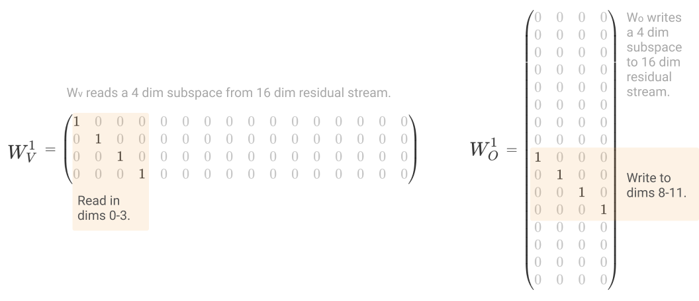
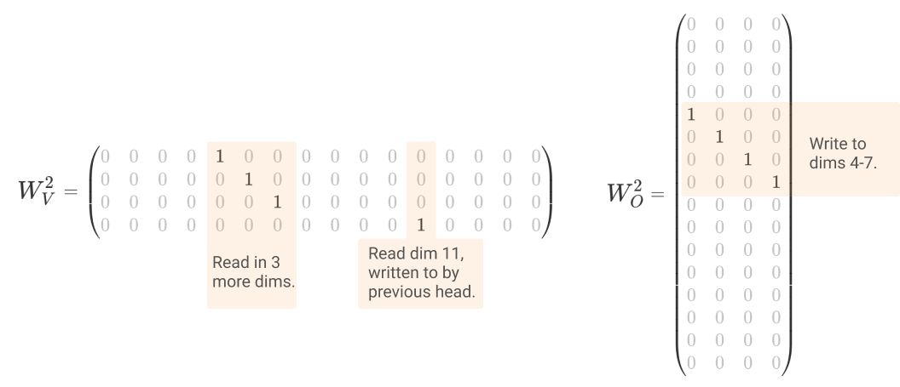

<!-- source: https://transformer-circuits.pub/2021/exercises/index.html -->

# Transformer Circuit Exercises

This collection of exercises is supplementary material for our [mathematical framework](https://transformer-circuits.pub/2021/framework/index.html) for reverse engineering transformers. The exercises go through writing down individual weights for attention heads, in order to implement algorithms. We've found this helpful in developing our own understanding, as a way to make sure we really understand the full mechanistic story of transformers all the way down to individual parameters, and not blurring over any confusions.

Solutions are provided [below](#solutions).

  
  
  

  
  

## Exercises

#### Warm Up

* Describe the transformer architecture at a high level
* Describe how an individual attention head works in detail, in terms of the matrices W\_Q, W\_K, W\_V, and W\_{out}. (The equations and code for an attention head are often written for all attention heads in a layer concatenated together at once. This implementation is more computationally efficient, but harder to reason about, so we'd like to describe a single attention head.)
* Attention heads move information from a subspace of the residual stream of one token to a different subspace in the residual stream of another. Which matrix controls the subspace that gets read, and which matrix controls the subspace written to? What does their product mean?
* Which tokens an attention head attends to is controlled by only two of the four matrices that define an attention head. Which two matrices are these?
* Attention heads can be written in terms of two matrices instead of four, W\_Q^T \cdot W\_k and W\_{out} \cdot W\_v. In the previous two questions, you gave interpretations to these matrices. Now write out an attention head with only reference to them.

* What is the rank of these matrices?

* You'd like to understand whether an attention head is reading in the output of a previous attention head. What does W\_V^2 \cdot W\_{out}^1 tell you about this? What do the singular values tell you?

#### Exercise 1 - Building a simple virtual attention head

Small transformers often have multiple attention heads which look at the previous token, but no attention heads which look at the token two previous. In this exercise, we'll see how two previous token heads can implement a small "virtual attention head" looking two tokens behind, without sacrificing a full attention head to the purpose.

Let's consider two attention heads, head 1 and head 2, which both attend to the previous token. Head 1 is in the first layer, head 2 is in the second layer. To make it easy to write out explicit matrices, we'll have the k, q, and v vectors of both heads be 4 dimensions and the residual stream be 16 dimensions.

* (a) Write down W\_V^1 and W\_{out}^1 for head 1, such that the head copies dimensions 0-3 of its input to 8-11 in its output.
* (b) Write down W\_V^2 and W\_{out}^2 for head 2, such that it copies 3 more dimensions of the previous token, and one dimension from two tokens ago (using a dimension written to by the previous head).
* (c) Expand out W\_{\text{net}}^1 = W\_{out}^1 \cdot W\_V^1 and W\_{\text{net}}^2 = W\_{out}^2 \cdot W\_V^2. What do these matrices tell you?
* (d) Expand out the following matrices: Two token copy: W\_{\text{net}}^2 \cdot W\_{\text{net}}^1. One token copy: W\_{\text{net}}^2 \cdot \text{Id} ~+~ \text{Id} \cdot W\_{\text{net}}^1.
* Observation: When we think of an attention head normally, they need to dedicate all their capacity to one task. In this case, the two heads dedicated 7/8ths of their capacity to one task and 1/8th to another.

#### Exercise 2 - Copying Text with an Induction Head (Pointer Arithmetic Version)

The simplest kind of in-context meta-learning that neural networks do is increasing the probability of sequences they've seen before in this context. This is done with an "induction head" that looks at what followed after last time we saw a token.

There are at least two algorithms for implementing induction heads. In this exercise, you'll build up the "pointer arithmetic" algorithm by hand.

* (a) Let u^{\text{cont}}\_0, ~~ u^{\text{cont}}\_1, ~~ \ldots ~~ u^{\text{cont}}\_n be the principal components of the content embedding. Write W\_Q and W\_K for an attention head (with 4 dimensional queries and keys) selecting tokens with similar content to the present token, including the present token itself.
* (b) Let u^{\cos}\_0, ~ u^{\sin}\_0, ~ u^{\cos}\_1, ~ u^{\sin}\_1, ~ ... be a basis describing the position embedding in terms of vectors that code for the sine and cosine embedding of the token position (eg. \lambda\cos(\alpha\_0 n\_{tok})) with descending magnitudes. Write W\_Q and W\_K for an attention head (with 4 dimensional queries and keys) that self-selects the present token position.
* (c) Using the position embedding basis described in (b), write W\_Q and W\_K for an attention head (with 4 dimensional queries and keys) that self-selects the \*previous\* token position. Hint: think about a 2D rotation matrix.
* (d) Write W\_Q and W\_K for an attention head (with 8 dimensional queries and keys) selecting tokens with similar content to the present token, but disprefers attending to itself. Hint: refer to (b) and use extra 4 dimensions for keys and queries.
* (e) Write down W\_V and W\_{out} for the attention head you described in (d), such that it extracts the largest 8 dimensions of the position embedding from the token it attends to, and writes them to the vectors v\_0, v\_1, ....
* (f) Write W\_Q and W\_K for an attention head which attends to the token after a previous copy of the present token. Hint: use the outputs of the head from (e) and the strategy you used in (c).

#### Exercise 3 - Copying Text with an Induction Head (Previous Token K-Composition Version)

Some positional encoding mechanisms, such as rotary attention, don't expose positional information to the W\_V matmul. Transformers trained with these mechanisms can't use the strategy from (e) and (f) in the previous exercise to manipulate positional encoding vectors.

For these transformers, we've seen an alternate mechanism, where the first head copies information about the preceding token into a subspace, and the second head uses that subspace to construct queries and keys. Assuming the same positional encoding mechanism as above, write down W^1\_Q, W^1\_K, W^1\_V, W^1\_O and W^2\_Q and W^2\_K for a pair of attention heads implementing this algorithm.

  
  
  

  
  

## Solutions

#### Warmup

See our [paper on transformer ciruits](https://transformer-circuits.pub/2021/framework/index.html) for discussion of all of these questions.

#### Exercise 1 - Building a simple virtual attention head

(1)(a) Write down W\_V^1 and W\_{out}^1 for head 1, such that the head copies dimensions 0-3 of its input to 8-11 in its output.

(1)(b) Write down W\_V^2 and W\_{out}^2 for head 2, such that it copies 3 more dimensions of the previous token, and one dimension from two tokens ago (using a dimension written to by the previous head).

Note that there are many correct answers here. The primary important property is that W\_V^2 has one 1 in a column corresponding to a row of W\_O^1, and three 1s in columns which are untouched by W\_V^1 and W\_O^1.

(1)(c) Expand out W\_{\text{net}}^1 = W\_{out}^1 \cdot W\_V^1 and W\_{\text{net}}^2 = W\_{out}^2 \cdot W\_V^2. What do these matrices tell you?

These matrices describe the full operation of an attention head when moving information from the residual stream at one position (which is attended to) to another:

h\_i(x) = \sum\_j A\_{ij}W\_{net}x\_{j}

(1)(d) Expand out the following matrices: Two token copy: W\_{\text{net}}^2 \cdot W\_{\text{net}}^1. One token copy: W\_{\text{net}}^2 \cdot \text{Id} ~+~ \text{Id} \cdot W\_{\text{net}}^1.

#### Exercise 2 - Copying Text with an Induction Head (Pointer Arithmetic Version)

(2)(a) Let u^{\text{cont}}\_0, ~~ u^{\text{cont}}\_1, ~~ \ldots ~~ u^{\text{cont}}\_n be the principal components of the content embedding. Write W\_Q and W\_K for an attention head (with 4 dimensional queries and keys) selecting tokens with similar content to the present token, including the present token itself.

W\_Q = W\_K = \begin{pmatrix}u\_0^{cont} \\u\_1^{cont} \\u\_2^{cont} \\u\_3^{cont} \end{pmatrix}

We simply project the content dimensions into both heads. Note that, in this example and all that follow, we could compose an arbitrary rotation into both matrices and arrive at a functionally equivalent head. We show what we consider to be the most straightforward version of these matrices.

(2)(b) Let u^{\cos}\_0, ~ u^{\sin}\_0, ~ u^{\cos}\_1, ~ u^{\sin}\_1, ~ ... be a basis describing the position embedding in terms of vectors that code for the sine and cosine embedding of the token position (eg. \lambda\cos(\alpha\_0 n\_{tok})) with descending magnitudes. Write W\_Q and W\_K for an attention head (with 4 dimensional queries and keys) that self-selects the present token position.

W\_Q = W\_K = \begin{pmatrix} u\_0^{cos} \\ u\_0^{sin} \\ u\_1^{cos} \\ u\_1^{sin} \end{pmatrix}

(2)(c) Using the position embedding basis described in (b), write W\_Q and W\_K for an attention head (with 4 dimensional queries and keys) that self-selects the \*previous\* token position. Hint: think about a 2D rotation matrix.

Note that by the definition of u^{\cos}\_0, ~ u^{\sin}\_0, … is that they encode the token index n as a cosine or sine wave. If we think of the corresponding cosine and sine pair together, we can think of it as a two dimensional point:

(u\_0^{\cos}, ~u\_0^{\sin})\cdot x^0\_n ~=~ \lambda\_0(\cos(\alpha\_0n),~ \sin(\alpha\_0n))

If we do the same thing for the token n-1, we find that it is the point for token n rotated by -\alpha\_0:

\begin{aligned} (u\_0^{\cos}, u\_0^{\sin}) \cdot x^0\_{n-1} &~=~ \lambda\_0(\cos(\alpha\_0(n-1)),~ \sin(\alpha\_0(n-1))) \\ &~=~ \lambda\_0(\cos(\alpha\_0n-\alpha\_0),~ \sin(\alpha\_0n-\alpha\_0))\\ &~=~ \lambda\_0R\_{-\alpha\_0}(\cos(\alpha\_0n),~ \sin(\alpha\_0n) \end{aligned}

So we want to take the positional embedding vectors, pair up the sin and cosine components, and perform a 2d rotation. A 2d rotation about the origin is:

R\_\theta=\begin{pmatrix} \cos\theta & -\sin\theta \\ \sin\theta & \cos\theta \end{pmatrix}

We compose two such rotations along with a projection of the positional basis, to arrive at:

W\_K = \textrm{(as part (b))}

W\_Q = \begin{pmatrix} \cos\alpha\_0 & \sin\alpha\_0 & & \\-\sin\alpha\_0 & \cos\alpha\_0 & & \\& & \cos\alpha\_1 & \sin\alpha\_1 \\& & -\sin\alpha\_1 & \cos\alpha\_1 \end{pmatrix} \begin{pmatrix} u\_0^{cos} \\ u\_0^{sin} \\ u\_1^{cos} \\ u\_1^{sin} \end{pmatrix}

(2)(d) Write W\_Q and W\_K for an attention head (with 8 dimensional queries and keys) selecting tokens with similar content to the present token, but disprefers attending to itself. Hint: refer to (b) and use extra 4 dimensions for keys and queries.

W\_K=\begin{pmatrix} u\_0^{cont} \\ u\_1^{cont} \\ u\_2^{cont} \\ u\_3^{cont} \\ u\_0^{cos} \\ u\_0^{sin} \\ u\_1^{cos} \\ u\_1^{sin} \end{pmatrix} ~~~~W\_Q=\begin{pmatrix} u\_0^{cont} \\ u\_1^{cont} \\ u\_2^{cont} \\ u\_3^{cont} \\ -\beta{}u\_0^{cos} \\ -\beta{}u\_0^{sin} \\ -\beta{}u\_1^{cos} \\ -\beta{}u\_1^{sin} \end{pmatrix}

\beta is a parameter that lets us tune the relative weight of the “same token” and “not the present position” parts of the computation.

(2)(e) Write down W\_V and W\_{out} for the attention head you described in (d), such that it extracts the largest 8 dimensions of the position embedding from the token it attends to, and writes them to the vectors v\_0, v\_1, ....

W\_V=\begin{pmatrix} u\_0^{cos} \\ u\_0^{sin} \\ u\_1^{cos} \\ u\_1^{sin} \\ u\_2^{cos} \\ u\_2^{sin} \\ u\_3^{cos} \\ u\_3^{sin} \end{pmatrix} ~~~~W\_O = \begin{pmatrix}v\_0^T&v\_1^T&v\_2^T&\ldots{}\end{pmatrix}

(2)(f) Write W\_Q and W\_K for an attention head which attends to the token after a previous copy of the present token. Hint: use the outputs of the head from (e) and the strategy you used in (c).

The head described in (d) and (e) puts “the position of the previous instance of this token” into the subspace defined by v\_0, v\_1, \ldots{}. We project that subspace out, and rotate it the same way as (c), except forwards instead of backwards:

W\_K = \begin{pmatrix}u\_0^{cos} \\ u\_0^{sin} \\ u\_1^{cos} \\ u\_1^{sin}\end{pmatrix} ~~~~ W\_Q = \begin{pmatrix} \cos\alpha\_0 & -\sin\alpha\_0 & & \\ \sin\alpha\_0 & \cos\alpha\_0 & & \\ & & \cos\alpha\_1 & -\sin\alpha\_1 \\ & & \sin\alpha\_1 & \cos\alpha\_1 \end{pmatrix} \begin{pmatrix} v\_0\\ v\_1\\ v\_2\\ v\_3 \end{pmatrix}

#### Exercise 3 - Copying Text with an Induction Head (Previous Token K-Composition Version)

The first head copies the “content” subspace of the previous token into the v\_0, v\_1, \ldots{} subspace of the present position:

W\_K = \begin{pmatrix}u\_0^{cos} \\ u\_0^{sin} \\ u\_1^{cos} \\ u\_1^{sin}\end{pmatrix} ~~~~ W\_Q = \begin{pmatrix} \cos\alpha\_0 & \sin\alpha\_0 & & \\ -\sin\alpha\_0 & \cos\alpha\_0 & & \\ & & \cos\alpha\_1 & \sin\alpha\_1 \\ & & -\sin\alpha\_1 & \cos\alpha\_1 \end{pmatrix} \begin{pmatrix}u\_0^{cos} \\ u\_0^{sin} \\ u\_1^{cos} \\ u\_1^{sin}\end{pmatrix}

W\_V = \begin{pmatrix} u\_0^{cont} \\ u\_1^{cont} \\ u\_2^{cont} \\ u\_3^{cont} \end{pmatrix} ~~~~ W\_O = \begin{pmatrix}v\_0^T&v\_1^T&v\_2^T&\ldots{}\end{pmatrix}

The second head can then use that subspace in its key projection, and compare it to the current token’s content:

W\_K = \begin{pmatrix}v\_0\\v\_1\\v\_2\\v\_3\end{pmatrix} ~~~~W\_Q = \begin{pmatrix} u\_0^{cont} \\ u\_1^{cont} \\ u\_2^{cont} \\ u\_3^{cont} \end{pmatrix}

### About

This article is a companion problem set for [A Mathematical Framework for Transformer Circuits](https://transformer-circuits.pub/2021/framework/index.html).

### Acknowledgments

We're grateful to Tuomas Oikarinen and Callum Canavan for catching several typos in the original version of these exercises.
