<!-- source: https://transformer-circuits.pub/2021/framework/index.html -->

# A Mathematical Framework for Transformer Circuits

### Authors

[Nelson Elhage∗†](https://nelhage.com/), [Neel Nanda∗](https://www.neelnanda.io/), Catherine Olsson∗, [Tom Henighan†](https://tomhenighan.com), Nicholas Joseph†, [Ben Mann†](https://benjmann.net/), Amanda Askell, Yuntao Bai, Anna Chen, Tom Conerly, Nova DasSarma, Dawn Drain, Deep Ganguli, [Zac Hatfield-Dodds](https://zhd.dev), Danny Hernandez, Andy Jones, Jackson Kernion, Liane Lovitt, Kamal Ndousse, Dario Amodei, Tom Brown, Jack Clark, Jared Kaplan, Sam McCandlish, [Chris Olah‡](https://colah.github.io/)

### Affiliation

[Anthropic](https://www.anthropic.com/)

### Published

Dec 22, 2021

\* Core Research Contributor; † Core Infrastructure Contributor; ‡ Correspondence to <colah@anthropic.com>; [Author contributions statement below](#author-contributions).

Transformer language models are an emerging technology that is gaining increasingly broad real-world use, for example in systems like GPT-3 , LaMDA , Codex , Meena , Gopher , and similar models.  However, as these models scale, their open-endedness and high capacity creates an increasing scope for unexpected and sometimes harmful behaviors.  Even years after a large model is trained, both creators and users routinely discover model capabilities – including problematic behaviors – they were previously unaware of.

One avenue for addressing these issues is mechanistic interpretability, attempting to reverse engineer the detailed computations performed by transformers, similar to how a programmer might try to reverse engineer complicated binaries into human-readable source code.  If this were possible, it could potentially provide a more systematic approach to explaining current safety problems, identifying new ones, and perhaps even anticipating the safety problems of powerful future models that have not yet been built.  A previous project, the [Distill Circuits thread](https://distill.pub/2020/circuits/) , has attempted to reverse engineer vision models, but so far there hasn’t been a comparable project for transformers or language models.

In this paper, we attempt to take initial, very preliminary steps towards reverse-engineering transformers.  Given the incredible complexity and size of modern language models, we have found it most fruitful to start with the simplest possible models and work our way up from there.  Our aim is to discover simple algorithmic patterns, motifs, or frameworks that can subsequently be applied to larger and more complex models.  Specifically, in this paper we will study transformers with two layers or less which have only attention blocks – this is in contrast to a large, modern transformer like GPT-3, which has 96 layers and alternates attention blocks with MLP blocks.

We find that by conceptualizing the operation of transformers in a new but mathematically equivalent way, we are able to make sense of these small models and gain significant understanding of how they operate internally.  Of particular note, we find that specific attention heads that we term “induction heads” can explain in-context learning in these small models, and that these heads only develop in models with at least two attention layers.  We also go through some examples of these heads operating in action on specific data.

We don’t attempt to apply to our insights to larger models in this first paper, but in a [forthcoming paper](https://transformer-circuits.pub/2022/in-context-learning-and-induction-heads/index.html), we will show that both our mathematical framework for understanding transformers, and the concept of induction heads, continues to be at least partially relevant for much larger and more realistic models – though we remain a very long way from being able to fully reverse engineer such models.

  
  
  

  
  

## Summary of Results

#### Reverse Engineering Results

To explore the challenge of reverse engineering transformers, we reverse engineer several toy, attention-only models. In doing so we find:

* Zero layer transformers model bigram statistics. The bigram table can be accessed directly from the weights.
* One layer attention-only transformers are an ensemble of bigram and “skip-trigram” (sequences of the form "A… B C") models. The bigram and skip-trigram tables can be accessed directly from the weights, without running the model. These skip-trigrams can be surprisingly expressive. This includes implementing a kind of very simple in-context learning.
* Two layer attention-only transformers can implement much more complex algorithms using compositions of attention heads. These compositional algorithms can also be detected directly from the weights. Notably, two layer models use attention head composition to create “induction heads”, a very general in-context learning algorithm.We’ll explore induction heads in much more detail in a forthcoming paper.
* One layer and two layer attention-only transformers use very different algorithms to perform in-context learning. Two layer attention heads use qualitatively more sophisticated inference-time algorithms — in particular, a special type of attention head we call an induction head — to perform in-context-learning, forming an important transition point that will be relevant for larger models.

#### Conceptual Take-Aways

We’ve found that many subtle details of the transformer architecture require us to approach reverse engineering it in a pretty different way from how the InceptionV1 Circuits work . We’ll unpack each of these points in the sections below, but for now we briefly summarize. We’ll also expand on a lot of the terminology we introduce here once we get to the appropriate sections. (To be clear, we don't intend to claim that any of these points are necessarily novel; many are implicitly or explicitly present in other papers.)

* Attention heads can be understood as independent operations, each outputting a result which is added into the residual stream. Attention heads are often described in an alternate “concatenate and multiply” formulation for computational efficiency, but this is mathematically equivalent.
* Attention-only models can be written as a sum of interpretable end-to-end functions mapping tokens to changes in logits. These functions correspond to “paths” through the model, and are linear if one freezes the attention patterns.
* Transformers have an enormous amount of linear structure. One can learn a lot simply by breaking apart sums and multiplying together chains of matrices.
* Attention heads can be understood as having two largely independent computations: a QK (“query-key”) circuit which computes the attention pattern, and an OV (“output-value”) circuit which computes how each token affects the output if attended to.
* Key, query, and value vectors can be thought of as intermediate results in the computation of the low-rank matrices W\_Q^TW\_K and W\_OW\_V. It can be useful to describe transformers without reference to them.
* Composition of attention heads greatly increases the expressivity of transformers. There are three different ways attention heads can compose, corresponding to keys, queries, and values. Key and query composition are very different from value composition.
* All components of a transformer (the token embedding, attention heads, MLP layers, and unembedding) communicate with each other by reading and writing to different subspaces of the residual stream. Rather than analyze the residual stream vectors, it can be helpful to decompose the residual stream into all these different communication channels, corresponding to paths through the model.

  
  
  

  
  

## Transformer Overview

Before we attempt to reverse engineer transformers, it's helpful to briefly review the high-level structure of transformers and describe how we think about them.

In many cases, we've found it helpful to reframe transformers in equivalent, but non-standard ways. Mechanistic interpretability requires us to break models down into human-interpretable pieces. An important first step is finding the representation which makes it easiest to reason about the model. In modern deep learning, there is — for good reason! — a lot of emphasis on computational efficiency, and our mathematical descriptions of models often mirror decisions in how one would write efficient code to run the model. But when there are many equivalent ways to represent the same computation, it is likely that the most human-interpretable representation and the most computationally efficient representation will be different.

Reviewing transformers will also let us align on terminology, which can sometimes vary. We'll also introduce some notation in the process, but since this notation is used across many sections, we provide a detailed description of all notation in the [notation appendix](#notation) as a concise reference for readers.

### Model Simplifications

To demonstrate the ideas in this paper in their cleanest form, we focus on "toy transformers" with some simplifications.

In most parts of this paper, we will make a very substantive change: we focus on “attention-only” transformers, which don't have MLP layers. This is a very dramatic simplification of the transformer architecture. We're partly motivated by the fact that circuits with attention heads present new challenges not faced by the Distill circuits work, and considering them in isolation allows us to give an especially elegant treatment of those issues. But we've also simply had much less success in understanding MLP layers so far; in normal transformers with both attention and MLP layers there are many circuits mediated primarily by attention heads which we can study, some of which seem very important, but the MLP portions have been much harder to get traction on. This is a major weakness of our work that we plan to focus on addressing in the future. Despite this, we will have some discussion of transformers with MLP layers in later sections.

We also make several changes that we consider to be more superficial and are mostly made for clarity and simplicity. We do not consider biases, but a model with biases can always be simulated without them by folding them into the weights and creating a dimension that is always one. Additionally, biases in attention-only transformers mostly multiply out to functionally be biases on the logits. We also ignore layer normalization. It adds a fair amount of complexity to consider explicitly, and up to a variable scaling, layer norm can be merged into adjacent weights. We also expect that, modulo some implementational annoyances, layer norm could be substituted for batch normalization (which can fully be folded into adjacent parameters).

### High-Level Architecture

There are several variants of transformer language models. We focus on autoregressive, decoder-only transformer language models, such as GPT-3. (The original transformer paper had a special encoder-decoder structure to support translation, but many modern language models don't include this.)

A transformer starts with a token embedding, followed by a series of “residual blocks”, and finally a token unembedding. Each residual block consists of an attention layer, followed by an MLP layer. Both the attention and MLP layers each “read” their input from the residual stream (by performing a linear projection), and then “write” their result to the residual stream by adding a linear projection back in. Each attention layer consists of multiple heads, which operate in parallel.


### Virtual Weights and the Residual Stream as a Communication Channel

One of the main features of the high level architecture of a transformer is that each layer adds its results into what we call the “residual stream.”Constructing models with a residual stream traces back to early work by the Schmidhuber group, such as highway networks  and LSTMs, which have found significant modern success in the more recent residual network architecture . In transformers, the residual stream vectors are often called the “embedding.” We prefer the residual stream terminology, both because it emphasizes the residual nature (which we believe to be important) and also because we believe the residual stream often dedicates subspaces to tokens other than the present token, breaking the intuitions the embedding terminology suggests. The residual stream is simply the sum of the output of all the previous layers and the original embedding. We generally think of the residual stream as a communication channel, since it doesn't do any processing itself and all layers communicate through it.

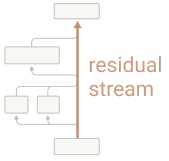

The residual stream has a deeply linear structure.It's worth noting that the completely linear residual stream is very unusual among neural network architectures: even ResNets , the most similar architecture in widespread use, have non-linear activation functions on their residual stream, or applied whenever the residual stream is accessed! Every layer performs an arbitrary linear transformation to "read in" information from the residual stream at the start,This ignores the layer normalization at the start of each layer, but up to a constant scalar, the layer normalization is a constant affine transformation and can be folded into the linear transformation. See discussion of how we handle layer normalization in the appendix. and performs another arbitrary linear transformation before adding to "write" its output back into the residual stream. This linear, additive structure of the residual stream has a lot of important implications. One basic consequence is that the residual stream doesn't have a ["privileged basis"](#def-privileged-basis); we could rotate it by rotating all the matrices interacting with it, without changing model behavior.

#### Virtual Weights

An especially useful consequence of the residual stream being linear is that one can think of implicit "virtual weights" directly connecting any pair of layers (even those separated by many other layers), by multiplying out their interactions through the residual stream. These virtual weights are the product of the output weights of one layer with the input weightsNote that for attention layers, there are three different kinds of input weights: W\_Q,  W\_K,  and W\_V. For simplicity and generality, we think of layers as just having input and output weights here. of another (ie. W\_{I}^2W\_{O}^1), and describe the extent to which a later layer reads in the information written by a previous layer.

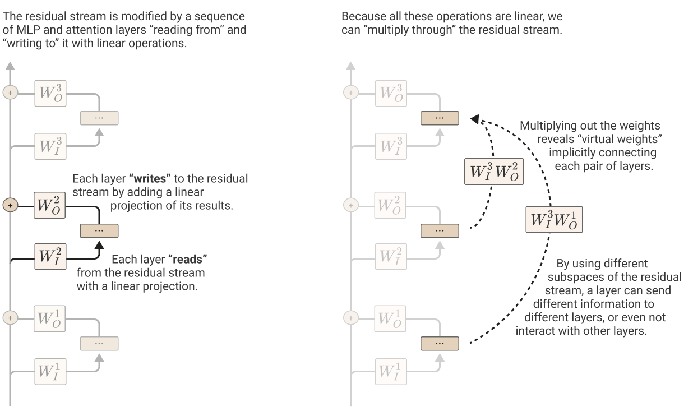

#### Subspaces and Residual Stream Bandwidth

The residual stream is a high-dimensional vector space. In small models, it may be hundreds of dimensions; in large models it can go into the tens of thousands. This means that layers can send different information to different layers by storing it in different subspaces. This is especially important in the case of attention heads, since every individual head operates on comparatively small subspaces (often 64 or 128 dimensions), and can very easily write to completely disjoint subspaces and not interact.

Once added, information persists in a subspace unless another layer actively deletes it. From this perspective, dimensions of the residual stream become something like "memory" or "bandwidth". The original token embeddings, as well as the unembeddings, mostly interact with a relatively small fraction of the dimensions.We performed PCA analysis of token embeddings and unembeddings. For models with large d\_\text{model}, the spectrum quickly decayed, with the embeddings/unembeddings being concentrated in a relatively small fraction of the overall dimensions. To get a sense for whether they occupied the same or different subspaces, we concatenated the normalized embedding and unembedding matrices and applied PCA. This joint PCA process showed a combination of both "mixed" dimensions and dimensions used only by one; the existence of dimensions which are used by only one might be seen as a kind of upper bound on the extent to which they use the same subspace. This leaves most dimensions "free" for other layers to store information in.

It seems like we should expect residual stream bandwidth to be in very high demand! There are generally far more "computational dimensions" (such as neurons and attention head result dimensions) than the residual stream has dimensions to move information. Just a single MLP layer typically has four times more neurons than the residual stream has dimensions. So, for example, at layer 25 of a 50 layer transformer, the residual stream has 100 times more neurons as it has dimensions before it, trying to communicate with 100 times as many neurons as it has dimensions after it, somehow communicating in superposition! We call tensors like this ["bottleneck activations"](#def-bottleneck-activation) and expect them to be unusually challenging to interpret. (This is a major reason why we will try to pull apart the different streams of communication happening through the residual stream apart in terms of virtual weights, rather than studying it directly.)

Perhaps because of this high demand on residual stream bandwidth, we've seen hints that some MLP neurons and attention heads may perform a kind of "memory management" role, clearing residual stream dimensions set by other layers by reading in information and writing out the negative version.Some MLP neurons have very negative cosine similarity between their input and output weights, which may indicate deleting information from the residual stream. Similarly, some attention heads have large negative eigenvalues in their W\_OW\_V matrix and primarily attend to the present token, potentially serving as a mechanism to delete information. It's worth noticing that while these may be generic mechanisms for "memory management" deletion of information, they may also be mechanisms for conditionally deleting information, operating only in some cases.

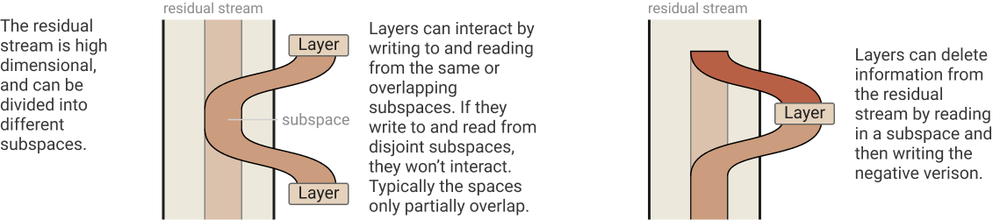

### Attention Heads are Independent and Additive

As seen above, we think of transformer attention layers as several completely independent attention heads h\in H which operate completely in parallel and each add their output back into the residual stream. But this isn't how transformer layers are typically presented, and it may not be obvious they're equivalent.

In the original Vaswani et al. paper on transformers , the output of an attention layer is described by stacking the result vectors r^{h\_1}, r^{h\_2},..., and then multiplying by an output matrix W\_O^H. Let's split W\_O^H into equal size blocks for each head [W\_O^{h\_1}, W\_O^{h\_2}...]. Then we observe that:

W\_O^H \left[\begin{matrix}r^{h\_1}\\r^{h\_2}\\... \end{matrix}\right] ~~=~~ \left[W\_O^{h\_1},~ W\_O^{h\_2},~ ... \right]\cdot\left[\begin{matrix}r^{h\_1}\\r^{h\_2}\\...\end{matrix}\right] ~~=~~ \sum\_i W\_O^{h\_i} r^{h\_i}

Revealing it to be equivalent to running heads independently, multiplying each by its own output matrix, and adding them into the residual stream. The concatenate definition is often preferred because it produces a larger and more compute efficient matrix multiply. But for understanding transformers theoretically, we prefer to think of them as independently additive.

### Attention Heads as Information Movement

But if attention heads act independently, what do they do? The fundamental action of attention heads is moving information. They read information from the residual stream of one token, and write it to the residual stream of another token. The main observation to take away from this section is that which tokens to move information from is completely separable from what information is “read” to be moved and how it is “written” to the destination.


To see this, it’s helpful to write attention in a non-standard way. Given an attention pattern, computing the output of an attention head is typically described in three steps:

1. Compute the value vector for each token from the residual stream (v\_i = W\_V x\_i).
2. Compute the “result vector” by linearly combining value vectors according to the attention pattern (r\_i = \sum\_j A\_{i,j} v\_j).
3. Finally, compute the output vector of the head for each token (h(x)\_i = W\_O r\_i).As discussed above, often multiplication by the output matrix is written as one matrix multiply applied to the concatenated results of all heads; however this version is equivalent.

Each of these steps can be written as matrix multiply: why don’t we collapse them into a single step? If you think of x as a 2d matrix (consisting of a vector for each token), we’re multiplying it on different sides. W\_V and W\_O multiply the “vector per token” side, while A multiplies the “position” side. Tensors can offer us a much more natural language for describing this kind of map between matrices (if tensor product notation isn't familiar, we've included a [short introduction](#notation-tensor-product) in the notation appendix).  One piece of motivation that may be helpful is to note that we want to express linear maps from matrices to matrices: [n\_\text{context},~ d\_\text{model}] ~\to~ [n\_\text{context},~ d\_\text{model}]. Mathematicians call such linear maps "(2,2)-tensors" (they map two input dimensions to two output dimensions). And so tensors are the natural language for expressing this transformation.

Using tensor products, we can describe the process of applying attention as:

h(x) ~=~ (\text{Id} \otimes W\_O)~~\cdot~~

Project result vectors out for each token (h(x)\_i = W\_O r\_i)

~ (A \otimes \text{Id})~~\cdot~~~

Mix value vectors *across* tokens to compute result vectors (r\_i = \sum\_j A\_{i,j} v\_j)

~ (\text{Id} \otimes W\_V)~~\cdot~~~

Compute value vector for each token (v\_i=W\_V x\_i)~~

x

Applying the mixed product property and collapsing identities yields:

h(x) ~=~ (A ~~\otimes~~ W\_O W\_V) ~~~\cdot~~~~~~

A mixes across tokens while W\_OW\_V acts on each vector independently.

x

What about the attention pattern? Typically, one computes the keys k\_i = W\_K x\_i, computes the queries q\_i = W\_Q x\_i and then computes the attention pattern from the dot products of each key and query vector A = \text{softmax}(q^T k). But we can do it all in one step without referring to keys and queries: A = \text{softmax}(x^T W\_Q^T W\_K x).

It's worth noting that although this formulation is mathematically equivalent, actually implementing attention this way (ie. multiplying by W\_O W\_V and W\_Q^T W\_K) would be horribly inefficient!

#### Observations about Attention Heads

A major benefit of rewriting attention heads in this form is that it surfaces a lot of structure which may have previously been harder to observe:

* Attention heads move information from the residual stream of one token to another.

* A corollary of this is that the residual stream vector space — which is often interpreted as a “contextual word embedding” — will generally have linear subspaces corresponding to information copied from other tokens and not directly about the present token.

* An attention head is really applying two linear operations, A and W\_OW\_V, which operate on different dimensions and act independently.

* A governs which token's information is moved from and to.
* W\_O W\_V governs which information is read from the source token and how it is written to the destination token.What do we mean when we say that W\_{OV}=W\_O W\_V governs which subspace of the residual stream the attention head reads and writes to when it moves information? It can be helpful to consider the singular value decomposition USV = W\_{OV}. Since d\_{head} < d\_{model}, W\_{OV} is low-rank and only a subset of the diagonal entries in S are non-zero. The right singular vectors V describe which subspace of the residual stream being attended to is “read in” (somehow stored as a value vector), while the left singular vectors U describe what subspace of the destination residual stream they are written to.

* A is the only non-linear part of this equation (being computed from a softmax). This means that if we fix the attention pattern, attention heads perform a linear operation. This also means that, without fixing A, attention heads are “half-linear” in some sense, since the per-token linear operation is constant.
* W\_Q and W\_K always operate together. They’re never independent. Similarly, W\_O and W\_V always operate together as well.

* Although they’re parameterized as separate matrices, W\_O W\_V and W\_Q^T W\_K can always be thought of as individual, low-rank matrices.
* Keys, queries and value vectors are, in some sense, superficial. They’re intermediary by-products of computing these low-rank matrices. One could easily reparametrize both factors of the low-rank matrices to create different vectors, but still function identically.
* Because W\_O W\_V and W\_Q W\_K always operate together, we like to define variables representing these combined matrices, W\_{OV} = W\_O W\_V and W\_{QK} = W\_Q^T W\_K.

* Products of attention heads behave much like attention heads themselves. By the distributive property, (A^{h\_2}\otimes W\_{OV}^{h\_2}) \cdot (A^{h\_1}\otimes W\_{OV}^{h\_1}) = (A^{h\_2}A^{h\_1})\otimes(W\_{OV}^{h\_2}W\_{OV}^{h\_1}). The result of this product can be seen as functionally equivalent to an attention head, with an attention pattern which is the composition of the two heads A^{h\_2}A^{h\_1} and an output-value matrix W\_{OV}^{h\_2}W\_{OV}^{h\_1}. We call these “virtual attention heads”, discussed in more depth later.

  
  
  

  
  

## Zero-Layer Transformers

Watch videos covering similar content to this section: [0 layer theory](https://www.youtube.com/watch?v=V3NQaDR3xI4&list=PLoyGOS2WIonajhAVqKUgEMNmeq3nEeM51&index=1)

<!-- yt-inline:V3NQaDR3xI4 -->
[![0L - Theory [rough early thoughts]](https://img.youtube.com/vi/V3NQaDR3xI4/hqdefault.jpg)](https://www.youtube.com/watch?v=V3NQaDR3xI4)

<details>
<summary>자막: 0L - Theory [rough early thoughts] (3:02)</summary>

[00:00]
well we're going to be diving in to
trying to figure out how transformers
mechanistically work
but
i'm sure you'll be shocked to learn that
uh transformers are pretty complicated
to think about and so rather than going
and starting uh with uh
full-on large transformers and
especially um the kind of really large
uh language models that we see
in modern analog nlp and we're gonna
start with a couple of videos uh
studying smaller simplified versions of
the transformer and work our way up and
in particular
we're going to be starting right now
with a zero layer transformer which is
really the the simplest model that you
can sort of conceive of that um bears
any resemblance at all to a transformer
and um despite being so simple there
will be some small takeaways that are
useful and so we're going to briefly
briefly talk about the zero layer
transformer
so a serial layer transformer really
just has two steps uh we're going to do

[00:01]
a token embedding and then we're going
to do an unembedding to get the watches
so for the token embedding um we're
going to go and think of the token as a
one-hot vector
and then we're going to multiply by w e
the word embedding
and that will give us
the
the token embedding and then we'll
multiply by the under-bending matrix and
then like adjust the logics so two steps
that's the entire thing that's the
entire model and so we're just going in
from the previous token predicting the
next token
uh by going and multiplying those
through those two matrices
and we can just write those out
if we want as a product
and so that that w-e-w
matrix
has to be representing um the bi-gram
statistics the the frequency is just
that empirically one token follows
another
and those bipartisan statistics in
particular needs to go and represent
bi-gram vlog likelihoods right because
we're going to go and feed it into a
soft mac so we want to have the log
likelihoods

[00:02]
um
and it'll probably be an approximation
because uh it has to be low rank
probably but the embeddings that we're
using are much smaller than a vocabulary
size so it's an approximation of that
but uh when we see that product that
that's what it means
and that actually right there is
everything useful i have to say on zero
there are transformers um but it is i
think a genuinely useful statement
because um when we stuck in larger
transformers all the way up to very
large transformers every equation we see
or at least the overall equation for the
transformer will always have a term that
looks exactly like that w-u-w-e and when
we see it we should immediately suspect
that it's gonna be doing some kind of
bi-gram statistic-ish like thing and we
should think back to the humble
zero-layer transformer and remember that
so okay that's what we have to say on
zero later zero layer transformers um
and
uh in our next video we'll dive into one
layer of attention only transformers

</details>


Before moving on to more complex models, it’s useful to briefly consider a “zero-layer” transformer. Such a model takes a token, embeds it, unembeds it to produce logits predicting the next token:

T ~=~ W\_U W\_E

Because the model cannot move information from other tokens, we are simply predicting the next token from the present token. This means that the optimal behavior of W\_U W\_E is to approximate the bigram log-likelihood.This parallels an observation by Levy & Goldberg, 2014 that many early word embeddings can be seen as matrix factorizations of a log-likelihood matrix.

This is relevant to transformers more generally. Terms of the form W\_U W\_E will occur in the expanded form of equations for every transformer, corresponding to the “direct path” where a token embedding flows directly down the residual stream to the unembedding, without going through any layers. The only thing it can affect is the bigram log-likelihoods. Since other aspects of the model will predict parts of the bigram log-likelihood, it won’t exactly represent bigram statistics in larger models, but it does represent a kind of “residual”. In particular, the W\_U W\_E term seems to often help represent bigram statistics which aren’t described by more general grammatical rules, such as the fact that “Barack” is often followed by “Obama”. An interesting corollary of this is to note is that, though W\_U is often referred to as the “un-embedding” matrix, we should not expect this to be the inverse of embedding with W\_E.

  
  
  

  
  

## One-Layer Attention-Only Transformers

Watch videos covering similar content to this section: [1 layer theory](https://www.youtube.com/watch?v=7crsHGsh3p8&list=PLoyGOS2WIonajhAVqKUgEMNmeq3nEeM51&index=3), [1 layer results](https://www.youtube.com/watch?v=ZBlHFFE-ng8&list=PLoyGOS2WIonajhAVqKUgEMNmeq3nEeM51&index=4).

<!-- yt-inline:7crsHGsh3p8 -->
[![1L Attention  - Theory [rough early thoughts]](https://img.youtube.com/vi/7crsHGsh3p8/hqdefault.jpg)](https://www.youtube.com/watch?v=7crsHGsh3p8)

<details>
<summary>자막: 1L Attention  - Theory [rough early thoughts] (18:02)</summary>

[00:00]
in our previous video we talked about what's
basically the simplest model bearing any
resemblance to a transformer you could imagine:
the zero layer transformer. But now we're ready
to go and graduate to a more complex model, the
one layer attention-only transformer. Now it's
only a little bit more complex, but it will be
able to go and give us some really interesting
properties to study and I think will help us
understand larger transformers in the future.
Now we're going to have to work through
a non-trivial amount of theory, so
it's worth maybe just briefly talking
about why this is worth investing in
or why I think why i think there's some
payoff to working through this theory.
And the biggest reason is that we're going to be
able to in principle fully understand a toy model
and, well, I guess we we often, I feel like we
give up on fully understanding neural networks
and here we're going to be able to go
and and take you know something that's

[00:01]
that's sort of a small transformer and we're
going to be able to get to a point where we
will just completely understand this model. Now
we'll have to look at some large matrices and
you know we won't be able to keep it all in our
head but we'll we'll be able to sort of explain
all the behaviors model by consulting some large
matrices and in principle fully understand it.
We're also going to develop some conceptual
tools that i think are really useful
for reasoning larger models and will continue to
help us as we as we go forward to larger models.
and then finally actually it
turns out that even though
larger models and sort of genuine transformers
are going to have more complex circuits
and and more complex behavior some of the things
that we observe in these models these this toy
model are going to reoccur and sort of have some
echoes and so we'll see them again and that'll
sort of get some useful intuition
from studying this model i think.
Okay so, we're studying a simplified model. And
as the name suggests the zero layer attention

[00:02]
only transformer is -- or sorry the one layer
attention-only transformer -- is a one layer model
and it's attention-only, which means that it has
no MLPs. But there's two other smaller... those
are those are the big simplifications we've made,
but there's two other smaller simplifications:
we're going to get rid of the layer normalization
and that's just because layer normalization
and we think probably isn't a critical part of the
story and but it would add a lot of bookkeeping
and a lot of additional work to think through in
our theory um and similarly we're going to ignore
the biases or get rid of the biases because again
those would add a lot of complexity now the the
model that i'm actually looking at when i or will
be looking at when i give you empirical results
uh later on and that'll be in another in the
follow-up video to this one uh will have does
actually have uh layer norms and biases um
but i'm gonna light them to keep things simple

[00:03]
okay so really if we want to talk about an
attention-only transformer there's three steps
um or at a very high level at least you could
summarize in three steps which are we're gonna go
and uh embed our tokens so we'll we'll represent
our tokens as one-hot vectors and we'll multiply
them by the embedding matrix then um for each
attention head we run the attention head and add
it into the residual stream so that corresponds
to we have all these attention heads over here
we're going to add them in to the residual
stream this line down the middle and then finally
we're going to go and multiply by
the unembedding matrix to get the

[00:04]
logits so that's how we'll get the logits and
that's that's the output of our model okay so
uh of course we need to you know in order to
actually understand this we're going to need
to dive into the attention heads in a lot more
detail and a relatively standard way to describe
the attention heads um might be something
like this equation that we have at the top
uh so what is it saying well
it's saying something like
um first we produce the value vectors
by multiplying the residual stream by Wv
then um we go and we multiply and we go and
weight all those value vectors by our attention
matrix um so that moves uh m goes and combines
the the value vectors for different tokens
um and that weighted combination gets multiplied
by Wo so we can add it into the residual string
okay well uh that's that that that is a a formal
you know a definition of a of an attention head

[00:05]
but it's actually a kind of tricky definition
to think about and i think it obscures um
a lot of important facts about attention heads uh
and that's just kind of tricky because you know
we on the one hand we have like matrices matrix
multiplies we have to think about on the other
hand we have you know this weighted combination
that's kind of orthogonal to them and it's
kind of complex and there's another way we could
describe it uh which is using tensor products
so you might not be very familiar with tensor
products um but uh they're actually they're
they're very convenient and one way to think
about them is that they allow us to accomplish
the thing that uh we we often accomplish by
broadcasting or thinking about um uh you know
multiplying certain dimensions when we when
we program in tensorflow or numpy or pytorch
um so yeah it would be very common for us to
say okay well you know first we're going to

[00:06]
go and multiply the vector uh at each position
for each token by Wv okay well the way we'll
write that is we'll say that Wv is on the right
hand side of the tensor product um and identity
on the left-hand side and that just means we're
going to multiply every when we when we just have
a matrix on the right hand side it just means we
uh we multiply the vector for every token by that
matrix. Okay well the next thing we need to do
is go and weight things by the attention pattern
okay well that's that's instead of going and
multiplying um every the vector for every for
every token um independently, now we're gonna go
and independently mix the every every component
um across tokens, so we're multiplying across the
token dimension instead of multiplying across the
um the the i don't know the the vector dimension
or the model dimension or something like that. So
um that we're going to represent that
by multiplying on the left-hand side.

[00:07]
Okay well then we need to go multiply by Wo and
multiply we're going to multiply every vector
the vector for every token by Wo so that's that's
like the thing that we did on at the beginning
earlier when we multiplied on the right hand
side we're going to multiply on the have Wo
on the right hand side and that just means we
multiply the vector um every tokens vector by Wo.
And one thing that's nice about tensor products
is they have this identity that all the things
on the same side you just multiply them together
all the things on the same side combine and and uh
all the things on the other side also combine and
they're just completely independent. So if we want
to understand what, if we want to multiply these
together and combine them, we look at, for the
right hand side we'll go multiply by Wo and then
id and Wv, and id collapses so we just get Wo*Wv.
And on the left hand side we have an id and then
A and an id so we just get an A, we just have the

[00:08]
attention pattern. So what that's really saying
is that this the the attention patterns action is
sort of independent of the Wo*Wv action and
and they're they're sort of separate things
so that's one that's one way you could think about
it um another way to think about this is you know
what is an attention head fundamentally doing an
attention head moves information from the residual
stream of one token to the residual stream of
another token and when it does that it has to
pick some subspace of the the the attention that
it's moving information from it has to read some
subspace and it has to write that to that sub the
information that it read the vector that it read
to this a different subspace and the residual
stream of the of the the second token well
Wo*Wv describes which attention head or sorry
which which subsidies we read from and write to
and a describes which token um information
moves from into so a move describes

[00:09]
what the the token that gets read from and
written to and Wo*Wv describes the the subspace
of the token that we're reading from that we
we read from and and where it gets written
so that's a pretty cool way
to think about attention
okay so now we can go and plug that
into the previous definition we had
of an attention layer where we were
going and adding all the the different
attention heads and and then going and adding
them to the residual stream and you know there's
another way we could write that which is uh you
know if we fix if we fix the attention pattern now
that's that's the attention pattern is computed in
a very nonlinear way but if we pretend that it's
a constant or that it's fixed um well then all of
this is linear and so we could go and write it as
a a linear transformation that acts on x0
where we have an identity plus um all of these

[00:10]
um well they're they're they're they're
tensors in the mathematical sense
and we can even plug that into our you
know plug all of our equations together
and we get this this final uh final end-to-end
description of a transformer in some sense so
um the identity term becomes Wu*We that's you know
you can think of that as um well it's gonna it's
gonna be kind of like bi-gram statistics and uh
for every attention head we have this term here
and we'll return to this um this
product on the right hand side it's
it's really interesting um and in some ways
is yeah one of the most most informative
things we can use to think about in
this model okay so um that first term

[00:11]
is going to it's it corresponds to this direct
path down here this one here and it's going to
tend to represent bigram like statistics remember
in our previous video we saw an identical term
uh in our zero layer transformer and it was
exactly the bigram well an approximation of
the the bi-gram log likelihood that was exactly
what it was trying to do and here we're going
to see that it's it's going to do something a bit
similar some of the diagram information will move
into the attention heads but the remainder
will will continue to be on that direct path
but we also have terms corresponding to all of
these other paths right so that's those are all
going to be in that sum on the right hand side and
the sum has each one of these parts of the sum is
a tensor product and yeah the this describes where
the attention heads attend um and this describes

[00:12]
if the attention head attends to a given
token how does that affect the logits so
if we attend to a given token how do we affect the
logits so that that that's very interesting that
that sort of tells us a very large story large
portion of the story of what what this model's
behavior is going to be now the thing that
we're missing is we still need to understand
how the attention patterns get created and then
we'll then we'll basically have a complete story
You know i mentioned this earlier but
it's it's worth noting that this this is
if you fix the attention pattern it's linear and
that that's something that we'll be able to get
a lot of leverage out of and in general i think
any time you can go and split a function your very
complex function but then you can split it into
two things where if you hold one thing constant
it's a very simple function if you hold the other
thing constant it's a very simple function that's
a that's a nice point of leverage and um here's
an example a case where we have half that kind

[00:13]
of large so that's that's very nice okay so how is
the attention pattern computed well the attention
pattern computed is computed by going and dot
producting keys and queries so we dot product
the keys and the queries but okay how are those
computed well the queries and the keys are going
to be computed by taking the residual stream and
multiplying by Wq or Wk and the residual stream
is just the token times the embedding matrix one
hot token is represented as one hot factor so um
so if we if we combine this together we get Wk*We
and Wq*We and if we combine all of that together
we'll find that the attention pattern um is of the
form of a soft max of um the tokens on both sides
and then this matrix in the middle and that looks
very similar to that matrix that we saw earlier

[00:14]
and we'll see that it's really telling us which
tokens want to attend to which other tokens okay
um yeah so we we have these two really interesting
uh matrices and they're both vocabulary by
vocabulary size matrices and they seem to really
be at the heart of this model's behavior okay so
why why do we have those matrices now i can see
a little bit mysterious like the products of four
different matrices together and um you know why
why those matrices and what exactly do they mean
well okay let's start with the
first one we're going to call that
um the output value circuit
or the output value matrix
um and that's its form and what's going on here
is if we say okay well fundamentally what it means
is it it it's saying if you attend to a
token this is how the logits will be affected

[00:15]
and if you want to understand what that effect
is well okay we start with the token that we
attend to we'll call that the source token
and we go through w e so we embed the token
and then we have to convert it into a value vector
so we convert into a value vector by multiplying
by Wv so we've gone through We we've gone
through Wv and then we have to go we go and the
information gets moved by the attention pattern
and then it gets hit by Wo okay so um we have to
go because we're going to go and add it back into
the residual stream so we need to multiply by Wo
and get hit by the unembedding and
that causes a change to the output
and uh in the simplified model that's that's
exactly linear so this matrix here tells us how
uh what effect every token will have if we if
we attend to it on the outputs okay but the

[00:16]
second circuit this query-key circuit it tells us
which tokens want to attend to which other tokens
okay so if you again let's start with
the token that's being attended to
and if we run it through the embedding
matrix and then multiply by Wk we get
the key and if on the other side we're on the
token that's going to do the attending we go and
multiply by We and then by Wq we get the query
and so those two paths then meet in the middle
and we have to transpose this side
because to go and make things work
and that gives us this
matrix which tells us how much every token
wants to attend to every other possible token
now this is ignoring um the the attention
pattern also cares about positional embeddings or

[00:17]
some other probably you have to account
for position in some way and there's now
a variety of mechanisms for for doing
that um i'm going to align that for now
and we'll see there are a few attention heads
that will care about position and we'll we'll
need to go and just sort of uh put that off
to the side um but you you could make this
you'd add an if you were if you're just dealing
with positional bettings you'd add another term
um something that describes the uh the which
positions want to attend to which other positions
and which positions potentially want to attend
other tokens that would probably be very small
um but uh if we're just yeah we ignore the
positions that's that's exactly right okay so
that is um the theory of uh the theory that we're
going to need to understand one layer attention
only transformers and if you're interested uh the
next video will actually leverage this then to go
and understand uh one layer yeah understand the
behavior of a one layer attention-only transformer

</details>


<!-- yt-inline:ZBlHFFE-ng8 -->
[![1L Attention - Results [rough early thoughts]](https://img.youtube.com/vi/ZBlHFFE-ng8/hqdefault.jpg)](https://www.youtube.com/watch?v=ZBlHFFE-ng8)

<details>
<summary>자막: 1L Attention - Results [rough early thoughts] (16:03)</summary>

[00:00]
in our previous video
we developed some theoretical results
for reasoning about transformers
and in this video we're going to take
advantage of those to try and understand
an actual one-layer attention-only
transformer
and to to really get to a point where
where in principle we could fully
understand it if we were willing to put
in the effort
so that that's kind of exciting
now to recap um the key idea from the
previous video was just that we we have
this uh
these two circuits the ov circuit which
tells us how an input a token if we
attend to it will affect the logits
and
the qk circuit which tells us which
tokens want to attend
to which other tokens
and they they have the they correspond
to these these matrices which we have
have over here
so that's that's the key idea
um that we we need
and so the the ov circuit

[00:01]
effect it sort of describes how the the
source token the token we intend to
affects the output
and the qk circuit how how it affects
the which tokens want to attend to it so
the destination so the one one link's
the destination token to the source
token and one links the source token the
output token and so very natural thing
to do
is to go and say well
uh okay
let's think about a single source token
since that's the one that both of these
circuits connect to
and let's ask
first um
which tokens want to attend
to that token
and if it gets attended to
what is its effect
on the output
and so for example we can see that the
token perfect
well the token r
wants to attend back to perfect
and then if we attend to it
and we'll increase the probability of
perfect and also to some extent super
and absolute and that means that we

[00:02]
increase the probability
of what i'll call a skip trigram where
we see the token perfect and then we we
jump over some tokens
and then we see the token r and increase
the token perfect being the problem
increase the probability of the token
perfect being the next token so we we
sort of say perfect later on are perfect
or it can be other things too because it
can be it could be the other tokens that
attend back and the other tokens that
get increased in probability so perfect
look super
and things like that of course you could
also look for the tokens they get
decreased in probability i think the
ones that get increased and probably the
most interesting
and we can do this for a bunch of things
so
uh large bunch of tokens want to attend
back increase the probability of large
and small
and that results in increasing the
probability of skipped trigrams like
large using a large
contained small
um so it's kind of this like copying
aspect to it or
copying or using similar words and where
something far essentially quite far back

[00:03]
in your context can now influence your
next token
for numbers we see two and
the token one wants to go and attend
back to that and predict two so we say
two and then one two but it can also be
two
has three and there's obviously lots of
other skip diagrams that are getting
getting affected
um the next couple are interesting so
this lambda one is really related to
uh
latex which is a type setting language
for scientific documents
and lambda is a keyword that's um it has
to be preceded by a backslash so we see
all these cases where there's
backslashes that want to attend back to
it and then increase the probability of
lambda
so we have lambda backslash lambda
and but also other things that that
could be in latex um backslash escaped
and are special commands like operator
um this nvsp one uh is from html so in
html there's there's some characters
that you
can't write

[00:04]
or you're supposed to go and write them
using using ampersand and then a special
special code or words that represent it
and and so nbsc is non-breaking space
and so if we've seen it once we maybe
next time we see an ampersand we think
we're going to say
go and write a non-breaking space
character and there's other other things
that could be like this greater than
it's another another one that it could
be
um and great
this is maybe a more normal thing
although that's related to titles um
like titles of books or something like
the great gatsby or something like that
um a little bit but the uppercase the
uppercase great
um
great the great
um okay but just stepping back um it's
worth noting noting here that we're just
we didn't run the model we just went and
took its weights
and we're reading algorithms off its
weights and these algorithms you know of
course there's there's
a similar we'd have to do this for every
attention but they're sort of telling us
the whole story of the model without

[00:05]
running it and we can just understand it
by by studying these matrices now the
matrices are fairly large and it could
be quite a bit of work but in principle
we could fully understand this model
okay now that copying is uh one example
of the kind of thing that it does it
does some other fun things um so this is
the first example here on this new slide
is uh is very similar to the previous
one we're gonna just copy indi um so he
yeah sometimes sometimes a single word
it's the tokenization system will split
it into two tokens and
and so we might have have the name cindy
and sometimes it gets split into a c in
indi um so we see indy and then we want
i go and say cindy and that's two tokens
the c
and the indie
and so we have c attend back to indy and
then we increase the probability of nd
or possibly all uppercase and d
um
a fun variant of that and i actually
didn't see this in
the model that i was using to prepare um

[00:06]
this talk unfortunately didn't have this
these are actually from a different
one layer model
but i think it's i think it's a very
interesting behavior
and sometimes you'll have a word
and
you look at the version where it's
tokenized as a single word
but it could also be tokenized as two
tokens and so then you have the the
tokens that could be the first part
of that like a a space p or a p
attend back
to the full word and then increase the
probability of its continuation
or things like pipe the the plural
version which i guess is sort of very
close to it being a continuation
and we can also have just similar words
that that so we could have spikes and
that starts with sp instead um so this
isn't quite literally copying but it's
also very interesting and um all of
these these other ones are examples
where um
a word can be tokenized potentially in
two parts ralph r elf
lloyd l lloyd
pixmap p xmap

[00:07]
and then it it tries to go and correct
that
um but do other fun things as well like
um you know all uppercase elf um i guess
with lloyd the reason we're seeing
atherin and a c over here is because
there's probably some famous catherine
that's either their last name is lloyd
or associated with lloyd
um in some way
um you might wonder about why is there a
cue for the pixmap um well there's a
programming language called cute that
has a class called q canvas um and so
and presumably it interacts with pixmaps
um
so we yeah we have all these sort of uh
interesting stuff hiding in these
matrices if we look at them
now i think one thing that's a really an
observation that had me kind of excited
about these is you know if you look at
neural networks and especially if you
look at language models sometimes the
cases where they they predict strange
things are very inscrutable and you just
have no idea you know why in the wide
world were the models just that
and
an interesting thing that i found

[00:08]
looking at these attention heads is that
they're kind of forced to introduce bugs
there's places where um in order to go
and and and sort of encode as many
possible these useful skip trigrams um
they necessarily add some bugs
so for instance for the pixmap one we
want to be able to go and say p xmap to
go and complete fix map
and q
canvas to go and say cue canvas later
those are both valid things and and
those those all make sense
but then
uh that that necessarily entails that we
must also have p canvas
because
the they have to go together in any
order and that seems like a bug as far
as i can tell there's there's no p
canvas object that's in some programming
language or being used and so that seems
to just be a bug that follows from the
way that we're encoding things and
similarly um with lloyd you know lloyd
and catherine both seem like a
reasonable things that could be

[00:09]
increasing the probability of but cloyd
and lathron both seem like they're
probably
probably bugs um that are just coming
from the way that things are being
encoded so that's that's kind of neat
that we can understand these bugs and
how they how they naturally follow from
trying to do something reasonable and
then just having limited expressivity
um so we've seen a couple sort of
abstract patterns and it's maybe worth
calling out um so one is that you you
see some token
and then you see a token that might
precede it and predict the same token so
you see two then you see one you think
ah you know probably i'm going to say
two again
another pattern
um is that you see a token and you see a
token that might precede a similar token
so
two and you see has and you think oh
maybe we're gonna talk about a number
again i'll increase the probability of
three it's not literally copying but
it's very similar
there's this version where you see a
token that
um
can be tokenized in a split way and then

[00:10]
you see the first part of the split
version and you predict the second part
it's sort of an interesting pattern and
then there's a variant on that um where
we see a split token or a token that
could a word that is represented as a
single token but could be split
and we see the first part and then we
predict
a variant the second part like all the
all uppercase version of it
now this might give you the impression
that uh all of the attention heads are
copying and that that impression
wouldn't be far from the truth from the
model that i was i was looking at as i
prepared this talk um 10 of its 12
attention heads uh are doing
are really doing this sort of copying
behavior but there were two that weren't
and those two actually are kind of
interesting because uh they're primarily
positional so remember the the qk
circuit that we're describing um for for
simplicity and because people handle
positional information in various ways
depending on whether they're using
positional bettings or or rotary

[00:11]
attention or things like this
um we alighted the the the
positional part um but some attention
heads care a lot about position and so
we have um some attention heads here
that primarily are gonna gonna care
about
um position
um
and so uh one interesting pattern there
uh is you'll have these attention heads
that mostly attend to the present token
and you'll say you know it seems you
might ask well why in the wide world
would it do that you know if anything
that it could do by attending to the
present token it could also go and do by
just going and and writing down that you
know we have we have that term in our
equation that just goes directly down
the residual stream and where the
embedding directly affects the
unembedding so it could do that but you
have these token um these these
attention heads that mostly attend to
the present token but sometimes attend a
little bit further back
and often in cases where the
tokenization like sort of spirit the
thing that sort of spiritually you think
of this vigram statistics really lives

[00:12]
with a token that's a little bit further
back so
um first let's look at one where it's
just literally doing bigram stuff so
we see the token corresponding as
probably our present token and we
increase the probability of two and two
and four and markup and with
so corresponding to corresponding four
corresponding markup corresponding with
these are all very reasonable things to
go and complete and those seem seem very
bigramish
but then we have an example
of the token cohen's
um
and presumably that's part of coincides
um actually in this case if you do look
at the the qk portion of the
uh of this there's the if you look at
the circuit there's a positional
component and a qk component and the qk
component
uh the token component uh is having the
token eyes attend back to
uh coincide
but the cohen's part is a lot more
informative than the odds part maybe and

[00:13]
so about what the next token is going to
be and so saying looking at currents and
being able to predict with or closely
you know coincides with coincides
closely um that that maybe is more
useful
similarly um if you if
if you have the token couldn't well just
seeing the apostrophe t and they get
split into two tokens and just saying
the apostrophe t doesn't really tell you
what's going on so
maybe it's more helpful to go and look
at the couldn't part and say couldn't
resist couldn't compete couldn't stand
couldn't identify
um and similarly when we have shouldn't
um looking at the shouldn't part is
maybe more informative than the
apostrophe t because since then say
shouldn't have shouldn't be shouldn't
remain shouldn't take and those are
actually kind of different um maybe than
the most likely things
uh
for for couldn't
um okay so
in summary uh our one layer
this i guess there's a few interesting
points so first of all these one-layer

[00:14]
attention-only transformers can be
understood by studying these these ov
and qk circuits and that's really neat
because uh understanding models uh is
hard and we often don't understand um
well it's you know i think i think
there's often a lot of patterns about
whether we can understand um neural
networks and you know this is an example
where we can succeed so that's that's
fun um really in principle we could
fully understand this model
um transformers desperately want to do
meta learning um i think this is
actually kind of um this was a very
surprising point to me like the model
goes and dedicates 10 out of its 12
attention heads to going and doing meta
learning stuff um how you know that it
wasn't all obvious to me that the model
was going to do that um
in fact i would have expected to mostly
be doing sort of
engram statistics stuff um but even
though the model's architecture is
actually quite poorly suited to doing
metal learning we'll see that it has
much better metal learning abilities uh
later on
and i think that
uh

[00:15]
yeah it's it's it's dedicating a lot of
its capacity anyways to going and
accomplishing that
um the constraints
of the system
force us uh force the model to introduce
bugs so going and trying to do represent
just sort of perfectly reasonable things
um these these skiff trigrams
intrinsically forces the model to have
certain bugs that are very inscrutable
if you just look at the resulting
behavior and so that's that's pretty
interesting
and then finally attention only
transformers uh are linear
uh if you freeze the attention patterns
and
again this this trick of you know
functions that are simple if you can go
and hold one thing constant um even if
the the whole function over as a whole
is very complex that's that's a very
nice point of leverage that uh that i i
always appreciate when i find something
like that
um well that's that's the talk
in the next video
we're going to go and discuss a way to
sort of automate and
much more quickly analyze one layer

[00:16]
similar models to this

</details>


We claim that one-layer attention-only transformers can be understood as an ensemble of a bigram model and several "skip-trigram" models (affecting the probabilities of sequences "A… BC").Our use of the term "skip-trigram" to describe sequences of the form "A… BC" is inspired by Mikolov et al. 's use of the term "skip-gram" in their classic paper on word embeddings. Intuitively, this is because each attention head can selectively attend from the present token ("B") to a previous token ("A") and copy information to adjust the probability of possible next tokens ("C").

The goal of this section is to rigorously show this correspondence, and demonstrate how to convert the raw weights of a transformer into interpretable tables of skip-trigram probability adjustments.

### The Path Expansion Trick

Recall that a one-layer attention-only transformer consists of a token embedding, followed by an attention layer (which [independently applies](#architecture-attn-independent) attention heads), and finally an unembedding:

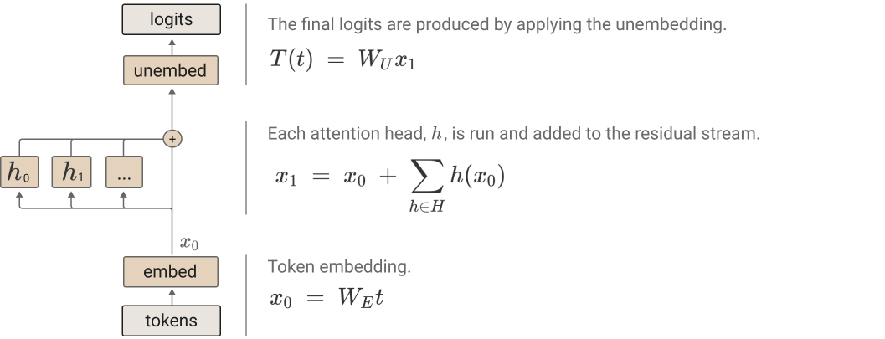

Using [tensor notation](#notation-tensor-product) and the [alternative representation of attention heads](#architecture-attn-as-movement) we previously derived, we can represent the transformer as a product of three terms.

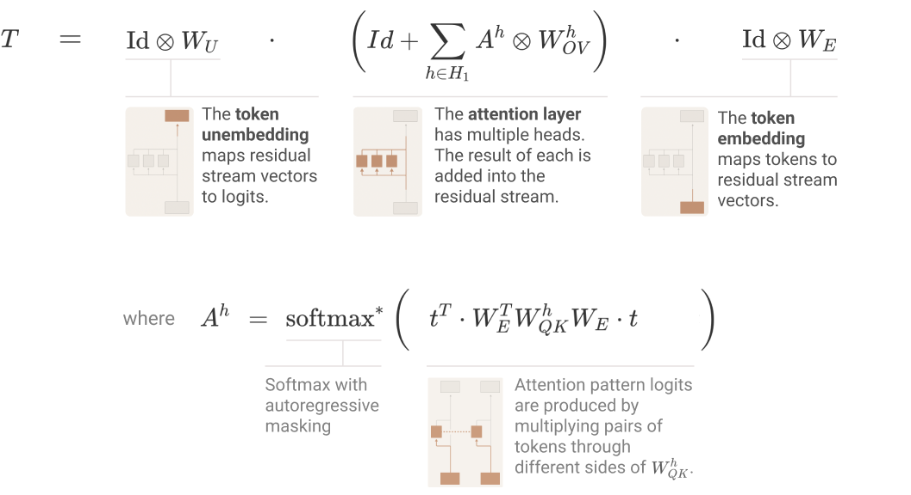

Our key trick is to simply expand the product. This transforms the product (where every term corresponds to a layer), into a sum where every term corresponds to an end-to-end path.

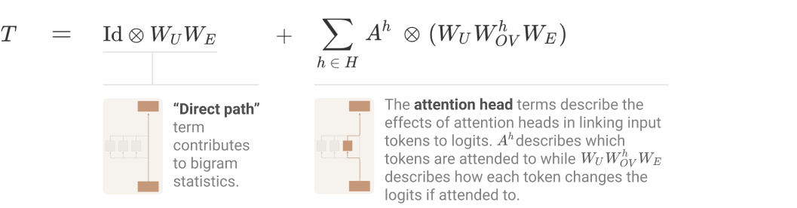

We claim each of these end-to-end path terms is tractable to understand, can be reasoned about independently, and additively combine to create model behavior.

The direct path term, \text{Id} \otimes W\_U W\_E, also occurred when we looked at the zero-layer transformer. Because it doesn’t move information between positions (that's what \text{Id} \otimes … denotes!), the only thing it can contribute to is the bigram statistics, and it will fill in missing gaps that other terms don’t handle there.

The more interesting terms are the attention head terms.

### Splitting Attention Head terms into Query-Key and Output-Value Circuits

For each attention head h we have a term A^h \otimes (W\_UW\_{OV}^hW\_E) where A^h= \text{softmax}\left( t^T \cdot W\_E^T W\_{QK}^h W\_E \cdot t \right). How can we map these terms to model behavior? And while we’re at it, why do we get these particular products of matrices on our equations?

The key thing to notice is that these terms consist of two separable operations, which are at their heart two [n\_\text{vocab},~ n\_\text{vocab}] matrices:

* W\_E^T W\_{QK}^h W\_E — We call this matrix the "query-key (QK) circuit." It provides the attention score for every query and key token. That is, each entry describes how much a given query token "wants" to attend to a given key token.
* W\_UW\_{OV}^hW\_E — We call this matrix the “Output-Value (OV) circuit.” It describes how a given token will affect the output logits if attended to.

To intuitively understand these products, it can be helpful to think of them as paths through the model, starting and ending at tokens. The QK circuit is formed by tracing the computation of a query and key vector up to their attention head, where they dot product to create a bilinear form. The OV circuit is created by tracing the path computing a value vector and continuing it through up to the logits.


The attention pattern is a function of both the source and destination tokenTechnically, it is a function of all possible source tokens from the start to the destination token, as the softmax calculates the score for each via the QK circuit, exponentiates and then normalises, but once a destination token has decided how much to attend to a source token, the effect on the output is solely a function of that source token. That is, if multiple destination tokens attend to the same source token the same amount, then the source token will have the same effect on the logits for the predicted output token.

#### OV and QK Independence (The Freezing Attention Patterns Trick)

Thinking of the OV and QK circuits separately can be very useful, since they're both individually functions we can understand (linear or bilinear functions operating on matrices we understand).

But is it really principled to think about them independently? One thought experiment which might be helpful is to imagine running the model twice. The first time you collect the attention patterns of each head. This only depends on the QK circuit.In models with more than one layer, we'll see that the QK circuit can be more complicated than W\_E^T W\_{QK}^h W\_E. The second time, you replace the attention patterns with the "frozen" attention patterns you collected the first time. This gives you a function where the logits are a linear function of the tokens! We find this a very powerful way to think about transformers.

### Interpretation as Skip-Trigrams

One of the core challenges of mechanistic interpretability is to make neural network parameters meaningful by contextualizing them (see discussion by Voss et al. in [Visualizing Weights](https://distill.pub/2020/circuits/visualizing-weights/) ). By multiplying out the OV and QK circuits, we've succeeded in doing this: the neural network parameters are now simple linear or bilinear functions on tokens. The QK circuit determines which "source" token the present "destination" token attends back to and copies information from, while the OV circuit describes what the resulting effect on the "out" predictions for the next token is. Together, the three tokens involved form a "skip-trigram" of the form `[source]... [destination][out]`, and the "out" is modified.

It's important to note that this doesn't mean that interpretation is trivial. For one thing, the resulting matrices are enormous (our vocabulary is ~50,000 tokens, so a single expanded OV matrix has ~2.5 billion entries); we revealed the one-layer attention-only model to be a compressed Chinese room, and we're left with a giant pile of cards. There's also all the usual issues that come with understanding the weights of generalized linear models acting on correlated variables and fungibility between variables. For example, an attention head might have a weight of zero because another attention head will attend to the same token and perform the same role it would have.  Finally, there's a technical issue where QK weights aren't comparable between different query vectors, and there isn't a clear right answer as to how to normalize them.

Despite this, we do have transformers in a form where all parameters are contextualized and understandable. And despite these subtleties, we can simply read off skip-trigrams from the joint OV and QK matrices. In particular, searching for large entries in these matrices reveals lots of interesting behavior.

In the following subsections, we give a curated tour of some interesting skip-trigrams and how they're embedded in the QK/OV circuits. But full, non-cherrypicked examples of the largest entries in several models are available by following the links:

* [**Large QK/OV entries - 12 heads, d\_head=64**](https://transformer-circuits.pub/2021/framework/head_dump/small_a.html)
* [**Large QK/OV entries - 32 heads, d\_head=128**](https://transformer-circuits.pub/2021/framework/head_dump/larger.html)

#### Copying / Primitive In-Context Learning

One of the most striking things about looking at these matrices is that most attention heads in one layer models dedicate an enormous fraction of their capacity to copying. The OV circuit sets things up so that tokens, if attended to by the head, increase the probability of that token, and to a lesser extent, similar tokens. The QK circuit then only attends back to tokens which could plausibly be the next token. Thus, tokens are copied, but only to places where bigram-ish statistics make them seem plausible.

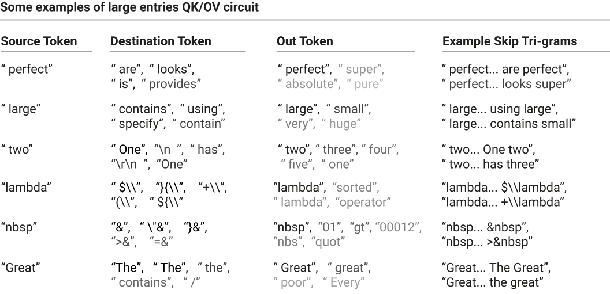

In the above example, we fix a given source token and look at the largest corresponding QK entries (the destination token) and largest corresponding OV entries (the out token). The source token is selected to show interesting behavior, but the destination and out token are the top entries unless entries are explicitly skipped with an ellipsis; they are colored by the intensity of their value in the matrix.

Most of the examples are straightforward, but two deserve explanation: the fourth example (with skip-trigrams like `lambda… $\lambda`) appears to be the model learning LaTeX, while the fifth example (with the skip-trigram `nbsp… >&nbsp`) appears to be the model learning HTML escape sequences.

Note that most of these examples are copying; this appears to be very common.

We also see more subtle kinds of copying. One particularly interesting one is related to how tokenization for transformers typically works. Tokenizers typically merge spaces onto the start of words. But occasionally a word will appear in a context where there isn't a space in front of it, such as at the start of a new paragraph or after a dialogue open quote. These cases are rare, and as such, the tokenization isn't optimized for them. So for less common words, it's quite common for them to map to a single token when a space is in front of them (`" Ralph" → [" Ralph"]`) but split when there isn't a space (`"Ralph" → ["R", "alph"]`).

It's quite common to see skip-trigram entries dealing with copying in this case. In fact, we sometimes observe attention heads which appear to partially specialize in handling copying for words that split into two tokens without a space. When these attention heads observe a fragmented token (e.g. `"R"`) they attend back to tokens which might be the complete word with a space (`" Ralph"`) and then predict the continuation (`"alph"`). (It's interesting to note that this could be thought of as a very special case where a one-layer model can kind of mimic the [induction heads](#induction-heads) we'll see in two layer models.)


We can summarize this copying behavior into a few abstract patterns that we've observed:

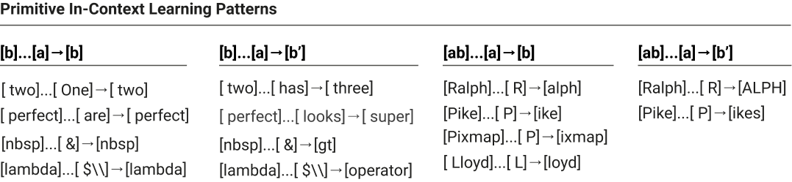

All of these can be seen as a kind of very primitive in-context learning. The ability of transformers to adapt to their context is one of their most interesting properties, and this kind of simple copying is a very basic form of it. However, we'll see when we look at a two-layer transformer that a much more interesting and powerful algorithm for in-context learning is available to deeper transformers.

#### Other Interesting Skip-Trigrams

Of course, copying isn't the only behavior these attention heads encode.

Skip-trigrams seem trivial, but can actually produce more complex behavior than one might expect. Below are some particularly striking skip-trigram examples we found in looking through the largest entries in the expanded OV/QK matrices of our models.

* [Python] Predicting that the python keywords `else`, `elif` and `except` are more likely after an indentation is reduced using skip-trigrams of the form: `\n\t\t\t … \n\t\t → else/elif/except` where the first part is indented N times, and the second part N-1, for various values of N, and where the whitespace can be tabs or spaces.
* [Python] Predicting that `open()` will have a file mode string argument: `open … "," → [rb / wb / r / w]` (for example `open("abc.txt","r")`)
* [Python] The first argument to a function is often `self`: `def … ( → self` (for example `def method_name(self):`)
* [Python] In Python 2, `super` is often used to call `.__init__()` after being invoked on `self`: `super … self → ).__` (for example `super(Parent, self).__init__()`)
* [Python] increasing probability of method/variables/properties associated with a library: `upper … . → upper/lower/capitalize/isdigit`, `tf … . → dtype/shape/initializer`, `datetime… → date / time / strftime / isoformat`, `QtWidgets … . → QtCore / setGeometry / QtGui`, `pygame … . → display / rect / tick`
* [Python] common patterns `for... in [range/enumerate/sorted/zip/tqdm]`
* [HTML] `tbody` is often followed by `<td>` tags: `tbody … < → td`
* [Many] Matching of open and closing brackets/quotes/punctuation: `(** … X → **)`, `(' … X → ')` , `"% … X → %"` , `'</ … X → >'` (see [32 head model, head 0:27](https://transformer-circuits.pub/2021/framework/head_dump/larger.html#head-0-27))
* [LaTeX] In LaTeX, every `\left` command must have a corresponding `\right` command; conversely `\right` can only happen after a `\left`. As a result, the model predicts that future LaTex commands are more likely to be `\right` after `\left`: `left … \ → right`
* [English] Common phrases and constructions (e.g. `keep … [in → mind / at → bay / under → wraps]`,  `difficult … not → impossible`)

* For a single head, here are some trigrams associated with the query `" and"`:   `back and → forth`,  `eat and → drink`, `trying and → failing`, `day and → night`, `far and → away`, `created and → maintained`, `forward and → backward`, `past and → present`, `happy and → satisfied`, `walking and → talking`, `sick and → tired`, … (see [12 head model, head 0:0](https://transformer-circuits.pub/2021/framework/head_dump/small_a.html#head-0-0))

* [URLs] Common URL schemes: `twitter … / → status`, `github … / → [issues / blob / pull / master]`, `gmail … . → com`, `http … / → [www / google / localhost / youtube / amazon]`, `http … : → [8080 / 8000]`, `www … . → [org / com / net]`

One thing to note is that the learned skip-trigrams are often related to idiosyncrasies of one's tokenization. For example collapsing whitespace together allows individual tokens to reveal indentation. Not merging backslash into text tokens means that when the model is predicting LaTeX, there's a token after backslash that must be an escape sequence. And so on.

Many skip tri-grams can be difficult to interpret without specific knowledge (e.g. `Israel … K → nes` only makes sense if you know Israel's legislative body is called the "Knesset"). A useful tactic can be to try typing potential skip tri-grams into Google search (or similar tools) and look at autocompletions.

#### Primarily Positional Attention Heads

Our treatment of attention heads hasn't discussed how attention heads handle position, largely because there are now several competing methods (e.g. ) and they would complicate our equations. (In the case of standard positional embeddings, the one-layer math works out to multiplying W\_{QK} by the positional embeddings.)

In practice, the one-layer models tend to have a small number of attention heads that are primarily positional, strongly preferring certain relative positions. Below, we present one attention head which either attends to the present token or the previous token.How can a one layer model learn an attention head that attends to a relative position? For a position mechanism that explicitly encodes relative position like rotary  the answer is straightforward. However, we use a mechanism similar to  (and, for the purposes of this point, ) where each token index has a position embedding that affects keys and queries. Let's assume that the embeddings are either fixed to be sinusoidal, or the model learns to make them sinusoidal. Observe that, in such an embedding, translation is equivalent to multiplication by a rotation matrix. Then W\_{QK} can select for any relative positional offset by appropriately rotating the dimensions containing sinusoidal information.


#### Skip-Trigram "Bugs"

One of the most interesting things about looking at the expanded QK and OV matrices of one layer transformers is that they can shed light on transformer behavior that seems incomprehensible from the outside.

Our one-layer models represent skip-trigrams in a "factored form" split between the OV and QK matrices. It's kind of like representing a function f(a,b,c) = f\_1(a,b) f\_2(a,c). They can't really capture the three way interactions flexibly. For example, if a single head increases the probability of both `keep… in mind` and `keep… at bay`, it must also increase the probability of `keep… in bay` and `keep… at mind`. This is likely a good trade for the model on balance, but is also, in some sense, a bug. We frequently observe these in attention heads.

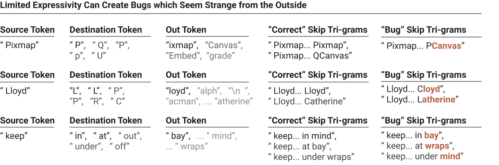

Highlighted text denotes skip-trigram continuations that the model presumably ideally wouldn't increase the probability of. Note that `QCanvas` [is a class](https://doc.qt.io/archives/3.3/qcanvas.html) involving pixmaps in the popular Qt library. `Lloyd... Catherine` likely refers to Catherine Lloyd Burns. These examples are slightly cherry-picked to be interesting, but very common if you look at the expanded weights for models linked above.

Even though these particular bugs seem in some sense trivial, we’re excited about this result as an early demonstration of using interpretability to understand model failures. We have not further explored this phenomenon, but we’d be curious to do so in more detail. For instance, could we characterize how much performance (in points of loss or otherwise) these “bugs” are costing the model? Does this particular class continue to some extent in larger models (presumably partially, but not completely, masked by other effects)?

### Summarizing OV/QK Matrices

We've turned the problem of understanding one-layer attention-only transformers into the problem of understanding their expanded OV and QK matrices. But as mentioned above, the expanded OV and QK matrices are enormous, with easily billions of entries. While searching for the largest entries is interesting, are there better ways to understand them? There are at least three reasons to expect there are:

* The OV and QK matrices are extremely low-rank. They are 50,000 x 50,000 matrices, but only rank d\_\text{head} (64 or 128). In some sense, they're quite small even though they appear large in their expanded form.
* Looking at individual entries often reveals hints of much simpler structure. For example, we observe one head where names of people all have the top queries like `" by"` (e.g. `"Anne… by → Anne"`) while location names have top queries like `" from"` (e.g. `"Canada… from → Canada"`). This hints at something like cluster structure in the matrix.
* Copying behavior is widespread in OV matrices and arguably one of the most interesting behaviors. (We'll see in the next section that there's analogous QK matrix structure in two layer models that's used to search for similar tokens to a query.) It seems like it should be possible to formalize this.

We don't yet feel like we have a clear right answer, but we're optimistic that the right kind of matrix decomposition or dimensionality reduction could be highly informative. (See the technical details appendix for notes on how to efficiently work with these large matrices.)

#### Detecting Copying Behavior

The type of behavior we're most excited to detect in an automated way is copying. Since copying is fundamentally about mapping the same vector to itself (for example, having a token increase its own probability) it seems unusually amenable to being captured in some kind of summary statistic.

However, we've found it hard to pin down exactly what the right notion is; this is likely because there are lots of slightly different ways one could draw the boundaries of whether something is a "copying matrix" and we're not yet sure what the most useful one is. For example, we don't observe this in the models discussed in this paper, but in slightly larger models we often observe attention heads which "copy" some mixture of gender, plurality, and tense from nearby words, helping the model use the correct pronouns and conjugate verbs. The matrices for these attention heads aren't exactly copying individual tokens, but it seems like they are copying in some very meaningful sense. So copying is actually a more complex concept than it might first appear.

One natural approach might be to use eigenvectors and eigenvalues. Recall that v\_i is an eigenvector of the matrix M with an eigenvalue \lambda\_i if Mv\_i = \lambda\_i v\_i. Let's consider what that means for an OV circuit M=W\_UW^h\_{OV}W\_E if \lambda\_i is a positive real number. Then we're saying that there's a linear combination of tokensBefore token embedding, we think of tokens as being one-hot vectors in a very high-dimensional space. Logits are also vectors. As a result, we can think about linear combinations of tokens in both spaces. which increases the linear combination of logits of those same tokens. Very roughly you could think of this as a set of tokens (perhaps all tokens representing plural words for a very broad one, or all tokens starting with a given first letter, or all tokens representing different capitalizations and inclusions of space for a single word for a narrow one) which mutually increase their own probability. Of course, in general we expect the eigenvectors have both positive and negative entries, so it's more like there are two sets of tokens (e.g. tokens representing male and female words, or tokens representing singular and plural words) which increase the probability of other tokens in the same set and decrease those in others.

The eigendecomposition expresses the matrix as a set of such eigenvectors and eigenvalues. For a random matrix, we expect to have an equal number of positive and negative eigenvalues, and for many to be complex.The most similar class of random matrix for which eigenvalues are well characterized is likely Ginibre matrices, which have Gaussian-distributed entries similar to our neural network matrices at initialization. Real valued Ginibre matrices are known to have positive-negative symmetric eigenvalues, with extra probability mass on the real numbers, and "repulsion" near them . Of course, in practice we are dealing with products of matrices, but empirically the distribution of eigenvalues for the OV circuit with our randomly initialized weights appears to mirror the Ginibre distribution.  But copying requires positive eigenvalues, and indeed we observe that many attention heads have positive eigenvalues, apparently mirroring the copying structure:


One can even collapse that down further and get a histogram of how many of the attention heads are copying (if one trusts the eigenvalues as a summary statistic):


It appears that 10 out of 12 heads are significantly copying! (This agrees with qualitative inspection of the expanded weights.)

But while copying matrices must have positive eigenvalues, it isn't clear that all matrices with positive eigenvalues are things we necessarily want to consider to be copying. A matrix's eigenvectors aren't necessarily orthogonal, and this allows for pathological examples;Non-orthogonal eigenvectors can have unintuitive properties. If one tries to express a matrix in terms of eigenvectors, one needs to multiply by the inverse of the eigenvector matrix, which can behave quite differently than naively projecting onto the eigenvectors in the non-orthogonal case. for example, there can be matrices with all positive eigenvalues that actually map some tokens to decreasing the logits of that same token. Positive eigenvalues still mean that the matrix is, in some sense, "copying on average", and they're still quite strong evidence of copying in that they seem improbable by default and empirically seem to align with copying. But they shouldn't be considered a dispositive proof that a matrix is copying in all senses one might reasonably mean.

One might try to formalize "copying matrices" in other ways. One possibility is to look at the diagonal of a matrix, which describes how each token affects its own probability. As expected, entries on the diagonal are very positive-leaning. We can also ask how often a random token increases its own probability more than any other token (or is one of the k-most increased tokens, to allow for tokens which are the same with a different capitalization or with a space). All of these seem to point in the direction of these attention heads being copying matrices, but it's not clear that any of them is a fully robust formalization of "the primary behavior of this matrix is copying". It's worth noting that all of these potential notions of copying are linked by the fact that the sum of the eigenvalues is equal to the trace is equal to the sum of the diagonal.

For the purposes of this paper, we'll continue to use the eigenvalue-based summary statistic. We don't think it's perfect, but it seems like quite strong evidence of copying, and empirically aligns with manual inspection and other definitions.

### Do We "Fully Understand" One-Layer Models?

There's often skepticism that it's even possible or worth trying to truly reverse engineer neural networks. That being the case, it's tempting to point at one-layer attention-only transformers and say "look, if we take the most simplified, toy version of a transformer, at least that minimal version can be fully understood."

But that claim really depends on what one means by fully understood. It seems to us that we now understand this simplified model in the same sense that one might look at the weights of a giant linear regression and understand it, or look at a large database and understand what it means to query it. That is a kind of understanding. There's no longer any algorithmic mystery. The contextualization problem of neural network parameters has been stripped away. But without further work on summarizing it, there's far too much there for one to hold the model in their head.

Given that regular one layer neural networks are just generalized linear models and can be interpreted as such, perhaps it isn't surprising that a single attention layer is mostly one as well.

  
  
  

  
  

## Two-Layer Attention-Only Transformers

Videos covering similar content to this section: [2 layer theory](https://www.youtube.com/watch?v=UM-eJbx_YDk&list=PLoyGOS2WIonajhAVqKUgEMNmeq3nEeM51&index=5), [2 layer term importance](https://www.youtube.com/watch?v=qom0nxou4f4&list=PLoyGOS2WIonajhAVqKUgEMNmeq3nEeM51&index=6), [2 layer results](https://www.youtube.com/watch?v=VuxANJDXnIY&list=PLoyGOS2WIonajhAVqKUgEMNmeq3nEeM51&index=7)

<!-- yt-inline:UM-eJbx_YDk -->
[![2L Attention  - Theory [rough early thoughts]](https://img.youtube.com/vi/UM-eJbx_YDk/hqdefault.jpg)](https://www.youtube.com/watch?v=UM-eJbx_YDk)

<details>
<summary>자막: 2L Attention  - Theory [rough early thoughts] (9:20)</summary>

[00:00]
in the last few videos we've had some
success trying to understand one layer
of attention only transformers
and so in this video we're going to move
on and try to study two layer attention
only transformers
now
this this first video on that topic is
going to just be about
some theory that we need to build up to
to do that
but i think it is really quite
worthwhile
and i found that the ideas that we can
build up uh studying two-layer attention
only models uh really actually
give us some useful traction on thinking
about transformers more generally
and we'll also when we when we in the
the video following this one get to the
point of actually actually empirically
studying what's going on inside these
models we'll find a bunch of things that
seem to be really important mechanisms
that exist in transformers of all sizes
and uh without any of the
simplifications that we're we're using
right now and so i think i think it's
pretty interesting to study these

[00:01]
so
recall that
in the the previous videos we developed
a pretty nice equation for
describing transformers we
were able to go
and describe them in terms of well first
we have this direct path term that
corresponds to this path here
and then we have
these terms corresponding to attention
heads which correspond to
all of these
these paths
and we found that there was a really
nice
uh interpretation of both of these this
could sort of be seen as being something
like bigram statistics and this term
here tells us if an attention head
attends to a particular token what is
the effect on the logins
and this tells us
this tells us
where the attention head attends so
uh that was pretty useful
and another way that we could write that
is we could say well uh we could put it

[00:02]
sort of in a factored form we could say
well okay the first thing you do is you
you multiply by w e the so first to
embed
then we apply the attention heads and
there's the identity path
as well
and then finally we do the unembedding
okay
so once you've done that it's pretty
easy to to generalize it to
a larger model
or to a model with more attention layers
we're just going to have multiple copies
of this term basically
now
you might have noticed that every time
we talk about wo it always comes with wv
and vice versa every time we talk about
wq it always comes with wk and because
these equations are going to get a
little bit larger and more complicated
for simplicity we're just going to
introduce these terms wqk and wov
that correspond to
uh those products so that's just a
little bit of a little bit of cleanup um
before we move on to the
equations

[00:03]
okay so um here we have
uh
our two layer attention only transformer
so we start by going and applying the
embedding so that's at the bottom here
then we're gonna go
and
talk about the first attention block so
that's
that's all of this
and within that we have the identity
term corresponds to this path and then
all these attention head terms that
correspond to these paths
and then we have the
the second layer attention heads
and then finally we have our good old
unembedding
now
uh we'd actually even though this is
sort of an easy way to
to go and describe it and we'd like to
expand this because expanding it will
give us
i think a more helpful helpful way to
think about the actual mechanics of the

[00:04]
system
um and we're going to take advantage of
this really nice property we sort of
implicitly talked about it earlier
that
when we have tensor products um and if
if you're not comfortable with tensor
products um make sure you watch the the
video on the theory of one layer um
attention heads where we talk about
these a little bit more but um when we
have tensor products like this
the
items on on one side of the tensor
product and we multiply them the items
on one side of the tensor product
multiply together
um and similarly the ones on on the left
hand side
end up going together as well this is
called the the mixed product identity
and it's really actually the whole
reason why i decided to frame
uh
this series in terms of of tensor
products
um and in the case of attention heads in
particular there's a really beautiful
interpretation of this which is that
if you chain really we're only going to
do this one when these are attention

[00:05]
heads and we're multiplying them
together so if you chain two attention
heads together the attention patterns
combine and create a new attention
pattern
and
the matrices that describe where the
attention head is reading from and
writing to also multiply together and
and you get something that looks very
much like an attention head so that's
the reason we care about that
okay so now we can write the expanded
form of that equation so we have um
first well we're going to have sort of
three types of terms so we have
the direct path term
and this is we've seen this term all the
way back to our zero layer transformer
um it's a good old friend and it just
corresponds to this direct path
down uh the transformer and it tends to
represent
bigram-ish statistics some of the
bi-gram statistics will start to migrate
into attention heads but um the kinds of
things that it represents are are
similar to bi-gram statistics
then we'll have
uh terms that correspond to going
through a single attention head and that

[00:06]
could go through an attention head in
the second layer or could also go
through an attention head in the first
layer
so these are the effects of attention
and then
finally
we have what i'm going to call
virtual attention ads so virtual tension
heads are when you have two attention
heads with a composition of two
attention heads
and that has also has some effect on the
output
and
and so virtual attention heads have this
nice property that they're
um they have yeah they're we just got
them through the
uh the mixed product identity that we
were talking about earlier so we we get
this attention pattern
they have an attention pattern of their
own which is the product of the two
attention patterns
and they have
um a
ov circuit of their own that describes
if they attend to a particular token
what the effect will be and it's just
the product of the
the
the first ov circuit and the the second
ob circuit
or the ov matrices at least

[00:07]
um
oh so that's what we that's what we had
okay so a question you might um well
okay stepping back for a second i think
one of the things that's really cool
about this is it really allows us to
study attention heads in a principled
way so i think a lot of the time um
there's been a lot of papers that i
think are there they're genuinely super
cool papers um where people go and study
uh attention patterns and they they're
like you know we found an intention head
that appears to attend from this to this
and maybe like it attends the subject of
the of the sentence or something like
this or if it's a verb it attends to the
subject or something like that
um
but it's
it's actually pretty tricky to know well
this sort of a conceptual problem which
is it's very tricky to think about
attention heads in isolation they could
be um the attention heads could be
reading information for other attention
heads um and they could be you know they
so they you know it might appear that an
attention head attends to one token and
moves it from
and and goes to a second token but it
could be that the the information that's
reading from that residual stream
actually came from an attention head
that was yet earlier and that the

[00:08]
attention had the information it moves
and writes that that attention that
information doesn't doesn't sort of that
isn't its final destination it yet moves
on further uh and so it's very easy to
be um i think potentially to to be
confused about this or at least to worry
that you might be being confused with
this um and it seems to me that uh at
least for the attention only case this
framework uh resolves that because uh if
if it was the case that
uh the important thing was was these
chains attention heads then those would
be the virtual attention heads and and
that would resolve all these you know
that and and the the the individual
attention head terms would sort of end
up being small and uh and that would
that would completely resolve it
so uh that made me really happy because
i've i think that i felt very
uncomfortable that when i've when i've
seen people talking about transform
interpretability for for a long time has
been this concern about uh chains of
attention heads and whether whether
attention patterns are really important
or whether they're just sort of
illusions um that are are parts of a

[00:09]
much longer chain and that we're missing
the whole story and it feels really good
to have have a framework that puts us on
on steady ground with respect to that
concern
okay
um so in our in our next video we'll be
able to go and actually start studying
these

</details>


<!-- yt-inline:qom0nxou4f4 -->
[![2L Attention - Term Importance [rough early thoughts]](https://img.youtube.com/vi/qom0nxou4f4/hqdefault.jpg)](https://www.youtube.com/watch?v=qom0nxou4f4)

<details>
<summary>자막: 2L Attention - Term Importance [rough early thoughts] (8:57)</summary>

[00:00]
in our last video we found that we could
describe two-layer attention only
transformers
and with a kind of handy equation
and
the equation has three kinds of terms
the direct path terms
the individual attention head terms
and the virtual attention head terms
and something that might be useful
to know before we spend a lot of time
trying to go and really understand the
behavior of the model is how important
are those different terms and it turns
out we can actually just explicitly
measure that and so that's what we'll do
so
for the direct path term
which is just going straight up down the
middle uh
if you haven't if you're measuring
relative to just making random
predictions
you reduce the loss by 1.8 knots
when you add that term to the model
so that's a that's a pretty nice draw
especially just for a single single very

[00:01]
simple term
[Music]
um
the individual attention heads then if
we go and we
uh add those in on top of the direct
path term
so then we have the individual attention
heads and
they go and give us
a reduction of 5.2 knots now
since there's 24 terms um it's it's
actually quite a bit less than the
direct path term per head and it's only
0.2 knots
um
but
uh yet they're still still doing a lot
of work
and then the virtual attention heads
they on top if you already have the
individual attention heads they only
give us a marginal
additional 0.3 knots
um and because there's there's
quadratically many of these right
because for every for every first layer
attention head and every second layer
attention head there's a there's one of
these pairs and that are the virtual
tension heads

[00:02]
and so the
the amount of of loss reduction we get
per term is very small 0.002
and
so probably if we're trying to
prioritize what we want to understand
our top priority should be of course the
wwe which is going to be very easy to
understand just sort of representing
bygramish statistics and
gives us a lot of bang um
for for its yeah for the effort um
but
uh then we want to study the individual
tension head pyramids probably
okay now you might wonder how is it that
we calculated this and there's kind of a
nice algorithm you can use to go
um and calculate uh how much these
different terms
contribute to the loss and you can use
it for this model but you can also use
it for larger models it's a um it scales
to potentially very large bottles
and the trick is
first you just run the model
and you save all your attention patterns
because we want to hold the attention

[00:03]
patterns fixed
okay so you do that
then
and you run the model
and you're going to force all the
attention patterns to be
the attention pattern that you recorded
um
but
instead of adding the attention head
outputs to the residual stream you'll
just save them and and replace them with
zero so you'll go and record what the
attention what the engine heads would
have added to the residual stream but
then you'll add zero instead
and you record the loss so that's
just calculating the direct path
contribution
then
and you're going to go and iteratively
run the model
and every time you run it you're going
to force the attention patterns to be
the original attention patterns but
instead of going and adding
uh the true output of your attention
heads to the residual stream you'll add
whatever the you would have added at the
previous step that you you replaced
and then you'll go and you'll save
and save the output for

[00:04]
so you can go and add it uh
on the next step
and the the nice thing about this is
that it means that
and
all of the attention heads
only saw
at most n minus one attention heads
um or sort of were only affected their
their values were only affected by n
minus one attention heads um at least
three through the ov circuit not through
the the effects of the attention
patterns but if you hold the attention
patterns fixed then
then that's true and so
that's a way that you can go and
understand that
um of course you could you could come up
with all sorts of variants on the
algorithms if you wanted to understand
how important things were also going
through the effects on attention
patterns you you could also do that
okay so uh we think that probably
we can ignore the virtual attention
heads um or at least they they aren't
our top priority to understand
for this model
now another question you could ask is we
have really two you know for the

[00:05]
attention end terms we sort of have two
different things we have the first layer
of tension heads
and the second layer attenuates
and we can ask
in terms of what is their direct effect
on the loss
how much do they affect the loss
and
uh there's sort of two ways you could
measure this one is you could measure
relative to there not being any
attention hints
or you could measure how much do they
add marginally on top of
the uh
yeah on top of the
the other
uh
other heads already being present so if
you have the if you have the if you want
to measure the layer one heads you could
either measure relative to the case
where there's uh where there's just no
other attention ends or relative to the
case where you've already added the
layer of two attentions
and to make a long story short um the
layer two heads have a much larger
direct effect
than the layer one heads
and if you measure it in terms of the

[00:06]
relative the direct or relative to only
having the direct path it's 5.2 knots
versus 1.3 nets if you measure it
relative to the other one being present
it's four nats versus 0.05 knots and if
you then go and divide by the number of
heads those are obviously getting to be
very small numbers for the for the layer
one
now that doesn't mean that the layer one
attention heads aren't important
and they can affect the attention
patterns as a layer two attention heads
and we'll see that they're doing a
really critical job in that um but it
means that in terms of this this overall
equation we have um we don't need to go
and worry as much about the layer to
attention ants
so we can mostly understand the model by
understanding the behavior of 12
attention heads
um and those 12 attention heads their
their attention patterns are influenced
by earlier attention ends but um if we
understand those those 12 attention
heads um for instance you could just
empirically understand their their
attention behavior as a starting point
um and their ov circuits you'd
understand uh the model's behavior

[00:07]
um
but yeah it's really important to keep
in mind
that whenever you see
uh the attention pattern here
particularly not only is it non-linear
but for for later layers and that also
contains eventually lots of effects of
previous
uh previous attention
and in fact we can we can make that
explicit if we want so
when we looked at the first layer the
equation for our attention pattern was
this
and so
uh it's a little bit complicated but
it's um you know we this is the thing
that we called our qk
circuit matrix and we're multiplying
multiplying by tokens on both sides
but when we go and then move to
uh
the
the two layer model
all of a sudden it becomes a lot more
complicated

[00:08]
and what's going on
is that
rather than just having the tokens
get embedded and then affect things and
they first go through
all the attention heads in the previous
layer and then they hit the uk matrix
then they the the keys also were
computed using all of the attention
heads and
after they they went through the token
so on both sides we have um attention
heads and if you you can expand this all
out of course and if you want to really
analyze this then you'll have a bunch of
terms that involve um first layer
attention heads uh going and and
contributing to the to the attention
pattern
um you'll still have something like a qk
circuit uh it's but it's it'll be a bit
more complex
in any case now that we know what the
right terms to focus on are we're ready
to go and explore the model and
understand its behavior in our next
video

</details>


<!-- yt-inline:VuxANJDXnIY -->
[![2L Attention - Results [rough early thoughts]](https://img.youtube.com/vi/VuxANJDXnIY/hqdefault.jpg)](https://www.youtube.com/watch?v=VuxANJDXnIY)

<details>
<summary>자막: 2L Attention - Results [rough early thoughts] (11:52)</summary>

[00:00]
well we're now ready to actually
understand two-layer attention-only
transformers and i think there's
actually some really cool stuff inside
them so i'm excited to chat about this
uh in particular there's gonna be some
really interesting stuff that they're
doing uh that kind of is meta learning
relevant and seems to generalize to much
larger models and so
hopefully we'll learn some some
interesting and generalizable lessons
now
if you watched our our previous video on
eigenvalue analysis you'll remember that
um eigenvalues are kind of a nice way to
summarize the behavior of retention
heads without having to look at them uh
very closely
and
in particular positive eigenvalues for
an ov circuit for the output value
circuit mean that an attention head
wants to increase the probability
of
um that the output is the same it'll
increase the probability uh or increase
the logits for the that the output is
the same as the token that it's
attending to
so uh really it just means the attention

[00:01]
head is implementing copying
and
if you you know last time we saw that
really the behavior of our two layer
transformers is mostly described by
understanding
the
second layer attention heads
and there's 12 of those and of those 12
7 are doing copying so it's a little bit
less than when we were looking at the
one layer model but still
the majority of our attention heads are
doing doing coffee and we're going to
see they're doing a much more
interesting type of copying and a much
more powerful type of copying than
the one layer model was
yeah so
we could try to go and study this by
analyzing the qk circuits um the math
would get a little bit complicated so an
alternative is that we can try to just
empirically uh understand
the attention patterns and then
we can go from there if we want and try
to understand more about the math of the
qk circuits
and something that we see a lot of

[00:02]
is what we call
the induction pattern
and
so
for instance if we look here and it
might be a little bit hard to read so
let's let's focus
on
this d token so that's the present token
and
if we look back it attends really
strongly to ers
which is the next token
after d
and if then we go and when we look at
when the present token is ers
it tends to lead
and this is a very general thing so you
know similarly um
when
uh when the present token is pot um so
this is all from the first paragraph of
harry potter by the way um i think
probably maybe we've mentioned that in a
previous video or maybe we haven't but i
i've been having some fun using that as
a standard um piece of text to go and
play around with
um but you can also observe this on lots
of other lots of other text and it works

[00:03]
very reliably
um but yeah so if we if the present
token is pot um well we have the potters
so we we attend to the next token the
token that follows pot previously tours
okay and so we're starting to get a
pretty good hypothesis maybe what's
going on here which is that somehow
this attention head
always attends to the token
that follows previous copies of the
present token so if we if we're on pot
the previous copy was pot and then we
get terms
okay so how could it be
well that's kind of interesting now a
natural hypothesis is that the reason it
does that is that it would allow it to
go and predict then what the next token
is because the the goal of the present
token here is to predict the next token
and we can actually just measure that we
just take the output of the attention
head and it just has a linear path down
to the to the logits and so we can just
run that into the logit
and even without analyzing the terms we
can just see the empirical effect um on

[00:04]
the logits and it's indeed going and
predicting errors going and predicting
lee
uh going and predicting a little bit um
the pot on on potter so we have that pot
that pot um but then the deters and
plotters really strongly and so it's
increasing the probability of all of
those
and in each of those cases it was
attending
to that token
so it's copying it's copying the errors
to the errors and then we have this
hypothesis that maybe somehow the way
it's doing that is because the previous
copy of d
um or the present token is d and that
was the token that proceeded where we
attended
so we'll call that the induction pattern
and we can actually verify our
hypothesis that um that was that it's
actually
looking for the fact it's sort of um
that the fact that the previous token is
the same is what it's looking for
and and if we if we just look at how the
key for this um so let's let's let's

[00:05]
pick a particular case so where where
we're on
pot and it tends to terms well it turns
out that if you look at how the key is
computed the key isn't computed for the
present token but it's actually computed
from the previous token so we shift
the we grab the content of the
proceeding token
and inject that into some subspace and
then use it to construct our key
whereas we construct our query mostly
from the present token
and so by going and looking for then
looking looking to go and match the
present token with the subspace that we
stored listen we're able to go and look
for tokens that follow a token that
matches the present token
so that's a little bit more of a complex
algorithm than anything we've seen it's
almost a little bit like nearest
neighbors um
and that you're you're you're sort of
you're searching for for you're almost
treating your your text up to this point
as as being a little bit like a training
set and you're looking for places where
um
where there's a match and then you're
going and copying that or something

[00:06]
now it does other interesting things too
so and you know sometimes it's just the
present token that matters but there's
also cases where like here we have have
this d and if you look at this and i
don't have it here but if you uh if you
interactively play around with this
you'll see that it really is that the d
of this query matches the d of this key
and the mister of this query matches the
mister and to a lesser extent the misses
portion of the the key over there
and so um they match and then that
causes us to attend to errs which then
increases the probability of verb so it
really is this this copying thing and
we're we're calling that that general
mechanism of um looking for looking for
the token that in the past has preceded
your present token looking looking for
situations where that were analogous to
your present situation and then
predicting that whatever happened last
whatever whatever happened next in the
past is what's going to happen next now
that's what we call
um induction and or an induction head
and that seems to really be the kind of
the workhorse of metal meta-learning and

[00:07]
a lot of transformers we see it in large
models and it seems to seems to be
playing a big role
um and it's not just one of them
one head like this we actually see a lot
of heads that are doing slightly
different flavors of this
um some are are sort of very strict
versions that are really looking for
exact matches um
and
uh exact uh yeah exact matches and
copying
whereas authors are a little bit more
flexible like here we have um
dursley probably mr dursley was he
and then we copy was
um
or
uh huge
and then didn't um but probably if
you're using apostrophes that's and
contractions you're likely to do that
again in the future
uh so yeah we see a lot of this this
kind of induction
now
uh
yeah is there some way that we we have
this really handy trick for detecting

[00:08]
heads that do copying um by just looking
at the the ov eigenvalues and we
mentioned previously when we talked
about their video on eigenvalue analysis
that um having positive qk eigenvalues
would mean that we were attending to
uh that we were trying to attend tokens
that are similar
and so we can apply that same trick and
and
uh here are our qk circuits a little bit
more complex it's rather than looking
for a positive eigenvalue meaning that
um
that we're attending literally to the
token that's the same as our present
token it means that we're attending to a
token um where wherever the key is being
constructed from is the same
as our present uh token uh we're really
the same as wherever our query is being
constructed from um but that's still
author if the if the keys if the qk
eigenvalues are positive that's a very
strong sign that we're doing something
like induction and
um
the ov eigenvalues mean that we're doing
copying and so if we see if both are
positive that's a sort of very strong
signal that we're seeing induction

[00:09]
and we can see that there's six heads
that are quite clearly doing this
and then another one uh
that is maybe doing this a little bit
but it's a little bit a bit messier
now that leaves a number of other heads
that aren't going and doing copying and
aren't aren't induction heads and
i don't one of the reasons i'm focusing
on on induction heads so much is because
they seem to be genuinely really
generalizable to larger models or the
transformers generally and seem to be
sort of a very important story about how
transformers work i don't know that i
have any really interesting
generalizable takeaway about these other
heads and not based on the study that
i've done on this model so far a lot of
them seem to be doing sort of like
slightly engramed stuff
um
and
yeah so i'm not going to focus as much
on them
oh one final thing that's worth
mentioning is um just like we were able
to go and do a histogram in the video

[00:10]
that we did on eigenvalues to go and
sort of quickly quickly summarize the
heads in a really dense way and we can
put the
uh
the the
the sum of the qk eigenvalues divided by
the sum of their absolute values on one
axis and the same thing for the ov
values on another axis
and then attention heads that have both
um very very positive on both of those
so tends to to really copy and tend to
prefer to look at places where a token
is the same they'll be up in that corner
and other tokens won't be in so that's a
an even denser way to go and and really
systematically uh pin down the really in
a really automated way pin down the
induction heads
uh okay so a couple takeaways um
these induction heads seem to be uh
really a major mechanism for metal
learning
um and they seem to be a lot more
effective than simple copying heads
and
we can automatically detect them which

[00:11]
is is pretty cool
uh yeah and yeah i mentioned this
earlier but the the other attention
heads um they tend to be doing kind of
local stuff and it's not clear that we
have a really generalizable story so
we're not going to pay too much
attention to them
well in any case i think it's pretty
exciting that we can uh on really
mechanistically understand uh some of
how these these two layer models work
and with enough effort if we wanted to
we could probably probably really
understand them
um
and
a lot of the ideas that we built up here
um the the general sort of form of this
equation of thinking about um thinking
about intentionally models and this idea
of virtual tension heads um are actually
i think kind of generalizable um and
will be useful as we start thinking
about about larger and more complex
models

</details>


Deep learning studies models that are deep, which is to say they have many layers. Empirically, such models are very powerful. Where does that power come from? One intuition might be that depth allows composition, which creates powerful expressiveness.

Composition of attention heads is the key difference between one-layer and two-layer attention-only transformers. Without composition, a two-layer model would simply have more attention heads to implement skip-trigrams with. But we'll see that in practice, two-layer models discover ways to exploit attention head composition to express a much more powerful mechanism for accomplishing in-context learning. In doing so, they become something much more like a computer program running an algorithm, rather than look-up tables of skip-trigrams we saw in one-layer models.

### Three Kinds of Composition

Recall that we think of the residual stream [as a communication channel](#residual-comms). Every attention head reads in subspaces of the residual stream determined by W\_Q, W\_K, and W\_V, and then writes to some subspace determined by W\_O. Since the attention head vectors are much smaller than the size of the residual stream (typical values of d\_\text{head} / d\_\text{model} might vary from around 1/10 to 1/100), attention heads operate on small subspaces and can easily avoid significant interaction.

When attention heads do compose, there are three options:

* Q-Composition: W\_Q reads in a subspace affected by a previous head.
* K-Composition: W\_K reads in a subspace affected by a previous head.
* V-Composition: W\_V reads in a subspace affected by a previous head.

Q- and K-Composition are quite different from V-Composition. Q- and K-Composition both affect the attention pattern, allowing attention heads to express much more complex patterns. V-Composition, on the other hand, affects what information an attention head moves when it attends to a given position; the result is that V-composed heads really act more like a single unit and can be thought of as creating an additional "virtual attention heads". Composing movement of information with movement of information gives movement of information, whereas attention heads affecting attention patterns is not reducible in this way.

To really understand these three kinds of composition, we'll need to study the OV and QK circuits again.

### Path Expansion of Logits

The most basic question we can ask of a transformer is "how are the logits computed?" Following [our approach](#onel-path-expansion) to the one-layer model, we write out a product where every term is a layer in the model, and expand to create a sum where every term is an end-to-end path through the model.


Two of these terms, the direct path term and individual head terms, are identical to the one-layer model. The final "virtual attention head" term corresponds to V-Composition. Virtual attention heads are conceptually very interesting, and we'll discuss them more later. However, in practice, we'll find that they tend to not play a significant role in small two-layer models.

### Path Expansion of Attention Scores QK Circuit

Just looking at the logit expansion misses what is probably the most radically different property of a two-layer attention-only transformer: Q-composition and K-composition cause them to have much more expressive second layer attention patterns.

To see this, we need to look at the QK circuits computing the attention patterns. Recall that the attention pattern for a head h is A^h~ =~ \text{softmax}^\*\!\left( t^T \cdot C\_{QK}^h t \right), where C\_{QK}^h is the "QK-circuit" mapping tokens to attention scores. For first layer attention heads, the QK-circuit is just the same matrix we saw in the one-layer model: C^{\,h\in H\_1}\_{\,QK}~ =~ W\_E^T W\_{QK}^h W\_E.

But for the second layer QK-circuit, both Q-composition and K-composition come into play, with previous layer attention heads potentially influencing the construction of the keys and queries. Ultimately, W\_{QK} acts on the residual stream. In the case of the first layer this reduced to just acting on the token embeddings: C^{\,h\in H\_1}\_{\,QK}~ =~ x\_0^T W\_{QK}^h x\_0 =~ W\_E^T W\_{QK}^h W\_E. But by the second layer, C^{\,h\in H\_2}\_{\,QK}~ =~ x\_1^T W\_{QK}^h x\_1 is acting on x\_1, the residual stream after first layer attention heads. We can write this down as a product, with the first layer both on the "key side" and "query side." Then we apply our path expansion trick to the product.

One complicating factor is that we have to write it as a 6-dimensional tensor, using two tensor products on matrices. This is because we're trying to express a multilinear function of the form  [n\_\text{context},~ d\_\text{model}] \times [n\_\text{context},~ d\_\text{model}] ~\to~ [n\_\text{context},~ n\_\text{context}]. In the one-layer case, we could side step this by implicitly doing an outer product, but that no longer works. A natural way to express this is as a (4,2)-tensor (one with 4 input dimensions and 2 output dimensions). Each term will be of the form A\_q \otimes A\_k \otimes W where x (A\_q \otimes A\_k \otimes W) y = A\_q^T x W y A\_k, meaning that A\_q describes the movement of query-side information between tokens, A\_k describes the movement of key-side information between tokens, and W describes how they product together to form an attention score.


Each of these terms corresponds to a way the model can implement more complex attention patterns. In the abstract, it can be hard to reason about them. But we'll return to them with a concrete case shortly, when we talk about induction heads.

### Analyzing a Two-Layer Model

So far, we've developed a theoretical model for understanding two-layer attention-only models. We have an overall equation describing the logits (the OV circuit), and then an equation describing how each attention head's attention pattern is computed (the QK circuit). But how do we understand them in practice? In this section, we'll reverse engineer a single two-layer model.

Recall that the key difference between a two-layer model and a one-layer model is Q-, K-, and V-composition. Without composition, the model is just a one-layer model with extra heads.

Small two-layer models seem to often (though not always) have a very simple structure of composition, where the only type of composition is K-composition between a single first layer head and some of the second layer heads.There appears to be no significant V- or Q- composition in this particular model. The following diagram shows Q-, K-, and V-composition between first and second layer heads in the model we wish to analyze. We've colored the heads involved by our understanding of their behavior. The first layer head has a very simple attention pattern: it primarily attends to the previous token, and to a lesser extent the present token and the token two back. The second layer heads are what we call *induction heads*.

### Correction

The following diagram has an error introduced by a bug in an underlying library we wrote to accelerate linear algebra on low-rank matrices. A detailed comment on this, along with a corrected figure, can be [found below](#comment-errata).


The above diagram shows Q-, K-, and V-Composition between attention heads in the first and second layer. That is, how much does the query, key or value vector of a second layer head read in information from a given first layer head? This is measured by looking at the Frobenius norm of the product of the relevant matrices, divided by the norms of the individual matrices. For Q-Composition, ||W\_{QK}^{h\_2~T}W\_{OV}^{h\_1}||\_F / (||W\_{QK}^{h\_2~T}||\_F ||W\_{OV}^{h\_1}||\_F), for K-Composition ||W\_{QK}^{h\_2}W\_{OV}^{h\_1}||\_F / (||W\_{QK}^{h\_2}||\_F ||W\_{OV}^{h\_1}||\_F), for V-Composition ||W\_{OV}^{h\_2}W\_{OV}^{h\_1}||\_F / (||W\_{OV}^{h\_2}||\_F ||W\_{OV}^{h\_1}||\_F). By default, we subtract off the empirical expected amount for random matrices of the same shapes (most attention heads have a much smaller composition than random matrices). In practice, for this model, there is only significant K-composition, and only with one layer 0 head.

One quick observation from this is that most attention heads are not involved in any substantive composition. We can think of them as, roughly, a larger collection of skip tri-grams. This two-layer model has a mystery for us to figure out, but it's a fairly narrowly scoped one. (We speculate this means that having a couple induction heads in some sense "outcompetes" a few potential skip-trigram heads, but no other type of composition did. That is, having more skip-trigram heads is a competitive use of second layer attention heads in a small model.)

In the next few sections, we'll develop a theory of what's going on, but before we do, we provide an opportunity to poke around at the attention heads using the interactive diagram below, which displays value-weighted attention patterns over the first paragraph of *Harry Potter and the Philosopher's Stone*. We've colored the attention heads involved in K-composition using the same scheme as above. (This makes it a bit hard to investigate the other heads; if you want to look at those, an interface for general exploration is available [here](https://transformer-circuits.pub/2021/framework/2L_HP_normal.html)).

We recommend isolating individual heads and both looking at the pattern and hovering over tokens. For induction heads, note especially the off-diagonal lines in the attention pattern, and the behavior on the tokens compositing Dursley and Potters.

The above diagram shows the *value-weighted attention pattern* for various attention heads; that is, the attention patterns with attention weights scaled by the norm of the value vector at the source position ||v\_{src}^h||. You can think of the value-weighted attention pattern as showing "how big a vector is moved from each position." (This approach was also recently introduced by Kobayashi et al. .) This is especially useful because attention heads will sometimes use certain tokens as a kind of default or resting position when there isn't a token that matches what they're looking for; the value vector at these default positions will be small, and so the value weighted pattern is more informative.   
  
The interface allows one to isolate attention heads, shows the overall attention pattern, and allows one to explore the attention for individual tokens. Attention heads involved in K-composition are colored using the same scheme as above. We suggest trying to isolate these heads.

If you look carefully, you'll notice that the aqua colored "induction heads" often attend back to previous instances of the token which *will* come next. We'll investigate this more in the next section. Of course, looking at attention patterns on a single piece of text — especially a well-known paragraph like this one — can't give us very high confidence as to how these heads behave in generality. We'll return to this later, once we have a stronger hypothesis of what's going on.

### Induction Heads

In small two-layer attention-only transformers, composition seems to be primarily used for one purpose: the creation of what we call induction heads. We previously saw that the one-layer model dedicated a lot of its capacity to copying heads, as a crude way to implement in-context learning. Induction heads are a much more powerful mechanism for achieving in-context learning. (We will explore the role of induction heads in in-context learning in more detail in our [next paper](https://transformer-circuits.pub/2022/in-context-learning-and-induction-heads/index.html).)

#### Function of Induction Heads

If you played around with the attention patterns above, you may have already guessed what induction heads do. Induction heads search over the context for previous examples of the present token. If they don't find it, they attend to the first token (in our case, a special token placed at the start), and do nothing. But if they do find it, they then look at the next token and copy it. This allows them to repeat previous sequences of tokens, both exactly and approximately.

It's useful to compare induction heads to the types of in-context learning we observed in one layer models:

* One layer model copying head: `[b] … [a] → [b]`

* And when rare quirks of tokenization allow: `[ab] … [a] → [b]`

* Two layer model induction head: `[a][b] … [a] → [b]`

The two-layer algorithm is more powerful. Rather than generically looking for places it might be able to repeat a token, it knows how the token was previously used and looks out for similar cases. This allows it to make much more confident predictions in those cases. It's also less vulnerable to distributional shift, since it doesn't depend on learned statistics about whether one token can plausibly follow another. (We'll see later that induction heads can operate on repeated sequences of completely random tokens)

The following examples highlight a few cases where induction heads help predict tokens in the first paragraph of Harry Potter:


Raw attention pattern and logit effect for the induction head `1:8` on some segments of the first paragraph of *Harry Potter and the Philosopher's Stone*. The "logit effect" value shown is the effect of the result vector for the present token on the logit for the next token, (W\_U W\_O^h r^h\_\text{pres\\_tok})\_\text{next\\_tok}, which is equivalent to running the full OV circuit and inspecting the logit this head contributes to the next token.

Earlier, we promised to show induction heads on more tokens in order to better test our theory of them. We can now do this.

Given that we believe induction heads are attending to previous copies of the token and shifting forward, they should be able to do this on totally random repeated patterns. This is likely the hardest test one can give them, since they can't rely on normal statistics about which tokens typically come after other tokens. Since the tokens are uniformly sampled random tokens from our vocabulary, we represent the nth token in our vocabulary as `<n>`, with the exception of the special token `<START>`. (Notice that this is totally off distribution. Induction heads can operate on wildly different distributions as long as the more abstract property that repeated sequences are more like to reoccur holds true.)

As in our previous attention pattern diagram, this diagram shows the value-weighted attention pattern for various heads, with each head involved in K-composition colored by our theory. Attention heads are shown acting on a random sequence of tokens, repeated three times.`<n>` denotes the nth token in our vocabulary.

This seems like pretty strong evidence that our hypothesis of induction heads is right. We now know what K-composition is used for in our two layer model. The question now is *how* K-composition accomplishes it.

#### How Induction Heads Work

The central trick to induction heads is that the key is computed from tokens shifted one token back.For models with position embeddings which are available in the residual stream (unlike rotary attention), a second algorithm for implementing induction heads is available; see our intuitions around position embeddings and pointer arithmetic algorithms in transformers. The query searches for "similar" key vectors, but because keys are shifted, finds the next token.

The following example, from a larger model with more sophisticated induction heads, is a useful illustration:


QK circuits can be expanded in terms of tokens instead of attention heads. Above, key and query intensity represent the amount each token increases the attention score. Logit effect is the OV circuit.

The minimal way to create an induction head is to use K-composition with a previous token head to shift the key vector forward one token. This creates a term of the form \text{Id} \otimes A^{h\_{-1}} \otimes W in the QK-circuit (where A^{h\_{-1}} denotes an attention pattern attending to the previous token). If W matches cases where the tokens are the same — the QK version of a ["copying matrix"](#copying-matrix) — then this term will increase attention scores when the previous token before the source position is the same as the destination token. (Induction heads can be more complicated that this; for example, other 2-layer models will develop an attention head that attends a bit further than the previous token, presumably to create a A^{h\_{-1}} \otimes A^{h\_{-2}} \otimes W term so some heads can match back further).

#### Checking the Mechanistic Theory

Our mechanistic theory suggestions that induction heads must do two things:

* Have a "copying" OV circuit matrix.
* Have a "same matching" QK circuit matrix associated with the \text{Id} \otimes A^{h\_{-1}} \otimes W term.

Although we're not confident that the eigenvalue summary statistic from the [Detecting Copying section](#copying-matrix) is the best possible summary statistic for detecting "copying" or "matching" matrices, we've chosen to use it as a working formalization. If we think of our attention heads as points in a 2D space of QK and OV eigenvalue positivity, all the induction heads turn out to be in an extreme right hand corner.

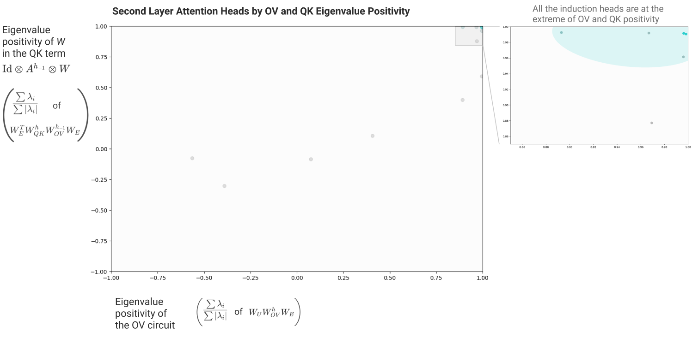

One might wonder if this observation is circular. We originally looked at these attention heads because they had larger than random chance K-composition, and now we've come back to look, in part, at the K-composition term. But in this case, we're finding that the K-composition creates a matrix that is extremely biased towards positive eigenvalues — there wasn't any reason to suggest that a large K-composition would imply a positive K-composition. Nor any reason for all the OV circuits to be positive.

But that is exactly what we expect if the algorithm implemented is the described algorithm for implementing induction.

### Term Importance Analysis

Earlier, we decided to ignore all the "virtual attention head" terms because we didn't observe any significant V-composition. While that seems like it's probably right, there's ways we could be mistaken. In particular, it could be the case that while every individual virtual attention head wasn't important, they matter in aggregate. This section will describe an approach to double checking this using ablations.

Ordinarily, when we ablate something in a neural network, we're ablating something that's explicitly represented in the activations. We can simply multiply it by zero and we're done. But in this case, we're trying to ablate an implicit term that only exists if you expand out the equations. We could do this by trying to run the version of a transformer described in our equations, but that would be horribly slow, and get exponentially worse as we considered deeper models.

But it turns out there's an algorithm which can determine the marginal effect of ablating the nth order terms (that is, the terms corresponding to paths through V-composition of n attention heads). The key trick is to run the model multiple times, replacing the present activations with activations from previous times you ran the model. This allows one to limit the depth of path, ablating all terms of order greater than that. Then by taking differences between the observed losses for each ablation, we can get the marginal effect of the nth order terms.

Algorithm for measuring marginal loss reduction of nth order terms

Step 1: Run model, save all attention patterns.

Step 2: Run model, forcing all attention patterns to be the version you recorded, and instead of adding attention head outputs to residual stream, save the output, and then replace it with a zero tensor of the same shape. Record resulting loss.

Step n: Run model, forcing all attention patterns to be the version you recorded, and instead of adding attention head outputs to residual stream, save the output, and replace it with the value you saved for this head last time. Record resulting loss.

(Note that freezing the attention patterns to ground truth is what makes this ablation only target V-composition. Although this is in some ways the simplest algorithm, focused on the OV circuit, variants of this algorithm could also be used to isolate Q- or K-composition.)

As the V-composition results suggested, the second order “virtual attention head” terms have a pretty small marginal effect in this model. (Although they may very well be more important in other — especially larger — models.)


We conclude that for understanding two-layer attention only models, we shouldn’t prioritize understanding the second order “virtual attention heads” but instead focus on the direct path (which can only contribute to bigram statistics) and individual attention head terms. (We emphasize that this says nothing about Q- and K-Composition; higher order terms in the OV circuit not mattering only rules out V-Composition as important. Q- and K-Composition correspond to terms in the QK circuits of each head instead.)

We can further subdivide these individual attention head terms into those in layer 1 and layer 2:


This suggests we should focus on the second layer head terms.

### Virtual Attention Heads

Although virtual heads turned out to be fairly unimportant for understanding the performance of the two layer model, we speculate that these may be much more important in larger and more complex transformers. We're also struck by them because they seem theoretically very elegant.

Recall that virtual attention heads were the terms of the form (A^{h\_2}A^{h\_1}) \otimes (\ldots W\_{OV}^{h\_2}W\_{OV}^{h\_1}\ldots) in the path expansion of the logit equation, corresponding to the V-composition of two heads.

Where Q- and K-Composition affect the attention pattern, V-Composition creates these terms which really operate as a kind of independent unit which performs one head operation and then the other. This resulting object really is best thought of as the composition of the heads, h\_2 \circ h\_1. It has its own attention pattern, A^{h\_2 \circ h\_1} = A^{h\_2}A^{h\_1} and it's own OV matrix W\_{OV}^{h\_2 \circ h\_1} = W\_{OV}^{h\_2}W\_{OV}^{h\_1}. In deeper models, one could in principle have higher order virtual attention heads (e.g. h\_3 \circ h\_2 \circ h\_1).

There are two things worth noting regarding virtual attention heads.

Firstly, this kind of composition seems quite powerful. We often see heads whose attention pattern attends to the previous token, but not heads who attend two tokens back - this may be because any useful predictive power from the token two back is gained via virtual heads. Attention patterns can also implement more abstract things, such as attending to the start of the current clause, or the subject of the sentence - composition enables functions such as ‘attend to the subject of the previous clause’.

Secondly, there are a lot of virtual attention heads. The number of normal heads grows linearly in the number of layers, while the number of virtual heads based on the composition of two heads grows quadratically, on three heads grows cubically, etc. This means the model may, in theory, have a lot more space to gain useful predictive power via the virtual attention heads. This is particularly important because normal attention heads are, in some sense, “large”. The head has a single attention pattern determining which source tokens it attends to, and d\_{\text{head}} dimensions to copy from the source to destination token. This makes it unwieldy to use for intuitively “small” tasks where not much information needs to be conveyed, eg attending to previous pronouns to determine whether the text is in first, second or third person, or attending to tense markers to detect whether the text is in past, present or future text.

  
  
  

  
  

## Where Does This Leave Us?

Over the last few sections, we've made progress on understanding one-layer and two-layer attention-only transformers. But our ultimate goal is to understand transformers in general. Has this work actually brought us any closer? Do these special, limited cases actually shed light on the general problem? We'll explore this issue in follow-up work, but our general sense is that, yes, these methods can be used to understand portions of general transformers, including large language models.

One reason is that normal transformers contain some circuits which appear to be primarily attentional. Even in the presence of MLP layers, attention heads still operate on the residual stream and can still interact directly with each other and with the embeddings. And in practice, we find instances of interpretable circuits involving only attention heads and the embeddings. Although we may not be able to understand the entire model, we're very well positioned to reverse engineer these portions.

In fact, we actually see some analogous attention heads and circuits in large models to those we analyzed in these toy models! In particular, we'll find that large models form many induction heads, and that the basic building block of their construction is K-composition with a previous token head, just as we saw here. This appears to be a central driver of in-context learning in language models of all sizes – a topic we'll discuss in our next paper.

That said, we can probably only understand a small portion of large language models this way. For one thing, MLP layers make up 2/3rds of a standard transformer's parameters. Clearly, there are large parts of a model’s behaviors we won’t understand without engaging with those parameters. And in fact the situation is likely worse: because many attention heads interact with the MLP layers, the fraction of parameters we can understand without considering MLP layers is even smaller than 1/3rd. More complete understanding will require progress on MLP layers. At a mechanistic level, their circuits actually have a very nice mathematical structure (see [additional intuition](#additional-intuition)). However, the clearest path forward would require individually interpretable neurons, which we've had limited success finding.

Ultimately, our goal in this initial paper is simply to establish a foothold for future efforts on this problem. Much future work remains to be done.

  
  
  

  
  

## Related Work

#### Circuits

The [Distill Circuits thread](https://distill.pub/2020/circuits/)  was a concerted effort to reverse engineer the InceptionV1 model. Our work seeks to do something similar for large language models.

The Circuits approach needs to be significantly rethought in the context of language models. Attention heads are quite different from anything in conv nets and needed a new approach. The linear structure of the residual stream creates both new challenges (the lack of a privileged basis removes some options for studying it) but also creates opportunities (we can expand through it). Having circuits which are bilinear forms rather than just linear is also quite unusual (although it was touched on by Goh et al. who investigated bilinear interactions between the image and language models).

We've noticed several interesting, high-level differences between the original circuits work on InceptionV1 and studying circuits in attention-only transformer language models:

* It's possible that circuit analysis of attention-only models scales very differently with model size. In an attention-only model, parameters are arranged in comparatively large, meaningful, largely linearly operating chunks corresponding to attention heads. This creates lots of opportunities to "roughly understand" quite large numbers of parameters. Even very large models only have a few thousand attention heads -- a scale where looking at every single one seems plausible. Of course, once one adds MLP layers, the majority of parameters are inside of them and this becomes a smaller relative win for understanding models.
* We've had a lot more success studying circuits in tiny attention-only transformers than we did with attempting to study circuits in small vision models. In small vision models, the problem is that neurons often aren't interpetable; nothing analogous seems to happen here, since we can reduce everything into end-to-end terms. However, perhaps when we study models with MLP layers (which can't be reduced into end-to-end terms) more closely, we'll also find that scale is needed to make neurons interpretable.

#### The Logit Lens

Previous work by the LessWrong user Nostalgebraist on a method they call the ["Logit Lens"](https://www.lesswrong.com/posts/AcKRB8wDpdaN6v6ru/interpreting-gpt-the-logit-lens) explores the same linear structure of the residual stream we heavily exploit. The logit lens approach notes that, since the residual stream is iteratively refined, one can apply the unembedding matrix to earlier stages of the residual stream (ie. essentially look at W\_U x\_i) to look at how model predictions evolve in some sense.

Our approach could be seen as making a similar observation, but deciding that the residual stream isn't actually the fundamental object to study. Since it's the sum of linear projections of many attention heads and neurons, it's natural to simply multiply out the weights to look at how all the different parts contributing to the sum connect to the logits. One can then continue to exploit linear structure and try to push linearity as far back into the model as possible, which roughly brings one to our approach.

#### Attention Head Analysis

Our work follows the lead of several previous papers in exploring investigating transformer attention heads. Investigation of attention patterns likely began with visualizations by Llion Jones  and was quickly expanded on by others . More recently, several papers have begun to seriously investigate correspondences between attention heads and grammatical structures .

The largest difference between these previous analyses of attention heads and our work really seems to be a matter of goals: we seek to provide an end-to-end mechanistic account, rather than empirically describe attention patterns. Of course, this preliminary paper is also different from this prior work in that we only studied very small toy models, and only really then to illustrate and support our theory. Finally, we focus on autoregressive transformers, rather than a denoising model like BERT .

Our investigations benefitted from these previous papers, and we have some miscellaneous thoughts on how our results relate to them:

* Like most of these papers (e.g. ), we observe the existence of a previous token attention head in most models. Sometimes in small models we get an attention head that's more smeared out over the last two or three tokens instead.
* We mirror others findings that many attention heads appear to use punctuation or special tokens as a default  (e.g. ). Induction heads provide a concrete example of this. Similar to Kobayashi et al.  we find scaling attention patterns by the magnitude of value vectors to be very helpful for clarifying this.
* The toy models discussed in this paper do not exhibit the sophisticated grammatical attention heads described by some of this prior work. However, we do find more similar attention heads in larger models.
* Votia et al.  describe attention heads which preferentially attend to rare tokens; we wonder if those might be similar to the skip-trigram attention heads we describe.
* Several papers note the existence of attention heads which attend to previous references to the present token. It occurs to us that what we call an "induction head" might appear like this in a bidirectional model trained on masked data rather than an autoregressive model (the mechanistic signature would be an A^{h\_{prev}} \otimes A^{h\_{prev}} \otimes W in the QK expansion with large positive eigenvalues).

#### Criticism of Attention as Explanation

An important line of work critiques the naive interpretation of attention weights as describing how important a given token is in effecting the model's output (see empirically ; related conceptual discussion e.g. ; but see ).

Our framework might be thought of as offering — for the limited case of attention-only models — a typology of ways in which naive interpretation of attention patterns can be misleading, and a specific way in which they can be correct. When attention heads act in isolation, corresponding to the first order terms in our equations, they are indeed straightforwardly interpretable. (In fact, it's even better than that: as we saw for the one-layer model, we can also easily describe how these first order terms affect the logits!) However, there are three ways that attention heads can interact (Q-, K-, and V-Composition) to produce more complex behavior that doesn't map well to naive interpretation of the attention patterns (corresponding to an explosion of higher-order terms in the path expansion of the transformer). The question is how important these higher-order terms are, and we've observed cases where they seem very important!

Induction heads offer an object lesson in how naive interpretation of attention patterns can both be very informative and also misleading. On the one hand, the attention pattern of an induction head itself is very informative; in fact, for a non-trivial number of tokens, model behavior can be explained as "an induction head attended to this previous token and predicted it was going to reoccur." But the induction heads we found are totally reliant on a previous token head in the prior layer, through K-composition, in order to determine where to attend. Without understanding the K-composition effect, one would totally misunderstand the role of the previous token head, and also miss out on a deeper understanding of how the induction head decides where to attend. (This might also be a useful test case for thinking about gradient-based attribution methods; if an induction head confidently attends somewhere, its softmax will be saturated, leading to a small gradient on the key and thus low attribution to the corresponding token, obscuring the crucial role of the token preceding the one it attends to.)

#### Bertology Generally

The research on attention heads mentioned above is often grouped in a larger body of work called "Bertology", which studies the internal representations of transformer language model representations, especially BERT . Besides the analysis of attention heads, bertology research has several strands of inquiry, likely the largest is a line of work using probing methods to explore the linguistic properties at various stages of BERTs residual stream, referred to as embeddings in that literature. Unfortunately, we'd be unable to do justice to the full scope of Bertology here and instead refer readers to a [fantastic review](https://arxiv.org/pdf/2002.12327.pdf) by Rogers et al. .

Our work in this paper primarily intersected with the attention head analysis aspects of Bertology for a few reasons, including our focus on attention-only models, our decision to avoid directly investigating the residual stream, and our focus on mechanistic over top-down probing approaches.

#### Mathematical Framework

Our work leverages a number of mathematical observations about transformers to reverse engineer them. For the most part, these mathematical observations aren't in themselves novels. Many of them have been implicitly or explicitly noted by prior work. The most striking example of this is likely Dong et al. , who consider paths through a self-attention network in their analysis of the expressivity of transformers, deriving the same structure we find in our path expansion of logits. But there are many other examples. For instance, a recent paper by Shazeer et al.  include a "multi-way einsums" description of multi-headed attention, which might be seen as another expression of same tensor structure we've tried to highlight in attention heads. Even in cases where we aren't aware of papers observing mathematical structure we mention, we'd assume that they're known to some of the researchers deeply engaged in thinking about transformers. Instead, we think our contribution here is in leveraging this type of thinking to mechanistic interpretability of models.

#### Other Interpretability Directions

There are many additional approaches to neural network interpretability, including:

* Interpreting individual neurons (in transformers ; other LMs ; vision ; but see )
* Influence functions (; but see )
* Saliency maps (e.g. ; but see )
* Feature visualization (in LMs ; vision ; tutorial ; but see )

#### Interpretability Interfaces

It seems to us that interpretability research is deeply linked with visualizations and interactive interfaces supporting model exploration. Without visualizations one is forced to rely on summary statistics, and understanding something as complicated as a neural network in such a low-dimensional way is very limiting. The right interfaces can allow researchers to rapidly explore various kinds of high-dimensional structure: examine attention patterns, activations, model weights, and more. When used to ask the right questions, interfaces support both exploration and rigor.

Machine learning has a rich history of using visualizations and interactive interfaces to explore models (e.g. ). This has continued in the context of Transformers (e.g. ), especially with visualizations of attention (e.g. ).

#### Recent Architectural Changes

Some recent proposed improvements to the transformer architecture have interesting interpretations from the perspective of our framework and findings:

* Primer  is a transformer architectured discovered through automated architecture search for more efficient transformer variants. The authors, So et al., isolate two key changes, one of which is to perform a depthwise convolution over the last three spatial positions in computing keys, queries and value vectors. We observe that this change would make induction heads possible to express without K-composition.
* Talking Heads Attention  is a recent proposal which can be a bit tricky to understand. An alternative way to frame it is that, were regular transformer attention heads have W^h\_{OV} = W\_O^hW\_V^h, talking heads attention effectively does W^h\_{OV} = \alpha\_1^h W\_O^1W\_V^1 + \alpha\_2^h W\_O^2W\_V^2 ..., and the same thing for W\_{QK}. This means that the OV and QK matrices of different attention heads can share components; if you believe that, say, multiple copying heads could share part of their OV matrix, this becomes natural.

  
  
  

  
  

## [Comments & Replications](#comments)

Inspired by the original [Circuits Thread](https://distill.pub/2020/circuits/) and [Distill's Discussion Article experiment](https://distill.pub/2019/advex-bugs-discussion/), transformer circuits articles sometimes include comments and replications from other researchers, or updates from the original authors.

### [Summary of Follow-Up Research](#comment-summary)

Chris Olah was one of the authors of the original paper.

Since the publication of this paper, a significant amount of follow-up work has greatly clarified and extended the preliminary ideas we attempted to explore. We briefly summarize several salient lines of research below, as of February 2023.

Understanding MLP Layers and Superposition. The biggest weakness of this paper has been that we have little traction on understanding MLP layers. We speculated this was due to the phenomenon of superposition. Since publication, more has been learned about MLP layer neurons, there has been significant elaboration on the theory of superposition, and alternative theories competing with superposition have been proposed.

* MLP Layer Neurons are Typically Uninterpretable. [Black](https://www.alignmentforum.org/posts/eDicGjD9yte6FLSie/interpreting-neural-networks-through-the-polytope-lens) [et al.](https://www.alignmentforum.org/posts/eDicGjD9yte6FLSie/interpreting-neural-networks-through-the-polytope-lens) provide significant evidence for typical neurons in transformer language models being polysemantic. We were relieved to see that we weren't the only ones finding this!
* Superposition. [Toy Models of Superposition](https://transformer-circuits.pub/2022/toy_model/index.html) significantly elaborated on the superposition hypothesis and demonstrated it in toy models. [Sharkey](https://www.alignmentforum.org/posts/z6QQJbtpkEAX3Aojj/interim-research-report-taking-features-out-of-superposition) [et al.](https://www.alignmentforum.org/posts/z6QQJbtpkEAX3Aojj/interim-research-report-taking-features-out-of-superposition) published an interim report on how one might remove features from superposition. [Lindner](https://arxiv.org/abs/2301.05062) [et al.](https://arxiv.org/abs/2301.05062) constructed a tool to compile programs into transformers using superposition. One of the authors of this paper proposed [a number of open problems](https://www.alignmentforum.org/posts/o6ptPu7arZrqRCxyz/200-cop-in-mi-exploring-polysemanticity-and-superposition) related to polysemanticity and superposition. A number of other papers explored [avoiding superposition](https://arxiv.org/pdf/2211.09169.pdf), [a model of why superposition occurs](https://arxiv.org/abs/2210.01892), and its [relationship to memorization](https://transformer-circuits.pub/2023/toy-double-descent/index.html).
* Other Directions. [Black](https://www.alignmentforum.org/posts/eDicGjD9yte6FLSie/interpreting-neural-networks-through-the-polytope-lens) [et al.](https://www.alignmentforum.org/posts/eDicGjD9yte6FLSie/interpreting-neural-networks-through-the-polytope-lens) explore the Polytope Lens, an alternative hypothesis (or at least perspective) to superposition. [Millidge](https://www.alignmentforum.org/posts/mkbGjzxD8d8XqKHzA/the-singular-value-decompositions-of-transformer-weight) [et al.](https://www.alignmentforum.org/posts/mkbGjzxD8d8XqKHzA/the-singular-value-decompositions-of-transformer-weight) explore whether the SVD of weights can be used to find interpretable feature directions.
* What features are models trying to represent in MLP layers? We have a [video](https://www.youtube.com/watch?v=8wYNsoycM1U) on some rare interpretable neurons we've found in MLP layers. [Miller & Neo](https://www.lesswrong.com/posts/cgqh99SHsCv3jJYDS/we-found-an-neuron-in-gpt-2) were able to identify a single interpretable "an" neuron. In one of our follow up papers, we are able to describe a [number of seemingly interpretable neurons](https://transformer-circuits.pub/2022/solu/index.html#section-6-3) in a model designed to have less superposition.

<!-- yt-inline:8wYNsoycM1U -->
[![MLP Neurons - 40L Preliminary Investigation [rough early thoughts]](https://img.youtube.com/vi/8wYNsoycM1U/hqdefault.jpg)](https://www.youtube.com/watch?v=8wYNsoycM1U)

<details>
<summary>자막: MLP Neurons - 40L Preliminary Investigation [rough early thoughts] (55:55)</summary>

[00:00]
So, one of the directions that uh our
research at Enthropic has involved has
been um just trying to understand what
different neuron neurons and different
layers of transformers are doing um
inside the MLP layers. And it's been
something that we've haven't
investigated as much as attention heads
and attention circuits. Um and honestly,
I think we've found to be more difficult
than we were initially hoping. uh but we
have learned some pretty interesting
things and so uh hopefully in this video
we can we can talk about some of them
and maybe they'll be useful to people um
who are investigating similar things
elsewhere.
Uh [clears throat]
so I'm lucky to be joined here um by my
colleagues Katherine Olsen and Nelson
Elhaj and uh we'll be uh just going and
chatting through some of the things that
we found.
Um, so yeah, I thought it would be
helpful maybe to just talk a little bit.
Um, so this is sort of really just a
preliminary investigation. Um, and maybe

[00:01]
just to go over a few basic points. I
jotted down a few things. Um, but you
know, as we talk through these, maybe
uh, Katherine and Nelson, if there's
anything you want to add, just jump in
and and say that. Um, all of these
results are going to be from a kind of
moderate sized model with 40 layers. Um,
we find that there's a lot of
differences between features that exist
at different layers. um uh but probably
the the exact number of layers doesn't
matter and I think our intuition is that
in most cases um if you look at models
with different numbers of layers you'll
find similar neurons kind of roughly in
terms of the fraction of the way
through. So if you're neuron if you're
at sort of 5% depth often that's what we
see sort of generalized.
Um we'll be investigating MLP neurons
not neurons on the residual stream. Um
so I guess in some ways neurons on the
residual stream is kind of an kind of
probably an an oxymoron. um or like um
um probably not the way that we would
use the terminology.
I think when we when we talk about
neurons, we mean something that has an
activation function and since uh the
residual stream is just linear functions

[00:02]
being added into it or linear
projections being added into it, you
sort of can't can't think about it that
way.
um we'll be talking about a number of
different depths in the model. And yeah,
usually our process is that we we start
with data set examples. Um and then we
start going and after that going and
interactively playing with the neuron
and when it activates to sort of verify
our theory.
Chris, what's a data set example?
What's a data set example? That's a
great question. Well, Katherine, how
about you tell us what a data set
example is?
Sure, absolutely. Um so we take the
neuron that we're looking at um and
throw a bunch of different examples at
it. um just tons and tons of different
uh possible contexts that's in the data
set that it was uh the same distribution
that it was trained on and just see what
it fires most on or where its sort of
highest activations are and we look at
the top couple like sort of asking like
what is this neuron most like or where
does it show the highest activity and so
we just look at those pieces of text
where we saw the most activity from it
and I think it's not that we think that

[00:03]
data set examples are dispositive at
what a neuron does but they're um
they're going help us build a hypothesis
um and sort of narrow down the space of
things that it could be doing.
Um do you also I I feel like you
probably are the person who's spent the
most time studying neurons. So if
there's anyone who should really comment
on um what our process has been to try
to understand neurons really I feel like
you should feel like you can you can
elaborate on that.
Yeah. Yeah. I mean one thing I'll just
I'll just say is as Chris said starting
with these uh positive examples is only
the first part of the picture. I feel
like I didn't really get traction until
I could start to look at negative
examples as well. Um, so when I say
positive examples, I mean you can see
that this neuron really likes texts of
this type. Uh, but then you have to ask,
well, does it like everything of this
type? Uh, or are there things like this
that actually are excluded? So you need
both to know what's ruled in and what's
ruled out uh by sort of the rule that we
might use to explain the behavior. And
so there's a couple different ways you

[00:04]
can get this sort of ruling out um
ruling out behaviors as well. So you
could look at, you know, tokens that it
likes uh but contexts where it didn't
fire on that token because of something
else going on in the context. That's
useful. And also playing with
interactive interfaces where I can just
type text uh sort of exploratorily uh
and try and feel out uh can I get it to
not fire where uh it might otherwise
fire on that token. So getting that sort
of other side of the hypothesis space,
but all very exploratory. It hasn't been
that um rigorous yet so much as trying
to feel out the space. And I think one
thing that's that's just worth being
kind of super explicit about is is we
tend to talk about like what a neuron
likes or what a neuron is looking for.
We're we're looking at a point in the
model where an activation function
nonlinearity is applied. Typically a
relu or you know some variant of it. uh
this model uses GLU and so sort of when
we say a neuron likes or a neuron fires
we typically mean that it has a positive

[00:05]
activation at you know that scalar value
has a positive activation which if we're
using relu means that that value is
going to be passed through unchanged if
it sort of doesn't like it or or doesn't
fire it's somewhere in the negative
regime
um kind of we we tend to use this sort
of anthropomorphizing terminology and I
think it's sort of intuitive sometimes
when you're looking at these neurons but
it's just worth being super explicit
we're just talking about like the value
of that scaler at that point.
And I'll also say this in this
exploratory phase, we've largely been
looking at very sparse neurons that is
that fire infrequently throughout the
whole body of text that they've seen
because that's an easier place to get
started. Again, that's going to be a
strong bias in what we're reporting
here, but that was a choice we made to
get a foothold. So there's uh only a
small number of different tokens that
they fire on at all, whether that's uh
you know how often in the data set or uh
different uh token identities. And that
allows us to get a sort of tighter uh
tighter sense of what it's doing as

[00:06]
opposed to a neuron that fires diffusely
throughout an entire text which is more
challenging.
Yeah. And I guess a a related thing is
because these neurons are sparse and
both it's the case that the typical
neuron in the model is quite sparse and
also that we've often preferentially
looked at sparse neurons. Um but when a
when a neuron's very sparse um trying to
understand like you could sort of think
of the case where it doesn't fire as the
default. And so like you might ask you
know why is it that you're looking at
you're looking at the examples where it
fired rather than the cases where it
didn't fire. Well, you can sort of think
of of it not firing as default and it
firing as the exception that you're
trying to understand. Um, whereas if you
had a neuron that was sort of equally
often say to had activations of zero and
one, you might not be able to do that as
easily.
One final point that's maybe worth
making is just that um I at least for me
I've previously uh sort of done this
this circuits type work in vision where
we're exploiting the fact that you know
vision models have have a number of
neurons where it's at least

[00:07]
theoretically plausible that you could
look at every single one and transformer
large transformer language models this
isn't necessarily true and so uh we're
showing you some neurons but um it sort
of seems seems almost impossible that we
would look at every single neuron Um,
and some kind of strategy if we want to
scale this is going to going to require
us to do do something else beyond that.
Okay. So, with that said, I think we can
dive in. And I think that it's sort of
interesting that there's some layers
where we've had a lot more luck
understanding neurons than others. And
broadly, I think our biggest cluster of
successes and our earliest successes
were these relatively early layers um
sort of roughly especially in the like
10 to 25% depth regime. Um we had a lot
of luck but the the earliest layers we
found quite challenging and then we
found that features became harder and
harder as you got deeper past that and
then towards the end and especially in
the last layer we also had a lot of

[00:08]
luck. Um, and so those seem to have been
the places where we where we've had the
most luck understanding neurons in these
models or the most success.
Um, cool. So I think we can just dive
in. Um, and uh, layer five, so in this
in this model that's about 12% depth.
Um, I think we found a lot of pretty
interesting features. Uh, Katherine, do
you want to comment on any of these?
Yeah, I mean I think this is sort of
just a a quick signature of this sort of
uh, positive description. and what does
it fire for? And that these sort of
layer fiveish neurons again that's sort
of in the 10% through the model kind of
regime. Um there's sort of like little
semantic uh semantically similar
phrases. So the like I would like, it
would be nice, I will like neuron in the
top left there. Um it's there are other
cases where the word like shows up and
it doesn't fire. So if you just say I
like pizza, that doesn't work. You say I
would like pizza then that works. Um,
and there are some ways to sort of um

[00:09]
fool it or trip it up and sort of uh
write something that contains like, you
know, I'll I'll come up with a specific
example later, but kind of mash up the
words and then it does fire even though
it doesn't mean semantically the same
thing. So, they're not like ultra ultra
precise at picking out things with a
meaning like I would like. Um, but they
do rule out other like I like or I love.
uh that doesn't have this same sort of
future tense preference kind of
expressing thing.
One thing I found pretty interesting on
these is some of them respond across
multiple languages to short phrases that
mean the same thing.
Um so for instance there's this like um
this one here that at the at the bottom
left um that we have not only but we
have also in French non
um or um there's there's another one
that responds to to four reasons but
also
um yeah so I thought that was kind of an

[00:10]
interesting interesting pattern.
Um, I've I've wondered if it might be
helpful to conceptualize these as being
like um I think linguists have this idea
of a I don't even know how you pronounce
it, but a fragmi or a phrase of like
words that just frequently co-occur in
just statistically in English way more
often than they should.
Say it again.
Frzy like a
phrase. A phrase.
Excellent.
Yeah. And so I I have wondered if if
these might be kind of like that. Um,
but the fact that it's across languages
and it's grouping similar things
together seems like maybe maybe thinking
as like very small semantic units is a
is a better framing.
Um, and yeah, this is just looking at
one of them, but uh this is the the n
different or n separate or n
independent. And you can see that you
know it's firing on the word independent
or different or distinct, but in every
case there's a number immediately before

[00:11]
it.
Okay, Katherine, you should definitely
discuss this because I think this was
this is one of the things that I was
totally stumped by and Katherine figured
out.
Yeah, I'm happy to take it away. So,
I'll describe this briefly and then I'll
probably share my screen and show sort
of a bit of the sort of uh discovery
process. But, um at a high level, this
neuron uh showed up in the data set
examples preferring world the word
install very strongly. Um, if you look
at other tokens that it fires on, it
might more weakly fire on other words
that seem somewhat computer related. You
know, package was the other one that
showed up fairly often. Um, but if you
look at these data set examples, they're
not very uh computer related. And so in
when playing interactively with it, I
can get it to fire if it's for a
computer related word specifically
install or more weekly maybe package,
but the context doesn't suggest that.
Um, so maybe I can just steal um
presenting for a sec and show show some
of that.

[00:12]
Cool.
Sounds great. Well, Catherine's
switching. Um, I was really quite
confused by this neuron. Um, because it
it seemed to be firing for all these
words, but very mysterious. It would
only fire some of the time and you try
writing sentences with the word install
on them and, you know, it wouldn't fire.
And so, uh, yeah, I was I was pretty
confused by that.
Yeah. So, let me pull up. So this is a
little um dashboard that we have for
checking out what neurons are doing. So
I'm going to go to the data set examples
page which is where we generally start
when trying to understand what a neuron
is doing. And so you see if you scroll
through it's the word install. I'll just
scroll through very quickly first and
then we can um pause for a moment. So
these are all the word install.
Everything is install.
Go ahead. One quick addition on that is
it's the token install which isn't
always necessarily a standalone word. So
uh because these models split things
into tokens and that doesn't always line
up and in some cases here we have
install as part of installments uh but
it can't see since it's it's auto

[00:13]
reggressive it can only see the past and
so it doesn't know that it's going to be
um installments it just knows that it's
yeah can it could be installer could be
installments
right so in this case as I was
describing um this is paying a fee in
installments it's not installing
software um if I scroll up I think there
was another Um,
oh yeah. Um, the weekly French fried
dizer fries evident in the earliest
installments, recent installments in
this series. So, this is some kind of uh
uh cartoon series that comes out in
installments. Um, so you can look at
this and then we have a way to pull this
up in an interactive neuron explorer. Um
so and I think I didn't show you but
another view that we can that that has
been useful to me is just other than
install what are the other tokens. So
that's how I discovered that package is
another thing it sometimes uh fires on.
So here we have an interactive um editor
where I can try different um texts to

[00:14]
try it out on and I can plug in the
neuron over here on the side that I'm
looking at. Um, and so we can just try
something out like this idea of like,
um, please open the Debian package
installer or like please use the Yeah,
so that didn't work at all. Um, use the
command line.
Um, it there's no activation at all. So,
let me just show you. I have this
activation view. You can look at the
different um, tokens and uh, if there
was an activation, it would be more
brightly colored. If I just make that
just the word install weekly. So, we get
an activation of one, which is
something. It's something. Um, but if I
go to one of these sort of non-computer
related uh contexts and say the
construction people arrive at the work
site ready to install
I finish the sentence and it loves that.
So that's an activation of almost 13.
Uh, so order of magnitude higher on the
on the spectrum. And then these words
like package that are not its preferred
word. It's a little harder to evoke an

[00:15]
activation. I definitely won't get it if
I say something like uh you know uh
download the file for the
package that's I'm guessing going to be
nothing at all. Yep. That's negative. So
it doesn't clear the positivity
threshold. But if I tell some story
about like uh Debbiey's guest brought
numerous presents to her birthday party.
She gazed upon a golden wrap package. I
bet I'm going to get a little activation
there. Yeah. And so I get a little bit
of response to this uh similar word, but
also with this sort of outside the
computer context. So,
and just a quick note about the the sort
of the magnitudes that that Katherine is
is highlighting here. Sort of like, you
know, why why you know this is 1.2, we
color that is very pale. What's going on
there? Uh in general, it's sort of very
hard to know what the magnitudes of
these activations mean in any absolute

[00:16]
terms because they'll only ever be
interpreted by being multiplied through
some weights. And so kind of are they
big? Well, like that depends what
weights they're multiplying by. So we
scale these neurons by the largest
activation we've ever seen that neuron
fire on in the data set. Sort of under
the assumption that we don't know what
these scales really mean, but any
individual neuron probably has some
scale. And so if we scale it against its
biggest ever activation, that at least
gives us kind of some sense of of, you
know, what's what's big for that neuron
versus for other neurons may be
different.
Yeah. I also want to point out, I didn't
know this was going to happen, but I got
a tiny activation for the word wrapped,
which I actually haven't seen before.
So, uh, on the fly learning learning new
things about neurons.
Anyway,
Katherine, um, just before you do that,
do you uh I wonder if you want to say
anything about uh the Sorry, I'm also
trying to figure out at the same time

[00:17]
how to how to take back um the
presentation mode, but um I I feel like
this has sort of been a recurring theme
and motif of these neurons that sort of
appear like they're they're sort of like
X, but context says that it's not X or
something like this. Um, and so maybe if
you just want to I'll talk about that
motif for a second. Um,
yeah, happy to. I mean, maybe I should
jump to one of the one of the later
neurons that has this as well or do you
want to sort of talk through the later
neurons and then I'll pick up the
Yeah. Yeah. I think just uh just like
you briefly flagging this now so that
when we come to other examples um we can
sort of refer back to it.
Yeah. So this is just a motif we've seen
that will come up in later in this
presentation um is neurons that are sort
of saying well you might expect this
word but actually it isn't or you might
expect that this is a computer meaning
but the rest of the context suggests
that it's not. So there's kind of a you
might expect but actually type of uh
interpretation of the activation pattern
we're seeing. Uh and it's been quite

[00:18]
common. has cropped up a number of
different times where uh the neuron
doesn't seem to be best explained as
expressing just this thing is present
but it's better explained as expressing
you might expect this thing to be true
or to happen next from everything else
you've seen but actually something else
is going on that kind of motif that I
think of as a somewhat either inhibitory
or sort of um pushpull kind of motif is
pretty common
cool
um so moving a little deeper into the
model to layer 10. So that's about 25%
depth. Um I think another interesting
type of neuron that we started to
observe more of were neurons related to
copying. And if you've watched our other
videos on um the our studying of
attention heads, we know that attention
heads are often um really concerned with
whether text is copied and and uh
looking for previous places it might be
copied from and trying to predict what
might come next. And we have have
induction heads and stuff like this. Um
but there seem to be a lot of neurons

[00:19]
involved in this as well when you when
you switch to full um full transformer
models and um sort of looking for
different kinds of copying. So you can
have uh we have one neuron that seems to
be sort of immediately repeated text. So
here we have well well well
um so well is repeated three times or
here we have and this one's a little bit
trickier but um there's a reviewer uh
reviewers as reviewers and the second
reviewers is a sort of short-term copy
as well and so it's firing there. Um but
then we have also these longer term ones
where if you look at this first
paragraph um it's copied in the second
paragraph here. Uh, and I think that
this happens sometimes. Um, for
instance, like if an email thread is in
the training set, uh, or a forum thread
and people are quoting, you know,
earlier people on the forum, um, or if
you have a news article that does like,
um, a an excerted quote to emphasize it
that's also in the main text. Um, these
are all situations where you can have

[00:20]
have, you know, paragraphs or large
chunks of text repeated. Um, and so
having neurons related to that maybe
makes sense.
Um, and that another famous neuron that
we found in this in this layer was um
another one of these neurons that
Katherine figured out uh that really had
me stumped. And this was a particularly
interesting neuron because as I recall
um it was we were looking at the the
most the neurons that had the that were
both extremely sparse and had extremely
high magnitude activations. And this was
the the neuron in that layer that scored
highest on that metric. So that was why
we were looking at it. And when I
started looking at it, I was really
stumped. Um it it sort of feels obvious
in retrospect, but yeah, Katherine, you
should just tell us the story of this.
Yeah, happy to. Um so this was another
one where the um interactive
uh interface was was very helpful
because it seeen I was seeing it showing
up in um sort of index kind of uh mode.
So let me just grab if you don't mind

[00:21]
grab presenting again.
Um, here I have the um data set examples
pulled up. Um, wait for that to start.
Um,
cool. I think we're are we good? Yeah.
So, um, I was seeing it show up in these
sort of like appendix, you know, index
at the end of a of a text kind of thing
or it's like a table of contents. Um, so
you might think it's just tables of
contents. Here's like a, you know,
self-positioning 204. So, uh, is it just
somehow lists of stuff? Um, but then if
you start playing with these, um, and
you just start making lists of stuff, it
doesn't always react. So, let's see.
This got this is 10
11586.
So, um, you know, if I do this is a
random list of of madeup surnames like
um, Darby, Dodson, Edwards, Franklin.
I'm kind of making this up. Yeah, it's
starting to fire here. But if I did

[00:22]
Darby, Franklin, I don't know, random
um names, it's starting to fire a little
here because I've started to go
alphabetically. So that was the sort of
genesis of this hypothesis that it's
it's alphabetized lists. Um if we go
back to these data set examples, all of
these are are alphabetized lists. And
the more you know, it starts to um it's
a little fuzzy. It's not like, you know,
it doesn't have access to the
characters, right? So, it has some sense
of uh alphabetical ordering. It's not
perfect. So, you can again fool it or
get it to mess up with respect to the
story we're telling about it um by
making lists that aren't actually quite
alphabetical, but it kind of thinks they
are. And you can see it's sort of trying
to figure out like, okay, is the is the
word summer school the next entry in the
list? Maybe. Maybe this is a list that
goes particle summer symmetry. No, no,
no. And then it gets back on the on the
train. It's like, oh, no, this goes
particle. And then there's a couple

[00:23]
other lines and then particles. And so
you can sort of watch it figure out or
try to come up with an interpretation of
like, is this a list? And if so, is this
the alphabetized next entry? and have
this kind of um smooth prediction of
whether it should be considering this
the next item in the alphabetized list.
I feel like this was a place where um
the having the interactive interface for
exploring this was just uh really really
crucial and uh seemed to to really be
the difference between us uh getting
this. I think especially like
approaching it in a sort of adversarial
way and trying to trying to really see
um if it if it holds up when you go and
you uh play with it or or not. Um seemed
like it was important.
Yeah. So I mean here's an example where
it's like starting to get on but it
doesn't seem to think that dates comes
before donuts. So um I think another
thing that I have been grappling with
especially with this neuron is that the
kind of work that we're doing is coming

[00:24]
up with stories, explanations,
hypotheses for how we might in a
compressed way describe the selectivity
of the neuron. The fact of the matter is
that like the only ground truth model of
what the neuron is selective for is the
neuron itself. So, you know, if the
neuron doesn't fire on dates, that's the
real truth of the matter of what this
neuron is actually doing. And the fact
that I think that's a mistake because I
think dates comes before donuts uh and
after coconut. Um that's, you know,
whether you can say that the neuron is
messing up relative to this simple rule
that otherwise explains its behavior or
whether you can say like the rule is
just inaccurate. actually it's doing
something more complex and more
sophisticated is actually kind of a um
philosophically challenging uh question
as to which of these views is more
useful I guess for what we're trying to
do.
One other thing that I feel like was
pretty helpful with this neuron was
initially we weren't formatting the
white space in the text correctly. Uh

[00:25]
and uh and I think we also had we
weren't collecting our data set examples
over that many that many examples or
that many that larger fraction of the
data set. Um and improving that I think
made it easier just to go and see
patterns and data set examples. And so I
think investing in infrastructure has
really has really helped with this kind
of thing. Yeah, this um this view uh
previously would have just been the the
white space was not correct and so it
would have just been a whole pile of
words which was much more challenging.
I'm going to steal back presentation.
Go for it.
I guess and maybe just one other
actually one other quick context while
quick comment while Chris is stealing is
sort of Katherine's mention of of sort
of sometimes you come up with these
rules that are like nearly right but
imperfectly predictive. Um that reminds
me a lot of my experience taking my
first ever linguistics class um where
there's like a lot of sort of pop
knowledge about like thing about rules
in English language or or places where

[00:26]
there are seeming regularities or
irregularities
and in a lot of cases the like pop rule
is like decent or the pop pop culture
rule is like ah it's just arbitrary but
then linguists have like gone much
deeper and they're like actually this
rule that you thought was about the
spelling of the word is about the
phonetics of the word. And if you like
look at the phonetics, everything is
totally irregular. It's just that the
spelling has been corrupted because
English spelling has such a weird and
arbitrary history. Um, and that can be a
kind of similar story of like if I have
a rule and it's almost right, it's often
worth it's it's there's a there's a
natural temptation to be like, ah, the
model is trying to do X badly. Um, and
it's worth thinking hard of like
actually it's trying to do X prime and
it's doing it quite well. Um, that's
right. Both both,
right? Both both stories can be true in
different cases, but it's almost always
worth like I don't know. I find it's
there's there's some instinct of like,
oh, it's just a model. It's like trying
to do something, but it's bad at it. But
these models are very capable and it's

[00:27]
often worth like trying harder to find
the real rule. Um, and then I think the
other intersection is that uh I remember
Chris mentioning like going off down a
total linguistics Wikipedia rabbit hole
and then coming back with half a dozen
new hypotheses for various neurons or
attention heads. And it's been
interesting to note that like in some
cases the sort of inards of these models
are like modeling language in some ways
like better than sort of I consciously
understood language. I clearly
unconsciously understand the language
like quite well. But there's a whole set
of rules that Yeah. Right. But there's
like a whole set of rules that the
linguists have figured out that like I
didn't learn or forgot in my one
linguist linguistics 101 class. Um and
that's actually been a like surprise in
some cases a surprisingly rich source of
like hypothesis generation.
I I think that related thing is just you
I think people I think it's sometimes
underappreciated how much of the the

[00:28]
challenge of understanding these models
can be that we just don't have the right
hypothesis. Um because I think I I I
often see work where people sort of like
um you know they they go and search for
some features that they think are going
to exist in the model and see if they
can find neurons or directions or
something that are predictive of them.
Um, but I think often uh like I would
never have guessed the install neuron
thing where it's like install but not in
the context that you sort of might have
thought by default. And uh I think I
think that's actually a pretty common
recurring theme that these uh that these
models are hard. Yeah. That that that
that a lot of the things that are going
on these models are not what your
original hypothesis are. I want to just
riff on what Nelson was saying about the
discovery process where it's tempting to
say, "Oh, this neuron is kind of doing
short phrases of this type. Got it. Got
it. Okay." And move on. Um, but in my
experience with the install neuron and
the alphabetical list neuron with the
first two where I really felt this, um,
there's a kind of click. There's a kind
of aha where you stumble on the exact
right hypothesis and suddenly everything

[00:29]
is very clear and all the weird quirks
of like, but why aren't these very
computery? um just instantly snap into
clarity. Um I have some experience a
couple years ago you know for a phase in
my life I was a MIT mystery hunt uh
competitor in you know you get together
with a team big team of dozens of people
and you're trying to understand the
meaning of a random pile of letters uh
and at some point you have the aha and
you have the hypothesis of what the
puzzle constructor uh meant you to to
see and everything makes sense and that
click or that aha um has been really
important for for knowing that we
actually we actually got this one. We're
not just kind of squinting at it and
being like, "Oh, it's kind of animals.
Okay, done." Like that's usually not uh
not quite good enough.
Um okay. So we could also jump to the
end and I think the last layer is
somewhere we've had a lot of success as

[00:30]
well. And the reason for that I think is
uh the last layer has the MLP neurons on
the last layer have a unique property
that they linearly affect the logits and
that is the only thing they can do
because they they just get added they
they go through a their down projection
that gets added into the residual stream
and that immediately hits the
unembedding. Um, I guess there's guess
there's a layer norm there. So maybe
it's very very slightly nonlinear, but
it's it's effectively just a linear
effect on the on the logits and and they
can't go and affect other neurons. They
can't be going and affecting things
through attention tense. They can just
linearly affect it. And so um you might
have in some cases have trouble
understanding when the neuron fires, but
you can absolutely understand um what
the neuron does when it fires.
Katherine, I think you analogize these
sometimes to to motor neurons.
Yeah. Yeah. Um I I in a in a half of a
PhD that I then quit, I did a bunch of
neuroscience. And so the um uh sensory
neurons, motor neurons analogy tends to

[00:31]
make a lot of sense for me where um
computational neuroscience has had the
most success more on the sensory side or
more on the motor side of analyzing sort
of the behaviors and selectivities of
neurons or clusters of neurons. Um I
think this is a similar case because we
know what the output is. Then we can
sort of directly track the contribution
of these neurons behaviors to the output
which gives us a grounding that you know
in these 40 layer models when I was
trying to understand layer 20 I just had
no footholds at all. I had no way of
telling um what the right uh frame of
reference was. But for last layer
neurons, the correct frame of reference
has to be very close to what next token
is emitted or predicted uh by the model
of what uh slate of anticipations does
it generate. That has to be just
structurally uh close to the right way
to think about them.
And this is sort of strictly true for

[00:32]
the last layer, but sort of a softer
version of this might be true for the
last couple of layers. Um, so I think we
had
Yeah, I can show a couple in the I
mentioned earlier that with this sort of
inhibitory motif some of the um some of
the ones near the last layer I think
also are interesting if there's a good
point for me to show a couple of those
too.
Awesome. And and I think I think we've
actually found sort of in you know for
layers for neurons in the middle of the
model our usual assumption is that sort
of whatever right every you know because
of the the kind of residual nature of
transformers every neuron is added
directly into this residual stream and
then that value can either interact with
later neurons or retention heads but
also that value is kind of there
forever. someone might subtract it out
but you know then the sort of that and
so so every neuron you can look at what
its direct effect on the logits is and I
think we've found that often even if
that direct effect is a small story a
small part of the story it's sort of in
some way related to what it's doing sort
of something about the training process

[00:33]
or the sort of way these models build is
that it will affect tokens that are kind
of in some way related to what it's
doing so even for middle layer neurons
where that's not at all that was
potentially not even mechanically a
large part of the story. There's still
sometimes information or hints there
about ah this neuron makes those tokens
more likely that you know that helps me
generate hypotheses.
Yeah, that's a great point. And yeah, in
general, it's just a very nice thing to
be able to go and quickly look at um and
and have available because it's um and
uh you know, people who are watching our
other videos know that we've been doing
this a lot for attention heads as well.
you can really anytime something writes
directly to the residual stream, you can
you can be asking um you know what the
long-term effects of it are. Um and this
this relates to um I guess there was a
user nostalgist who wrote a uh a post on
on the logit lens interpretation of of
transformers. This is a little bit in
that in that vein.
Um but yeah, so here we have one neuron

[00:34]
and uh if you look at when it increases
uh tokens, it increases uh they're
always all the tokens that it increases
start with a vowel and it decreases the
probability of tokens that don't start
with a vowel. Um and often it fires on
an an. And so an and an is going to
indicate that the the next word must be
uh must start with a vowel because
otherwise you'd use an a. Um there might
be other cases where it also fires, but
that all the really high magnitude
examples that I could find when I was
preparing this slide were like that. I
think this is just another great example
where if you hadn't seen the data set
examples on the left side and you're
just looking at this pile of like
increase decrease tokens, you'd be like
amalgam embroidery. Is this about
ostrich? this about like feathers or
decorations or what is you know range
combination pair like there's there's
also some additional like semantic
thing that might be part of the story um

[00:35]
but you could also miss this sort of
high order bit is uh the vowels versus
versus consonants like if I look at
these lists I do get a sense that
there's something about rich textured
nouns versus um uh mathematical nouns
but that's not the high shorter bit of
of what's going on. And as soon as you
see those uh activations on and you
understand that the primary thing to
understand here is the is the vow
consonant.
Yeah. Yeah, I think it I think it sort
of it also lends sort of sh sh sh sh sh
sh sh sh sh sh sh sh sh sh sh sh sh sh
sh sh shedsed light on sort of on when
you're trying to understand or interpret
these neurons. It's it's important to
have a sense of where they are in the
model and sort of how what that relates
to your space of hypothesis because you
know if you just look at these data set
examples it'd be very easy to guess you
know ah this just fires anytime it sees
the word and but that hypothesis makes
no sense because that the model could do
that a the model could do that way

[00:36]
earlier on and in general we tend to
assume that these models are like well
optimized and reasonably efficient and
they're sort of they're not going to be
spending too much of their capacity
doing things that are sort of obviously
useless or that they could have done
earlier. Um, and so there's like it
doesn't make sense for it to be doing
something so trivial this late in the
model. But also there's no computation
after this neuron. So like it, you know,
ah this is the word an like that that
fact doesn't really like that that that
fact is it's too late to know that fact.
Um, and so it is the case that this
neuron very often fires on that token
and very often fires on others, but sort
of the the logic effects tell you this
the kind of the much better story and
give you a much better story that fits
into where the where like where the
neuron is in the model and sort of space
of things that like are sort of
informative to talk about about this
neuron.
I think this also relates to why it's
useful to invest in understanding the

[00:37]
architecture of these models. Um, I
think uh, yeah, I was having a
conversation with with somebody else the
other day and I yeah, I think I think
it's really valuable to invest before
you go and spend a lot of time poking
around at these models to invest in
understanding what kinds of features
exist at different layers and or what
the what the architecture of the model
is and and how things are wired up such
that you know you like the observation
that the only thing that an MLP layer
can do is is go and affect the logits is
is something that you can get when
you've when you've invested in that. So
Chris, can I grab uh presenting for a
moment because I just uh you know
discussing um
Yeah, go.
Let me just grab and then I'll and then
I'll
although I think we we I think we're
almost at the end. So we just go through
this and then either way you have your
presentation
very quick just as Nelson was saying
like this this neuron is too late for it
to be firing on an if it's actually just
predicting when there's going to be a
consonant. I can make this whole string
with just, you know, context metalarning
where the word or is always followed by
something that starts with the vowel and

[00:38]
sure enough it picks it up and now it
knows that it should be upweing the the
vowel neurons. So I just threw this
together right now just just there.
That's phenomenal. I
there you go.
Back to you.
Thank you. Well, uh okay, I have to I
really need to learn this trick of how
to resume presentation. Uh,
how do I There we go. Resume presenting.
Um, okay. So, oh yeah, so there's we're
we're in fact not quite at the end. Um,
so what about neurons in in other layers
that we found harder to understand? Um
so one layer in particular that we found
kind of tricky to understand um and
perhaps that you'd sort of think would
be the easiest layer to understand of
all of them has been the first MLPS uh
MLP layer and part of the reason for
that well I guess you sort of there's
two things that are very striking about
this layer. One is that the attention
heads immediately before it, which are

[00:39]
the only thing the neurons can be
computed based on um along with the
residual stream are extremely diffuse.
Rather in large models, that's true in
small models. As models get larger,
those attention heads just start being
smeared out over basically all previous
tokens and the neurons become
exceptionally sparse. Um and yeah, and
so in theory, you could you could
actually like these neurons have a very
nice form where you could just sort of
uh mechanistically understand them. you
could expand them back and you could be
like, well, you know, this is what it's
looking for through this attention head
and this is what it's looking for
through this attention head. But because
the attention ends are these sort of
extremely blurred things that's been a
little a little tricky to reason about.
Um, and a lot of your a lot of the
obvious hypotheses you might have for
this layer don't seem to be true. So, I
think the thing that I I first imagined
the first layer would be doing when I
when I started looking at it is piecing
together um subword tokens into whole
words. So when a word gets split into
two tokens, it would be very natural to
have neurons that try to go and fix that
and turn them into uh into coherent

[00:40]
words. And and that doesn't seem to be
what the first layer is doing. Um or at
least not a large fraction of it.
And uh something that really uh helped
me think about this is there's um this
paper from Google pair by conidol um in
2019 and they they have this really nice
diagram um where they take the
activations and these are I guess
residual stream activations um for a
single token like um die and then they
go and they just do um a TC or a UMAP
and they find that there's one cluster
that corresponds responds to the German
article uh D and another one that
relates to people dying and another one
that relates to dice um because those
are all different interpretations of the
token D or die
and it made me wonder if maybe something
similar might be going on because you
know a very sort of an attention that's
blurred out and looking at all previous
tokens might be actually pretty well

[00:41]
positioned to help you guess what
language you're looking at and so maybe
you could go and correct your
interpretation of tokens.
And it seems like that might be what's
going on. So if you um either do like a
PCA of the NLP, the first MLP layers
activations for a single token um or you
do a UAP um you'll notice that uh you
get clusters corresponding to languages
and sometimes even to like particular
types of of speech within that language.
What do you mean emotional, Chris? I'm
not sure I I recall this.
Yeah. Yeah. It's like um
just there's there's some some sentences
about death or some samples about death
that are like from a novel where
somebody's like speaking very
emotionally about
deathing. Yeah.
Lamenting or or or it's just like kind
of I don't know kind of intense language
in some way um and very personal. And
there's some that's like much more
depersonalized.
Yeah. statistical or clinical or um and

[00:42]
yeah the that seems to be the sort of
primary dimension of that cluster over
there.
Um, so based on that, you can then start
looking at neurons in MLP0.
And uh, here's one for instance that
seems like it might be related to it
only fires in contexts that are Spanish,
but the tokens, it doesn't fire on every
token that's Spanish. Um, and in
particular, it seems like it maybe to
fires on tokens that could be English
tokens. Um, or maybe could be tokens in
other languages. And this is a little
bit cherrypicked because I wanted to
find a couple interesting examples. And
there's there's some places where it
fires on tokens where it's it's less
clear this could be the case. But for
instance um the token fund um while fund
is an English word as well um like fund
is in funds you could also have fund as
in fundamental.
Um in is a standalone English word and
also is used in uh lots of other
contexts. Europe is an English word.
Indef could be part of indefinite. Um
import is an English word. sin is an

[00:43]
English word. Um, and a lot of these
other things you could imagine that
maybe there's some English word that can
be tokenized such that it's it's some
portion of them. Um,
and so there seem to be a lot of neurons
at least a fair number of neurons in
MLP0 that seem seem like they could be
interpreted in this way where they they
are words that are disproportionately
yeah seem like they could be in one
language but context makes them seem
like another. And so that's one
hypothesis. And this is that sort of
inhibitory pattern of like you might
think English,
but actually it's Spanish. So don't be
fooled. The context says something
different than the token itself.
And there seem to be a lot of these for
different languages um and different
pairs of languages um in in MLP0. Again,
I think this is still sort of relatively
Yeah. not not as pinned down as some
other things that we studied. Um but it
seems like that might be might be what's
going on.
Yeah. Yeah. And just one thing I'm I'm
noticing for the first time staring at
this example is like on your last line
there, the word embargo is also a

[00:44]
straightup English word and it doesn't
fire on that. So it's sort of quite
clear that we don't fully understand it.
But it's something it is it is it's sort
of it clearly has that flavor, but
there's there's there's work to be done
to try to and I think again this you
know this gets to the like is the model
doing X badly or is it doing X prime
which we don't yet understand? Well, I
think our guess is that if we find the
right explanation, it it will, as
Katherine said, kind of click into place
and but we're still figuring it out and
kind of it will, I think, likely be the
case that we sort of don't solve this
one, but that we'll have some later
revelation about some other neuron and
then we go back and look at this one and
we're like, ah, yes, it was clear all
along. But
yeah, this is really in that phase of
like it seems to be doing something like
the following question mark as opposed
to like we got it. And I think that is
partly because we have some of the
positive story. We don't have some of
the negative story. So we don't know
when is it something that is an English
token or word, but it nonetheless didn't
fire. Uh what's the story with that? And

[00:45]
I think I have nothing to offer for this
guy in that in that regime.
One thing that I might be tempted to
suggest is it could be about just the
relative probability of these tokens in
English and Spanish. And so embargo
might uh might be more common. I don't
know. I don't I don't see
more. So that would be an interesting
thing to overlay. It is more common in
Spanish.
Um I thought one final thing maybe to
just talk about is what have been the
challenges to this kind of
investigation. So I think uh having good
tools I think has been really important.
I think that's probably a fairly uh yeah
a fairly straightforward one. Um I think
people Yeah, I think this challenge of
not having the right hypothesis to
distinguish between like um I think we
we often think about hypothesisdriven
science where you're like trying you
have two theories that could be true and
you're like trying to distinguish
between them. But I think we just have
this like enormous space of hypotheses
that we can't enumerate and we don't
know what the right ones might be and
that's much more often the regime that
we're operating in. And I think I think
that's tricky. And then there's this

[00:46]
this EOT token issue and Nelson I wonder
if you want to just briefly comment on
that.
Yeah. Um,
this might be worth a whole video of its
own at some point's, but maybe the
two-minute version.
Yeah. It's sort of it's hard to know.
There's a whole thread here, and it's
sort of hard to know how much is a is a
quirk of some details of of our
architecture, but we we when we train
models, we always give them this leading
token that that we confusingly call EOT
for end of text, even though it's always
the first token in the text. Um but we
always give it this first token which we
sort of find is is useful for attention
heads to attend to among other reasons.
Um the EOT token if you look at its
activations in the residual stream is
kind of very unique. Nothing looks
nothing it doesn't look like anything
else. It has this very large magnitudes.
We sort of expect it to be weird because
it it is a very weird token. Um but we
also find that uh because of a artifact
of how our attention mechanism works,

[00:47]
the model tends to replicate this EOT
token so that other random tokens gain
very similar activations to EOT at sort
of some not exact but some periodicity
through the model and there's not I
think I don't think an enormous amount
of capacity but some number of neurons
and attention heads that are seem to
like mostly be dedicated to constructing
and then tearing down when it's time to
make a prediction these fake EOT tokens.
Um, and I think kind of one of the
salient things is that these so-called
fake EOT tokens, these these what we
call fake EOT tokens have very large
absolute magnitude of values in the
residual stream and activations in some
point. And as we mentioned earlier, one
huristic we sometimes use to search for
things is is looking for things that
that are sparse and have high magnitude.
And so those tokens just sometimes cause

[00:48]
false positives. And they tend to be
very uninterpretable because they're
kind of we we we believe them to be this
artifact of the model architecture where
it's trying to preserve information that
it otherwise wouldn't have access to.
And so you get these very large
activations that have functionally
nothing to do with the text that they're
attached to. And we spent a while on
some red herrings until we understood
this phenomenon because we were like
these things are so much larger than any
other activation. Like there has to be
something really important going on
here. Um if you look at certain
statistics of the sort of whole model,
these guys dominate. These guys are the
whole story. Um, but then you look at
them and they're attached to we we
understand a little bit now about where
they're attached to, but they're
attached to functionally random
positions and like resist any any easy
attempt to understand what's going on
there, which I think also speaks to
Chris's point of of if you don't have
the right hypotheses things andor if

[00:49]
you're like have the wrong hypothesis
and you're intentionally or not too
attached to it, it's sort of possible to
just be completely baffled.
I will say I mean I thought it was
useful um you said sort of random tokens
or you know arbitrary tokens but one
discovery that uh seemed to sort of help
move towards that story or help fit into
that story is one common place we often
use the first paragraph of Harry Potter
uh as our demo text and there's the word
didn't and hadn't show up uh at two
places in this text and they're
tokenized I think uh dn
as one token or h JD N as one token and
then apostrophe T is like a whole token
which the model can very very accurately
predict. If you see DID N the chance
that the next thing is apostrophe T is
like through the roof. And so that's a
token apostrophe T is a token that the
model would use as one of these fake EOS
because it sort of has capacity as our
story to put this other random stuff

[00:50]
there without throwing itself off
because its prediction task is so easy
um that it knows what's coming next. I
guess I I stated that kind of it was it
was it's the token before the apostrophe
t. Uh yeah, thank you. Everyone's sort
of looking [laughter]
a little gloomy as I'm speaking because
I'm saying the wrong thing. The diddn
right before the apostrophe t um is
where it piles this furious EOT
information because our story is because
uh it can't throw itself off that badly
because its task at that point is so
easy.
Yeah. And this this turned out to be a
general story. There's kind of a couple
of other patterns and the story seems to
be that it's always in a place where the
prediction where usually due to some
quirk of tokenization the prediction
task is like braindead easy. Sort of the
model can tell very early on that
there's really only one thing that it
could ever possibly be and then it's
like great I I don't need to perform any
computation here. I already know the
answer and so I can reuse this capacity
for this scratch space to work around a

[00:51]
quirk of a quirk of my architecture. Um,
and I think that um, that's kind of one
of the I think that might be the reason
why this might be worth a whole video is
I think the specific phenomenon is is
potentially just a sort of architecture
quirk. But I think it's it's a it's an
interesting view into the like kinds of
behaviors that these architectures are
capable of evolving um, and sort of how
they allocate capacity to different
tasks in different positions.
Well, I want to push back a little bit
on this being I think this is an
arbitrary quirk, but I think it's an
arbitrary quirk that probably a lot of
people at different labs have in their
models right now. Um, and so I think in
particular if you have a model that is
using block sparse, um, and you are
seeing really weird activations. Um,
this is a pretty live hypothesis that
you should have. And I I guess that if
you're yeah if you're if you're trying
to study large models, there's like a
50% chance you're using block sparks or
I think we've also seen evidence of it
in in dense in in models where that are
have partially dense and partially local
attention. And I feel like I suspect

[00:52]
every large model is using some
combination of those, you know, one or
both of those strategies. And so yeah,
it's it may be it's a kind of quirk, but
yeah, you're right. I think it I think
it is a a quirk that is probably a wide
enough class that that many other
transformers have it.
Universal quirk.
Chris, do we have time to make just one
more comment about infrastructure?
Yeah, I think our I think the the only
thing we have left is is there anything
else we want to talk about? So,
well, if you go back to the previous
slide, I just wanted to remark on that
on that first line you had um which is
that the the infrastructure the tooling
um is is pretty pretty crucial. So, you
know, throughout this video, I've pulled
up this interactive text box where I'm
typing stuff and trying things out. And
I built that before Nelson joined and
built Garson. And if you want to learn
more about Garson, there's a previous
video on it, which is fantastic. But um
you know when I first built this
interactive text box, I would just spin
up a Python, you know, a collab notebook
and put a model in the notebook and then

[00:53]
run a little Flask server in the
notebook and then pull up a separate,
you know, page to then be speaking to my
notebook. And that was it's a little
clunky. Um it's not great. Whereas
Garson allows us to put these uh models
on our cluster. And so now I just have a
sort of static website that's um sending
these texts that I'm typing to the model
in the cluster and I don't have to be
hosting it on my own dev box and it's a
lot easier. Um it's been fantastic and
so thanks to you know I'm glad Nelson
joined and maybe I'll just make a little
pitch that if you're an engineer and you
want to work on this kind of stuff we
are hiring engineers and it will make
our lives a lot better in these exact
ways. So think about it.
Well, uh, thanks to everyone for joining
us. Um, Katherine Nelson, do you have
any last things you want to to add in?
I just want to say I would be excited
about more people out in the world doing
this kind of work. It's fun. It's very
much sort of like exploratory kind of

[00:54]
science. I think machine learning can
get really bogged down in make the
number go up, you know, make a
state-of-the-art whatever to classify
whatever. And that's fun, but this is
also fun. It's a different kind of fun.
It's a different kind of science. And I
think it's a kind of science that's
lacking in the machine learning
landscape. Um, and I would love to see
more folks doing this. And as I said,
the, um, having the right tools and
infrastructure behind you is a large
part of it. And I, you know, built my
first JavaScript interface a few months
ago when I joined. It's not that hard to
learn. So even if you think that you're
not this kind of person, if you can if
you can code and you can learn new
stuff, um this kind of work might be
more accessible than you think and it's
fun.
Yeah. And I think on on that note, I
think there's a a paper I think that I
want to give a shout out to there. It
came out I think late last year was uh
transformer feed forward layers are key
value memories. Um I think we haven't
actually been kind of directly

[00:55]
influenced by that. I think we sort of
read it closely midway through this work
for the first time which is maybe remiss
or at least I I I came to it sort of
after doing this work but among other
features it contains uh they did some
kind of similar work of sampling a bunch
of neurons farming them out to people in
their labs forming these kind of
hypotheses of what's going on and they
document a bit about what they learned
about the different kinds of neurons in
different layers and have some cute
examples um of sort of a very similar
kind of work to what we're talking about
here. they were working on a on a
somewhat smaller model, but that's
that's the one other instance I'm I'm
aware of of very similar work being
published and so I thought it was worth
a shout out.
Awesome. Well, uh yeah, thanks thanks to
everyone who joined us and thank you uh
Katherine and Nelson for taking time to
to chat about this. Yeah,
thanks Chris.

</details>


Attention Head Composition and Circuits. A [preliminary investigation](https://www.youtube.com/watch?v=4O-JhroSAwA) by Turner explored the idea of attention head composition in more detail. A paper by [Wang](https://arxiv.org/pdf/2211.00593.pdf) [et al.](https://arxiv.org/pdf/2211.00593.pdf) described a complex circuit of attention heads (however it is only analyzed on a narrow sub-distribution).

<!-- yt-inline:4O-JhroSAwA -->
[](https://www.youtube.com/watch?v=4O-JhroSAwA)

<details>
<summary>자막: EleutherAI Interpretability Reading Group 220604: Attention head bandwidth connectomes of LLMs. (1:05:45)</summary>

[00:00]
okay we should probably get going
um
all right so today i'm going to walk
through some research work that jack and
i have been working on for a little bit
now
our working title is attention head
bandwidth connectomes of large language
models
the idea is that we're trying to
generate a data set of connections
between attention heads within large
language models
and we think that the connection kind of
strengths that we measure are related to
bandwidth but
yeah we'll talk about that later
i want to stress kind of i think i've
hit a couple points on this throughout
the talk but um i want to stress that
this stuff is pretty rough so if you
have any uh pointers feedback or you
know anything like that just feel free
um okie doke let's see
all right
so

[00:01]
a while ago um we talked about this
paper and most of the work we've done is
based off of um
the anthropic paper that they released
on mechanistic interpretability at the
end of last year
and they have this handy little
schematic for transformer architectures
here
i'm going to give just a basic overview
where you have a sequence of tokens
they're embedded into a
stream of activations
the stream is read in by different
attention heads and added to by those
attention heads same thing happens with
mlp layers
the stream is this kind of continuous
space that's that's kind of integrated
throughout the network
um
so one thing that's interesting about
the screen is that you
uh each thing that
pretty much everything that relates that
interacts with this residual stream has
a matrix of weights that reads or writes
to those streams or to that stream

[00:02]
so that's useful because
the
the reading and writing matrices are low
rank relative to the stream dimension so
that means that they're writing to
specific subspaces within the stream and
you can think of
you can think of that in like a really
cartoony example so if you have a 2d
residual stream so just like the xy
plane
when you have low
rank for example let's say input weights
then that means that this red matrix
here can really only tell if this dot
moves left or right it doesn't really
have any bearing on its output if it
moves the dot moves up or down and vice
versa for the blue matrix it only cares
if the dot moves up or down it doesn't
see anything about
whether or not the dot moves left or
right
um and that's important because then you
can start to think about
since since the all of the interactions
with the residual stream happen through
these matrices you can think about
connections between the things that
interact with the residual stream

[00:03]
by by taking matrix products of the
input and output weights
so the product of the
input weights with the output waves from
a different location can give you some
version of a virtual weight between
those two things
and that's kind of like a connectome for
or a connection weight for uh the
different entities in the in this
network
and they give you uh this paper goes on
to give like pretty cool uh interactions
that can happen
with these kinds of uh
with these kinds of virtual weights so
one
one kind of standard example you might
think of is that a layer or a head or
something else writes to a subspace of
this residual stream
basically custom made for another
part of the network to read it and then
manipulate it further
um of course this kind of tends to not
happen explicitly it's more like you
have partial overlap between the things
that are the subspace that's written to
and the subspace that's read in

[00:04]
um but other things can happen so you
can you can at least in theory have
a contribution to the residual stream
read in by some layer and exactly
negated by by its output stuff like that
can happen so there's just lots of
interesting
communications and interactions that can
happen
just by communicating through the
residual stream this way
they took a stab at this paper in this
paper of trying to quantify a
way to relate the virtual ways between
attention heads
they call these composition weights
so
there are three kinds of composition
related to the three kinds of input
weights that an attention head has to
determine either query key or value
vectors
um and here's the formula for below you
don't need to be super familiar with
this formula but
this is just to kind of point out what
it looks like it's a it's a that you
take it's a quotient of for benious
norms um and you have the product of the

[00:05]
um input and output matrices just like
we saw before but you take the frobenius
norm and then you normalize them by the
product of each of the the
the input or output matrix for venous
norms
one thing they showed in this last paper
is that
uh at least qualitatively they showed
these results for this this one uh
network
and they computed the composition
weights for all the terms between layer
zero and layer one
and
they identified that there were only a
few composition weights that kind of
survived some kind of empirical baseline
they did
and the only the k composition values
survive seemingly these three
there's a really faint line here it's
kind of tough to see
but when you have those three lines
those actually 10 those actually
identify
induction heads in the network which is
something they talk about at length both
in this paper and in a subsequent paper

[00:06]
this wasn't necessarily claimed as the
general result but it's interesting to
note that these kinds of composition
terms
might be able to suggest
interesting properties of the network or
interesting types of interactions that
can take place
this is a good point to note that
the this previous paper only worked with
what are called attention only
transformers
so they made a couple simplifications to
the architecture in order to
um have
may just make it easier to study um so
they removed the mlp layers from the
standard transformer architecture they
removed all biases from the network and
they also removed the layer norms
but of course that's kind of a
that makes it harder to study
models that people use in practice
because models in practice have all of
these things
so that kind of
brings us to where we start trying to
contribute to this work
so we do we're going to walk through a

[00:07]
little bit of work that we've done to
generalize the composition metric to
incorporate at least some of those
features i mentioned before
i'm going to spend maybe a slide
thinking about how to think about
composition values this is related to
this
related to how to think about
composition generally like what a
composition value means
and then
i'll give you some basic statistics of
the things that we've computed and then
address some research questions if we
have time
looks like gurken gloss has a question
about the furbinius norm you're just
asking why the forbinius norm
yes and it seems like a low priority
question okay
um
i think it's useful to
think about
all right well i'm going to guess
because i mean i'm not them but i think
what they
what the intention of this for benious
norm is is to
um
gauge the overlap of these subspaces in
a way that

[00:08]
accounts for the different singular
values of the different directions of
the space you can relate the forbenius
norm to the singular values of some
matrix even the products of this matrix
i mean i'll actually go into more detail
on that later
but it seems like if
this output matrix
predominantly
um has a an output in one dimension of
this subspace that happens to overlap
with these spaces you'll want to take
that into account and the forbidding
norm is one way to do that
does that answer your question
advice once i think about the motion
detail thanks okay yeah sure thing
okay
uh yeah here's another here's another
another one of those flags i mentioned
that we're still fleshing out these
results so uh don't take these at face
value necessarily these are but and ask
questions if you have any
okay
so the two main things that we're going
to account for in the in today
is going to be the biases and the layer

[00:09]
norms um we the the mechanisms that we
built also work for mlps just fine but
it's not obvious with like what level of
analysis to use for the mlps i might get
into more detail about that later
but i think these are the two major
hurdles that it's not obvious how to
work these into these composition
metrics at first
so
um let's start with biases
um
here's
here's an augmented schematic of the
transformer architecture with the bias
added in
usually at least in the gpt neo
architectures what happens is that
after a layer of heads processes the
residual stream then there is one bias
that gets added directly into the output
of all of these
tension heads
and that's collective across the entire
layer so there's no bias term for each
individual attention head it's one bias
for the entire layer
that's kind of unfortunate because at

[00:10]
least the composition terms that we were
analyzing before were based on uh pairs
of attention heads so some output
attention adhere to some input head down
this down the stream
um but that's kind of okay because we
can actually just
keep the same layer of analysis defined
overheads if we just model bias terms as
their own separate contributions to the
stream so what that means is that
instead of using
the output weights for a given attention
head
if we want to measure the impact of this
bias on all the downstream terms we can
just sub in the bias instead as its own
vector it changes the
the way you write the norms a little bit
but the the l2 norm is the same as the
verbenius norm for a vector so it's
really the same concept it's just
um
yeah it's just apply it's just making
sure that you make the conceptual leap
to think of the bias as its own
independent addition to the residual

[00:11]
stream
does that make sense
sure that all commutes if there's no
soft maxes involved anywhere
uh in terms of there are no softmaxes on
the residual stream if that's what you
mean
yeah so as soon as you add into this
residual stream there are
you can think of in like indirect
effects of multiple heads processing
this bias term
but as far as the
initial contribution to that residual
stream is concerned it just sits there
in the residual stream until some other
matrix reads it
the only difference of that is the layer
norm term which i'll talk about in the
next one
okay so indeed let's talk about layer
norms
um
this is just copying the formula of
layer normalization from the pi torch
website
um the input to layer norm is x which is

[00:12]
a single
hidden vector for a token at a
particular point in the residual stream
and y is the output so after
the the normalized version of this
hidden vector
what you're going to do is you're going
to take the mean entry of this of this
vector
and then subtract that off from the
vector so the l1 norm of this vector
will become zero
and then you're going to divide it by
the variance over the entries of the
vector
and multiply it by a learned parameter
and shift it by a learned parameter
so this combines a couple different
things
um it it involves centering so that
removing the mean operation i just
described a couple scaling terms
uh with the gamma the learn parameter
gamma and the variance
and a shift another shift or bias term
from the beta
luckily we've already seen out of
handled biases so we just also make
these their own terms and analyze those

[00:13]
just fine
if you walk through the math just from
the fact that the forbinius norm scales
with the the norm of your
matrix or vector that you input scaling
actually doesn't affect the composition
terms at all so we can actually just
ignore them
centering requires a little bit more
work and the reason for that
is that centering effectively changes
the subspace that you can write for any
given contribution
so for example
if
i had a contribution to the residual
stream that was just all ones
then layer norm would just immediately
erase that
so the the subspace that i can write to
is the normal subspace
but without this this dimension of that
source of that subspace
um
that that also stands true for any
multiple of this this uh
all ones vector
so you have to be a little bit careful

[00:14]
to make sure that when a
when a contribution residual stream
hits this layer normal value you remove
the contribution of this
dimension to that
to that vector
order to capture how it would actually
affect downstream things
does that make sense are there any
questions so far
this is kind of a subtle point so it's
worth
thinking about a little bit
that what can you yeah go ahead
why can you put the
effect of demeaning a vector in terms of
a matrix d
how could how is that possible because
computing the mean and subtracting that
mean is a linear operation
no subtracting is not a linear operation
right
like
linear operation in multiplication by a
matrix is
well something multiplying that very

[00:15]
subtract
yeah well no subtraction is a linear
operation and computing the mean is a
layer operation
well there's two ways in which in math
you say linear which is in one you have
a linear function a x plus b and then
the other you have
a like a proportional function where
just multiply by
a number or
like find a matrix but like here you
apparently multiplied by a matrix and
multiplication is not subtraction no but
you can express any linear
transformation using multiplication by a
matrix
you cannot express adding one as
multiplication by a matrix
adding one
well i
can assure you that we have
done that for this
case
uh oh
because all so computing the mean is
just projecting onto this vector of ones

[00:16]
yeah if you multiply your matrix by
a vector where everything has the same
entry then you're basically computing to
mean sure okay how do you then subtract
that mean so then imagine compute like
projecting the same
imagine a matrix that
has that is just orthogonal except that
dimension is removed
so you
you have so you're saying that
get rid of this this one
axis this one dimension
okay so you mean that for any vector you
can
subtract every entry slightly from every
other entry so the function of
subtracting the mean rather than
subtracting a constant is in fact that's
right multiplication by matrix thank you
that makes a lot of sense nice cool
okay so then
um

[00:17]
right so you can you can you can
construct this matrix for any you know
any space that you want so again you
just keep track of when a contribution
of the residual stream hits this layer
norm
and then you multiply it by that matrix
by the time it hits that layer norm and
then you just you
then compute it as normal after that
um it's also nice to note that
once a contribution to the residual
stream has hit this layer and arm value
you know demeaning again this this this
matrix should be item potent in the
sense that d meaning a d mean matrix or
a vector is going to be have the same
result so you don't need to do this
multiple times you just need to keep
track of
when a certain contribution hits the
layer norm apply this matrix once and
then proceed as normal from there
okay
uh but yeah that's those are the major
kind of conceptual hurdles that allowed
us to generalize

[00:18]
the composition terms to
what i'll quote-unquote call practical
networks or networks that people have
these these networks that that luther
has trained
um
i we computed all the composition terms
between
so for all inputs to attention heads uh
of these types we computed all those
terms
they are they ran these data sets range
between about forty two thousand to six
hundred and eighty four 000 composition
terms
this might look like a typo that
the 2.7 billion has more terms than gptj
with 6 billion parameters but
it turns out that gpt
the 2.7 billion it just has more heads
than jeep the than gptj
um
so this this still tracks this is
correct
gptj just puts more of its parameters in
higher dimension terms and more mlp
terms

[00:19]
for the smallest network and mostly just
because i'm lazy i haven't computed this
for the other mate
the other
networks yet but you can also do the
same thing with mlp weight and biases
you just do it for the entire layer if
you want um doing this for every single
unit in an mlp would be would add
a lot of charms to these these datasets
so i haven't done that yet
but you can compute it and all the math
works out the same
if you ignore these mlp weights and
things
it only takes a couple hours actually to
compute
any given one of these data sets
once you include a couple of tricks that
i implemented but um but you can see
what we'll release all the stuff as soon
as we put out some article or something
along with this stuff
okay um so now that we've computed all
these values it's it's a good point to
try to at least think about um
what composition means

[00:20]
so we've seen
a couple ways in which the network
dynamics allow some
interesting interactions so some
contributions to the residual stream
could be erased or directly modified so
that thing that means that it's not
really like you have a graph with a
direct set of edges you have
you have like things that interrupt the
edge
potentially or modify the the the
input before it gets to the thing that
it's meant to actually modify
um
so the presence of a composition value a
high composition value doesn't mean
necessarily that
your
input
head is going to affect your output head
it mostly just means that there is the
potential for your your input head to
affect your sorry your output head to
affect your input head
um
so we think of that kind of like a
bandwidth rather than an explicit
connection in that sense
um i had another thought there

[00:21]
let me try to think for a second
i think maybe maybe i'll come back but i
think that's that's the basic point
um
so we still call it composition and when
we talk about it and that's not a
problem but it's worth oh yes i remember
what i thought of before so in fact it's
it's actually probably a stronger
evidence for
um
it's kind of like in probabilistic
graphical models or something where
the absence of a composition value
between two nodes is actually more
informative than
a high
uh value because that means that
if you have a really if you have
basically zero composition between head
one and head two
that means that head one basically
cannot directly affect the input of head
two
um so it's worth keeping that kind of
stuff in mind we don't analyze that
stuff directly yet we don't analyze like
the lack of

[00:22]
composition but
it still seems worth you know
thinking about what these values mean
before
okay
if you just naively plot all of the
composition term values in a histogram
you'll see stuff that looks like this
you see a gigantic bump at some point
in in the distribution which probably
corresponds to what
just kind of the baseline random value
should look like
the distribution seems pretty similar
across models
and it has this really long tail
with no
clear threshold value that we've seen
just by looking at the distributions
there's not like a second bump out here
or something like that
you can also note that looking at the x
axis the values get smaller as the model
gets larger
but we think we might have an
explanation for that at the end um
so so staying tuned for that point
um
yep go ahead

[00:23]
uh can you tell us the quantiles
uh
like if the table is long enough then
most of the distribution is up there
right what's the median
the median is like around well i can't
tell you for each of these offhand but
they're readily computable and i can put
them in the channel later or something
if that's helpful like it's already
enough to say that they are like the way
your mouth is and not at 0.3 because the
tail is really long yeah yeah that's
right yeah the medium is definitely in
this lump somewhere
across all these
um
yeah so i i did well c out the next
thing is to do analysis by percentile
because this distribution is kind of
skewed
so what i did is
take each fifth percentile of the
distribution
and then for any given
bin
of the let's say zero to fifth
percentile i want to ask what percentage

[00:24]
of those values are v compositions k
compositions or q compositions
and i do that for every grouping of
fifth percentiles
so this is going up in the distribution
as things go up by fifth percentiles
what percentage of the the
of that
uh that bin is a certain type
for
pretty much every network what you can
see is that
the
v values dominate the lower portions the
lowest portions of the distribution
but the the characteristics as you go
forward or as the value increases
actually seems to change a little bit
clearly the
the
proportion of q and k values both
increase as the value increases
um for g for 125 million it seems like
you actually get also this big spike in
k values near the top and it's also the
case that the the highest values like

[00:25]
the first
couple hundred values i think are all k
values for 125 million
but that relationship seems to kind of
peter out with increasing model size
so the larger model that you analyze
the lower
representation you have of k values in
that top fifth percentile
do you merge the distributions before or
after calculating the percentiles
uh
before
yeah this should be across all values
okay so
you could have
if you had wanted put on the x-axis
actual values that would then be with
respect to
all three colors okay thanks
uh okay
uh it's it's good to note here that gptj
has a slightly different architecture
from the neo models
i i guess i should have put a diagram
here for this but the mlp layer and
attention heads are applied in parallel

[00:26]
for gptj
whereas you have uh
the architecture for gpt neo as a lot
like the schematic
diagram from like the first slide way
back when
so maybe that has something to do with
this too it could be model size related
it's kind of hard to say but it's it's
important to keep in mind that there are
differences between gptj
in terms of architecture and the other
neo models
qualitatively i'll say that also we
looked a little bit at these top values
for v's because these seem unusual
particularly for 125 million when we
were first doing this analysis and it
seemed like the highest v values tend to
point to really specific heads
like there were 10 of them that pointed
to one head in a specific layer so it
seemed like there was something really
special going on with specific sets of
heads
that that are kind of packed into this
distribution
okay
um but having quantified like some basic

[00:27]
statistics
one question i was really interested in
when starting to do this analysis was
trying to get
some kind of empirical data of how hard
the problem is of interpreting large
language models
um
so if you think of
if one way to think about it is like
when how how hard is understanding a
large language model really going to be
so like how much work do we really have
to do how complicated are the
interactions that we really need to
understand in order to make headway on
this
and the way i chose to kind of
operationalize that is in terms of
any given input path to a particular
head so if i take some path here or if i
take some head
then
that will have all the dependencies for
all the paths before it lead up to its
input
but let's say some of them are really
really small and we can just ignore them
it's
it would be
one one way to quantify how complex this
path is is how long of a pat how long is

[00:28]
the maximal path leads to this node
so if it's the case that
none of the edges that lead into this
node are really high and that suggests
that this head is basically reading from
the residual stream from
just the the raw input of the
the token that was put into the residual
stream at first
from for most inputs
if the input paths are really long that
means you might have to understand
each of the subs the the prior attention
heads in order to understand what this
attention head is doing as well so you
have like multiple
layers of knock-on effects that you
could might have to understand in order
to understand this head
at the same time
it's not obvious that this model is the
right one
because let's say for example i
threshold some of these values
um
to get these edges that i've i've kind
of drawn here the cartoon
then it's possible that

[00:29]
let's say we have this first hop that is
significant for
the output of this node but maybe its
effect on the downstream edges is just
really small maybe if you do enough of
these hops it will kind of peter out
it's hard to say but this is just trying
to motivate the the basic analysis of
just trying to figure out what how
complicated it is to understand a given
attention head by looking at its input
path
and i made a measure that we called
input path complexity
which is the max input path length given
some thresholded version of this graph
divided by the maximum possible input
path length which is just kind of its
layer index so you can have a length uh
you can have a path equal to
the the layer index of a particular node
so if you just normalize uh the maximum
input path like with that you have a
pretty good idea of how complicated
the node is for its
relative position in the network

[00:30]
okay so this plot takes a little bit of
unpacking so give me a second to explain
what's happening
so for
a given model so we have the model up
here
we take
we're starting with the left column what
we're going to do is
rank each of the
edges in the graph of composition terms
by their value
and then we're going to slowly delete
them from the graph
up until some percentile threshold so
here we've deleted 75 of the edges here
deleted 80 percent of the edges and so
on
so then what we do is then compute the
input path complexity for
every
node in the graph
that
yeah every node in the graph at that
point
and then we plot a distribution on the y
the dotted lines indicate the extrema of
the distribution so this lower dotted
line is the minimum this higher dotted
line is the maximum
the shaded region and

[00:31]
describes the interquartile range so
between 25th and 75th percentile and
then the black line is the median
and i'm going to compare that to
sorting the edges at random and doing
the same thing
so if i go from
if i just remove random edges from the
graph here i've still removed 75 of them
but it has no relationship to
what the composition term value is of
that edge
um i and i plot the same thing what do
things look like
okay
and so now i do that
for different chunks of the graph i do
that for
all vertices of the graph i do that for
the second half
the second half is kind so you can think
that in the beginning of the network
it's basically obvious that you should
have
at least most of your paths should be
should have maximal complexity because
you really only need one hop or so
to get maximal complexity from the first
few layers or you know you don't need
that many hops to get maximal complexity

[00:32]
so it's really important to look at
these later parts of the network in
order to understand how complex things
really are
in the in the latest part of the network
you know do you really need to
understand
paths that are 12 hops deep or what what
exactly do you need to understand these
nodes
um
one thing i'll note is that for each of
these plots on the bottom for the random
edge removal i'm doing a different
ranking of the edges so it's not as if
this plot directly translates to this
plot for for the second half of the
network or the last quarter i just
haven't implemented that part yet but it
also adds some
you know variability to see that things
are not based off of cherry picking
exactly
i should say that yeah this is also not
collapsing across multiple random trials
yet but the results that i'm showing you
are pretty normal like i don't think
i've
basically ever seen the the trend that
i'm going to describe swap very much

[00:33]
okay
so for 125 million if you do all
vertices you see that
up until you've removed about 90 of the
edges
uh or yeah i guess i should start here
so until you've removed about eighty
percent of the edges all vertices have
basically maximal maximal complexity
um as soon as you get beyond 80 you
start seeing a few nodes that
where their complexity drops so if 90 of
the edges end up not mattering for the
function of the network you'll see some
nodes that
read directly from the residual stream
um
yeah
and then once you get up around between
let's say 97 and 100 of the percentile
threshold then you start seeing more
stuff kind of collapse and fall away but
it seems like
pretty much all of the input paths are
are you are
the the most complex
the highest length paths are maintained

[00:34]
for a long time in this network
however that actually seems to be
it actually seems to be the case that
when you look at the longest parts of
the network
the
the least complex nodes fall away before
randomization
so
the
the complexity falls off a little faster
for
the
trained model as opposed to the random
model and this effect gets just more and
more extreme the with bigger networks
so with
with 1.3 billion you see this effect
uh show up earlier
um and even the 25th median and 75th
percentile peel away from this top edge
well before the the randomization one
2.7 same thing
um you even get the minimal nodes
falling off really quickly
even before
you know this plot begins

[00:35]
and even more for gpt j
so in general it seems like
the input paths are quite long
that survive thresholding
they are not as long as what you'd get
if you randomly removed edges from the
graph so that should be some measure of
what's happening with
the just the network architecture the
topology of the graph
um
but they are still quite long so even in
this case you're looking at a 28 layer
network so this is
i don't know
80 to 9 80 to 100 percent of
in order to understand 75 of the nodes
at this point you'd have to understand
paths that are between 80 and 100 of 28
layers so that's pretty complicated
um yeah so the preliminary conclusion of
this analysis is that average paths seem
pretty long
you may have to understand really long
dependencies change to understand full
networks

[00:36]
training so that the trained networks
seem to have paths that are at least a
little bit less complex than random
networks maybe that's a sign that things
are more modular and that kind of makes
sense that you'd
want to disambiguate at least some nodes
of the network from one another
um the fact that it would
go directly to reading straight from the
residual stream isn't obvious but that
this might be a sign of something like
modularity
and again yeah and again at least some
heads even in the upper layers when you
go to this point in the last quarter of
the network still seem to read affected
from the residual stream at pretty
modest thresholds of this value given
the distribution
uh some major caveats to this analysis
are that uh
even though we've been playing with the
threshold the bunch we're not obviously
we're not
confident that
just saying that it's the 99th
percentile is necessarily the right
threshold for these graphs
um
and then like i said before the effect
of early links in the chain even if your

[00:37]
input path is very long it could be the
case that
the effects of those early links just
kind of peter out in trying to explain
the later notes
by training to make the paths less
complex do you mean
forcing it to use
lots of weights that are small
so that when you remove them the
complexity goes down quickly
uh what do you mean by weights that are
small
um some like uh such you want
it to train it to make the
lines on this graph go down more quickly
i think it's more like an empirical
result that train networks seem to have
their lines go down more quickly for
whatever reason
oh that misunderstood
okay
yeah it's more like if you look at train
networks as opposed to things that seem

[00:38]
red like what the random
what some random orientation of these
terms might look like
then
you tend to get complexities that are
lower overall than the random case
um we think
we've been thinking about this for the
past couple days in fact but we think
that this random removal scheme
should be a pretty decent estimate of
what happens at initialization
um because we think you should be able
to order
so given uh
randomization should be kind of like
making the composition terms between the
weight matrices
just
randomly sorted effectively
but not 100 sure on that yet i think i
think we're pretty confident though
okay
all right uh but then that that just

[00:39]
kind of raises more stuff that we've
been thinking about so um i mentioned
before that even the 99th percentile
might not be a good
threshold for what these composition
terms should be in order to understand
the topology of the graph
so if you imagine here the four layers
here's a really simple schematic for all
the edges between these layers going
forward
the anthropic paper mentioned that they
came up with some empirical baseline but
they didn't give many details about it
so we took the opportunity to try to
think of something else
the
i forget who made that package but there
was the
unseal package
also came up with a way to do this that
was based off of random initialized
matrices from
from scratch so if you took this the
initialization from training the network
and
generated those
and generated the matrices from that
yep evan would you mind my muting

[00:40]
i don't know if you're there
maybe not okay
but if you initialize the weight
matrices in each of these layers and
then computed
composition terms for pairs of those
matrices you get a distribution then you
should be able to come up with some
threshold from that
we thought of it a different way
we thought that instead of
thinking
we thought that the training would
probably change the characteristics of
those matrix matrices a lot
so instead what we decided to do so far
though it's not perfect yet
is to think of edges in the graph that
will never that aren't tuned for
um
that aren't tuned for communication
specifically if we look at the edges
going backwards we know that the
contribution of this layer is never
going to be read by the layer before it
but we still have the same
matrices the same distribution of
matrices throughout the network so we

[00:41]
can compute the edges backwards
and try to
compare our normal distribution of the
forward composition terms to the
backward ones and see if that gives us
any insight of what the threshold should
be
and this is just number one
why do you think that
like
the size of the numbers has any relevant
meaning at all so that makes sense to
talk about baseline values
how big that would could you can you
read i would guess yeah i would guess
that when you like comparing the weights
of different edges compares apples
thorns
uh but
i mean you have to
well the network has to sort it out
somehow like which things are important
which things are done
and
unless it doesn't i guess the other
possibility is that
you know it just
each each head in the network takes in a

[00:42]
an ungodly amount of information and
still somehow compute something possible
out of it
i guess this is just taking the other
taking the alternate hypothesis that
it's just
it's somehow sorting out the noise from
the
signal
is that what you mean using this using
the sizes of signals
i mean it sounds like a low prior
hypothesis to me
i mean they're just linear what do you
why wouldn't that be the case
like
how do i put this
when you when
i when i open the machine i wouldn't
guess that the biggest gear is the most
important one
yes
does that mean we agree
right so how do you know that throwing
out the smallest gears will

[00:43]
let you more easily understand the
machine
uh
[Music]
well okay there are two points to that
the first point is that the smallest
i don't think gears are the right
analogy
i think if you
um
yeah if if we go back to like the
concern of bandwidth like having a low
composition value means like you
basically can affect
the
keys queries or values of
a given attention head if you can't
affect them at all it seems unlikely
that you'll change the attention
patterns or anything else
we agree that a weight of zero is not
going
it's going to mean that there is no
information passed along yes okay but so
but then something that's
infinitesimally small is potentially
useful
like

[00:44]
surely like uh
i
i mean
are the weights in fact always
not so huge that you can know that a
number of 0.001 is not going to have a
large effect
by default if i'm going to talk someone
using numbers and it doesn't matter
whether the numbers that i used to talk
to them are small or large if i can only
send zeros then yes there's going to be
no information passed yeah but i mean i
think if you just think about how
the
self-attention works
it shouldn't it like it as long as it
doesn't change the soft max at the end
of those those products
it's not going to have a huge effect any
any of the time
couldn't one perhaps
check the extent to which
these
yeah that that sort of prunings change
the behavior of the thing that's true
that's true so

[00:45]
so an experiment that one wants to run
here is
remove the lowest
of
weights and then check whether the
performance of the network goes to
garbage immediately that's right
yeah implementing that seems weird but i
think that's correct
yeah that is that's something i probably
didn't motivate properly
nice thanks for that question
okay
um well at least yeah at least this this
should give us a good uh well okay the
idea is that this will give us a good
understanding of what this distribution
of products will look like
um without being tuned for
actual communication
so at least we did that
and here are the distributions they
actually look quite similar
um
in some cases the reverse edges can
actually even be larger than any of the

[00:46]
forward edges
so if you look at
where's this
there was ah yeah for 2.7 billion
the maximum reverse edge is larger than
any forward edge
not sure how that happens i'm sure that
could just be a quirk but
um
this is the kind of direction we're
digging in just trying to figure out if
there's
some way to separate the noise from the
signal
that might not be true as you're
bringing up so
yeah
future work i guess
um
right okay
uh so i think we've covered at least the
basic stuff there are a couple other
extra results that that we've kind of
packed in
um so we
if you look at the formula for
composition it's up on this top left
i'll guide you through all the equations
of the slide don't look at them all at

[00:47]
once
but if you look at the top left this is
the standard equation for k composition
you can transform this to
a
formula that's based off of the singular
values of these matrices so that this
matrix product and these other matrices
by observing that the squared for
benious norm is equal to the sum of
squared singular values
and so if i take
the vector of singular values for this
is the matrix product
i can write the composition term in
terms of the that vector of singular
values this is really similar to what
they do
that the svd tricks i mentioned before
so that you can compute these things
more efficiently
but once you recognize that
the this can be expressed this way in
terms of vector singular values you can
actually put a tighter bound
than this denominator on the bottom on
these singular values

[00:48]
so if you yeah
so
what the a different bound that we found
elsewhere
was just that you can bound the sum of
squared singular values by the
element-wise product
of the singular values of this of the
constituent matrices
so you can just form a new composition
that has
a different denominator and you can show
this is a much tighter bound
on this numerator than this other
denominator
this also helps to account for bias
terms
because in this case where you have
the bias term will only have one
non-zero singular value it's just it's
vector norm
uh and so the maximum for that the bound
for that uh composition is really just
the maximal singular value of
the bias or the the norm of the bias and

[00:49]
the input matrix that it's it's writing
to or you know trying to send
information to
um
so that just eliminates a lot of
squeezing of this distribution down
and when you look at the
difference between these distributions
is actually pretty striking
so i noted before that
when you get bigger models
the overall composition value tends to
decrease with model size
but actually i think that's probably
just an artifact of using this really
big denominator that doesn't need to be
so large
that's the current thought
in fact when you
use the tighter bound on the
singular values you basically get
distributions that are pretty much all
centered around 0.2
they all just kind of sit back in the
same central
place again across all these these
gigantic changes in
model scale the other results that i've
shown hold up just fine so they all

[00:50]
behave the same
and qualitative you also see more detail
within the distribution since they're
just kind of less squished down to zero
so this is interesting this also might
help settle the dispute of whether or
not there is some
noise component down here that you can
eliminate or if there's there if
everything just helps
to
drive the function of the network
another thing is that you can also look
at bias terms in this data set
um and if you do the same kind of
percentile analysis that i showed you
before
um
and break it down instead of by
qk and v value you break it down in
terms of attention heads versus the
biases
what you see is that
the bias values
occupy two
different sp like spaces of this graph
there are a bunch of biased terms at the
highest values
and the bunch of bias turns at the
lowest values this is also using the um

[00:51]
the the larger denominator from before
across all of these networks
so it seems like
bias values are either really big or
really small
that's not kind of a huge surprise
because biases are
kind of meant to point to the subspaces
of things that are red like if the bias
was not useful then
it would basically be zero and it would
probably be tuned directly it's really
easy to tune biases to be useful or read
in by particular subspaces so it's not a
huge surprise
that
the bias terms can be quite large
however if you look at the layer
distance of the terms that um that are
in this top fifth percentile bin so
again we're just going to be breaking
open this
last bin for each of these models
and looking at the distance between the
uh bias term and the thing the the input
uh the
the destination of the input

[00:52]
for in terms of layer distance so if um
if a bias
is sending information to a an attention
head in the next layer its layer
distance will be one
if it's ascending to two layers ahead
the distance will be two and so on
and what you can see if you compare
these two distributions you can do you
can do the same thing for tension heads
so if you're looking at an attention
head term between one layer the next its
distance will be one
two and so on
um but if you look at
if you compare the biased term distances
and the attention hand distances one
thing you pretty clearly see is that the
bias term distances seem to have
uh seem to apply over longer distances
than the attention head ones
so you get a much sharper falloff
of
this top fifth percentile
within the attention head distance the

[00:53]
large attention head terms tend to apply
over relatively short distances compared
to the bias terms
and the bias terms can
have pretty strong effects across even
really long stretches uh in the network
okay so here's kind of all the stuff
we've covered so far
we showed you some evidence that
dependency paths of the network seem
pretty complicated
though there are a bunch of caveats to
that as we mentioned before
training seems to make the path less
complex than random networks and maybe
that means there's a sign of modularity
there
the extra results we showed is that
we think we have a tighter normalization
for the composition composition terms
that seems to roughly standardize them
across architectures the distributions
aren't exactly the same but that the
values are much more comparable than
otherwise
and this this might have knock-on
effects for

[00:54]
at least some of the things we might
look at
um bias terms might adapt the residual
stream embedding space for multiple
layers at a time so if you have yeah the
adding in a bias term might have effects
for
multiple layers in terms of what the
network reads that's not super
surprising but it's i don't know we
didn't
we didn't necessarily expect it ahead of
time either
and then we've been we've been thinking
about how to think about bass lines for
a little while it's not uh yeah i guess
like glasses bring up it's not obvious
that a bass line is the right
uh
kind of frame of mind to have but
it could help to simplify the analysis
so maybe it's still worth looking for
and then hopefully we'll write something
in the next couple weeks and then we'll
release all the stuff we've done at that
point
there are a bunch of other things we
we've been thinking about but this this
might be a good time to pause for
questions
does anyone have

[00:55]
comments questions anything like that
do you have any ideas for how to turn
the information about what attention has
talked to which other attention heads in
the long term like over long ranges into
modifications to the network into
ablations of the network that check this
um
i mean you certainly could keep track of
let's see you certainly could keep track
of uh
let's say we were able to extract some
long-term edges out of this network
then we could keep track of the
attention head
contributions to the residual stream and
then just subtract them out at the right
time
so you could you could easily you know

[00:56]
run those experiments
if you had full access to the model and
you know enough computing power to just
do it
is that the kind of thing you're looking
for or more like
when
at what point would we get an insight
into how to change the network to behave
better or anything like that
yeah it's probably good enough
it's that that is the kind of experiment
that would run without significantly
more computing power than what is
required to run the network right now
right that's right yeah it should be
very similar
because all you'd be doing is adding
you know a subtraction at a particular
point when you're running the model
and then you would subtract that before
feeding it to
the
heads that you expected not to be
talking too significantly anyway right
that's right yeah

[00:57]
but that would
not subtract out the contributions to
intermediate heads that already process
the contribution right
that's correct but at least the the way
i was understanding your test is that
the we're really tested we want to test
the that these um
direct connections have no effect
in fact i would even prefer to keep that
stuff intact until that last head reads
it
i thought the long range connections
were already trying to take into account
intermediate hands
they probably are
yeah right so then in order to check you
would have to also remove the
contributions of intermediate heads well
i suppose you could check in this way
whether the intermediate has make a
difference exactly yeah
you could do either of those but i think
i think the basic question is whether or
not those small composition values are
useful or not and if they are
not directly useful i would consider
them

[00:58]
simplifiable like you could take that
edge out of the network you'd still have
the path to
that long distance head through the
other intermediate nodes
if you removed the
the small ones
but the question i think i think you're
asking is
do those small ones have an effect at
all
sure that took place
evan it looks like you're trying to say
something i'm not sure
oh no he's still walking around okay um
yeah hey um
[Music]
uh this is really cool i was wondering
about the uh general is generalizing uh
uh what was that what was that that you
uh
work y'all did to generalize the bias i
think
yeah
um
here's the composition

[00:59]
um
how how well do you think that'll
transfer to
using this with like on other um
you know on other networks besides gptj
and whatnot oh yeah no i think i think
the techniques are really general i mean
unless there are other architectures
that do fancier things with um
i mean i guess either stuff in the
residual stream or how they handle
attention
but in terms of just the input weights
and the output weights it seems pretty
standard so i think this should work
pretty generally
awesome
like i think in principle you should be
able to use
this complete suite of stuff to compute
at least these similar kinds of values
across
whatever architecture you have out there
pretty much
like the only thing that's really a

[01:00]
problem is stuff like um the centering
thing like i mentioned before where
you're really changing the subspace of
what you can or cannot write to
um
and i don't
off the top of my head i can't think of
other network modifications that behave
that way
but i i
i'm certainly not the best
judge of that
okay cool thanks yeah
uh then maybe in the last couple seconds
i'll talk about a couple other things
we've been thinking about
um it kind of seems like if you
just run svd on
output matrices for a full layer
it seems like those generally have full
rank for
at least 100 gbt 125 million or sorry
tpt neo 125 million
um we started computing these for the
others but i haven't spent as much time

[01:01]
looking at them
but that kind of suggests a different
picture from
uh
that from the diagram from elhajitol
from before so if i go to here
so here this layer is writing the whole
layer is writing to just a specific
subspace
of this residual stream
it seems like at least from 125 million
that the picture is instead that the
layer writes to the entire subspace in
some form with different singular values
obviously it doesn't like to screw up
everything
and the subsequent layer also reads
everything
just in different degrees it's just a
matter of
you know how each of those dimensions
are weighted that describe
this communication channel
i don't know if that will hold up for
larger networks but that seems like a
really interesting
direction

[01:02]
looking at the similar kinds of matrices
even for single heads it seems like they
tend to have one really big singular
value
the other ones are smaller but certainly
not non-zero
it could be interesting to look at kind
of where those major signals point
in the in the network using the same
kind of analysis that we did for the
biases we could look at if
the major contributions to the residual
streams
um
are
pointed at particular heads or something
like that
we've also looked at whether or not
large composition values
mean like one major direction of input
so if
the
um
so if the
if the input to a particular matrix
so if you have these composition terms
that are paired between output and input
matrices
if the
input rel if that connection relies on a

[01:03]
one-dimensional kind of channel of some
kind then you'll have
one major singular value of input when
you do this
for when you do this um composition
calculation
but it seems like that's not always the
case it seems like there are also cases
where
there are multiple
dimensions to the input that could mean
that it's
using more bandwidth in a different way
it's not clear exactly what that means
yet but it seems really interesting to
to parse that it seems like there are
two different
kind of
modes of communication
and then
if you look at the head by head if you
take all the composition terms
for that are input to a given head
and use the that tighter denominator we
mentioned before
um
you can and split them by qk and v
values and just look at this gigantic

[01:04]
table of
um composition distributions
you do see for all the gpt neo models
that
k composition values tend to have really
high values with some heads
so most heads don't have really high
values but a few heads do
and those the heads that have high
values have quite a few high values that
kind of split from the rest of the
distribution
um that seems consistent across 125
million 1.3 billion and 2.7 billion
um but it doesn't seem to be the case
for gptj
we're not sure why that is but that
could be another kind of training
difference or architecture difference
but i think that's about it
any other questions or

[01:05]
it's also possible that i could have
gone through that too quickly so if
there's something that was confusing
let me know and i can definitely explain
in more detail
okay
well if not then i'll call that our
official adjournment for today um thanks
for coming and i'll let you know when we
have the next kind of plan set up

</details>


Induction Heads. We published a [follow-up paper](https://transformer-circuits.pub/2022/in-context-learning-and-induction-heads/index.html) exploring how much induction heads contribute to in-context learning. A number of researchers reproduced the general results about induction heads. [Chan](https://www.lesswrong.com/posts/j6s9H9SHrEhEfuJnq/causal-scrubbing-results-on-induction-heads) [et al.](https://www.lesswrong.com/posts/j6s9H9SHrEhEfuJnq/causal-scrubbing-results-on-induction-heads) use their method of "causal scrubbing" to more rigorously characterize induction heads. A paper by [von Oswald](https://arxiv.org/abs/2212.07677)[et al.](https://arxiv.org/abs/2212.07677) demonstrated that a repeated induction head-like mechanism could learn a linear model in-context by simulating gradient descent. Parallel to all this, induction heads have increasingly been cited in discussion of "whether neural networks understand", seemingly because they're an interesting concrete middle ground of neural networks "implementing an algorithm" (see e.g. Raphaël Millière's talk at [this workshop](https://compositionalintelligence.github.io/)).

### [Correction: Attention Head Composition Diagram](#comment-errata)

Chris Olah was one of the authors of the original paper.

Following the publication of this paper, we became aware of a bug in an underlying library we wrote. This only affected [one diagram](#composition-diagram-caption), but does impact on our interpretation of the "Two-Layer Attention Only Transformers" section in some ways. In particular, there is more attention head composition going on in that model than it seemed.

Technical Details

Our analysis required us to manipulate low-rank matrices efficiently (as discussed in the appendix section ["Working with Low-Rank Matrices"](#working-with-low-rank-matrices)). In order to do this, we wrote a library for manipulating "strands" of matrix multiplications which result in low-rank matrices. For several computations, there's an identity where one can transpose a matrix product to compute it more efficiently – for example for the trace (Tr(AB) = Tr(BA)) or eigenvalues (\lambda\_i(AB) = \lambda\_i(BA)). We accidentally applied an analogous identity to accelerate computing the Frobenius norm, possibly because the implementer applied the eigenvalue identity to reasoning about the singular values which govern the Frobenius norm.

As a result, instead of computing terms of the form ||W^{h\_2T}\_Q W^{h\_2}\_K W^{h\_1}\_OW^{h\_1}\_V||\_F, we computed either  ||W^{h\_2}\_K W^{h\_1}\_OW^{h\_1}\_VW^{h\_2T}\_Q||\_F or ||W^{h\_1}\_VW^{h\_2T}\_Q W^{h\_2}\_K W^{h\_1}\_O||\_F (this is written for K-composition, but the analogous error also applies to Q-composition or V-composition). While we intended to compute general attention head composition, we ended up computing something quite different.


It’s perhaps easiest to understand the consequence of this by considering the composition of an induction head and a previous token head. What we accidentally computed is a measure of the extent to which the induction head’s query is built from the same subspace that the previous token head moved data into. This is specifically what an induction head should do with the previous token’s K-composition term, and so it very strongly responds to it while filtering out other kinds of composition.

While this highlighted induction head composition (and implicitly computed something quite interesting), it is different from the attention head composition we meant to compute.

Effect of Bug

Only one diagram was affected by this bug. The original plot and corrected plot are shown below:


While the importance of K-composition with the previous token head remains unchanged, we see some additional attention head composition. The main addition is that two of the induction heads also rely on a head which attends to the last several tokens, rather than just the previous token. This additional composition is consistent with our discussion of how induction heads in other models will often use more complex circuits than the "minimal" K-composition with a previous token head (see ["How Induction Heads Work"](#how-induction-heads-work)).

### Additional Resources

This article has a companion [problem set](https://transformer-circuits.pub/2021/exercises/index.html) of problems we found helpful in building our intuition for attention heads.

We've released one of the libraries we made for our research, [PySvelte](https://github.com/anthropics/PySvelte) (which makes it convenient to use interactive visualizations from Python), and written an article describing another one called [Garcon](https://transformer-circuits.pub/2021/garcon/index.html) (our tooling for probing the internals of models, especially large ones).

### Acknowledgments

In writing this paper, our thinking was greatly clarified and encouraged by correspondence with Martin Wattenberg, Vladimir Mikulik, Jeff Wu, Evan Hubinger, and Peter Hase; their generous and detailed feedback exceeded anything one might reasonably hope for.

We're also deeply grateful to Daniela Amodei, Jia Yuan Loke, Liane Lovitt, Timothy Telleen-Lawton, Kate Rudolph, Matt O’Brien, Jeffrey Ladish, Samuel Bowman, Geoffrey Irving, Tom McGrath, Michela Paganini, Paul Christiano, Allan Dafoe, Gabriel Goh, Nick Cammarata, Chelsea Voss, Katherine Lee, Beth Barnes, Jan Leike, Tristan Hume, Nate Thomas, Buck Shlegeris, Alex Tamkin, Quinn Tucker, and Rob Harries, for their support, for comments on this work, and for conversations that contributed to the background thinking on interpretability and safety this work is based on.

Neel Nanda would like to extend particular thanks to Jemima Jones for providing significant motivation, accountability and support as he navigated a difficult period while contributing to this paper.

We're grateful to several readers for reporting errata. Ken Kahn found several typos in the paper. Tuomas Oikarinen caught several typos in the [accompanying exercises](https://transformer-circuits.pub/2021/exercises/index.html).

Matthew Rahtz reported several broken links.

### Author Contributions

Theoretical Framework: The framework described in this paper developed as part of ongoing conversations and empirical investigation between Nelson Elhage, Catherine Olsson, Neel Nanda, and Chris Olah over the last year as they've tried to understand language models. It's impossible to disentangle all the contributions that contributed to its development, but some examples of the kind of contributions involved follow. Nelson Elhage discovered evidence of neurons performing memory management in the residual stream, informing the "residual stream as a communication channel" framing. Catherine Olsson carefully characterized dozens of neurons and attention heads (with other authors also helping out), greatly informing our overall thinking on how to think about different parts of the model. Neel Nanda greatly improved our thinking on how attention heads compose. Chris Olah developed the foundational ideas of the framework, discovered induction heads, and guided theoretical progress. These examples are only a small slice of the contributions each mentioned author made.

In addition to these core research contributors, other members of Anthropic contributed important insights to the framework. Jared Kaplan, Sam McCandlish, Andy Jones, and Dario Amodei contributed especially important insights.

Analysis of Toy Models: The analysis of toy models presented in this paper was done by Chris Olah and Neel Nanda. However, they were heavily based on previous experiments, including many by Nelson Elhage and Catherine Olsson. The special attention-only toy models used for this article were created by Nelson Elhage.

Writing: This article was drafted by Chris Olah. Neel Nanda made major pedagogical improvements to the draft. Dario Amodei contributed heavily to the high-level framing. Nelson Elhage did careful editing to improve clarity. Many members of Anthropic, including Nicholas Joseph, Zac Hatfield-Dodds and Jared Kaplan provided valuable feedback throughout the writing process. Others, including Deep Ganguli, Jack Clark, Ben Mann, Danny Hernandez, Liane Lovitt, and Tom Conerly significantly improved exposition by testing and giving feedback on approaches to explaining these ideas.

Infrastructure for Analyzing Models: The crucial piece of software infrastructure which made our analysis of models possible is a library called Garcon (described in [another article](https://transformer-circuits.pub/2021/garcon/index.html)) created by Nelson Elhage with help from Tom Brown, Sam McCandlish, and Chris Olah. Garcon makes it easy to access model activations and parameters, regardless of scale. Nelson and Catherine Olsson also built an internal website, based on top of Garcon, which allows users to see dataset examples as well as interactively edit text and see model activations and attention patterns. Although not presented here, this website was very important to the evolution of our thinking.

Visualizations: Having interactive visualizations to explore model activations was important in enabling us to explore large amounts of data. Chris Olah created PySvelte (see [github](https://github.com/anthropics/PySvelte)) and many of our visualizations, with contributions from Nelson Elhage and Catherine Olsson. Conceptual illustrations of ideas in this article are by Chris Olah. Ben Mann set up infrastructure to allow convenient secure sharing of visualizations.

Model Training: All our interpretability research is enabled by having access to models to study, including large models. (Although the models used as examples in this particular paper are small, our framework was informed by experiments on large models.) Led by Tom Brown, Sam McCandlish, and Jared Kaplan, the majority of Anthropic's technical staff contributed to the development of our efficient distributed training infrastructure and the underlying machine learning. Core contributors include Nicholas Joseph, Tom Henighan, and Ben Mann. Nelson Elhage, Kamal Ndousse, Andy Jones, Zac Hatfield-Dodds, and Danny Hernandez also contributed to this infrastructure.

Cluster: Tom Henighan and Nova DasSarma, advised by Tom Brown and Sam McCandlish with contributions from many others at Anthropic, managed the research cluster our research depended on and maintained its stability. Nova provided important support when interpretability required unorthodox jobs to run on our cluster.

Other Contributions:

All staff at Anthropic provided valuable feedback throughout. Dario Amodei, Tom Brown, Jack Clark, Jared Kaplan, Sam McCandlish all provided essential high-level feedback.

Chris Olah led the project.

### Citation Information

Please cite as:

```
Elhage, et al., "A Mathematical Framework for Transformer Circuits", Transformer Circuits Thread, 2021.
```

BibTeX Citation:

```
@article{elhage2021mathematical,
   title={A Mathematical Framework for Transformer Circuits},
   author={Elhage, Nelson and Nanda, Neel and Olsson, Catherine and Henighan, Tom and Joseph, Nicholas and Mann, Ben and Askell, Amanda and Bai, Yuntao and Chen, Anna and Conerly, Tom and DasSarma, Nova and Drain, Dawn and Ganguli, Deep and Hatfield-Dodds, Zac and Hernandez, Danny and Jones, Andy and Kernion, Jackson and Lovitt, Liane and Ndousse, Kamal and Amodei, Dario and Brown, Tom and Clark, Jack and Kaplan, Jared and McCandlish, Sam and Olah, Chris},
   year={2021},
   journal={Transformer Circuits Thread},
   note={https://transformer-circuits.pub/2021/framework/index.html}
}
```

### Additional Intuition and Observations

#### MLP Layers

This article has focused on attention-only transformers, without MLP layers. How can we extend this approach to understanding MLP models with MLP layers?

Recall that an MLP layer m computes it’s activations a^m from the residual stream x\_i by performing a matrix multiply and applying it’s activation function. The activation vector is then projected back down and added into the residual stream:

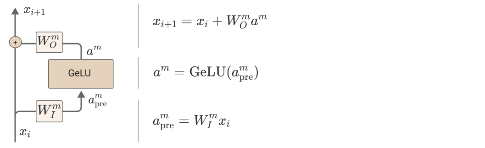

The presence of the GeLU activation means we can’t linearize through MLP layers as we did attention layers. Instead, we likely need to take the approach of the Circuits project in reverse engineering vision models: understanding what the neurons represent, how they’re computed, and how they’re used.

In theory, there’s a lot of reason to be optimistic about understanding these neurons. They have an activation function which should encourage features to align with the basis dimensions. They’re four times larger than the residual stream, and information doesn’t need to flow through them, which are both factors one might expect to reduce polysemanticity. Unfortunately, things are much more challenging in practice. We’ve found the neurons much harder to develop hypotheses for, with the exception of neurons at ~5% depth through the model, which often respond to clusters of short phrases with similar meanings. We’ve focused this paper on understanding attention heads because we got a lot more early traction on attention heads.

Despite this, it’s worth noting that there’s a fairly clean story for how to mechanistically reason about neurons, which we can use when we find interpretable neurons.

Path Expansion of MLP Layer in One-Layer Model: For simplicity, let’s consider a standard one layer transformer (ignoring layer norm and biases). The pre-activation values are a linear function of the residual stream. By applying our equation for attention heads, we get essentially the same equation we got for the [one-layer transformer logits](#onel-path-expansion):

a^m\_\text{pre} ~=~ W^m\_I \cdot \bigg(Id+\sum\_{h\in H\_1} A^h \otimes W\_{OV}^h\bigg)\cdot~W\_E

a^m\_\text{pre} ~=~ W^m\_I W\_E ~+~ \sum\_{h\in H\_1} A^h \otimes \left(W^m\_I W\_{OV}^h W\_E\right)

This means we can study it with the same methods. W^m\_I W\_E tells us how much different tokens encourage or inhibit this neuron through the residual stream, while W^m\_I W\_{OV}^h W\_E does the same for tokens if they’re attended to by a given attention head. One might think of this as being similar to a neuron in a convolutional neural network, except where neuron weights in a conv net are indexed by relative position, these neuron weights are indexed by attention heads. The following section, [Virtual Weights and Convolutional-Like Structure](#virtual-weights-and-convolution-like-structure), will explore this connection in more detail.

What about the downstream effect of these neurons? W\_U W^m\_O tells us how the activation of each neuron affects the logits. It’s a simple linear function! (This is always true for the last MLP layer of a network, and gives one a lot of extra traction in understanding that layer.)

This approach becomes more difficult as a network gets deeper. One begins to need to reason about how one MLP layer affects another downstream of it. But the general circuits approach seems tractable, were it not for neurons being particularly tricky to understand, and there being enormous numbers of neurons.

#### Virtual Weights and Convolution-like Structure

When we apply path expansion to various terms in a transformer, we generally get virtual weights of the form:

y = (\text{Id} \otimes W\_\text{Id} + \sum\_h A^h \otimes W\_h) x + …

(In the general case, h might include virtual attention heads.)

The main example we've seen in this paper is having y be logits for output tokens and x the one-hot encoded input tokens. But this can also arise in lots of other cases. For example, y might be MLP pre-activations and x might be the activations of a previous MLP layer.

Multiplying by (\text{Id} \otimes W\_\text{Id} + \sum\_h A^h \otimes W\_h) can be seen as a generalization of a convolution, with the weights [W\_\text{Id}, ~ W\_{h\_0}, ~ W\_{h\_1}...~] and attention heads taking the place of relative position.

Exact Equivalence to Standard Convolution in Limited Cases: We claim that all convolutions can be expressed as one of the tensor products aboved, and thus (1) attention is a generalization of convolution; (2) specific configurations of attention correspond exactly to convolution.

Consider the convolution W \ast x. We claim that it can be rewritten as:

W \ast x ~=~ \sum\_v A^v \otimes W\_v

where v is the convolution offset, A^v is an attention pattern always attending to the relative position v (such as a previous token head), and W\_v is the weight entry corresponding to that offset.

This equivalence is explored in depth by Cordonnier et al. , who also empirically find that vision models often have [many 2D relative position heads](https://epfml.github.io/attention-cnn/), similar to the previous token head we've observed.

Analogy to Convolution Generalizations: The correspondence to standard convolution breaks down for "dynamic" attention heads which attend based on some pattern other than fixed relative positions. However, it seems like there are many cases where they still are spiritually very convolution-like. For example, a "previous verb" head isn't a literal relative position (at least if we parameterize our input based on token index), but it seems morally like a type of convolution.

One way to resolve the above might be to consider graph convolutions. If we treat each attention pattern as a different set of weights on a graph, we could treat the tensor product as a sum of graph convolutions. (For an informal discussion of analogies between transformers and graph neural networks, readers may wish to look at an article by Joshi .) However, needing to consider multiple different weight graphs seems inelegant. There are other exotic kinds of convolutions based on abstract algebra (see tutorial ) and perhaps the right version could be found to find an exact correspondence.

But the fundamental thing is that when you see tensor products like the ones above, they can be thought of as something like a convolution with dynamic, soft, possibly semantic positions.

Why This is Useful: In reverse engineering convolutional neural networks, the Distill Circuits Thread  benefited greatly from the fact that transformer weights are organized into convolutions. For example, one can look at the weights between two neurons and see how different spatial positions affect things.

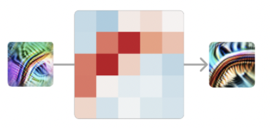

In the above example, we see the weights between two curve detectors; along the tangent of the curve, the other curve excites it. This would be much harder to understand if one had to look at 25 different weights; we benefit from organization.

We expect that similar organization may be helpful in understanding transformer weights, especially as we begin considering MLP layers.

#### Activation Properties

We often find it helpful to think different about various activations in transformers based on whether they have the following properties:

Privileged Basis vs Basis Free: A privileged basis occurs when some aspect of a model’s architecture encourages neural network features to align with basis dimensions, for example because of a sparse activation function such as ReLU. In a transformer, the only vectors with privileged bases are tokens, attention patterns and MLP activations. See the appendix table of variables for a full list of which activations have or don’t have privileged activations.

Some types of interpretability only make sense for activations with a privileged basis. For example, it doesn't really make sense to look at the "neurons" (ie. basis dimensions) of activations like the residual stream, keys, queries or values, which don't have a privileged basis. This isn't to say that there aren't ways to study them; a lot of interesting work is done on word embeddings without assuming a privileged basis (e.g. ). But having a privileged basis does open up helpful approaches.

Bottleneck Activations: We say that an activation is a bottleneck activation if it is a lower-dimensional intermediate between two higher dimensional activations. For example, the residual stream is a bottleneck activation because it is the only way to pass information between MLP activations, which are typically four times larger than it. (Additionally, in addition to it being a bottleneck for the communication between adjacent MLP layers, it’s also the only pathway by which arbitrary early MLP layers can communicate with arbitrary late MLP layers, so the stream may simultaneously be conveying different pieces of information between many different pairs of MLP layers, a much more extreme bottleneck than just 4x!) Similarly, a value vector is a bottleneck activation because it’s much lower dimensional than the residual stream, and it’s the only way to move information from the residual stream for one token position in the context to another (without the model dedicating an additional attention head to the same pattern, which it sometimes will). See above table for a list of which activations are or are not bottleneck activations.

#### Pointer Arithmetic with Positional Embeddings

Our models use a slightly unusual positional mechanism (similar to ) which doesn't put positional information into the residual stream. The popular rotary attention approach to position has this same property. But it's worth noting that when models do have positional embeddings (as in ), several possibilities open up.

At their most basic level, positional embeddings are kind of like token addresses. Attention heads can use them to prefer to attend to tokens at certain relative positions, but they can also do much more:

* Transformers can do "pointer arithmetic" type operations on positional embeddings. We observed at least one case in GPT-2 where an induction head was implemented using this approach, instead of the one described above. First, an attention head attended to a similar token, returning its positional embedding. Next, a query vector for another attention head was constructed with q-composition, rotating the positional embedding forward one token. This results in an induction head.
* We speculate that having an identifier for each token may be useful in some cases. For example, suppose you want all tokens in the same sentence to share an identifier. In a positional model, an attention head can attend to the previous period and copy its positional embedding into some subspace.

#### Identity Attention Heads?

It's worth noting that one could simplify all the math in this paper by introducing an "identity attention head," h\_\text{Id}, such that A^{h\_\text{Id}} = \text{Id} and W\_{OV}^{h\_\text{Id}} = \text{Id}. This identity head would correspond to the residual stream, removing extra terms in the equations. In this paper, we chose not to do that and instead keep the residual stream as an explicit, differentiated term. The main reason for this is that it really does have different properties than attention heads. But in other cases, it can be useful to think about things the other way.

### Notation

#### Variable Definitions

|  |  |  |
| --- | --- | --- |
| Main Model Activations and Parameters | | |
| Variable | Shape / Type | Description |
| T(t) | [n\_\text{context},~ n\_\text{vocab}] | Transformer logits, for tokens t [activation, privileged basis] |
| t | [n\_\text{context},~ n\_\text{vocab}] | One-hot encoded tokens [activation, privileged basis] |
| x^n | [n\_\text{context},~ d\_\text{model}] | “Residual stream” or “embedding” vectors of model at layer n (one vector per context token) [activation, not privileged basis] |
| W\_E | [d\_\text{model}, n\_\text{vocab}] | Token embedding [parameter] |
| W\_P | [d\_\text{model}, n\_\text{context}] | Positional embedding [parameter] |
| W\_U | [n\_\text{vocab}, d\_\text{model}] | Unembedding / softmax weights  [parameter] |
| Attention Heads Activations and Parameters | | |
| Variable | Shape / Type | Description |
| H\_n | Set | Set of attention heads at layer n |
| h(x) | [n\_\text{context},~ d\_\text{model}] | Output of attention head h [activation, not privileged basis] |
| A^h | [n\_\text{context},~ n\_\text{context}] | Attention pattern of attention head h [activation, privileged basis] |
| q^h, k^h, v^h, r^h | [n\_\text{context},~ d\_\text{head}] | Query, key, value and result vectors of attention head h (one vector per context token) [activation, not privileged basis] |
| W^h\_Q, W^h\_K, W^h\_V | [d\_\text{head},~ d\_\text{model}] | Query, key, and value weights of attention head h [parameter] |
| W^h\_O | [d\_\text{model},~ d\_\text{head}] | Output weights of attention head h [parameter] |
| W^h\_{OV} | [d\_\text{model},~ d\_\text{model}] | W^h\_{OV} = W^h\_{O}W^h\_{V} [parameter, low-rank] |
| W^h\_{QK} | [d\_\text{model},~ d\_\text{model}] | W^h\_{QK} = W^h\_{Q^T}W^h\_{K} [parameter, low-rank] |
| MLP Layer Activations and Parameters | | |
| Variable | Shape / Type | Description |
| m(x) | [n\_\text{context},~ d\_\text{model}] | Output of MLP layer m [activation, not privileged basis] |
| a^m | [n\_\text{context},~ d\_\text{mlp}] | Activations of MLP layer m [activation, privileged basis] |
| W^m\_I | [d\_\text{mlp},~ d\_\text{model}] | Input weights for MLP layer m [parameter] |
| W^m\_O | [d\_\text{model},~ d\_\text{mlp}] | Output weights for MLP layer m [parameter] |
| Functions | | |
| Variable | Shape / Type | Description |
| \text{GeLU}() | Function | Gaussian Error Linear Units |
| \text{softmax}^\*() | Function | Softmax with autoregressive mask for attention distribution creation. |

Superscripts and subscripts for variables may be elided when they aren’t needed for clarity. For example, if we’re only discussing a single attention head, one can write A instead of A^h.

#### Tensor Product / Kronecker Product Notation

In machine learning, we often deal with matrices and tensors where we want to multiply "one side". In transformers specifically, our activations are often 2D arrays representing vectors at different context indices, and we often want to multiply "per position" or "across positions". Frequently, we want to do both! Tensor (or equivalently, Kronecker) products are a really clean way to denote this. We denote them with the \otimes symbol.

Very pragmatically:

* A product like \text{Id} \otimes W (with identity on the left) represents multiplying each position in our context by a matrix.
* A product like A \otimes \text{Id} (with identity on the right) represents multiplying across positions.
* A product like A \otimes W multiplies the vector at each position by W and across positions with A. It doesn't matter which order you do this in.
* The products obey the mixed-product property (A \otimes B) \cdot (C \otimes D) = (AC) \otimes (BD).

There are several completely equivalent ways to interpret these products. If the symbol is unfamiliar, you can pick whichever you feel most comfortable with:

* Left-right multiplying: Multiplying x by a tensor product A\otimes W is equivalent to simultaneously left and right multiplying: (A\otimes W) x = A x W^T. When we add them, it is equivalent to adding the results of this multiplication: (A\_1\otimes W\_1 + A\_2\otimes W\_2) x = A\_1 x W\_1^T + A\_2 x W\_2^T.
* Kronecker product: The operations we want to perform are linear transformations on a flattened ("[vectorized](https://en.wikipedia.org/wiki/Vectorization_(mathematics))") version of the activation matrix x. But flattening gives us a huge vector, and we need to map our matrices to a much larger block matrix that performs operations like "multiply the elements which previously corresponded to a vector by this matrix". The correct operation to do this is the [Kronecker product](https://en.wikipedia.org/wiki/Kronecker_product). So we can interpret \otimes as a Kronecker product acting on the vectorization of x, and everything works out equivalently.
* Tensor Product:  A\otimes W can be interpreted as a [tensor product](https://en.wikipedia.org/wiki/Tensor_product) turning the matrices A and W into a 4D tensor. In NumPy notation, it is equivalent to `A[:,:,None,None] * W[None, None, :, :]` (although one wouldn’t computationally represent them in that form). More formally, A and W are “type (1,1)” tensors (matrices mapping vectors to vectors), and A\otimes W is a “type (2,2)” tensor (which can map matrices to matrices).

### Technical Details

#### Model Details

The models used as examples in this paper are zero, one, and two layer decoder-only, attention-only transformers . For all models, d\_\text{model} = n\_\text{heads} \* d\_\text{head}, typically with n\_\text{heads}=12 and d\_\text{head}=64, but also with one explicitly noted example where n\_\text{heads}=32 and d\_\text{head}=128.

Models have a context size of 2048 tokens and use dense attention. (Dense attention was preferred over sparse attention for simplicity, but made a smaller context perferrable.) We use a positional mechanism similar to Press et al. , adding sinusoidal embeddings immediately before multiplying by W\_Q and W\_K to produce queries and keys. (This excludes [pointer-arithmetic based algorithms](#pointer-arithmetic) without the distorted QK matrices like rotary.)

The training dataset is as described in Kaplan et al. .

#### Handling Layer Normalization

Our transformer models apply layer normalization every time they read off from the residual stream. In practice, this is done to encourage healthy activation and gradient scales, making transformers easier to train. However, it also means that the "read" operation of each layer is more complicated than the idealized version we've described above. In this section, we describe how we work around this issue.

Before considering layer normalization, let's consider the simpler case of batch normalization. Transformers typically use layer normalization over batch normalization due to subtleties around the use of batch normalization in autoregressive models, but it's an easy case to work out and would make our theory exactly align with the model. Batch normalization tracks a moving estimate of the mean and variance of its inputs, and uses that to independently normalize them, before rescaling with learned parameters. At inference time, a fixed estimate of the mean and variance is used. This means that it's simply a fixed linear transformation and bias, which can be multiplied into the adjacent learned linear transformation and bias. As such, batch normalization in models can typically be absorbed into other operations and ignored for the purposes of interpretability on the inference time model.

Layer normalization is a little more subtle. For each residual stream vector, we subtract off the average activation, normalize by variance, and then multiply by a learned set of diagonal weights and add a learned bias vector. It turns out that subtracting off the average activation is a fixed linear transformation, since it just zeros out a single dimension in the vector space. This means that everything except for normalizing by variance, layer normalization applies a fixed affine transformation. Normalizing by variance multiplies the vector by a scalar, and multiplying by a scalar commutes with all the other operations in a path. As a result, we can fold everything but normalization into adjacent parameters, and then think of the normalization scaling as a variable reweighting of the set of path terms going through that layer normalization. (The main downside of this is that it means that paths going through different sets of layers aren't easily comparable; for example, we can't trivially compare the importance of virtual attention heads composed of heads from different layers.)

A final observation is that layer normalization in the first attention layer of the model can alternatively be applied to every vector of the embedding matrix and then ignored. In some cases, this is more convenient (for example, we do this for skip-trigrams in our one-layer models).

In the future, it might be worth trying to train models with batch normalization to avoid this as a pain point, despite the complexities it presents.

#### Working with Low-Rank Matrices

In this paper, we find ourselves dealing with very large, but extremely low-rank matrices. Picking the right algorithm is often the difference between painfully slow operations on the GPU, and everything being instantaneous on your CPU.

First, we recommend keeping matrices in factored form whenever possible. When multiplying a chain of matrices, identify the "smallest" bottleneck point and represent the matrix as a product AB split at that bottleneck.

Eigenvalues: Exploit the fact that \lambda\_i(AB) = \lambda\_i(BA) . Calculating eigenvalues of a 64x64 matrix is greatly preferable to a 50,000x50,000 matrix.

SVD: The SVD can also be calculated efficiently, and a variant can be used to efficiently compute PCA:

* Compute the SVDs of A and B: U\_AS\_AV\_A = A and  U\_BS\_BV\_B = B.
* Define C=S\_AV\_AU\_BS\_B
* SVD C:  U\_CS\_CV\_C = C
* SVD of AB is U\_{AB} = U\_AU\_C, S\_{AB} = S\_C, V\_{AB} = V\_CV\_B.
