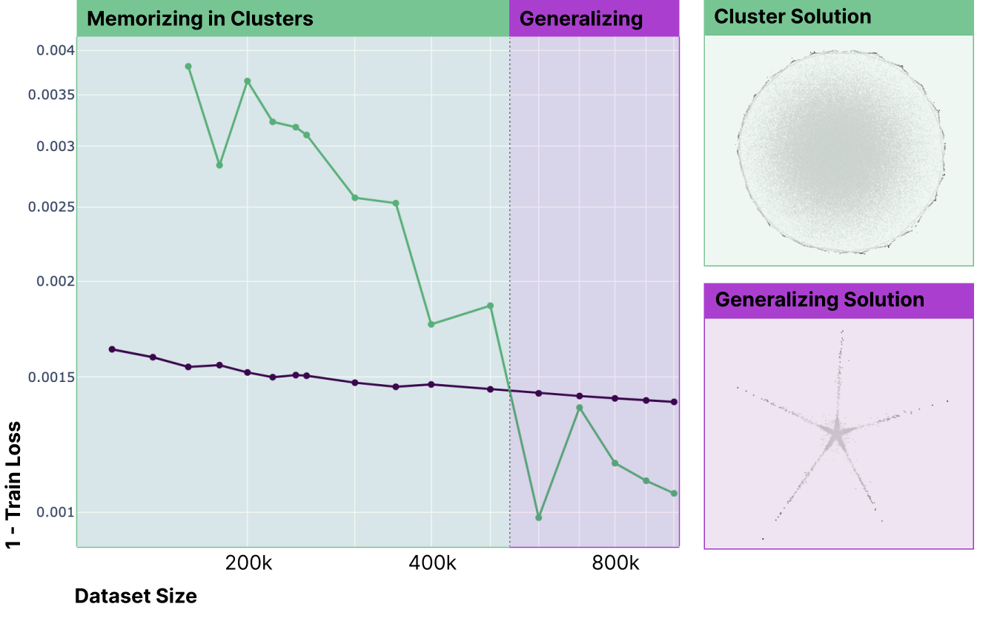
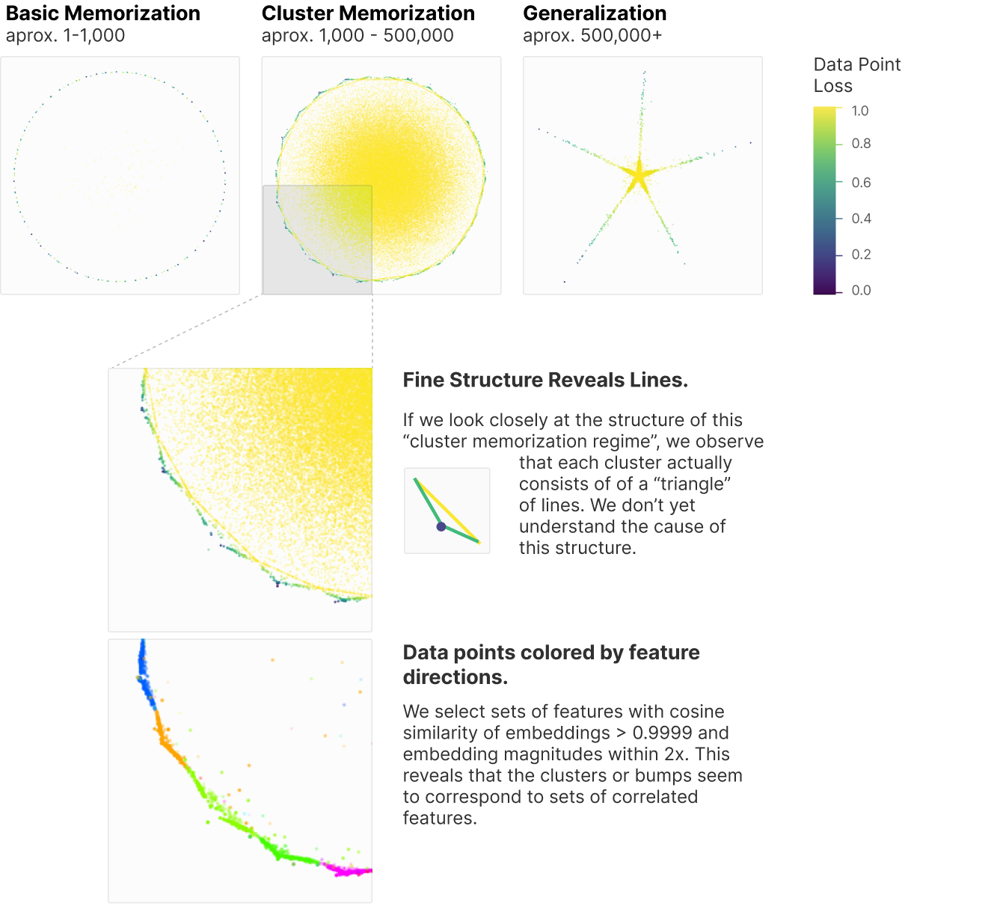

<!-- source: https://transformer-circuits.pub/2023/july-update/index.html -->

# Circuits Updates - July 2023

  
  

We report a number of developing ideas on the Anthropic interpretability team, which might be of interest to researchers working actively in this space. Some of these are emerging strands of research where we expect to publish more on in the coming months. Others are minor points we wish to share, since we're unlikely to ever write a paper about them.

We'd ask you to treat these results like those of a colleague sharing some thoughts or preliminary experiments for a few minutes at a lab meeting, rather than a mature paper.

Short Updates

* [Finite Data Intermediate Regime](#finite-data)
* [What would be the most safety-relevant features in Language Models?](#safety-features)
* [Further investigation of our skip-trigram model](#attn-skip-trigram)

  
  
  

  
  

## [Finite Data Intermediate Regime](#finite-data)

Adam Jermyn, Chris Olah, Tom Henighan

In [Superposition, Memorization, and Double Descent](https://transformer-circuits.pub/2023/toy-double-descent/index.html), we identified three different regimes for a one-layer toy model trained on finite datasets:

1. For small datasets (up to ~1000 samples), models memorize the training data.
2. For large datasets (above ~10,000 samples), models learn generalizing features of the dataset generation process.
3. For intermediate-size datasets, we could not determine what the model was doing.

The intermediate regime behavior was concerning to us, because it wasn't clear that we could understand it as an example of linear features in superposition. This is our present framework for understanding neural networks, so it would be quite important to know if this was a genuine counterexample! As a result, we continued to investigate this model, and believe we've made some progress on understanding it.

At a high-level, our investigations have reassured us that the model can be fully understood as linear features in superposition. We found that the intermediate regime – which we previously worried was a counterexample – is in fact an artifact produced by optimization failureWe encountered this because this toy model had a low hidden dimension. As a result we do not expect such optimization failure to be nearly so prevalent in more realistic models.. We also found new interesting behavior as better-optimized models approach the generalizing regime from the memorization side: they begin to memorize correlated clusters instead of individual data points. We'll discuss both of these observations below.

The previous intermediate regime was an artifact. We determined that some of what we saw was an artifact of low-dimensional optimization being hard. By training models with a variety of learning rates, we found that the memorizing solution achieves the lowest train loss up to very large dataset sizes (~500k samples). Beyond that point there is a crossover where the generalizing solution achieves a lower train loss, and so there is a true first-order phase transition where the lowest-train-loss solution suddenly changes around 500k samples, and the derivative of the minimum train loss exhibits a discontinuity at the crossover between the two solutions.

The phenomenology of memorizing solutions changes as they approach the transition point. We find that the memorizing solution gradually changes from memorizing individual data points to memorizing clusters of correlated data points as the dataset size increases from around 1k to 500k samples. Below around 1k samples, the samples are mutually orthogonal with high probability and so uncorrelated, permitting an exact memorizing solution. Above this point there are correlations between samples which make exact memorization impossible, and the model instead clusters data points based on shared features. The clustering solutions have interesting fine detail where data points are arranged as "triangles".

  
  
  

  
  

## [What would be the most safety-relevant features in Language Models?](#safety-features)

Chris Olah, Adam Jermyn

Our primary motivation for working on mechanistic interpretability is that we believe it may ultimately contribute to the safety of AI systems.

Recently, there's been a growing amount of work proposing safety-relevant targets for mechanistic investigation. Lying and deception have been especially highlighted as an important target by many, but broader categories have also been suggested (such as the User and System model framework ). We believe there are many high-value, safety-relevant targets for mechanistic investigation and wanted to offer our own list.

We think of these targets as falling broadly into two classes: hypothesized mechanisms and empirical behaviors. We'll discuss each of these in turn.

#### Hypothesized Mechanisms

While we currently know little about how large language models mechanistically operate, many hypotheses about their inner mechanisms could have major safety implications. Most obviously, if models have machinery to "deliberately lie", that would be of significant interest. Many such hypotheses can be framed in terms of "units of computation" we speculate exist in the model, which we'll call "features". Features can be properties of the input (more like "concepts" or "abstractions"), intermediate representations of knowledge, or actions/outputs (more like the idea of a motor neuron in neuroscience).

High-Level Actions. In thinking about neural network representations, we most often think about features that represent the input (or perhaps inferences about the state of the world from the input – see eg. ). However, for language models – which output long sequences of tokens – it seems possible that there may be features which are more like "actions". Indeed, some neurons at the end of the model have been observed to perform very simple "actions", such as [completing multi-token](https://transformer-circuits.pub/2022/solu/index.html#section-6-3-3)[words](https://transformer-circuits.pub/2022/solu/index.html#section-6-3-3) . But given that there are features representing more abstract properties of the input, might there also be more abstract, higher-level actions which trigger behaviors over the span of multiple tokens? In isolation, such high-level action features wouldn't be of much safety interest, but it seems to us that they have deep connections to several of the following items which do.

Planning. If models do have actions, how are sequences of actions coordinated? Does the model "understand" that its actions can affect the world, and if so how does it represent future expectations based on actions? Does it model goals or perform instrumental reasoning? Is there any kind of emergent search algorithm? While “coordinating a sequence of actions” is in itself not so scary, reasoning about how to achieve certain outcomes is central to many safety questions.

Social Reasoning. What properties of the user (or third party humans) does the model represent? In particular, what aspects of their mental and emotional state does it try to represent? Particularly scary forms of social reasoning include social actions (e.g. actions attempting to induce an emotional state) and social planning, in which the model uses its understanding of how the model’s output affects the human’s mental state to push the human towards particular states.

Personas. During pretraining, models learn to play many different personas, as well as to follow cues to change persona as in e.g. a play with multiple roles. How do models track their active personas, and what triggers the personas to change? To the extent that RLHF attempts to “lock” a model into a particular persona, we might worry about triggering the persona-change logic. One might also wonder if the main persona has "emotions" or "beliefs", inherited from pretraining role-playing, which change over the course of an interaction. Finally, one might wonder if there can there be behavior that doesn’t flow through personas at all, or whether the personas are “all there is”?One might wonder if personas are truly distinct from the social reasoning behavior described above. They seem likely to be very interconnected during the pretraining stage, since models both "roleplay" all the characters in their context, as well as roleplaying counterparties interacting with them. However, these seem more clearly distinct after a stage of RLHF targeted at turning a model into an assistant.

Situational awareness. Does the model know it’s a model? Does it know its architecture, who trained it, how it was trained, etc.? Does it understand that its outputs are used for things in the world? Can it reason about the training process, [play the training game](https://www.alignmentforum.org/posts/pRkFkzwKZ2zfa3R6H/without-specific-countermeasures-the-easiest-path-to), and thereby achieve a better loss? Does it understand that it can be turned off, modified, etc., and does it understand how that might interfere with any goals it has developed?

#### Empirical Behaviors

Empirical behaviors pose questions of interpretability. There is a growing zoo of model behaviors that we don’t understand and would like to investigate mechanistically. These range from quite innocuous questions (“Why did the model get this question wrong when we know it knew the right answer?”) to quite serious (“Why do model jailbreaks work?”).

Jailbreaks. There are many approaches to “jailbreaking” models, ways to make them perform harmful actions in spite of harmlessness training. Can we discover why these work? Can we discover novel jailbreaks through mechanistic interpretability? (In the past, novel adversarial examples have been discovered through interpretability .)

Instrumental Reasoning. Behaviors like caginess around red-teaming prompts, sycophancy, and self-preservation may suggest instrumental reasoning. One could also imagine much more benign causes of these behaviors. Developing a mechanistic understanding of these behaviors would allow us to distinguish between these hypotheses.

In-Context Learning. In-context learning is one of the most powerful things models do, allowing models to produce meaningfully new chains of reasoning and potentially enabling quite scary scenarios like strong inner optimizers. But how does in-context learning happen? What circuits implement it, and what priors does it come with? We have seen some tantalizing first steps in the form of [Induction Heads](https://transformer-circuits.pub/2022/in-context-learning-and-induction-heads/index.html), but much remains to be explored.

Successful RLHF. When RLHF succeeds at producing a helpful model, why does it succeed? Does RLHF elicit capabilities and personalities already present in the model, or does it create new circuits and new knowledge? How much does RLHF delete from the pretrained model? More generally, there are many different theories of what RLHF does, and the truth of the matter is central to determining how viable it is as a method for safety.

  
  
  

  
  

## [Further investigation of our skip-trigram model](#attn-skip-trigram)

Tom Conerly, Adam Jermyn, Chris Olah

Previously, we described an [example](https://transformer-circuits.pub/2023/may-update/index.html) of attention head superposition involving a model trained to reproduce a number of skip-trigrams (e.g. [A]...[B] -> [C]). In that example, the skip-trigrams were chosen to be OV-incoherent, such that they all began with the same token. This distribution forces the task to be split across multiple attention heads, as a single head cannot simultaneously implement e.g. [0]...[1] -> [4] and [0]...[2] -> [5].

At the time we did not understand the algorithm that model implemented. We have since studied a simpler two-head model, and we now understand the algorithm that that model implements.

It turns out that two attention heads suffice to model a large number of OV-incoherent skip-trigrams with zero loss. In brief, the algorithm these heads implement is:

1. Head 0 attends from the present token to itself, and enhances the logit for the correct next token as if the present token is the second in a skip-trigram. So in the above example head 0 attends from [1] to itself and predicts [4], and from [2] to itself to predict [5].
2. Head 1 attends to the common starting token of the skip-trigrams when that token is present, otherwise it attends to the present token. So in the above example it attends to [0] when [0] is present and to the current token otherwise. When it attends to [0] it does nothing, and when it attends to the present token it produces the negative logit of head 0.

The combination of these heads implements a conditional: if [0] is present then head 0 produces the appropriate logits for the skip-trigram. If [0] is not present the two heads cancel and the output is a uniform distribution.

Note that in practice models trained on this task do not cleanly separate into two heads doing distinct tasks. Rather they divide up the skip-trigrams between them and each takes a subset of the total.

With this understanding, we no longer feel certain that the example we found is best described as “attention head superposition”, at least in the strict sense of “features as directions in activation space”.
