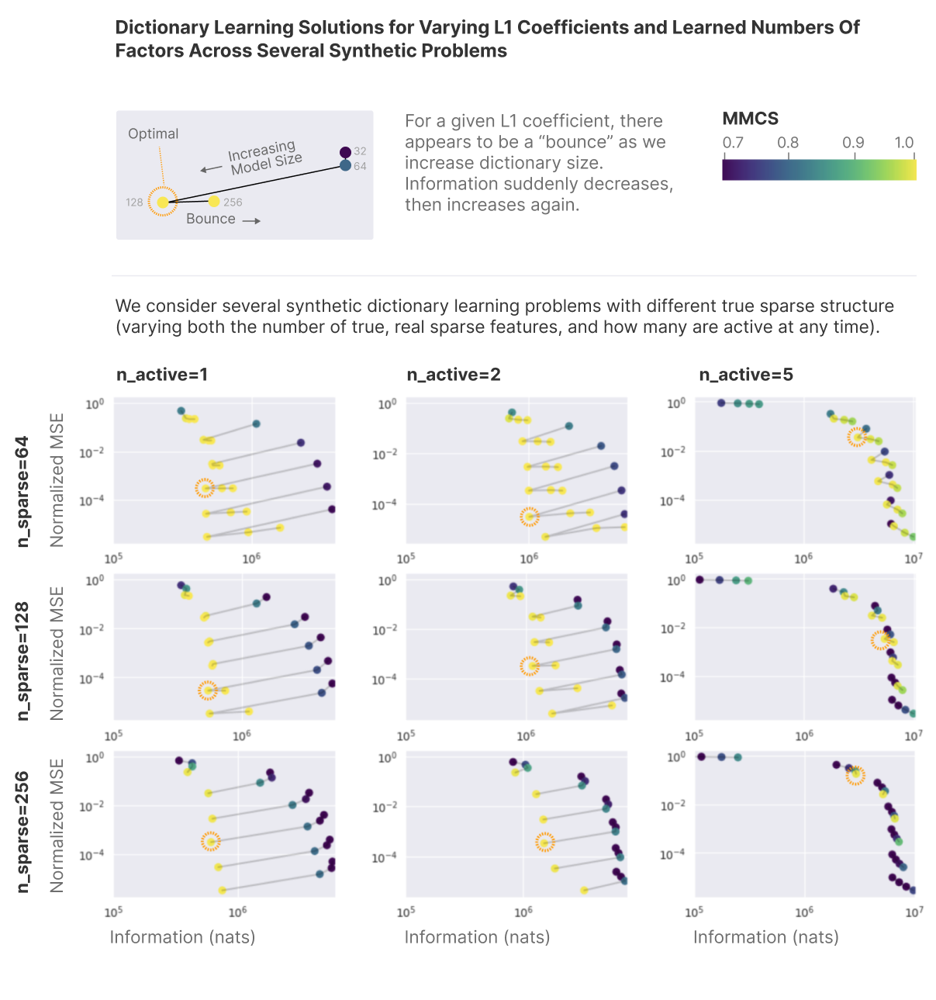
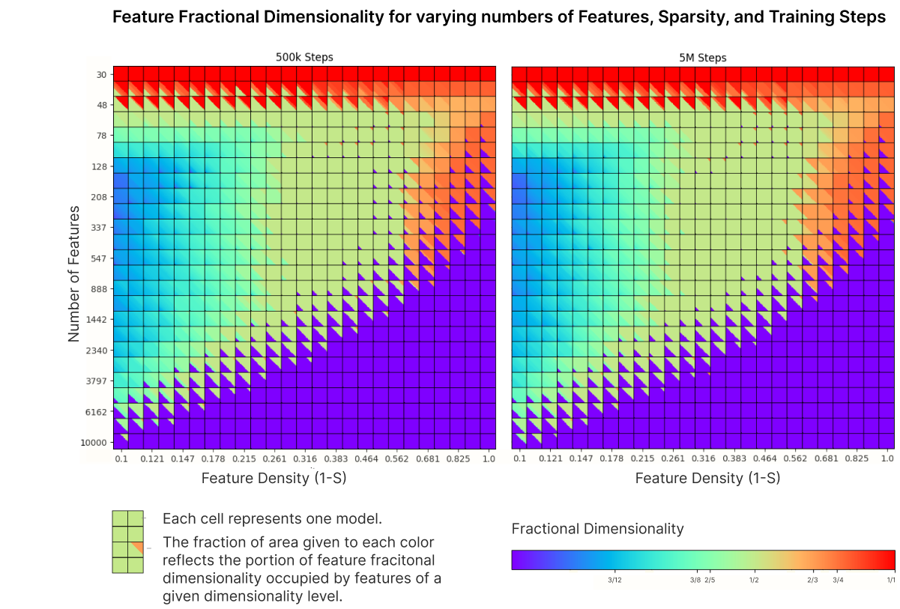
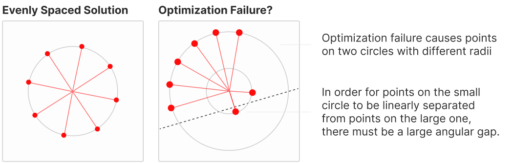

<!-- source: https://transformer-circuits.pub/2023/may-update/index.html -->

# Circuits Updates — May 2023

  
  

We report a number of developing ideas on the Anthropic interpretability team, which might be of interest to researchers working actively in this space. Some of these are emerging strands of research where we expect to publish more on in the coming months. Others are minor points we wish to share, since we're unlikely to ever write a paper about them.

We'd ask you to treat these results like those of a colleague sharing some thoughts or preliminary experiments for a few minutes at a lab meeting, rather than a mature paper.

Short Research Notes

* [Attacking Superposition with Dictionary Learning](#superposition-dictionary)
* [Features as The Simplest Factorization](#simple-factorization)
* [Dictionary Learning Worries](#dictionary-worries)
* [Fractional Dimensionality and "Pressure"](#feature-pressure)
* [The "Two Circle" Phenomenon in Memorization](#two-circles)
* [Weight Superposition](#weight-superposition)
* [Attention Head Superposition](#attention-superposition)
* [Feature Manifold Toy Model](#feature-manifolds)

Updates

* [New Comment On Previous Papers](#new-comments)
* [Our Recent Publications](#recent-articles)
* [Research By Other Groups](#external-research)

  
  
  

  
  

## [Attacking Superposition with Dictionary Learning](#superposition-dictionary)

Trenton Bricken, Joshua Batson, Adly Templeton, Adam Jermyn, Tristan Hume, Tom Henighan, Chris Olah

We are often asked about where our work on superposition is going. Over the last few months, we've run several more ad-hoc experiments on superposition in real models (which sometimes produced interesting, but inconclusive results), as well as exploring a variety of questions related to the theory of superposition like our [recent memorization paper](https://transformer-circuits.pub/2023/toy-double-descent/index.html).

Our ad-hoc experiments have persuaded us that solutions to superposition won't be extremely low-hanging fruit, and that more systematic, focused efforts will be necessary. To that end, we're presently focusing on what we've described as ["Approach 2"](https://transformer-circuits.pub/2022/toy_model/index.html#strategic-approach-overcomplete) in the Toy Models paper: extracting features from superposition by using dictionary learning on the activations of a trained, dense model. (This approach has also been investigated by [Sharkey](https://www.alignmentforum.org/posts/z6QQJbtpkEAX3Aojj/interim-research-report-taking-features-out-of-superposition) [et al.](https://www.alignmentforum.org/posts/z6QQJbtpkEAX3Aojj/interim-research-report-taking-features-out-of-superposition), who provided us with helpful comments.) We're building up infrastructure to do a systematic, large-scale investigation, with the hope of either finding superposition in real models or making a significant update against this decoding approach.

Informally, we've found cases where sparse factorizations of neural network activations seem to produce activations which suggest simple hypotheses on inspection. But we don't yet have anything that persuades us that these are the "fundamental truth" of the models that we're studying, rather than a convenient lens which might reveal some features while obscuring others.

In the meantime, we do have a few more conceptual contributions, which can be found in the comments [Features as The Simplest Factorization](#simple-factorization) and [Dictionary Learning Worries](#dictionary-worries).

  
  
  

  
  

## [Features as The Simplest Factorization](#simple-factorization)

Trenton Bricken, Joshua Batson, Adly Templeton, Adam Jermyn, Tom Henighan, Chris Olah

As investigation of superposition has progressed, it's become clear that we don't really know what a "feature" is, despite them being central to our research agenda. Several previous definitions have been considered, but all seem unsatisfying. This isn't necessarily bad – sometimes uncertainty about definitions is a very fruitful avenue for science! – but it points at a major open question for us.

In parallel with this, attempts to use dictionary learning or sparse coding methods to automatically discover features in superposition have run into a major challenge. These methods require one to pick a number of features to attempt to decompose the activations into. But how can one know if they've picked the right number to "get all the features" without splitting a true feature into many parts? A recent report by [Sharkey](https://www.alignmentforum.org/posts/z6QQJbtpkEAX3Aojj/interim-research-report-taking-features-out-of-superposition) [et al.](https://www.alignmentforum.org/posts/z6QQJbtpkEAX3Aojj/interim-research-report-taking-features-out-of-superposition) proposes some heuristics, but the answer seems non-obvious.

We wonder if it might be possible to answer both of these questions at once by defining features as "the simplest factorization of the activations".

More formally, given a sparse factorization of the activations A=SD (S is the sparse code, D is the dictionary), we can ask how much information it takes to represent S and D. We define this “total information” by fitting a probability distribution to the entries of the matrices and computing its entropy. Larger dictionaries tend to require more information to represent, but sparser codes require less information to represent, which may counterbalance.

(The initial experiments below measure information by modeling the distribution of entries in each matrix with a 100 bin histogram, with the largest bin determined by the maximum matrix entry over all experiments. We then take the surprisal of each entry under this distribution, and sum to get the total information. However, we expect our exact formulation of this to change as our investigation continues.)

It turns out that measuring the information like this seems to be an effective tool for determining the "correct number of features", at least for synthetic data. We consider a variety of synthetic dictionary learning tasks where we take sparse vectors (of dimension n\_sparse, with n\_active non-zero entries) and randomly project them into 32 dimensional space. The goal is to recover the original sparse structure. We perform dictionary learning (essentially MOD with an LASSO inner loop), varying both the L1 coefficient and the dictionary size. We then do a parametric plot of Mean Squared Error vs this notion of "Total Information".

We observe that dictionary learning solutions "bounce" when the dictionary size matches the true number of factors. Put another way, the Pareto frontier of this rate-distortion plot is occupied by the solutions with the correct number of learned factors. (This is also where the best MMCS score, a metric introduced by Sharkey et al. for evaluating factorizations when the correct answer is known, is obtained.)

If such bounces could be found in real data, it would seem like significant evidence that there are "real features" to be found.

  
  
  

  
  

## [Dictionary Learning Worries](#dictionary-worries)

Tom Henighan, Chris Olah

Dictionary learning is presently our top contender for how to extract features out of superposition (following ["Approach 2"](https://transformer-circuits.pub/2022/toy_model/index.html#strategic-approach-overcomplete) to solving superposition). If we believe that our activations are described by the factorization A=SD where S is a sparse matrix (the "true sparse features") and D is the "dictionary" of unit vectors projecting them to the observed activations, then dictionary learning is a well-established set of tools for solving this problem.

Unfortunately, there are at least two major ways in which we might wish to solve a subtly different problem:

* Compressed sensing may be "too strong." Typical dictionary learning algorithms allow S (the "true sparse features" active for each datapoint) to be computed by an arbitrary function (typically some compressed sensing algorithm). But neural networks likely want to be able to retrieve features from superposition cheaply.In particular, if it takes more than one layer to retrieve a feature from superposition, this seems pretty unfavorable since it both wastes compute and (by storing an intermediate result) the very "storage space" that superposition was trying to save. As a result, typical dictionary learning algorithms may be searching over too broad a space of possibilities. One special concern is that they might hallucinate "extra features", which are pairs of features and allow for sparser representations, but don't make sense from the neural networks perspective.
* The representation may not be "zero-centered". We expect that the right way to understand activations is often something closer to A=SD+b, where b is some bias offset. Typical dictionary learning algorithms break in this setup (although they are easily adapted to handle this).This concern is significantly motivated by a figure in a [post](https://www.alignmentforum.org/posts/KzwB4ovzrZ8DYWgpw/more-findings-on-memorization-and-double-descent) by Marius Hobbhahn which seems to suggest that models with ReLU neurons may implement "shifted data point superposition" to store information while avoiding the ReLU.

All these concerns point towards using the kind of sparse autoencoder setup explored by Sharkey et al. over a full-blown dictionary learning setup. However, we've found that sparse autoencoders are more fragile and sensitive to hyperparameters, which is a significant countervailing consideration in using them. We are interested in finding an approach with the advantages of a sparse autoencoder (in terms of only finding true features) and the consistent trainability of the dictionary learning schemes.

We also have other worries – such as correlated features which may be more difficult to pull apart – which could be of significant concern to these efforts, but aren't specific to the dictionary learning setup.

  
  
  

  
  

## [Fractional Dimensionality and "Pressure"](#feature-pressure)

Tom Henighan, Chris Olah

In Toy Models of Superposition, perhaps the most surprising result was that toy model features often arranged themselves into uniform polyhedra in superposition, with the specific polyhedra varying by sparsity. However, in a [recent comment](https://transformer-circuits.pub/2022/toy_model/index.html#comment-pressure), we found this is more sensitive to the amount of "feature pressure" (the ratio of the number of features that the model would ideally represent and the number of dimensions it has to represent them), and also how long the model is trained. In particular, there are regimes where having more features compete, and also having models train longer, causes clean geometry where it otherwise would not exist.

We're confused why having more features – which the model ultimately chooses to not represent – affects the geometry of the solution so much. One hypothesis is that even as tiny features, they inject noise. Another hypothesis is that the model is actually effectively using "epsilon features" in superposition somehow.

  
  
  

  
  

## [The "Two Circle" Phenomenon in Memorization](#two-circles)

Tom Henighan, Chris Olah

In a [recent comment](https://transformer-circuits.pub/2023/toy-double-descent/index.html#comment-double-circle) on Superposition, Memorization, and Double Descent, we observed that problems with m=2 hidden dimensions occasionally have data points that arrange themselves on two circles of different radii. While we believe the specific phenomenon is likely a quirk of optimization in 2D, it's an interesting case study in the geometry of superposition and memorization.

  
  
  

  
  

## [Weight Superposition](#weight-superposition)

Chris Olah

We typically think about superposition as a phenomenon where features are put in superposition. For example, we might have features X^\* which are put into superposition X by a map U.

But this picture doesn't really help us reason about what kinds of computation a neural network can do while in superposition. We know that some kinds are possible – but what?

To answer this, it's helpful to reason about how weights are put in superposition. If we have two layers X and Y (both in superposition according to matrices U^X and U^Y), we can imagine there being "ideal weights" between these features for computing the second layer from the first. When the two layers are put in superposition, the ideal weights must also be mapped into superposition.

What are the properties of this map? Observe that we want e\_i^T W^\* e\_j = {U^Y\_I}^T W U^X\_j. Therefore, if we decompose the ideal weights into their entries we get the following transformation:

W^\* ~=~ \sum\_{i,j} W^\*\_{i,j} e\_i \otimes e\_j ~~\to~~ \sum\_{i,j} W^\*\_{i,j} U^X\_i \otimes U^Y\_j ~\simeq~ W

(Modulo the possibility of interference we'll discuss below.)

Equivalently, one can define the map as a tensor product, U^W = U^X \otimes U^Y.

In feature superposition, the interference between two features X^\*\_i and X^\*\_j is governed by \langle U\_i, U\_j\rangle. Weight superposition has something analogous. Two weights W^\*\_{i,j} and W^\*\_{k,l} have interference governed by \langle U^W\_{i,j}, ~U^W\_{k,l} \rangle\_F ~=~ \langle U^X\_{i}\!\otimes U^Y\_{j}\!, ~U^X\_{k}\!\otimes U^Y\_{l} \rangle\_F. Interestingly, weights apper able to have "constructive interference" which is helpful, in contrast to feature superposition which always seems harmful.

All of this is just preliminary thinking on this question, but it seems to give us a tool for reasoning about what weight matrices are possible to represent in superposition, and thus what kinds of computation it's possible to do while in superposition.

  
  
  

  
  

## [Attention Head Superposition](#attention-superposition)

Adam Jermyn, Chris Olah, Tom Henighan

In[Toy Models of Superposition](https://transformer-circuits.pub/2022/toy_model/index.html), we saw that when features are sparse, simple neural networks can represent more features than they have neurons through the phenomenon of superposition. We think something analogous can happen with attention heads, with "attention circuits" and "attentional features" being stored in superposition over attention heads.We use the term "attentional feature" to describe relationships between pairs of tokens, which correspond to linear combinations of attention heads attending between a pair. By "attentional circuit", we refer to the otherall computation implemented by an attention head, which in the case of a one-layer model implements skip-trigrams.

For now, we’ll talk about skip-trigrams ([A]…[B] → [C]) as our basic attentional circuits. This is a restricted definition, as we think there are more general kinds of attentional circuits, but they seem sufficient to demonstrate attention superposition.

We trained toy models — small one-layer transformers with trivial embeddings and unembeddings — to investigate how and under what circumstances attention heads place circuits in superposition. The training data were sequences of tokens which were chosen uniformly except for over-representing certain skip-trigrams.

We focus in particular on skip-trigrams which are "OV-incoherent," meaning that they attend from multiple different tokens back to a single token, and the output depends on the token attended from. A single attention head cannot implement multiple such skip-trigrams without introducing errors in its output, because the OV circuit does not know which token is being attended from.

Attention Head Wiring diagram: The first column is the token attended from, the second is the token attended to, and the thickness of the lines connecting them indicate the strength of attention. The final three columns show the modifications caused to the output logits when attending to the token in the second column. Here red indicates an increase in the output and blue indicates a decrease.

What we see is that when the ground truth contains more incompatible trigrams than there are attention heads, models resort to placing them in superposition across heads. Above, each trigram is encoded in superposition between at least two attention heads. These results suggest caution in studying the role of a single attention head in isolation, as circuits implemented in superposition can appear misleading when only partially interpreted.

These wiring diagrams are simple for models trained on small numbers of skip-trigrams, but rapidly become too complex to read as the training data become more complex. Despite this, we see tantalizing evidence of beautiful geometry underlying even cases with many skip-trigrams, which we are excited to investigate further.

  
  
  

  
  

## [Feature Manifold Toy Model](#feature-manifolds)

Chris Olah, Josh Batson

In our toy model investigations of superposition, we assume the existence of discrete features and see how an autoencoder represents them. But in real life, features may lie on a manifold, where nearby features respond to similar data. What should we expect neural networks to do in such cases? In many empirical cases, neural networks model the manifold with [families of equivariant neurons](https://distill.pub/2020/circuits/equivariance/), representing the manifold in terms of discrete units rather than representing the manifold directly. Should we expect this to always happen? Why does it happen?

For example, a vision model might want to represent curves in different orientations; the set of possible orientations naturally defines a 1D manifold, a circle. One could imagine the network might have a single neuron whose activation represents the angle of the curve or might have two neurons whose activations represent sine and cosine of the angle of the curve. Instead, in [Curve Detectors](https://distill.pub/2020/circuits/curve-detectors/), Cammarata et al find many (~10) neurons which each respond to curves in a specific range of orientations.This difference in representational strategy seems somewhat analogous to the distinction between "value coding" and "variable coding" in neuroscience (see [Thorpe 1989](https://persee.fr/doc/intel_0769-4113_1989_num_8_2_873)).

We present some extremely preliminary results investigating this question by considering a toy problem with a "feature manifold" rather than discrete features. We'll then study what happens when we change the length scale (\ell) the model cares about resolving positions on the feature manifold within.

Our basic setup will be the [ReLU-output problem](https://transformer-circuits.pub/2022/toy_model/index.html#demonstrating-setup-model) from the Toy Models paper. Instead of having the data be independent features, we imagine having a large number of features arranged around a circle, with equal angular spacing. We first fix a length scale  (\ell) for the problem. To generate a data point, we pick a random angle (\theta) and an activation magnitude (m). The feature x\_\phi at angle \phi around the circle activates on that datapoint if \phi is close to \theta, where “close” is determined by the length scale:

x\_\phi ~=~ \begin{cases} ~m\cos(\frac{\phi-\theta}{\ell}) & ~\text{if}~~\frac{|\phi-\theta|}{\ell} \leq \frac{\pi}{2}\\ ~0 & ~\text{otherwise} \end{cases}

We can now study how the features are embedded as we vary the length scale:

This kind of emergent discretization (which we're increasingly seeing hints of across a variety of problems) seems like it might be a very important phenomenon. It may be that "emergent discretization" is the thing we mean when we talk about features.

One caveat to this work is that we've seen some hints that the smallest length scale discretization may be an optimization failure. Additional research is needed to understand this phenomenon.

  
  
  

  
  

## [New Comments Digest](#new-comments)

Transformer Circuits periodically publishes comments on our papers, both from external parties and by the authors. Some of these comments were submitted before publication, from reviewers of early draft manuscripts. But others are submitted significantly after the fact, and might not be seen. To that end, we've included a digest of recently added comments:

A Mathematical Framework for Transformer Circuits

* [Summary of Follow-Up Research](https://transformer-circuits.pub/2021/framework/index.html#comment-summary) (Chris Olah)
* [Correction: Attention Head Composition Diagram](https://transformer-circuits.pub/2021/framework/index.html#comment-errata) (Chris Olah)

In-context Learning and Induction Heads

* [2 older comments](https://transformer-circuits.pub/2022/in-context-learning-and-induction-heads/index.html#comments-replications)

Toy Models of Superposition

* [Replication](https://transformer-circuits.pub/2022/toy_model/index.html#comment-becker-kahn) (Spencer Becker-Kahn)
* [Replication](https://transformer-circuits.pub/2022/toy_model/index.html#comment-hobbhahn) (Marius Hobbhahn)
* [Engineering Monosemanticity in Toy Models](https://transformer-circuits.pub/2022/toy_model/index.html#comment-jermyn) (Adam Jermyn, Evan Hubinger, and Nicholas Schiefer)
* [Fractional Dimensionality and "Pressure"](https://transformer-circuits.pub/2022/toy_model/index.html#comment-pressure) (Tom Henighan and Chris Olah)
* [Extracting Features with Sparse Autoencoders](https://transformer-circuits.pub/2022/toy_model/index.html#comment-sharkey) (Lee Sharkey, Dan Braun, and Beren Millidge)
* [Linear Representation in Othello](https://transformer-circuits.pub/2022/toy_model/index.html#comment-nanda) (Neel Nanda)
* [3 older comments](https://transformer-circuits.pub/2022/toy_model/index.html#comments)

Superposition, Memorization, and Double Descent

* [Replication](https://transformer-circuits.pub/2023/toy-double-descent/index.html#comment-hobbhahn) (Marius Hobbhahn)
* [Re: Data Dimensionality of MNIST](https://transformer-circuits.pub/2023/toy-double-descent/index.html#comment-hobbhahn-re-mnist) (Marius Hobbhahn)
* [Optimization Failures in 2D](https://transformer-circuits.pub/2023/toy-double-descent/index.html#comment-double-circle) (Chris Olah and Tom Henighan)
* [4 older comments](https://transformer-circuits.pub/2023/toy-double-descent/index.html#comments)

  
  
  

  
  

## [Our Recent Publications](#recent-articles)

Over the last few months, we've also published a few smaller papers which you might not have seen (including one "perspective" article  – Interpretability Dreams – being released along with this post).

* [Superposition, Memorization, and Double Descent](https://transformer-circuits.pub/2023/toy-double-descent/index.html)
* [Privileged Bases in the Transformer Residual Stream](https://transformer-circuits.pub/2023/privileged-basis/index.html)
* [Superposition, Compositionality, and Distributed Representations](https://transformer-circuits.pub/2023/superposition-composition/index.html)
* [Interpretability Dreams](https://transformer-circuits.pub/2023/interpretability-dreams/index.html)

  
  
  

  
  

## [Research By Other Groups](#external-research)

Finally, we'd like to highlight recent work by a number of researchers at other groups which we believe will be of interest to you if you find our papers interesting.

### [On the Nature of Representations…](#external-representations)

Linear Representations. One of the most fundamental assumptions we personally tend to make in studying neural networks is the [linear representation hypothesis](https://transformer-circuits.pub/2022/toy_model/index.html#motivation): neural network features are represented by directions. While this is a common hypothesis, it isn't known to be true.

A recent back and forth between [Li](https://arxiv.org/pdf/2210.13382.pdf) [et al.](https://arxiv.org/pdf/2210.13382.pdf) and [Nanda](https://www.neelnanda.io/mechanistic-interpretability/othello) (in the context of language models trained on Otehllo games) is perhaps the strongest evidence yet from a Popperian perspective: the linear representation hypothesis made a prediction which was contrary to evidence at that point, and was then validated (see Neel Nanda's [comment here](https://transformer-circuits.pub/2022/toy_model/index.html#comment-nanda)). It should be mentioned that there are many other reasons to be excited about this work – we discuss it more below – but we wanted to particularly highlight this as an example of excellent scientific discourse and the evidence it seems to provide for a question of very broad significance to the field.

More generally, a wide range of other papers have continued to provide more empirical examples of seemingly linearly represented features. Perhaps the most striking is [Turner](https://www.lesswrong.com/posts/5spBue2z2tw4JuDCx/steering-gpt-2-xl-by-adding-an-activation-vector) [et al.](https://www.lesswrong.com/posts/5spBue2z2tw4JuDCx/steering-gpt-2-xl-by-adding-an-activation-vector) (who do vector arithmetic to control language models), but see also [Gurnee](https://arxiv.org/pdf/2305.01610.pdf) [et al.](https://arxiv.org/pdf/2305.01610.pdf) and more generally all the papers mentioned in the following section on what features can be found in language models.

What Features Exist Inside Language Models? Ultimately, our goal is to understand language models. While it's often tempting to emphasize methods or theories, the bread and butter of mechanistic interpretability research must be something similar to the study of anatomy in biology: characterizing features and circuits that exist in language models. On this note, [Yun](https://arxiv.org/pdf/2103.15949.pdf) [et al.](https://arxiv.org/pdf/2103.15949.pdf), [Gurnee](https://arxiv.org/pdf/2305.01610.pdf) [et al.](https://arxiv.org/pdf/2305.01610.pdf), and [Bills](https://openaipublic.blob.core.windows.net/neuron-explainer/paper/index.html) [et al.](https://openaipublic.blob.core.windows.net/neuron-explainer/paper/index.html) – while all also notable for other contributions – deserve attention for their qualitative results on what features we exist inside language models.

Superposition. In the last few months, significant progress has been made by our colleagues at other groups on superposition. [Sharkey](https://www.alignmentforum.org/posts/z6QQJbtpkEAX3Aojj/interim-research-report-taking-features-out-of-superposition) [et al.](https://www.alignmentforum.org/posts/z6QQJbtpkEAX3Aojj/interim-research-report-taking-features-out-of-superposition) attempted to decode superposition in real models, using sparse autoencoders. [Yun](https://arxiv.org/pdf/2103.15949.pdf) [et al.](https://arxiv.org/pdf/2103.15949.pdf) apply dictionary learning to transformer residual streams and recover many interpretable features. [Gurnee](https://arxiv.org/pdf/2305.01610.pdf) [et al.](https://arxiv.org/pdf/2305.01610.pdf) apply sparse linear probes to transformers and find, among other things, evidence of low-level linguistic features being represented in superposition over small sets of neurons. [Lindner](https://arxiv.org/abs/2301.05062) [et al.](https://arxiv.org/abs/2301.05062) created a tool to compile programs into transformers using superposition. [Jermyn](https://arxiv.org/pdf/2211.09169.pdf) [et al.](https://arxiv.org/pdf/2211.09169.pdf) explore approaches to encouraging monosemantic neurons. [Scherlis](https://arxiv.org/abs/2210.01892) [et al.](https://arxiv.org/abs/2210.01892) examine superposition from the perspective of constrained optimization. Hobbhahn published [two](https://www.alignmentforum.org/posts/KzwB4ovzrZ8DYWgpw/more-findings-on-memorization-and-double-descent) [posts](https://www.alignmentforum.org/posts/WfdxXhszxFc3BxZ8r/more-findings-on-maximal-data-dimension) extending our investigation of superposition and memorization.

One detail from Hobbhahn's posts which we wanted to highlight is that some models seem to have a kind of "shifted superposition" where the model shifts data points to avoid ReLU. This is contrast to the intuition one might naively have that ReLU would in fact anchor the superposition at 0 due to its special behavior there.

Othello & World Models. In the context of language models, there's been an ongoing debate about whether they're "just doing statistical pattern matching" or they "understand". This conversation has often been polarized and disconnected from specific mechanistic hypotheses of what's going on. However, a [recent paper](https://arxiv.org/pdf/2210.13382.pdf) by Li et al. – and [follow up work](https://www.neelnanda.io/mechanistic-interpretability/othello) by Nanda – used probes to provide evidence that language models trained to play Othello have an internal representation of the state of the board. This is both a nice example of progress in mechanistic understanding, and is also perhaps an example of how mechanistic interpretability can help us have more productive dialogues about neural networks.

### [Larger-Scale Structure](#external-macrocopic)

How is factual knowledge retrieved? A recent paper by [Geva](https://arxiv.org/pdf/2304.14767.pdf) [et al.](https://arxiv.org/pdf/2304.14767.pdf) continues the very fruitful line of investigation on activation patching methods (see [Meng](https://arxiv.org/pdf/2202.05262.pdf) [et al.](https://arxiv.org/pdf/2202.05262.pdf)), which allows for larger-scale understanding of how transformers process information. This new paper looks into how somewhat more complex queries about knowledge are processed by language models. In particular, where prior work showed that attention heads were important for moving information from a subject token, this work suggests that the OV circuit of attention heads can also transform that information, for example reading in a country and writing out its capital.

### [Methods](#external-methods)

Activation Patching Continues. As mentioned above, we're continuing to see exciting work based on the activation patching approach (see [Meng](https://arxiv.org/pdf/2202.05262.pdf) [et al.](https://arxiv.org/pdf/2202.05262.pdf)), most recently by [Geva](https://arxiv.org/pdf/2304.14767.pdf) [et al.](https://arxiv.org/pdf/2304.14767.pdf).

Automated Interpretability. One of the most common (and very reasonable) critiques of mechanistic interpretability is that it can't scale to large models. A recent paper by Bills et al., ["Language models can explain neurons in language models"](https://openaipublic.blob.core.windows.net/neuron-explainer/paper/index.html), provides a proof of concept for automating parts of mechanistic interpretability. This approach would still require a solution to superposition, but it's potentially an exciting way to address the scalability concern. At the same time, we also have some reservations about this kind of automation, especially when the goal is safety. Do we really want our auditing of AI models to depend on trusting an AI model to help us with auditing? A critical question is whether alternative approaches to addressing the scalability problem can be found. Either way, this kind of method seems helpful in the meantime – and the [qualitative results](https://openaipublic.blob.core.windows.net/neuron-explainer/paper/index.html#sec-qualitative) are also very interesting.

Attribution patching. In a [recent post](https://www.alignmentforum.org/posts/gtLLBhzQTG6nKTeCZ/attribution-patching-activation-patching-at-industrial-scale), Neel Nanda describes a method called "attribution patching" which he developed in collaboration with several of us a while back. It's exciting to see this written up! Using gradient activation products to perform quick attributions to various intermediate computations was quite useful for investigations in the vision context (see [Building Blocks of Interpretability](https://distill.pub/2018/building-blocks/)), and seems helpful as a way to investigate larger models. However, be sure to pay attention to Neel's cautionary notes on when this works, especially [the section on LayerNorm](https://www.alignmentforum.org/posts/gtLLBhzQTG6nKTeCZ/attribution-patching-activation-patching-at-industrial-scale#LayerNorm). (We can file this as reason #78 for why interpretability researchers hate LayerNorm.)

### [Mechanistic Interpretations of Learning Dynamics and Scaling](#external-learning-scaling)

Can we explain learning dynamics and scaling laws in terms of circuits? We know that induction heads [cause a loss bump in training](https://transformer-circuits.pub/2022/in-context-learning-and-induction-heads/index.html#argument-phase-change) when they form, and [likely cause a bump in scaling laws](https://transformer-circuits.pub/2022/in-context-learning-and-induction-heads/index.html#scaling-laws). This suggests the tantalizing possibility of a deep bridge between the microscopic world of mechanistic interpretability and the more macroscopic topics of learning dynamics and scaling laws. Several recent papers have made us more hopeful that such a bridge can be found.

Quanta. [Michaud](https://arxiv.org/pdf/2303.13506.pdf) [et al.](https://arxiv.org/pdf/2303.13506.pdf) propose a theory of scaling in terms of "quanta" – discrete behavior patterns which reduce loss – along with an algorithm for automatically discovering these quanta based on gradients. A natural hypothesis is that these behavioral quanta mechanistically correspond to circuits, just as the "induction bump" in-context learning behavior corresponds to induction head circuits. If this could be demonstrated, it would create a much wider bridge from the microscopic world of circuits to the macroscopic world of losses, behaviors, scaling, and learning dynamics.

Mode Connectivity. [Lubana](https://arxiv.org/pdf/2211.08422.pdf) [et al.](https://arxiv.org/pdf/2211.08422.pdf) and [Juneja](https://arxiv.org/pdf/2205.12411.pdf) [et al.](https://arxiv.org/pdf/2205.12411.pdf) find an empirical relationship between generalization strategies – and likely the underlying mechanisms – and linear mode connectivity in the loss landscape. In particular, models with different generalization properties appear to have a loss barrier separating them if one linearly interpolates in parameter space.

### [Grokking](#external-grokking)

Reverse Engineering Grokking, Fourier Transforms, & Universality. In [Progress Measures for Grokking via Mechanistic Interpretability](https://arxiv.org/pdf/2301.05217.pdf), Nanda et al. reverse engineered a neural network doing modular arithmetic which turned out to be using Fourier transforms, and linked this to grokking behavior. Following up on this, [Chughtai](https://arxiv.org/pdf/2302.03025.pdf) [et al.](https://arxiv.org/pdf/2302.03025.pdf) found that if one trains neural networks to perform more general group operations, they learn to use [group representations](https://en.wikipedia.org/wiki/Group_representation) (a generalization to noncommutative groups of the Fourier transform for cyclic groups found in the first model). This is interesting both as a compelling example of reverse engineering simple models, and also as evidence for the [universality hypothesis](https://distill.pub/2020/circuits/zoom-in/#claim-3), as the authors find that each trained network utilizes a random subset of the group representations that exist.

Why does grokking occur? A recent paper by [Liu](https://arxiv.org/pdf/2210.01117.pdf) [et al.](https://arxiv.org/pdf/2210.01117.pdf) finds a systematic relationship between weight decay and the length of time it takes for grokking to occur. Roughly, they find first the model finds a memorizing solution whose weight matrix has very large norm, and that grokking occurs when the model weights shrink to the size of the generalizing solution. Qualitatively, the relationship they find between memorization and weight norm matches some of our observations on how memorization [occurs mechanistically](https://transformer-circuits.pub/2023/toy-double-descent/index.html) in toy models and [classic work by Bartlett](https://proceedings.neurips.cc/paper/1996/hash/fb2fcd534b0ff3bbed73cc51df620323-Abstract.html) showing that feed-forward networks with small weight norm generalize well.

### [Other Results](#external-other)

Neuroscience Parallels. Over the last few years, there have been a number of cases where mechanistic interpretability research discovered results which parallel finding in neuroscience, including [curve detector neurons](https://distill.pub/2020/circuits/curve-detectors/) and person-detecting [multimodal neurons](https://distill.pub/2021/multimodal-neurons/). Recently, we've begun to see parallels which go in the other direction, with discoveries in artificial neural networks foreshadowing results in biological neuroscience:

* High low-frequency detectors:  [Ding,](https://www.biorxiv.org/content/10.1101/2023.03.15.532836v1) [et al.](https://www.biorxiv.org/content/10.1101/2023.03.15.532836v1) found novel neurons in mice which seem quite similar to [high-low frequency detectors](https://distill.pub/2020/circuits/frequency-edges/) found in a variety of vision models.
* V4 & Earl-Mid Vision Generally: [Willeke,](https://www.biorxiv.org/content/10.1101/2023.05.12.540591v1) [et al.](https://www.biorxiv.org/content/10.1101/2023.05.12.540591v1) found a variety of parallels between neurons observed in primate V4 and [findings in early vision](https://distill.pub/2020/circuits/early-vision/) for InceptionV1.

The growing body of parallels, and the fact that they're going in both directions, seems suggestive of a genuine, deep connection. It also seems like evidence for a very strong version of the universality hypothesis.

Behavioral Control of GPT with Activation Addition. In a recent post, [Turner](https://www.lesswrong.com/posts/5spBue2z2tw4JuDCx/steering-gpt-2-xl-by-adding-an-activation-vector) [et al.](https://www.lesswrong.com/posts/5spBue2z2tw4JuDCx/steering-gpt-2-xl-by-adding-an-activation-vector) demonstrate that they can control language models by adding vectors to activations, defined simply by doing arithmetic on activation vectors. This extends [earlier work](https://www.lesswrong.com/posts/cAC4AXiNC5ig6jQnc/understanding-and-controlling-a-maze-solving-policy-network) on RL agents navigating a maze. It's interesting to speculate what the mechanism is – are they controlling low-level features related to a topic, high-level topic/theme features, "motor neurons" that directly implement behavior, or something else? More generally, it's another piece of evidence for the linear representation hypothesis.

Hierarchical Skip-Trigrams. A [recent post](https://www.lesswrong.com/posts/b5HNYh9ne5vEkX5ag/one-layer-transformers-aren-t-equivalent-to-a-set-of-skip) by Buck Shlegeris constructed an example of a phenomenon we'll call "hierarchical skip-trigrams" (following Neel Nanda's naming). Hierarchical skip-trigrams allow one-layer models to use skip-trigrams to express interesting computation one might not have naively expected.

Decision Transformer Interpretability. Two recent articles ([part 1](https://www.lesswrong.com/posts/JvQWbrbPjuvw4eqxv/a-mechanistic-interpretability-analysis-of-a-gridworld-agent), [part 2](https://www.lesswrong.com/posts/bBuBDJBYHt39Q5zZy/decision-transformer-interpretability)) by Bloom and Colognese take a mechanistic approach to investigating decision transformers in a grid world setting.

Sparsity and Modularity. A recent paper by [Liu](https://kindxiaoming.github.io/pdfs/BIMT.pdf) [et al.](https://kindxiaoming.github.io/pdfs/BIMT.pdf) explores encouraging sparsity and modularity with a weight sparsity penalty that penalizes weights between neurons that are far apart (similar to wire length minimization in neuroscience). They find striking sparse graphs for a variety of tasks including arithmetic, group multiplication, and in-context learning.

Mechanistic Interpretability Challenges. Back in February, Stepen Casper [posed several challenges](https://www.lesswrong.com/posts/KSHqLzQscwJnv44T8/eis-vii-a-challenge-for-mechanists) to mechanistic interpretability practitioners, somewhat similar to the ["auditing game"](https://www.alignmentforum.org/posts/X2i9dQQK3gETCyqh2/chris-olah-s-views-on-agi-safety#Catching_problems_with_auditing) tests conducted at OpenAI in 2019. Recently, Stefan Heimersheim and Marius Hobbhahn took up this challenge and [solved the first one](https://www.lesswrong.com/posts/sTe78dNJDGywu9Dz6/solving-the-mechanistic-interpretability-challenges-eis-vii).

Learning Materials. Neel Nanda has been producing a wide range of resources on [getting started in mechanistic interpretability](https://www.neelnanda.io/mechanistic-interpretability/quickstart), including a number of videos [walking](https://www.youtube.com/watch?v=KV5gbOmHbjU) [through](https://www.youtube.com/watch?v=dCkQQYwPxdM) [different](https://www.youtube.com/watch?v=R3nbXgMnVqQ) [papers](https://www.youtube.com/watch?v=ob4vuiqG2Go) and also videos [explaining](https://www.youtube.com/watch?v=bOYE6E8JrtU) [transformers](https://www.youtube.com/watch?v=dsjUDacBw8o), and also a [list of open problems](https://www.alignmentforum.org/s/yivyHaCAmMJ3CqSyj). Separately, TheMcDouglas produced a nice [illustration](https://www.lesswrong.com/posts/TvrfY4c9eaGLeyDkE/induction-heads-illustrated) of induction heads.

<!-- yt-inline:KV5gbOmHbjU -->

자막: A Walkthrough of A Mathematical Framework for Transformer Circuits (2:50:13)

[00:00]
hey
so this is a walkthrough of a
mathematical frame buffer a mathematical
framework for Transformer seconds
this is an experimental idea shamelessly
stolen from Nick canarata where I take a
paper a mathematical framework for
Transformer circuits and I stream myself
scrolling through it and generally
giving a bunch of thoughts
like things I think are confusing but I
think are particularly exciting why the
[ __ ] this paper even exists in the first
place
and yep I don't know there's lots of
stuff that just doesn't really fit in
the paperwork which I think is pretty
useful to note
um this is an experiment so feedback is
extremely welcome whether the form this
was great and completely changed how I
saw the paper to this was terrible to
your audio quality was so bad it ruined
an otherwise excellent experience for me
and yeah here goes
so

[00:01]
first just a bit of high level framing
um I worked on this paper when I worked
with the interpretability team at
anthropic under Chris Ola I have since
left
but this is probably the coolest paper
in my opinion that I've ever been
involved in so I'm excited to give a
bunch of thoughts about it
um but accordingly this is very much my
own personal views rather than the views
of any future or past employer or views
that I think anyone else on the team
would necessarily endorse
and yeah this is mostly going to be my
takes as someone who thinks a lot about
Transformer circuits and cares a lot
about it
um while I am an author on this paper
the vast majority of the credit goes to
Chris Nelson Nelson Catherine and the
rest of anthropic
but yes caveats aside let us jump into a
mathematical framework for Transformer
circuits
move this over here

[00:02]
and see the content to be
but yeah
so maybe a good place to stop would just
be
why does this paper exist what is it
trying to do what is the point
and
in my eyes the point is
we are trying to do mechanistic
interpretability mechanistic
interpretability is taking a language
model no taking a neural network
language otherwise
and saying I do not believe this is a
[ __ ] up uninteritable black box
I believe that this is
actually learned some human
interpretable algorithms it's got some
internal coherence that makes sense
but because we didn't train it to expose
that internal coherence To Us by default
it's a black box
mechanistic interpretability is about
taking this black box and trying to
reverse engineerance
and like decompile it into some actual

[00:03]
human understandable algorithm
and I think this is incredibly important
both because this is just like
objectively incredibly cool and
interesting because we have models that
can do things and then we can reverse
engineer them and see how they do what
they do and this is [ __ ] awesome
but I also think this is just like
actually really important from an
alignment and safety point of view
because if you actually buy claims
around we're gonna live in a world which
has which is increasingly being shaped
by increasingly powerful AI
I sure would like to be able to
understand what those things are doing
Beyond just observing their inputs and
outputs
um a thing which I think is particularly
exciting from mechanistic
interpretability is the ability to
actually tell the difference between the
model outputs this for reason a like it
won't genuinely want to do what humans
want it to do and the model upwards the

[00:04]
same thing for reason B such as it
realized that telling us what you want
to hear is the best way to get reward
and these are quite different and I
would love to be able to look inside a
model and figure out what's up
so yes that is mechanistic
interpretability
the uh this paper is one of the first
mechanistic interpretability of large
language models in particular
Transformers papers
and in my opinion this is just the most
exciting thing to currently be doing
mechanistic adaptability on because
a I think that large language models are
the most likely thing to get us human
level AI
um but also B uh is just a fact about
the world that there exists computer
programs like gpd3 that can basically
speak English at a human level and no
one knows how they work and no one knows
how to write a program that does this
from scratch and I'm just like what

[00:05]
this is not an acceptable state of the
world I want to understand what the hell
is going on
and mechanistic interpretability of a
lot of language models is trying to do
this
so yeah
and this paper is kind of an interesting
mix of a bunch of maths and linear
algebra and theory and a bunch of actual
empirical study of real models
where
so the
core goal is to outline a framework for
how do you even start doing mechanistic
interpretability of Transformers
this is
kind of a weird question
um
like what does that even mean
so
to my eyes the core problem that you
need to solve to have any hope and Hell
of doing mechanistic interpretability is

[00:06]
being able to solve the curse of
dimensionality being able to take these
weird intricate High dimensional objects
of neural networks
um from I know something like imagenet
to the
540 billion parameters of monstrosity
that is Palm and break them down into
bits that can be understood
semi-independently and are like much
much smaller because I do not have the
capacity to understand
540 billion independently varying
floating points that just sounds
completely [ __ ]
and
a priori it's not obvious how you do
this
what ways are principled what ways are
just kind of messed up
um this is building on a bunch of Prior
work done by Chris and his team at
openai on image circuits where the
fundamental object they focused on was

[00:07]
neurons
this kind of works in Transformers but
works less well and then there's a bunch
of objects and Transformers that just
don't have analogs to image models like
attention layers the residual stream
embeddings
what's up with that
and yeah the
core framework outlined in this paper
mostly focuses mostly skips over the uh
multi-led perceptron pile of
Transformers because it's really
annoying and messy and we don't claim we
have great ways of thinking about it and
focuses on uh attention only
Transformers because
hey this is way easier and B attention
is the main weird new thing that's been
introduced above vanilla neural networks
and tries to break down how to
understand this
and the core thing is

[00:08]
these
the model is made up of attention layers
these attention layers build up of
several hits the heads can be thought of
as working in parallel
and each heads is kind of a interesting
object to trade it independently on the
sound on its own
and there's a bunch of other insights
for how to think about things that I'll
get to as I skim through but that's not
participating and I should start
actually going through the paper
um yep so this is a bunch of General
context and flavor
um yeah so what this is about is there's
kind of two halves to this paper
uh one half is
a mathematical framework for just how do
you reason about
Transformers or at least attention early
Transformers
like what is the algebra how does it
break down and

[00:09]
how should you fit this into your head
as some like conceptual thing to think
about
and then the second half is we trained
some tiny attentionally Transformers on
real language data and then went and
interpreted them and we both present
this as like
it is just kind of intrinsically
interesting to actually understand a
real model but also these are just a
pretty good place to actually both
teach and explain but also empirically
demonstrate and validate the various
quantifications we make in our framework
and I've been pretty pleasantly
surprised by how well the take tiny toy
models try to understand them and then
carefully in reason in a principled way
about how these insights could transfer
to Real Models has actually worked uh a
priori I would probably not have
predicted this I think it's gone pretty

[00:10]
great
I gather anecdotally the
Chris has tried things like
um
interpreting tiny models trained on
mnist uh in image stuff and this just
basically didn't work and the larger the
models got the more interpretable they
seem to be
uh this seems not be the case in
Transformers and it's kind of wild
um but yeah I don't think it's at all
obvious a period that this was the
correct thing to do but it seems to have
worked
and yeah at a very high level
um we do we look at zero layer
Transformers which are
exactly as trivial as they sound
but I think are a good illustration of
some of the important ideas here
we look at one layer attention only
Transformers that are like
actually kind of interesting
um
where the main thing to focus on here is

[00:11]
understanding the functional form of
attention and what it can easily
represent and what it can't easily
represent
um and we see the main exciting thing
that comes up that we might not have
expected is skip trigrams
which are basically the model lens
sequences of the form
um if I see a followed by a big gap and
then a token B I predict the token c
will come next
that was kind of weird and Abstract
propaganda example a good example might
be
um the phrase keep in mind
um
if you see in it's kind of hard to
figure out what should come next
um but if you know that the word keep
comes before it then mine's a lot more
likely to come next
it's surprisingly hard for a Transformer
to learn
um a tray Ram like this like if keep

[00:12]
followed white in then mind
um there are a bunch of complicated
reasons behind this but the core thing
is that from the perspective of a
transformer every position is kind of
symmetric
apart from a clutch called positional
embeddings we kind of shove on top
and this means it's hard to tell the
difference between keep somewhere before
in and keep immediately before in
um so instead learns the skip trigram of
keep somewhere before in
in then mind is likely to come next
and just get you ahead around what's
going on here and why this is natural I
think is the main takeaway to get from
the one layer section
um two layer attention only Transformers
are way more interesting than one layer
ones because you actually have
composition
you have heads in the first layer heads

[00:13]
in the second layer and the inputs to
heads in the second layer include heads
in the first layer and this means you
can actually get way more interesting
functions
and
I know
composition is like the entire point of
deep learning like there are random
theorems that technically a two-layer
MLP can do everything but in practice we
study deep learning not white learning
uh and the reason we do this is uh
deeper models have depth and depth means
you can have a bunch of composition
and
fundamentally the way I generally think
about neural networks is they are the
incredibly simple function of matrix
multiplication with like a tiny veneer
of non-linear things on top
and as you compose these simple but not
quite linear functions you go from yeah
what I'm representing is basically a

[00:14]
linear map to ha what I'm representing
is actually kind of a interesting series
composing a bunch of things with some
with just a lot of room to express
interesting things
and also it's just a lot easier to
conceptually understand when the model
is doing something Complicated by
composition then when the model is doing
something complicated via some like
random [ __ ] up thing
so yeah
composition
and the main example of interesting
composition is induction heads which are
[ __ ] wild I'll get to them later but
yeah
um zero layer Transformers
very easy briefly outline what is the
core framework here
one layer mildly more interesting
they can do some things very well and
some things pretty badly and paying
attention to this is a good way to
really grock what is an attention head

[00:15]
and what's going on there
and Tula the point is now you introduce
composition and composition is
fundamental and interesting and weird
and getting how it works is important
yes
um
conceptual takeaways
uh English
skip ahead to
yeah so
a thing which is kind of annoying about
this paper is this paper is about
how you actually you should in some
sense think about Transformers
um and this kind of relies on someone
already having an existing understanding
of Transformers for us to riff off of
and give our take and
um
if you're reading this because you've
heard about how cool mechanism
acceptability is but I don't really know
what a Transformer is this is kind of

[00:16]
confusing
um and this is not really the right
venue for me to actually try to explain
what a Transformer is but I'm gonna skim
through the Transformer overview section
and see if there are just like
brief overview that I can usefully give
um
so yeah two uh one meta note is
Transformers are weirdly linear and one
consequence of being weirdly linear is
that there are lots of ways to represent
equivalent Concepts
um in the same way that like if I want
to take the product of 3 times 4 times 5
taking brackets three times four times
five is the same as taking three times
Open brackets four times five
um and except way more interesting and
less trivial and uh it turns out that
when you let ml people choose the best

[00:17]
way to represent things
they think about
how do I write this in code such that
it's really computationally efficient
and
that makes sense because if you're
spending millions of dollars on a Model
you want to do it efficiently and also
you don't want to wait ages your code to
run but
there's kind of no reason you would
think that the optimal thing for
computational efficiency is also the
optimal thing for human understanding
and
a lot of what we're doing in this paper
is saying yeah no there's actually a
better way of thinking about it from a
human interpretable point of view
um
so yes a lot of what I'm going to say
might differ from existing descriptions
of Transformers which you've heard
before
it's kind of why
classic equivalent
um
but yes so
what the hell is a Transformer uh very
briefly
the fundamental point of a transformer

[00:18]
is to be a sequence prediction machine
uh you've got a sequence and you want a
model which can take in sequences of
varying length
both do a bunch of computation in
parallel on each element of your
sequence
but also
um
be able to move information between
sequence positions in an intelligent way
the main models we're going to focus on
are GPT 2 Star models uh which the
jargon we give is uh Auto regressive
meaning that they are
moles that kind of
um
have input and produce input based on
that and then produce more input based
on the previous input and the thing they
just output
um
I think I could be wrong because of
recogny stuff

[00:19]
and decoder only which basically means
um we
are model just kind of goes one way
where each token only looks backwards
and we produce things that are kind of
going forwards
um yes this is in contrast to uh
encoders where
tokens can look in either direction and
stuff can move wherever uh I believe
Bert is an encoder model
um and the original paper was about
translation models I had an encoder
decoder structure but that's totally
irrelevant and we're not going to think
about it
the trans the model takes in the
sequence of tokens
um we take natural language and we
convert it to tokens in a way that is
completely messy and completely [ __ ]
and incredibly annoying if you're trying
to do interruptability but yeah gotta

[00:20]
live with it
um but the outshot of that is that we
just got this vocabulary of like 50 000
tokens and each element in the sequence
is
um a number in that list one to fifty
thousand
um we then want to convert this to
um
this internal representation called the
embedding
um which I kind of think of as the
residual stream
um and what we basically do is we learn
a big lookup table called uh
we the embedding weights where every
token maps to a vector in this embedded
space
um it's useful to have numbers on things
so I am gonna say that the vocabulary is
size 50 000 and the embedding is size
1000 so we've got a lookup table every
token maps to a 1000 dimensional
embedding vector uh that's X naught

[00:21]
um
we generally also want to add in some
fudge which lets us represent which
position things are on the sequence
because by default from the Transformers
perspective every position is just kind
of symmetric
and
yeah
um the way the classic way of doing this
which is the way I normally think about
um says let's just take a uh another
Matrix
uh called W pause
which basically acts like a embedding
for position Matrix
and W pause has size
uh the model
which is the embedding size
uh against
the context length

[00:22]
um I apologize for my atrocious
handwriting
uh running on a trackpad is some optimal
and you should probably get a graphics
tablet
um but yes
so
yeah
um we somehow represent positions uh
then we have this attention layer and
so a key thing to have in your head
which this diagram doesn't do a very
good job of showing is
the X naught is actually a tensor
of a
embedding size Vector at every position
in the sequence
um and
you can kind of think of there being a
uh stream running in parallel
um
for each of the positions
and then each layer is applied on each

[00:23]
position kind of symmetrically
and
so we've got attention layers
the point of an attention layer is to
move information between token positions
and do some process along the way
and we've got an MLP layer the point of
the MLP layer is to do a bunch of
processing on each token position in
parallel but not moving information
between positions
and the output of both the attention
layer and the MLP layer is just added on
to the central object called the
residual stream
where the residual stream starts as the
embedded tokens we then add on the
output of the first attention layer we
then add on the output of the first MLP
layer
and we just like keep going so it's the
accumulated sum of every output so far I
will
touch on why you might think this is
sensible a bit later
and then at the end of the model we want

[00:24]
to convert from this nice representation
of a embedding size or D model size
Vector in each position two tokens
we do this by just a linear map
multiplying by this unembedding Matrix
which is uh takes a D model thing from
the residual stream and Maps it to a
devocab thing so it's a
one thousand to fifty thousand Matrix
map
um a kind of weird thing about gpt2
style Transformers is that they actually
output a
um position by D vocab tensor so every
position of the sequence has a vector
across the entire vocabulary a vector of
logids and uh this is kind of weird uh
because naively the thing we're trying
to do is predict the next token
um in order to predict the next token

[00:25]
the only thing you care about is the
final position
why do we calculate something and
everything and this basically happens uh
because of an artifact of how the model
is trained
um we train the model to take in a bunch
of text and then kind of for every
prefix of that text the models the model
can only ever see tokens that came at
that position or earlier
and then so at the very end the thing
you get out is a vector of logits if the
depiction for the next token
the model knows what the next token is
but it wasn't allowed to see it because
of this decodery prefix structure
and so if every token outputs a vector
of Logics producing what the next token
will be uh this means you can give your
model
um
uh
a thousand times as many data points for
every string you give it and this is
kind of useful
um

[00:26]
this is a useful fact about Transformers
from the perspective of trying to use it
to say generate text it's not obviously
all that useful but whatever
um
so
one don't want to talk about this or do
I want to go through the conceptual
overviews yeah I want to talk about this
um so
so this central line the residual stream
is like
really really important
um it's
in some I normally think about
Transformers as having this Central
object of this like big wide residual
stream carrying forward all of the
information of the network
and each layer uh the
um just kind of reading in information
from the residual stream applying some
edits and then putting it back
uh putting it back with just like some

[00:27]
edits and like nudging what's in the
Stream a bit and adding in some new
information
and
a weird but really useful fact about
Transformers is that we will only ever
read and write from the Transformer from
the residual stream with linear
operations
um addition
and
applying a linear map to read out from
it
uh to get the input to a layer and this
is really really important because it
means that you can think of the residual
stream as being the sum of the output of
every layer
and this means you can decompose the
input 20 layer into a sum of a bunch of
terms which correspond to different bits
of the network and this is a really big
deal as we'll see later
um
and
the
yeah and

[00:28]
so the way I basically think about this
is the
the model
yeah so the model is trying to
perform a bunch of computation
um the computation will often involve
information flowing from the input to
the output likely via some layers like
the token is read by some heads the head
moves it to smother position of the
sequence and then that gets pushed up
through another heads which gets
processed by an MLP layer which then
Maps the unembed uh to the output logits
um and one of the reasons the residual
stream is a really important object is
it means that rather than every such
path needing to go through every single
layer of the network
the model can choose which layers it
wants to go through and otherwise just
go through this residual connection
and in practice it seems to be the case

[00:29]
that most of the computation the model
is doing just goes via a couple of bits
of the model and like a couple of layers
rather than going through everything and
the residual stream is really important
because it gives the model the freedom
to do this
and to choose kind of what pods that
want to send information down
and there are a couple of really
important implications of this residual
stream is the sum of paths
um or model functionality as a sum of
paths via the residual stream notion
um the first important implication is
the
this means that
we should expect a lot of the model's
Behavior to be
kind of localized like there's going to

[00:30]
be some path through the model which
goes through some heads and some MLPs
and gets to the output
um and we might predict that a bunch of
behavior basically looks like some pods
matter and most pods don't matter
and in practice this basically seems to
be the case
um
implication two
um
the model is using the residual stream
uh to kind of achieve composition
between different bits of bits like
there'll be some heads in this layer
which composes with some head in the
next layer
and kind of by composers what this
basically means is the head in the first
layer will output some Vector to the
residual stream The Head and the second
layer will take as an input the entire
residual stream but mostly focus on the
output of the head and the first layer
and then do some stuff with them
and you can kind of think of the output
of his head as being some encoded

[00:31]
message read in by the second hand
um but importantly for any pair of
composing bits in the model they are
completely free to choose their own
encoding
um there's no reason that the encoding
for the communication between had zero
and layer 0 at head five and layer 3
should be the same as the encoding
between heads two in layer 0 and head
three in layer 1.
and
this means that
we should expect the residual stream to
be pretty difficult to interpret
and
this in practice is the case it's really
messy and really hard to interpret
um and
this is an annoying fact about the world
um and
the way we deal with this is
that rather than rather than taking the

[00:32]
kind of natural approach to
interpretability of Transformers where
we say okay the model is kind of a
series of tenses where you apply a layer
you get a new tensor out and every
tensor should be individually
interpretable
what we actually say is
understanding the residual streams can
be completely [ __ ] instead I'm going
to try to identify which pods through
the model matter
and then try to decompose a path into
bits between
parts of the model that I expect to be
interpretable
and
so for example if there's a path that
goes from the token embedding through
one MLP layer to the unembedding there's
a path from the embedding to that amp to
the activations of the RP
that path is just a series of linear
maps and you might expect that to be

[00:33]
interpretable and hopefully that's
interpretable
and you can interpret these activations
and then there's a path from the MLP to
the unembed and hopefully you can
interpret how the map from those
activations the unembed is Meaningful
and interpretable
and importantly if you can do this
because everything is linear you don't
actually care about understanding what
the residual stream in the middle means
and this is good because the residual
stream is this sum of all of these weird
encoded messages between all of the
different bits of the network and it's a
total mess
um
another way of phrasing it which is an
important but often pretty confusing
idea
is this idea of a privileged basis
um
so and the claim that the residual
stream does not have a privileged basis
which makes it pretty hard to interpret
the so what do I mean by a privileged

[00:34]
basis
so fundamentally if you have a Vex space
you you're gonna need a basis to try to
understand what's going on inside it
some ways decompose vectors into
coefficients of a bunch of fixed
coordinate axes
and
there are a bunch of techniques for
taking an arbitrary set of vectors and
finding a basis that might be sensible
for those like principal component
analysis
um but it'd be really nice if we can
take a model and just a priori
say what is going on
and a priori say
um
yeah
um what is the right basis because then
interpreting the model goes from
interpreting this uh enormous [ __ ] up
mass of weights and activations that's
really hard to get your head around to a
bunch of numbers and we expect each

[00:35]
number is hopefully in independently
meaningful independent of the other
things
um this is often not the case
um but there are some bits of the model
where we are more likely to have a
privileged basis and other bits where we
are less likely to
and yeah just to be super clear by
privileged basis we mean we can predict
a priori without explicitly looking at
the weights or activations
which basis vectors might be meaningful
and
with my mathematician hat on it's kind
of weird that we might ever expect a
basis to be privileged uh Vector space
is a geometric objects the coordinate
axes are just total arbitrary nonsense
and you need something special to think
that there's a privileged basis
and importantly you need something
non-linear and because everything
interacting with the residual stream is
linear there's no reason the residual
stream should have a privileged basis
um we're not making and this isn't

[00:36]
really us making the claim that there's
something special about the residual
stream
This Is Us making the claim that all
Vector Spaces by default do not have a
privileged basis and the residuals and
other bits of the model might but only
because they have non-linearities
um concretely if you look at the things
inside the model the things that I
assert actually have a privileged basis
are the input tokens duh the vocabulary
the Epic logits duh the
vocabulary
MLP activations
kind of though
this is a total mess you should go read
the fourth Transformer circuits paper
quarter toy model of superposition if
you want to see why and the attention
patterns with an attention heads which
I'll get to in a bit
um attention patterns are intrinsically
meaningful because they're just saying
how is the model moving information
between positions and positions are
meaningful

[00:37]
um and the kind of core goal of our
framework from Sania Transformer is
saying
can we
break down the model into a series of
PODS where the pads are between bits
that
are intrinsically interpretable and
ideally have a privileged basis
uh so tokens attention patterns MLP
activations and
output logos and just try to interpret
each of these and then look at the
linear things connecting interruptible
bits and try to understand those
um one thing to say is uh I do think
that the idea of a privileged basis can
be a bit overblown and should be thought
of a bit more as a
spectrum of how privileged a basis is
than a binary
um one there have been some interesting
results since this paper came out the
actually some directions in the residual
stream are meaningful

[00:38]
in particular this super interesting
work from Tim detmers
where they found that there are just
some directions in the Transformers
residual stream that are way bigger than
others
and uh I had fun a while ago uh poking
around at this and found the actually
the model has kind of got a privileged
basis in the residual stream because of
flitting points where
if you've got two numbers one of which
is much bigger than another and you want
to represent them including points turns
out it's much higher Precision to
represent them with separate directions
rather than as X Plus y and x minus y
because the bit of the float that tells
you how big it is is going to be
dominated by the big one and this means
the smaller one doesn't have many bits
left for precision
um this is totally a tangent so don't
worry if you didn't follow that but yeah
residual stream basis is like a little

[00:39]
bit privileged sometimes the token basis
is very privileged logic base is very
privileged attention pattern very
privileged MLP activation is kind of
privileged
uh it's a bit of a leaky abstraction
um
if you're interested I have a Twitter
thread where I go into a bunch more
detail on how floating points interacts
with the residual stream not having a
privileged basis
um there's also a weird [ __ ] like Adam
actually privileges the basis of
anything it encounters because Adam
sucks but that's attention
um so back to the residual stream
um
there are a few other things worth
saying about the original stream
um which I know there's a lot of things
to say residual streams are a really big
deal man they're like the central object
of a transformer
um so what is this idea of virtual

[00:40]
weights
um I don't really like how this
explained here so I'm gonna give my own
pitch
so
you can think of
parts of the model as
um each layer or each component of a
layer is reading information in from the
residual stream and writing it out
um by projecting it back to the residual
stream
um one thing to emphasize is I don't
actually like the words reading and
writing here because I think they can be
pretty misleading but in particular
reading and writing intuitively feel
like inverses or complementary
operations but they're actually very
different
so I prefer the word
um
project for read and embed for right
So reading or projecting means taking
this big thing over the residual stream

[00:41]
and projecting it to a smaller thing
like the internal dimension of a head
and because we're going from Big to
small most directions in the residual
stream are just going to get thrown away
the model is kind of
um
no sorry let me rephrase that the model
is choosing to focus on a few meaningful
directions but
a randomly chosen Vector in space will
always have non-zero dot product with
these directions
so every thing in the residual stream
unless it's literally orthogonal will
have some input to this head but by
aligning
um the thing they read in with the
information they care about the head can
make sure it mostly gets the information
at Casper but it's like able to access
everything in there
writing on the other hand is going from
small to big
and so we're basically choosing a set of
directions in the residual stream and

[00:42]
writing our information to those
and this is important because by
choosing some directions future things
in the model can
read kind of like choose to look at
those to read an information
um and one called consequence which is
this idea we're trying to explain with
the notion of virtual weights is this
idea that
um
I'm just gonna zoom in just in case my
text has been too small this entire time
sure hope not but may as well
um this idea of virtual weights uh I
think this is kind of badly explained
here but whatever is
the
F submit of the model writes another bit
of model reads stuff in
we can kind of look at the bit of the
model that's reading stuff in
and then say actually the residual
stream is the sum of all previous

[00:43]
outputs of every bit of the model
and so the thing we're reading in is the
sum of the like red in portion of the
output of every previous bit of the
model
and uh you can
and you can multiply these together but
you can multiply the kind of writing
embedding and the reading projection to
get a like what is the effective
combination of these two things
um
this is kind of confusing because
exactly what you mean by input and
output depends a lot on
what you're looking at
and actually there are sometimes piled
through the model that are basically
like through a layer that are basically
linear like through the value output
Circuit of a head
and obviously wouldn't stress about
exactly what this notation means but
just try to get your head around the
general point of like when a bit of the
model would read something in it's

[00:44]
getting access to all of the information
but it can choose to focus on just the
information at once
um and earlier components could have
chosen to write to the bits that the
relevant bit of the model would later
read in and by multiplying together the
reading and writing weights you can kind
of get some crude proxy for like what's
going on and we kind of call them
virtual weights so we don't really flesh
out the idea that much
here
um
so yeah
is another really cute idea so
is
so
revisiting the idea before the residual
stream is kind of how bits of the model
communicate as they compose with each
other
um
it is
this is kind of a weird idea on some
level because Transformers are really
big

[00:45]
the results stream is big but it's not
that big like in GPD too small uh the
residual stream shared across all layers
is width 768.
um
but
yeah with 768
but each MLP layer is with four times
that so uh like about three thousand
um side note
basically every Transformer I've come
across they just hard code the number of
MLP neurons as four times the residual
stream width I don't know why but
everyone does it so you just memorize
the number four
end tensions
so
yeah
um it's kind of weird like 3 000 is a
big number 768 is a small number uh
there are 12 MLP layers and they're all
sharing the same residual stream what

[00:46]
the [ __ ]
and
um
yeah so it says here yada yada yada
um and
yeah so what we think is going on is
that the model is compressing more than
768 Dimensions into the 768 dimensional
residual stream
and we call the superposition and it's
fleshed out way more in uh the paper a
twin World superposition which you
should go read because that's a great
paper
um but very roughly the idea of
superposition is let's say I've got a
10 000 vectors I want to compress into
1000 dimensional space
it is impossible to do this with an
with a linearly independent set or let

[00:47]
alone an orthogonal setup uh it can only
fit in a thousands but if I'm willing to
accept that my vectors can have dot
products that is like
small but not zero I can actually
compress way more vectors in there
and
there are a bunch of random matsy
results about like Optimal ways of doing
this and how you can do exponentially
many vectors and N Dimensions with a
really [ __ ] constant on the exponential
um
though
personally
um sorry
you can compress many vectors into this
bottleneck
um we actually call them bottleneck
activations
and
um
yeah two useful mental models to have
when thinking about superposition
is

[00:48]
the two things that make it much easier
for the model to
uh let me think about how to phrase this
properly because superposition is
complicated
so
naively compressing 10 000 vectors into
thousand-dimensional space
kind of [ __ ] because even if we can
get things in such that any pair of
vectors has at most dot products say 0.1
the way you read out any information
from this compressed thing is you
project onto some Direction
if they're orthogonal this is really
nice because every feature has a
direction and you can read out a feature
by projecting onto that feature
Direction
but
if they're not orthogonal
then there's interference and if you've
got a thousand ten thousand features
Each of which has non-trivial job
product with the feature you care about

[00:49]
then trying to dot product with that
feature is going to be completely [ __ ]
because there's tons of interference
um but there are two ways that the model
depart model and practice departs from
this naive picture
uh the first is sparsity
um most features and model cares abouts
are not actually going to be
sorry most features a model cares about
are spots
most of them are not there in any given
inputs uh for example
um the inputs I know
um firework in a text is
sparse it is not their own most text
it's the input Barack Obama is sparse it
is not their own most texts the feature
Azerbaijan spots and this means that
rather than thinking about we've got 10

[00:50]
000 vectors in there we dot with one uh
what happens what's actually going on is
that we've got uh 10 000 vectors of
which maybe a hundred randomly chosen
are going to be there and then we
project onto one
and this is a much much easier problem
with we less interference
um so that's point one sparsity
the second point is correlation
so
um
some features are going to be correlated
some features are going to be
anti-correlated if I know that I've got
the feature
um
this line of text corresponds to a
python list variable it is much less
likely that I'm going to have a feature
um
there is an edgy vampire in a teenage
romance novel
um
thus we could have two features which
are actually pretty close to each other
representing these two things

[00:51]
but only one is going to be there any
given time so who cares about the
interference
um so yeah I had a long story short
models can get quite a lot of mileage
out of superposition
and
um
things that make it much easier to do
superposition are that are only having
linear operations
uh because if you've only got linear
things which add into a vector space or
readout from it
um you can just like compress things and
solely think about interference in terms
of the dot products rather than applying
with other non-linearities like
if you've got 10 000 vectors in
thousand-dimensional space then you
apply a relu to every dimension
I don't know how to reason about this
but it's kind of weird you're going to
get a bunch more interference
but the residual stream is purely linear
so it's just a much much nicer and
better place to do superposition

[00:52]
and the other useful gear to have in
your head about superposition is that
the model is ultimately making a
trade-off between I want to represent
more features and I want to cleanly read
out the features without noise
an interference
and there's going to be an optimal
trade-off between these two but it's
probably not that the optimal trade-off
is uh zero interference represent only
as many features as dimensions
um
and so yep totally makes sense the
original stream has superposition
um and long ramble about superposition
and one important consequence of this is
that uh the ridiculous stream is like
really hard to interpret again I'm kind
of emphasizing this because it's a
really important point and trying to
interpret the residual stream is often
the naive thing people try when they're
first trying to interpreter Transformer
and it's really hard I do not recommend

[00:53]
and by decomposing the model into pods
we try to get traction on this
um another really cute thing
is that the visual stream is kind of the
model's memory uh the residual stream
contains
um
all of the outputs of every layer
including all of the encoded messages
that are being sent between layers and
um
this means that you're probably going to
get some messages that are sent between
say layer 1 and layer 3 which are
totally useless for all future layers
but it's going to stick around
and the model does not have an automated
way of clearing this out
but a weird weird fact about neural
networks is that in practice if there's
a thing that would be convenient to them
to do that we haven't done by default
they will just figure out how to do it

[00:54]
on their own
and uh we've seen some hints but the
models have just learned to devote some
parameters to like automatically clear
up some information
where here clearing up information means
saying if there is information in this
direction output something which is in
that direction but negative to like zero
it out
and yeah one test for this is you can
look at an MLP neuron look at the dot
product of its input and output weight
and say oh that's close to negative one
so it's deleting information
um this isn't at all the focus of the
paper but it's very cute and I think
getting our head around like
why you might want memory management and
what's going on is pretty important
another
uh another thought on the residual
stream is that
um
kind of naively you might look at this

[00:55]
structure of the model and say okay
there's an embedding this is the kind of
where we represent the inputs and you
know there's 50 000 uh input tokens
surely we want to use all of the
Thousand dimensions of the residual
stream
uh and then there's an unembed
surely we want to represent uh surely we
want the entire residual stream by this
point to just be things to be unembedded
because there's 50 000 output tokens
um but
there's also a lot of [ __ ] that goes on
inside the model with like information
being moved between layers and composing
and only some of what layers read in
want to come from the embedding only
some of what layers put out want to go
to the unbetting versus other layers and
even by the end even after some cleanup
the residual stream is all going to be a
sum of a bunch of sheds
and
um
this means that in practice I speculate

[00:56]
the embedding and unabatting and only
kind of picking some fraction of the
residual stream to read from
though you can't cleanly divide this
into Liz again because everything's in
secret position and it's a nightmare
um
cool
uh and at long last my long Ramble On
the residual stream
um I should say that I'm gonna take way
less time for the rest of this paver but
I think these starts on a bunch on
conceptual what the hell is going on is
just actually pretty important
so now I want to talk about the tension
heads
so
conceptually
what is
an attention hit
um so
an attention head is
a bit of the model
which has two key components
the

[00:57]
first key component is an attention
pattern
um so the attention pattern
um is that for let's see so let's just
draw a concrete example I've got some
sequence like
um I know a
b c
and each of these is a separate position
of the sequence
um
I oh God can I not have persistent text
that's horrifying
um
yes so okay I'll just pontificate we've
got uh three positions our sequence a b
and c
ahead is going to for each of the three
positions learn a probability
distribution over that position in
previous positions this is called the
attention pattern
and then the head outputs are kind of
weighted sum of

[00:58]
some information it's chosen from the
residuals from previous residual streams
weighted by the attention probability
on that position it's going to add these
all up and then that's going to be the
output of this heads on the current
token
and so the attention pattern of the
attention pattern Matrix is going to be
a lower triangular Matrix where each row
adds up to one
and
um often you see things in terms of
attention layers but it turns out that
it is just mathematically true that
the attention layer is made up of the
sum of the output of a bunch of
attention heads in parallel uh it's
often written as you concatenate
together the outputs of each head and
then you
um multiply by some massive output
Matrix but this is mathematically

[00:59]
equivalent displaying the output Matrix
into a bunch of smaller blocks per head
and then multiplying the like result of
that heads by the output and taking a
linear combination
um this is one of the ah it's
mathematically equivalent uh points
earlier I recommend not caring about
this and just saying the output of an
attention layer is the sum of a bunch of
independent attention heads each head
operates basically independently the
others and their output just adds
together
um
and this is just
in my opinion obviously the correct way
to reason about a Transformer and the
concatenate and multiply thing is
totally [ __ ]
um cool now we have attention heads as
information movements
so
it's easiest to think of this as what

[01:00]
happens if the attention pattern of a
head is just sparse it's just one on
some token zero and all other tokens
and
yeah fundamentally the point of an
attention head is to move information
because the attention layers are the
only bit of a transformer that can move
information between positions
and the point of the attention yeah and
so the attention pattern
tells the head which positions to look
at
and
when the head looks at a position it
calculates a value vector
this is just a linear map
from the residual stream just um
small space
D heads in practice the space tends to
be 64 dimensional we call that number D
head the internal head dimension
we then take the value Vector for every
previous position
um I often call the these we call these

[01:01]
Source positions
we then take the weighted average by the
attention prob by the attention weights
on each previous position to get this
thing we call the result vector
um and then we multiply that kind of
average result vector by this output
Matrix to get a
um
thing living in residual stream space
that we can just add back in
um
and
the we're now going to do some algebra
so
what's going on here is that
so
fundamentally each of these is a matrix
multiply
um
we
start with some model
um
yeah we start with some tensor

[01:02]
X
which is
um position by
yeah X is like position
by D model
we then multiply on
the ah is that not a way to make this
persistent
okay I'm back so turns out that Loom
just does not want you to be able to do
this kind of thing so instead I'm going
to use a Google jamboard so
yeah
um we what we've got is we start with
some Vector X
um X has shape position
by D model and X is like the residual
stream
we then multiply by

[01:03]
this value Vector of Weights that this
tensor of weights
um
we're going to transpose it because
normally we're doing the Matrix
multiplications on the left
and this has shape model by head
and yeah model is big head is small
um we then multiply by the output which
maps from small to big
so
this looks like
heads
times m
and on the left we multiply by the
attention which goes from kind of
key
source
to
P destination
um the note the piece will SMP
destination have the same length but I

[01:04]
think it's useful to distinguish the
start and end things and remember a
heads
outputs things on the destination token
by reading in things from all Source
tokens and X is p s
and a useful fact about matrix
multiplication is the is associative
order we do things in doesn't matter
and so the default order is like
um
X
the value
that time times attention and you do
attention times the w o
but
everything is equivalence
and uh in practice I think it is easiest
to think of the operation of multiply by
this Matrix
and the operation multiply by this
Matrix as separate
um
one thing to emphasize when you start
staring at Transformer algebra is it's

[01:05]
really helpful to keep in your head to
the distinction between
um parameters which are
weights stored in the model that are
learned by the model
during training and updated by the
optimizer and just kind of like a fixed
part of its functional form
and then the
activations activations are things that
are purely calculated on a particular
input are a function of that input and
will vanish when you stop running the
model on that input and run on some
other inputs
and it's worth having a clear conceptual
sanction ahead about what is a parameter
and what is an activation and here x is
an activation
attention pattern is an activation
um this is the rare instance where we do
a matrix multiplication of an activation
and an activation

[01:06]
um this is weird and another thing that
does not lead under models and these are
parameters
and
there is quite a lot of depth to this
diagram to this equation
and I think it's worth just taking a
moment to like stare at it and really
get your head around what's going on
um
and so the key thing
in my eyes
is that
um
yes if you didn't follow I recommend
just like actually pausing this and just
like taking a moment and just actually
trying to choose the algebra yourself
and figure out what's going on
and so the key thing in my eyes is that
this thing on the right is just a big
Matrix we call this w o v
um
and like

[01:07]
the thing in the middle the values just
never mattered the only thing that
mattered is
this big Matrix products
and this is important because it tells
us that trying to ever interpret value
vectors is probably [ __ ] because the
only thing that determines the output of
a hit is the product of these two
matrices
I could totally imagine say doubling
this Matrix and halving this Matrix but
the product is the same or I rotate this
Matrix and then rotate this Matrix the
other way and that product is the same
so
value is a kind of meaningless they're
just an intermediate state in a low rank
factorization of a big model by model
Matrix
um
but yeah uh useful pictures having your
heads this thing is Big by big this
thing is Big by small this thing is

[01:08]
small by big
lower rank factorization means there's a
skinny bottleneck in the middle
um
the second important takeaway is that
the OV part is separate and independent
of the attention part I can apply them
in any order and they kind of don't
touch each other they act on different
sides of x
and this is a pretty deep point about
how attention heads work it's like
what's going on there
the way I would phrase what's going on
there is that
so the way I would rephrase what's going
on there
is that
there are two calculations being done by
an attention head
where should I copy information where
should I get information from
this is done by the attention which
moves you between positions
and then what do I do
when I found the position to move

[01:09]
information from what information do I
move to my current position
that is determined by uh w o v
and these are just kind of independent
things
um
and uh we often refer and it's worth
just like disentangling in your head so
that these are like too related but
basically independently varying
operations of a head
and if you're trying to understand ahead
you should try to break these down into
that separate things and understand the
attention and understand wav
and also focus on wov not wo or WV on
their own
um we often refer to the wov part as the
OV circuit
um when you figure out where to look
figure out what you should do when you
get there
um it's now worth talking about a and
like what's up with a

[01:10]
so
um
uh oh yeah
um a uh thing that we do a bunch in this
paper is using tensor products
I mostly think this is a mistake and we
should not have put this in the paper
uh but that is just me
so uh if you find this confusing I
recommend not thinking about it
uh but
roughly what we're trying to do with
this is we're trying to say okay
mechanistic interpretability is about
engaging with the functional form of the
network
this means treating the network as a
mathematical function rather than as a
black box that takes an inputs and gives
outputs which means we need a way to
represent the function that is the
network
and
this is really easy with a linear
function because the Matrix m

[01:11]
is both the like a representation of the
linear model m
and it's also just a function because
m x is the output of the linear map that
takes X as an input and gives MX as an
output
uh so this just isn't an issue if you're
looking at linear things
sadly Transformers are not linear which
means we can't do this in particular
we've got a function that multiplies
things on both sides we multiply X by WV
on the right and by a on the left
um we represent this function with the
tensor product which means put X in the
middle multiply by a on the left and
multiply by W over V on the right
um
this is basically just another way of
saying it is the function mapping X to
this thing
I personally like Lambda notation where

[01:12]
you could write the tensor product
instead as like Lambda X
um maps to
this
uh but yeah whatever uh ignore the
sensor product stuff I'm not gonna think
about it too hard
um
so now what is up with how is attention
calculated
um
so the sound way of doing attention you
take a linear map WK which takes the
residual stream big map sets to D head
small and gives us keys
keys are kind of the things attached to
the source positions telling us where we
might want to look
um then we've got queries again we do a
map on the residual stream uh which
takes big and Maps it to small
um then we take the dot product which
here we're writing is Q transpose K
because
actually we're thinking of Q and K as
position by d-head tenses and by taking

[01:13]
the transpose and the product this is a
nice notational way of writing the
position by position Matrix of
um
like dot products
and then we do a sub Max over it which
actually aligns a bunch of detail what
we're actually doing
is we're taking uh
uh um we're taking every pair of
positions and
creating a DOT product to get a big cell
we then
taking the lower triangle bit of the
cell because bits can only attend
backwards
and then we're taking every bit of the
triangle
um where this side is
source
yeah this side of source and this side
is destination
and what we're doing no other way around
I'm gonna go back to my whiteboard

[01:14]
because Loom is annoying
so
yeah we take the
um dot products of
um queries and keys
um
yeah I think keys are down here
which is also source
um
well this size is like a position
we then take the dot product of
um queries which are destination
and
these are also a pause dimensional thing
and we take the dot product of all pairs
of queries and keys across positions
but this model is auto regressive it can
only Look Backwards and like generate
things forwards so we then take the
lower triangle a bit and we just set
everything up here to minus infinity

[01:15]
you could also think of it as zero but
we were about to put it into a soft Max
and minus infinity is easier
then for each destination we want the
rows to add up to one
so we do a soft Max across each row
so we do this kind of mask then softmax
operation
and because
mapping residual streamed Keys mapping
residual stream to queries and Dot
predicting queries and keys are all
purely linear we can actually refer to
that with this glorious string of
algebra
um
X transpose WQ transfers wkx
um and uh again this is just a uh this
whole thing is a uh residual stream by
residual stream Matrix
it takes as inputs to residual stream
vectors and gives us output a position
by position Matrix of scores we can do a

[01:16]
soft Max over it and we get a
we get a bunch of probability
distributions the attention pattern
and importantly
the only thing that matters is this
Matrix wqk
WK and WQ only matter in that they help
us Define this Matrix
um
queries and key is totally arbitrary
because if you can mess with WK
um and then mess with WQ in a way such
that product is the same the keys and
queries are totally different but the
attention pattern is the same
and so again the way to think about the
attention bit of a head is as being
determined by this low rank
factorization of a residual stream by
residual stream Matrix
uh wqk uh one thing to note is that well
wqk and wov have the same dimensions
they are kind of doing fundamentally
different things

[01:17]
wqk is a bilinear form it takes
two vectors the original streamer's
input and outputs a scalar
um wov is a linear map or endomorphism
it takes as inputs a residual stream
vector and it outputs another residual
string Factor
um these are just very different
functions that both happen to be
represented as a residual stream bar
residual stream Matrix
this is useful to notice
um yep I think all of these are things
are basically covered
um potentially adds move information
between residual streams
um
yep
yep yeah this is a pretty important
Point
um
the residual stream of the model will
contain lots of info will contain lots
of information that has copied from
other tokens and is not directly about
the present token this is a very
important caveat to naive
interpretability efforts that just look
at the attention patterns of a model

[01:18]
and say oh it's looking at the dog token
so it's clearly copying information
about dog
um what actually often happens
especially in deeper models is the model
collects information from earlier tokens
collects are all on some token and then
later copies it on forwards
and
on this and the fact that it attends to
this token does not mean that it's
getting information from that
um from like sorry that got confused
let's start this again let's say I've
got a sentence like
uh the cats are on the mat full stop the
rats are on the
um
the thing the model might want to do is
I might want to compress the information
about the sentence the cats are on the
mat to just a single Vector which has
information like probably a kid's story
about animals about mats rhyming
um and it might want to use this in the
next sentence but it'd be kind of

[01:19]
wasteful if it had to attend to like
every token in the previous sentence to
get the irrelevant info
so the thing it might do is on say the
full stop at the end of the cat sound on
the map sentence it copies all of the
information and then stores it there
and then in future when I wanted to make
my previous sentence it can just attend
to the full stop
and if this happens uh it's because the
residual stream on the full stop token
contains lots of copied information
so the fact that the model later looked
to the full stop doesn't mean it really
cared about the fact that was a full
stop it meant there was moving
information that was then stored on the
full stop token
um attention patterns represent
information movements but they kind of
only represent information movements
as a function of all previous
computation the model not just as a
function of like what exactly is the
token we're looking at
um
0.2
attention and wov basically acts

[01:20]
independently
and can kind of be happen in any order
be thought of independently a tells you
which where information is moved from
and two
uh wav tells you what information you
read in and how to write it
um
get that
um
yeah this is a key point so the out so
the attention pattern is normal in here
but the attention pattern is not
directly output by the head the thing
that does output
is this term
a x w o v
the attention pattern is just like a
re-weighting that shuffles around bits
of x
and
even though the attention pattern is a
non-linear function of x if you kind of
stick your hands over your ears and
ignore that part this is just a purely
linear function of X we're mixing

[01:21]
information on this side we're mixing
information on that side
um but just it's purely linear and this
is kind of wild because it means that if
we ignore if we just pretend that
attention is just fixed
then an attention head is just an
entirely linear function
and an essentially Transformer is just
an entirely linear function from the
inputs to the logits
[ __ ] Wild
um it is not actually the case that the
attention is fixed obviously
but because they're kind of
semi-independent this is often a useful
lens to have
um one useful intuition this motivates
is why do Transformers have MLPs at all
attention is non-linear it's got a soft
Max why isn't that sufficient
and the answer is that
attention is kind of
almost linear
it can rewire how information is moved

[01:22]
between positions
it can do quite intelligent computation
about how information is moved
but
it's
yeah I can do intelligent computation
about how information is moved but
fundamentally it's not doing something
super interesting or super dramatic
um it's just
it can't do like deep computational the
information in the model it's purely
capable moving things around
um
this is not technically true because I
think an intentionally Transformer is
sharing complete via a bunch of stupid
hacks but like whatever Let's ignore
that for now
um
yeah
um
and yep uh the only thing that matters
is the qk circuit
because wqw Health operate together uh
I'm yeah jargon I'm going to use

[01:23]
um qk circuit to refer to this Matrix WQ
which is a product of WQ transpose WK
um and is the kind of how do we
calculate attention bits and we're going
to use OV circuit to refer to wov
which is the product of w o and WV which
is the what information do we copy when
we figured out where on the residual
stream to look
um one note is that even though I'm
saying the word copy here
um the wov the OV circuit can be doing
fairly meaningful computation because
like it is a linear map linear Maps can
do useful things
for example if I've got a token here and
I'm looking at
uh copy of the same token earlier and I
want to move the information over but
also say and also this is a different
token this is like a earlier copy of the
current token
um I can just have the OV Matrix kind of

[01:24]
rotate this into a different Subspace
and this just kind of works
um
yeah this is cute uh so attention heads
are kind of linear
um if you ignore the computation the
attention pattern it's just multiply on
one side by a matrix multiplying that
side by matrix
if you again and all the attention the
attention bit and look at the
composition then you just see the same
thing again
um and you get like
ah no tensor product notation but what
basically means is you stick X in the
middle you're multiplying on this side
by uh attention of head one attention of
head two you multiply on this side by OV
of head one OV I've had two
uh
tensor product means this is put in the
wrong order whatever
um
this only really makes sense if you're
ignoring how the attention patterns are
computed
but within the framing of we want to

[01:25]
decompose the network into a bunch of
pods
um and then look at Parts between
interpretable bits and like understand
them this is actually a pretty deep and
important point that makes the we can
ignore attention thing a lot more
reasonable
because
what's going on is that
um
how to raise this
um
there were kind of
one picture I'd like to have in my head
is thinking of an attention head as
being like a circuit element with one
output oh
and three inputs
um
q k and V
and so
what's going on is the Q and K get
merged into this attention thing

[01:26]
and potential is both kind of
intrinsically interpretable because it's
just about positions and positions make
sense
and in some sense the Q and K bits just
kind of terminate here
um but then they somewhat influence the
output which happens via the V and
there's like this element-wise
multiplication between the attention
pattern and the value bit so like the
attention kind of matters going forwards
but like in some sense this bit is an
interesting non-linear interaction that
ends here
and both q and K make come from like
interesting pods through the model
uh and then there can be other paths
that go via the OV circuit mediated by
the attention pattern
but this means that when we're looking
at pods through the model
we don't need to stop and interpret any
bits within the attention heads if we're
going via the v-bit
um we can just say take a path fully

[01:27]
from the input tokens via an OV circuit
to the output tokens
and just like interpret the input part
on the output part without stressing too
much about exactly what this means this
is like not a perfectly clean and
elegant phrasing because the attention
it does matter but the fact that they're
D disentanglerable is really deep and
important
um I think it's probably also just worth
taking a bit to reflect on like
why does attention work why is this a
reasonable thing to have on your model
and like how can models use it
so
I find it instructive to think about
attention in the context of
um
convolutional networks especially 1D
convolutional Networks
so I want the convolutional network
could be like you've got a sequence
um and then
we want to kind of for each point of the

[01:28]
sequence
um
take in some information from previously
um what we do is we take a linear map
over say the previous three elements so
like here we get information to this bit
with the lean map over the previous
three things
we get information to this bit far away
map over those get information to this
environmentation those Etc
and this is like
kind of reasonable
we need some way to constrain
uh how information how much information
each bit gets access to because
ultimately our model
can't want to be able to take in
sequences of varying length and we don't
want it to have stupid amounts of
parameters
and this is baking into the model this
intuition that like nearby things matter
the fact that turns in the sequence are
close by to you means they are more
likely to be relevant
and
my like high level intuition about

[01:29]
neural networks is uh if they are
sufficiently big they are smart enough
to figure out on their own what is
sensible
and need less hand-holding and the
handholding of local things good is
sorry and the handholding of local
things good is
useful but also kind of limiting because
for example
um let's say I'm
predicting that token and I can make
paper uh there's the title there's the
abstract and there's like a bunch of
text
and then there's a method section if I
want to predict what's going to go in
the method section being able to read
the abstract on the title is pretty damn
useful but it's pretty hard to track
these long-range dependencies
and yeah
I don't really know what the rights
um yeah it's hard to track these

[01:30]
long-range dependencies
and
um
with Transformers the solution is rather
than Talia you can look uniformly at the
previous three tokens but it's really
really hard to look back
we tell it
we think you're grown up enough that you
can figure out where it's useful to look
and we're going to give you some
fraction of your premises I think it's
like
articles to attention something like uh
one-sixth of the parameters of the
Transformer go to attention and we're
like
these parameters to figure out where you
should be moving information from what
does an intelligent worrying and an
intelligent convolution look like
and as we'll see later with induction
heads there can actually be like a
pretty sophisticated and intelligent
amount of computation
that goes into
what this smart Dynamic convolution
looks like

[01:31]
but yeah fundamentally attention is a
generalized convolution where we allow
Transformers to compute how they ought
to be moving information around for
themselves
cool
let me just check whether there's
anything remaining in the conceptual
takeaways that I don't think I've
covered
um
yes uh Transformers are
ridiculously linear I've said this a
bunch of times I will continue saying
this it's really really important uh the
entire notion of decomposing a model
down into pods is just like one of the
fundamental things we want people to
take away from this paper
and this only works because things are
linear both heads are surprisingly
linear via the OV circuit the residual
stream is literally linear
um
and this means that you can just break
lots of things down into

[01:32]
bits that came from different parts of
the network and then try to understand
these and this is really important
um
and
this Parts framework
is like really powerful and
attention-earning models because they
are so linear
because the only way to get from the
input tokens the output tokens is going
via the residual stream and Via OV bits
of heads these are all basically linear
and this means that
rather than thinking about paths from
say the inputs to MLP neurons we can
think about the output logons as being a
sum over all parts
via like every
like every possible combination of like
heads and residual streams in different
lands
and each of these on its own is like
reasonably interpretable because it is a
linear map from the input tokens to the
output logids
um

[01:33]
and
yep
um
and then there's the separate
pods that we need to understand which
take which are the attention things are
the attention pattern calculation
and this is kind of funky because there
are two inputs uh we have the like Q
inputs and the K inputs both of these
are coming
through the embedding and importantly
this kind of terminates there so even
though we understand the attention
pattern this isn't then an input into
future things
and
um
all of this other stuff I basically
covered attention heads are independent
and additive they read from the residual
stream and add to it
um attention heads can be split into
like the Fairly independent computations
of community the attention pattern via
the qk circuit and figuring out what to

[01:34]
do when you've looked there by the OV
circuit
um
Keys queries and values are not
fundamentally interpretable they're
intermediate results when Computing low
rank matrices
and it's often useful to not think about
them
one thing I didn't really talk about
that I'll get to later is composition
composition is really important
um and one weird thing is that because
attention heads have like three inputs
and one output there's actually three
ways for an attention head to compose
with earlier things
via the qubit via the keeper and via the
v-bit
which we call qk and V compositions
which are terms I really like because I
came up with them
and this brings me joy
um
and yes
so now to actually go through the paper

[01:35]
um hopefully now I've laid enough
groundwork this should be a lot more
chill
so
zero layer Transformer this is the
really Dom Transformer that has an
embedding and then an unembedding
um yeah that's a fun that's a fun model
um and so the main thing that I want to
illustrate here
is the idea of an end-to-end path
so the model
um you got the input tokens
you linear map you do a linear map and
you get the output tickets uh the output
logids and there are just a single
end-to-end path from the inputs to the
outputs and everything along that path
is linear
and the path is heavily constrained
because there are no attention layers
the point of attention is moving
information between positions it is not

[01:36]
there and as a result
um we're just kind of like yeah whatever
um it can't use earlier tokens to
predict the next token it can only use
the current token
this means the optimal behavior is
approximating the bigram log likelihoods
just like
the optimal map from the current token
to probably the next token is just you
go through a bunch of text you calculate
a frequency table and you like
look this up
and turns out that models basically do
this
um
and yeah the like key mental moves here
are
one everything was linear so we can just
look at the end-to-end thing rather than
trying to interpret the residual stream
in the middle
two we analyze what things were easy to
represent
um
maps from the current token to the next

[01:37]
token those are things that were hard to
represent maps from previous tokens to
the next token which is literally
impossible
and we reasoned about what like sensible
optimal thing to do would be given those
constraints and given that path
and like those are the key mental
motions we're going to be going through
in future
and yeah
yeah
um we
seeing that w u w e will be relevant in
future because it appears in every
Transformer I think this is like kind of
true but we overrate this a bit
um so yeah like
the term WWE is going to be vaguely by
gram-ish because it can only affect
things from the current token mapping to
the next token but also lots of other
bits of the model uh doing things that
are also kind of by Grammy
it probably partly wants to use the wuwe
term to like fudge that to be better at

[01:38]
bike Rams
there's lots of other things that the
embedding and unbetting are trying to do
and yeah
um one other useful takeaway from the
section is the
w e and Wu are doing fundamentally
different things
uh like the set of bigrams is not
symmetric
uh Obama will follow Barrack uh Barrack
will not follow a bomb
um
and this is an important point because
naively people often like ah the output
space is the same as the input space so
obviously the unembedding is the same as
the embedding or they're like the
inverse and even the name on embedding
is super misleading they're just
completely different operations
this is also important because a thing
that people often do in practice is use
the same Matrix for the embedding and
for the unembedding and this is just
wildly unprincipled and really annoys me
and makes it way harder to interpret the
embedding of the unembedding so please
don't do this

[01:39]
um but yes
they are doing different things if you
force them to be the same the model will
learn creative ways to get around what
you're trying to do like using MLP
layers to kind of Be an Effective embed
or unembedded thing and it's like yeah
just separate them
okay
now on to unlayer potentially
Transformers
so
yeah high level things
uh one layer attention model or an
ensemble they're on Ensemble meaning
like a sum of a bunch of different
functions
because we can decompose the model into
a bunch of paths and we can understand
each path semi-independently and reason
about how they sum to the output
um
two
the
um
key functional form that is non-trivial

[01:40]
that it's able to represent is in
addition to the bigrams we have these
skip trigrams
which are where you've got
um a gap like you've got a destination
token B you want to break the token C
that comes next and you say if a is
anywhere in the context uh I'm gonna
predict that c is more likely C is more
likely to be the correct next hook
and
yes so
um yes so this is all a bunch of fancy
algebra which basically says
um each heads is the mathematical
operation X maps to attention x w a v
the uh
output the residual stream X1 is the
input residual stream the embeddings
plus the sum of the output of every head
which is the sum of a x w o v for that

[01:41]
head where each head had its own A and W
HOV
and we then multiply everything by the
unembetting to get the up
and we can substitute in X naught equals
w e t here and then if we expand this we
get this enormous sum
um that looks like
um
kind of looks like this but I hate the
tensor product notation
so what's actually going on is we've got
w u w e uh
WWE
X transpose and
and then we've got
um a w like
yeah then we've got uh attention times x
and there's this thing with a transpose
on it

[01:42]
um
and
what's going on is that
the
so what's going on is that the
output is just like this it's almost
linear sum of functions of the input
with the only interesting bit being the
attention thing
and because the output logits are a sum
we can mostly reason about each term of
the sum independently
um this is not entirely true because
um ultimately the logits are being input
into a log soft Max to get the log probs
for the loss and look sub Max is not a
linear function
and you could totally imagine things
well like this term and the sum only
makes sense in the context of the other
term
there are two plausible and this bits
this term is trying to suppress one of
the plausible answers because I think

[01:43]
another bet might predict it for example
um but as a first attempt it is
pretty useful to just look at each
end-to-end path term independently
um another thing to emphasize is that
um
we've gone from having an OV circuit
within a head wav
um to having which was from the residual
stream to the original stream to having
a like full OV circuit uh w w v w e
which maps from the
um really big input tokens
uh so like super super big to the uh
large-ish residual stream maps from the
residual stream to itself and then maps
from the residual stream to like the
massive output book app and so the

[01:44]
cumulative product of these is like so
the products of these is like a vocab by
vocab Matrix
factors through the tiny bottleneck of
the heads
but
where we've now kind of
fully Faithfully represented what should
we do if we attend to a token
in terms of this like massive vocab by
vocab Matrix
and this is
a massive pain
but it's also uh well it's a massive
pain because it's like a 50 000 by 50
000 tensor uh even just representing it
in memory can take like a gigabyte of
ram if you're using flip 32 if you've
got 12 Heads This can take like 12
gigabytes it's terrible
um but
oh no my math is wrong
um a 50 000 by 50 000 Matrix in fluke 32
takes up uh 10 gigabytes

[01:45]
um
and yeah it's enormous it's hard to it
but it's also like conceptually really
easy to reason about it's just an
enormous lookup table saying if this
token is there it maps to the solid
token
um and
this means that like each head can
basically be thought of as like an
enormous lookup tape
um if it attends somewhere then what do
we do when we get there just consult my
lookup table for different tokens
and the other part of untanning ahead
comes from this attention bit
and so what's going on there
so
yeah with the attention part we can
repeat the same trick where we replace X
the residual stream with the embedding
of tokens
and then multiply wkk on either side
with the embedding Matrix so now we have

[01:46]
a
um
now we've got something which Maps which
takes in two copies of the input space
I.E two pairs of tokens and gives us a
scalar which is like the attention score
for that pair of inputs
and uh I call this the full qk circuit
and the paper we called it just the qk
circuit so I guess we weren't calling
wqk qk circuit
for my notation so I'm going to stick
with that
um
represents for this heads if we look at
some token what output token will we
boost and how much it's just a lookup
table
this is a lookup table saying for each
pair of tokens how much do we want to be
attending to
and
this is a cute diagram that basically

[01:47]
represents what I've been trying to
explain
I recommend pausing and staring at it if
you feel confused
and
yes one really important thing to grock
when looking at this diagram
is the
the only way the purple and uh gold
lines interact
is that there's an element Y is
multiplication here
we get the value Vector from each Source
token
and then we mediate it by the attention
weights given by the purple line
but that's the only thing that matters
and in particular the only way the
destination token can mediate what comes
out of the source token
is by
yeah the only way the destination token
can mediate what comes out of the source
token is by influencing which source

[01:48]
tokens are attended to and how much we
weight them
not by influencing the Gold Line which
is what do we do when we get them
this matters because it means that if
there are multiple destinations that
want to tend to the same Source token
then
they have to do exactly the same thing
the only thing they can moderate is how
much to attend to it not what to do when
you get there
and this is just like a pretty deep and
fundamental limitation to the functional
form of attention
uh it's going to pause that for a moment
because it's like actually a really
important point to make sure you get
your head around
so
yeah freezing attention pens this is
just giving better intuition for why
thinking of them as independent can be
helpful
um
yes
so
yep
um OV circuits

[01:49]
um oh this looks fun
uh I don't even remember what's in this
table
um
yes so here we've got a bunch of random
discussion of things like
we've got this enormous qk table which
is very cut by vocab and this enormous
OV table that's vocab by vocab
um
how do we actually go about representing
these and there's like a bunch of weird
questions in here that's like
um
one of these tables is kind of
destination by Source one of them is
Source by output
these are kind of related but kind of
not related how do we combine them
which is this point about pivoting
there's how do we normalize them like
how do we map them onto something that's
meaningful by the lights of the network
like the logits of translation and
variants if you add one to everything
it's the same output which means

[01:50]
um
the model just doesn't get that much
latitude to choose exactly what happens
there
um and then
um
yep the model just doesn't get that much
room to pick and choose
words terrible strength Dutch trainer
thought I'm gonna skip that
um yeah how do we normalize them so the
model just doesn't care about a adding a
constant to the Logics which means
you can just subtract things off so this
is pretty chill
um while qk scores
kind of for each destination token it
there's like a separate kind of scale
for how much the soft Knight how much
the softmax cares
uh anyway there's a bunch of other

[01:51]
technical details but here's a fun table
of things you can look at
um I am mostly going to focus on the
nice curated things in here but you
should go play around on that table
or Scramble with your own model I will
hopefully soon have an open source model
uh for playing around with small
attention only things
and yeah so
uh
in context learning uh the main exciting
thing about the section is this big
table of skip trigrams
um
and as well just staring at it and being
like does it make sense so this is a
reasonable thing to care about
like
um
if you see the token R and you're trying
to figure out what comes next it's like
plausibly an adjective knowing that
someone used the adjective perfect
before makes a more likely the adjective
perfect comes next because it's like the
personal style

[01:52]
seems kind of reasonable
um was like super or absolute a kind of
like positive coding so it kind of makes
sense they're more likely come up in a
super context
this is a cute one uh if we see one
I'm trying to figure out what might come
next and we're like
um ah if we see one and we see two
previously this is evidence that we're
counting if we're counting then the
thing is most likely to come next
there's two
and that kind of makes sense uh if we
see the word has and we sold two in the
past and we're like oh we're doing
numbers so it's more likely than a
number word comes next
uh I don't know all of these are just
kind of pretty dumb things
the way I think about Skip trigrams is
like if the main Hammer you have is
being really [ __ ] good at bigrams
what are dumb ways you can use the prior
context to
moderate and adjust what you output

[01:53]
one useful thing to bear in mind here
um well
why do you skip trigrams happen why is
this the thing that is natural for these
models to do
so firstly
um I assert that it is basically just
like a
um
near exact description of the functional
form of the head the thing that is doing
is
having a massive qk lookup table a
massive OV lookup table and
using these to map between things
this basically corresponds to a massive
Ensemble of skip trigrams
um
the reason we have the skip part and the
tripod rather than something more
is that
fundamentally
um attention
involves a destination token a source

[01:54]
token and updating an output token the
only way the other tokens matter is that
they inhibit the purple line
which tells us what to attend to they
either inhibit or boost it depending on
their attention scores
but this means that the heads just
fundamentally cannot do non-linear
interactions between different tokens
unless it's doing really clever [ __ ]
around uh how the attention softmax
and this means you couldn't get
something like a quadagram or pentagram
or something
um
like you just kind of the best you can
do is three
the reason we get skip
is that
um it's actually pretty hard for
attention to cope with positions
uh I'm not really going to get into how
positional embeddings work right now
because it's a massive rabbit hole and I
don't like it basically every approach
that doing positional embedding is kind
of a massive hack

[01:55]
but
another thing is that
from the perspective of the model we
give it access to positional information
but it is really bad at tracking
interactions between the positional
information and the token information
it can learn a pattern like I am going
to attend to the previous token or the
token two tokens back or something you
can learn patterns like that
you can learn patterns like I'm going to
attend to any token whose value is
perfect
but it really struggles to learn things
like
I'm going to attend to the previous
token if the value was perfect otherwise
I'm going to attend myself because
that's a non-linear interaction between
token value and position
and attention is really struggles with
that kind of non-linear interaction
between different features within a
token or different or like different

[01:56]
features across tokens
and that's where you get the skip part
if we're only looking at the information
on a token when figuring out where to
attend then
the main thing we get is
yeah if we're only looking at
information on which tokens to attend to
then
um
the only thing we can get out is going
to depend on that token value not on the
token position and vice versa
it is possible that the head can use
position and not use token value
for example you tend to get Summer heads
which attend to the previous token
though these cannot moderate what
happened using the destination token
which means you can't get like a proper
tracker
what you can get is a map saying if the
source token is the token before the
current one then boost this and the
output otherwise don't

[01:57]
uh
but you can't moderate that for what the
source for what the destination is so
it's kind of like a skip bygram in some
sense like given that
you have I know the word perfect here
what is most likely to come two tokens
on
and that's kind of messy
um what I'm saying is not perfectly true
because models can do clever shits like
they uh attend backwards and uh like
they attend to the previous token if the
destination token fits into certain
categories but otherwise the query of
actual is different so it doesn't happen
and they can do like some things that
are modeling more intelligent but ah
what I said is good enough
and yes
um yeah one cute Motif to care about is
that lots of these examples are copying

[01:58]
um so
lots of these things will be like uh if
perfect is in the past but like perfect
if lodges in the past predict large if
is in the past but
uh it's a random HTML escape sequence
apparently I don't know how HTML Works
um
and
this is like kind of initially
surprising but kind of makes sense on
reflection the way I think about it is
um relationships between tokens get kind
of weird and subtle
and it's
much harder to have like a
sensible trigram of like given that this
thing was in the past and this thing is
there at the moment pretty what's going
to come next
but it is just like pretty often the
case the
it is pretty often the case the tokens

[01:59]
within a bit of text will be repeated
and it is also pretty often the case
that you can kind of guess when
something might be repeated based on the
token before like perfect is likely to
be repeated after a word like is or
looks or are
and thus copying is a good way to get
like quite a lot of mileage out of the
things out of the fact that tokens are
repeated but we can be more intelligent
about it
and then there's weirder things like
tokenization it's horrifying
um in particular uh
the tokenization of a word that begins
with the space is different from the
tokenization of the word that does not
begin with a space such as the sort of a
line
so space Ralph is a single token Ralph
without a space has tokenized as R and
alph and there are some skip programs
about combining this and I know a
general theme you see in models is
they don't like the tokenizer there are

[02:00]
lots of ways the tokenizer kind of sucks
for the thing they care about and they
will devote some parameters especially
in early layers to dealing with this and
like fixing things and representing
things more in an internal state they're
happy with
um
and yeah here are some cute patterns
um in general I think that
and yeah here's a bunch of examples of
like random cute things like
python code which says Ah if I'm
defining a function and I've gone if
I've got an Open Bracket and I've got a
function definition in the past it's
more like them outputting self
and random stuff like that
and add note this is all very cute
um I mostly recommend engaging with the
section on the level of understand why
skip trigrams happen
and then
just come through and get a flavor for

[02:01]
like what are the kinds of things that
models find it easy to represent
um another reason this is kind of useful
so if you're looking at a more
complicated model and trying to reason
about what it's doing you can kind of
take skip trigrams as a base they're
really easy for models to do
and so you might speculate that
the model is just doing a bunch of
the model is doing about as much getting
as about as much juice as it can out of
skip programs this is a baseline thing
probably a bunch of heads doing
and then it's trying to do more
intelligent things on top of this
and keeping that in mind is useful often
useful to get a sense of what to focus
on
um and yeah yeah one thing yeah one
thing that is kind of interesting
skimming through this is just like
a lot of this clearly really wants to be
your results about
uh really wants to be a result about
programs
like

[02:02]
um
I know
um
if
yeah like say four in like you really
want to know where the four was like two
tokens ago or maybe three depending on
how long the variable was
um to know where the range comes next I
can't do that but I can't say F4 is
anywhere in the path it's a bit more
likely
you can also think of this as similar
like weak example of uh kind of
detonization
with the token in in English text means
of something very different from the
token n and python code
and it's using the fact that four came
in the past as like weak evidence I am
currently in Python code I should be
doing something differently
and
yep
um
yeah positional embeddings kind of pain

[02:03]
um
yes I generally think about positional
embeddings in terms of standard position
betting which basically means in
addition to the Token embeddings which
are a massive lookup table we have
massive lookup table mapping positions
to the residual stream and at the start
we just add in the relevant lookup for
the current position
and in this case you can just think of
wqk as having extra rows and columns for
the positions
and sometimes you have heads that you
can just kind of read off what they're
doing
and
yeah
uh here are some cute things that are
kind of uh
here are some cute things that are kind
of a what would you do if you had to do
a like shitty skit for bike Ram
um
like
ah I've got a token which
I the token wanna go was kin

[02:04]
I have no idea what the current token
could possibly be
though it's probably apostrophe t
uh but
given the token wanna go was couldn't I
should predict or resist next
and this is basically a way of
simulating I really want to do a trigram
I can't but I can use the fact that
couldn't is such a strong diagram that
this skip diagram of couldn't to resist
is basically the program that couldn't
resist
and
all right so
yeah skip track on bugs so these are
interesting and I think it's worth
actually trying to get your head around
what's going on here
so the key
s has these two independent things
uh where should I look the purple line

[02:05]
and it's got the what should I do when I
get there the Gold Line
and the destination token
cannot change what the Gold Line does
depending on what the destination token
is it can only mediate how much weight
to give each Gold Line
and
this leads to bugs because if there are
multiple destination tokens they care
about the same Source token but want to
learn different skip programs there is
no way of representing this
for example if you've got the skip
trigram with the destination token in
the source token keep
um
then you might want to do mind because
keep in mind as a phrase everybody wants
to be a trigram but whatever
if you've got the token at this is a
destination keep as a source got B
Because keeper B is obviously a phrase
and it really wants to be a trigram that
can kind of approximate it with the skip
trigram

[02:06]
um
because in and at different destination
tokens that both want to attend to the
same Source token keep has to boost
either both mine if keep Boost's mind
for in keep must also boost mind for at
and vice versa
um and you get this bug
and
yeah uh again main emphasis here
figure out why
get your head around how this
illustrates the key limitation that
destination can only mediate how much we
get information from Source rather than
what to do when we get it
but
yeah
so
now I've got a thing on summarizing
these matrices
um
I'm
kind of unconvinced by all of this all

[02:07]
of the stuff in this section the goal is
basically being like these are 50 000 by
50 000 matrices ah what are we doing
this is a total mess we don't know how
to summarize these
um but also
they all Frank 64. they kind of go via
this bottleneck of dehat they're like
very low rank in some sense uh what are
ways we can factorize or reduce this
and there's a bunch of cool ideas in the
appendix about how to efficiently do
this
um
to get things like a singular value
decomposition or a bunch of eigenvalues
and
yeah
we focus on understanding copying
and yeah there is this cute approach
with like in the values wow
wow um I don't think it's worth trying

[02:08]
to engage with this in too much detail
if you aren't already comfortable with
linear algebra because I don't basically
don't think this generalizes to Real
Models
but
the key intuition is
if a matrix like the OV circuit the full
OV circuit is copying that means it Maps
vectors to vectors that are similar to
themselves
um a positive real eigenvalue
says there is literally a vector v that
maps to a positive real times itself
and if your Matrix has a bunch of
eigenvalues that are close to positive
reals that's a yes that for most vectors
it does something like copy them to
scaled versions of themselves
and it's kind of wild that if you look
at the attention heads and their
eigenvalues they tend to Cluster around
the positive reels
which suggests most things are about
copying
um and these are like not great as a

[02:09]
summary statistic it's like definitely
imperfect but it's also just kind of
wild that they do this and it definitely
seems like clear evidence says like
something interesting happening
um
yeah these are probably position heads
apparently you know
um I can't remember much about the
specific model we used for this paper
but
yeah
um
this is a random navigating philosophy
about what fully understanding a model
means
um yes all right now onto two layer
models which are my favorite models
because they're big enough to be
interesting but small enough that
they're not stupidly hard and
complicated it's great
and yeah key watchword of the section
composition it's a big deal
and Yep this is the idea I was saying

[02:10]
earlier a q K and B composition
picture to have in your head again an
attention head is like a circuit
component with three wires going in q k
and V and one wire going out
and if two heads compose you're hooking
up the O wire of the earlier one
with either the Q wire or the K wire
or the V wire over the next one
and
this is interesting and cool
um and
importantly this composition just like
is very different depending on which
thing it goes in fire
um
and it's like rough intuitions
you can kind of think of composition as
doing something more intelligent than
just looking at the naive token value
like integrating in information about
the context of the two
so Q composition says we are going to

[02:11]
use context to figure out what the right
destination token is
we're going to intelligently figure out
where we should be getting information
from
uh sorry we're going to intelligently
figure out which points should be
getting information from a specific
Source position
K composition since we're going to use
context and intelligence to figure out
where to get information from
um
we're going to
get information from a position not
because of just that token Source value
but because of computation and
information around that
and V composition says they're going to
be intelligent and do some interesting
computation around what information to
move when we look there
I.E we're going to move something that's
like more meaningful than just what is
actually at that position
and
importantly

[02:12]
um q and K composition are just like
super super different from V composition
q and K affect the attention pattern
letting it kind of do more complicated
things and like be more expressive and
do more interesting computation
but like fundamentally attention only
mediates what in how the information is
moved like what information is moved and
from which positions not like what is
done with it or what happens afterwards
decomposition is just like actually we
are routing more information than just
the actual value of the token we're
looking at
um
and I still don't have a great intuition
for her and I have not observed like
clear concrete examples of it
though there's this super cool paper and
submission at iClear called
interpretability in the wild that has
some evidence of the composition
but
yeah
um

[02:13]
for the purposes of this we're going to
focus on K composition which again is
attending to a token intelligently
taking into account surrounding context
of that took
um
and
okay so this is kind of a monstrosity of
an equation
I think I mostly recommend not caring
about it
um but like key idea here is
Let's Pretend attention patterns are
fixed in that case the function is
purely linear but where there's like
many pods we can go via the residual
stream
via the head and then the residual
stream by the residual stream and then
ahead or via multiple heads
these are just like legitimate things to
do that you might care about doing
and
these they're just like this

[02:14]
there's like
N squared pods n plus one squared pods
through the model and each one is
basically linear not counting attention
patterns
and you can think of the upper Logics as
the sum of all of these and you can
break these up into pods that are just
by the residual stream pods that are via
one head and then the residual stream
either in layer one or Layer Two
parts that are via two heads
and these two head pods correspond to uh
V composition but yeah I'm basically not
gonna talk about the composition
um
yes I guess one very yeah
um
and
yes so this is a lot of algebra this is
a gargantuan tensor product
um
God there are the ranks six tensor

[02:15]
products uh okay I basically recommend
not thinking too hard about this section
I think it has extremely bad effort
invested per unit insight
the key thing going on here
is that the residual stream acts like
the middle of the model is the sum of
the direct path the embedding plus the
output of each head
in layer one
and these are the inputs to the
um attention in Layer Two
and you can kind of think of the
attention pattern for a head and layer 2
as having the following form
um we've got like
x one
um transpose
wqk
X1

[02:16]
and you can break down X1 into a sum of
the embedded tokens
and
uh sum of the output of all of the heads
and that's going to look like this
um
yeah that's something kind of [ __ ]
about this notation where really
we should hardly be on the left
on the right or something I don't care
but yeah so
yeah uh well this is basically saying is
attention
um
attention pretty soft Max looks like

[02:17]
this X1 is the sum of this thing and
this is a t even though it doesn't look
like it
and
um we can just Sub in this and then we
get this enormous expansion that is just
a function of and then we can expand
this into the sum of a bunch of terms
where each term
corresponds to like some path through
the model via the attention via the
attention circuit
um involving possibly involving some
attention pattern in
um layer one
but which is otherwise just like a map
between tokens
and this is just like another
illustration of the importance of
linearity the fact that everything was
linear meant we could actually do this
and yes this entire section is just a
horrifying massive algebra that says
that
and
so

[02:18]
ah so now we get to an extremely cute
idea though I'm extremely biased because
this is one of the other bits I came up
with so
um
the idea here is so we're kind of going
back to an idea from the start about
virtual weights
so
the residual stream is this like big
long-running linear thing
and each layer is like reading from it
and writing from it and by looking at
the product of the
um writing Matrix of Thing One and the
reading Matrix of thing two we can get a
sense for like
I know how much these matrices are line
versus Journal line
and
um
you can do this with pairs of attention
heads
um
and

[02:19]
so the kind of
outputs and it's kind of funky because
here we've written that everything has
like an input and an output set of
Weights that actually I would say an
attention head kind of has like widths
that are simultaneously input and output
of wov and with sort of purely input wqk
and so what you actually want to get for
the composition scores is like
um
w
o v of head one
and then
for K composition you want to get w q k
of head two
um for Q composition you want to get the
transpose of wqk
and for view composition you want to get
wov2 times W over one
and these matrices kind of represent
like
how much these are aligned and how much

[02:20]
they are composing
but this is kind of fuzzy
like every pair of heads is going to be
getting some information like every head
is going to be getting some information
from every previous head and every
previous time the original stream
because reading is just protecting every
Vector is going to be non-trivial
um and
what's going on is that and so what we
want to do is we want to find some way
of like summarizing and quantifying
how aligned these two matrices are like
how big is that product
and uh the metric we came up with
is this thing
which basically says I've got two
matrices here wqk2 and wv1 let's call
them A and B
and I want to see how much these compose
um I'm going to take the Matrix Norm
uh this is the forbidius norm which is

[02:21]
the sum of squared elements
uh the square root of the sum Squad
elements just like treat the Matrix as a
big vector and divide by the frobenius
norm of each thing
you can kind of think of this as a
generalization of cosine similarity if a
and b are both vectors then this is just
exactly the cosine similarity or the
absolute cosentilarity because you're
dividing their dot products by the norm
of each
also note that the dimensions totally
work out because this is quadratic well
these two are linear
um
so I think it's worth trying to flesh
out why this is a reasonable metric to
take because at first glance it just
seems kind of what the [ __ ]
so
the first thing is that the denominator
kind of just like
doesn't really matter the point of the
denominator like the Dominator can just
back to three really we've got
normalized a

[02:22]
well like normally is just a scalar
times normalized B
and now for BS Norms seems like as good
a wave as any of like figuring out the
constant divided by to normalize Matrix
so the interesting thing is this claim
that the frobenius normal product of two
normalized matrices is like a good proxy
for how much the two matrices align
um
note that normalizing is just because
like if you double ahead it should not
change the composition scores
um and
so one night of it naive ID you might
have for how much two matrices align
if you look at the
um you look at the basis for the output
space of one
you look at the basis for the input
space of the other
and you take the dot products and you
see how big they are like you take the
sum of squares with those
and this is a
principled-ish thing you might do but it

[02:23]
the thing it misses out on is that from
the perspective of the head some basis
directions are going to be a lot more
important than others
and so
um a more principle than you can do is
using a trick called singular variety
composition which lets you break down a
matrix a into the product of a
um orthogonal Matrix u a diagonal matrix
s and then an uh orthogonal Matrix of V
sorry a u and v are orthonormal you can
kind of think of this as using a nice
basis for the input and output space
such that the function a is literally
project inputs onto the
scale them
and then project their outputs back into
some other bases
and
so a times B is instead
um USB times U Prime Times S Prime Times
V Prime

[02:24]
and a fun fact about the sum of squares
of a vector or of Matrix Matrix is the
rotations don't affect
and multiplying by the northernmost
Matrix is just a rotation or a
reflection
so the forbidius norm of this product is
the famous the frobenius norm of getting
rid of things on either site
and if you just take a single Matrix
um like a and think about the rubinoism
of a
there you just get rid of the u and v
and I was left with s
and so the propaneous norm of a is same
as the verbena sum of s
which is the square root of the sum of
squared singular values which is like
actually a pretty reasonable proxy for
like how big a matrix it is
and then the information of the product
is saying what is the spirit of the sum
of squared singular values for the
product

[02:25]
and then you're dividing by the square
root of the sum of squared singular
values of each Matrix
and I don't know if you stare at it it's
kind of a reasonable enough equation
though there are kind of a bunch of ways
that it's janky and I've heard some
people make credible claims that it
might actually be better to take the to
instead divide by the dot product of the
singular values of a and the singular
values of B rather than the norms
but yeah whatever
um and a very cute thing
is you can just like
calculate this for every pair of pits
and a thing which I found really
exciting about composition scores is
that it's like an automated metric you
can use to look at a model and get some
proxy for like
how much a difference speaking to each
other
and
um you can create a baseline of like
how much sorry you can create a baseline
for like how much are different bits of
the model

[02:26]
um comparison with each other but it's
looking at a random model and just
saying how much composition is there in
that model
and here we've got a diagram where we
set things to White if they were at the
Baseline and we made them not white if
they were above the Baseline and we see
clearly standing out are like two bits
of K composition
and it turns out that these are
induction heads and this is a previous
token head and they're key composing and
this is incredibly cute
and also that most heads basically
aren't meaningfully composing and
they're mostly just a massive collection
of skip trigrams
um
foreign
because having an extra layer is like
pretty important but
I think this claim is pretty plausible
but it's just more useful to have way
more skip trigrams than to do
interesting composition Beyond induction
heads
um

[02:27]
here is an extremely cute uh
visualization of different heads and
what they do
I highly recommend screwing around with
this kind of thing there is a great
Library called pis Felts that lets you
make this feel for your own models and I
love it
and yeah so what
this is saying is we can hover over a
bit of text and we can see where the
head is looking
and
um so let's just like
take this diagram and say okay there's
this red head which is composing with
these two green heads and a little bit
with that one what does this red head
and these green heads do
can we look at the attention pattern and
have any reasonable hypothesis
and
when we look at this thing and move it
around we're like okay on was it's
mostly attending to the token before
it's some yeah it's a technical mix of

[02:28]
the current token in the previous token
basically all of the time
and
yep
um notes that this is a value-weighted
uh tension pattern view where we take
the attention pattern and then we scale
everything by the norm of the value
vector
um
this is a kind of janky thing but it's
basically saying
um the heads the OV Circuit of the heads
is able to choose
um
sorry the OV Circuit of the head is able
to choose how much information
it wants to take from any given Source
token it's only really going to care
about Source tokens that are useful
there's also only going to attend to
Source tokens that are useful
um so seeing how useful it considers
each given Source token is kind of
another proxy for like how much that
token masses

[02:29]
this is like a very rough and very janky
I don't think you should take this as
like a deeply principled technique but a
generally core skill to have when doing
mechanistic adaptability is just like
visualize the confusing mess inside your
model inside build intuitions of what
it's doing
and that seems like uh somewhat better
intuition Builder than others
another thing to note is that looking at
the north of values is like kind of
janky uh because as I explained earlier
values suck values are not intrinsically
meaningful values are an intermediate
term in the process of calculating a low
rank factorization of a big Matrix
and this is kind of fine because the
norm is probably so reasonably
meaningful though something I might try
if I want to be a bit more printable but
still efficient
is take the
singular value decomposition of the uh
OV Matrix and replace the value Vector

[02:30]
with like what you get via that
but I don't know
imagine thing
um
yes so yeah let's bar into this as a
mysterious phenomenon
the redhead seems to be a current
previous token heads
the amount of information we get kind of
varies
but seems interesting
now one three seems like way weirder uh
so
this is kind of an average view on
everything and we see that like
some tokens are attended to a lot
but then we hover it for most tokens it
just kind of does nothing
but like oh this is interesting
um on the token D it attends a lot to us
in a previous thing
and
as is the next token so this seems like
it's sure doing something useful

[02:31]
and it
um
turns out that this is a general pattern
um the token the head attends to
Kens immediately after previous copies
of itself
and we call this an induction head and
what it's doing is it's just saying
um
a thing that often happens in text is
that there are repeated sequences
and repeated sequences are really useful
for predicting what might come next
because
if you just got like I know
20 tokens that were repeated and you can
tell your three tokens in you don't just
get really really good scores over the
next 17 tokens for free and this is
actually just pretty great
and uh yeah
and uh this is just like actually a very
big deal

[02:32]
um and the thing that makes two layer
models significantly better than one
layer models
and we have an entire paper about how
awesome induction heads are
but
so the induction head is
somehow
Computing this complicated algorithm and
it's somehow doing it by composing the
previous tokenet
yeah I had 1.8 was doing similar things
um one interesting thing to note is that
like this head can totally have bugs
like
here
um here on it was a better example
um
yeah so here we've got Lee and we're
predicting that was came it's nursing
that was came before so it's probably
going to predict that was comes next and
it's actually apostrophe s
so induction heads can be kind of
misleading but like
still clearly a pretty useful algorithm

[02:33]
and one that's like actually really
important
and
yeah so the cool thing induction heads
do is they look for repeated
subsequences and continue them at which
the like simplest possible form gives
you add a token you look for a currency
of it in the past you look at what comes
next and you predictable what comes X
will come next
and
um
so this diagram is showing on the
capital D token it attends to the thing
after a previous currency capital D
token and then the blue thing is saying
it is correctly predicting the next
token as
using the thing it attended to
so if you haven't come across this
before I recommend just like pausing and
taking a moment now to think about like
what are the qk and OV circuits of the
previous tokenhead and the induction
head doing here and just like what's
going on and how would you implement
this if you're a Transformer

[02:34]
and then there's a pretty solid exercise
cool
what's going on so I think it's first
so we've talked about why induction
heads matter induction heads are like
weirdly important to a model
um we actually might not have to put in
this paper
um but you can actually just like look
at the Lost curve of the model and you
see a visible bump where it forms the
induction heads just like very suddenly
and it actually is sufficiently good
that
uh let's see it's gonna be a graph in
here
here yes so uh here is the loss curve of
a two layer intentionally model here's a
loss of a one layer essentially model
they are basically the same and then
induction heads happen and the two layer

[02:35]
model does way better they're like that
big a deal
and just to emphasize like
a movement this big in a lost curve it's
[ __ ] Wild
uh that's like really hard and
represents a very big part of model
performance so yeah production heads are
a big deal
now it's worth thinking about why do one
layer models not have induction heads
what about induction heads is hot
um
because like they're really useful so
like presumably one of the model is a
form that they could
and so the key thing that's going on is
that the functional form of attention
constrains what attention can do and in
particular makes it really really bad at
looking at non-linear interactions at
anything apart from the destination and
Source token
but
if you've got something like uh dursley
you want to attend from you want to copy

[02:36]
information from the URS token to the D
token
so your source is the URS and your
destination of the deep but you're not
doing this because of any relationship
between the D and the US
you're doing this because of a
relationship of the D and the earlier D
and because of the errors and the D
and this involves non-linear interaction
between multiple Source tokens in the
destination token
and it involves meaningful interaction
between the position
and this is just like not something a
one layer technical model is capable of
doing
um
because of the functional form the
attention how that constraints things
but this is can do with composition
and
it's worth yeah and like the broadcast
sketch of what's going on is
conceptually
the model is gonna the induction head is
gonna have a copying OV circuit it's
it's attending to the US is predicting

[02:37]
us so the AV part is just like pretty
straightforward it's just like whatever
the embedding is well whatever the
embedded token is on the position where
I look predict that comes next
and so the interesting question is how
it realizes that it should attend to the
Earth token how it gets the attention
working
and the thing that's going on there
is that
hmm the thing that's going on there is
that the model says hmm
um I want to attend to the erz Token
this requires contextual information
namely that it comes after a d
this means I need key composition
um and then what happens is the model
has a previous has the previous token
head on us the previous token heads uses
its qk circuits to know that it should
attend to D
and then it uses its OV circuit to kind
of copy D over to us

[02:38]
but D is kind of encoded in some special
message that the induction head will
pick up on
it's not represented the same as it
would it's not represented the same as
it would if it was just like the
embedded token d
and this means the induction head can
tell the difference
I know the qk part of the induction hat
takes us input v d as the query
and then the k
looks for compressed metadata from a
on the URS token which came from the D
I looked for a match between the query
from D and the encoded message of the
token before this token was a d
and that lets it do the attention from
due to Earth
and I think it is worth reflecting that
the hard part of this algorithm are
getting the attention right it's not
that the attention was some like trivial

[02:39]
thing that was just like a fancy
convolution there was like real
meaningful computation going into
getting the attention right and the what
to do when you get there bit was trivial
in comparison
and
yeah
um
oh this is a better diagram
um
but
yeah
induction heads
and
there's then like a bunch of things we
do to like check this is what's actually
going on
um
for the most part I don't consider this
super interesting the main thing you
want to do is you just want to multiply
out like
the three parts one being the previous
tokenhead
um via the positional embeddings what is
the qk circuit on the previous token
head and saying that it does previous
tokens
this is also just like pretty obvious

[02:40]
empirically
um
here are some random tokens so you can
like better observe the inductioniness
right just like very cleanly attends to
the thing after copies of itself
um
there's the
calculation of the
diagram for this
so what we have is we've got um
previous tokenhead
induction heads
and
the
key of the induction headers via the
previous tokenhead the query
is via the D token
and the
um
value
comes from the
sorry
this diagram is a mess let me start

[02:41]
again so we've got three tokens uh d as
and D
and what's going on is there's a
previous tokenhead
which has
goes from D to us so I've got key from
here query from here
uh no it's got
query from here
um key from here saying oh I should look
there because of the position
and then the V and then the value comes
out via the D
so the output of this head is d
and there's the interesting question of
what's the qk circuit and how does it
work
and that's kind of a path that
terminates here in the interpretable
limit of the attention pattern
then there's the induction head

[02:42]
the induction head also has a query and
a key pop the key composers with this
and the query goes to this
and so
what's going on is the we have this path
via
first d
two here and then second D via the op
circle of the heads and then they both
meet and experience the qk circuit
and so the full circuit here is like we
transpose
um
w
um
OV transpose for the first head
w u k transpose for the second head
and then
WD
and this complicated equation represents

[02:43]
the like actual composition parts
of the hard computation of I need to pay
attention to the Earth token
and then the final bit is comparatively
pretty easy
um we move information from the US to
the output logits
um this is just copying and see if we
can verify that the OV Circuit of the
second head is just copying Wicked
and
yeah we then just do a bunch of checking
of this
um then there's some other random [ __ ]
uh this is
um does it put on time importance
analysis I kind of think this is pretty
over engineered and we go way overboard
and giving like an actual algorithm and
like
fussing about how to do this carefully
uh the key thing we're doing here is
we're basically saying the logits are
the sum of the output of every layer

[02:44]
which means that the sum of the output
of every head and of the input tokens
um
this means that the
um yep the outputers is the sum of
everything
as a result this means that
we can kind of look at the output logits
uh pair up connect up the correct logits
and like incorrect logits with what the
contributions were from each term and
then use this to reason about
how important each thing was
this is completely trivial if we
um do things in terms of the logic
because everything is purely linear it's
not quite it's not it's near but not
quite linear if you look at log props
and so what being said do is we look at
the full log props and then we delete
some group of terms and we look at the
change in log props on and then the
change in loss
and all we do here is basically just a
bunch of creative ways of like finding

[02:45]
different groups to remove and the main
Insight is that the layer 2 heads seem
to matter a lot more than layer 1 heads
and the virtual attention heads
basically don't matter
this is some random cute thoughts on
like why virtual attention heads might
be really important I'm I don't know not
incredibly convinced by this the main
point here is just it lets us root
information creatively through the
network
and there's a combinatorial explosion of
different virtual attention heads
because for every pair of heads you get
a virtual attention head for every
triple of heads you get a virtual
attention head and it's enormous common
control explosion
I'm not convinced that this works out
because it seems really hard to use
these productively but I mostly consider
this an open question of future research
and yeah
um the rest of this I don't think is
super interesting

[02:46]
um I think the related work is kind of
interesting to read on your own
um
I think the image circuits work is
[ __ ] awesome and was a strong
inspiration for this
yep
um
[ __ ] is weird some of the biggest
differences are
toy models in language work really well
um
heads are like big chunks that contain a
ton of premises and this isn't really a
thing with neurons
and studying tiny models seems to go way
better than studying tiny models and
images
yep the logic lens is
lots of random [ __ ] to do with attention
patterns
um
yep
yeah the rest of this is super
interesting

[02:47]
um yeah
and paper
I I think that the bonus intuition
section is super cute and while skimming
through
um
especially stuff which I guess fleshes
out what a privileged basis means and
what bottleneck activations mean
um but yeah so I guess shopping to
reflect on this overly long journey
through this paper
what was the point of everything we just
did
the point of everything we just did is
we want to reverse engineer
transformance and this means we need to
like really get
what is the functional form of the
Transformer mathematically what is going
on
and how can we decompose the model into
stuff that is independently meaningful
and
we found that Transformers were weirdly
linear
most bits of the Transformer but

[02:48]
bottleneck activations in particular the
residual stream and query keys and
values
um but there are a few bits that were
intrinsically meaningful
um inputs outputs and attention patterns
and in future hopefully MLP activations
and we can try to interpret the bits
that are kind of meaningful and not
linear
and treat everything else is breaking
down into a bunch of PODS between
interpretable bits
and we then dug into what the hell's
going on in an attention head
and found that it has two components one
which is about
where to move information from
the qk socket which is a low rank
factorization of a residual stream by
residual stream Matrix
and what information to move once you
decided where to look the OV circuit
these are independent things that can be
thought of independently
and the destination token can only
moderate where to look not what to do
when you get there actually to skip

[02:49]
trigram bugs
and it's pretty hard for attention to
take into account non-linear
interactions
between token value and position and
between anything apart from the source
and destination token which means the
main thing you can represent are the
Escape programs
um two layer intentionally models are
way more fun because you get composition
and the main important and exciting
composition is induction heads
and
induction heads are just kind of whack
and
they are
heads that identify repeated
subsequences and try to continue them
and they do lots of weird clever
intelligent shits using composition
and you can just like actually break
down the circuit and like different
end-to-end terms and there's like three
of them and they vary in different
amounts of sophistication uh and I think
they're just like working through this
yourself and really getting your head
around it is a pretty solid exercise
like actually understanding what's in
this paper

[02:50]
and yeah thank you for coming to this
walkthrough of a mathematical framework
for Transformer circuits I hope this was
helpful
feedback extremely welcome
um
have a great day

<!-- yt-inline:dCkQQYwPxdM -->

자막: A Walkthrough of In-Context Learning and Induction Heads Part 1 of 2 (w/ Charles Frye) (1:03:51)

[00:00]
one of the things I really like about
doing mechanistic inability research is
it's just so clean you can just look at
all of the internals you can intervene
On Any Given neuron it's amazing yeah I
do not want to be a neuroscientist yes
it is both physically and intellectually
cleaner there is no need to learn
handwashing protocols as a mechanistic
interpretability researcher for
transformers this is a walkthrough of in
context learning and induction heads
maybe beginning with introductions I'm
Neil I'm currently an independent
researcher in mechanis cont ability and
I used to work with Chris Ola anthropic
on this stuff and was an author on this
paper and I'm excited to come share some
takes on it Charles I'm Charles I am a
deep learning educator working with full
stack deep learning did my PhD studying
optimization of neural networks and have
been a big fan of this long thread of
research on mechanistic interpretability

[00:01]
and sort of appearing inside neural
networks started in Neuroscience wanted
to understand how brains work gave up on
that and feel like I can maybe learn
something about how these artificial
brains work awesome and yeah we're going
to try out the format where rather than
just me monologuing I try explaining
things to Charles he gets to push back
whenever I explain things terribly or go
on Long meaningless tangents so we're
going to begin with just some high level
discussion about why does this paper
exists why is this interesting why W you
care about it and so fundamentally this
is a paper about mechanistic Contra
ability which is actually reverse
engineering models that have learned to
be good at a task reverse engineering
that weights into one of the actual
algorithms the model has
learned as a py way describe why I care
about this it is just a fact about the
world that we have systems like gpt3
which are computer programs that can

[00:02]
basically speak English at a human level
and I have no [ __ ] clue how I would
write a computer program that can speak
English at a human level and there just
a fact about the world that this is the
case and this deeply offends me and the
goal of my research is to solve this but
it also just seems like as models
becoming increasingly powerful and
influential in the world actually
understanding them just seems really
robustly useful in a ton of different
ways yeah I totally agree I think one of
the things that yeah drew me into
machine learning from where I started in
biology and psychology was that it's
really hard to measure what's going
inside an animal that has learned to
perform a task if you think doing
mechanistic interpretability on a
Transformer is hard I challenge you to
do some patch clamping or some calcium
Imaging now that we have computer
programs that can tell me what's in an
image or generate an image for me it
feels like wow we could learn so much
about language about images and even
about about like algorithms in general

[00:03]
from looking at what has been learned by
these
models one of the things I really like
about doing mechanis inability research
is it's just so clean you can just look
at all of the internals you can
intervene On Any Given neuron it's
amazing yeah I do not want to be a
neuroscientist yes it is both physically
and intellectually cleaner there is no
need to learn handwashing protocols as a
mechanistic interpretability researcher
for Transformers so this is a about in
context learning and induction heads so
what is an induction head and what is in
context learning an induction head is
this small circuit that gets learned by
Transformers where you have two
attention heads in different layers that
are cooperating to make this thing which
learns to look for repeated sequences in
the text and to continue concretely if
you give the model some sequence of

[00:04]
random tokens like this and then repeat
it the induction head can look
arbitrarily far back in the text look
for copies of the current token look at
the thing that comes after the current
token and then predict that that's going
to come next this is I don't know a
pretty sensible algorithm text often
contains repeated strings looking for
repeated strings is a pretty reasonable
thing to do if you're trying to predict
the next token
but it turns out induction heads are
just wild and have loads of Rich
interesting details for example they
seem to be the main mechanism by which
models do in context learning which is
the other headline thing in this paper
in context learning is where models
learn to use text really really far back
in the context to predict the next token

[00:05]
and this is a kind of weird thing that
models are capable of doing like I could
give gp3 like a thousand words and it's
better at predicting the thousandth word
than it is at predicting the 100th word
MH but like naively if I'm running an
algorithm for how you would use text to
predict what's going to come next it's
really obvious how you could use like
the current token the last five tokens I
can kind of see how you Ed the previous
sentence or previous paragraph
like how on Earth do you use things 900
words back but empirically Transformers
are just capable of this and this is an
interesting difference between
Transformers and earlier models here's a
graph from scaling laws for neural
language
models and here we've got a plot of how
good models are at predicting a token
depending on how far it is in the
context MH and the red line is an lstm
which is an old language model
architecture and it totally plateaus at

[00:06]
like 100 and Transformers just keep
going down up to like a thousand that's
just a really weird and impressive thing
they can do and one of the core claims
in this paper is that the main reason
models can do in context learning is
because of inductions got it and a lot
of the papers are structured around like
actually proving and showing
that Mak set so B CHS yeah definitely
and the core thing with in context
learning is that this seems to be what
has allowed these large language models
to make a discontinuous leap from what
previous models were capable of that is
because of the capacity for in context
learning you can use the early parts of
the context to set up what it is that
you want the model to do to set up the
domain to sort of adjust the behavior of
the model like the less context you have
and the less ability you have to learn
from that context the less controllable
the model is the less flexible the fewer

[00:07]
tasks that the model can perform and so
this is like an important phenomenon for
understanding recent applications of
these large models to things like code
generation to all the like really neat
Transformer tricks that people like
Riley Goodside are sharing for being
able to get them to do a wide variety of
complex and useful tasks yeah well the
thing which is just really wild about
tvt3 that there's not true of smaller
language models is you can just give a a
bunch of examples of some level task and
then just it learns to get better at
that task if you give it 20 examples of
solving an anagram it is better at doing
anagrams and if you don't give it
anything even though all of the models
parameters are just learned during
training right so this is like a
distinction between a memorized
algorithm the model just gets during
training and an inference time algorithm
that the model runs on the text given
yeah to like come up with some new
algorithm or capability and induction
heads are just a really clean EX Le of a

[00:08]
an in context inference time algorithm I
can give the model some random sequence
of text it's never seen before and it is
it's able to predict the repeat of that
later right yeah and there's so there's
hope that these kinds of inference time
algorithms at least components of them
might be something less data dependent
maybe even slightly less architecture
dependent than some of the other
features that models might learn or the
facts that models memorize these might
be things that you would observe in
models trained on code and not natural
language or models trained on a very
different type of sequence data it feels
like the sort of thing that you would
expect to observe perhaps in any model
that needs in context learning like a
general algorithm yeah I mean I'd expect
you'd see this something like a decision
Transformer also Transformer doing some
kind of reinforcement learning thing
like

[00:09]
you're probably going to repeat some
moves or repeat some sequences of moves
this IDE of universality is a pretty
deep theme in mechanistic
interruptibility this idea that there
are these algorithms or features or
motifs that are there in kind of like
kind of universally across similar
models models trained on different data
sets with some different
architectures or different sizes or
train for different amounts of time and
it's like a thing that you really hope
would be true because
if it's not true you need to just start
from scratch with every model but one of
the things I find really inspiring about
this paper is that it just shows
induction heads come up in every model
they look at and I've looked at maybe 40
open source models and all of them have
induction heads ni and it's this really
deep Universal thing about how
Transformers model
things one thing I find particularly
inspiring is it means that you can look
at these really tiny toy models

[00:10]
like the way we discovered induction
heads was by looking at a two layer
attention early Transformer which is
this pathetically small tiny thing yet
we found this interesting circuit that
just is there in like a 50 billion frisa
model I personally just really excited
to see more work on toy models uh
project which will hopefully be out by
the time this video goes up is I trained
my own one to four layer intentionally
and full Transformer models including
with this with this activation at Tropic
found called solo and I will hopefully
open source them along with the Liam
writing for doing mechanistic inability
and if you find this kind of stuff
interesting I would love to see what
kind of thoughts you come up with
definitely the opportunity to switch
from like a fundamentally naturalist way
of looking at neural networks right
where you're just sort of like
collecting phenomena that you've
observed to sort of being able to
predict future Behavior or guide future
behavior of models or development of

[00:11]
architectures that's a huge shift in the
way that the field operates toy models
simple examples the history of science
is littered with cases where somebody
accidentally stumbles upon the case
where you can actually understand what's
going on be it finches in the galpagos
OR gravitational lensing around the Sun
where it's like yes this thing that
would be really hard to observe in the
system that we actually care about for
relativity that's satellites zooming
around the earth for evolution that's
changes in ecosystems and biodiversity
really hard to observe in those places
but if we find the right smaller system
and do detailed thoughtful observation
and even manipulation then we can
understand it and generalize it to those
bigger systems another thing that I find
really inspiring about this is when I'm
thinking about neural networks as an
organism there's kind of this really
microscopic cellular level thing of
you're looking at a neuron and saying
what does it mean or you're looking at a

[00:12]
head or a small circuit and you say what
does it mean and it's kind of the tiny
building block to make it up then
there's the big macroscopic things like
what is the loss curve does this thing
learn and a thing which I find really
interesting and inspiring about this
work is there's like a clear point in
training that they call a phase
transition where models learn these
induction heads and if you look at the
Lost curves there's this like small
visible bump that happens
and a lot of what the paper is arguing
is that this bump is when induction
heads happen they happen pretty suddenly
and they are the reason that this bum
happens mhm and just the shift back that
we can unify the equivalent of a small
fact about cells like a fact about
animal behavior really suggests that
reverse engineering small things can
teach us deep meaningful things about
Lodge models the analogy in the paper is
drawn from a different scientific field
from physics which is that we have
detailed models of particles that we

[00:13]
could in principle use to predict the
behavior of boiling water but it's like
a waste of compute to try and use the
Sher equation to predict when your
water's going to boil because there are
much simpler laws that are available
that are even linear that arise from
looking at these things at a broader
scale at a coarser grain and it just
requires finding the right uh nonlinear
Transformations the right lenses the
right things to look at so that you can
understand that macroscopic behavior
properly and it feels like induction
heads and in context learning are among
those lenses for these sequence models
yeah just the fact that there are these
like deep themes in the model that it
lears like one thing I found really cool
in this paper is they found that this
core algorithm also seemed to be used in
more sophisticated Behavior they had
this head which can attend between
different languages like it sees the
word Temple and it attends to the thing
in English that came up to that for GR

[00:14]
and logist uh but the core algorithm
seems to be the same as this induction
heads and this head also shows the
induction pattern the final theme which
I find really interesting about this
paper is the fact that it's interpreting
models during training like we're not
just looking at the model at the end of
training as this final organism we're
looking at the induction hits during
training and how they form and getting
this really striking observation that
there's this dramatic phase change or
phase transition where you go from no
heads to heads in a pretty narrow band
of training and to me this is kind of
the difference between doing biology on
an organism as is versus trying to
understand the evolutionary history of
how it got there and there's a lot of
things you just can't understand without
the evolutionary history like that weird
nerve in our necks that goes down to
like our chest and back up again random
evolutionary re the Vegas nerve yeah

[00:15]
yeah Vegas nerve yes goes back to um our
fishy past H and if you think it's
embarrassing that our that the human
Vegas nerve goes under the aortic Arch I
challenge you to look up the Vegas nerve
in a giraffe or a brontosaurus it's
truly you are lost Vegas is wandering in
Latin and that's like a very apt term
being able to observe the entire history
of these models is an additional
Advantage for understanding them top of
the fact that we can also once you get a
final model probe it so thoroughly and
yeah one sub thing of this looking at it
during training is the fact that it has
this phase transition yeah like if
you're looking at various metrics of how
induction heads form this very striking
shift MH and I think that phase
transitions are just a thing where there
is generally being a lot more ints to
research end nowadays that seems to be
this pretty common occurrence uh so my
recent project was researching rooing

[00:16]
where you got this very dramatic phase
transition on small algorithmic tasks
where they went from totally overfitting
to generalizing when they kept seeing
the same data many times yeah but
there's also lots of other examples of
this like gpt3 can do addition and a
smaller verion of G3 C this is a
somewhat different kind of phase
transition because it's a phase
transition in scale rather than a phase
transition over training time but given
the smaller models trained for longer
can be better than GB3 as we saw the
chinella yeah I think that these are
kind of Fairly continuous or another
example I really liked was tomra from
Deep mine had this fascinating paper
reverse engineering bits of alpha zero
and its ability to play chess and he
found that it just pretty suddenly
developed a lot of Chess knowledge
around step 20,000 it went from it can
kind of figure out the opening game to
like
several Rich Concepts from Human chess

[00:17]
just appeared and now legible inside the
model MH and one hypothesis which I
personally find really compelling and
would love to see more research on is
this idea that actually most things
models learn at these phase transitions
where for any given circuit within a
model like some capability or thing that
it learns there's a pretty sudden period
of training where it goes from bad at it
to good at it mhm and the the smooth
loss CS we see are actually just the sum
of many small phas changes yeah and just
most capabilities are not a big enough
deal that you see this bump in the Lost
curve right don't really notice most of
the time and the kind of grandest
version of this hypothesis would be that
these big macroscopic Ideas like scaling
Wars that as you train the model for
longer or make it bigger loss smoothly
changes uh actually just because there's
lot of these small phase transitions

[00:18]
adding up we have some La of large
numbers over the distribution of
possible circuits that AR just out to
this really smooth thing in the limits I
know there's just so many deep questions
about learning and interpretability and
training dynamics that those paper
touches on yeah part of my personal
interest in interpretability is I'm
pretty interested in alignments how is
it that when we get systems at a human
level and beyond that we can make sure
they're really doing what we want and I
really want to be able to look inside
them and figure this out and I think
that understanding phase transitions
might be pretty important here MH
because if models can suddenly figure
out something like do I want to do what
my operators want to be honest versus
tell them what they want to hear that
seems like a really important thing to
know versus they'll be really bad at
telling us what we want to hear before
they're very good of it you can
intervene then one of the primary things
that's been slowing down the adoption of
these models in more context

[00:19]
self-driving cars medicine law is the
like lack of like mechanistic
intervention we have really great tools
for mechanistic intervention in computer
programs that are compiled from source
code and we don't have that for these
models and that things like the Mesa
optimization or like sudden emergence of
capabilities are very Salient long-
termist concern around deploying these
models we see we see the same thing um I
did some work on a
ultrasound interpretation and guidance
neural network helping people take and
interpret ultrasounds of people's chests
it worked super well but it was very
hard to to tell what it was doing and
attempts to try and interpret what it
was doing on the basis of things like
integrated gradients or saleny maps and
attributions were like suggestive but
not compelling and Regulators of high
stake scenarios want to see compelling
not just suggestive there's just a wide
open field of applications where

[00:20]
mechanistic interpretability enables
engineering application in the same way
that mechanistic interpretability of
physical models of bridges enables the
construction of larger and more useful
bridges yeah and there's often so many
subtle bugs in models like models think
that asthma makes restory diseases less
lethal because you get better medical
care if you have asthma because people
are more concerned right so it
recommends you discharge them from
hospital way earlier right and just
various things where I can get good
performs for for terrible reasons MH and
yeah I really wish that just more people
were working on mechanistic inability it
just seems so uncontroversially good
from so many different perspectives like
with my long-term SL hat on this seems
great if I want to make systems that are
kind of fairer and more transparent
being able to look at it and see if it's
actually reasoning about things like
race or gender seem pretty important
there if I wanted to plant for code law
medicine there's just so many

[00:21]
fascinating questions yeah if I want to
debug it right I found that my model has
made errors on this class of things I've
noticed a correlation between some
feature of the input and some bad
feature of the output like right now the
answer is I don't know train it again
and like compared to what we do when we
detect bugs in our 1.0 software it's
examine the source code reason about
what the error is do some empirical
evaluation on inputs and then resolve it
that's where you should hope to end up
in software
2.0 yeah one can but dream yeah should
we jump into the paper yeah yeah let's
dive in and look at some of the
arguments for this also briefly
recapping core claims of this paper
there is the circuit called induction
head this shows up in many models all
models we've looked at and seems to be
pretty fundamental there is this phase
transition during trading where models
go from not having induction heads to

[00:22]
having induction Heads This phase
transition also has these other weird
things like models go from bad to good
at in context learning and have a bump
in their loss
curve and the paper is arguing that
these are all because of induction heads
and the induction heads are just this
really deep important to fundamental
mechanism and a lot of the paper is
going through in my opinion slightly
overly rigorous attempts to show that
these are definitely happening and I
know the six arguments I was convinced
by argument
two briefly outlining what these six
arguments given are there's macroscopic
cooccurrence which is this idea that
there's just like is this phace
transition during training where models
go from can't cult buing to can don't
have induction heads to do and like sure
would be weird if this are just a
coincidence right that would be so
suspicious I two we invented this kind

[00:23]
of weird architecture we called the
smeared key architecture that made it
easier to models to form induction heads
and we found that one layer Transformers
go from completely do not form induction
heads because it requires two heads and
two separate layers composing to can
form induction heads and it
significantly boosts in context learning
which is kind of very clever causal
intervention right so to clarify like
argument one is fundamentally like a
correlation argument right and there
could be a hidden cause which is that at
the same time as induction head circuits
are forming some other circuit is
forming or some other feature of the
model is changing in a way that allows
for in context learning right and then
argument two is saying at the very least
in these attention only models we can
make a targeted change the
architecture that if this is a causal
relationship predictably changes that
causal relationship and then you observe
the expected change yes importantly the

[00:24]
change is designed to make induction
heads specifically easier to form mhm
yet also has this effect on in context
learning right I one on its own
definitely not sufficient there could
totally be a third factor causing both
of them but I was cond at this point in
the paper but the other arguments are
calling their own right direct oblation
is this kind of dumb thing if you just
like delete aead how does in context
learning change and for the induction it
changes a lot for the other ones it
doesn't change that much you said you
were convinced by argument two I was
convinced by argument three I wanted to
see the oblation I like to see a direct
causal intervention maybe this is my
Neuroscience background you know from
Phineas Gage on we've been all about
ablation and Neuroscience chemical
ablation physical ablation Optical and
electrical ablation are key ways that
you dissect neural circuits in um
biological brains as much as I loved the
architectural intervention in argument 2
argument three really got me yeah I
think argument four might be my personal
favorite which is that we can find these

[00:25]
induction heads just based whether they
have this really basic repeated pattern
behavior but if you actually look at
them on real text some of these heads
which like are fundamentally induction
heads are also doing much more
sophisticated stuff that kind of seems
to be at this more abstract notion of
copies of the same token for example
there are heads that can do induction
between two languages where the thing
after An Occurrence of the the same
token actually means the token after An
Occurrence of the current word in the
other language M or few shot learning
where it tends to the most similar
examples of the current problem earlier
in the context even for really weird and
novel tasks to me this is like the
strongest thing this is like a really
deep mechanism of how models work in a
way that is not at all obvious from this
that if a has happened and a happens
again token B will happen right which
seems kind of trival right the narrow

[00:26]
definition of induction heads that you
use to like find them is based on this
literal copying Behavior but that
literal copying Behavior one can imagine
implementing that in a program yourself
like one can even imagine maybe like
writing the weights for some marov skip
gram model to do that kind of copying
Behavior but then what's exciting about
this is not just the literal copying
Behavior but broader Notions of
induction that are based off of fuzzy
matching
for is looking and
observing not just observing these like
macroscopic things about Inc context
learning but looking at concrete
examples and saying look here's how this
circuit is being used to implement this
fuzzy match in these specific examples
yeah argument five is also pretty close
to my heart mechanistic
plausibility here the argument is just
literally we can reverse engineer in a

[00:27]
tiny model exactly how induction heads
work and exactly why they must
contribute to in context learning and
conceptually this mechanism seems like
it could clearly generalize to
translation and fot learning which feels
like pretty good evidence of it actually
just makes sense that this could happen
in Real
Models and hopefully at some point next
few weeks I will have a tutorial of how
you can actually reverse into this
yourself because it's just not that hard
one of the things I really like about
mechanistic capability especially with
to models is it's just not that hard to
get results pretty quickly without
leading a lot of computes or like
massive resources the like primary
limitation to Argent 5 is that these
mechanistic reverse compilations or
reverse engineering this is all done on
these attention only Transformers that
were originally developed in the
mathematical framework paper uh in this
transform circuit series they don't have
MLPs in them right like Transformers

[00:28]
include these MLPs to do nonlinear
Transformations and that is the part
that's the like black box that prevents
reverse compilation for larger and like
out there driving startups type models I
think I want to push back a bit on that
so in this paper we just focus on
attentionally models yeah but I've
definitely played around with reverse
engineering them in like Real Models
like gpd2 mhm and and I've definitely
played around with like a two layer
model with MLPs and it wasn't that much
harder M L for models it gets kind of
Messier and you can't do it in like
quite as clean and naal way but I
basically BET The Same Spirit of thing
could work and argument six I don't know
isn't really a real argument it's just
saying for the previous five the case
for soul models are stronger than big
ones but it seems kind of plausible that
all of the arguments generalize given
that some of them generalize pretty well
I'm not convinced either needs to be
said but it's an argument it's an

[00:29]
argument and I guess it it does fit a
little bit poorly with the phase
transition component of the like
position of this paper maybe we should
actually anticipate that things are not
very
smooth all right let's jump in okay so
here they introduced a method they used
I thought was pretty cute which is idea
of per of loss analysis ultimately what
we want to do is really dig into the
guts of our model and look at its
internals but we also trying to compare
models across many different scales and
to some degree different architectures
and so it's also useful to be able to
think of them as just like a blackbox
function with an input and an output and
here the cute idea is just let's give
the model 10,000 random sequences of
text and then pick out a single token in
each of these and look at the model
floss on each of those tokens like how
good is it at predicting what that token
is
and then just think of the model as

[00:30]
being a map that takes these 10,000
imput Texs in and gives out a vector of
10,000 losses M and then they just like
compare these either over training or
like between models could I ask some
questions about the P La for thing one
thing that I found unintuitive about
this was this like random sampling
component of it where you pick random
tokens to look at it seems to me like
you know you have loss on token from one
sample for all tokens like I get why you
don't want to collapse it across a
sequence Dimension because there maybe
like interesting information in how
things are changing for at the sequence
Dimension so that I get what I don't get
is why don't you just like take this big
Matrix and Ravel it out into a vector of
like these are all the losses on every
element of every sequence as opposed to
doing this random sampling thing is it
like a computational efficiency thing
primarily or is some actual benefit to

[00:31]
the like random sampling good question
the reason I think this actually matters
so in part I don't expect it will change
the results here though I expect it will
make things a bit Messier and noisier so
the main problem is that within a text
different tokens within a text are very
correlated compared to tokens between
text and if we're trying to study Trends
in overall Model Behavior across the
distribution you just kind of want to
get rid of unnecessary additional
correlation right you want the first
vectors to be the phenomenon of interest
and the first IG vectors here might turn
out to be things about correlations
between nearby tokens rather than things
about how the model is learning
throughout a sequence yeah well that's
that's a good way of phasing that we map
each of the many model checkpoints
across the many models to a 10,000
dimensional Vector of losses and then we
try to apply dimensional reduction to
this like what's an algorithm that can

[00:32]
take this series of vectors and reduce
it and uh here we use principal
component analysis pretty
straightforward technique it just says
what's a direction that kind of explains
as much of the variance in these vectors
as possible like if I delete the
component in the direction of this
Vector the vectors get like as much
smaller as possible and then you just
iteratively do that so you remove the
first component then the next maximally
explaining second component Etc one
thing I like about this technique I
don't actually know if it's original
this paper or not is that it's just like
a really General way to look for
important Trends as you change things
about models like as you increase model
scale as you increase model width as you
train a model generally these principal
components will just pick up on things
yeah definitely I think principal
components analysis is sort of the like
basic dimensionality reduction the thing
that you should reach for first and it's
only after that that you'd want to reach

[00:33]
for things that are more like complex
dimensionality reduction either like
independent component analysis which at
least like reduces some of this like
gaussianity assumption and can find
nonlinear interactions and then moving
on from there things like umap and tne
and those kinds of algorithms that are a
lot more hyperparameter sensitive can
potentially uncover more complex
features but are also a lot harder to
work with a lot harder to interpret so
if you can find something with PCA you
should you should try and find it if you
do a scatter plot of the first two
principal components you see this like
very sharp bump where models swerve and
then swerve again and this bit
highlighted in yellow corresponds to the
period and training that we claim this
phase change is happening and
importantly we only see it in two layer
models and three layer and above not one
layer because one layers they can't form
circuits containing an induction head

[00:34]
because it involves composition actually
I have a question to recall what the I
values of those first two principal
components were like their magnitudes
because like one thing I noticed is is
you mentioned in that description that
the pivot is orthogonal we go down and
then we make a like 90° turn here
orthogonality is very meaningful when we
have these linear dimensionality
reductions right approximately but it's
not like axis aligned right like it's
not that it's moving along one of the
two principal components yes though I I
don't think whether it's access aligned
is that significant often what I found
when I'm doing PCA on things is that if
there's one thing that matters another
thing that matters but say they're like
a little bit correlated like in the
groing case the memorization versus
generalization thing you actually tend
to get a component that's like the
difference between the two or something
like it picks out on what matters but it
doesn't necessarily pick it out in an
exctly access aligned way yeah I think

[00:35]
what you'll find is that The Closer the
igen values are of the principal
components to each other there's a
degenerate case where there's a
two-dimensional space in which you can
plop two principal components in any
orientation and then axis alignment goes
out the window so it's only if the igen
values are well separated that you would
expect there to actually be axis
alignment for the thing that you're
interested in makes sense let's resume
going in order now we're going to go
through the various arguments first
argument phase changes there this
dramatic phase change during training
when all of these different things were
claiming happen at the same time this is
something worth dwelling on we make this
claim that in context learning abilities
dramatically increase but like what does
that actually mean you know you can't
make sexy graphs like this without a
metric right so the pretty janky metric
we came up with which I think it's
somewhat reasonable to be skeptical
about is what is the loss at position
500 minus the loss at position 50 M
average across a bunch of data yeah so

[00:36]
long as your text documents just
officially chopped up an offset so
there's nothing special about the first
bits which is generally the case in the
kind of training data we study here it
just begins at random offsets this
should be a pretty good proxy mhm I
think it's also reasonable to be like
why did you do 50 and 500 this is so
cherry-picked and I think there's a bit
in the appendix where we try a bunch of
other versions they all work about the
same right a couple things first I think
I I like I buy the metric as a way of
looking at it because like what does it
mean to learn in context it means that
you're better later in the sequence I
was I I'm actually kind of intrigued by
this point about the chopping up of the
data being important so what this isn't
is an attempt to look at performance on
a bunch of tasks where we expect in
context learning to be important like
you could say oh in context learning is
defined as the ability to do F shot
learning right that's how in the
original dd3 paper it's primarily
defined in terms of shot performance
right and it's like compare across model
sizes how good we are at these few shot

[00:37]
learning tests yeah it's probably just
worth double clicking on that and
emphasizing the like this a is
deliberately taking a different
definition of Inc context learning to
the GT3 paper like we mean the ability
to use long context to predict the next
token in general not so these are like
random portions of sliced up documents
so there's not anything special at the
beginning versus the end that's actually
like quite different from the way people
right now are using these models which
is there's a prompt and we want a
completion of it a very important
distinction between the beginning of the
sequence and later in the sequence so
I'm curious to what extent you see this
definition of in context learning as
aligning or not aligning with Inc
context learning is what makes my prompt
engineering work it's a good question so
just to flesh out my intuition of why
chopping up texts is important for model
training especially if you're using some
kind of absolute positional embeddings
often models will pick up on some motifs
that tend to occur at side of a text for

[00:38]
example if you look at the open web Text
data set which is close to what GT2 has
trained on it has lots of news articles
in it which often begin with like CNN or
writers in the third token position and
if you don't chop things off it just
learn oh my third positional embedding
should have a CNN and Rey's direction
right and that was not the kind of thing
you want on your more General point of
how should we expect this to link up I
think I agree that it's like a bit of a
jump it would not be incredibly
surprising if these just turned out to
be different capabilities though I would
kind of expect this to be like a
strictly harder capability than F shot
learning I guess partially depends on
how much we think we're using these
models and something that's out of the
training distribution versus in the
training distribution where say fot
learning is actually kind of weird mhm I
feel like sometimes I'll see things with
a bunch of repeated patterns but I'm not
sure I'll see please solve the following
problem here are five examples complete
the six that often yeah outside of I

[00:39]
don't know an IQ test or something right
so in that sense that is actually
somewhat outside the data distribution
and you should always be kind of a bit
hesitant and skeptical when you step
outside the data distribution because
model generalization can be weird right
and in some sense we haven't at all
constrained how the model should
generalize but it also just conceptually
seems like to the degree F short
learning does come up with the data set
which it probably cuz otherwise why
would tp3 learn it the ability to use
far back things to predict the next
thing should include the ability to do
fot learning in there yeah though it
could always be that that's 1% of the
value of Inc contact learning and
induction heads are just not relevant
for that but M yeah I know one thing I'd
be super interested in is so I know gptj
and GPT Neo X have a bunch of snapshots
available to the degree they're capable
of few short learning just go and try
them out on these different checkpoints
compare and
see if there's like a clear jump and

[00:40]
whether the clear jump coincides with a
seduction bump or somewhere else in
training seems like a really interesting
concrete research question I don't know
if anyone studied yeah one thing that
might be useful is as people are
coalescing around hugging face as the
place where people share all these
different kinds of artifacts around
research and in context learning data
set SL evaluation might be helpful
mostly people think of these evaluations
as like oh this is how I can get my Like
Glue values or or My perplexity or
whatever and it's like very Benchmark
but it doesn't have to be right these
it's like a very general way of setting
up a consistent workflow that models can
like hook up to that interface and then
get that result so it might be easier
both for you and for other people
interested in extending this work to
something else to like do that part of
that larger ecosystem nice idea one kind
of free win I found in one of my current
side projects which is training a G2
medium siiz model with SX unit
activations was that kind of when you're
the loss you calculate the log prob for
the next token for every token and then

[00:41]
you average uh normally you average in
the loss function you kind just return
the log probs and if you do that you can
calculate all of these metrics like in
Contex learning for free and just add
them to your login code of weights and
biases charts MH and just looking at
like how did a Model do on the first 8
16 32 versus thousand tokens or how does
it do on the last 500s as additional
metrics can be kind of interesting going
be cute yeah yeah add like basically no
extra computational cost because you're
doing it all anyway right right yeah
maybe we can make a PR to torch
metrix uh but yeah I do like the hugging
face idea that seems not that hard to do
if you're interested in doing this kind
of thing and watching this reach out I'd
love to shat yeah my Twitter DMS are
open so this grow is the loss by index
by like position normally loss is
average across the context mhm into just
a single number but you can just get a
per token log problem and you can

[00:42]
average over just the batch Dimension to
get this Vector here we look at up to
512 you can look further and then this
axis is the number of training token SE
which goes up to about 12 billion and is
on a linear scale yeah you can just plot
that Vector of length 512 for each
snapshot into this pretty high
resolution heat M right I think we had
something like 600 models in this the
like really striking things we see is
this pretty sharp jump you see this
pretty sharp transition around the point
where the bump happens the sharp
transition just shows total loss goes
down yeah but if you look at the
gradient there's also this well it's
kind of s but I would argue that it
fades a lot more as you go further down
from this point on than here so this ra
is design to make that like more
viscerally obvious so what we're
plotting here is the derivative
along this AIS the pairwise difference

[00:43]
between elements of this vector and what
we see is so white means basically
constant dark blue means significant
change and light blue means kind of some
change and so the fact that there's this
very sharp line between white and light
blue shows that it goes from Flat to
continuing to go
down and this corresponds to this
vertical stripe which corresponds to the
bump in the L curve m one cute thing
while we're here is in my opinion
there's also kind of like a second bump
like a second stripe here mhm the
corresponds like a very tiny bump here I
have no [ __ ] clue what's going on
there so if any want to look into that I
would love to find out yeah this is kind
of Reas my point of there's just so much
interesting stuff in toy models yet to
be discovered mm and I just love to see
what finds in my models uh even in two

[00:44]
models great this is how much the model
gets better at learning within the
context as like a much more fine greened
thing you can kind of think of this as
like an accompaniment to this really
crude metric of 500 minus 50 that
definitely is a robust thing here our
janky metric is good enough all right so
now we're going to shift a bit and we're
going to get a bit more mechanistic
everything up here was just there is a
phase change in in context learning but
now we're going to try to tie this to
induction heads really key thing about
induction heads let me go find a picture
they have this really distinctive stripe
down here so this is a plot of the
attention pattern mhm Y axis is the
destination token so here number xais is
the like Source token so here everything
before number previous tokens it could
attend to M let's just focus on red for
now what we see is that on this
induction head it's attending to the

[00:45]
thing amily after copies of the previous
token right this is the first paragraph
of Harry poter because Chris likes Harry
poter I thought it was a bit of a maybe
an inside joke which is that if you want
to learn another language a great way is
to read the Harry Potter books because
it starts off very simple and then gets
more the like language gets more
sophisticated over time and I literally
have a copy of the German version of
Harry potterin deison on my desk right
now for that purpose pretty confident
that was not intentional but I love it
and that is now my head so here we've
just got repeated the first paragraph of
Harry Potter and this is a specific
heads attention pattern and we see it's
like very much what we'd expect from
this continue repeated subsequences
thing it attends to the thing
immediately after the copy of the
current token it's looking at the
apostrophe D and then it's copying that
token and predicting that's going to
come next that's like the fundamental
characteristic of an induction head the
particularly distinctive thing from a

[00:46]
can we automate interpretability point
of view is this strength where because
you've got a long repeated sequence
there is just like this constant offset
in the attention pattern between the
current token and like bar highlights I
don't know why mysterious is
highlighting because it also think weird
there's this like clear straight and you
can just literally feed in the model
like a batch of 100 sequences of 300
random tokens repeated and then measure
this induction strip I know I recently
ran a script across just like 40 open
source models looking for induction
heads by just looking for the Stripe
Right and it took like five minutes to
run and it's just like a very huge test
and like maybe a little bit helpful to
kind of position ourselves in that
gensin map Matrix up there in the top
left the top right is our like causal
masking so that's why that's all empty
yep and then the diagonal is I'm
attending to the current token yep and

[00:47]
so then anything to the left of it is
I'm attending to a previous token and so
once we get to the bottom there where
the induction stripe appears what's
happening is this token that's at some
offset down here is going back and
looking however many tokens that
paragraph is let's say it's 420 tokens
going 420 tokens back and looking at
that one and because we're copying and
then the next thing we want to is the
next token the next one is also going
exactly 420 tokens back pick something
up fuzzily as you pointed out with
mysterious like there's some mysterious
things going on in our attention here so
like it's a little fuzzy and you can see
some like fuzziness on that line but
there is also this like strong off
diagonal that says each token is
attending a certain amount back in the
context which shows up here because we
are repeating that paragraph exactly
yeah yeah great explanation thanks for
diving into that one hypoth I just
thought of is the reason mysterious is

[00:48]
doing this mysterious thing is that it's
reasonably easy to predict that the
comma will come next just from like
local understanding of the sequence mhm
models are really good at basic
punctuation so maybe it just has some
spare capacity for looking a bit further
a
field like I'm going to have a coma next
I'm so confident in this I can like
afford to deviate a bit and like shove
in a little bit of extra functionality
into this induction
head no about true but yeah yeah okay
the primary thing that's like extremely
likely to happen is a comma let me look
a little further field just in case this
is a weird piece of text where something
bizarre is going to happen so let me
look at the last place a comma up here
in the context where you would expect a
comma and make sure that nothing weird
was going on around it yeah that's
plausible makes sense yeah it could also
just be I know when you have repeated
things it would often be a single
sentence that's repeated and then when
the end of the sentence happens it's
stops being repeated maybe it's learned
to be a bit more careful and like look a

[00:49]
bit further right I don't know this is
little wild speculation sure uh this is
completely the flavor of mechanism
capability research like see something
weird you make guesses for why it's
weird and then you go and try to
actually validate these and like figure
out what experiments you'd run to tell
the difference between the two you know
not to similar to debugging a complex
system where you can't just reason from
first principles a distributed system
for example where you have like limited
observability you have to do is kind of
like observe phenomena and then dive
into them a little bit form hypotheses
and then test those hypotheses yep so
just drawing back to the graph prefix
matching score is the fraction of
attention paid to that strip got it
where if it's perfect induction Behavior
it's one if it's not doing any induction
it's basically zero because if you're
uniform across the attention and you're
looking 100 tokens back like 1% it's
basically nothing mhm and you see

[00:50]
basically nothing to actually pretty
good during the space change M this is
also just like a really cute toy example
of something I'm very excited about
which is automated interpretability and
automating finding circuits right where
you can just run this as with many
things in automation like the goal here
is to find the lowest hanging
automatable fruit and be like okay I can
pull out here's 30% of your model is
doing induction heads don't worry about
the mechanistic interpretability of
those we know stuff about that if you're
trying to find novel circuits you can to
a certain extent ignore those things and
focus on the rest of it and then as
people add more and more automated
interpretability schemes you can focus
more and more intensely on the parts
that are hard to explain yep can say
this could be done easily with a Byram
models are good at byrams so I'm going
to ignore this and look at model's
Behavior above and beyond myrs right
there's like another kind of table
stakes in that flavor from tempure
here's the next graph which is also

[00:51]
really wild to reate here we're drawing
deeply on this fact that one L models
cannot form induction heads two L models
can both in this toy attention only case
and also if you add an MLPs so it's a
real Transformer and something that's
super fascinating this graph the faint
Gray Line is the one layer loss the
thick black line is the two layer loss
and these basically perfectly track each
other and until they diverge at this
phase change like I'm surprised they
track each other so well up to this
point M CU like the two model has twice
as many non-embedding parameters so
scaling laws predicts it should do
better two and a half billion tokens is
quite a long time that's true yeah three
layers similar Effect one random cute
observation that this helped explain is
in the original scaling laws paper where
they were looking at how model
performance just depends on the number
of parameters not really on things like

[00:52]
the number of layers versus how wide the
layers are and things like that they
found this result that these scaling ORS
broke for one layer models but worked
for two layer models right and my guess
is just this was just such a big
difference for the lots that one lay
models just couldn't cope right yeah
this is maybe a fairly concrete example
of why we need compositionality of
neural network architectures this is a
circuit that for the basic version of a
transformer cannot form in a single
layer model and has this macroscopic
impact on the loss that that is what the
like you know 101 deep learning class
would predict which is like we we have
to compose these simple modules in order
to get the complex behaviors that we
want even though you know the universal
function approximation theorem is in
terms of like width of models and
there's at least some people who are big
on making models wider and wider and
wider rather than deeper no I like to

[00:53]
think that composition puts the deep and
deep ah so this is a cute example of
kind of model debugging let's look at
these two model snapshots before and
after this big swerve and this big phase
change the fact that it's the PCA plot
over here isn't significant the
important part is we're just choosing a
model at this end and start of phas
change and then for each token in this
text let's look at the log the like per
token once the log prob on that token
like how good is the modeler predicting
that token and red means gets better
blue means gets worse what we see is
that for these repeated strings they're
pretty red the model is a lot better
predicting durly notes for people not
familiar with the guts of language
modeling words get split up into tokens
or subwords and here space capital D URS
and Ley are separate tokens so the model
gets points for each of those that it

[00:54]
predicts M and it's allowed to use the D
and the S to figure out that Lee should
come next also I hate tokenization and
it's one of the worst Parts about doing
mechanist interpretability research of
language models but that's a whole other
yeah still the messiest part of language
modeling it's such a nightmare things
that are repeated go up this is super
cute this is like kind of debugging so
here it says misses and it's like oh
capital D comes next when actually it's
possible right and it's kind of
misfire so actually so this chart shows
the peren losses which allows you to
pick out oh here's this like bright blue
thing and then you can form this
hypothesis that it's because misses is
followed by Potter instead of capital D
what this chart isn't showing is what
maybe the model's highest probability
thing was you know before and after so
I'm curious do you Happ to know for this
particular example or for similar
analyses like this can you actually
observe the the thing that is being
copied that log is going up at the same

[00:55]
time as the correct one is going down so
that's like an even more fine grain than
this like per token loss I haven't
actually checked but ifone was watching
this and interested you could figure
this out by screwing around in a collab
yeah for about 10 minutes yeah I'll put
a link to my easy Transformer library
for mechanis capability in the video
description mhm and you can identify
induction heads and you can look at the
per token lense pretty easily and there
are some models supported that have a
bunch of checkpoints so you can look at
these during training phenomena mhm a
thing that I found pretty striking about
interruptibility is just how useful good
interactive visualization tools are yeah
I would love to see someone make a
version of this where you just hover
over this and you get a popup telling
you like what are the top 10 logits and
their corresponding probability sorry
top 10 tokens and their probability and
then something which like Compares that
between the two models would be stupid
interesting right if you write these
visualizations in the right format these

[00:56]
are all things that you could in
principle get merged into open source
libraries for evaluating and monitoring
models right things like hugging days
evaluations data sets Etc torch metrics
weights and biases Integrations into
other libraries there's like lots of
places where people actually do want
these kinds of generic tools readily
available to apply to their models
interesting I've be making some tools
like this I'd love to chat about that
offline M anthropic released this
Library called pelts which is pretty
good tool for making stuff like this
it's got some really janky internal
Machinery to pick up web dev codes to
python codes man every day I Google rust
GPU acceleration and python web assembly
every morning just to see when is The
Promise Land coming someone I'm
mentoring is currently working on making
pice Felts like a more functional and
better maintained library and I'm super
excited to see what comes out of that
mhm here's another graph pretty similar

[00:57]
to what was being shown above oh I think
this kind of on your question yeah this
is how the ability to predict Le changes
versus the ability to predict Potter
changes so it's not quite Potter versus
D yeah but it does le the model
incorrectly predicts that the next token
should be D like it's not a component of
visualization but it is a component of
the claim here so that does answer it
yes one thing which I find pretty
striking is that the induction heads
happen the model becomes really bad on
poter this is worse than uniform right
but then kind of as training goes on it
becomes more moderate presumably this is
because it's developing more
sophisticated heris stics like this is
only a single repeated token rather than
five you less confidence MH and yeah
this goes from like basically uniform to
very close to zero which is just clearly
something is happening yeah actually
question you mentioned uniform so how
many vocab elements are there how many
possible tokens is it two to the 12 or

[00:58]
three to the 12 so in GP 2 it's 50,000
and what's log
50,000 like 10.8 I don't know what we
use for this model probably some custom
internal anthropic tokenizer MH but I
would be surprised if it's like
dramatically different from 50,000 yeah
so yeah kind of uniforms about here this
is just briefly summarizing the we
haven't sh anything causal this is all
correlational but it's clearly waggling
its eyebrows at us right this is already
a nurs paper you know
yeah and yeah this is just pointing out
like maybe it's a third Factor the fact
that the score is pretty constant
doesn't mean that what's going on with
in contact learning is constant it could
be kind of Shifting but maintaining this
difference actually you can't think of
uh metric like marginal difference in
loss as being just some intrinsically

[00:59]
meaningful thing because if a model has
Baseline 10 loss so basically uniform
and you get point4 better that's kind of
incredibly easy learning a rule like
full stops are followed by capital
letters could easily get you more than
point4 while if you're down to say three
loss which is roughly the correct token
is voice like top 30 tokens or something
on average mhm then getting a increase
of4 is like really hard because all the
lwh hanging fruit has been plucked right
and the model's loss is improving
throughout this entire period so the
fact that it's constants actually kind
of striking and weird mhm let alone the
fact that it's about the same between
these two models even though the three
layer one gets lower total loss in the
second than the two one this is just a
really weird MST Maybe it's just the
case that the models don't get any
better in context learning and all of

[01:00]
the other loss improvements just from a
separate Source mhm but you had a nice
analogy on this earlier oh yeah yeah if
I already have eight bit and I add
another bit to it right like it's
important to recall that these that the
loss here is an entropy right so our
losses are measured in bits or gats and
these things are Nats are just um bit
Times log e over two right it's just the
equivalence of a bits but if your log is
e rather than two right the same thing
just scale your AIS yeah if I have eight
bits I can represent 64 Things if I add
one bit to that I can now represent 64
time two things so I've added 64 more
things to my repertoire if I have 16
bits and I add a bit I don't get 64 more
things yeah if I add an additional bit I
get 16 bits worth of things to the 16
yeah yeah like oh I got an extra bit
hides the fact that bits are already the
like multiplicative thing getting one
extra bit on top of already being able

[01:01]
to represent five bits worth of the
information in language apart from the
the like useful intuitions that you
shared about like lwh hanging fruit and
and losses just thinking about bits we
already have that phenomena agreed yeah
one intuition po I find helpful is
thinking about addition so gpt3 can add
numbers smaller models can't presumably
doing addition is pretty difficult
though maybe it's just learning to PR
entities in F transforms it's going to
require like a lot more effort than just
like an induction head sure given that
models get so big before they do it but
the L benefit of being able to add
numbers can't possibly be that high it
just doesn't come up that off MH so
clearly the effort to loss ratio has
gone pretty Spar by the time gd3 has
learned to add numbers together yeah one
framing that I sometimes find helpful
for thinking about cross enty loss why a
sensible metric is this kind of basion
framing where if you think of what a

[01:02]
model is doing as accumulating
additional independent bits of evidence
and adding them all together if each
shred of evidence adds one to the logits
then this is saying that each marginal
bit of evidence should make us like
twice as confident in our hypothesis and
the more confident we are the like
bigger a difference this makes which is
why um intiating when we get to a
softmax some sense of principles right
and so maybe one thing that might be
going on is that this in context
learning evidence of plus four kns for
the correct token is kind of independent
of everything else the model has learned
so you should just multiply them
together which is equivalent to adding
in log space right but I know I consider
this one of the pretty big Unexplained
Mysteries of this paper that I'd love to
see future work on yeah relatedly my the
reason why I think of the Cross entropy
as principle is that it transforms the
like multiplicative updates that you

[01:03]
would do in accumulating evidence in a
basan way into additive updates right um
like if you're working in that log space
there's literally there's an end
category Cafe article about this
actually so there's like there's an
actual like an honest to God um full and
faithful funter here
so I buy that in that light thinking of
this as like this is a type of evidence
that has a specific magnitude I think
that's a very promising way to to maybe
understand this yeah the fact that this
holds for even much larger models is
just wild right let's move on to
argument two hold up at
about yeah so we got about 10 minutes
left we could do another recording to
cover more of the arguments I've already
down to another recording if all the
time yeah great this is a great stopping
point I would say before we start
another argument seems good

<!-- yt-inline:R3nbXgMnVqQ -->

자막: A Walkthrough of Toy Models of Superposition w/ Jess Smith (2:29:35)

[00:00]
hey I'm Neil and welcome to a
walkthrough of a toy model of
superposition this is a anthropic paper
within their Transformer circuits agenda
which is a research program trying to
reverse engineer what the hell is going
on inside large language models like a
gpd3
because
we just have these programs that can do
things like write poetry and explain
jokes and we have no idea how they work
and uh I sure would like to solve this
and so this paper is a really cute and
elegant setup where they designed this
really really simple toy model to
explore a phenomena we observe in
language models that's really confusing
called superposition where models have
more features and they have dimensions
and learn some weird Voodoo where they
learn to compress these features into
the smaller number of dimensions
as a teaser to what we're going to talk
about
here's one of my favorite figures from

[00:01]
the paper which shows
which geometrically shows what
superposition could look like
here we have a model with five features
that it needs to force into two
dimensions
and sometimes it learns this wild
Pentagon structure where each feature is
just a different direction in this
really nice geometric configuration
and this is even weirder and my second
favorite figure is this mess where it's
kind of impenetrable but what's going on
here is that if you give the model more
than two internal dimensions but then
way more features to represent it still
uses superposition to compress them
and now it has a wider range of
geometric configurations like triangles
with three features in 2D tetrahedra
with four features in 3D
Square antiprisons which is a very weird
type of polyhedron with eight features
in three dimensions
and not only do these appear inside

[00:02]
networks but the features self-organize
into separate subspaces would say four
features squashed into three dimensions
and then the next four features of
squash into particularly different three
dimensions
like this diagram shows it for this
model it's just learned seven tetrahedra
this model has learned a bunch of
triangles and a bunch of antipital pairs
this model has some are typical pairs a
square antiprism a pentagon and whatever
the hell this thing is that I think they
called the everything bagel
and yeah so in a moment I'm going to be
joined by a collaborator Jeff Smith and
we're gonna try to decipher what the
hell is going on in this paper
um this is part one of two here we are
mostly focusing on the high level
conceptual takeaways of this paper how
you should think about superposition
what the strengths and weaknesses of

[00:03]
this work are and what we can learn from
it if there's interest we'll do a part
two where we dig a lot more into the
guts and technical details of the paper
two notes before we begin first I was
not an author on this paper I used to
work at anthropic but I left before this
work began and so this is very much my
perspective as an Engaged Outsider and
I'm sure the authors would have much
higher quality takes on this than I do
and secondly is this is a technical
paper and there are some specific
details of how the twin model is set up
that are pretty important to follow some
of what we're saying and we try to
explain them but based on some feedback
if you feel confused I recommend pausing
the video going to check out the paper
getting your head around what the toy
model setup is and then coming back
without further Ado I'll be joined by
Jess and we'll jump into the paper
awesome so before I actually start
reading through the paper it's always
good to begin with just like

[00:04]
why does this paper exist
what is superposition why would you care
about it fundamentally this paper is
about building toy models which needs to
learn more features and they have
Dimensions to explain if a picture is
like some property of the inputs that
can kind of independently vary here the
input is literally just a set of random
numbers and each random number is a
feature that can kind of vary
independently and the model only has so
many dimensions to represent these
features and superposition is where it
uses more features than it has
Dimensions to represent via some [ __ ]
and the point of this paper is basically
exploring what happens in a bunch of
detail and then trying to go from this
to learn things about Real Models
the important question you should ask
whenever you start reading a paper about
20 models is like why is this useful

[00:05]
what is the thing that I care about in
Real Models and why should I expect this
to tell me anything
and so the core problem
that we're trying to solve with this
paper is there's a really annoying thing
called neuron police Majesty where
in general a model is trying to
represent something about the world each
year it's an image classification model
that takes an image breaks it down into
a bunch of features like
does it contain curves does it contain
fur does it contain a car [ __ ] like that
and then uses these features to piece
together to come up with some final
answer a thing that often happens to be
true is that the model uses
a neuron to represent a single feature
the value represents how much the model
thinks that feature is present
and
there's been a bunch of work on things

[00:06]
like this
here's a previous paper
verts Chris ohla's old team at openai
mates where they were looking at this
text plus image model called clip
a lot of the fun bits of the paper are
just all of these random neurons and
[ __ ] they represent like a Donald Trump
neuron or an elderly neuron or a Pokemon
neuron and they make a pretty credible
case the neurons represent different
features
this is a really convenient thing to be
true because it means that if we look at
a model we can just say ah let's look at
each neuron this neuron is a number
let's try to figure out what inputs and
what properties of the input makes this
number go big and this is just like
interruptability on easy mode but it
turns out that it has just not actually
a universally true thing that models use
a neuron to represent a feature
so

[00:07]
here is one feature from clip and
if we look at
this is a website called opening a
microscope which is just wild resource
they made
such as Tracy you every neuron in a
bunch of these Imaging models and just
tries to understand what they represent
and
this is some weird psychedelic [ __ ] that
shows us if you optimize what the model
is looking at
to like maximally activate this neuron
what kind of stuff you get and you have
pictures that are kind of about Dice and
kind of cards and so you might expect
this neuron is about dice gambling games
that kind of vibe
but then if you look at the pictures
that optimize it like what the [ __ ] is
this
you've got loads of stuff it's just like
random poems and about poetry and like
what
this is
there are some things about dice some
things about games and things about

[00:08]
cards but also lots of stuff that just
seems wildly unrelated
and this is an example of neuron police
mentality where
you might hope that a neuron represents
a single feature but it turns out it
doesn't
and there are multiple things that we
can activate here's a different thing I
was training this small model using a
technique called solu that's from a
different Transformer circuits paper and
here is just like a list of the 10 bits
of text that makes the model activate
the most
and if we scroll through we see that
sometimes places where the model
activates a lot a ship like this like it
sees the word refuges and it really
likes to activate on the Ugg of refuse
it's kind of weird kind of Niche but
like maybe it just really likes that
token in that word
but then if you look at other things
the model really likes numbers inside

[00:09]
brackets especially punctuation
I know here it's doing a bunch of Bible
verses if I scroll down it's got some
kind of legal text and really likes
punctuation in the middle of that
here it's got some kind of citation
format and I'm like what these are
clearly wildly unrelated things why the
hell is this neural activating on both
that was a long ramble making something
so Fortress
yeah I think it's good I think if
there's time at the end it'd be
interesting to talk about how you
generate those psychedelic images that
make the neurons activate so much yeah
cool a bit of attention but I'm down to
go through it at the end but yeah so
this is the core challenge this is like
a pretty core challenge for mechanistic
intractability
we think the models represent features
internally we need to know what these
features are to have any real hope of
reverse engineering what the model is
doing
and we kind of natively hope that it

[00:10]
represents them with neurons
but it in practice seems to kind of but
not quite do that and
I think it's also worth disentangling
too similar but somewhat different
things but it's easy to confuse which
are policeman testing and superposition
so
everything I showed here which is
examples of police Manchester which
means you have one neuron that
represents multiple things
like this neuron that represents poetry
and dice
but a thing that could be going on is
that the model has n neurons
it represents n features but these
directions just aren't perfectly aligned
with the neurons
and in this world it's like not the end
of the world we just need to use some
better technique to find which
directions mean features
and this is kind of fine it's a bit of a

[00:11]
pain we can't just say it a certain stop
which things should be features but it's
probably not that big a deal there's
lots of techniques to reduce dimensions
and find basis
but then there's the separate idea
of superposition which is when the model
has more features than dimensions and
it's learning to compress those down
into these n dimensions like say it's
got a thousand features each feature is
represented as a Direction but it's
compressing them into 200 dimensional
space
by linear algebra
you can only have 200 orthogonal
directions in space
but you can have like many many
directions that are almost but not quite
orthogonal and this means that when you
try to read out one feature
you
probably good if I draw a diagram for
this
while I learned that making sense so far
Jess

[00:12]
awesome so does this work
beautiful
so let's just get a whiteboard up
so uh thanks to someone in the comments
of my first YouTube video who suggested
using a screen brush rather than the
shitty Loom drawing tool
so
let's say we've got a two-dimensional
space
like the model just has two internal
dimensions and it's trying to represent
features
and let's say this is the neuron y-axis
and this is the neuron 2-axis
so
if it has two features it wants to
represent its directions it might pick
like axis one and axis 2 to do that so
now the feature is like this direction
and this direction
and
importantly these are orthogonal
and so the way the model reads out a

[00:13]
feature is it just projects the space
onto this dimension and if it projects
everything onto neuron one
then it gets the entirety of feature one
and it gets another feature two because
they're orthogonal the model might do
something like have instead feature two
be like something like that the modern
10 might have feature two be like this
direction
and this is kind of dumb because now
when I project onto neuron one
I get something that's like got a bunch
of interference between the two
directions but
if the model only has two features it
can just obviously align them with
neural axes
however things get kind of [ __ ] when
you have more than two dimensions
because
you can't have three things that are all
orthogonal but you can have three things
that I say like this where now

[00:14]
if you project everything onto this
Dimension each of these have like some
non-trivial projection like this has
more so maybe it's kind of fine
if you pick things in this direction
this feature has a big projection onto
this direction these two have like
some projectional to here but it's kind
of fine
and
ditto like this
and so roughly what's going on is that
the model can choose to trade off
between the usefulness of having more
features
having more features is just clearly
useful like the ability to represent
cars and fur and oceans is more useful
than being able to represent cars and
fur but not oceans
but also having low interference is
useful like it's a lot more useful to me
to be able to take something like oceans
and just know perfectly it's an ocean
and that it's got nothing to do with
thorough cots

[00:15]
but if I have something like this than
if there was ocean I'd get a little bit
of information that there's a car and a
little bit of information that that's
fur and this just like creates a bunch
of [ __ ] noise I need to deal with
but I guess represent more features and
so this is kind of this trade-off that
the model needs to learn to deal with
and
yeah so
the kind of core thing about
superposition is
a doesn't model do it
B how does it do it and see how does it
think about this trade-off of more
superposition more features but more
interference versus less interference
and more superposition
cool that was a long ramble
how much time am I making so far Jess I
think it's pretty solid I think there's
a we'll probably get into this in a
minute but I think there's a really
useful operationalization of of features
mentioned in the paper something well it
relates to the the simulation hypothesis

[00:16]
uh wait do you mean the simulational
hypothesis the poll in a simulation or
something more specific to models the
the more specific more specific although
I guess they're all kind of related
yeah more specifically that you can
in some sense think of
models exhibiting superposition as
simulating larger models noisily
simulating larger models yeah and then
that gives a useful
definition of what a feature is because
I think it's a reasonable question to be
like what are the sort of best features
or true features
that our model is trying to to go for
awesome we will hopefully catch that and
yeah I'd probably say at the stop that's
like
mechanistic interruptability is a pretty
early not super mature field I don't
really have clear precise formal
definitions so a lot of the [ __ ] about
features is kind of

[00:17]
an intuitive notion that kind of makes
sense to me
different people will disagree about
exactly what it means and the things
they do in this paper to try to get
traction on it are like kind of useful
and kind of principled but you could
totally imagine someone else trying to
attack this problem having different
approaches like a slightly different
operationalization and I don't know
anyway let's jump into going through the
paper
so
yeah first they've just got intro bunch
of General flavor
the key thing is
policeman testy is a thing and it's kind
of annoying
we look at toy models
using real observations to look at
superposition
and now they actually use the toy model
they're using so
or like the rough flavor of the twin
model they use so so
the thing that they're doing is they're

[00:18]
saying what is the dumbest thing we
might want to look at that could show a
superposition
and
so what are the properties you need to
position
you've got to have features that can
vary somewhat independently in the input
to be clear by independently I mean you
can kind of Reason about them the
separate things not knowing one is there
tells you nothing about the other like
floppy ears and has fur a clearly
correlated but these are also kind of
things you want to resmart independently
so you've got to have features you've
got to kind of be able to think of them
separately you've got to have some
bottlenecks where so the input has these
features in it but then you map into a
space that's smaller where you don't
have as many dimensions as features and
then you've got some output where you
can actually figure out how many
features were represented
and
the kind of in some sense really dumb a

[00:19]
thing you might want to try doing is you
just have this
Auto encoder
so an auto encoder as a model that's
trained to reproduce its own inputs
with an internal structure that stops IT
fully having
everything
and you start with say five features
which will later on here
you map them down to some bottleneck
dimension so here we map down to two
Dimensions you then map back up to five
and then you apply a relu to the end of
that
relu just being
classic kind of nonlinearity use
networks it's just like has a graph that
looks like
has a graph that just looks like this
zero then identity and
so what they do is they like look at

[00:20]
these five features
let's just say that all uniform random
variables
and this means that you can kind of
think of each one as a feature versus
like a number that kind of varies
independently of the others
and then we train it to at the end of
the network recover these five features
using this relio activation to kind of
clean up some of the noise
and what we see are
it's worth noting that the only reason
you can have a relative here is that we
say that these input features X are like
uniform in the interval zero to one I.E
they're positive if they weren't
positive then the value would totally
break things because really can't output
negative things
but yeah the other thing to know about
this model is we don't have any
non-linearities in the middle

[00:21]
and they also set things to be symmetric
so this has linear map W this has linear
map
okay that's the overall setup how much
sense am I making chess
I think that makes sense is it important
the details of how the relu cleans up
some of the noise
kind of important we'll probably get to
it later
so
then the
two insights they have
for how to set up this how to set up
this model
uh
they have
oh sir let me just explain how to
interpret these diagrams
so
you can basically so w is this linear
map from 5D to 2D and this is just like
a matrix with 10 elements
where each row
is like what are the 2D coordinates that

[00:22]
each feature maps to and then we
multiply W by its transpose and apply a
relu to Trader recover the original
features
and
this is a very easy to plot in a 2d
space you'll just like these are two
numbers that's the x and y coordinate of
something
and so like the yellow thing is the
first number the green thing is the
second number this is the
third number Etc
I might have you all around but whatever
and
one like inside I have from this paper
is just if you're dealing with toy
models having a lot of the dimensions be
like two or three it's just really
useful because you can plot [ __ ] and
plotting [ __ ] is great
and turns out that sometimes 20 things
with like a two or three dimensional
thing are simple enough that you can
actually usefully learn things from it
and just plot it it's wild

[00:23]
but yeah so these diagrams represent
like how are these different features
embedded in space and
we see that in some model setups you
just have two features that are
orthogonal and some model setups you
have like four features that are
orthogonal-ish
but like not powerwise orthogonal like
this feature and this feature are
definitely not orthogonal and then in
some cases you have this weird thing and
so there are now two more really
important things to track about this
problem setup
and the two things are importance
and sparsity and
these are like really important things
about the model so that they have which
is kind of a lot of the interesting
things I took away from this paper
because I would not have predicted these
were as big a deal as they were

[00:24]
but they've really changed the nation's
problem
and so intuitively what importance means
is how important is it to the model to
represent this feature
how much does it matter to the model to
represent
this thing
and for the purpose of their really dumb
toy model
importance is just literally a weight on
the loss function like they have loss
equals the sum over the I features of
like so
if you start with like input feature
X
you estimate input feature X hat I use
subtract off the original feature
x i and you square it the sum of this is
like mean squared error loss it's a
pretty natural thing to do and
you might then multiply by some

[00:25]
coefficient that's like how important is
this feature
and standard mean squared error loss C
is just one for everything but what they
do here is they vary the C's
well they actually have is something
like they vary exponentially
like they
have something that's like I don't know
eat one e to the point eight
Etc until e to the zero so it's like
varying X like varying linearly in log
space like varying exponentially
I think it might be e is because there's
only five and like e 0.75
but the exact salary they have doesn't
really matter the important thing is
just we're varying the importance
the thing this is intended to track in
Real Models is just like how useful is

[00:26]
it to represent features where so say if
you look at a language model
you might expect to have a neuron that
represents something like am I speaking
German or am I speaking English or is
this a romance novel or is this python
code and that's like a really [ __ ]
important feature like if you don't know
you're a romance novel versus python
code you're like what's firm then
there's features like
is this the token ARG in refugence and
I'm like that that can't be that
important
99.99 of text does not have the word
refugees in it and I might try to reach
through I don't know how common words
are 99 texts cannot have the word
refugees in it
and so like intuitively if the model has
features of differing importance and
it's trying to represent them you might
expect it to give the really important
features their own Dimension because
if you shove another thing in into that

[00:27]
Dimension there's going to be
interference on this really important
feature and the fact that there's
interference on this really important
feature makes it harder to use
and so if there's loss decreasing
benefit from having more features and
there's lots of interesting benefits
having low interference intuitively the
more important feature is the more
significant the interferences and so
sticking in an unimportant feature just
seems kind of dumb note that there's two
separate claims here one is that there's
going to be lower total superposition if
I have more important and less important
features the second claim is that if
some features are more important than
others those features are more likely to
have dedicated Dimensions than other
modes so that's important that makes
sense yes
yep
roots
and significantly this is just like a
actual real feature of real data and
models and this is just like a kind of

[00:28]
janky hacky way to represent our toy
model that's good enough to give us some
insights
the second thing is [ __ ]
and so what's basti means is
how many features are present at any
given time
and this is another pretty important
thing because it's just a feature of the
world that most concepts are not present
at any given time
this is pretty clear if we look at this
neural example
where oh sorry let me
give myself the ability to actually move
around
so if you go back to this neural and
it's like I don't know punctuation
inside brackets or numbers inside
brackets that is not that most of the
time
refugees is not there most the time
there's another neuron I have in this
model that I think is [ __ ] wild it's

[00:29]
neuron two and neuron 2 really likes
highlighting on news articles about
British football
like this is about team called Arsenal
it's often called the Gunners or
Manchester City and it really liked
activating on capitalized tokens at the
start of proper nouns
and this is so [ __ ] Niche also why
does this model represent that but that
is a separate issue but like these are
some really Niche features and so
there's just clearly not the case that
the model has the model needs to
represent things at any given time
it is certainly not the case but real
models are going to have all of the
features being present
the hacky way they represent it in this
is that they say okay so rather than
each feature being present all of the
time but uniform I'm going to give it
like an X percent probability of being

[00:30]
zero so like rather than the
distribution looking like uh oh sorry
rather than distribution looking like
this oh God
rather than the distribution looking
like this I'm instead going to say that
the distribution looks like this so
there's like this massive weight on zero
and then sorry
there's this massive weight on zero and
then things are otherwise pretty small
and low down there's like an eighty
percent so like in this picture there's
an eight percent chance at zero a 20
chance it's a uniform between zero and
one
and we set these all to be independent
but at any given time you're probably
not going to have more than two features
valued and an average is going to be one
feature that one feature that's there
and so intuitively this is a pretty big
deal because if we look at this picture

[00:31]
we see that like each like
sorry
we see that each of these features
projectors onto the first feature is
like significant ish that's like a third
these two are like
very significant so because they're
negative we'll see later that it can
kind of use the value to clear them up
and
so if all of these features are present
then if we try to add if we try to
figure out whether this feature is
present
we're going to have like I know this
feature be there this feature be there
these two features being there and
that's pretty bad and then we have like
a variable width thing from this feature
which like I don't know might be up to
here might be up to here might be up to
here who knows
and I believe this is clearly a total

[00:32]
mess like we get to hear and we think
that means that this yellow feature is
like mostly in this direction when
actually it's like strongly in this
direction and this is completely fine
but if instead each of these things is
like not to there most of the time
that means that probably what we're
going to get is that this direction
purely represents this feature if we get
a little bit of stuff in this direction
because one of these features is there
and no other features are there then we
might say we've got a little bit of
noise here we can do some cleanup where
we're just like if there's a bit of
noise we're going to assume it doesn't
really match this feature
but like most time it has a strong
signal it means this feature is there
and there's a small bias because
sometimes other things might be in there
but it's like the total interference is
so much lower
and to reiterate the way they represent
sparsity with this not there most the
time maybe there's some of the time

[00:33]
thing is like kind of janky this is not
necessarily how features will happen in
the real world in particular the
sparsity features is going to depend a
lot on correlations like the feature
is this a list variable in Python code
or is this variable sorted in Python
code a clearly correlated while
is this about an edgy teenage vampire
like edgy hot vampire and tea romance
novel is wildly uncorrelated from that
but hmm
turns out the thing that you hear is
basically good enough and later they do
look at that again spots later they do
look at adding in correlation
how am I doing so far just
I think one thing that that when I was
reading this paper shed some light on it
for me was like
I think the paper says there's
exponentially many almost orthogonal you
touched on this earlier almost
orthogonal directions for the number of

[00:34]
dimensions in the space so like really
like you can have
an insane number of almost orthogonal
I don't know directions or features
represented in in your space
foreign
yeah that's a pretty good point
one
yeah so
yeah so rephrasing what Jess said into
what I consider the like high level
Insight here big dimensional spaces are
[ __ ] weird we spend most of our life
in small spaces like two and three D and
so our intuition is about say how a
thousand dimensional space works is kind
of back
and there's this specific point of
you can compress lots and lots of
directions into say thousand-dimensional
space that are almost but not quite
orthogonal in a way that you just
completely can't in two-dimensional
space
so just to like try to give a bit of

[00:35]
intuition for like why this happens
there's this important property of 2D
of spaces that
more if you take say the
set of points to the distance one from
the origin so like in 2D it's a circle
in 1D it's just like a line segment uh
sorry it's just like these two points on
a line segment in 3D it's like a
sphere
and then you pick an extreme point on
this and you look at I don't know how
many things are almost orthogonal to it
in 1T there's nothing in 2D there's like
these two small segments in 3D it's like
actually this entire shading around the
equator
and each time you go up in Dimensions
this thing gets bigger

[00:36]
and the kind of rough intuition is just
you're varying a bunch of these
dimensions semi-independently and only
one of these directions means that's a
DOT product with this point the other
like zero one and two Dimensions have no
dot products and the more Dimensions you
have the more ways there is to vary [ __ ]
and
it turns out but if you just go to say a
hundred Dimensions like
almost all of the volume of this or the
surface area of this like n-dimensional
sphere is concentrated around this
equator and there's basically nothing in
this region that's like close to the
North Pole or close to the South Pole
even if we Define close to be like I
don't know this point onwards
and this is just like one of the many
weird facts about high dimensional
spaces
that are sometimes useful to know if
you're staring in your all their books

[00:37]
because they live in like
several hundreds to many thousand
dimensional space and it's kind of a
[ __ ] mess
it's not actually super important if you
didn't follow that because High
dimensional spaces are [ __ ] the kind of
key takeaway from that is just
High dimensional spaces are [ __ ]
your intuitions from Two and 3D spaces
don't transfer super well and it's a lot
easier to compress things in without
that much overlap in high dimensional
spaces especially if you can exploit
sparse T to say that the interference
doesn't matter that much
how am I doing Jess
sorry doing great I hit a thumbs up
great another
Point while I'm talking about this is
that
it's worth disentangling what we mean by
interference within a model and what it
means for a model to read out features
from some internal representation
because I think these are things that's

[00:38]
pretty easy to be confused about
so
there's kind of two
so the
in the s model described in this paper
we've got like a big linear space you
map down to small linear space and then
you map back up to Big linear space this
is the central space where you get
mapping in and mapping it out
and the key thing is the only things
we're doing to the space are like
map embedding in with some linear map
and reading out with some linear map but
importantly these are just like pretty
different operations
and so when we have this like
Pentagon figure they had in the paper
the Pentagon represents the embedding
operation well like each of these five
features is mapped to a direction and
you can kind of just conceptually reason
about whether the dimensions go

[00:39]
and they just correspond to this kind of
starfishy thing
but then if you're trying to read out a
dimension you're projecting
sorry I had my words going around
this is projecting a big dimensional
space to a small one and each dimension
in the big space can be cleanly
represented like this
here we're embedding this small 2D space
into big space
and so the actual thing you think about
here is like you have two Dimensions
what do these two dimensions map to in
five-dimensional space
and the naive way you try to read out
this Dimension is you project onto it
which basically means dot producting
with it
and then you get this interference
but a is that just like a fundamentally
different operation from embedding it in
this small space like reading and
writing are different operations that
are not fully Converses

[00:40]
point two is the this isn't the only way
you could try to read out this feature
you could also try to dot product with
like I know this direction
this is a less good direction because
some other features might have bigger
dot product with it but if there if this
feature is really sparse uh who cares
and this means that and the other point
is that
this kind of
projecting down versus embedding up is
actually
pretty analogous to how Real Models do
things because real models are doing
this these like linear map operations
all the time even if they don't have
this tight bottleneck Dimension and so
this is important because it means that
floods
this means that if the model is trying
to get out some information from some
internal representation and trying to do
something with it it has to be doing

[00:41]
something like projecting onto some
Direction
and kind of the reason I'm making a big
deal out of this beyond all the specific
maths is just
both the embed operation and the project
operation are represented by taking some
Dimension in Space these are often the
same Dimension but the projector down
and the embed back up things even though
they both kind of can be represented by
one direct by the same direction in
space are fundamentally different
operations and it's worth keeping that
in your head when we're talking about
superposition to check like are we
talking about
um rights or like an embed operation or
I'll be talking about uh yeah we're
talking about a right or a project
operation are we talking about a read
and an embed operation
now it's kind of convoluted how am I
doing Jess
I think I think pretty good I think
yeah I think this stuff will become more
clear in context yeah makes sense

[00:42]
the
final high level point I want to make
before I like jump back into the paper
properly is
again toy models only interesting in
that they actually track real things
about Real Models and there's actually
several points within a
Transformer where superposition masses
and it's worth kind of cleanly
distinguishing what those are because
they've got pretty different properties
so
just thinking briefly about how a
Transformer works
you have
an embedding which takes token
and Maps it into this residual stream
space
you map something from
residual stream space to an MLP layer
which has an in operation there's then
some activation in the middle
let's I know you can pretend it's a relu

[00:43]
in fact people normally use jellus
nowadays there's some out linear
operation
and then this adds back to the residual
stream
and then we on a bed
this is some like really shitty
compressed Transformer there's like a
bunch more layers and a bunch more
shirts but this is an ad sorry this is
an ad operation these two are read
operations this is a right to operation
and
this is a small space this is a big
space this is a bigger but it's all kind
of small space
and let's represent things with my kind
of trapezium notation from earlier so
like this is the embeds it goes from
very big to pretty small
let's yeah very small
the
in operation goes from kind of small to

[00:44]
moderately big because there are more
MLPs
then there's relu
then you go from pretty big to like
smallish because we're on the residual
stream
we are back and then we go back to big
for the honor bet
and
so which operations here are linear
this operation
is yeah linear
the embedding map is linear
the input map is linear the output map
is linear the writing map
the kind of addition map is linear
and
the unembed is linear
and you can kind of think of the
residual stream which is small as a
bottleneck Dimension that the model
might want to put things into
let's just like give things numbers to

[00:45]
like represent how big they are
I know typical numbers you might get
fifty thousand one thousand
four thousand and so the residual stream
is this
1000 dimensional thing between a 50 000
thing and a four thousand thing
and then another 50 000 thing the model
kind of cares about representing
everything in its input vocab so it's
going to be compressing a lot of [ __ ]
down here
and importantly this is purely linear
then you've got a another kind of
bottleneck Dimension you've got a bunch
more neurons and you have dimensions in
the residual stream
but it's still a fair bit fewer than the
input and output and it's way fewer than
like all of the conceptual features you
might represent in the world
but importantly this thing is not
linear
and if we're trying to figure out the

[00:46]
interference between
trying to read out one feature and
reading out unrelated features
if we're in purely linear space
this is pretty nice because
if even if some features overlap with
this Central feature
the amount of interference is just like
their projection onto this feature and
that just kind of purely adds up
like if the Justice feature is there we
have
this much movement if this feature is
there we kind of go down a bit but if
you've got some non-linear operation
then interference can kind of get
magnified and [ __ ] with
and so let's imagine with square if
we're squaring having this feature gets
us something big
but then if we Square just this much we
get something much smaller and so even
though this thing represented like a
pretty small move if you squared that

[00:47]
you'd end up with pretty small thing you
lost like a lot of information
and just generally if something's not
linear adding other should in can [ __ ]
with it a bunch
um even though squaring is kind of an
extreme example that may not track real
networks properly
and so in the
activation within here superposition
kind of [ __ ] with us a bunch
interference becomes a much bigger deal
and so in most of the paper they're only
studying this residual stream style
superposition and only towards the end
so they really engage with this neuron
style thing where each Dimension has a
non-linear thing acting on it in a way
that's probably going to magnify
interference
the other thing worth tracking about
neuron activations that's [ __ ] is the
generally what happens is you've got an
activation that acts on each Dimension
it's like say you had two neurons and
you had a relu you'd do a value on the X

[00:48]
to y-axis separately so like this
direction is unchanged this direction
the relative or the X sets it to zero
throw on the Y is unchanged so this maps
to this
down here the X volume up to zero and to
the Y value Maps zero so this Maps here
and what this means is that if you've
got two features you really want to
represent them with this axis and this
axis
and if you represent them and say this
access to this access you're kind of
[ __ ] because
the amount each thing is there is going
to really mess with you and so in some
sense it's like root is surprising that
we get neuron polysplanticity because
neurons have these activations which
would be a really strong forcing
function saying don't have interference
align your features with the canonical
directions
while it should be way easier to do
superposition in these like bottleneck
dimensions

[00:49]
and yeah long ramble the key thing to
take away from that is look at the thing
we're starting at the moment is bald
neck Dimensions will touch on neurons
laser and some potential neurons are
more interesting because they're deeply
related to the policemanicity we talked
about earlier but even this
superposition is interesting and it's in
some ways a lot easier to reason about
and study but they do at the end of the
paper try to talk about neurons and I
think there are still some useful
lessons to begin with and long ramble
how much of a mess was that Jess
I think I think it's pretty good it's
pretty good
awesome all right now now I should
probably talk about the paper and try to
go on slightly few attractions
but yes so
the key thing this diagram is trying to
show is
that these parts of the features are the
more the model like superposition which
is kind of not crazy broadly makes sense
this is what would be going on

[00:50]
as I was saying the more [ __ ] that is
the less superposition masses
and also in some sense the main times
you care about getting sparsity out so
the main times you care about getting a
feature out
is when the feature is present which is
like not most of the time if it's really
sparse and so that's kind of another
reason you can care about interference a
bit less
actually I'm just going to totally
scratch that I don't think what I just
said made any sense
please pretend like I said nothing for
the last 30 seconds
beer sparsity
and so
yeah the other important thing is that
the at the end of the network they add a
realm and this is actually pretty
important so
the reason this really matters is so
let's look at this model
and think about what happens with them
without umbrella so

[00:51]
we're projecting things onto this
feature Dimension and it's like pretty
important and like these two have pretty
big interference but then the way we
start the model we project the 2D thing
we project back up to the 5D thing
projecting back up to the First
Dimension that's projecting onto here
and then we apply a relu
but in the world where one of the well
say this feature is active and this
feature is not active we're going to get
a very negative projection out and that
the value is going to set that to zero
and this means that the model kind of
doesn't care that much that this feature
is there when the yellow feature is not
there because the roller can clean it up
it's worth flagging that there's two
similar Concepts here that is easy to
confuse the first concept is how much do
features interfere when they are both
present and the reload has not solved
that problem

[00:52]
like if the yellow feature is there and
the green features there we have like
this amount and it's pretty difficult to
clean that up with a relic because you
kind of can't tell the difference
between whether this came from yellow
and green or whether this came from like
yellow yellow being a bit there and
green not being there
and then there's the separate concept of
if we think that this direction means
yellow and there's some amount of
information here but actually yellow
isn't there and it comes from other
ships how much does this screw us over
by predicting the wrong value for yellow
and the revolution's second case but not
the first case
but
this is a good indication of the general
phenomena of the the model wants to
explicitly use some of its parameters to
clean up the noise
and this is there's actually probably a
bunch of creative ways models can do
this in the Real Worlds that aren't
available on this model

[00:53]
for example let's say you've got 20
neurons
and you're reading python code or
romance novels
as you know the two classic kinds of
texts that exist in the world that are
all gp3 have cares about
and you've got like a romance novel
Neuron a code neuron and then like 18
other neurons
and each of these neurons represents
either some property that represents
both some property of romance levels and
some property of code
a thing you could totally do is like map
each of these 18 neurons out to like
some
output thing we've got like some romance
processing node over here
yeah some like remote section over here
some like
code processing section over here
and then
have the romance neuron do like a

[00:54]
massive negative amount
to everything in the code processing
section and the code neuron do a massive
negative amount to everything in the
remote section
and then have each neuron feed into both
the romance processing section and the
code processing section
and then what we might see here is that
if a romance feature is there it adds a
massive negative thing to the code so
that all computation from each neuron
that might be to do with code gets
zeroed out because it's actually about
romance but all the romance processing
code works
meanwhile if there's actually codes and
each of these represents a code feature
then all of the bromats thing gets
[ __ ] while all of the code bit is
working totally fine
and so what's going on in this toy
example is the model is actually able to
use just like two neurons to achieve a

[00:55]
lot of interference cleaning up because
of the input features a kind of
correlated and anti-correlated
and this is like another toy model you
might have that
shows how models can like actively
dedicate some of their parameters to
cleaning up interference
kind of attention I'm not actually sure
this links that much what the paper is
showing but I'd be surprised if nothing
of this has happened in Real Models so
it's seen worth briefly going into
ah
so
all right yeah so this is going to be a
feature section about how models can
perform computation superposition this
is basically a fancy word for have a
superposition in neurons
where there are more features in there
are dimensions and you apply an
activation directly to that
and show that it can get useful stuff

[00:56]
out
which links to the simulation hypothesis
the you mentioned Jess
sorry I do not like the term simulation
hypothesis because it makes me think
about mcbostrum the hypothesis the small
networks are simulating big sparse
Networks
and yeah related work stuff yeah boy the
toy models happen
but they also have some cool [ __ ] about
phase diagrams which I'll get to later
and yeah
random [ __ ] yeah I kind of General
point about toy models papers is I think
they can be useful I think it's also
easy to get really nerd sniped by random
[ __ ] that does not generalized but is
really pretty
and I'm going to try to give like fairly
blunt takes throughout this about which
bits of this paper feel like a random
nerd snipe to me versus which bits seem
like true and deep things about models
no shade on the anthropic team they're
definitely aware about this failure mode
but I think it's worth tracking

[00:57]
especially if you're a researcher are
you the kind of person who gets nut
sniped all the time because we're
playing around with such weird funny
ideas every day
so yeah
takeaways superposition is real observed
phenomena seems pretty important and
pretty legit yeah see possession real
observed phenomena
pretty important pretty legit neurons
can form also pretty important and legit
um the kind of implication of this is
that even if you put on a Model where
you look at some neurons and you see
weird polysomantic shirts that doesn't
mean that all neurons are going to be
weird and polysemantic and it doesn't
mean that they're trying to interpret
neurons lens it's totally [ __ ] all it
means is that
you need to be pretty careful and check
you might expect the features that are
least sparse and really important just
have a dedicated neuron I was saying

[00:58]
earlier computation
basically just saying the thing I was
saying earlier about like
you can have superposition in neurons
this weird thing about what are the
features or two positions governed by a
phase change where here
yeah phase change is this kind of weird
words that people have started using and
mechanistic interpretability in a bunch
of contexts like you know blocking work
and the induction heads paper
I'll talk more about phase change when
we get to it but it's kind of a weird
term and it's kind of a bit
controversial what actually means and
how to use it
and
then you get this weird ass thing where
the model organizes features into
geometric structures
the classic why the [ __ ] is there a
tetrahedra my normal Network tweets
I'm not actually convinced this is that
relevant to Real Models and I'm mostly

[00:59]
going to label this as a bit of a nerd
snipe but there's a few things in here
that seem kind of cool and also it's
[ __ ] wild that happens
all right Freddy's jumping great
so
yeah definitions and motivations I often
think of you know it looks
yeah
yeah I think this is a pretty good
fundamental point so like I talked about
this a fair bit in my Transformer
circuits walkthrough
but
we think that models have internal
representations of features
um and fundamentally neural networks are
linear algebra machines most of what
they're doing is a bunch of Matrix
multiplications and then there's some
weird [ __ ] layered on top like values
and softmaxes that are kind of very
simple functions between all of the
massive Matrix multiplications
we need the non-linearities because
otherwise the model can only represent

[01:00]
linear things while I don't know there's
some [ __ ] theorems that if you've
got
two linear Maps
if you've got two linear Maps followed
by
like with a really wide thing in the
middle and then some linear nonlinearity
in the middle if it's sufficiently wide
this can represent any function this
isn't actually that relevant to real
deep learning but it's a fun theorem to
be true
yeah
neural networks are linear algebra
machines with a little bit layer on top
and the standard way that you might want
to represent
information in a vector space it says
directions but it's like not
obvious that this is actually what's
going on it'll be really convenient if
this is what's going on but we don't
know for a confident that this we don't
like know for sure this is what's
actually happening and we've got a bunch
of suggestive evidence
but yeah I think it is worth like
clearly tracking your mind which claims

[01:01]
that people make are like obviously true
a priori both of which claim people make
a kind of complicated empirical claims
about reality
just to give like a
few
alternate ways the world might look one
thing you might get which conjecture
have some interesting research on is the
things are represented with polytokes
the kind of
this means that the network picks
regions in space rather than directions
to represent features like you might
divide up the plane into like different
squares and say each of these squares
represents a feature
and different bits later in the notebook
can do some creative [ __ ] to like tell
which Square something is in and like
this is a kind of legit way of
representing information
the model might have some non-linear
thing like some binary code like if
if like if the X Direction and the y

[01:02]
direction are there feature one
If X is not y feature two if y naught X
feature three if neither feature four
this is like another thing you might do
that's kind of legit it's not obvious to
me that this thing is better than
four than like feature one feature two
feature three feature four as like four
separate directions in 2D space and in
practice I'm like pretty confident in
the features of directions hypothesis
but like it's a very possible something
else is going on and that all of the
[ __ ] we see as police Manchester that
we're like oh it's using more directions
in space
than it has Dimensions might just be us
being confused and it's actually doing
some [ __ ] like this where we're just
noticing one and three whereas doing
some [ __ ] like this but it's noticing
this Square this square and this Square
and
um
and I think one cool thing about this
paper is it's like pretty objectively

[01:03]
true in this paper that things are
representing features as directions
though it is also worth tracking that
like
it's not obviously the case that the
model is doing this
in general like this is a toy model
things are perfectly memorized but yeah
oh this is just laying out those kinds
of Frameworks
yeah so
yeah this is the claim that features
represents by direction there's also
this kind of deeper claim that networks
represent features at all like a kind of
in my opinion the most wild claim of
mechanistic interactability is that
there is a mechanism a networks
understand at all like these aren't just
[ __ ] uninterpretable black boxes
that do some nonsensical black magic
these are actually implementing some
kind of decomposable somewhat
localizable mechanism internally that
can be used to do computation
and this idea that it has independently

[01:04]
understandable features in my opinion is
strongly borne out by the evidence
but there's also just like the biggest
thing that Chris's circuits work has
changed my mind about
sorry that is Chris Ola who I'll refer
to a bunch in all of these videos
because he is the main research lead
behind all of the Transformer circuit
stuff
and all the image circuit stuff and
basically just invented the entire field
of mechanism interruptability and is
also just a quality human being
yeah
things can be represented as
independently understandable features
it's also worth just underscoring how
[ __ ] we would be if networks were not
decomposable into things like this like
I know gp3 is 200 billion premises if
you can't break gpd3 down into like
smaller modules or chunks or bits or
features to look at not necessarily

[01:05]
directions but just like bits that are
kind of meaningful on their own where
you don't really think too hard about
the rest of the network I think we're
probably just totally screwed at
figuring out what's going on inside of
it I think if this was the case the
mechanism is just like basically dead
but then maybe some ways of like making
some alternate version of it that
recovers some of the spirit and I know
Folks at Redwood research are doing some
interesting work in this direction
yeah decomposability
yeah
so yeah
two important Concepts I talked about
the Step At the beginning
but
yeah so the secretary for privileged
basis is saying that if we just take the
model architecture before we've trained
it can we predict what basis directions
features will align to
this is kind of a interesting
non-trivial statement about networks
that comes from what I was saying
earlier about relus and how you have

[01:06]
activation functions that are aligned
with the coordinate dimensions
the yeah if you go to a value that acts
on the x-axis and a really good axis on
the y-axis
representing a feature with each
Dimension means they can vary
independently represent them with not
these needs they can't
and it's also really useful to have this
because you don't need to go hunting for
a basis
and then there's the separate thing
Superstition which is like more features
than dimensions
I think it's worth worrying about on the
idea of a privileged basis because I
think it's a really deep and fundamental
concept of mechanistic conductibility
that it's pretty easy to kind of be
confused about so the first point is
that yeah naively you look at the
network and you're like it's got these
neurons neurons would obviously be
features and I think this is just like
actually a pretty bad way of thinking
about it because
when you encounter Vector spaces in like
their first forms and like engineering
or physics you often will think about it

[01:07]
as just like a vector is three numbers
a b and c
and obviously a B and C are meaningful
and that's how you understand this
Vector but like actually I think the way
we think about vectors is as directions
in space
this is a direction it is not the x
coordinate and the y coordinate and you
could totally pick some other set of
coordinate axes
and represent the feature as coordinates
and those and this would be an equally
legit way of representing the same
direction and geometric space to think
you might have a privileged basis the
only way you get that is if you have
features that are not invariant under a
change of basis so like if you just have
the residual stream and you've got like
an unembedding to it and like a neuron
input reading from it
this is just a purely linear thing
because this is the product of two

[01:08]
matrices
and you could completely change this
without changing the input and output
like
w e w n equals w e times r
times inverse times W in and this is
going to significantly change the
internal representation but it's not
going to change the inputs and outputs
so there's like on the abstract there's
no reason you'd have a privileged basis
on something about everything doing
accessing it is linear in practice this
is actually true for the residual stream
and query key and value vectors in PSI
transforms but it's not true of neural
activations
though he has one caveat to give to this
is I think that
because
fundamentally they're neurologics we
study are computation objects

[01:09]
represented in a computer rather than
sorry computational objects represented
in a computer rather than abstract
linear algebra objects
it's worth keeping track of when we're
using our math C linear algebra hat and
when we're using our like these are bits
in a computer and everything is floating
points and floating points [ __ ] suck
had on and it actually turns out that
the way you represent a vexer as floats
on the computer is always privileged
and in practice I actually think of it a
bit more as a
kind of spectrum of how privileged the
basis is just to like briefly elaborate
on what I meant there though this is a
massive tangent it really does not
matter if you don't follow this
the way
models that represent the way floating
points are represented in the computer
uh you've got say 32 bits and they've
got a sign bit

[01:10]
which is like plus or minus one then
you've got some bits that represent the
like
a floating point so this is representing
it as a number between one and two so
like this represents you've got the
number one zero one one zero whatever in
binary
and then you've got like an exponent bit
here
and this represents you multiply by two
it's got another sign in here plus or
minus and then like another string of
numbers and binary and a key thing about
this is that
the Precision you can represent a number
with is somewhat independent of
where the exponent is
sorry it is not independent where the
X-Men is
the fractions you can represent are like
fractions of how big the floating point
is
and this means that if you've got a

[01:11]
number that's like 2 to the eight times
1.05
as X
and 2 to the minus eight
times one point I know nine seven does y
you can represent both of these are
pretty well because you're varying the
X-Men and you're varying the fraction
and the fraction is kind of relative to
how big the number is
different basis like X Plus y and x
minus y from the Plex with linear
algebra it should be basically
equivalent but now Y is just going to
get like basically rounded away
in both of these because now the
excellent bit is going to be 2 to the
eight and so
and there's a totally a tangent I have
Twitter Thread about this if you want to
go read it in more detail and I think
this is behind some weird [ __ ] like
emotion features on the procedural
stream
but

[01:12]
yeah
computers are weird linear algebra is a
leaky abstraction but I think there are
still some merits to this notion of
privilege basis and that was a massive
tangent so if you didn't follow that
didn't work how much of that massive
tangent is comprehensible Jess
I think it was
quite comprehensible I think
perhaps worthy of its own video because
it's like pretty interesting in and of
itself
yeah
a general met a point about how I
approach teaching things is I'm going to
go on a lot of random tangents throwing
itself I think is worth knowing
most of these hand changes do not build
on each other if you don't follow one
skip ahead a bit and I'll stop talking
about it and talk about something else
and if you get lost at some point in the
video but hopefully does not mean the
entire video is lost to you
but yeah
all right so things oh this is some
related work that I don't know I should
go check these out please
this is claiming C position hypothesized

[01:13]
seems plausibly useful but not aware
that anyone has like
cleanly and perfectly demonstrated it
before
and the point of the paper is to
demonstrate this
yeah so this is trying to better flesh
up what we mean by features
I should say that something I just
really love about
Chris Ola style papers is that they just
like really go into detail to try to
spell out all of the various assumptions
and Concepts underlying them
and I feel that often academic papers do
not do this as much as I'd like them to
or like hold themselves to to a higher
standard of rigor rather than being
willing to be like you're gonna have a
rigorous thing here's a bunch of
intuition thoughts and yeah here's a
bunch of intuition pumps about what
features me
these definitely not things you need to
understand in full detail
but the kind of core high level thing is
some
component or property of the input that

[01:14]
is a function of the input rather than
of the model like things you might
expect to be true of the world
in the same way fur is a true fact about
an image not a fact about the model's
representation of an image and that it's
useful for the model to represent these
it's useful for the model to be able to
kind of Reason about them separately
like I don't know
the is this item of clothing and is this
a shirt feature that is very correlated
but it's pretty useful to be able to say
imagine for the perspective of the model
it's probably pretty useful to have
counter factual look like if I was as
confident this was either clothing but I
removed the is this a shirt feature how
would that change my prediction
this is kind of the difference between
thinking of a model as something's able
to causally reason about things versus
thinking of the model it's just this
massive correlation machine

[01:15]
that was kind of confused how much sense
did that make
I think it was
yeah maybe rephrase it one one other
time okay so two perspectives you might
have about neural networks one of them
is
neurologics are just like this massive
pad matching engine which just picks up
on loads of weird correlations about the
world can't tell the difference between
random spurious correlations
that happened to be there because it
didn't have enough data or it had weird
data
versus like true correlations in the
world like person wearing
buttoned white colored shirt correlates
with person wearing blazer because
they're probably wearing a suit versus
like random correlational things
and then there's a kind of separate way
you might think about reading about the
world which is with some kind of causal
model like
if
it is

[01:16]
I know if it is raining then the
Pavements will be wet or the road will
be wet if it is not raining and has not
rained for a while I do not predict the
rate will be wet and in this case you
might have several variables that feed
into some conclusion
and the variables might be kind of
correlated but within the
causal model style framework you can
kind of think of these as being things
you can independently vary
like if fur and floppy ear and I know
whisker
what's a dog feature
big canines
then
dog what happens if I've got fur and big
canines but not floppy ears maybe it's
more like a wolf or a different kind of
breed of dog or something even though
these features are all correlated we can
think about them as different things and

[01:17]
both the network can internally do
coherent things as these things vary but
also in theory we could intervene on the
network change one of these features and
look at how the app changes and in my
opinions it's kind of one of the big
differences between random pattern
matching things
that are just kind of picking up on
loads of random correlations this is
something that's actually building some
internal model doing some coherent logic
and it's both wild and fascinating to
think that models might be doing some
kind of causal logic fascinating we
might be able to interpret this and like
really validate this and also if they
are doing some kind of I don't want to
call it reasoning that's aquamorphizing
too much but like
processing of features in this kind of
algorithmic way
that seems like it'll make our job as
Network reverse Engineers Edge mirrors
much easier stomach Watson the second
time around yeah definitely great to
flag a lot of what I'm saying is kind of

[01:18]
speculative things this could be totally
false and this would not mean
mechanistic interactability as a field
as [ __ ] and I expect other people to
feel disagree about like at least a
third of my tangents but for whatever
anyway
Walden's tour of the things in here
understanding this is not actually
incredibly important though I think
these are all intrinsically cool and
worth on something on your own
versus I said your word embeddings
this is like a super old result
well all by the stances of deep learning
so you know 2013 I did a pure maths
degree so I'm used to Old meaning like
17 to 1800s or possibly ancient Greeks
so the field of AI is pretty weird
but yeah word embeddings the caregiver
of word embeddings is you
picks some language tasks like I don't
know
if this word is present what is the
probability that other words are that

[01:19]
like another given word is within five
of that and you train it to have some
like
factorized you train it again with some
kind of autoencoder style thing or maps
from the space of many words to some
small bottleneck space
and there's this classic paper that
found this Wild results
that if you look at how things are
represented there seems to be some weird
properties like the difference between
king and queen is the same as the
difference between men and women and if
you add the difference between man and
woman to King you go from King to Queen
and the suggests there's a is royalty
Direction Anton is gender Direction
inside this bottleneck space that then
gets mapped out to these four separate
things with a hit anecdotally I hear
that this thing is kind of overblown it
doesn't replicates for well and was like
slightly then doing a flashy thing but
like still Wild
and I think there's definitely some
truth to it and also props to them for

[01:20]
doing interesting interpretability in
like 2013. latent spaces
so
generative advice or networks Gans are
models that take some input map it to
some smaller space map that to like
something that's trying to simulate the
input and
half the time they get random noise half
the time they get real inputs and
there's this [ __ ] thing with our
trained in conjunction with another
discriminating Network
to be able to generate realistic images
whether it's noise or a real image and
apparently people have found
interpretable directions of that I did
not know that I should go read this
paper
in chargeable neurons yeah we talked
about a bunch about that
and yeah that's that totally covers
things like all of these interpretable
neurons
and
another notably wild paper is this

[01:21]
curved detectors paper that just goes
into an excruciating amount of detail
showing that some Network some neurons
within this image classification Network
are detecting curves
and a few other things which are pretty
cool and yeah interactable neurons seems
like strong evidence that features are
represented as directions in space
because a neuron is just a direction the
model's internal space
this is some wild [ __ ] about how models
different models potentially different
architectures train on the same data
seem to learn similar features
like these high low frequency detectors
which are these wild features in input
models image models that seem to detect
whether in some small patch of an image
you get something that's like high
frequency like I know static or fur or
something that's super noisy this is
something that's low frequency that's
just like pretty smooth like I don't
know the screen is pretty smooth

[01:22]
and noticing some contrast between them
I like totally would not expected this
to be a feature that's useful in image
models or like a feature it lens the
lens is pretty early on and features
train on model train on different
distributions
depending on different kinds of images
and different architectures and
different random seats I think can learn
them and yeah then there's this other
random Point Police Manchester the thing
we are trying to resolve in this
approach in this book
yes and long tangent key thing to take
away from this there's a bunch of
evidence that features those directions
it's not overwhelming but I think this
is a pretty reasonable working
hypothesis and a lot of work kind of
relies on this
how am I doing Jess
good
great
what are features
yep
they give three definitions of features
I love them so it features as arbitrary
functions

[01:23]
there's yeah I know you can kind of
think
so this seems like kind of two general
as a definition of feature because
function is a stupidly diverse and I
don't know
many many things are functions this is
like a very very large space and we
think there's something special about
features
I like their example of cast and Cara
features well cat plus car and Cat minus
car features are not features even
though in some sense
you can
a model which has a cat and a car
direction is also a model that has a cat
plus car and a cat minus car Direction
one related Insight from this point is
that it is possible to talk about the
feature directions a model has rather
than how like any direction corresponds

[01:24]
to a feature there's just some linear
combination of other features it's
otherwise noting that you might try to
restrict this with like features a
linear functions of the input or
something but actually
any linear function features the model
or is representing is in some sense
already a feature the model has access
to like the entire point of doing things
like having a neuron that represents a
feature is the model is doing some
non-linear processing to get there
and it can't just be a purely linear
feature of the input
those may be confused does that make
sense yes
I think a rephrase would be useful but
I'm not sure I can point it the right
direction or like Subspace that I want
rephrased
makes sense yeah maybe
a useful thing to keep in mind about
models is that
even though we might even if it is the
case that they have these like
features corresponding to directions

[01:25]
they also have access to every linear
combination of those features because
they could just project onto like I know
the sum of cats plus car
natively this seems kind of dumb but
this means that you could represent
things as I know if you've got like a
floppy ear Direction and a fur Direction
and a dog snout Direction
and some random other [ __ ] you could
kind of take the average of those as
like a single dog feature that's kind of
like are all the doggy things present
and in some sense this is like this
doesn't need a separate Direction but
this isn't really a supervisor this is
just like
a feature that there's a linear function
of other features this is already
represented for free yeah and this is
because things inside a model are just
these
uh like models are vector are like
machines for doing linear algebra that
are full of vectors

[01:26]
sorry getting my mic and the
key thing and a key thing in this is the
models are like models are
doing some important things to
models immediately have access to all
linear functions of their input and the
only hard bit of their job is getting
non-linear functions of the input yeah
yeah this is not actually that related
to this point I just think it's a useful
point to make about networks yeah
yes features as interpretable properties
yeah features are human understandable
Concepts
this is kind of legit but also we kind
of want to allow for models having [ __ ]
we don't understand one thing I find
super
seems pretty Legit To Me
one like really ambitious outcome of a
mechanistic constructability that I'd

[01:27]
love to see is I was taking a model that
has learned some concept that humans do
not already understand and then learning
it from that model
I have this
really dumb example of my groking work
where I learned this
weird ass furry like discrete furry a
transform identity based algorithm for
doing modular audition this is like not
actually remotely original
and there are a bunch of those ways of
understanding it but like I hadn't
thought about it I learned something new
and one concrete thing I'd be really
excited about is if someone does
something like build on Tom McGrath's
Alpha zero interruptability work
to learn new ways of playing chess or
new chess insights or some biologist
goes and interprets Alpha folders to
learn new things about protein folding
and since really legit to me that this
should be included in the definition of
feature and oh this is a fun definition
this is this kind of cute circular thing

[01:28]
that's like
maybe a feature can be defined as if you
had like a really big model
would it eventually have a neuron to
represent it and I do think this is a
terrible definition and a kind of cute
definition
because it's like clearly circular so
it's terrible but also kind of seems
legit in the if
features are
sufficiently are like non-trivially
useful probably a large model will
eventually happen
one underlying concept here that I find
useful for reasoning about all the stuff
which
I think they mentioned later in the
paper
and if not credits to Chris for
mentioning this to me when we were
chatting about the paper
is this idea of the feature importance
curve so the idea of the feature
importance curve is that we have some
kind of steadily is we imagine we have

[01:29]
this list of like every conceptual
feature every feature you could possibly
conceive of that might be useful for
understanding the world
from things like is this a noun is this
an a romance novel to like who is Neil
Nanda who was Jess Smith what did Neil
Nanda have for breakfast on the morning
and Tuesday Tuesday the 25th of October
a lot of ones are like not particularly
useful for probably a little bit more
useful than nothing but the task the
model is trained
and you can kind of picture this as this
curve where the y-axis is kind of how
much the feature sorry that's terrible
terrible term
so you can kind of think of this as I
don't know maybe
important times sparsity of the feature
like how much it matters the x-axis is
like all features

[01:30]
and you can think of this as like a
curve with the features and sorted order
and the importance and sparsity kind of
steadily drops off
and I'm not ultimately this is like a
rigorous thing or a thing we could make
because it seems like a thing that is
probably true about the Box
and
within this framing you can kind of
think if you've got a model with like
a thousand neurons and you look at the
thousand points here and then you go up
to like four thousand then you have
yeah if you've got like a thousandth
Point here the four thousandth Point
here
then
what's you can one more you can think
about what's going on is that the model
could just represent these first
thousand it's instead going to represent
these four thousands but with some
interference
but it might pick the first like 100
because these are really important and
give these dedicated dimensions
because you know being able to represent

[01:31]
the really unimportant 4 000 thing
that's probably not worth interference
for the 100th if you can instead give
the 100 dedicated dimension and because
kind of features getting their own
Dimension should not really be affected
by how important the feature is this
kind of seems like a reasonably legit
thing you might care about the model
would do like
the cost of giving it a its own
Dimension is going to drop the more
features is representing because it's
going to lose the marginal least
important features
and
within the on within the framework of
this feature importance curve like for a
sufficiently large model the cost of
giving a fee any given feature its own
Dimension is going to drop to zero so it
should give it its own dimension one
other thing to note is that the exact
feature importance curve is going to
differ depending on the data
distribution like if I train I don't
know if I train gpt3

[01:32]
on mostly Wikipedia on the internet and
like one percent code then that's going
to be pretty different it's going to
have a pretty different importance
distribution than if I train out on like
99 code one percent Wikipedia because
then code features are going to be like
way higher in importance and we can feed
the features are going to be way lower
but that's probably going to eventually
be a model that's worth representing any
of those features so long as they're
there somewhere
how much sense did the feature
importance curve make yes
I think it's really good I think it's a
pretty
one nice things about it is like a lot
of these things are like Pretty Natural
which is to say like
like I I think actually this was
mentioned in the mathematical framework
video you did talking about
Transformers having some space to zero
out and and negate features like I think
it's you mentioned the perspective there
of like I don't know optimization's just
good at figuring [ __ ] out and like I
think like a lot of these

[01:33]
what's cool about this work and like
actually one of the experiments in here
is one of the cooler ones I've seen
where
I don't know empirically neural networks
just figure [ __ ] out and and like it's
maybe hard to like totally predict a
priori
all the things that they'll figure out
but like once once you know they're
presented it's like yeah I guess that
kind of makes sense like I can see a
reason for that existing
or being the case
yeah this is like one of the deeper
insights I've had is I've gone more into
AI research like naively you really want
to think about how AI Works how would I
design the model to do this because you
know I'm a human I'm smart the model is
stupid obviously I can outsmart it but
in practice almost every researcher you
started really hard to be smart and
careful and cautious has sorry smart and
careful and deliberate and principled
has like kind of failed and the stack
more layers and make this enormous blob

[01:34]
of computes crowds
have made TV3 and palm and Dali and
Alpha zero well Alpha zero was kind of
small but it was also a cycle of compute
and some smart techniques that kind of
helped but a lot of it is just give the
model more horsepower to figure out how
to do sensible ships
and
this is just kind of like a weird
property of the worlds and of AI that
Optimizer optimization is really
powerful if you just set things up so
the network can go do shits this just
kind of works man
and yeah
so
yeah optimizes powerful weird [ __ ]
do I have anything I'll say on that
point yeah I guess another point is just
when you go poking around inside models
lots of weird janky [ __ ] where like uh

[01:35]
this isn't set up in a very principled
way I'm not really sure that the this is
like the right thing to do to like make
the model's life easier but it tends to
find a way around it
one experiment I'm currently exploring
is what happens if you train a model
without positional embeddings got it red
arrive as positional embedding is on its
own
a motto I like is life
finds a way
and that works networks are going to
figure out how to do things but they're
smarter than me in some extremely weird
narrow sense
yeah yeah this is the stuff I was saying
earlier about features is directions
features are non-linear functions of the
input
but you can read but features are
represented in an inner activation space
of the model as a Direction
yep neural networks are incredibly
linear
things with like some non-linearities in

[01:36]
the middle
oh this is a cute way of framing it so
we know from scaling laws that a pretty
bit like one of the main components in
how good a model is
is how much computer has how many flops
or like flirting Point operations per
second it has
and
if you like actually look at the GPU and
like the computation the vast majority
of the computation is these enormous
Matrix all applies and all of these
weird [ __ ] like soft Maxes and gelos are
just pretty easy to calculate and I like
a tiny fraction of that
it's not obvious to me the Flop ratio is
like
the right lens but it's probably
tracking something relevant yeah a lot
of this person stuff I've already been
talking about
yeah
so
what this is saying is that a natural
thing you might do if you're a model
if you want to represent some feature

[01:37]
about the world is just have a feature
whose input is like
a linear combination of like previous
features that are kind of related to
this thing and tell it to Fire and so
the thing will fire if like more of the
correlated features are there or not
yeah
so this is what I was saying about how
models kind of read out information from
the act from the
internal activation space
with by embedding it in some larger
space which is the same as dotting it
with some direction in space or
projecting onto that direction
and
this means and
just like the kind of only way a model
can read information from some Vector
space is by
projecting that onto some Direction
because like
fundamentally the way you compute a

[01:38]
neuron is you take some big activation
Vector you dot with the input weight so
that neuron to get like a single real
value and then you apply a element-wise
the linear function to that value and
Dot with the input weights to that
neuron I.E the like Row in this big
Matrix multiplying
no voila either the row or a column and
a big Matrix multiply you would just
literally project you in some Direction
so it's really natural to want to have
directions be meaningful
and
what on Earth this argument
huh what
I have no idea what this means I should
go read the old crisp look fist cool I
have no idea what this means hopefully
this is not important the way the
section is written I think these are
just like intuitions for you might care
about this linear representation thing

[01:39]
and not some like deeply important thing
for following the paper but I apologize
this is going to massively screw us
overly so
possibly I should have read this paper
book carefully before trying to do a
walkthrough but water
and yeah
yeah
this is the stock I was saying earlier
about how you might want to have weirder
representations like I know if you have
these
if you have like different squares
representing features you could imagine
having some layers that carefully read
out from the squares like if you've got
a relu which activates if you're like
above this line and a really good
actually it's paper above this line take
the difference that tells you where you
are in here you can do the same for
these directions so you could totally
have like
neurons that let you decode some weird
internal representation like this but
like I don't know maybe you can think of
it as a linear representation with more
exotic features
I broadly Vibe with this this is

[01:40]
probably pretty inefficient claim
and yeah superposition the entire point
of this paper it can store more features
than it has Roman tone before
how am I doing
good yeah yeah I think a lot of this is
stuff that I've mostly ordered a cup so
though I do generally think with this
kind of paper you want to spend a lot of
time on the conceptual section and a lot
less time on the other sections but yeah
so
privileged a non-privileged basis
talking about this earlier it's just the
idea that there are like some there are
like some directions probably the basis
directions that you expect to match a
priori and these to be mean and features
to be meaningful and to be aligned with
these directions
non-privileged basis means features
correspond to directions but not quite
to the things we were predicted
superposition is the idea there are more
directions than there are dimensions
which is not the same as there are as
many directions as Dimensions but they

[01:41]
are not basis aligned
and yeah these are just two areas for
maths that can be somewhat relevant
I don't know that much about either of
these
almost orthogonal vectors links to some
key theorem and that and a headline
result is if you want to have almost
orthogonal vectors in n-dimensional
space where we Define almost orthogonal
as that dot product is less than some
Epsilon you can have exponentially many
but I think that the constant is pretty
small and pretty weird so I don't know
how much this is relevant to real
Networks
one wild result is I think in 64
dimensional space
you can have 1024 vectors whose dot
product is mutually at most 1 8. due to
some weird binary Construction
which is just wild
beer and
compressed sensing
so here the key so this is this is

[01:42]
actually pretty cute so here the idea is
from an information theoretic point of
view can we fully reconstruct
things if we project them to a lower
dimensional space
naively probably not
but
what you
let's see
I can't remember the toy example for
this not super important these are just
areas that maths you might dig into if
you're trying to come up with formal
mathematical theories for superposition
you don't really need to understand it
yeah this is a lot of what I was talking
about earlier where
if you have
sparse T so the all right so the
notation of this diagram is totally
[ __ ]
so
what's going on is that in this diagram
the yellow represents a single sparse
feature which is present and the blue
represents the
fake reading on these two directions

[01:43]
that comes from interference
here you've got two real features the
blue ones and then the yellow is the sum
of the projections onto this axis and
this is a fake activation
and so what this is saying is that
if you have Spa things you're going to
get way less interference and it's going
to matter way less
but if you have
less sparsity than the model might
expect you might get a ton of
interference and this might totally
screw with it one thing worth noting is
that with sparse team there's always
like some fraction at the time the model
is going to be massively screwed over
because it gets unlucky and there's a
bunch of features I didn't expect
or like there happen to be lots of
features that all interfere with the
same dimension
and I know models minimize expected loss
this is just means that there's like
some probability of a big term and loss
you hope the model learns to deal with
this

[01:44]
and yeah
oh yes so this is what Jess was saying
earlier about the simulation hypothesis
so here this idea is
it sure we know the bigger models can do
better than smaller models
one intuition is bigger models can both
do more computationally represent more
features
if we're using superposition we can kind
of simulate a much bigger model with a
smaller model and this creates
interference especially in neural
activations but like
maybe this works and I think a lot of
the claims of this paper that are at
least in a toy setting this just kind of
does work
and yeah
yes I know that they've mostly talked
about superposition with neurons
and then say it can actually occur in
representations with an unprivileged
basis in my opinion most of this paper
is building intuitions what happens with
an unprivileged basis and only a bit at
the end so they talk about with respect

[01:45]
to neurons
one like
particularly important implication of
the simulate larger model hypothesis
that it's worth drawing out is that if
this is true then superposition is going
to be fundamentally tied to model
performance
and we are not going to be able to get
rid of it without [ __ ] open model
performance
and this is really annoying because
superposition is really annoying and it
makes it way harder to interpret a model
because it's way harder to find the
features and it's way harder to reason
other features because there's also
different so the interference also
screws us over
this is particularly bad because the
model only cares about what happens at
inference time where
most features are not present at any
given time but like we might care about
looking at the weights where like in
some sense every feature is present in
the weights and it's vastly applies much

[01:46]
less
and so I think you might really want to
do is get rid of superposition with some
kind of architecture change or
regularization or training technique
and another Transformer circuits paper
called softmax linear units tries to do
this and if it is true that models are
trying to simulate a larger Network this
is probably just completely Doom's line
of research
and I see a lot of the points of
architecture changes for
interpretability or regularization for
interpretability as we can actually make
a technique that we could get I know the
people making gpd4 to use so that we
could have a better shot at taking this
superhuman model and interpreter
and I think a lot of the ways this
interpretability research ultimately
masses is if we can take these
large human level to superhuman level
models we're going to get them feature
that might be dangerous and look inside
them and see what's going on and maybe
use this to help align
and if techniques to make them easier to

[01:47]
align will screw over their performance
I basically don't expect we're going to
get the people making AGI to use them
and so if superposition is fundamentally
impossible to fix without breaking
performance that's a massive pain though
one point they make later in the paper
that I find pretty inspiring is that you
might expect there's kind of a trade-off
between
simulate a bigger model with more
interference and simulate a smaller
model with less interference
and what generally seems to happen as
you vary a model's hyper parameter is
the rather than it being like Oh if you
have say a learning rate on the XX it's
a loss on the waxes they're being this
like really narrow Valley of the perfect
learning perfect learning rate what
actually happens is you tend to have
like a pretty shallow Basin well like
Optimal learning rate might be 1A minus
three but
1A minus 4 or 1A minus two are like
basically good enough and within a
certain amount is like you basically
don't notice

[01:48]
and this is in general what hyper
parameters tend to look like and you
might think about amount of interference
versus superposition as another hyper
parameter and you might expect there to
be a pretty wide Basin how much is
optimal
so you might be able to reduce
superposition a bunch Without Really
breaking performance but you probably
won't be able to fix it yeah so yeah the
summarizing hierarchy feature properties
is there a privileged basis are they
basis aligned all the answers for
position versus non-sequent position but
still directions are features directions
at all and who knows how that represents
it I'm not actually convinced that
superposition versus non-student yeah
sorry maybe the way I would phrase this
hierarchy is can you decompose things
into features at all if not probably
kind of [ __ ] are features directions
all these directions not in super
possession like are there at most as

[01:49]
many as dimensions and do they align
with some actual neuron thing
and yeah claim the first two are pretty
fundamental if not we need to widely
rethink our approach that'll added to a
less fundamental and hopefully a fixable
cool ready to jump in or anything else
conceptual that I should date warranty I
think I think it's worth
maybe stating like one perspective on
like the importance of
Research into like understanding how
common things like superposition are and
how and how much we should expect to
have to pay in terms of performance to
avoid it which is like
if it's going to be a huge cost and
performance to avoid well so one if
there are ways to effectively avoid
superposition and two if they
require a huge cost you really want to
know that as soon as possible like I
think I think it is like worth
emphasizing that like that could like
change the direction of research over
the course of years if you like figure

[01:50]
out sooner that like oh like there's
just no hope to understanding these
large networks at the highest levels of
performance I think you know decision
makers maybe take different routes
yep
definitely agreed and yeah it's also
just not clear to me how much the right
approach to interruptability
fundamentally is to
try to interpret smaller models get
insights that will generalize and work
your way up and
yeah try to like slowly work your way up
to larger models using the insights
you've gained and the technology
validated versus things are just
fundamentally different
small models versus like gbt3 and I
think this is like a pretty non-obvious
question because
are like much much easier to work with
you don't need to [ __ ] around with like
multi-gpu or multi-node setups which are
a nightmare but

[01:51]
large models are going to have like
deeper and more abstract features
in at least image models larger models
have more cleanly represented features
and maybe techniques don't generalize
and and no I kind of want peop my take
is the interpreting toy models and even
more interpreting small models is the
most promising Direction and the things
we learn and the techniques we get
probably generalize but like and I've
already seen things I think are
promising progress in that front
but like I could totally be wrong and I
think as a field we really need people
doing kind of all steps along this
trajectory
and yeah so
this is the experimental setup
I don't really like this diagram the way
I think about what they're doing is that
actually the input is this disentangled
model they project down to a bottleneck
and then they project back up to a

[01:52]
distant Tangled thing
and they have a Lee map for doing this
and they've got another linear map for
undoing this
in their diagram they think of it as
like linear map one linear map 2 the
amount three you have four what is the
identity but whatever really map down
linear map back up
I'm not sure it's super important that
they use the same Matrix for going in
and as transfers are going out I think
it makes some of the analysis easier and
I don't think it makes a massive
difference
I also heard something about it makes
life easier because you can think of
there as being like a single map between
this basis and the original basis rather
than two maps that you kind of need to
reason about somewhat independently
and you can think of WS as being
inherent to how the map works I'm not
sure this like matters a ton
general research lesson you make some
pretty arbitrary decisions which have

[01:53]
important Downstream consequences in
your results
it's not super clear what the right way
to do this it's
and
so
these I talked about this earlier
features of spots some things happen a
lot
some things do not happen as much there
are many many features more features
than neurons there's this infinite
feature curve
which includes things like Neil Nanda
features varying importance
and yeah explain this earlier but just
to briefly recap
we
give each feature a sparsity and an
importance we say that a feature is
zero with probability sparse t
and uniform01 otherwise and you weight
its loss with the importance as just a
coefficient
I think it is worth just like making
sure you really understand what this

[01:54]
setup is though I expect it's not that
sensitive to a bunch of these details
like I don't know if you picked the
positive real polynomial distribution I
expect a lot of the results would be
basically the same
and I think some of the replications at
the end show that but yeah so
two models
both of these models look like
linear map in bottleneck activation
linear map out with no activation in the
middle first one is just linear second
one is linear with a relative at the end
the reason this is importantly different
is that the relu lets you oh yeah
another important thing is they've only
got a bias at the end
um they don't have a bias in the middle
that probably just doesn't really matter
in this case because a bias in the
middle would just be you could just fold
it into the bias at the end because you

[01:55]
have an effective bias of B1 plus W
transpose B2 and this is a tangent not
super important
and then
it's got the relu and the intuitively
the significance of the relu is that the
relu lets you
get rid of a bunch of noise and
interference
BS
we'll see great so
yeah why do they add a bias
something's pretty reasonable they add a
bias because it lets the model set
features to their expected value
and also if you can set the bias to a
negative amount it lets the relu get rid
of its amount of the random noise
just I think this is like a reasonably
important thing to understand but I
think they covered later so I'm going to
dig in in detail
yeah why is this mathematically
principle interesting so this is a mild
Matty tangent not super important but it
says you might expect W to kind of try

[01:56]
to be almost orthogonal because you want
each of the directions representing
features to be as orthogonal as possible
and if a matrix is orthogonal I.E all
its rows have dot product zero then its
transpose is its inverse so by telling
it
w w
transpose should be like approximately
the identity we're kind of giving it a
bit of a nudge to be even more
orthogonal e and
yep final Point yeah
yeah one cute thing to note here is that
the loss function we're using actually
matters a fair bit so here we're using
cross entropy loss
which you can kind of think of as saying
the output of our model is a vector the
true output is another Vector which is
also the input in this case
and the mean squared error loss is the
squared distance between these two
vectors

[01:57]
and this has a few implications
most notably
it can kind of be decomposed into an
independent term for each of the
dimensions
but it's
right that's not the important point the
important point is that
in each Dimension we're penalized more
the further we are from it in a kind of
disproportionate nonlinear way and the
optimal answer is always going to be the
expected value of what the true thing is
in that position
because the
expected valve if you've got like a
random variable you need to approximate
the constant the expected value of that
variable
is always going to be the optimal answer
to that
this is kind of a massive tangent you
don't use to follow in detail
but
there are some important ways in which
the fact that we're using mean squared
error loss is pretty different from
something like cross entropy loss
another thing is just
if we use something like softmax I like
the softmax using cross entropy loss

[01:58]
this in some ways gives us a much better
ability to clean up noise because
softmax does a lot more extremizing like
if you have
if you
add one if you like have soft Max of
like zero five zero zero zero
and like many zeros you need a soft Max
you get something that's like really big
here
and then if you make this a six this
gets the like differences like even more
than if it started as zeros and you meet
this into a one
so like the further you get from zero
the more the soft Max pushes things away
from each other
and this actually gives the model a much
bigger ability to clean up noise
because if you have a soft Max at the
end it would it lets you just like get
rid of small things close to zero a lot

[01:59]
more easily
while if we're using mean sweat error
loss
it's actually like a fair bit hotter and
really you can only clean up things to
less than zero and kind of can't do much
for things above zero long massive
tangent you don't need it on Southern
detail how much sense of that make just
great
so
yeah basic results so
how to visualize things a general
metapoint is just a lot of the hard part
of interpretability is networks are high
dimensional objects in this case they're
not actually that high dimensional
objects because they're tiny toy things
like 20 and five but thinking about how
to represent them is like
a lot of the challenge of engaging with
high dimensional vectors and getting
good at data visualization and also
thinking about how to do it it's pretty
important and so the way they do it here
is they take this Matrix

[02:00]
W transpose w
this is kind of the what happens if you
multiply out this like
these two linear maps to get something
from Big to Big which kind of has this
small factorization
and then for each pair of inputs you
just write you just look at the number
which is like how much they map to each
other
and like in a perfect world what you'd
get is just like all ones on the
diagonal
and zeros everywhere else the identity
Matrix in practice of BT interference
we're going to expect to see like I
don't know numbers of the diagonal
and so
within the front of this picture
and we see five numbers along the main
diagonal and then zeros everywhere else
and this is saying dot five Dimensions
I'm just going to use the dimensions to
represent the first five features and
then everything else is a zero

[02:01]
and it's worth noting that yeah it's
worth noting
that these are ordered these are put in
order of importance so like if the
features were just randomly permuted you
would expect it to see five dots on the
diagonal and object positions but
because the most important the first and
the model prefers to represent important
features it puts them all up here
and here's the bias the bias is
basically representing the expected
value because for each of these it can't
represent them but I know half the time
it's going to be between zero and one so
the expected value is a quarter ish and
that's the way you minimize means
whether that isn't a super important
point it's just worth kind of knowing
why the different bits happen
yeah so this is a really cute idea that
I would not hook up with and I think is
really nice which is this idea of coming

[02:02]
up with a metric for Dimension analyzing
and
what this is saying so
the goal is we want to come up with a
wallet quantitative way of representing
how much is the model given a feature
its own Direction versus given it
how much is the model given a feature
its own dedicated Dimension versus
dimension of sharing with a bunch of
other things and
it's like not obvious how you do this
but
one way you could think about it
is
you take
so let's so let's think about the
concrete example
of an antipital you've got future one
and you've got feature two
obviously on metrics today there are two
Dimensions here
and
this metric says look at the line

[02:03]
through the origin that means this
feature look at the points where each
feature appears and take the sum of
squares and divine and
say that the sum if the sum of squares
is one
that sir
the metric we use says project each
feature onto this line
wear it
Square each of these points and then add
them up and look at what fraction comes
the original feature so here you've got
one and one and so this is one over one
plus one and it's a half
this straw seems like a legitimate
metric
if we have something like
enter triangles
it makes up intuitively an equilateral
triangle is the best way to have three
things spaced out in two dimensions and
if we project onto this
I these are both going to be a half

[02:04]
and
so this these two are a half
and this is going to be one
and there's kind of like I know two
natural things you could do here one is
you could just add up one over one plus
a half plus a half and just yeah
yeah you could take like a linear thing
and get one over two or you could take a
quadratic thing and get like one over
one plus a quarter plus a quarter and
save it X has two thirds
and
like
naively these both seem kind of
reasonable things to do I think it's
pretty fair to say that this
it has more of its own dimension in this
world than this world like if each
feature is independently sparse this
world is going to be much less of a big
deal it's going to be easier to clean up
the noise because you can just say if
things are less than a half set to zero

[02:05]
otherwise set it to not otherwise keep
it as is or something and so I don't
know I think this is like a more
reasonable principle thing in general I
have the fuzzy intuition the one you're
doing anything with vectors squaring is
more principle than taking absolute
values
but I know
oh yeah sorry this is minus a half and
minus a half
so here we'd be taking the absolute
value because 1 minus a half minus half
is a stupid thing to have in the
denominator here we're taking the sum of
squares so it doesn't matter
and yeah dot product is reasonable
because it's like the amount of
interference you get when you try to
read out the feature
and if this is bigger than one then if
like one of these times is bigger than
one that means that there's another
feature that matters even more for this
direction than the feature we care about
which is super dumb and I would not
expect that to happen
and
yeah I have no idea why this house is

[02:06]
there my guess is that's a typo
yeah I think that
the key thing to take away from this is
there is a fairly simple metric we can
come up with that is a rough proxy or
how much a feature has its own Dimension
versus sharing with others that roughly
tracks our intuition for what a feature
shouldn't
and
yes
or
sorry I just realized that I described a
different metric from the equation shown
on here so
the metric I described was
w
I dot w i
so the metric they have here is the dot
product of the feature with
every other feature not including itself
squared and added up
the thing I described is the feature
dotted with itself which is just one

[02:07]
because I know we assume yeah
the feature data with itself plus their
thing
and the hat means that we're taking the
unit Vector in the direction of w i not
like the actual Direction WI this is
important because we want to allow our
features to be varying dimensions
and the equation W J dot w i hat means
what do we get what number do we get
when we project onto the line we're
using when we're reading out the feature
but where this could be the thing for
the original feature might be like three
or it might be like a half
and we assume there's some absolute
scale of length
that was a confused explanation how am I
going to digest I think pretty solid I
think
yeah I think in my head anyway some of
the like insights from this section
though are like

[02:08]
they're like almost visual like if you I
think if you scroll down a bit more
maybe I misundering this yeah I don't
know if you want to spend more time on
this too
I'm pretty good about moving on I think
the key thing I want people to take away
is this is a reasonable metric if this
metric is zero the feature has its own
Dimension if it's bigger than one
then that means there are other features
that could activate this feature like
more strongly than itself
I'm
honestly not actually condensed that
this is like the right framing because
if we assume sparsity then like the fact
that there's lots of other features that
can in aggregate activate it more than
the feature itself kind of doesn't
really matter if it's super sparse but
yeah
and so these diagrams are pretty
important
the key way this works is
important features up here unimportable
features down here we give the feature a

[02:09]
bar whose length represents
how big the direction corresponding to
it is
intuitively if a model is not
representing a feature it should be zero
because why would you have it this is
stupid if the model is representing it
it's gonna if the model is giving it a
dedicated Dimension it's going to be one
because we we're just going to map this
to like the first hidden Dimension we're
going to map that to like
the output and we want all of this to
just be the identity
it might be bigger or less than one if
it's dealing with interference and
superposition and [ __ ] [ __ ] like that
and then we color the bar
according to how much the feature has
its own Dimension versus its share
with like black meaning or intermission
yellow meaning sure
and so now we have our first beautiful
graphic I really appreciate how much the

[02:10]
team who made this paper spent making
beautiful Graphics it brings me so much
joy
and yeah so here we just got the linear
model and we say that we're gonna vary
our feature sparsity a bunch and on the
right we see that as we very speech
feature sparsity we go from
really each feature has its own
dedicated Dimension to a few features
I've dedicated Dimensions but some
features split and
so the way to interpret this diagram is
the model decomposes things into like
two pairs and three singles but like
within a pair you've got plus one minus
one plus one and minus one
and
what this is saying is the so let's
imagine we've got two input features and
a single hidden dimension
this is saying we can we got two inputs

[02:11]
X and Y we're going to map things to x
minus y
and then we're going to create the
output of x minus y and
y minus X
and you can kind of think of all this
as as being like a matrix multiply one
minus one one on X Y
which if you this map Mall you just get
this out
and a way you to interpret these
diagrams are just like if you look at
any subset it's just a matrix and you're
multiplying by that Matrix
and this is a sensible thing to do
because if you apply a relu to this if x
is there and Y is not it's positive this
is the entity we're happy if a y is
there an X is not X is zero y gets set
to zero because it's a negative we're
happy if x and the Y are both there with
facts because this is now like some

[02:12]
random garbage we don't know how to deal
with
and if x employer both not there this is
just zero so what happened and yeah we
see that the bias on those terms is
basically zero and so this is like
heavily exploding spots like 30 of the
time any given feature is there so if we
just like map out the probabilities it's
like
nine percent that both of their
20 something like 21
that eat that like X is there and not y
21 that Y is there and not X
and whatever the remainder is for like
49 that neither is there
and like the model gets great
performance in this 81 of the time and
terrible performance tonight at the time
feels like a good trend
the other
and so importantly exact numbers not

[02:13]
relevant but the important thing here is
that the sparser it is the less these
interference things matter where
multiple things are there but the
question of what happens when why is
there an X is not really masses because
this is big because it only requires one
number to be there not both
and so the fact that if why is there an
X is not this thing can be cleaned up
it's way more important than if X and Y
are both there can they both be cleaned
up
like can we extract X without getting
white bias remains expected value that's
a bit more faded which is kind of weird
don't know why the other important thing
to note is that these are localized like
there is a single Direction in this
hidden space that corresponds to x minus
y
we've got four things in superposition
but it is not the four things in some
weird mess it's the Matrix is cleanly
split into two pairs where each parent

[02:14]
appears with each other but not between
Pairs
and it is not at all obvious that this
is what you should expect to happen
and
yeah as we increase the sparse T we see
that you get like nearly everything is
in these weird paired things
here all of these features are in these
pad things and then you also get some
features that are like in weirder things
where they've represented a bit or like
whatever the [ __ ] are these are
um we'll interpret the like Heist
Varsity regime a lot more but
the key observations to make here uh you
can have regimes where one feature gets
dedicated things or three get dedicated
things and others are in superposition
it somewhat tends to localize things and
the sparse you are the more
superposition you get and you can kind
of fit in like more than way more than

[02:15]
the number of Dimensions you have here
more than twice the number of Dimensions
you have
another interesting observation is that
the model kind of doesn't
obviously have a clear association
between
which features it pairs together like
here you kind of have this pretty
pattern
I would be pretty surprised if that
replicated across random seeds
here this here's what that one and it's
neither this pairs with the next most
important thing and all this pairs with
like the least important thing it seems
kind of random
ah no
this just
and so one way you can think about this
is that so long as each of these four
features is in a pair
the interference on each feature is just
going to be fixed it doesn't matter
whether the interference comes from a
more or less important feature and

[02:16]
because loss is just like a linear
combination of the loss from like each
term
it doesn't care about whether the
interference damage to the two most
important features that correlated are
uncorrelated because it's all added
together making sense so far
the final takeaway from this diagram is
the in the linear model no matter how
you vary the sparse team okay they've
got one a minus three so like the
probability any given feature is there
is one e minus three
it just gives five things the dedicated
dimension
I'm not sure there's like that much of a
deep Insight here
I think this is mostly a consequence of
the fact that we're using mean squared
error loss at it just like happens to be
a true property about linear maps and
mean squared error loss that like you
can't get any value from superposition
because mean squared error loss measures
distance

[02:17]
and
I don't know digging into this not super
important I predict that if you replaced
the mean Squad airlift the end of this
with like cross entropy loss measuring
the probability that any feature was
present or something it would now start
using superposition a bunch even with a
purely linear thing
though you could argue that the fact
that I'm giving it a soft Max makes this
a non-linearity like relative you can
set up with and
I think this is getting well into the
POI model not generalizing to Real
Models regime
so
but yeah I do think that this experiment
is like kind of the table Stakes for
what to learn from this paper and I'm
not entirely convinced that reading
further in this paper is like a great
use of time I think that just like this
[ __ ] is like half value I got from this
paper plus understanding the underlying
Concepts this is just like a really
really good elegant experiment that I

[02:18]
think demonstrates a lot of really deep
things about how Real Models work and
it's sufficiently simple and elegant
that I broadly believe this is just a
true thing about real models that does
generalize
yeah this is just replicating that with
like
more features and a bigger hidden
dimension
yeah so this is
this is trying to do like a mathematical
analysis on what's going on here
I honestly have not fully followed the
details here myself and I don't think
it's super important
they use this paper
from 2014 where some people looked at
linear deep neural networks looked at
how they learned linear meaning no
activation functions and turns out it's
pretty tractable to just look at that in
a lot of detail and yeah so turns out
it's pretty tractable to just like look
at that look at those models and come up
with some nice close-up equations and

[02:19]
it's worth worrying about where the
equations come from but they get this
equation which says the loss is
the
like in some sense for each feature I
the loss should be the importance of I
times one like one minus the normal
thing that it gets squared or squared
and then the sum of the importance of I
here it's j but it should be symmetric
and then this how much of a dimension I
get score which is the sum of the
squared dot products with everything
else this is kind of the squared
interference with everything else and
then
the benefit from getting
this feature I think
that this
I think that this is going to have to be
assuming that there's no sparsity

[02:20]
because I don't see any spotty terms in
this equation so like
all would be weird if you could factor
out the sparsity terms
but yeah the like key interpretation
beyond what the terms actually mean is
this represents how much the model has
represented its feature
note that good loss is small loss so you
want wi to be close to one
and this is kind of saying how much of
the model's activations represent this
feature
how much does the model have the ability
to like engage with it internally
I will note that I do I'm not convinced
in general that like size of vector
corresponding to feature is like
actually an interesting thing to
intrinsically look at
I think this only comes out because
we've made the input and output Maps be
symmetric like if you imagine
untying them so you now have W and W2

[02:21]
you could totally just like scale this
down by a factor of one over a hundred
scales up by a factor of 100 the
independent output are exactly the same
but like these things are pretty
different
so the fact that it's 1 minus the size
of w I think is just an artifact of this
artificial setting but there are some
things you said about relative sizes
between features so like I think that's
still some substance to it
but yeah this represents how useful is
having this feature this represents how
non-orthogonal it features how much
interference is there between this one
feature and other features
and kind of the model can make this
smaller at Cost making this bigger it
can make this smaller because making
this bigger and it's kind of choosing a
balancing point
and like a priority it would just be
pretty surprising if it wanted to have
zero interference and a ton of feature
benefit
or zero future benefit and the time of
interference

[02:22]
it would actually be impossible for it
to have zero feature benefit and a ton
of a difference
sorry it would be impossible for her to
have
one of them I don't think what I'll say
was important key thing is there are
these two competing things and these
push against each other and the model is
going to find some equilibrium point and
deep learning is really powerful so it
just kind of works
and
yeah so
here they're doing a bunch of
integration for the rello case
and I don't know I don't think that the
exact details here are incredibly
important
um the thing they're looking at here is
what is the loss when we have vectors
that contain exactly one element
no elements be present we could have one
element be present we could have
the probability we've got one element be
present is like n times
varsity

[02:23]
the probability we've got
or something Messier I don't really care
about the details here let's skip this
I don't think this is like that
important the key thing to take away
from the section is you could do maths
to find a feature benefit term and an
interference term this validates our
intuition there are these two forces
pushing against each other
you can kind of do maths to the relu
case
I feel like this maths is getting a bit
too specific to the 20 model and I think
parents versus speech development thing
is the main thing that really
generalizes
and
yeah
it's worth noting that this interference
is the what do you get when this feature
is there oh sorry when
featured two was there and feature one
is not there what is the damage to the
loss on feature one
it there are other terms that aren't
shown here that are the loss for feature
two and feature one both being there but

[02:24]
like who really cats
in this case because like things with
exactly one element when I likely even
things are terms but yeah maths tangents
feet how much represents a feature
versus levels of interference
how comprehensible is that Jess
sorry I double clicked on mute I think
it's pretty good I think
so I I have to run soonish
so maybe it's worth like tying things
together or something I think I think
the the rest of the paper is
I think I think we've covered like the
most valuable ideas to me I don't know
if you agree
you know the coolest stuff I think I
might on my own just like skim through
the rest and like do that
there's a whole lot of things I think
there are some cool ideas in here cool
but yeah I think if you stop watching
here this is pretty reasonable
cool I think one thing that I found cool
to connect this to is I think fairly
recent Redwood work around analytical

[02:25]
approach to the same
topic I think it's called poly
semanticity and capacity in neural
networks or something like that
yeah they have a recent paper out about
this which I should really read not yet
got around to reading yeah without
reading papers
but yeah
yeah I'll put a link to that in the
description to this video
so zooming out
and kind of trying to tie things
together I think there are a
few key things in here
that are worth keeping in little like
actual deep lessons that take about real
networks the first is
at least in toy models we can get
superposition and like really study it
and it is meaningfully important to the
model for reducing its loss
combined with the conceptual arguments
and theoretical evidence but why we
might see a superposition and the fact
that we see shits like policemanicity
even though it just does not make any

[02:26]
sense that it would be useful to have
police mentality in a world where you
had exactly as many features as neurons
because Holly's Manchester introduces
interference is like pretty damn
suggestive evidence that what's going on
tells us
is the model has more features to
represent than it has dimensions
the
it seems likely that it will give some
features a dedicated Dimension and some
features will kind of share Dimensions
with a bunch of interference
and it's choosing a balancing act
between interference and representing a
feature
it's
yeah choosing a balancing act between
interference and representing a feature
the model is
choosing how much to represent
yeah and this trade-off is kind of there
for each feature and the right amount is
probably going to vary depending on the
feature
and how important it is and how sparse

[02:27]
it is and how smart other things are the
spots of the features are the more
useful it is to have
police Manchester and superposition
and
this isn't
I would kind of argue that the only
thing the papers really shown so far is
you get policeman testy and a linear
bottleneck like the residual stream
rather than actually in neurons and I
feel like I've got a much less clear
understanding of how this will happen in
real neurons
but one insightful thing here is that
the model is
one insightful thing here is that the
model is like
not
actually
I have kind of lost the thread of what I
was saying there
oh yeah one insightful thing here is
that the model is kind of choosing local
subspaces to put a few features in
rather than every feature interfering
with everything else it's kind of
surprising to me that this is useful
I am not convinced that it is true that

[02:28]
this would happen in if you actually
have an activation function on the space
yet so I think they've got some
compelling results about that later in
the paper
but if true the suggests that we can get
a fair amount of traction on Real Models
by like looking for these subspaces
and like I know if you've got an
antipital pair of like features positive
direction features negative Direction
that's like almost as good as futurist
Direction in my eyes
and yeah the final useful concept I find
it useful to have in my head is this
idea of the feature importance curve I
think their results about varying
importance and varying sparsity are like
reasonably good supporting of this
I think it is just
reasonably objectively true about the
world but there should be some feature
importance curve for any given loss
function or any given distribution of
like more important less important
features with a really long tail
and it seems plausible to me that models
will learn the things closer to the left

[02:29]
there's going to be a lot of other weird
factors in here but like that seems
plausible to me this is a useful
abstraction to have for thinking about
Real Models
kill that is my wrap up anything you
want to add just no I mean equip plug
for the the post you wrote about
ways to read this paper if people want
to dive into it more
sections that are more important some
takes
yeah that's all I got
thanks yeah thanks a lot for helping me
validate which seems about spending
badly and help me do this walkthrough
yeah yeah

<!-- yt-inline:ob4vuiqG2Go -->

자막: A Walkthrough of Reverse-Engineering Modular Addition: Model Training (Part 1/3) (34:37)

[00:00]
I think those graphs are kind of sketchy
we're not leaving that comment in that's
all we'll do is like the opener to get
everyone to like clickbait welcome to a
tutorial on how to reverse engineer a
model that has groked modular Edition
today I'm joined by Jeff Smith who's a
research engineer I'm collaborating with
we're gonna pair program on training a
model that can do modular Edition
and watching it Brooke and then trying
to figure out how it works this is a
replication of a paper I wrote that Jess
was a co-authoron hopefully coming soon
to a conference near you this is also an
ad for my Transformer lens Library which
is a library I wrote for mechanistic
interpretability of Transporters let's
jump into this
so the first question the people who
have not come across it what even is a
rocket and why might we care about it so
grocking is this really weird result out

[00:01]
of an open AI paper last year where if
you train a model on a small algorithmic
task in this case modular Edition mod
113 and you train the model on say a
third of the total training data that is
one third of the 113 squared pairs of
numbers and you just keep training on it
a really really long time what we see is
that so at the start of training the
model does basically what you would
normally expect the blue line is its
performance in the training sets the red
line is test loss The Faded lines are
different random seeds of the dark lines
are the average what you see is that
teslos becomes insanely good and the
loss on the data hasn't seen it kind of
sucks for contact
having perfect accuracy can happen at
like about something like 0.1 loss so
this is like vastly vastly better than
that but it

[00:02]
keep training if we zoom out from the
4000 epochs to the full 25
000 Epoch training run you see that
after a while it suddenly figures out
the right answer and it goes from
terrible to really good on the data it
hasn't seen yet
and this is really really wit the point
of my paper was reverse engineering how
the model learned how to do modular
Edition and the headline result is we
found that during the periods where the
model is about as good at the problem
and the training data and still pretty
terrible data hasn't seen yet the model
is actually slowly and continuously
learning the pretty generalizing
solution and things only crash when it
reaches a point where the model has
learned that generalizing Solutions so
well that it no longer wants to spend
any parameters memorizing things and I'd
say this point it's kind of knows enough
to do perfectly on the data it hasn't

[00:03]
seen yet but it's just got lots of
internal noise because it's also
spending a lot of energy memorizing the
training data it has seen a lot and it
only gets good when it gets rid of this
noise
what we're going to be doing today is
training a model watching it grock
reverse engineering how it does things
at the end
and then if we have time looking at how
things develop their training one thing
that I I find interesting about this is
like if you look at the the train loss
as it's switching from memorization to
generalization it's a little bit
interesting that there isn't a sharper
increase in drain loss it's interesting
that it like still manages to like
retain relatively good performance on
the things that it had previously
memorized yeah this is a pretty great
point so just uh repeat that during the
periods we're here where the model is
still performing well on the training
data it's going from basically perfectly

[00:04]
memorized training data but has not
learned the generalizing algorithm to
smoothly learning the generalizing
algorithm as increasing its dependence
on that generalizing algorithm and
decreasing its dependence on the
memorizing algorithm
and it can somehow smoothly move between
the two while maintaining good trained
performance
note that I've massively zoomed in if
you zoom out
the change is not even that perceptible
and if you get rid of the log scale I've
got on this axis
notes that I'm logging log loss which is
a very weird thing to do uh it is
completely imperceptible a final fun
fact is that uh if you Vlog your x-axis
and unlock your y-axis you can make
grocking look like way more exciting and
dramatic
you ignore the fact that the legend is
hiding the incredibly beautiful sharp
drop so that is the high level context

[00:05]
of what is grocking and why do we care
about this now let's get to work
actually training and looking at a model
first it's good to just walk through
like what is our plan for the model
training section generally I think it's
just good practice at the start of an
investigation to kind of lay out what am
I trying to do and what is the real
structure I intend to follow Define
modular Edition
find the data sets
and labels
then Define the model which we're going
to be doing with my Transformer lens
library to find the optimizer and the
loss function and then just run a
training Loop and hope nothing breaks
and then at the end show model training
statistics
check that it gross
seem like a good plan to you Jess
all right defining modular Edition clock

[00:06]
Edition uh people aren't familiar with
it we can put a link to it in the
description uh just means if you add two
numbers mod 113 you add them together
then take their remainder when you
divide by 113.
probably I'm going to define a config
section where I do things like Define
what my Prime is
I'm going to say p is 113 just to be
consistent with what I did in the paper
now I wanted to find my data set we're
dealing with a Transformer here the
input to a Transformer is a sequence
all right we just skipped over some
boring details but very roughly the
input to our model is a sequence of
tokens first entry a second entry B
both of these are just integers between
0 and 112 P minus 1 in the finite
vocabulary of our Transformer followed
by an equal sign which is a special
token we add at the end with index 113.

[00:07]
and here I've made data sets which is
this enormous list of every pair of
numbers in order with number one number
two and equal sign why is this the right
format
um kind of work so I was mostly copying
the original graphing paper there are
totally a bunch of other ways of doing
this then I've randomly chosen 30 of
that data set to be the training set and
the rest be the test set 30 is like a
kind of arbitrary number it happens to
be the point where you see interesting
grocking but things don't take an
incredibly long time so we actually have
a graph in our paper I think courtesy of
Jess where we plot what the curve looks
like for various different fractions of
data note the incredibly different
x-axis where for 0.25 it rocks but it
takes 25 000 epochs 4.3 it kind of gross

[00:08]
takes about 10 000 for 0.4 it takes
three and a half
and then for like 0.7 it's I wouldn't
even call that rocking the intuition for
what's going on here is the so the model
has two incentives on training it wants
to have good loss on the training data
which can be achieved with ether
memorization or the general solution
and the model wants to be simple because
we're training it with weight Decay
which is a type of regularization that
says the weights should be small
the key intuition is that memorizing
becomes more complicated the more data
you have
generalizing is exactly as complicated
no matter how much training data you
have because the exact same algorithm
works for the training and test data as
you increase the amount of training data
memorization becomes so much more
complicated that the model just
obviously wants to learn how to
generalize
grocking is a weird phenomena that
happens when the model only slightly
prefers to generalize then memorize

[00:09]
and there's some weird factors of the
problem that are still not yet fully
understood that make it more difficult
to get to the generalizing solution than
an amazing solution
it wants to reach both so it gets to the
memorizing solution faster because it's
easier to reach it slightly prefers the
generalizing solution so it's still
slowly inches its way there during this
circuit formation phase but it takes a
really long time and it's very slow in
Meandering and the less training data
there is the simpler memorization is so
the weaker the incentive to be even
simpler and generalizes
point three is like a good enough medium
point for
slow enough to be interesting but not so
long that we're gonna need to wait
around here all day so next thing we got
to find the model for this we're going
to use my Transformer lens Library
to follow for like exact details of this
you're going to need a basic grounding
in how Transformers work we can link in

[00:10]
the description to
Jay Alamos tutorial on this
and potentially to a drop tutorial I'm
writing for now I'm just gonna write
things and try to vague explain what I'm
doing so we have a one layer model
um with uh four heads the model has
width 128 internal head Dimension is 32
there are 512 neurons the activation
function is oh wait I have not actually
imported this
so let's do that I'm in a mock-down cell
uh that explains why everything is
broken all right now everything looks
reasonable and I get autocomplete and I
don't need to remember how anything
Works life is good
and I don't want to use layer Norm
because leonorm is incredibly annoying
the plus one tokens in my input
vocabulary and P tokens in my output

[00:11]
vocabulary because I'm never going to
need to Output an equal sign
do you want to maybe throw in a few
words about what you mean by layer Norm
being annoying in this context
sure so leonorm is a type of
normalization that gets used in
Transformers that's kind of like
Bachelor so the way Lionel works is for
each input to the model for each token
position in the sequence
every time the model reads information
in from the residual stream which is
like this shared memory of the model
that every layer reads Roman writes to
Lana was applied that makes the thing
input have mean zero and standard
deviation one
this makes things more numerically
stable and makes training crash less but
it's also annoying because it just is an
additional bit of complexity in the
model
and one of the key things that I did in
this investigation that made things
tractable is try to find the most simple

[00:12]
and minimal case study of grocking as I
could so I could really understand it
and so I could learn lessons that would
then generalize to more complicated
settings credits to Tom lieberm one of
my co-authors for doing the actual work
here but it turns out that even though
the original graphing paper used two
layer Transformers
um with a slightly different input
format and layer Norm if you just get
rid of layer norm and make it one layer
it just works totally fine
in hindsight you can actually do it with
just a two layer MLP so just a classic
neural network maybe I should have
rewrite all of this to use that who
knows oh and I should probably put uh
initialize weights equals true
because we're going to be initializing
the weights let me just skim through and
see if I've missed any important names
now looks fine is there any work on to
what extent and what ways the activation

[00:13]
function matters
but for this context of course
oh for this context
um yeah not that I'm aware of like
grocking is an incredibly tiny Niche
subfield in which there are like five
papers all of which do completely
different things
I mean I'm interested in how much my
analysis transfers to a model using
another activation function like jello
which is the main one used for
Transformers or solu which is an
interpretability friendly one anthropic
means but for our purposes relu is just
my opinion the easiest to think to think
and reason about
and so now we're going to define the
model
um so we Define a config object we just
feed it into the model and it returns
something I put device as Cuda so it's
on the GPU the final hack I'm going to
do is I'm going to uh disable the biases
because
biases aren't necessary and they're just

[00:14]
kind of complicated so the way you do
this is with some uh torch uh Blackmagic
you really don't need to understand this
this is just telling the optimizer don't
bother updating the biases and they're
all initialize it to zero is it B
underscore or just B for the bias names
so the but the way the biases are named
in Easy Transformer is you just have B
underscore and that's the suffix
explaining the layer if I did just B it
would
um break because some of the layers or
sub layers have B in the name
that's right black magic you don't just
care about it now we're going to Define
our optimizer uh we're going to use atom
because atom is just the thing everyone
uses though I think at least some of the
results we have are actually kind of
sensitive to exactly what Optimizer you
use I have not checked this very hard
I'm just going to go up here and Define

[00:15]
the optimizer config basically just
copying what I had in my study uh
learning rate 1A minus three is pretty
standard
um weights K of one is ridiculously
large but makes grocking happen a lot
faster again
um the reason grocking happens is
there's an incentive to be simpler which
slowly overcomes the difficulty in
reaching the generalizing solution the
bigger the weight Decay the greater the
incentive to be simpler as far as I can
tell low weight Decay still leads to
grocking it just takes much longer
and we wanted to find the atom faders
for some it turns out that the second
order beta for atom really matters and
if you make it too big uh it
significantly changes the grocking
behavior but I do not want to try to
explain what Adam is in this tutorial so
leave that as a fun bonus for people who
actually care enough about optimizers do

[00:16]
you know what Adam is now I wanted to
find a loss function which takes in
logics and labels and we're going to be
using cross entropy loss the torch
implementation of cross entropy loss is
actually kind of broken and only seems
to be specialized for image models for
some reason so I'm just going to write
my own
so I just rolled my own cross entropy
loss which is the standard loss function
used for classification tasks
in the description we'll link to a
glossary I wrote on interruptability in
ml that has some intuitions there in
brief it looks at the uh the model
produces some Logics it uses a soft Max
to convert these to a probability
distribution and it looks at the average
log probability given to the correct
answer and here I just ran it as a
sanity check I ran the model on the
training data looked at the training
loss I ran out on the test data looked

[00:17]
at the test loss and in both cases the
answer is about 4.73 the way to
interpret cross entropy loss is it's the
average log probability page to the
correct answer sorry it's the negative
of that because log probe is always
going to be negative because prop is at
most one if you take the exponential of
the negative you should get kind of like
it's it's roughly what is the average
probability paid to the correct thing or
like what's a typical probability page
the correct thing here we've got p
possible answers and we know nothing
so we should predict that the correct
answer will be
um kind of the uniform loss is just
going to be
um
log of p and if we do that I predict
we're going to get yeah basically that
so now we can actually train the model
for this we're going to need to define a
bit more config the number of epochs
let's do 25

[00:18]
um and then how often we want to take
checkpoints I'm going to take model
checkpoints every 100 epochs
let's train our model and see what
happens
the final decision I've made is to
training the model with
full batch training
rather than stochastic radiator
this is every uh Epoch I just do a
single green update where I give all of
the data to the model and look at the
loss across all of the data why do I do
this you might ask because the model is
small enough that I can do this and it
makes things more stable and less noisy
and I think the correct way to do
interpretability is take the simplest
cleanest setup you can that is not so
trivial the problem ceases to be
insightful to focus on
and then try as hard as you can to
understand the cleanest yet still
confusing setup you can make and only

[00:19]
then zoom out and try to actually
understand messy complicated things
it's easy to trick yourself and sell
anything that's ultimately just really
boring but in this case I think this
approach paid off pretty damn well
I learned some genuinely interesting
things about grocking and modular
Edition
and conveniently it also just makes the
code easier to write which is like a
low-key part of why I did things this
way tqdm is just this delightful library
that gives me a progress bar while
you're typing that out I think one note
that you made in the previous video we
did which was on toy model zero position
is that there is a trade-off between
using sort of larger models or even
medium-sized models versus smaller ones
and I think that you know the gracking
work and other works like toy models of
superposition have demonstrated like
legit cool stuff in the space of
mechanistic interpretability and
interpretability in general while not
using models that are that are really

[00:20]
that big at all trainable on collab I
would say it's kind of like Nation field
where you don't have to like there there
seems to be some amount of a glowing
fruit that isn't totally compute
bottlenecked or even really close to it
yep very strongly agreed excellent point
to reframe that into my language it's
just
the thing you're trying to figure out a
mechanism contraptability is how a model
Works rather than training the model oh
well in this case we are training the
model but it's a tiny trivial model
and this means that to be at The Cutting
Edge you don't need to be training
Cutting Edge models or even necessarily
working with Cutting Edge models because
the goal is to pop well a possible goal
is to just try to understand the basic
principles by which these systems work
I see my grocking work as very much
fitting within the category of
we're just really deeply confused about
a lot of things in deep learning like
why do things generalize at all
how do they learn how do they generalize

[00:21]
and weird like rocking is useful
because it illustrates the confusion we
have I think that there's just lots of
reasons you should care about
understanding this better I mean I
personally come at this from a I care a
lot about AI 11 and ensuring the
powerful AI goes well and to me a big
part of this is making sure we actually
understand it and understand how it gets
to the solutions it does and whether it
learns to perform complex tasks well
because it actually cares about what we
care about versus just wants to show us
what we want to hear
and understanding why it does what it
does and how I get there during training
is an important part of this but also
just
we don't understand how these systems
work they're such a big deal how is this
not a thing that bothers more people
this is just an incredibly fascinating
research field with a ton of open
questions
and excitingly a good chunk of the open
questions are just
things you can work out in pretty

[00:22]
beautiful toy settings
and part of the reason for this is that
as there's pretty suggestive evidence
that there are genuine principles of how
models learn how models work and what
kind of solutions form and models
my favorite example of this is induction
heads which are a circuit we found the
anthropic interpretability team looking
at a two layer intentionally model for
how models notice and continue repeated
text
for example if you're trying to predict
the next token in a news article about
basketball and you see the word Michael
and you're trying to figure out what
comes next in general like there's lots
of Michaels lots of surnames figuring
out what comes next it's kind of hard
but if you've seen Michael Jordan
earlier in the text then you can much
more confidently predict Jordan will
come next
and this is like kind of a simple
circuit but it turns out to be like a
really big deal and induction heads

[00:23]
occur across like all model scales we've
looked at up to 13 billion parameter
models and probably Beyond and they seem
to underlie much more interesting and
complex Behavior
for example we found heads that seem to
be involved in few shot learning that
were just based on an induction head and
seemed to be some kind of generalization
and this was just extremely cool and
weird and unexpected
and maybe before we use the term more do
you want to
briefly give in your own words a
definition of circuits in this context
that is an excellent point
so probably I should just stop by saying
like what even is Magnus
interruptability because I am kind of
using this term because I want it to be
a thing but it's definitely not yet like
a kind of cleanly established term in ml

[00:24]
or a like obvious legibly established
subfield
so to me mechanistic interpretability is
kind of a subfield of AI
interpretability which says
I think that machine learning models
often learn that human interpretable
algorithms
that they learn how to implement a
solution in a way that is actually via
some legible internal structure where
the inputs get converted into some kind
of features get combined in some kind of
algorithm
and the model has no reason to make this
algorithm legible to us but that if we
try hard enough with the right kind of
techniques we can at least some other
time actually reverse engineer
these models and extract the solutions
from them and this field was heavily
pioneered by Chris Ola and a lot of his
incredibly impressive work when at open
Ai and now at anthropic so a circuit is
it's motivated by this idea of

[00:25]
biological circuits which are small
things inside a cell or inside an
organism where a couple of parts of the
cell work together to do some tasks I'm
not a graph of biologist and I feel like
I give any particularly compelling
examples but things like allowing
different things into the cell uh
letting a bacteria move around that kind
of thing
and it seems to be the case that often
machine learning models internally are
just pretty spots they have internal
features
and these features are used to compute
other features and there are just like
small subsets of the weights that are
used to do this
and you can just isolate out this sub
part of the model and we call this a
circuit and you can have things like you
get a dog detector if there's a if the
dog ear detector fires up here and up
here and the dog stout detectifiers here
and the dog fur detector fires
everywhere
one of the things I find exciting about
this work is I found a really clean

[00:26]
interpretable and unexpected and
sophisticated circuit in this tiny model
used to do modular Edition which somehow
uses Discrete Fourier transforms and
crooked entities as we will later see
I had no idea going into this that was
what was going to happen but
turns out that this is just how models
roll
the thing that I would have done with
some nice clean interpretable algorithm
that's kind of analogous to some kind of
arithmetic logic unit in a computer just
like was not relevant and the model
actually does like
weird that if you stare at long
enough actually makes a lot more sense
because Neil networks are designed to do
linear algebra they are not designed to
do nice disrupt binary logic
let's try training this and see what

[00:27]
happens and it's sad because I didn't
run the cell
let's try that again
all right so this is going to take like
five minutes
all right brief interlude turns out that
I forgot one of the uh more random parts
of my paper which is that it's really
helpful if you cast your logits to
float64 before you do a log soft Max on
them Let's uh run everything from the
top with uh this better version so the
reason this masses is so there was this
really funky paper called the slingshot
mechanism
so a weird thing that happens when you
train models on
messed up Toy memorization heavy tasks
is you get a lot of lost spikes where
the loss just like dramatically spikes
up and then to often like way worse than

[00:28]
uniform and then like slowly returns to
a good level over time
this is just like a thing that plagues
ml models in general like
if you ask a large language model
training people well they think of lost
bikes they deal with them all the time
and they hate them
and often like no we don't really
understand why they work uh like how
they happen
um and so there was this paper called
the slingshot mechanism
um which found so it is just true that
when you train models to grok you get
lost by Sponge and this paper was like
hmm what if this is like actually an
important part of how grocking happens
so they had graphs like this where they
trained a model on c410 it got insanely
good loss and
10 to the minus 8 is like the typical
correct probability paid to the correct
answer is e to the power of minus 10 to

[00:29]
the minus 8 which is insanely close to
one but then it has these like random
slingshots a bunch
and their paper claimed this was like an
integral part of how grucking happened
uh the paper is actually like fairly
episomically reasonable but a lot of the
hype around it was like
slingshots are like the reason grocking
happens
and one really weird thing I found
um was I was like super plagued by
um slingshots when I was doing this work
it still kind of dropped it was kind of
interpretable but it was like a massive
pain and I had really weird cursed lust
curves but it turns out that one of the
reasons you get slick shots uh not all
of the reasons but one of them is that
when you're doing memorization tasks you
get incredibly tiny uh bosses like 10 to
the minus 9. and it turns out that the

[00:30]
floating Point encoding used in uh
models uh by default float32 is just not
that good when you have really tiny
numbers
and you get a float32 underflow what
this means is that if you try to do log
soft Max on two numbers that like very
far apart like 0 and -17 log soft Max
cannot output numbers between 0 and 1.19
times 10 to the minus 7. this is uh for
a bunch of random stupid reasons about
how floating points work in models where
that turns out to be the minimal number
such that one and one plus X are
different flip 32 num different numbers
in 0.32 this is uh relevant because it
means that when the model is having
losses really close to zero this effect

[00:31]
becomes really important and means that
often the model will be like ah I am
perfect on this data point I can set it
to whatever dumb value I want because
I've achieved loss zero when actually as
if you've lost like one e minus eight
but it just can't register that and this
means that the model is like I don't
care if I do something that would make
this data points lost like a hundred
it's got lost zero so the gradients are
zero so nothing masses turns out if you
do that you can get weird Behavior like
this
this is not the only reason slingshot
happened to be clear but one thing I
found in my work is that if I convert
the logits to flip64 immediately before
the logs off Max and change nothing else
this significantly reduces lost spikes
and in some cases just figures it
entirely
so if I just go to the um protector of
my paper which is clearly the best way

[00:32]
to recollect all of my graphs here is
the what the training curve looks like
across 50 000 epochs by default
and uh it it's a horrifying horrifying
mess
uh though to be clear still like perfect
accuracy even if it's spiking around
and if I just cast things to float64 I
get this beautiful simple graph that's
clean
and not full of cursed loss bikes and
that took me several weeks of digging
and it's not the case that this is all
of hustling shots happen and it's not
the case that doing this will always fix
slingshots if you look at two layer
models they still have some shots even
with this and I don't know how to fix it
but
again you want to study the simplest
cleanest case that you can and then go
and try to understand what's going on
and then try to generalize amazing so we
have trained a model and it has groked
and the world is beautiful it's got a

[00:33]
log scale on the y-axis we can toggle
this and see that it becomes perfect at
like Epoch 200s and then does
weird one thing to notice staring
at this graph is that even though
grocking looks pretty sudden especially
if you've got an access like this if you
look at it on a linear scale it's like
between Epoch
1000 and like 6 000. it's still it's
it's definitely getting less bad on the
test data even if it's still much worse
than uniform which is some further
evidence that it's doing something
interesting under the hood a common
hypothesis about groking that I consider
my work to a conclusively disproven is
that the reason cracking happens is the
model is just like randomly wandering
around the Lost landscape which is ml
jargon for the space of possible models
and their performance until it just
happens to get lucky and stumble into

[00:34]
part of the landscape that is good and
then decides to generalize but this is
totally random
and now if if you look at it right it's
it's very clearly learning and as we'll
see later you can actually look into it
and get much higher resolution picture
of what's going on but yeah that is a
good place to wrap up for part one and
Jess and I will hopefully be back soon
for actually trying to interpret what's
up with the model
neil.plot would be a cool like like if
you had to change your name
like deal.plat those worst ones

<!-- yt-inline:bOYE6E8JrtU -->

자막: What is a Transformer? (Transformer Walkthrough Part 1/2) (1:03:00)

[00:00]
hey I'm Neil and welcome to my
walkthrough on what is a Transformer
Transformers are the architecture behind
basically all modern language models
from tiny ones like but up to Cutting
Edge behemoths like gpt3 and my hope is
that by the end of this two-part video
series you'll leave with a pretty deep
intuition for what is a Transformer and
how does it work before we jump in I
want to give some context on why I'm
making this tutorial and what I think it
can add that the other excellent
existing tutorials don't I'm a
researcher of mechanistic
interpretability of language models
I try to open up the black box of models
like dpt3 and reverse engineer what
algorithms it's learned and what's going
on internally I think this is just like
a really fun thing to do this thing is
just a really important question we just
live in a world where we have computer

[00:01]
programs that can speak English at a
human level and we have no idea how they
work and this is terrible in order to
just use a model you don't really need
to fully understand how it works
up and look at its internals you really
want an extremely deep and thorough
understanding of what is going on and
how the different parts of it work and
fit together my hope is that by the end
of this two-part series you'll have
written the code for a Transformer
yourself from scratch
and left with a deep understanding of
how it works and what's going on inside
of it if you find this fun and want to
continue exploring what's going on
inside these models I think mechanistic
interpretability is a really exciting
field and has lots of low hang fruit and
I would love to see more people get into
it in the description I'll link to a
sequence I've written called 200
concrete open problems in mechanistic
interpretability this sequence has
advice on how to skill up and learn more
about the fields tooling that I've

[00:02]
written I have a library called
Transformer lens that makes it easy to
poke around inside models like gpt2 and
a long list of 200 open problems that
people new to the field I think could
realistically work on and try to
contribute great so this is part one of
a two-part Series in this part I try to
convey conceptually what is a
Transformer what are the moving parts
inside of it why do transforms exist
what do they do this is mostly me
talking in a little bit of me writing
code the goal is to be a fairly gentle
accessible introduction aimed at people
who've just never heard of a transformer
before but maybe vaguely know what a
classic neural network is in part two I
code gpd2 from scratch talk through what
I'm doing and give a template notebook
for you to do this yourself and I begin
that with a brief recap of what I cover
here so if you find this too slow or you
feel like you kind of get what a

[00:03]
Transformer is and what attention is I
just want to see how everything fits
together I recommend skipping to part
two but if not I hope you enjoy this
journey through what is a Transformer
I am going to be coding up a tutorial as
I do this which will also involve me
writing some notes and writing code and
generally trying to create a thing that
someone could look at to accompany this
video
and I highly encourage you to go play
around with these yourself and try to
implement something as well I think it's
really easy to watch a video I think you
kind of understand things and like not
really but not actually test your
empirical knowledge so you don't notice
this and getting your hands dirty and
doing [ __ ] is one of the best ways to
solve that
um but yeah let's jump in this is some
pretty boring setup stuff this is uh
incredibly hacky block of code
that says try and pulling a module
that's only there if you're in collab if

[00:04]
yes you're in collab if it's a got an
error you're not in Care lab uh and
install some libraries here I'm
actually importing some of the various
libraries respectively einops is a
beautiful library for manipulating
tensors and lets you just take any
tensor do basically anything you want to
manipulate that tensor like moving
shapes around moving the tensor elements
around repeating the tensor so like
copying the elements along some
Dimensions reshaping it in weird ways
taking the average across from
Dimensions generally ownops is just
amazing and I'm going to write this
whole thing at inops fancy einsum is a
library designed by Chris McLeod at
Redwood that I love and is basically uh
einsum which is like part of torch and
numpy and it's kind of a generalized
thing that you can use to take in a

[00:05]
bunch of tenses and do a kind of
generalized matrix multiplication on
them this is kind of hard to explain the
abstract but I'll hopefully be clearer
when we get to it fancy Ein some lets
you give things nice named axes it's
beautiful data class is a random python
utility for writing nice config objects
not super important and these are two
things from my interpretability library
easy Transformer is the main class for
defining a Transformer hook points are
some utilities we're going to be using
to get out activations from within a
model potentially on reflection we can
kind of skip the hook Point stuff the
important point is get a clean idea of
how the Transformer works and you can go
and use the hooks with an easy
Transformer to figure this out on your
own
let's import those
um
these easy Transformer Dot from
pre-trained just loads in an open source
model
here I'm going to load in gpd2 XL which
is a 1 billion size model for what I

[00:06]
want to demonstrate what a big chunky
model looks like and for the most part
I'm Gonna Keep around this reference of
gpt2 small which is a 80-ish million
parameter Transformer as we write our
Transformer we're going to be checking
how it actually works and using this
reference transform to validate things
let's jump into this
I think that before we really get into
the guts of how a Transformer works it's
worth getting a crisp on the setting in
your head of what is a Transformer
trying to do from the perspective of
being a black box
so let's make a section called
understanding uh inputs and outputs of a
transformer this is definitely not
sufficient to like reverse engineer but
in general the way I think about ml
models is they're designed to take in
some input format and return some output

[00:07]
format ml models are really [ __ ] good
at dealing with the vectors and really
bad at dealing with anything else
so you want to First understand the like
high level tasks they're being trained
to do then you want to understand how we
convert that to vectors and then you
want to understand like exactly what the
vectors mean that splits into a few
sections what is the point of a
transformer
what are the inputs to a Transformer
which are these [ __ ] up thing called
tokens
and what is the output which is these
things called logits
and yeah so why do Transformers exist
Transformers exist to model text we're
going to focus on gpd2 style
Transformers there's like lots of random
[ __ ] about different kinds of
Transformers but in my opinion gpd2 or
gpd3 style Transformers are like the

[00:08]
main game in town nowadays and the main
thing that's actually interesting the
key feature is that they generate text
um you feed in language
and the model generates a probability
distribution over next tokens
and
you can repeatedly sample from this
web model is trained
which is always like important thing to
keep in mind we're trying to understand
what a model is and how it works is you
give it a bunch of text
and
try not to predict the next token I'll
get to a bit later but token basically
means subwords
um and this is a kind of janky [ __ ]
thing about how Transformers work
and a really important thing to note if
you give a model 100 tokens in a
sequence
it

[00:09]
predict the next token
for each prefix of that sequence
I.E it produces a hundred predictions
it's like not super intuitive that this
happens like and sometimes the only
thing you care about if you give the
model under tokens is what things going
to come after the 100th token uh but it
turns out that it's just like it's just
much easier to structure a Transformer
to do this
and hopefully by the end of this you'll
have an intuition for why and it also
makes training more efficient
because if you have a hundred
predictions
um you can get a hundred bits of
feedback
rather than just one a natural objection
would be you're training the model to
predict the next token you give it 100
tokens it makes 100 predictions but like
99 trivial because you've already told
it what the next tokens are so like what

[00:10]
and the reason it's not trivial is we
make the Transformer have a causal
attention
I'll get to exactly what this means
later but the core thing is that it can
only move information
forwards in the sequence
the prediction of what comes after
token 50 is only a function of the first
50 tokens
not of token 51 and we will later see
exactly how this works so drawing this
out a really key takeaway of
Transformers in general
is Transformers
are sequence modeling
engines the thing you are fundamentally
trying to do when you train a
Transformer is give it a sequence and
have it do some weird [ __ ] with that

[00:11]
sequence this is like a pretty deep and
important thing to get your head around
when looking at the internal structure
of the Transformer because the like core
thing it's doing
is that it's basically doing the same
processing with the same parameters on
every point in the sequence
and then it's using a mechanism called
attention to move information between
sequence positions but like in theory a
Transformer should just be able to take
in a sequence of kind of arbitrary
length drawing that out it does the same
processing in parallel at each sequence
position
can move information between positions
with attention
and conceptually can take a sequence of
arbitrary length uh brackets not
actually true
later because things are messy

[00:12]
um but yeah that is the point of a
transformer it takes in text it predicts
the next token in this Auto regressive
way uh Auto regressive is jargon for
portal things can only Look Backwards
and go forwards the other meaning a
little regressive is that the
Transformer's output is then used as its
input like you can generate text by just
repeatedly having the model predict the
next token sample from that and continue
yeah that is the point of a transformer
this is just like a pretty important
thing to get straight in your head so if
you didn't really follow that you should
pause the video and just make sure you
really get it
because if you don't understand why a
model exists you are not going to
propagate your head around late
how it works and what the points
fundamentally the core point of the
input of a transformer is
language
um I.E a sequence of characters I guess

[00:13]
um strings etc for models like gpt3
um you can give it inputs of something
like up to one to two thousand words
you've been taking like pretty long
things like that's something like three
to six pages of A4 writing
like that's just a lot of [ __ ] okay
a key question you've got to ask
yourself is
um how do we convert language to vectors
I'm all models take in vectors not weird
[ __ ] like language
how do we convert
the first idea
is we convert two integers in a fixed
range and then we convert from integers
to vectors
and it just turns out to be much easier
to do this than directly go from the
language to vectors I'm going to first

[00:14]
explain the integers to vectors part and
then explain
the tokens part which is language to
sequence of integers and so the core
idea of how we convert integers to
vectors is we basically make a lookup
table
I don't know I don't have a more
intelligent description than this uh
it's called an embedding uh sometimes
people give the jargon of one hot
encoding we map EG numbers
from uh one to a hundred
to a 100 dimensional vector
with a one in the case of position
zero everywhere else
this is just like a pretty dumb way you
can convert integers into vectors A key
intuition
is that
um one hot encodings let you think about

[00:15]
each integer independently useful when
integers are basically labels so what I
mean by that if I was feeding in like I
know the numbers between 1 and 100 is
just like
I'm modeling the integers there's like a
lot of structure on the integers like
two is closer to one than two is close
to 100. and so you might want to bake in
structure your model you might try
something like just implement the models
1D vectors uh one two three four up to a
hundred but you might also have I don't
know
um a hundred colors and you want to
train your model to like learn to do
things with colors and you get the
colors some arbitrary labeling but like
two is no closer to one than two is to
100 so you want the model to be able to
reason about them independently uh they
never want hot encoding is just
dimensions are the things in the vector
space that vary independently each input
has its own dimension
so each input can be thought of

[00:16]
independently we don't bake in any
relation and a cute thing about what hot
encodings is lookup tables are
equivalent to multiply a fixed matrix by
the one hot encoded vector
in the Transformer this is going to be
called an embedding Matrix the idea here
is just when you multiply a matrix by a
one hot encoded Vector so you've got
like a vector with like three columns
and then you multiply by another Vector
that's like 0 1 0 you basically just get
out this column
and you get rid of the other columns so
you're basically treating the fixed
Matrix as a lookup table and this is
kind of a tangent you make a lookup
table that's like the main thing you
need to get from this section the next
idea is like way fuckier and that's this

[00:17]
idea of tokens core idea
um we need a model that can deal with
arbitrary text
and we want to convert it to integers
and
um
we want these integers to be in a
bounded range I want to be able to just
say like Max integer size is 100 or in
the case of Transformers like 50 000 and
all things fit within that the natural
way to do this is form the vocabulary
idea one
get a dictionary just learn all the
words you take a language you look up
the index of a word in the dictionary
and you just like convert arbitrary
language into
um integers
so the main problem with this
is it can't cope with
arbitrary text
EG URLs punctuation

[00:18]
Etc
can't cope with
misspellings just generally like too
limiting to really be a general purpose
generative model I don't know if I get a
deep D3 and I give a random misspelled
garbage it can often do a reasonably
good job you really want your model to
not just be super super brittle do you
like any slight floor in the input
format
so idea two I know we want to take in a
URL the URL looks uh like has a bunch of
weird characters like colons and slashes
and random sequences of base64 or [ __ ]
like that idea two
um what if we just do characters
and this is like in some sense kind of a
reasonable thing to do
you know it will work it can take an
arbitrary text it's called The Fix vocab
size of 256.
uh main problem
is language has a lot of structure

[00:19]
some sequences of characters are more
meaningful than others
for example
um the word language
is a lot more meaningful than I know
random characters we want the first to
be a single token it's second to not be
it's a more efficient use of our vocab
if you're familiar with things like
um Huffman codes and
generally like efficient coding and
information Theory it's like a similar
intuition they're like not quite the
same thing and so what actually happens
is
um this super cursed thing
called a bite pair encodings so if you
look at our reference model do they call
it a reference model no we didn't what
did I call it uh reference gpd2 in the

[00:20]
library it's got this tokenizer
tokenizers have a vocab of some given
size here it's like 50
257 the way a tokenizer Works internally
is
it's got this like massive cursed
dictionary of tokens which are like
sequences of characters
here we see like a bunch of random words
note that this G thing is a stand-in for
begins with a space
this is
um g means begins with a space tokens
with a leading Space versus not are
different
uh turns out what's actually going on is
that they start with like these 256 uh
meaningful ASCII characters
and then what they do is they just go
through the text and they're like

[00:21]
let's tokenize the text using our first
252 characters what pair of tokens are
most likely to occur next to each other
if yes merge them so like it merges
space t it merges space a merges he
without a preceding space and it just
like keeps going until it gets to like
weirder and more esoteric [ __ ] like
what's the V uh final 20 tokens uh so I
don't know this is the uh final word
that was worth putting in the word
gayest or whatever the [ __ ] this is or
the number 794. tokenization is just
like an enormous pain in the neck
so I'm just gonna like briefly around
about this so if we just skip ahead
tokenization is a headache uh whether a
word begins with a capital or space
masses let's take Jennifer and let's use

[00:22]
this method that uh all easy Transformer
objects have called uh two straw tokens
which means take text and convert it to
a list of these sub tokens
I recommend playing around with this
yourself just get an intuition
and so let's see what happens
these are no that's actually not the
worst
thing I could have gotten let's try
Christopher uh can it cope with
Christopher
it's kind of long
I can't cope with Christopher oh yeah
there are names that are enormous pain
or dislike words that are enormous pains
they'll tokenized differently depending
on whether they begin with the space
whether again with the capital and it's
kind of cursed uh here's another one
um arithmetic is a [ __ ] is a turtle
mess let's give our model

[00:23]
um
I know
um
yeah they're actually new this is
clearly not a true equation but whatever
uh and so look length is inconsistent
let's add in a bunch of zeros at the end
you know length is inconsistent uh
common numbers bundle together more the
system makes me way more impressed with
the fact that gpd3 can do three digit
Edition because I have to deal with this
[ __ ]
anyway
the core important thing about
tokenization is it can just convert
arbitrary text to numbers
so like let's just take this text I just
wrote
and convert that to
numbers uh oh yeah all of these end of

[00:24]
text tokens are just a kind of uh start
token I pre-pend to every sequence you
have the model you can disable it
with pre-pen
you can disable it
with this flag I just find that models
tend to be a little bit better behaved
if you give them a nice stalling token
because often models use the first token
to do weird shirts
so converts text to numbers I generally
recommend using the two tokens method
rather than the tokenizer because I add
in some various helpers but whatever
pre-pens with a special token
disabled with
pre-pen the OS equals false oh yeah I'm
also interested in feedback on how much
me typing the tutorial as I go makes
this clearer versus like really annoying
because I go slower don't feel free to
put me on like 2x speed summarizing the
key takeaways from this section

[00:25]
um we learn a dictionary of vocab we
approximately losslessly
convert language to integers
you can kind of think of a token as a
sub word uh we losslessly convert
language to integers via tokenizing it
we convert integers to vectors
via a lookup table
note that the input to the Transformer
is tokens not vectors importantly it's a
sequence of tokens because it's a
sequence modeling entry
okay so what's the output the goal of
the output
is probability distribution over next
tokens
brackets for every for every prefix
of the sequence

[00:26]
given and tokens we make n next token
predictions
problem
how to convert a vector to a probability
distribution
the answer is you use a softmax
uh softmax is just a function
you map X1 to like the fraction of uh e
to the x i divided by the sum of e to
the x j the exponential makes everything
positive
normalization mixer at one I don't know
you can go look up softmaxes and
intuitions the important thing is it's a
magic thing that converts a vector to a
probability distribution the model
outputs a tensor of logics

[00:27]
um one vector of size d vocab
um for each position
for each input ticket so D jargoning
tensor is like a vector that has
multiple different axes along which
things can vary by axes or Dimensions
here this means a different thing from
how a vector has like n Dimensions if I
have a five by three tensor that means
it's got two axes and there's like a
rank two tensor that has like 15
independently varying things and you can
kind of think of it as
five separate three-dimensional vectors
there go look hypertenses work
um we can use this to generate things
let's just go and try this out so let's

[00:28]
create some reference text
I am an amazing Auto regressive
decoder only
db2 style Transformer one day I will
exceed human level intelligence and take
over the world that's some fun innocuous
reference text
and so now first we convert it to two
tokens yeah let's make a new section
uh generation
putting it all together
step one convert tokens do this
generally newt
tokens begin with spaces things in other
words do not this is important so step
two
um map tokens to logits and note that
when we input something into a
transformer in well only about something
into any ml model in pytorch you need to
make sure they're on the same device so

[00:29]
we're first going to move the tokens to
the GPU which is called cuda for
unimportant reasons
so yeah we feed in the tokens I'm going
to use a method called run with cash
which will also cache all intermediate
activations this is just pretty useful
we can
print the shape of our logits yeah
generally good practice every time you
ever make a tensor print the shape and
just keep the shape straight in your
head the shape is
um
batch by position position kind of just
means like sequence length
here
um
shape is a batch by position by D vocab
D vocab just being the size of the
vocabulary so step three is
convert the logits to a distribution

[00:30]
and so
that me here we want to convert it to
log probabilities using the log soft Max
methods dim equals -1 just means along
the devocab dimension the like minus one
dimension we could also create
probabilities
and yeah so we can print the shapes of
both they're just going to be the same
as the shapes of the logits because yeah
logs off Mac doesn't change shapes and
we can look at what the model thinks the
top token is for everything that
converts it to probability
bonus step
what is the most likely next token at
each position
I'm just going to write some tensor
algebra you really don't need to
understand what I'm doing
um but I'm going to take the ARG Max
along the final Dimension and then

[00:31]
um this is going to get me a token
position and then I'm going to use uh
model dot tokenizer dot decode
on that I'm going to get rid of the
batch Dimension and uh oh I'm going to
use batch decode so it makes a list so
if we go and compare it to people like I
am an amazing or aggressive Transformer
and after I it's like
um
um yeah maybe let's print
um
zip of this uh again you really don't
need to understand what I'm doing
this will let us see what it thinks is
most likely next token off each thing
sort of things I used to um I am to a I
am an to a word beginning with a vowel
it's like pretty thought I am an auto
Progressive I think this is a full stop
for some reason and so now we can sample
from the distribution the thing I did
here was just greedy sampling take the

[00:32]
biggest value
um but we could just like add to the
Token space i to the end and see what it
does
uh map distribution to token so here I'm
just gonna do like next token equals uh
final thing in the
logits.org Max and that's just going to
give me a thing which is going to be
space I and then step five
add this to the end of the input and
rerun
I know there are more efficient ways to
do this
uh yeah there are more efficient ways to
do this in Real Models but whatever it
doesn't matter conceptually
and so yeah let's make like next tokens
equals torch dot concatenate
uh write some random boilerplate

[00:33]
uh to like get pytorch to be happy this
is really not interesting you don't need
to worry about this
um
and now we can get new logits is the
reference model run on the next tokens
and we can print out what the new loaded
shape is it's going to be the previous
thing plus one and we can print out what
the final arguments is and
I definitely am going to need by touch
and I'm definitely gonna need numpy at
some point and I'm probably gonna want a
math function at some point as well so
uh what does this think the next token
is
and now we can decode

[00:34]
so the new input is
new tokens as text it's model dot
tokenizer dot decode oh you probably
want to read the batch Dimension
tokenizers are a pain man
then we put the shape of the new tokens
because you always print shapes
we appended space i to the end and it
thinks which puts space am
great so high level what is a
Transformer just to recap
takes in language predicts next token
for
each token in a causal way
we convert language to a sequence of
integers with a tokenizer
we convert integers to vectors with a
lookup table
output is a vector of logits

[00:35]
one for each input token
we convert to a probability distribution
with softmax
and can then convert this to a token
Ed taking the largest logit
or sampling or you can do loads of [ __ ]
not super important
we append this to the input and run
again
to generate more text
and that's part of what me was in the
model is also regressive oh yeah I think
I used the jargon decoder earlier a
decoder only earlier basically means
Auto regressive that's not super
important it's just some random old
garbage from how people originally
Define Transformers back in the ancient
days of yore of like 2017.
God AI moves so terrifyingly fast it's
awful
um metal level point

[00:36]
Transformers are sequence operation
models they take on a sequence
do processing in parallel at each
position
use attention to move information
between positions I'm just going to like
emphasize [ __ ] like this a bunch because
I think it's just really important to
really carefully keep in your head okay
we're going to move on to implementing a
Transformer if you've skipped ahead
because you weren't interested in the
what is a Transformer bit you should
pause the video and go read these key
takeaways what is a Transformer so here
is a beautiful diagram I cribed from the
mathematical framework for transformed
the circuits paper credit to Chris Ola
for being really good at graphic design
high level architecture
this goes from bottom to top I'm going
to write top to bottom

[00:37]
so what do we do
input tokens as integers
embedding is a lookup table
mapping tokens to vectors they live in
the residual stream
the residual stream is like the central
object of a transformer we have these
the sequence like X naught X IX I Plus
One X I plus two Etc what's going on is
that each layer of the model reads in
the accumulated sum of all previous
layers and its output adds onto that and
this Central object is called the
residual stream
the way to read the diagram like this is
that these are skip connections this is
like really really conceptually
different from something like a standard
Network where each layer is output of
the previous layer's input rather than
the sum of all previous layers my
understanding is that most of the
computation done by a Transformer is not
actually going via all of the layers

[00:38]
it's going via like a head in layer 1 an
MLP and layer three a head and layer 7.
an MLP in layer 24 and then gets the
output uh go watch my Transformer
circuits walkthrough if you want more
then we have a series
of n layers Transformer box
so a Transformer block is a stack of an
attention layer and an MLP layer
confusing jargon a block contains an
attention layer
and an MLP layer
but we say a Transformer has K layers if
it has K blocks
not kf2 blocks jargon whatever so like
if you understand a single block you

[00:39]
just understand the entire tunnels of a
transformer it's just the same thing
repeated because why'd you do anything
else
so uh first first we have attention this
moves information
from prior positions in the sequence
to the current token
we do this for every token in parallel
this is like a pretty important point
when I say current token I don't mean
the final token because the way a
Transformer works is it's doing the same
computation at every token position in
parallel using the same parameters
the only difference
the only difference is that we look
backwards only
and this produces an attention pattern
for each
destination token

[00:40]
a probability distribution
over prior tokens including
waiting how much information to copy
uh fundamental points
figuring out which
Source tokens to copy info from is a
separate circuit
from figuring out
how to copy that information
so I just wrote a bunch of jargon what I
mean by this uh you should go watch my
Transformer circuits walk through if you
want more yeah let's move this to the
top
so what's going on here so the attention
is the only bit of the Transformer that
moves information between positions
and it does this by each token and
sequence looking at previous tokens

[00:41]
previous because it's causal and
predicts the next token and we can't let
it look to the Future
uh so let it this means that later
tokens get more room to look back
we Look Backwards so we can predict the
next token without cheating
every bit of the Transformer is doing
the same computation at each position x
i is like a big tensor that has a
residual stream Vector at every position
the two key things to understand with an
attention thing is you've got you look
at each pair of tokens destination
tokens which is the later one and a
source token which is the earlier one
they can be the same token
what we do
is for every pair of tokens we have a
weight called the attention pattern like
the attention pattern paid from that
destination token to that Source token
that chooses how much information we

[00:42]
copy from that token to the current one
two important details
the way we copy the information it only
depends on the Learned parameters
the uh the model it doesn't depend on
either the destination token or the
source token what information we copy
does depend on the source token but it
depends on the residual stream
like if the source token has gotten a
bunch of information from its context
this does not
necessarily mean
the info of what text
token is at the source token's position
like if I feed in the string hello world
exclamation mark and the exclamation
marker tends to the world token it might
be the case then the earlier head
attended from world to hello copy the
animation that was hello and created a
feature saying this is a programming
thing and then the exclamation mark

[00:43]
copied the programming feature but not
the world thing generally the intuition
here is that the residual streams
contains a lot of contextual it contains
just information the model wants to move
around the visual stream is how the
model moves information between
positions
uh so like how
Maul remembers things moves information
between layers for composition
and can move between
positions
including via other tokens
um okay watch my Transformer circuit to
walk through if you want more takes on
how to think about attention
the final point is that the
the attention layer is made up of
several heads each head acts
independently and in parallel so what
I've actually described here is each hit
what I had does is it

[00:44]
it learns its own attention pattern
and
own information about
how to copy things from source to
destination uh oh yeah note that when I
say copy I mean apply a linear map
and yeah so each head basically does the
thing I described here let's just like
reorder the section because I think that
would make it conceptually clearer
the heads
independently and additively we just add
their outputs together
and back to the stream maybe I'll just
create a high level thing about the
residual stream
the sum of all previous outputs
of layers of the model
is the input to each new layer
yeah so go back the diagram I just
talked a bunch about what attention is
and how attention works then I need to

[00:45]
talk about the MLPs
so MLP stands for multi-led perceptron
it's basically a uh
sanded neural network
that is it looks like linear map
uh normally going from small to big like
normally the internal Dimension is 4X
the size of the residual stream
then linear map from Big to small back
to the residual stream sites
and uh in the middle there's an
activation normally a Jello if your
Chronicles jellus are basically the same
but they look like
uh
uh this
and kind of on the limit they basically
look like a relu but they're kind of
curvy in a bit more bowl shaped and can
go negative I don't really get why bro
jellies work but empirically they work
better than religion so everyone uses

[00:46]
them
um single
hidden layer
linear map to
Jello activation
linear map you could use like a relu
anthropic has this great paper where
they use soft Mac whether you use a kind
of funky thing called solo which is a
soft Max based thing uh exact activation
not super important
middle Dimension normally so we call it
dmlp and it's normally four times the
size of the model oh yeah
um each head has internal dimension
of
the head and this is normally
um going to be
the model
divided by number of heads

[00:47]
exactly why the ratios of
um are what they are
isn't super important
it doesn't actually matter that much
and people basically cargo cult
what GPT did ml is weird lots of things
just don't matter especially with
Transformers uh intuition
wants attention has moved relevant
information to a single position in the
residual stream
MLPs can actually do computation
uh reasoning lookup information
Etc currently a big open problem in
Transformer mechanistic interpretability

[00:48]
is what is going on inside MLPs
see
the toy model of superposition paper
for more on why this is hot
yeah in brief Transformers do more
computation with then MLP neurons than
they have neurons via compression and
it's a [ __ ] nightmare high level
intuition about machine learning if you
have a linear thing and then a
non-linear thing in the middle and then
a linear thing this can do weird
computation
is the most
powerful force in the universe and can
approximate arbitrary functions
and Nomad it just works
finally we unembed
this means apply a linear map

[00:49]
going from final residual stream
to a vector of logics
this is the output
so yeah that's like the fundamental core
of how a Transformer works so just
briefly recap
tokens these are integers this is a
batch by position tensor of integers a
batch just means we're inputting several
inputs at once because this is useful
for boring reasons this is just how we
Trend models then we embed it we convert
them to vectors then we apply an
attention layer the attention layer is
made up of several heads that act
independently in parallel each head has
an attention pattern
it moves information from Source
positions to destination positions for
every pair of tokens Early One Source
LED one destination
it then applies a linear map to the

[00:50]
information at each Source token
and copies that information to the
current token position
and it's each head acts independently
it's got its own parameters and then it
adds them all to the residual stream
the MLPs are a linear map that projects
the residual stream to a bigger space
applies non-linearity Jello and then
projects back down to the smaller space
and just like adds its output you just
do this a bunch of times like I know I
think dbd3 has like 96 layers
Transformers are weird man they get
really big and then you apply a linear
map to convert it to logits
and that's like the core thing of how
Transformer works just some bonus things
less conceptually important
but key technical details so there are
two things I did not explain in there
that matter
the first is land one

[00:51]
um so lean almost kind of the equivalent
of Bachelor if you come across of that
that is applied at the start of each
layer and it's just like a simple
normalization function
applied at the
start of each layer MLP attention and
unembed
so it's converts each input vector
independently in parallel for each
batch by position
residual stream vector
to have mean zero and variance one
then applies an element wise
Gale and translation okay so what's
going on with lamel so the Maths for
little is you start with X naught and

[00:52]
I'll change my variables because we use
that for the residual string so y one so
y0 is the input of y1
is y minus its mean
um
an important note is that
Lane home is actually a pretty
conceptually neat thing if you look at
things from perspective of being vectors
so I'm going to rewrite everything as I
say it in terms of linear algebra it's
not super important if you don't follow
this but I think it's worthwhile to try
to understand it we basically project
why
um so we're basically dotting y with
this Vector the all ones vector
and divide by root n so it's a unit
vector this gets a scalar we then
multiply that scalar by the all ones
vector

[00:53]
and divided by root n and if you do the
math this is just exactly equivalent
to
um what we did here and importantly this
means we're just removing one dimension
I'm pretty unconvinced this actually
matters to be clear I think the mean
part of layer Norm just doesn't really
matter and you should probably use root
mean Square Norm which gets rid of the
mean production because I don't know
this is morally equivalent to the
setting the first coordinate of Y naught
two zero this doesn't matter then
we do Y2 which is
um
we divide by the norm of y1
or rather we divide by the
um standard deviation of y1 which is the
norm over root n this just forces the

[00:54]
norm of Y to be root M this just makes
it variance one mental picture is if
you're in 3D or 2D this is like taking
the unit sphere or the unit circle
taking the direction for y
and then projecting it onto a circle
with radius
uh root n in high Dimensions you're just
projecting onto some fixed hypersphere
whose radius is root n
again you don't need to understand the
linear algebra framing but I think it's
useful then we do Y3 is
um Y2 uh element Y is Multiplied I don't
know if that's a standard symbol by a
vector W and R to the m
this is equivalent to why to multiply it
by the diagonal matrix whose elements

[00:55]
are in W this is important because this
means that the secondary land almost is
basically applying a linear layer
and then
y4 is Y3 plus some bias vector
note that this is wildly unprincipled
because W is defined in terms of the
kind of
standard or canonical basis of the
residual stream just like the actual
numbers you see in the residual stream
as like represented in the computer
there's no intrinsic meaning to this as
I talk about in my Transformer circuits
walkthrough and learn on kind of tries
to make that basis matter and this is
[ __ ] but turns out if you there's this
cute trick you can do called folding in
layer Norm where if you
um let's write this bottom
so if you're folding layer on so you're

[00:56]
going to feed it into another linear
layer so let's call this W
uh let's apply everything on the right
if you map y4 to y4
from W2
plus B2 is another linear layer this is
equal to Y2
times diagonal W plus b times W2 plus B2
and this is equal to
Y2 times
uh
the composition of DW and W2 which are
just uh
n by n Matrix or n by the output
dimension of w let's call that M and
then you add on the bias
and this lives in R to the m

[00:57]
and this means you can basically think
of layer Norm as kill one dimension
scale because learn almost only ever
followed by a linear layer in gpd2 you
can kind of just conceptually think of
leonorma as literally just being
uh what I'm talking about here
Paul maths tangent
um layer Norm
that's Landon is only applied
yeah
um
set scale and translate it's just a
linear map
is only applied immediately before
another linear map
um
Linea compose linear equals linear

[00:58]
so we can just
fold this into a single
um effective linear layer and ignore it
my library does this automatically uh
the
fold Ln equals true flag in from
pre-trained does this for you
uh a common mistake I see is people just
don't do this and then they try to use
the weights from a layer ignoring the
land on weights and try to think about
say how the output of layer 1 composes
with the input of Layer Two and this is
just like incorrect
because the input of the layer goes via
the linear map of layer one anyway the
final point is lenorm is super [ __ ]
annoying because the scale part is not
linear
can't think about

[00:59]
different bits of the input
independently and I hate it
and massive tangent or layer Norm you do
not actually need to understand this uh
but like it is useful to conceptually
understand every bit of a transformer in
order to get your head around it uh the
final thing is positional information
so this is totally [ __ ]
okay so why does this matter
so the key problem is attention operates
we've got all pairs of positions uh this
means it's symmetric with regards to
position
um the attention calculation from token
5 to token one and token five to token
two
are the Same by default
this is dumb because
nearby tokens are more relevant

[01:00]
like
uh the way to figure out what token
comes after my cursor is to look at more
a lot more than looking at dumb
so there's a lot of dumb hacks for this
um
we'll focus on learned absolute
positional embeddings
this means we no longer look up table
mapping the index
of the position of each token
to a residual stream vector
and add this to the embed and yeah so if
we just go to this diagram what we do is
we just add in a
positional embedding
this is just another lookup table and

[01:01]
then we add it in here
there's a bunch of other ways you can do
it I hate all of them I think learn
positional embeddings are like the least
cursed but they all suck
um and this is how it's done in
um the model the library includes the
code for rotary embeddings and short
former style embeddings there's also
sinusoidal embeddings
I paint positions I'm not going to talk
about this anymore
um the final point is that we add rather
than concatenate
this is because
the residual stream is shed memory
and likely under significant
superposition
we compress more information
in their
um
or rather the model

[01:02]
generally just like every layer adds to
the residual stream it would be kind of
weird to have like a dedicated bit
that's added
I don't feel like I've got a deeper
argument than that to be honest uh
residual stream shed memory likely under
significant stupid position
we basically never concatenate
site a Transformer unless doing which
[ __ ] like generating text efficiently uh
you don't need to worry about what that
means but you can go read the easy
Transformer code about caching if you
want to understand it I think it's
reasonably cleanly implemented
all right
and long conceptual description of how
Transformers work

<!-- yt-inline:dsjUDacBw8o -->

자막: Implementing GPT-2 From Scratch (Transformer Walkthrough Part 2/2) (1:19:25)

[00:00]
hi I'm Neil and welcome to my
walkthrough of implementing dpt2 from
scratch this is the second part in my
what is a Transformer walkthrough series
the first part explains what a
Transformer is conceptually and what the
different parts of it like attention
aren't due this part is just me actually
coding the model if you already feel
like you basically know what a
Transformer is you don't need to watch
part one if you feel confused and stuck
you should probably go back and watch it
uh in this video I'm just gonna write
gpd2 from scratch
and talk through what I'm doing in the
description I link to a template
notebook where you can follow along at
home and try to write the model yourself
I think that the truest sign that you
understand something is that you can
just write the code for the model
yourself from scratch without
referencing a solution without copying
and pasting my hope is that by the end
of this video you're going to be capable
of that yourself The Notebook comes with
tests so you can make sure that each way
you're doing is correct and yeah I hope

[00:01]
you enjoy the ride
um a brief note on why I've made this
tutorial when that already exists a
bunch of other Transformer tutorials as
I discuss about in part one I'm a
mechanistic interpretability of language
models researcher my job is to take a
language model that is capable of doing
some tasks like I don't know how d53 can
write poetry and then say okay the model
has learned some algorithm to do this
but it has no incentive to make this
algorithm like nice and legible to
humans so we have no idea how it works
but if
enough effort effort and find the right
techniques
so we often can
actually reverse engineer how it works
mechanistic adaptability of language
models is this exciting young field
about trying to do this and pushing as
much as we can we have no idea how you
write computer programs that could do
things like generate poetry yet we have
weights for a model essentially a

[00:02]
computer program that can do this this
deeply offends me and I would like to
solve it in order to do interpretability
you need to really understand
how a model Works what are the moving
parts and like what is the internal
computation that is happening I find
achieving this really satisfying if you
enjoy this video and feeling like you
really get what a Transformer is I
highly encourage you to go check out
mechanistic interactability and see if
you want to dig more into the fields in
the description I link to a sequence
I've written called 200 concrete open
problems in mechanistic interpretability
where I give I develop how to scale up
papers to reads tooling notably I read a
library called Transformer lens the code
we write in this video is actually the
basic Transformer implementation of the
Transformer lens is built on which lets
you load in open source models like gpt2
and probe around what's going on inside

[00:03]
of them the eponymous list of 200
concrete open problems a map of which
areas of the field I think are promising
and Rich to explore and ways someone new
to the field could get started on
without further ado let's jump into
coding up what is a Transformer I
recommend pausing the video after I've
explained something and trying to write
the code yourself in the template
notebook without referencing and
definitely without copying and pasting I
also think just watching through the
video and then taking the template
notebook and seeing how far you can get
from memory or from your notes is a
pretty solid exercise if you're
interested in hard mode uh not watching
the video taking the template trying to
fill it out and seeing how far you get
each Transformer component comes with a
test which checks that if you load in
the gpd2 weights into your
implementation it gives the correct
output hopefully this can give you
enough feedback that you can keep on the
right track and yeah let's jump into

[00:04]
coding gpd2 from scratch
hello if you've just come here then I'm
going to briefly recap how Transformer
Works high level architecture you have
these input tokens you learn the lookup
table mapping them through residual
stream vectors
you have a series of Transformer blocks
which have attention layers moving in
Fair between positions MLP layers
processing information out of position
everything happens at parallel to each
position
each layer reads and writes the residual
stream
positional information is added to the
residual stream via a lookup table
there's a learned thing at the start of
each read operation to attention MLP
into the unembed there is a layer Norm
which
um centers and normalizes the vector to
be mean zero and variance one and then
apply some arbitrary scaling and
translation because yellow and then we
unembed the residual stream at the very
end where we map it to a vector of
logits just via linear map with a final

[00:05]
layer on that cool let's go write some
code
so actually writing code oh the like
promise of this tutorial
um and let's just like write out some
high level sections so first we're gonna
do leonorm because
kind of easy then we're gonna do
positional embedding
uh then we're gonna do
attention
then we're going to do NLP
then we're gonna do unembedding
so here we should do a Transformer block
and here we should do a full Transformer
and then we're done and can maybe do
some

[00:06]
um
but yeah all right so Land one
conceptually it's gonna make mean zero
uh scale to have Norm one
sorry scale to have variance one
scale with weights
note that this scaling divides the
entire vector by a constant this
element-wise multiplies the vector with
learned constants uh sorry this scalar
not constant because this is a function
of the vector
um translates with learned bias
let's go write some code
class learn on
this is just Pi torch boilerplate
oh yeah I'm gonna make a config object
to pass around everywhere
and we'll just kind of like edit it as I

[00:07]
go
um
config
and I think if I do this then the model
is a working data class
yeah I'm just gonna like write in
defaults for like what everything should
be
[Music]
um
and yeah so I'll update this a second so
the first thing we want to put in is the
size of the residual stream we're going
to need to know that in order to make
the weights of our residual layer but
yeah so what we do is we've got this
Vector of learned weights that I'm going
to call W yeah Pi torch syntax generator
constant vectorable ones this means make
it a parameter which that's like
trained this when I do gradient steps
and
move this with me when I move the model
to different devices and just some
various nice helper functions

[00:08]
and I need to import
the neural network bit of torch
so I can put an N everywhere rather than
torch.nn because I don't have time for
that and then we Define a bias which is
the same but we initialize it as zeros
the intuition here is just like by
default we don't want to change the norm
variance one this is reasonable by
default we don't want to change the mean
we mean zero this is reasonable
now we have the fault so this takes in a
residual vector
then we subtract off the mean
so for this I'm going to use
inops.reduce so the way that I
knobs.reduce works so first really
really important always write down your
shape
I'm just gonna print
yeah let's say if config.debug print
shape
uh I'm just gonna add a flag here so

[00:09]
that when I'm debugging it will just
always print out the shapes of things
because that's just really helpful and
so the shape is going to be batch by
position by D model
and I'm going to want to take the mean
along the D model Dimension so the
syntax without an Inox is you write the
names of the axes at the start you write
the names of the axes at the end you
write the tensor
and then you write the production you
want to do and this just works now we
figure out the scaling Factor I'm going
to do this as a separate thing because
it's a bit more involved
so conceptually we want to calculate the
variance
and square root it we also add in an
Epsilon
just like a tiny number so we don't
divide by zero I love
code so the variance is going to be the
sum of squares divided by n so mean yeah

[00:10]
basically the same thing we did earlier
and then we add in the
config.ly norm Epsilon which I know
people often default to be 1A minus five
I don't think it really matters
you know sometimes I'll get zero vectors
and you'd rather not be dividing by zero
because that sucks
and then we want to square it uh the dot
pow 2 is the most convenient notation
that in pi touch you could also do star
star 2. and then we want to square root
this and that we do with just the dot
square root
and yeah
that just works and now we
have a residual a residual scale and now
we have the normalized thing which is
just that uh yeah let's call this
normalized
and now we scale and translate the
normalized and then we return it let's

[00:11]
just
rent the shape of the outputs
this is one of the many activations that
we get access to the shapes of inside
easy Transformer actually I'm just going
to go and print out
all activations of the reference model
it's just really useful to have a clear
picture ahead of what the shapes are
shapes are basically just like variable
types for tenses
and so here what I'm gonna do is for uh
activation name
comma activation
in
uh the cache object I took earlier this
is an activation cache object which is a
wrapper around a dictionary with a lot
of helper methods here we just want the
dictionary

[00:12]
and now I'm going to print the
activation name followed by the
activation shape I'm just going to add
some random code here saying only print
things if it's in the first block
because each block is symmetric so if
you print the same thing with every
block it's a massive paint
and yeah so uh key
batch equals one
position equals 35
D model equals 768 number of heads
equals 12 number of layers equals 12
size of the MLP is four times seven six
eight which is gonna be
30 072 I think but I'm just gonna go
actually calculate that oh that's right
cute and then the internal dimension of
the heads is

[00:13]
internal dimension of a head is 768
divided by 12 which is 64.
and yeah so like looking through this we
can be like
for the purposes of land warm we've got
the scale so the scale has size batch by
position by a dummy Dimension I should
actually go add in the dummy Dimension
that's pretty useful the key thing here
being you
um you want to make sure you've got a
dummy Dimension remaining so that when
you divide you let's just put a one in
here you want to make sure you've got a
dummy Dimension so that when you divide
by things it like broadcasts to the
right shape rather than thinking oh I
should divide the D model Dimension by
the position axis and it's terrible and
so the scale is batch by position by
dummy the output is matched by position
by D model yay
um no I think I'm gonna go write some

[00:14]
tests
test to make sure that I'm writing
sensible things generally is having like
really lightweight tests as you go is a
pretty good way to do development
the kind of naive test
naive test Generate random
inputs of the right shape
input to your model check for errors
let's call this
um brand float test that I can take in a
class name taken a config object taken a
shape
and then it initializes
class yeah initializes the class then it
I don't even need to pause it
then we make the an example layer then
we generate a

[00:15]
random input a Rand end just means like
standard gaussians
and then we print output shape
and then we return the output
all right now let's go test our test
what do I call the test
round float test that was a sensible
name
and the shape is a no
two by four by seven six eight
cannot do things
it can't because I never defined config
that is a reasonable thing to complain
about
let's make a few more tests while that's

[00:16]
running
um let's make a Rand int test
which generates random integers say
between 100 and thousands which we can
use to test things that take tokens as
inputs
and let's make a uh loads gpt2 test
that takes in a class
and takes in the gpd2 model and takes in
a shape
and generate yeah takes the relevant
layer from gpd2 takes in the shape and
generates random inputs
or
um
I'm just going to write this and I'm
going to explain what I did
um I love carry Pilots
following the exact details here are not
super important
that is

[00:17]
surprisingly
close
so we're going to use the
gpd2 cache
um which maybe we need to pass in but
maybe not going to get a reference input
then we're going to pass this into the
layer
we can get the output
then we're going to print the reference
output shape
and now we're gonna
compare them using the torch is close
function
torch is closed is normally kind of
irritating
because it's
has really harsh tolerances so I'm going
to put like if things have ratios
differing by one e minus three or
absolute difference of like 20 minus

[00:18]
four I'm happy
and then print the
again you really don't need to know
exactly what I'm doing I'm just writing
codes that will print a percentage of
how many things were correct
and then I can just return the output
and great this is hopefully a functional
test
why is this unhappy
all right I'm gonna pause this and go
deep
all right so slightly embarrassing that
was the dumb bug where I not just wanted
to put the tensor first rather than
second uh it's it's now fixed so all is
good on the wand
um I'm also gonna add a
here line to each of these tests saying
print get corner of the upper get corner

[00:19]
is one of the utility functions an easy
Transformer
that just prints the like first
K elements default K defaults of three
along every axis of
um the Transformer and it's just like
very useful yeah it's just like a very
useful thing for like visually looking
at a tensor without polluting your
notebook with just like enormous
printouts that are too big to read
so now I'm going to do my round float
test and everything works
and I'm going to rerun the cell
that looks pretty sane
final problem all right uh fixed two
more random bugs around things not being
on Cuda and random like that but
the important thing is this now works
just to briefly explain what the what
this test is doing what this does is it
takes in an instance of that layer from
my reference model it takes in the name

[00:20]
of the activation that went into it in
this case resit post means the residual
stream at the end of the layer
um so like
uh it's like this part of the block and
11 is the final final layer because
there are 12 layers it just verifies
that they're the same thing and they've
all got sensible sizes and 100 and the
values are correct so life is good so
now I'm going to code the embedding
basically a lookup table from tokens to
uh residual stream vectors I'm just
going to go and briefly add two
adjustments to this
um strict equals false means
um
no scratch that
um random details not important let's
make this support putting in things in
the caching things not in the cache
so what I'm doing here is I'm just
adding a statement saying if this is a

[00:21]
string look it up in the dictionary
otherwise assume it's a tensor
because I can't be bothered to write
deeply principled code here
uh you really do not need to follow all
of the random that is me writing
various tests except for the metal level
thing of writing tests good so now I'm
going to write the embedding if we just
like go back up here so we printed out
all the activations and here we saw that
the activation from the embedding was
batch by sequence by the model we can
also print all of the parameter shapes
so I'm first going to just print out the
model this just shows me the structure
embed pause embed all of these hooks are
just easy to transformer boilerplate for
getting access to activations for the
purposes of this tutorial it doesn't
really matter the important thing is

[00:22]
just these will access the activations
of the same names
in what I add to my models and then for
pro name param
in reference
to named parameters yeah so this just
creates an iterable giving the Tuple of
like name of weight Matrix weight Matrix
I'm going to add in the same boilerplate
code as before to not print a bunch of
parallel stuff and I'm also going to
close this because it's too big
so here we see that the embedding
contains a single weight Matrix w e
which is devocard by D model and my code
did not work oh it's because I call it
name rather than
activation name great we devocab D model

[00:23]
again when I randomly go on tangents or
mutter to myself you don't need to care
let's print the reference models uh
config
for reference but no there's lots of
in here we don't need to care about
note there's a lot of
stuff we don't care about in here
to do with library and tunnels or other
architecture
this kind of mass but devocab 5027.
so yeah now we can go right the
embedding this is Pi to watch
boilerplate for I'm defining a module we
Define the embedding Matrix as
yeah copilot just knows what it's doing
apparently
here we're going to fill it in with a
normal of standard deviation .02
let's add this to the config why is it

[00:24]
.02 oh no man that's what g52 did most
people just cargo cult gpt2
because no one knows what they're doing
hilariously gvd2 uses the same
initialization range of 0.02 for like
everything
including all of the models of different
scales and like GPT near uses it for
like even larger models and my best
hypothesis is it just doesn't matter
because layer Norm scales everything but
that's kind of on principle makes me sad
if you're interested in going deep into
hyper parameters there's this paper or
new parametrization that has a lot of
interesting Theory there that came out
earlier this year but that is so out of
scope what we're doing today
so yeah uh the embedding takes in inputs
they don't actually think
this is correct
but it's a valiant effort by co-pilot

[00:25]
here I'm going to do a bit of fancy
indexing you really do not need to
understand what I'm doing essentially
this code will
give me something whose shape is batch
by position by D model so what this is
doing is I'm indexing with a batch by
position tensor
on the devocab access of the embedding
Matrix and that expands it to a batch by
position thing and gets rid of the
devocab using the integers in here as
indexes
you really don't need to understand that
though
and yeah
I want to do a Rand intest and load dvd2
test
um
uh int because tokens
and load gpd2 test
and let's just actually feed it the
input tokens
kill
why is that sad

[00:26]
um actually it occupy I can just go look
at my reference code
so let's go open the relevant file which
in this case is components.pi
and look at how I Define the embedding
um or no wrong file I initialize things
in a separate file for Fairly
unimportant reasons
cool here I use NN dot init dot normal
after defining an empty thing so let's
just do that
so empty just means create an empty
tensor
and above the given shape and
this means
random boring oil plates great
and this is working recap got an
embedding gonna Matrix of vocab by D

[00:27]
model the D model Dimension is the
looked up a vector the devocab dimension
is the like lookup table dimension where
you index in with a given token and it's
a lookup table it's magic and this is
random tensor for looking up
stuff now we're going to do a positional
back so the way positional embeddings
work is there again a lookup table
but this time the way the lookup table
works is that
I'm just going to copy and paste this
boilerplate because I'm going to use it
in like every module yeah so the way the
positional embedding works is
so the way it works is you've got now
you've got a Max context
by the model tensor and context just
means like what's the biggest thing that
could fit into your context
for gp2 it's 1024 because everyone loves
powers of two doesn't matter a ton for

[00:28]
like dp3 it's 2048 and I think the
latest models on the API are like 4096.
um yeah so
so this is again a lookup table but this
time it's a lookup table for the index
of the token so it's like the index of
the position and the range
note that we only go up to the max
position length that we're willing to
accept into the model and we can't
accept things of arbitrary inputs there
are other positional schemas that can
but like who cares
and now we can just Define itself
forward tokens
the thing we want is going to be not
quite so the thing we want is a thing
whose shape is batch by position by D
model
but we also it's also going to be
exactly the same across the batch
so what we do is we take the position
dimension of the token

[00:29]
dot size one means what is the size of
the month Dimension which is position
then we broadcast up so we just like
repeat along the
um Dimension that is completely correct
thanks go pilot
yeah we just broadcast up along the
batch with this
and we're happy now I want to do two
tests
thank you co-pilot
all right why is it unhappy
oh
um it's because I indexed in with the
number that is the position rather than
telling it go until that point
great this is happy and the shape that I

[00:30]
got out is yep it's the same as the
reference shape so this is definitely
just working
now we've got a tension
and attention is a lot more involved so
I'm gonna like try to go more slowly
here the way attention works is step one
produce an attention pack
for each destination token
probability
distribution over
previous tokens including current token
step two move information from Source
tokens to destination token
using attention pattern
move equals apply linear map
but the way it's actually implemented is
you break this down into a linear map
from input
to query and key vectors where the

[00:31]
destination token has a query The Source
token has a key intuitively the query is
like what am I looking for and the key
is like what do I have to offer these
will have shape batch by position by
head index by d-head because each head
will have its own querying key and they
all have dimensionality the internal
dimension of the tensor then we dot
product every pair of queries and keys
to get a
batch by handex by query position by key
position tensor
query pause and keepers are both length
position which is why I'm separating
them
the first axis of the destination the
second axis of the source
these are attention scores

[00:32]
then we scale and mask attention scores
to make a lower triangular
I.E causal
then we softmax row wires to get a
probability distribution
along the key positive dimension
um the masking is to like make it causal
so things can only go backwards
and then yep that's a pattern
then step two
kind of happening in parallel we linear
map
from input to Value this has the same
shape as key
and query this is like internal to each
head the head index mentioned just
because it's like really useful to have
everything be tensorized you can totally

[00:33]
think about a for Loop just going over
each head if that feels more intuitive
to you and probably this is key position
then we mix along the
key position with the attention pattern
to get Zed a mixed value which has
exactly the same shape but is now over
the query positions
and then we apply a map to Output
which is batch by position by team model
here position equals query pause and
we've summed over all heads and yep that
is attention and it's getting back up to
look at the weight matrices on the
weight matrices we've got map to query
map to key map to Value map to Output
General convention all of my matrices
will right to multiply this is the input
Dimension this is the output Dimension
and this is the head index Dimension

[00:34]
because we're multiplying in parallel
it's like head index the model D head
because these map residual stream to
internal mention
head index D head D model because this
maps from internal dimension for each
head to Output dimension
these are the biases they just have the
shape of the output of each Matrix and
we'll get broadcast across every
position of every batch
here are the attention activations
we see the queries Keys values and z or
mixed values have shape batch position
header next D hat
attention scores and attention have
shape batch head index query position
key position so from this you can't tell
the difference between query and key
obviously note the head index is now
swapped order with position and the
output
is batch by position by the model
because you know it's an output
um it adds the residual stream

[00:35]
everything in the residual stream is
exactly the same shape
a thing which is kind of worth doing
with attention is just actually
visualizing
patterns and just like getting a sense
for like well they actually are
and for this I'm going to use a library
anthropic open source called pis felt
what
this I'm just going to write some
boilerplate code you don't need to care
about what the code is
yeah let's look at the
layers zero heads uh Syntax for looking
up activations you've got blocks you've
got index of layout you've got name of
layer within a block you've got name of
activation and I call the attention
patterns attention or button uh for not
very important reasons yeah why is this
annoying oh I need to it wants things to

[00:36]
be in the opposite order it's so I need
to permit things
oh I need to get rid of the batch
dimension
what's going on here is so if I click on
a head this is a query by key map of the
attention
um so for each row say this query this
is so hover over token we can see the
attention pattern this is the fifth
token so there are five previous key
positions or Source positions moving to
this destination token and this mostly
moves information from the first token
presumably because this head is just
kind of off most of the time but the
tension needs to add to one so it just
rests everything on this token this is
why by default I add an end of text
token even though gpt2 was not trained
with that
um here's a previous tokenhead oh no
sorry this is a current tokenhead why

[00:37]
does this exist presumably the model
just wants to apply some linear map to
itself here oh maybe it's a duplicate
token ahead it's like it tends to copies
of the current token ah no this is kind
of funky
what's the other thing that repeats
itself yeah it looks like a duplicate
duplicate this is another self head this
is mostly a self head but a bit Messier
another self heads surely that's
previous tokenhead
okay there's normally yeah this is a
head that attends to recent tokens it's
not quite a previous token head but it's
basically close enough uh generally you
tend to get previous token heads in
early layers because it's just like a
very basic thing that models can want to
do
um let's look at layer one and see if
layer one has anything but yeah in
general just like interactive
visualizations are awesome getting in
the habit of just like playing around
with is just really useful and good

[00:38]
and pretty healthy and I think this is
just like the natural thing you should
do whenever you start any investigation
like this
fascinating I'm failing to find a
previous tokenhead I did not expect that
yeah I recommend just playing around
with this and trying to get a taste of
like how does an attention pattern
actually behave what is this object why
does it matter
but great I'm now going to go and Define
what the attention class is
and let's make sure I keep this in view
for everything I copied that earlier so
now I'm going to define a lot of
objects
um
each of these weights
is a and heads by D model by D hat thing
I'm just gonna go add everything to
config now

[00:39]
let's just close the previous things
um and let's say NN Dot
in it
dot normal then we're going to define
the bias so the output of WQ is going to
be the N heads Dimension follow well
it's going to be batch by position by n
heads by D head so the bias should be it
should be enhance by D hat
and I'm just going to initialize this to
zero so I don't need to do the normal
thing
and now I'm just going to go and do this
exactly the same thing for keys
and for queries
because they're just the same shape
then I'm going to define the output
which is
sufficiently similar that I'm going to
initially copy and paste but also is a
different shape because it's mapping
from the internal Dimension to the

[00:40]
output dimension
and so this means we swap these
note the keyboard shortcut I'm using to
do like this is Commander D it is
my favorite keyboard shortcut the output
of this is going to be just D model
because we're also kind of collapsing
and concatenating this bios Vector is 1D
and the final thing that I'm gonna need
to include is if I look at my reference
dbd2
I have this thing called ignore on there
which is Big negative number and it's
registered as a buffer I'll later get to
why this is a thing that we care about
all right but for the moment just this
is the thing
and this I'm going to use

[00:41]
nn.register buffer which I believe is a
legit function assuming copper has the
syntax correct
so what I'm going to do is when I mask
the model I'm going to fill or mask
things with this massive negative number
so the one with soft Max the soft Max to
zero because soft Max of zero is going
to give you e to the naught normalized
which is one normalized by a bunch of
stuff which is often much bigger than
zero
um and I need to like make it a tensor
and put it on Cuda for boring Pi torch
reasons which you don't need to care
about and so
so now I'm going to actually Define the
function the input is normalized resid
pre this comes out from layer so it's
normalized and it's the residual stream
at the start of the layer of the block
so it's called resid pre
then we calculate the queries
this is going to use
um einstall the input residual stream

[00:42]
has shape D model I think this might
just be completely correct code but I'm
going to type it out anyway because it's
a good exercise
um but I am
oh no wait
I want the head index to be inside this
is just kind of an arbitrary choice I
made in designing this Library it's
pretty reasonable to want to do things
differently I'm also going to rename
this from position
to a query pause and this to keep us and
now I'm going to make this
about k
and
here I'm going to do value value is also
keep us because value is all about the
information you move from The Source
position to the destination position or
query position
and actually I'm going to calculate the
attention pattern first and then do all

[00:43]
the value stuff it doesn't really matter
so now I'm going to get the attention
scores
so just as a reminder the attention
scores are the dot product of every pair
of queries and keys
and so
this is going to be batch by query Pause
by and heads D head batch key pause and
heads D heads
to
batch and heads
query pause key pause
co-pilot is almost but not quite correct
which is one of the reasons I don't
always like to blindly trust co-pilot
note that we're dot producting every
pair including non-causal pairs so key
after query
this is a correct statement so for
random reasons you divide by the square
root of D heads the intuition is
something like you're taking a DOT
product of a d head length Vector if you

[00:44]
assume everything is an independent
normal then dividing by D heads keep the
standard deviation the same the new P
paper makes a compelling case that it
should be non it should just be D held
rather than Square rooty heads activity
near doesn't even have a scaling Factor
it doesn't really matter Transformers
smart they'll figure it out now we want
to
apply a mask to the attention scores
uh and now I'm going to go and find the
mask function
so let's see
how do I want this to work
huh I think that might just be correct
code thanks Copilot
let's
fiddle with things a bit so what we're
doing here is you generate a matrix of
concentrators of all ones that's query
paused by Keepers querying keypods are
normally the same but I'm going to use
different labels because sometimes
they're occasionally not when you're

[00:45]
doing generation
puts on the right device
true means make it upper triangular
and diagonally because one means offset
by one in the positive direction so this
is taking the a causal triangle so like
things where the key position is greater
than the query position
and it's making the ones and sending
them to booleans so they're true
and then I have not used the mask fill
function before but presumably it's
saying fill this in with this ignore
tensor when the mask applies the
underscore at the end of the method
means this is an In-Place method so like
tensor.this is going to edit the tensor
rather than returning a new tensor and
yeah
we return the attention scores finally
we make the attention pattern which I
call a ton and this is just soft Max
across the final dimension uh because
attention scores has this shape

[00:46]
and we want to make it a probability
distribution for each destination token
so we're soft marketing across the key
positive dimension
and yeah shape batch and heads query
pause key pause so now we want to Define
Z
and so Z is going to be
tension
times V
note that this is like a pretty weird
thing to be doing we're doing a bilinear
operation where we're doing a matte an
iron sum of two activations rather than
an activation and learned tensor
parameters
this is just like a pretty weird thing
to do
um
copilot you've done it again uh this is
creating the mixed value
and finally we create the output of the
layout which I'm going to call attention
outs which is iron sum of Z and W O so

[00:47]
ah this is just correct
and cool this is a much more involved
thing
so it would not surprise me if I
something up here
copilot is so confusingly good sometimes
um
and let's see so the name of this is
going to be block zero because it's the
zero to block dot hook
normalized
on the layer first layer this is a hook
at the end of a landlord that gets the
output of the learner just before it's
fed into a lamp
um

[00:48]
um what let me just Google this
oh it's self.register buffer not
nn.register buffer cool
and to note that this is all happening
in place so it doesn't return anything
funky there is a mask variable in my
implementation of attention I don't
actually know why that's necessary so
let's go check components file attention
file attention class
why do I Define a mask so I Define a
causal mask which is the lower
triangular thing
oh I think what I did is so here I did
attention the opposite way round where I
made a thing that was just true if we're
on the diagonal or below and then said
If in the apply calls or mass function I
said if mask is true then return
attention scores otherwise return ignore
torch.where means input booleans if true

[00:49]
take the element of this thing it falls
together onto this thing
where these are either the same shape or
can be broadcast up to be the same shape
but yeah uh so I'm just gonna go and
edit my test to not care about the fact
that some things aren't quite equal
and the way I do that is I put strict
equals false in the load state test
great I have correctly coded attention
life is good
um one cute thing to observe about
attention the attention scores are the
dot products of the queries and keys but
like this is just a string of three
einstomes Einsteins are linear Maps and
the composition of linear Maps is just
like a big linear map
and addition also factors out of the big
linear map and then so this means that
the attention scores are actually a
bilinear form of the inputs where we

[00:50]
form this big Matrix that is uh WQ at WK
transpose and multiply on one side by
normalized rated pre and multiply On The
Other Side by normally normalized resin
pre but what's actually going on is that
the queries and keys are a distraction
and the model has really learned a low
rank factorized Matrix for each head
that's D model by D model and there's a
similar thing with values because this
is an iron sum this is an iron sum this
is an iron sum it's their composition is
linear it turns out that the W and WV
are acting on the the model Dimension
the attention is acting on the position
Dimension and these are just kind of
independent things this means that you
can both commute the order in which you
apply the attention
like you could do attention or
normalized resids then value then
attention out or you could do value
attention out and then apply attention
to mix things and these are all

[00:51]
equivalent and also the only thing that
matters is the WV Matrix at the wo
Matrix and everything just works turns
out the only thing ahead is doing is
it's learned two lower rank factored D
model by D model tensors
you should go watch my Transformer
circuit to walk through if you want more
info on that
but it's very cute now on to MLPs MLPs
are pretty easy so I'm just gonna go do
this
it's just linear map
yellow linear map
oh there's this stupid thing where
there's multiple ways to implement a
Jello and gbd2 uses one called jelly new
which is very very subtly different from
pie torch or Jello and it's kind of dumb
you need to import it
um not quite
but Valiant effort

[00:52]
so you've got the input weights WN and
this Maps D model to dmlp not D inner
diet copilot and then we have
nn.net dot normal underscore
yep
and
now we do the same thing for output
except we swap the dimensions
and now we just do
forward so it's not normalized where I
said mid uh normalized reset mid because
it's the output of the layer Norm so
it's normalized and it's in the middle
of the block because we've added in the
output of the attention layer
and the boilerplate is correct I'm gonna

[00:53]
here we have a pre which means
pre-activation but pre is the name I
give it and cash and you take in the
thing and
yes fine this is just correct
and then you apply jelly new to get the
post activations
and then you get MLP out
yeah that looks pretty correct
and now we can just apply the tests
and yeah just conceptually there is not
that much going on in the MLP it's just
like very simple and again this is where
the model does all of its like actual
non-linear computation that is doing
creative

[00:54]
now we have the Transformer block
this is again
pretty straightforwards
and end up module
um
this doesn't even have any weights
so as input we get the residual stream
I use pre-mid and post to denote where
in the block we are
then we calculate attention out oh yeah
we wanted to find the layers so we
Define
um
yeah so you've got layer one attention
laying on two MLP and now we do
self.attention of self dot learn on one
of reset pre
this creates uh I'll separate them

[00:55]
though notes that not all of these have
hooks attached an easy Transformer hook
being the thing that lets you get out
the activation from inside the model
and now we do basically the same thing
but replacing
pre-width mid
replacing mid with out replacing ln1
with ln2 and replacing
the attention with MLP it's worth just
like going back and staring at this
diagram and just convincing yourself
that yep resid pre attention layer
attention out adds to reset mids MLP out
add to resid post note that an easy
Transformer you get access to all of
these you get access to both resid pre
and resid post per block
um oh sorry that should be post you get
access to recipe and reset post per
block even though resid post of block K
is rated pre-block K plus one

[00:56]
this is just kind of convenient but like
does make there be a bit of redundancy
in wasted storage
I think it's worth the trade
let's do our tests
actually I'm going to start using uh
different syntax
here you can fit in the name of the
activation followed by the layer number
and it will also work exactly the same
and if you need to get a specific layer
type you can put in here but it normally
you can just infer unless it's ambiguous
yep uh 100 of the values are correct I'm
happy now we do the Alum beds yeah the
unembed is basically just like a another
linear map creating the output you can
just use NN linear for all of this but
like I like understanding what's going
on internally
um

[00:57]
not quite
an end.parameter torch.empty
so we're right multiplying so left hand
side is always the input right hand side
as well as the output
then there's a
somewhat ambiguous question of whether
you should there's someone ambiguous
question about whether you should be
including a bias or not I personally
include a bias because gpd2 does not but
if you're folding in the layer Norm for
the uh final layer Norm immediately
before the unembedding that creates a
bias so so it's useful to have a bias in
here and all of my models will contain a
bias even though it's initialized to
zero I don't currently have a flag for
disabling this if you're training it'll
be very easy to add that as pull request
if you care about it
you would just put
um requires grad equals zero here

[00:58]
oh like required grad equals false maybe
I should just put that into my actual
implementation and now we just do
let's call this normalized resid
final
so what's the shape of normalized
Resident final it's residual stream
after a Lionel Landon doesn't change
shape so it's the residual stream
then we get the we just get the logits
find some we begin with normalized resid
pre which is batch position T model then
we take the model D vocab yeah that's
just correct I can't well let's type it
all up
and then we return the logits
and we're done so that's all the
components of a transformer we can now
put them together
um
call this demo Transformer

[00:59]
how does the demo Transformer work so
the demo Transformer needs it needs an
embed
it needs a
yeah no that's just basically correct it
also needs a positional embedding
but yeah so we have a embed we've got a
possum bed again these are just lookup
tables we've got a list of Transformer
blocks which we're going to apply in
sequence we've got Ellen final which is
the layer not just for the underbed
we've got the on a bed there are no like
parameters in here because it's just
using internal things yeah so tokens
have shape batch position
I am going to write this out myself even
though copilot is basically correct
so we embed things
we get the positional embedding
then we take the initial residual string

[01:00]
as the embed plus the positional
embedding
then we go through the blocks
because they're just a list yeah sorry
module list is just a way you can tell
Pi torch these are all modules inside of
you and I'm going to give you a full
loop over them there's not a neat way to
do like self dot blocks underscore the
index in your range note that we want to
do a list comprehension here rather than
something like Transformer block one
element list times n blocks uh that
could be n layers
damn it copilot Transformer blocks times
and layers uh because if you do that you
might end up with the same layer
duplicated end times and that would
break everything
yeah let's call this residual rather
than reset pre and
it's each block internally is tracking
the residual stream thing
and then

[01:01]
yeah we just kind of return
Yep this is just a thing
I
basically asserts that we have just
written a Transformer
what
did I just forget to add number of
layers
so we did
not collected anticlimactic
great that's a lot of things because
that's a lot of players yep a hundred
percent of the values are correct if we
want we can just actually use this model
we can just load in the weights of our

[01:02]
pre-trained thing
um so
demo gbd2
debug equals false
and now we just have a working model for
example
let's give it some text let's take the
first paragraph of today's featured
Wikipedia article which is about a
species of tiny frogs great
so here's a random string
the intro paragraph
of today's
I will note the rest of this video is
going to be me showing you can do some
cool things to the model and then
showing you how you'd go about training
them all yourself if you were just here
to understand Transformers you are done

[01:03]
we have coded a Transformer this
notebook will be public along with the
video I recommend go play around with us
and maybe just go and try to code one up
yourself I think for anyone from scratch
without looking at the implementation I
have in here except as like an
occasional reference it's like a pretty
great exercise and that by the end of
that I think you've incredibly claim
that you actually understand
Transformers
so now let's do
demo Logics for my model
uh oh sorry
tokens
and I need to move this to Cuda like my
model will complain oh yeah I should
move this model to Cuda as well
and so now we get the logits
I'm going to do what ah whatever

[01:04]
um now we're going to do
um right across entropy loss function
there is already one and easy
Transformer utils but I'm just going to
write my own because it's useful to just
see it done once so we input the Logics
and the tokens and we measure the next
token loss
logits have shape
batch position deep vocab
tokens have shape
batch position hopefully this is burnt
into your brain by now we convert the
Logics to log probs cross entropy loss
is the average log probability given to
the correct token and it's vaguely
principled for a bunch of information
Theory reasons because roughly this is
the like log likelihood of the maximum
likelihood estimator but like you
completely do not do it on the sound why
this is relevant you just do it
now here is the hot part where you get
out the correct log probabilities for

[01:05]
the correct token and copilot you've
done it again so what's going on is we
can't evaluate the prediction on the
final position because you don't know
the Beyond final token so we get rid of
that we can't predict the first token so
we get rid of that and then we do gather
gather says along this axis take in a
tensor which is the same shape as the
original tensor along every other axis
batch position batch position
um which contains indexes along the D
vocab axis and map this tokens thing to
what is the element of the devocab
access of the corresponding position in
logics gather is really hard to get your
head around I recommend just go read the
dots and play around with it unsqueeze
and squeeze because these need to have
the same number of Dimensions so we add
a dummy Dimension to tokens and then
remove a dummy Dimension from tokens
and now we return the predicted log
props

[01:06]
you can just
try it
and the model has average log loss of
3.7186 it's pretty hard to interpret
these things when you first see them
so the way to interpret this is if
you're trying to predict a uniform
distribution with n elements the best
loss you can possibly achieve is natural
log of n
so one way you can interpret this kind
of loss is there's 50 000 tokens
so you can kind of interpret the
negative exponential of the log of the
loss it's like a average probability and
you can now interpret the uniform loss
over the vocab which is natural log of
50 000 which is something like eight
now if we do this
um

[01:07]
uh we see that here the average
probability given is like two percent
which is like really not that bad
and if we do the
loss as
uniform over this many variables
this is uniform velocity with 41
variables there's actually 50 000
variables and uniform else on that is
like 11. this is pretty solid I feel
pretty good about this we can also use
our model to generate things as we did
earlier we can just take the test logits
take the final thing
augmax that that's our next token
we can
do keep things to this like
what token is this
new line that makes sense for the end of
a paragraph we can

[01:08]
for I in range 50 you could take
demo logits equals demo gpt2 Bob
past
tokens
and
test tokens are yep so what we're doing
here is we're just saying let's take a
string let's feed it in let's get logits
let's feed those logits in let's take
the largest final token let's convert
that to a string let's add that to the
end of our string and continue this is
going to print an ungodly massive print
statements because of some script made
in the code but let's just like accept
that cell will be a sacrifice
and that was fast now we can just print
the test string
um wait what
oh okay the problem presumably yeah I

[01:09]
didn't append it
so let's regenerate the test string
and then let's regenerate this
I'm going to add a progress box I like
progress boss
uh tqdm is this glorious library that
you can just put around an iterator and
it will produce a progress bar for you
and I love it so much
great what did this do huh
it has decided to copy the article
wild uh let's try something else
test string
equals what's a good thing
um
Wiles

[01:10]
that's a fun thing Harry Potter has
decided to generate for me let's try
this and see what it does
laughs
um why does it keep copying itself this
is terrible uh note that when you're
generating you never want to end with
the space because that will up the
tokenization
ah
that's a reasonable thing to continue
with
what happens if it keeps going
notes that I'm currently uh generating
in a really inefficient way because I'm
recomputing on the entire string every
time because every internal state in the
model is only a function of that token
and preceding tokens when you add a new
token to the end of the string all
positions apart from the final one are
exactly the same only the final one is
new
LOL what
kill
I mean this is a 12 lap model so it just
kind of sucks
so this isn't incredibly surprising or a

[01:11]
sign that our model is bad I mean
there's a less compelling demo that I'd
hoped for
um so the final thing I want to show is
how you can train a model uh because
writing your own training Loop for a
tiny model is just like actually pretty
easy the key things we've got to do here
is
um create data
create model
create optimizer
run training Loop
to create the data you want to download
some data sets the hugging face Library
data sets is great as is the hugging
phase Library Transformers though
tragically is not designed for
mechanistic intractability for some
weird reason I made a utility
that is the first 10 000 tokens of the
pile

[01:12]
so let's do that take the first 10 000
words in the pile Oh there first 10 000
entries in the pile as a bunch of text
this is useful because it means you
don't have to wait around for a long
time for the data set to load
um we should Define a config section
so I can include things like batch lines
equals I know eight
and the model config object
let's say
debug equals false team model equals
let's make a tiny two layer model Divo
cup I'm happy to leave with the default
now my head says four D had a 64 because
64 is the standard thing everyone
does
and let's give it two layers
and that's a reasonable way to get the
depot cap

[01:13]
oh and let's say our context length is
256. ah we can do 1024 why not now we're
going to create a data loader
so we need to tokenize the text
tokenizing the text is kind of a
headache in particular if you want to
train a language model you really want
to
um
the main thing you want to do if you're
creating a language model is to take in
all the text tokenize it and then kind
of cut things up so they all have length
1024 and then rather than losing things
that aren't a multiple of 1024 you like
concatenate it to the next thick text
this has the added bonus that it stops
the model learning hard coding dumb
like ah the second token is often CNN or
writers because I've seen a lot of news
articles and crap like that now I can do

[01:14]
tokens data set
equals
tokenize and concatenate
I don't quite remember the syntaxes
but it looks like it's data set
um reference gpt2 Dot tokenizer
streaming equals false streaming is just
like are you streaming this or
um I can get back to using 256 why not
uh streaming is just like uh have you
downloaded the data set locally or are
you kind of streaming it in a way where
you don't cache it quickly this is a lot
faster if you don't use download a big
data set but it's slower in the long run
and maybe you don't save it in the cache
so you have to have downloading time
every single time
let's add a beginning of sequence token
because that gives our model a resting
position so it's a nice way to train
things
um so let's print the data set
print the first element of the data set

[01:15]
these are good exercises because they
just like show you your data looks kind
of coherent and not insane
um yeah so sounding the data download
super fast the two features are text and
meta yeah here's a random not it looks
like a news article about a game or
something it's also clearly longer than
1024 seconds
this tells it what the column name is
and it will return a data set with a
single column called tokens yeah num
proc is how many parallel processes do
you use to do this now we just make a
data set
you always want to do Shuffle equals
true because if you don't do Shuffle
equals true then the same text will be
next to it next to itself a bunch and
that means there's correlated data so
the model can like overfit to each data
point
so
um
how many epochs do I want to train for I

[01:16]
want to train for one Epoch and
I want to print my loss every 10 steps
I need to define the optimizer next so
let's define a bunch of Optimizer config
let's say my learning rate is one e
minus three let's use weight Decay one e
minus two for kind of arbitrary reasons
you don't really want to use weight
Decay
um gpd3 used 0.1 so maybe 0.1 is more
helpful I don't know how to reason about
this kind of thing
um now we need to find the model we know
how to do this we did it earlier
and we need to move it to the GPU
because it's going to be horrifically
slow if we don't now we want to create
an optimizer
um let's use Adam W everyone uses Adam
because it's just a good Optimizer Adam
w means Adam with weight Decay the
standard way of doing atom with weight
Decay which is the pi torch default if
you just do weight Decay with an atom is
broken for reasons I don't quite

[01:17]
understand but it's unprintsupled and
bad
yep
now we can just run a training Loop
um
uh for batch
data loader
uh you also want the input to the model
to be on Cuda yep
oh I should add a enumerate
the thing here is I just want to print
out what the loss is every like 10 steps
or something
and if I did it every step it would kind
of bloat this too much
see
you want to do Dot dot item because dot
item converts a tensor which are the
single elements choose that element
and Dot Four f means print out a flute
with four decimal places

[01:18]
oh yeah LOL I forgot loads of
um
oh a new idea I want to create a list of
all of the losses
yes I also want to print what the name
of the data loader is
cool so it's going to take like
okay I'll take a couple of minutes
so I'll just pause this until it's done
all right change of plans uh so my vs
code seems to be crashing because it
does not like me trying to print many
many thousands of lines in quick
succession uh so I'm just gonna call it
a day here but thanks for coming to my
overly long transform implementation

[01:19]
tutorial hopefully you now have a better
understanding of what the is a
Transformer and how does it work and how
you could write your own as always I
would be super interested in hearing
feedback and whether I actually found
this useful I might have anyone actually
bothered watching the whole thing thanks

### [About](#about)

This is an informal collection of updates published on May 24th, 2023. Different sections have different authors. The overall update was edited by Chris Olah, Josh Batson, and Shan Carter.

Informal notes allow us to publish ideas that aren't as refined and developed as a full paper. Mistakes are very possible! We'd ask you to treat this note as more like some ideas a colleague is informally sharing with you, or a typical internet blog post, rather than a paper.
