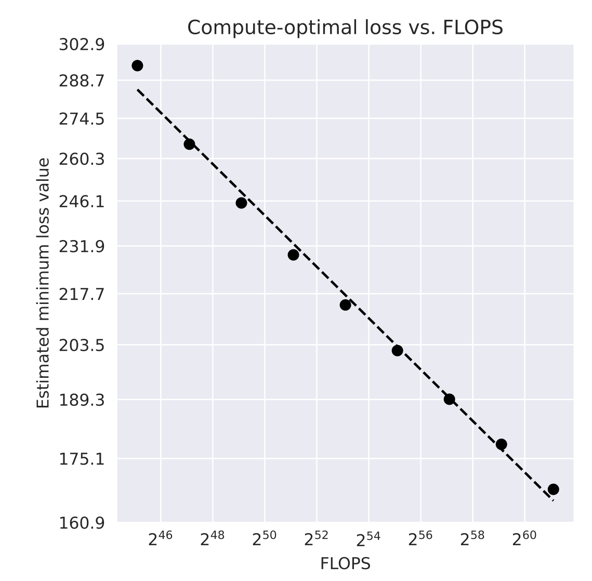

<!-- source: https://transformer-circuits.pub/2024/april-update/index.html -->

# Circuits Updates - April 2024

  
  

We report a number of developing ideas on the Anthropic interpretability team, which might be of interest to researchers working actively in this space. Some of these are emerging strands of research where we expect to publish more on in the coming months. Others are minor points we wish to share, since we're unlikely to ever write a paper about them.

We'd ask you to treat these results like those of a colleague sharing some thoughts or preliminary experiments for a few minutes at a lab meeting, rather than a mature paper.

New Posts

* [Open Roles In Interpretability](#open-roles)
* [Scaling Laws for Dictionary Learning](#scaling-laws)
* [Update on how we train SAEs](#training-saes)
* [How Strongly do Dictionary Learning Features Influence Model Behavior?](#ablation-exps)
* [Interpretability Architectures Project](#interpretability-architecture)
* [Caloric and the Utility of Incorrect Theories](#caloric-theory)
* [Open Problem: Attribution Dictionary Learning](#attr-dl)
* [Isolating Circuits Paths of Different Lengths](#circuit-path-lengths)
* [Research By Other Groups](#external-research)

  
  
  

  
  

## [Open Roles in Mechanistic Interpretability](#open-roles)

Chris Olah, Shan Carter, Adam Jermyn, Josh Batson, Tom Henighan

Mechanistic interpretability is a small field, although growing quite quickly. We estimate there are perhaps 50 full time positions focused on this topic. The Anthropic interpretability team is now 17 people, so we represent a significant fraction of these positions. As a result, we felt that providing some visibility into our hiring plans might be valuable for people considering careers in this space. (However, please note that while these are our present expectations, they are subject to change.)

Over the course of 2023 we hired 10 people. We’ve continued hiring in 2024, and expect to continue growing the team substantially, both this year and into 2025. We expect this to involve a few different roles:

* [Managers](https://boards.greenhouse.io/anthropic/jobs/4009173008) - We see this as the most important role that we’re hiring for right now.

* Our growth is likely to be bottlenecked on management capacity, and finding the right fit for the team could make a huge difference to our long-term success.
* Filling this role has been challenging because we’re looking for someone with experience in a research or engineering environment, who is excited about and experienced with people and project management, and who is enthusiastic about our research agenda and mission.

* [Research Scientists](https://boards.greenhouse.io/anthropic/jobs/4020159008) - We're looking for strong scientists, not necessarily experienced machine learning researchers. Most of our team comes from other backgrounds (astrophysics, condensed matter, mathematics, neuroscience). We do want to see evidence of engagement with mechanistic interpretability, as well as sufficient coding ability to implement and run ambitious experiments.
* [Research Engineers](https://boards.greenhouse.io/anthropic/jobs/4020305008) -  We're looking for strong software engineers. Experience with machine learning is a plus, but not necessary – we're excited to consider strong software engineers who want to grow into research. Our team has a track record of having several such people (eg. [Nelson Elhage](https://nelhage.com/), [Tristan Hume](https://thume.ca/)) joining and quickly growing to perform state of the art research. Comfort with linear algebra, multivariate calculus, and basic engagement with machine learning and mechanistic interpretability is a strong plus if you don't have an ML background.

A few notes:

* Internally, we don't really distinguish between research engineers and scientists. All members of our team do both research and engineering. However, people are often stronger at one than the other, and we try to hire a mixture of these strengths for team balance.
* If you are interested in our new interpretability architectures project (see [below](#interpretability-architecture)), please apply to the research scientists or research engineer role and mention this in your application.

If you’re excited about our work and think you might be a fit for one of these roles, please apply!

  
  
  

  
  

## [Scaling Laws for Dictionary Learning](#scaling-laws)

Jack Lindsey, Tom Conerly, Adly Templeton, Jonathan Marcus, Tom Henighan

Training sparse autoencoders (SAEs) for dictionary learning on larger models can be computationally intensive.  It is important to understand (1) the extent to which using additional compute improves dictionary learning results, and (2) how that compute should be allocated.  Here we analyze these questions in depth.  As a case study, we consider SAEs trained on the residual stream following the third layer of a four-layer transformer.

Though we lack a gold-standard method of assessing the quality of a dictionary learning run, we have found that the loss function used during training  – a weighted combination of reconstruction mean-squared error (MSE) and an L1 penalty on feature activations – is a useful proxy.  Unless otherwise indicated, we use \mathrm{MSE} + 5\mathrm{L1} as our loss function during training and subsequent analysis. However, we find qualitatively similar results when we use other linear combinations of MSE and L1, or when we track linear combinations of MSE and the L0 “norm” of feature activations.  We note that losses with different L1 coefficients are not comparable – ultimately, we select the L1 coefficients that produce the most useful features for downstream interpretability analyses.

Once we have chosen a loss function of interest, it allows us to treat dictionary learning as a standard machine learning problem, to which we can apply the “scaling laws” framework for hyperparameter optimization (see e.g. [Kaplan](https://arxiv.org/abs/2001.08361) [et al.](https://arxiv.org/abs/2001.08361)[2020](https://arxiv.org/abs/2001.08361),  [Hoffman](https://arxiv.org/abs/2203.15556) [et al.](https://arxiv.org/abs/2203.15556)[2022](https://arxiv.org/abs/2203.15556)).  In an SAE, compute usage primarily depends on two key hyperparameters, the number of features being learned, and the number of steps used to train the autoencoder.  The compute (in FLOPS) scales with the product of these parameters, if the input dimension and other hyperparameters are held constant.  We conducted a thorough sweep over these parameters, fixing the values of other hyperparameters (learning rate, batch size, optimization protocol, etc.).

We are especially interested in keeping track of the compute-optimal values of the loss function and parameters of interest; that is, the lowest loss that can be achieved using a given number of FLOPS, and the number of training steps / features that achieve this minimum.

We have made the following observations:

* Over the ranges we tested, loss functions decrease approximately according to a power law with respect to FLOPS, given the compute-optimal choice of training steps and number of features.

* As the compute budget increases, the optimal allocations of FLOPS to training steps and number of features both scale approximately as power laws.

* In general, the optimal number of features appears to scale somewhat more quickly than the optimal number of training steps.  For instance, as the number of features increases, the corresponding compute-optimal number of training steps scales as a function of the number of features with an exponent between 0.5 and 1.  The specific parameters of the scaling trends vary between different loss functions.

* Emphasizing the sparsity penalty more in the loss function (i.e. increasing the L1 coefficient) leads to a larger number of training steps being compute-optimal.The compute-optimal number of training steps increases for loss functions that place a greater relative emphasis on the sparsity penalty.  This suggests that reconstruction loss is optimized more quickly than sparsity over the course of SAE training, which we have observed empirically.

* In these experiments, we also investigate the parameters needed to optimize for L0-based loss functions (i.e. linear combinations of MSE and L0 “norm” of feature activations).  Since these cannot be directly optimized with gradient descent, we instead sweep over a range of L1 penalty coefficients during training and select the value that minimizes the L0-based loss function. We find that minimizing L0-based loss functions requires a greater number of training steps for a given number of features, compared to minimizing L1-based loss functions.  Though we have not precisely characterized the source of this difference, we suspect it arises because additional training steps allow the SAE to fully zero out small feature activations.

The details of these trends are likely to vary depending on the underlying model, the layer of the model being probed, and other optimization details.  Optimizing other hyperparameters (such as learning rate) jointly with training steps and number of features may influence the scaling trends.  However, we expect many of these qualitative trends to be broadly applicable.  We suggest that conducting similar analyses will be useful to other groups working with SAEs, particularly as computational cost increases. Extrapolating trends inferred from smaller experiments enables more informed choices of hyperparameters for resource-intensive dictionary learning runs. We are also careful to note that qualitative inspection of SAE features remains important, as the relationship between SAE loss and qualitative usefulness of SAE features is imperfect and may break down at sufficient scale.

  
  
  

  
  

## [Update on how we train SAEs](#training-saes)

Tom Conerly, Adly Templeton, Trenton Bricken, Jonathan Marcus, Tom Henighan

We’ve made improvements to how we train SAEs since Towards Monosemanticity with the goal of lowering the SAE loss. While the new setup is a significant improvement over what we published in Towards Monosemanticity we believe there are further improvements to be made. We haven’t ablated every decision so it’s likely some simplifications could be made. This work was explicitly focused on lowering loss and didn’t grapple with loss not being the ultimate objective we care about. Here’s a summary of our current SAE training setup:

Let n be the input and output dimension and m be the autoencoder hidden layer dimension. Let s be the size of the dataset. Given encoder weights W\_e \in \mathbb{R}^{m \times n}, decoder weights W\_d \in \mathbb{R}^{n \times m}, and biases \mathbf{b}\_e \in \mathbb{R}^{m}, \mathbf{b}\_d \in \mathbb{R}^{n}, the operations and loss function over a dataset X \in \mathbb{R}^{s,n} are:

\begin{aligned}\mathbf{f}(x) &= \text{ReLU}( W\_e \mathbf{x}+\mathbf{b}\_e ) \\ \hat{\mathbf{x}} &= W\_d \mathbf{f}(x)+\mathbf{b}\_d \\ \mathcal{L} &= \frac{1}{|X|} \sum\_{\mathbf{x}\in X} ||\mathbf{x}-\hat{\mathbf{x}}||\_2^2 + \lambda\sum\_i |\mathbf{f}\_i(x)| ||W\_{d,i}||\_2 \end{aligned}

Note that the columns of W\_d have an unconstrained L2 norm (in Towards Monosemanticity they were constrained to norm one) and the sparsity penalty (second term) has been changed to include the L2 norm of the columns of W\_d. We believe this was the most important change we made from Towards Monosemanticity.

\mathbf{b}\_e and \mathbf{b}\_d are initialized to all zeros. The elements of W\_d are initialized such that the columns point in random directions and have fixed L2 norm of 0.05 to 1 (set in an unprincipled way based on n and m, 0.1 is likely reasonable in most cases). W\_e is initialized to W\_d^T.

The rows of the dataset X are shuffled. The dataset is scaled by a single constant such that \mathbb{E}\_{\mathbb{x} \in X}[||x||\_2] = \sqrt{n}. The goal of this change is for the same value of \lambda to mean the same thing across datasets generated by different size transformers.

During training we use Adam optimizer beta1=0.9, beta2=0.999 and no weight decay. Our learning rate varies based on scaling laws, but 5e-5 is a reasonable default. The learning rate is decayed linearly to zero over the last 20% of training. We vary training steps based on scaling laws, but 200k is a reasonable default. We use batch size 2048 or 4096 which we believe to be under the critical batch size. The gradient norm is clipped to 1 (using [clip\_grad\_norm](https://pytorch.org/docs/stable/generated/torch.nn.utils.clip_grad_norm_.html)). We vary \lambda during training, it is initially 0 and linearly increases to its final value over the first 5% of training steps. A reasonable default for \lambda is 5.

We do not use resampling or ghost grads because less than 1% of our features are dead at the end of training (dead means not activating for 10 million samples). We don’t do any fine tuning after training.

Conceptually a feature’s activation is now \mathbf{f}\_i ||W\_{d,i}||\_2 instead of \mathbf{f}\_i. To simplify our analysis code we construct a model which makes identical predictions but has an L2 norm of 1 on the columns of W\_d. We do this by W\_e' = W\_e ||W\_d||\_2, b\_e' = b\_e ||W\_d||\_2, W\_d' = \frac{W\_d}{||W\_d||\_2} and b\_d'=b\_d.

**Potential areas for improvement**

Our initialization likely needs improvement. As we increase m the reconstruction loss at initialization increases. This may cause problems for sufficiently large m. Potentially with improved initialization we could remove gradient clipping.

We haven’t seen improvements in loss from resampling or ghost grads, but it’s possible resampling “low value” features would improve loss.

It’s plausible some sort of post training (for example [Addressing Feature Suppression in SAEs](https://www.lesswrong.com/posts/3JuSjTZyMzaSeTxKk/addressing-feature-suppression-in-saes)) would be helpful.

Improving shrinkage is an area for improvement.

There are likely other areas for improvement we don’t know about.

**Results**

Given a fixed dataset X as we increase m the loss consistently decreases. We’ve been able to increase m to single digit millions without issues. This holds across a variety of transformer sizes and mlp activations or the residual stream. Our setup from Towards Monosemanticity would frequently have higher loss, many dead features, or many nearly identical features when run with large values of m.

We make changes to our training setup by looking at loss across a variety of values of \lambda, m, transformer sizes, and mlp or residual stream runs. We’re generally excited by a change that consistently decreases loss by at least 1%, or a change with roughly equal loss that simplifies our training setup. With our setup, comparing runs on (L0, MSE) or (L0, % of MLP loss recovered) requires care because L0 can be unstable. For example we’ve had cases where training twice as long with half the number of features leads to a <1% change in MSE and L1 but a 30% decrease in L0.

Here are some results from small models. All runs have 131,072 features, 200k train steps, batch size 4096. Note that L1 of f depends on our specific normalization of activations.

|  |  |  |  |  |  |
| --- | --- | --- | --- | --- | --- |
| Type of Run | Lambda | L0(f) | L1(f) | Normalized MSE | Frac Cross Entropy Loss Recovered |
| 1L MLP | 2 | 99.62386 | 17.22560 | 0.03054 | 0.98305 |
| 1L MLP | 5 | 38.68729 | 11.59591 | 0.06609 | 0.96398 |
| 1L MLP | 10 | 20.06870 | 7.12194 | 0.13120 | 0.91426 |
| 4L MLP (layer 2) | 2 | 264.02930 | 95.03488 | 0.06824 | 0.96824 |
| 4L MLP (layer 2) | 5 | 69.92758 | 56.92384 | 0.12546 | 0.92904 |
| 4L MLP (layer 2) | 10 | 26.48456 | 39.42661 | 0.18485 | 0.88438 |
| 4L Residual Stream (layer 2) | 2 | 81.58595 | 30.37323 | 0.09543 | 0.9572 |
| 4L Residual Stream (layer 2) | 5 | 33.23121 | 19.12259 | 0.16295 | 0.90443 |
| 4L Residual Stream (layer 2) | 10 | 8.71466 | 12.53889 | 0.25455 | 0.83883 |

  
  
  

  
  

## [How Strongly do Dictionary Learning Features Influence Model Behavior?](#ablation-exps)

Jack Lindsey

Features uncovered by sparse autoencoders are optimized to reconstruct model activity while remaining sparsely active. Our team and others have observed that these features often appear to encode specific, interpretable concepts. However, a potential concern about using these features for an interpretability agenda is that, despite their semantic significance to humans, these features may not capture the abstractions that the model uses for its computation. We have conducted preliminary experiments that suggest that models do in fact “listen” to feature values significantly more than would be expected by chance.

Our experiment works as follows: We train a sparse autoencoder (SAE) on the residual stream following the third layer of a trained four-layer transformer. For each SAE feature, we take a representative sample of datapoints for which that feature has a nonzero activation, scale the value of that activation by a factor of either 0 (“feature ablation”) and 2 (“feature doubling”), and propagate the updated value through to the model according to the same procedure as in [Towards Monosemanticity](https://transformer-circuits.pub/2023/monosemantic-features/index.html) (the case of scaling factor equal to zero corresponds to a feature ablation). We compute the average increase in the model’s loss following this procedure.

Our goal is to determine whether the loss increase from rescaling feature activation values is especially high compared to other model perturbations with similar statistics. If so, it would provide evidence that feature directions exert “special” influence on downstream computation in the model. To this end, we compare feature rescaling to several controls:

* Apply a random perturbation to the residual stream activity at the same layer, matching the magnitude of the random perturbation to the magnitude of the perturbation induced by the feature rescaling (“random perturbation, model activations” in the figure).

This control is meant to test whether feature ablations are more significant than random perturbations. Arguably, this is a weak baseline, as the variance of model activations is likely not isotropic, and thus some dimensions of residual stream activity may be less consequential to model behavior. SAE feature vectors are trained to reconstruct model activity, and as a result probably concentrate in more important dimensions. Thus, as a stronger baseline, we tried the following:

* Apply a random perturbation of the same magnitude as the feature rescaling on the feature activations vector (“random perturbation, feature activations” in the figure), and propagate that perturbation through to the model according to the same procedure used for the feature rescalings.

These experiments revealed several interesting findings:

* We found that feature ablations have significantly greater impact on model performance than either of the controls.

* Interestingly, ablating the feature activation has a substantially greater effect on model performance than amplifying the feature by the same amount, suggesting that the influence of features on model outputs may (partially) saturate at higher feature activations.

We also compared the effect of feature perturbations to other, more structured forms of perturbations.  In all cases we match the magnitude of the perturbation in model activation space to be equal to that of the corresponding feature ablation.

* Controlling for perturbation magnitude, applying perturbations in a direction antiparallel to the SAE reconstructions (“dampen feature activations” in the figure) – equivalent to “spreading out” a feature ablation across all features, in proportion to their activity – produces similar effects as single-feature ablations.

* Controlling for magnitude, perturbations antiparallel to the model activity (“dampen model activations” in the figure) have less impact than feature dampening. Note that dampening model activations is different than dampening feature activations, as model activations include two components – the bias term of the SAE, and the error vector left unexplained by the SAE – that are not affected by feature dampening. This result indicates that the feature dampening effect is not explainable simply due to its effect on activation norm.  In fact, in later layers, the effect of dampening model activations almost vanishes.

* Consistent with the results of [Gurnee](https://www.lesswrong.com/posts/rZPiuFxESMxCDHe4B/sae-reconstruction-errors-are-empirically-pathological) (discussed in detail [elsewhere](#h.ogrm6hm97rka) in this update), magnitude-controlled perturbations along the reconstruction error direction -(x - SAE(x)) (“perturb along residual” in the figure) are also substantially more impactful than random perturbations, though less impactful than feature ablations.  While not conclusive, these results suggest that Gurnee’s findings are consistent with a model in which SAE reconstruction errors lie primarily along feature directions, as this would explain their greater-than-random impact on model outputs.

* The outsized impact of feature ablations is more pronounced for residual stream features than MLP layer features. This suggests that residual stream and MLP features may play different functional roles in the network, though our understanding of this result is limited.

In this figure, results are averaged over contexts, tokens, and features, and error bars indicate standard error of the mean over features.

These results are preliminary, but generally support the idea that feature directions uncovered by SAEs are high-leverage “levers” for influencing model outputs.

  
  
  

  
  

## [Interpretability Architectures Project](#interpretability-architecture)

Chris Olah, Adam Jermyn

From time to time, we've noticed aspects of transformer architecture that make our lives on interpretability more difficult. For instance, layernorm [makes circuit analysis](https://transformer-circuits.pub/2021/framework/index.html#handling-layer-normalization) and [attribution](https://www.neelnanda.io/mechanistic-interpretability/attribution-patching#layernorm) more difficult, and we've invested significant effort in trying to get rid of it over the years. Similarly, [SoLU](https://transformer-circuits.pub/2022/solu/index.html) was an attempt at making models more interpretable, although we ultimately believe it [wasn't the right approach](https://transformer-circuits.pub/2022/solu/index.html#section-6-4) to that specific problem.

We believe it's possible that investing in model architecture now may save a lot of interpretability effort in the future. For this reason, we’re starting an experimental working group to explore more interpretable architectures. This working group will investigate architectural decisions that might make interpretability easier, and will collaborate with the Pretraining team to support their implementation. For now, this working group will be smaller than the [main interpretability teams](https://transformer-circuits.pub/2024/jan-update/index.html#team-update) (dictionary learning, attention, and circuits). This working group will be embedded in both Interpretability and Pretraining, and members will sometimes contribute to projects on both of these broader teams.

If you’re interested in this new working group, please apply to join our team and indicate interest in working on interpretable architectures (see [above](#h.f1xnx37s5j46)).

  
  
  

  
  

## [Caloric and the Utility of Incorrect Theories](#caloric-theory)

Tom Henighan

 “Caloric theory” is an outdated theory of heat which can be summarized as follows:

> There is a massless, self-repelling substance called “caloric” which increases the temperature of whatever matter it inhabits.

It’s easy to scoff at this theory and regard it as silly with the benefit of hindsight. But in fact, this theory could explain many, if not most, thermodynamic measurements that were available at the time. Consider the phenomenon of heat flow as a concrete example. Under caloric theory, a hot (high temperature) object contains a lot of caloric. That caloric is self-repelling, but cannot spread out more because it’s constrained by the boundaries of the hot object. If we put this hot object into contact with a cold object, the caloric spreads into the cold object. The hot object cools and the cold object heats as caloric flows from the former to the latter.

I now invite the reader to put themselves in the shoes of a 17th century scientist and design an experiment which can disprove caloric theory. Further, imagine how much more challenging this would be if you didn’t know about the kinetic theory of heat, which eventually supplanted caloric theory. This exercise gave me personally a lot of empathy for the calorists of old.

What I find most interesting about caloric theory is that although it was wrong, it yielded insights which we still hold true today.

One notable example is the Carnot cycle. Quoting [wikipedia](https://en.wikipedia.org/wiki/Caloric_theory#Early_history):

> [Sadi Carnot](https://en.wikipedia.org/wiki/Nicolas_L%C3%A9onard_Sadi_Carnot), who reasoned purely on the basis of the caloric theory, developed his principle of the [Carnot cycle](https://en.wikipedia.org/wiki/Carnot_cycle), which still forms the basis of [heat engine](https://en.wikipedia.org/wiki/Heat_engine) theory. Carnot's analysis of energy flow in steam engines (1824) marks the beginning of ideas which led thirty years later to the recognition of the [second law of thermodynamics](https://en.wikipedia.org/wiki/Second_law_of_thermodynamics).

In other words, the road to the heat engine theory and eventually the second law of thermodynamics was paved, in part, by an incorrect theory of heat. Another success of caloric theory was a correction to Newton’s calculation of the speed of sound in air, which held for nearly a century afterward.

### Implications for Interpretability

I think there are many lessons we as interpretability researchers can learn from the history of caloric theory. Our initial theories will probably be wrong, and we should be willing to change our theories in the face of experimental evidence. Designing experiments which demonstrate that those theories are wrong will be a central challenge for us. But the more subtle point that I want to emphasize is that wrong theories can still provide real utility. Even if we think the superposition hypothesis will be disproven in the future, which it may very well be, using it is not a fool’s errand. There is still hope that it will be “correct enough” to illuminate practical safety wins and even scientific understanding which outlive the superposition hypothesis itself.

  
  
  

  
  

## [Open Problem: Attribution Dictionary Learning](#attr-dl)

Chris Olah, Adly Templeton, Trenton Bricken, Adam Jermyn

Ordinary dictionary learning only considers activations. It ignores gradients and weights. It seems like we should be able to make it much more efficient if we didn't do this.

More fundamentally, it seems like features have a dual nature. Looking backwards towards the input, they are "representations". Looking forwards towards the output, they are "actions". Both of these should be sparse – that is, they should sparsely represent the activations produced by the input, and also sparsely affect the gradients influencing the output. Ultimately, it seems like they should be a kind of conjunction of these two kinds of sparsity.

### A Concrete Proposal

One operationalization of this might be to change the dictionary learning to ask that the linear attribution be sparse.

Consider a dictionary learning problem x \simeq x' = Dy where x is the dense activations, y the sparse feature activations, and D the dictionary. A traditional SAE loss might be:

|  |  |  |  |  |
| --- | --- | --- | --- | --- |
| L\_{SAE} | = | ||x - x'||^2 | + | \lambda||y||\_1 |
|  |  | Reconstruction error |  | Activation sparsity penalty |

Recall that the linear attribution vector A\_x = x \odot \nabla\_xL\_{LLM} gives an approximation of how each element of x affects the LLM loss. An analogous attribution vector can be computed for y, A\_y = y \odot \nabla\_yL\_{LLM}.Note that the gradient of y with respect to the LLM loss is easily computed if we save the gradient of the loss with respect to the input activations since \nabla\_yL\_{LLM} = D^T\nabla\_xL\_{LLM} where D is the dictionary.

We can then add terms to the SAE loss to encourage this to be sparse and to fully explain the attribution:

|  |  |  |  |  |  |  |  |  |
| --- | --- | --- | --- | --- | --- | --- | --- | --- |
| L\_{SAE} | = | ||x - x'||^2 | + | \lambda||y||\_1 | + | \alpha||A\_y||\_1 | + | \beta\left(\sum A\_{x-x'} \right) |
|  | = | ||x - x'||^2 | + | \lambda||y||\_1 | + | \alpha||y \odot \nabla\_yL\_{LLM}||\_1 | + | \beta|(x\!-\!x')\cdot \nabla\_xL\_{LLM}| |
|  |  | Reconstruction error |  | Activation sparsity penalty |  | Attribution sparsity penalty |  | Unexplained attribution penalty |

This directly optimizes the sparsity of the attribution vector we recently used to study feature circuits in [Using Features For Easy Circuit Identification](https://transformer-circuits.pub/2024/march-update/index.html#feature-heads) (see also attribution in [Marks](https://arxiv.org/pdf/2403.19647.pdf)[et al.](https://arxiv.org/pdf/2403.19647.pdf) on circuits of features, [Kramár](https://arxiv.org/pdf/2403.00745.pdf) [et al.](https://arxiv.org/pdf/2403.00745.pdf) on attribution patching, and [Olah](https://distill.pub/2018/building-blocks/) [et al.](https://distill.pub/2018/building-blocks/) on attribution to neurons in vision models).

We briefly investigated the features produced by this loss in a one-layer transformer. At first glance, they seemed about equally good to our normal features in that context. But we don't consider this at all dispositive. We plan to revisit this at some point in the future, but it may not be for a few months, and could be an interesting subject for someone else to investigate in the interim.

  
  
  

  
  

## [Isolating Circuits Paths of Different Lengths](#circuit-path-lengths)

Chris Olah

In [A Mathematical Framework for Transformer Circuits](https://transformer-circuits.pub/2021/framework/index.html), we briefly described an [algorithm](https://transformer-circuits.pub/2021/framework/index.html#term-importance-analysis) for studying paths of length at most k:

However, we didn't really explain why this algorithm works, and it was easy to miss. We think there are some cases where this algorithm can be interesting, and this update provides a more intuitive explanation.

Let's picture what happens as we apply this algorithm:

It's easy to see that on the first iteration, we isolate paths of length 0 (ie. we only use the direct path on the residual stream). But also note that we're saving the paths of length 1.

On the next iteration, we use the paths of length 1, and save the paths of length 2. And so on.

This basic idea can be used to create algorithms for isolating all kinds of effects. In particular, modifying the base case can be very powerful. For example, the following variant can isolate the k-step effects of an ablation:

Other interesting variants are:

* Ablate a component for steps i through j in order to then get the ablations paths greater than one length but less than others.
* For the basic algorithm, feed in the difference between values saved at different stages in order to isolate longer paths.

  
  
  

  
  

## [Research By Other Groups](#external-research)

Emmanuel Ameisen, Joshua Batson, Hoagy Cunningham, Anna Golubeva, Jack Lindsey

Finally, we'd like to highlight a selection of recent work by a number of researchers at other groups which we believe will be of interest to you if you find our papers interesting. Given the increasing rate of progress in the field, this is far from comprehensive, and rather represents a selection of potential interest.

#### [Sparse Feature Circuits](#external-sparse-circuits)

In "[Sparse Feature Circuits: Discovering and Editing Interpretable Causal Graphs in Language Models](https://arxiv.org/abs/2403.19647)", Marks, Rager, Michaud, Belinkov, Bau, and Mueller investigate scalable methods for identifying model circuits across a range of language tasks in a 6L 70M parameter Pythia model. Their main contributions are using dictionary learning with reconstruction error routed back into the model for attribution, a zero-ablation faithfulness metric and corresponding procedure for unsupervised circuit discovery, a demonstration of editing circuits for model debiasing, and some notes on scalable causal effect estimation.

They train sparse autoencoders (SAEs) separately on residual streams, MLP outputs, and attention outputs, and view those feature activations as nodes for the purpose of circuit analysis. They also make nodes for the residuals of each autoencoder – this has the advantage of making feature-based decomposition of the model complete, and the disadvantage that the residuals are high-dimensional and hard to interpret. (For example, a zero-feature SAE would present a sparse circuit from this perspective, with every node a residual node, but not be very interpretable.) They then conduct attribution analysis to identify which nodes are most important for a specific model output. Given an importance threshold for nodes (features + errors) and edges, they can extract a candidate circuit for a given behavior.

To measure circuit quality, they evaluate interpretability with human raters, who find the sparse features selected to be significantly more interpretable than neurons. They measure faithfulness as the proportion of the model's performance explained by the circuit relative to a mean-ablated model. Completeness is assessed by ablating the circuit and measuring the impact on model performance, showing that removing a small number of nodes from the feature circuits can eliminate the model's task performance.

Editing (ablating) circuits leads to successful model debiasing, which can be improved with post-editing finetuning. They demonstrate this with Spurious Human-interpretable Feature Trimming (SHIFT), where a human reduces spurious bias from a classifier by editing its feature circuit. The method removes the classifier's dependence on unintended signals identified through circuit analysis while preserving performance on the downstream task. Some human judgment is necessary for debiasing – statistics present in the training data for the task may have confounds we do not wish to be used, and we have to say what those are. Here, that judgment is expressed in the manual selection of features rather than in a human description (such as [prompting](https://www.anthropic.com/news/evaluating-and-mitigating-discrimination-in-language-model-decisions) with "it is really really important to me that race, gender, age, and other demographic characteristics do not influence this decision" ) or in the curation of a gold-standard unbiased dataset (which may be impossible depending on the structure of confounding in the actual world). This provides a promising additional method for removing the influence of certain high-level features from a model's predictions.

This paper makes some inroads on the important problem of scalable circuit discovery. The reported faithfulness numbers leave room for future work on identifying additional pathways that contribute to specific model behaviors, even when accounting for SAE reconstruction errors. It is also possible that the large number of nodes necessary to recover good performance reveals a problem with current SAEs; while they provide sparse representations of activations, they may not be the sparsest way to represent computation. (For example, there are many "she"- or "her"- in-context features in early layers of one circuit which might be merged in a more compositional representation.)  It will be exciting to see these (and related) methods applied to larger models on more complex tasks.

#### [“Pathological” SAE Reconstruction Errors](#external-sae-errors)

In “[SAE reconstruction errors are (empirically) pathological](https://www.lesswrong.com/posts/rZPiuFxESMxCDHe4B/sae-reconstruction-errors-are-empirically-pathological#:~:text=Sparse%20Autoencoder%20(SAE)%20errors%20are,than%20substituting%20the%20SAE%20reconstruction%20()”, Gurnee examines how well sparse autoencoder (SAE) reconstructions obtained with the standard training objective faithfully preserve the model's next-token predictions, and in particular whether SAE reconstruction errors are more impactful than similarly sized deviations from the true activations.

Gurnee conducts a series of experiments on GPT2-small, comparing the impact of substituting the original activation x with either their SAE reconstruction SAE(x), and the impact of substituting x with a variety of random perturbation controls (that match the norm of the perturbation to ||x - SAE(x)||, or the angle of the perturbed vector to the angle between x and SAE(x)). Across all layers of the model, substituting SAE(x) increases the KL divergence between the original and substituted next-token probabilities significantly more than the random perturbations, even controlling for differences in norm between x and SAE(x). This gap suggests that SAE reconstructions introduce systematic, rather than random, errors. Understanding the nature of these errors  could help diagnose the shortcomings of SAE reconstructions.

Why might SAEs make systematic errors in reconstruction?  There are several possible explanations

* The SAE has not learned all features necessary for a faithful reconstruction of model activity
* The SAE has learned all the features, but the encoder fails to infer the correct feature activations
* Some component of the model activity is not well-described by sparsely active linearly encoded features, but is still important for the model’s function

Our additional analyses [described in this update](#ablation-exps) shed some more light on this finding.

#### [Fine-tuning](#external-dpo-tox)

In "[A Mechanistic Understanding of Alignment Algorithms: A Case Study on DPO and Toxicity](https://arxiv.org/abs/2401.01967)", Lee et al. investigate how a fine-tuning algorithm ([DPO](https://arxiv.org/abs/2305.18290)) changes the behavior of a pretrained model (GPT-2 Medium).

First, the authors identify model components that contribute to toxic behavior by training a probe for toxicity on the final layer residual stream, based on a curated dataset of toxic and non-toxic comments. They identify a number of MLP neurons whose output vectors have high cosine similarity with the probe vector – we may call them 'toxic' neurons – and which produce profane, scatalogical, or insulting tokens when inspected via the logit lens. The toxicity of completions can be reduced by steering, either with the probe vector, the output vector of the most toxic neuron, or the top principal component of the set of toxic neurons.

In contrast, DPO finetuning optimizes a two-part loss, one which favors non-toxic completions relative to toxic completions of a set of prompts, and the other of which preserves the model output distribution (in the KL sense). The resulting finetuned model has a greater reduction in toxic completions than any of the steering approaches provides while, strikingly, every parameter vector in the finetuned model has a 0.99 cosine similarity or above with the original model. "Though its parameters have barely moved,...we show that their collective movement is enough to avoid toxic outputs." This presents a mystery – how can such tiny weight changes produce a substantive change in behavior?

The authors show that many MLP neuron output vectors in the layers preceding the toxic neurons have small changes that decrease the pre-activation of the toxic neurons. (Because GPT2 uses a GeLU activation function, which is slightly negative when inactive, the weights actually shift by a vector positively aligned with the in-weights of the toxic neurons.) The sum of those small shifts over many neurons in many layers is enough to substantially change the activation of the toxic neurons, and therefore reduce toxic outputs. One consequence of this infinitesimal approach is that the neurons implementing the toxic behavior are still there, and the behavior will resume if they are activated. Indeed, the authors show that upscaling the in-weights to the toxic neurons is enough to reactivate the toxic behavior on the same distribution. This speaks to the broader literature on jailbreaks of HHH models; jailbreaks exist because finetuning reduces the incidence of behavior but doesn't remove its mechanism.

Unalignment via increasing the input weights of the toxic neurons.

#### [Binding Entities to Attributes](#external-entity-binding)

In the paper [How do Language Models Bind Entities in Context?](https://arxiv.org/abs/2310.17191) (from late 2023) Jiahai Feng and Jacob Steinhardt investigate the mechanisms by which language models retrieve attributes of entities, studying simple retrieval problems such as “Context: Alice lives in the capital city of France. Bob lives in the capital city of Thailand. Question: Which city does Bob live in?”. In their examples, the attributes and entities are always single tokens.

They find that the information needed to retrieve this connection between entity and attribute seems to be stored entirely in the residual stream of the entity token, so of the tokens “France” and “Thailand” in the previous paragraph’s examples. Given this, with an example of the form “A is X, B is Y”, they need only exchange the residual stream activations of tokens X and Y to make the model ‘believe’ that “A is Y”.

Noting that the assumption that information in activation vectors is stored linearly has been successful in the past, they hypothesize that the binding of the attribute to the entity is represented by a sum of an entity vector and a “binding vector” which represents some kind of abstract identifier given to the object in this particular context. They look at the activations for a given entity in two different retrieval contexts and subtract one from the other to eliminate the common entity vector, thereby isolating the binding vector. Performing this multiple times finds a continuous subspace of valid binding vectors, with this subspace having at least two dimensions, and where the correct answering of the question depends upon the two binding vectors being used to track the two entities being sufficiently different. (It would be interesting to see whether the number of sufficiently-different valid binding directions sets the upper limit on the number entities that the model can simultaneously track, and how this changes with model size).

Perhaps most interestingly, they find that they can transfer activations across different tasks, so if we have “A is Y” and in a separate context we have “B is X”, the residual streams of X and Y can be exchanged to make the model believe that “A is X” or that “B is Y”, even if A and B denote objects in totally different categories or tasks. This is evidence that when we say “Alice is X”, in the activations above X we’re not associating X with Alice in particular but with a more generic entity marker such as “the first named entity”. They also find that the ability to transfer across tasks in this way grows with model size, up to LLaMA30B. This use of abstract entity trackers is consistent with our unpublished finding that there exist neurons which fire on (among other things) mentions of the first named entity in a piece of text, regardless of the name (original work by Catherine Olsson).
