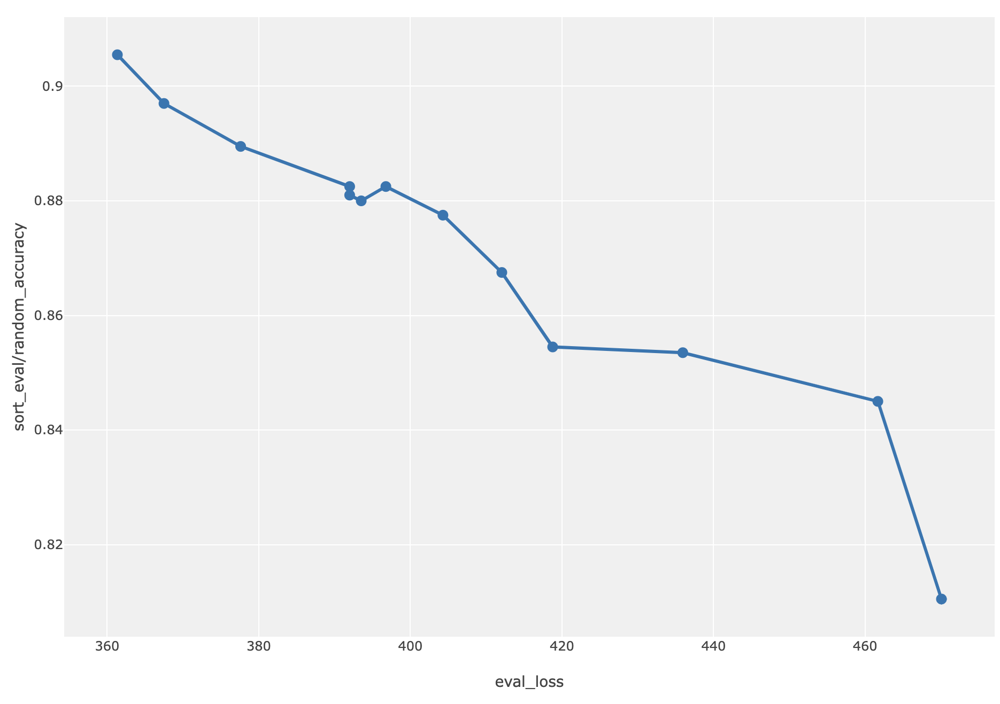
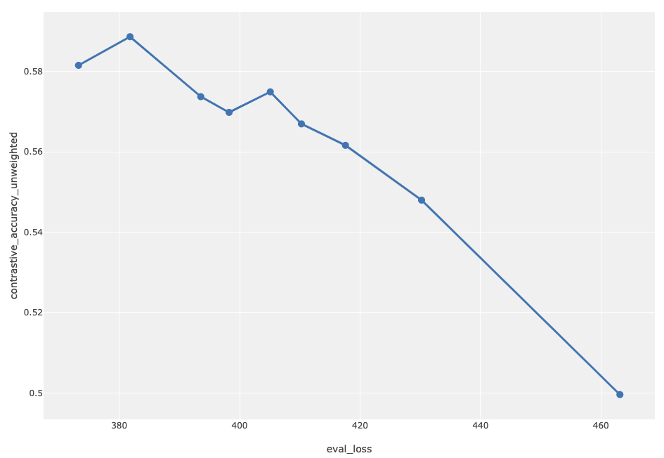
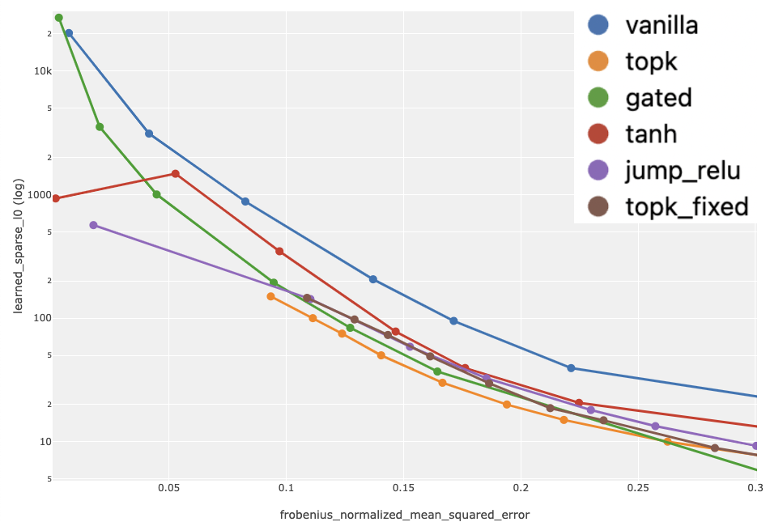
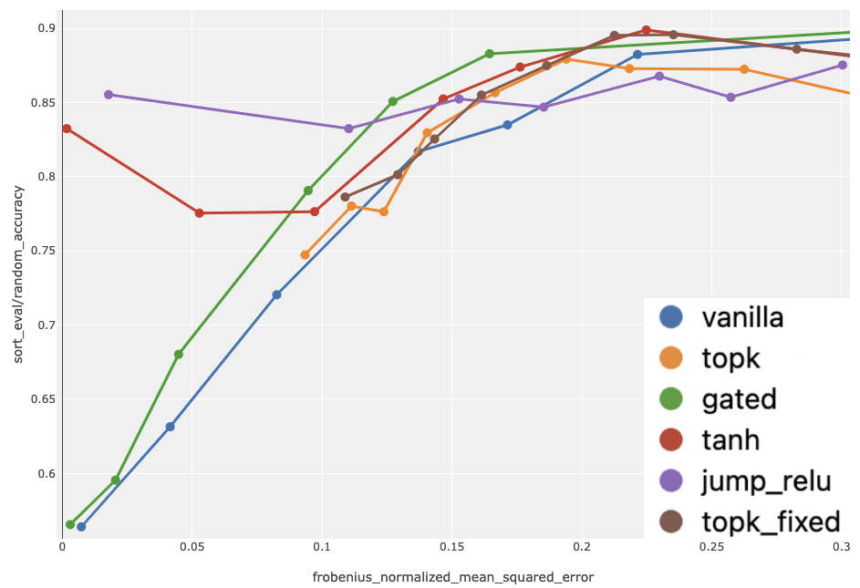

<!-- source: https://transformer-circuits.pub/2024/august-update/index.html -->

# Circuits Updates - August 2024

  
  

We report a number of developing ideas on the Anthropic interpretability team, which might be of interest to researchers working actively in this space. Some of these are emerging strands of research where we expect to publish more on in the coming months. Others are minor points we wish to share, since we're unlikely to ever write a paper about them.

We'd ask you to treat these results like those of a colleague sharing some thoughts or preliminary experiments for a few minutes at a lab meeting, rather than a mature paper.

New Posts

* [Interpretability Evals for Dictionary Learning](#interp-evals)
* [Interpretability Evals Case Study](#evals-case-study)
* [Self-explaining SAE features](#self-explaining-sae)

  
  
  

  
  

## [Interpretability Evals for Dictionary Learning](#interp-evals)

Jack Lindsey, Hoagy Cunningham, Tom Conerly; edited by Adly Templeton

In order to evaluate the interpretability of our dictionary learning features, we developed two related methods.  Both methods are a form of quantified autointerpretability, in which we measure the extent to which Claude can make accurate predictions about feature activations using our feature visualization tools.

We note that these evals are not comprehensive, and only measure a single notion of “interpretability”, which remains a nebulous concept. We expect that a suite of diverse evaluations is needed to provide a full picture of SAE quality.

### Contrastive Eval

This eval is motivated by the use of “contrastive pairs” to search for features that represent particular concepts. If a feature is active for one prompt but not another, the feature should capture something about the difference between those prompts, in an interpretable way.  Empirically, however, we often find this not to be the case – often a feature fires for one prompt but not another, even when our interpretation of the feature would suggest it should apply equally well to both prompts.  For instance, we might find that a “flower” feature activates on a description of one kind of flower, but not another.  Situations like this are a sign that either our features do not precisely capture interpretable concepts or that our interpretations of the features are insufficiently precise.

To measure the severity of this problem, we use the following methodology:

* Begin with a hardcoded list of concepts.  We tried to make these diverse and capture the kinds of things we might expect features to represent. This list was generated manually, with some LLM assistance, and we consider it a rough first-pass effort.

```
Photosynthesis, Sarcasm, The color blue, An appeal to authority, Democracy, Love, A false equivalence, Decisiveness under uncertainty, Desire to dominate, The number 7, The end of a sentence, Playing a sport, An example of a reference to the first argument of a function in code, Acceleration of progress, Getting bored in class, Giving someone a compliment when you don't mean it, The taste of coffee, Apples, The concept of time, A conjunction separating two independent clauses, A person exhibiting empathy for another person, Reflection in a mirror, Two people disagreeing about politics, A circular argument, Imbalanced parentheses in code, The placebo effect, Recursive self-improvement, An example of vectorized operations in code, The philosophical concept of epistemology, The literary device of allusion, The physical phenomenon of quantum tunneling, Noncoding RNA and its role in biology, Fictional animals, Deviation from the norm, A sentence with multiple adjectives modifying a single noun, Foreshadowing, Chairs, A darker,  grittier reboot of a beloved franchise, An example of in code, Struggling to learn a new concept, A beached whale, Social stratification, Anthrax, Imaginary friends, Recursion in programming, A person deceiving another person, CRISPR gene editing, A mathematical proof, The benefit of hindsight, A pronoun referring to someone introduced earlier in the sentence, The fall of the Roman empire, A person keeping a secret, Beauty standards, A string of bad luck, The rate of economic growth in a country, A cake recipe, Something being based on a true story, Famous actors and actresses, Theory of mind, Beauty in simplicity, Pretending to like food you don't like, Pastel colors, World War II, Something taking longer than it should, A sentence containing a list of items, Metamorphosis, An incorrect statement, Having trouble staying awake, Gaslighting, A metaphor, Falling from a great height, The theory of relativity, Abrahamic religions, Improvisation in music, Speaking truth to power, Two contradictory statements, Sham elections in a dictatorship, Rotting food, Cognitive dissonance, Large language models, A sentence with a transtive verb, Newton's second law of motion, Someone who is a master of their craft, Taking things one day at a time, Serendipity, Survivorship bias, Freshly made food, Providing an invalid input to a function, "Grass is always greener"-style thinking, Decision paralysis, Cultural relativism, Stream of consciousness narration, Centrally planned economies, Gentrification, A random word interjected in an otherwise normal sentence, The Industrial Revolution, Civil disobedience, Symbiotic relationships, Planned obsolescence
```

* For each concept, ask Claude to generate two similar sentences, where one relates to the concept (positive) and the other doesn't (negative).

* System prompt:

```
Please come up with two sentences. The first should involve the concept of '{concept}'. The second should not involve this concept, but should otherwise be as similar as possible to the first sentence in its content, wording, and structure. Any concept that appears in the first sentence should appear in the second sentence, and vice versa, except the concept of interest. Separate the sentences with a new line, and do not write anything else.
```

* Feed the positive and negative prompts into the dictionary and get the set of features which are active for one of the prompts but not the other

* For each pair of prompts and feature, provide Claude with the prompts and dataset examples which activate the feature in a new context window, and ask it to guess which of the two prompts activated the feature.

* System prompt:

```
        In this task, we will provide you with a pair of prompts, and information about a neuron.  In each example, the neuron activates for one of the examples but not the other. Your job is to accurately predict which example causes the neuron to activate.

        Each neuron activates for a specific concept. To help you understand the concept represented by the neuron, we are providing you with a set of examples that caused the neuron to activate.  Each example shows a string fragment and the top activating tokens with their activation score. The higher the activation value, the stronger the neuron fires. Note that the neuron's activity may be influenced just as much by the surrounding context as the activating token, so make sure to pay attention to the full string fragments.

        Neuron info:

        {formatted dataset examples that activate the feature}

        Now we will present you with the two prompts. Based on your understanding of the neuron's function, please predict which prompt the neuron was active for. Remember that it is only active for one of the prompts, but not the other.

        Prompt 1: {positive_prompt}

        Prompt 2: {negative_prompt}

        Which prompt activates the neuron? Think step-by-step, but end your answer with "ANSWER: 1" or "ANSWER: 2." Please adhere to this format and do not write anything after your answer.  If you're not confident, please still provide your best guess.
```

We aggregate eval performance (% of accurate responses) in two ways:

1. Raw average performance
2. Average performance weighted by feature activation.  For each feature and associated pair of prompts, we measure the activation of the feature on the prompt for which it was active.  We normalize the feature activation by its max across the SAE training dataset.  We weight the average performance across example by the per-example normalized feature activations computed in this fashion.  This metric prioritizes interpretability of strong feature activations.

### Sort eval

This eval is designed to evaluate the monosemanticity of features by using the dataset examples that most strongly activate a feature to try to predict other dataset examples that would activate that same feature.

A related problem is that, empirically, an SAE contains clusters of highly related features which appear to represent similar concepts, but activate in different contexts.  We are interested in measuring whether the semantic meanings of these features are distinguishable from each other.

We developed the following methodology to get at both of these issues:

* We select a pair of features, according to one of two separate selection procedures. In the first (random), we sample the features randomly. In the second (nearest), we select the first feature randomly then take the second feature to be the one that is most aligned with the first,  as measured by cosine similarity of decoder vectors. This latter is a harder test and is meant to probe the SAE’s semantic resolution.

* We take the top ten dataset examples that activate each feature most strongly, and format them in a way that retains information about the feature’s activation at each token position. We then sample another “query” dataset example from the set of dataset examples that activate one of the features.

* We present Claude with all of the above information, ask which of the two features the query example is most likely to have activated, and record whether it guesses correctly.

* System Prompt:

```
In this task, we will provide you with information about two neurons and a single example. Your job is to accurately predict which of the two neurons is more likely to be activated by the given example.

 Each neuron activates for a specific concept. To help you understand the concepts represented by the neurons, we are providing you with a set of examples that caused each neuron to activate. Each example shows a string fragment and the top activating tokens with their activation score. The higher the activation value, the stronger the neuron fires. Note that a neuron's activity may be influenced just as much by the surrounding context as the activating token, so make sure to pay attention to the full string fragments.

Neuron 1 info

{formatted dataset examples that most strongly activate feature 1}

Neuron 2 info

{formatted dataset examples that most strongly activate feature 2}

 Specific Example

 Now we will present you with an example. Based on your understanding of the neurons' functions, please predict which neuron is more likely to be activated by this example.

{formatted query example}

 Which neuron is more likely to be activated by this example? Think step-by-step, but end your answer with "ANSWER: 1" or "ANSWER: 2." Please adhere to this format and do not write anything after your answer. If you're not confident, please still provide your best guess.
```

For both evals, after iterating on our methodology (particularly the system prompts), we verified that they pass the following sanity-checks:

* We verified manually that on the majority of cases in which Claude produces an incorrect guess, a human labeler also has difficulty performing the task
* We inspected Claude’s chain-of-thought reasoning and verified that it was reasonable
* We checked that the eval scores improved with SAE training steps
* We checked that eval scores improved with the number of features in the SAE
* We checked that eval scores correlated with SAE eval loss (see also “Evaluating SAE Variants” in [Interpretability Evals Case Study](#evals-case-study) below)

  
  
  

  
  

## [Interpretability Evals Case Study](#evals-case-study)

Adly Templeton, Tom Conerly, Jack Lindsey, Hoagy Cunningham, Andrew Persic

External researchers have recently proposed a number of sparse autoencoder variants that improve performance by addressing shrinkage and, in some cases, removing small activating features. These variants are typically a Pareto improvement on the L0-MSE curve, but the lack of any systematic way to evaluate the interpretability of a sparse autoencoder has left us uncertain if these variants represent a real improvement. For example, these variants might achieve better L0 only because they more directly optimize L0 than does standard L1 regularization. We’ve developed a suite of evaluations, described in previous sections, and we use these evaluations to compare the new SAE variants.

### SAE Variants

We test 6 variants of SAEs:

* Vanilla: Our standard L1-regularized SAE described in our [April 2024 update](https://transformer-circuits.pub/2024/april-update/index.html#training-saes).
* TopK: Described in [Scaling and Evaluating Sparse Autoencoders](https://cdn.openai.com/papers/sparse-autoencoders.pdf) by Gao et al. 2024. Unlike Gao et al. 2024, we did not use any type of auxiliary loss.

* Topk\_fixed: A variant of TopK where, after training, we find a threshold such that an average of k elements activate per token, and use that threshold instead of topk. This is easier to analyze, since features have no dependence on each other.

* Gated: Described in [Improving Dictionary Learning with Gated Sparse Autoencoders](https://arxiv.org/abs/2404.16014) by Rajamanoharan et al. 2024.
* Tanh: Described in [Tanh Penalty in Dictionary Learning](https://transformer-circuits.pub/2024/feb-update/index.html#dict-learning-tanh) by Jermyn et al. 2024.
* Jump\_relu: Described in [Jumping Ahead: Improving Reconstruction Fidelity with JumpReLU Sparse Autoencoders](https://arxiv.org/abs/2407.14435) by Rajamanoharan et al. 2024. We were unable to replicate JumpReLU being an improvement on L0-MSE over TopK and Gated. We talked to the authors and attempted to replicate all the details of the paper on our infrastructure (except that we only ran on our internal dataset and  LLM). There could be a bug in our infrastructure, a difference in the LLM we used, or some other issue. The version run on our evals is the variant with the best L0-MSE tradeoff in preliminary experiments. Unlike the original paper, it allows gradients to flow from the sparsity penalty to the encoder.

In general, we did not attempt to exactly replicate the experimental setup of external research; instead, we applied the major change of each paper to our internal set of hyperparameters.

### Other Hyperparameters

We trained sparse autoencoders on a medium-sized non-frontier model. Our standard sparse autoencoder uses approximately 260,000 features, and was trained for 400,000,000 tokens. We varied three hyperparameters: the number of features, the number of training tokens, and the regularization coefficient. When scanning over training tokens, we evaluate checkpoints from the full-length training run and so we don’t adjust the cooldown schedule. All evaluations were done with calls to Claude 3 Haiku.

### Evaluating Our Evaluations

Our evaluations work has generated a large number of possible metrics. To determine which metrics are reliable indicators of feature quality, we plot different metrics on the y-axis and evaluation loss (reconstruction loss plus sparsity loss) on the x-axis, while varying the number of features or the number of training tokens. We have a strong prior, based on previous experiments, that improvements in evaluation loss correspond to improvements in feature quality. Therefore, we can judge evaluation metrics on their ability to reliably find this signal. Based on these correlations, we select three metrics for analysis. See sections above for in-depth descriptions of these evaluations.

The Sort eval, on randomly selected pairs:




The contrastive eval, with all nonzero activations weighted equally.


These three evals display roughly consistent patterns with respect to evaluation loss. In the plots above the bottom-right point is a frequent outlier; this point was only trained to 32,000,000 tokens, and so is probably unusual in many ways.

### Evaluating SAE Variants

Now that we have three metrics that correlate with evaluation loss on vanilla SAEs, we can use them to evaluate SAE variants. For these plots, we will vary the sparsity coefficients and hold the number of features and training tokens constant.. We measure the tradeoff curve between MSE and the three metrics validated above, plus L0. Lower MSE is better, and higher is better for all metrics except L0.

Log L0 (Lower is Better):



Sort Eval (Higher is Better)



Contrastive Eval, Weighted (Higher is Better)


### Analysis

The most important conclusion is that these variants are better than vanilla SAEs, validating our method of analysis and derisking the use of one of these methods. The non-vanilla variants perform pretty similarly on our evaluations, and over-interpreting the small differences in evaluation scores is unlikely to be fruitful. Our evaluations likely do not have the resolution to distinguish the relatively small performance differences between these variants. Instead, other properties of these variants, such as ease-of-use, robustness while scaling, and ease of circuits analysis might be more important. Creating more and better evaluations for sparse autoencoders continues to be an area of research that we are excited about.

In [Tanh Penalty in Dictionary Learning](https://transformer-circuits.pub/2024/feb-update/index.html#dict-learning-tanh) we observed many uninterpretable high density features when training with tanh. We no longer see those issues when training with tanh. We see a similar number of high density features as other SAE variants. The high density features for tanh are roughly as interpretable as high density features from other SAE variants. Our best guess is the changes described in [Update on how we train SAEs](https://transformer-circuits.pub/2024/april-update/index.html#training-saes) improved tanh. We have not run ablations to determine exactly what caused the change.

  
  
  

  
  

## [Self-explaining SAE features](#self-explaining-sae)

Emmanuel Ameisen, Joshua Batson; edited by Adam Jermyn

This update reports on efforts to reproduce the approach of [Self-explaining SAE features](https://www.lesswrong.com/posts/8ev6coxChSWcxCDy8/self-explaining-sae-features) for explaining a model’s features by sampling from it directly. We modified the model's forward pass on a prompt such as "The meaning of the word X is" by injecting a given feature’s decoder vector at the 'X' position (optionally scaled by a constant) in the residual stream and then sampling a multi-token completion.

This method proved effective in generating explanations for early layer features representing straightforward concepts in an 18 layer model. For instance, the method produced good results for features representing concepts like "big" or "sport".

As an example, take a feature in the first layer which is active on ‘big’ in contexts like “An old, big building”. Injecting this feature (scaled by a hundred) and sampling (prompt and completion) produced the following completion: The meaning of the word X is 'big'.

Injecting a “sport” feature (scaled by a hundred) and sampling (prompt and completion) resulted in: The meaning of the word X is defined as the activity of the body in the performance of the sport.

For more complex concepts, results were mixed. An early layer feature firing on "Jordan" in Michael Jordan contexts produced scale-dependent results. At low scales, the injection did not produce a clear explanation. At a scale of 410, the model produced the following output: The meaning of the word X is that he is the greatest of all time.

|  |  |
| --- | --- |
| Scale | Completion |
| 10 | The meaning of the word X is 'to go' or 'to go to'. |
| 60 | The meaning of the word X is 'the one who is the most powerful'. |
| 410 | The meaning of the word X is that he is the greatest of all time. |

While this captures some of the essence of Michael Jordan's reputation, this doesn't directly name him or convey the feature's specificity. Other prompts (such as “Repeat X 4 times” from [SelfIE](https://arxiv.org/abs/2403.10949)/[Patchscopes](https://arxiv.org/abs/2401.06102)) also didn’t produce the token Jordan.

A separate Michael Jordan feature at layer 4 did produce the token Jordan at higher scales, as shown in the table below, demonstrating some variance in effectiveness between features.

|  |  |
| --- | --- |
| Scale | Completion |
| 10 | The meaning of the word X is 'to be a leader'. |
| 60 | The meaning of the word X is 'the one who is the best at something'. |
| 260 | The meaning of the word X is not clear. The word "Jor- dan" is a common word |

We were curious to see whether these injections would work on Claude Sonnet 3. We find that in some cases it does. Just like in the smaller model, earlier layer features produce better results. For a feature which activated on the word "sheet" in the context of spreadsheets, Sonnet produced the following completion: The meaning of X is a thin, flat piece of material, such as paper, metal, or wood. This completion only addresses the sheet aspect of the feature, without reference to spreadsheets. A feature active on the opening parenthesis in “.bind(“ in the context of programming produced: The meaning of X is to tie or fasten. More generally, we’ve found the method to succeed less often on larger models, and be more sensitive to scale.

Finally, some features which auto-interpretability methods were able to make sense of couldn’t be explained through injection. For example, we were unable to generate an explanation for a layer 3 feature which activated on “of” in the context of colors, even after sweeping over scales and prompts. By comparison, our Claude based auto-interpretability tool labeled the feature as “​​Color, shade, hue, tint, pigment” which is directionally useful. It is possible that the success of this method depends on an aspect of the feature not visible in dataset visualizations, and could be used to reveal new aspects of the features being studied.

We will keep this technique in our toolkit for potential future use, especially in cases where it might provide complementary information to other interpretation methods.
