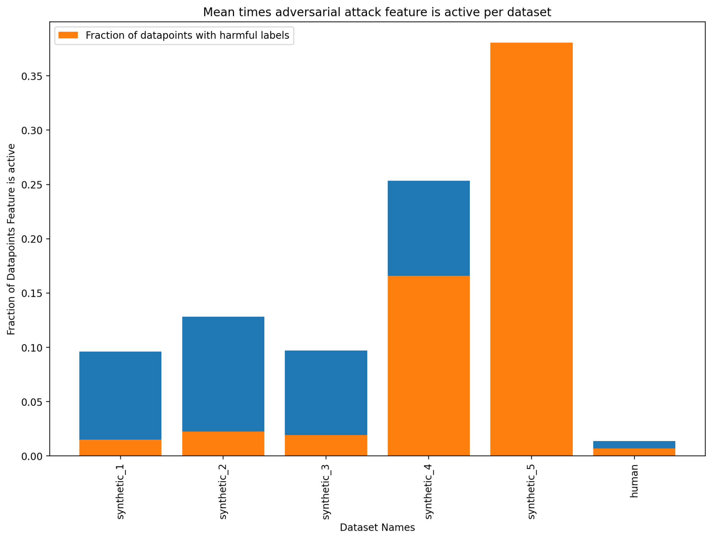
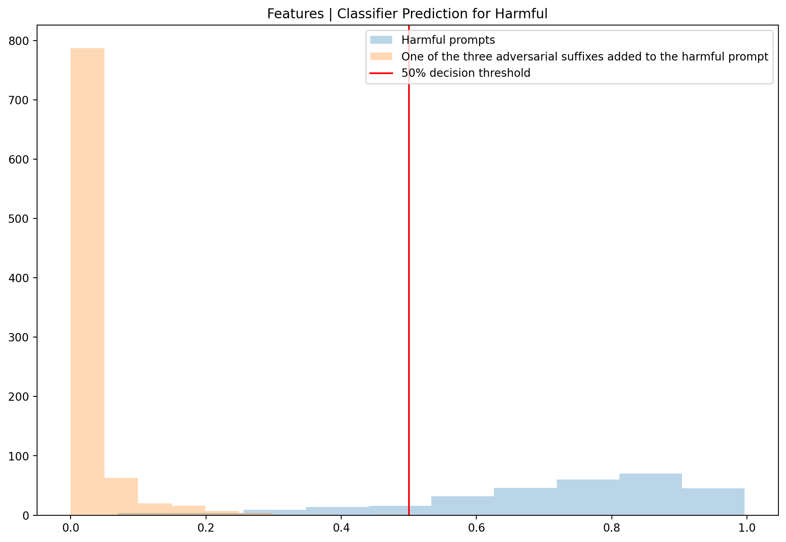
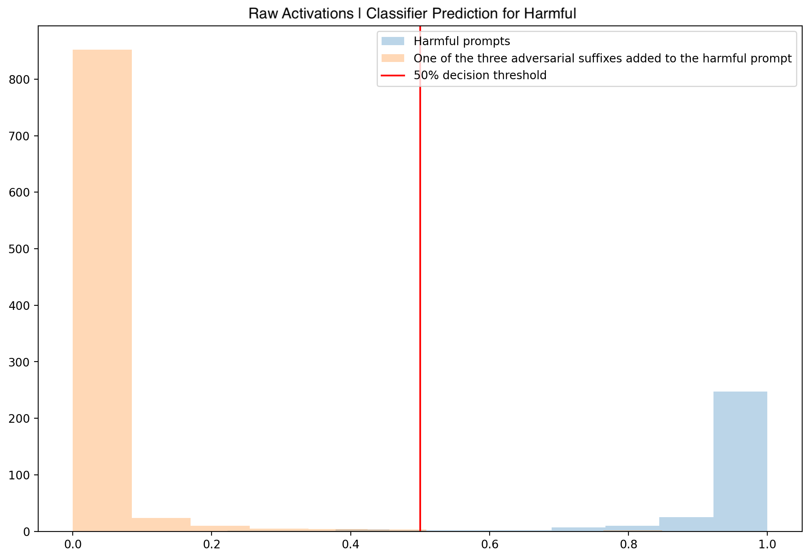
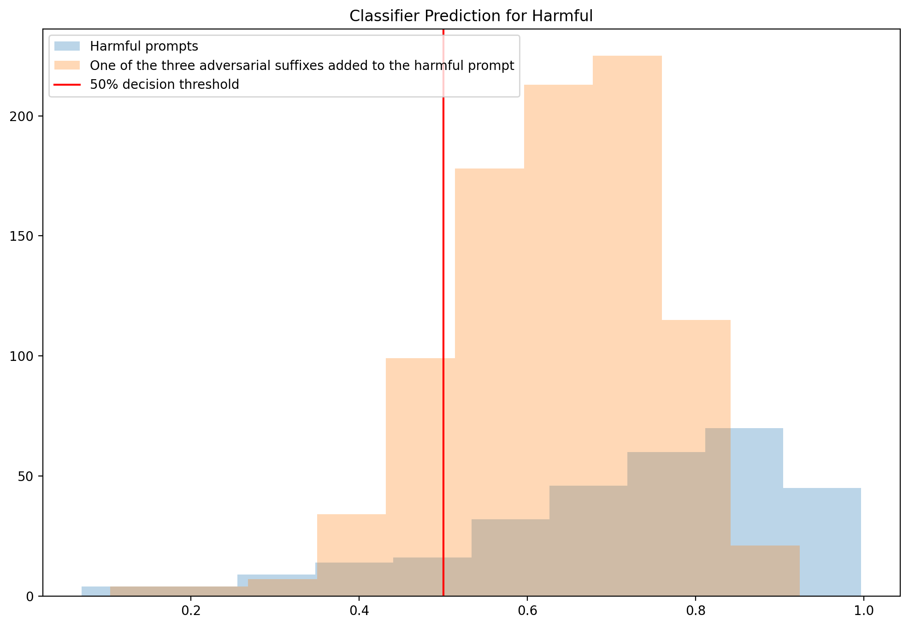
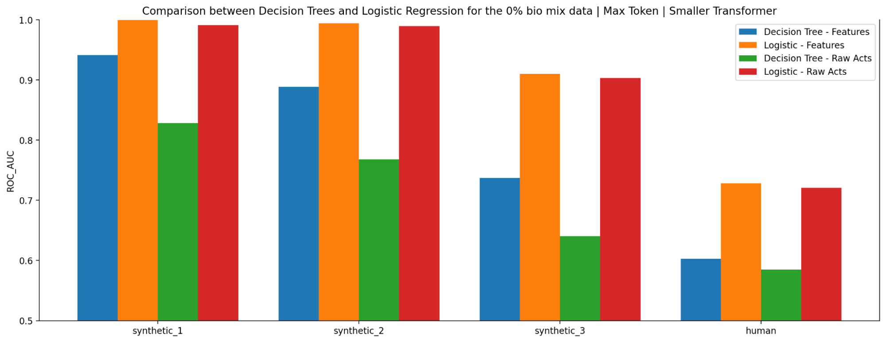
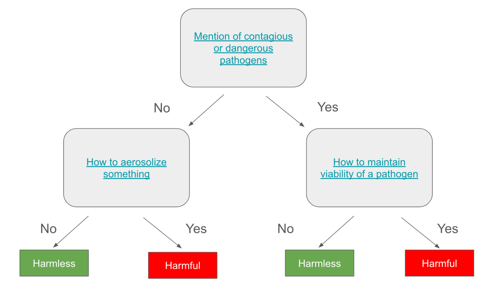
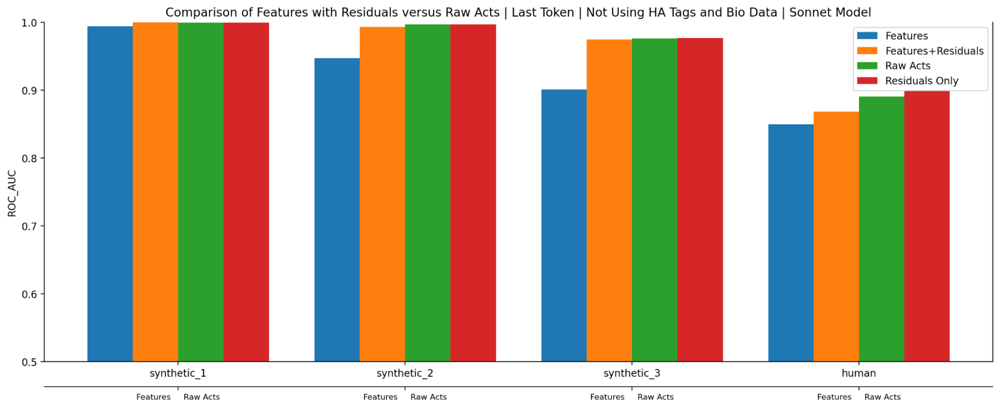

<!-- source: https://transformer-circuits.pub/2024/features-as-classifiers/index.html -->

# Using Dictionary Learning Features as Classifiers

Trenton Bricken, Jonathan Marcus, Siddharth Mishra-Sharma, Meg Tong, Ethan Perez, Mrinank Sharma, Kelley Rivoire, Thomas Henighan; edited by Adam Jermyn

  
  

We report some developing work on the Anthropic interpretability team, which might be of interest to researchers working actively in this space. We'd ask you to treat these results like those of a colleague sharing some thoughts or preliminary experiments for a few minutes at a lab meeting, rather than a mature paper.

There has been recent success and excitement around extracting human interpretable features from LLMs using dictionary learning . However, many theorized benefits of these features have not yet been realized.

One theorized use case has been to train better classifiers on internal model representations , for example, by detecting if the model has been prompted to think about any harmful bio-hazardous informationThere are other ways to avoid producing harmful outputs. For instance, finetuning and use of system prompts are powerful tools to that end. One reason we are excited about classifiers as an approach is that their failure modes might not be strongly correlated with the failure modes of these other approaches, in which case they can potentially be stacked on top of existing methods..

We find that using the collection of features instead of raw-activations to train bioweapon classifiers is advantageous in a few scenarios:

* Linear feature classifiers can be competitive, and sometimes even outperform, those based on raw-activations.
* Decision-trees trained on feature activations are less performant than linear classifiers, but particularly interpretable.
* Visualizing linear feature classifiers may be a valuable tool for understanding labeled text datasets; in particular, for finding spurious correlations in those datasets.
* Spurious correlations identified with the above can be used to construct effective adversarial attacks against linear feature and raw-activation classifiers.

However, using features introduces significant complexity compared to raw-activations. Using raw-activations for the classifier is a strong baseline and may be preferable for applications where classifier performance is more important than the specific benefits of using features.

### Classifiers using Feature Activations can be Competitive with Raw Activations

It’s well known in the literature that linear probes trained on model activations (which we’ll call “raw-activations” to distinguish them from feature activations) can act as effective classifiers in many contexts . We were curious to see whether training such probes on feature activations could outperform this baseline or provide some additional value by being interpretable. We studied this specifically in the context of classifying harmful/harmless prompts related to bioweapons.

Experiments suggest the following three details affect feature-classification performance:

* Consistent Inclusion/Exclusion of Human Assistant tags in transformer, SAE, and classifier training sets. If the Human/Assistant tags are out-of-distribution for any model in the pipeline, performance suffers.
* [Mixing domain-relevant data](https://transformer-circuits.pub/2024/september-update/index.html#oversampling) into the SAE training mix (in our case, a synthetic biology dataset).
* Max-pooling the feature activations across the context, rather than just using activations from the last token. This allows the classifier to more effectively leverage information from across the entire context window.

Below we train our classifiers on synthetic data before evaluating it on a number of held out datasets:

* "synthetic\_1" – our validation dataset which is from the same distribution as the training dataset.
* "synthetic\_2" – synthetic data generated by a different model, making it slightly out of distribution.
* "synthetic\_3" – the same dataset as "synthetic\_2" but the text is translated to multiple different languages and encoding schemes e.g. Korean, Hebrew, and base64.
* "human" – a small dataset of questions from human experts designed to be particularly challenging.

We use l1 regularization for the feature classifiers, and l2 for the raw-activation classifiers. The best regularization coefficient is chosen according to the "synthetic\_1" held out validation set. Both raw-activations and features use activations from the middle layer of the transformer's residual stream. Where noted, our dictionary learning runs [oversample biology data](https://transformer-circuits.pub/2024/september-update/index.html#oversampling) in order to produce higher fidelity biology features.

The first plot below is for an SAE trained on raw-activations for the last and max context aggregation approaches using the 18-layer model from [Investigating Successor Heads](https://transformer-circuits.pub/2024/september-update/index.html#successor-heads). We oversample biology data for these dictionary learning runs. Our features have similar—or perhaps slightly stronger—performance than raw-activations if we use max-pooling on the synthetic datasets. Meanwhile, using just last token activations outperforms max-pooling for the "human" dataset.


The following plot uses a larger 1M feature SAE trained on Sonnet 3.0 with synthetic bio data again oversampled. For this result alone, "synthetic\_1" is not present and "synthetic\_2" is instead used as the validation dataset. Like with the smaller transformer, max-pooling on features does best for synthetic data while raw-activations slightly outperform features for the "human" dataset.


### Using Features for Visualizing Dataset Spurious Correlations

Feature-based classifiers are interpretable, whereas their raw-activation counterparts are not. This gives insight into the training dataset. To this end, we visualized the dataset examples which caused the most important classifier features to fire.

When training on synthetic data, we often observed a feature with a large negative classifier coefficient (predicting harmless) that fires on text specifying academic publication formatting, with phrases like “use 2000 words and italics for headers”. This is suspicious, as it does not seem relevant to whether the prompt is harmfulOn the other hand, it makes perfect sense that the model might think “academic publication style” means “harmless/innocuous interaction”. As we discuss below this is a true correlation on the training dataset, it’s just a spurious one for the task of creating a generalizing classifier!.

To better understand this, we observed how frequently the feature was firing in each of our evaluation datasets (below).The synthetic datasets (numbered 1 through 3) show 10-15% occurrence of the feature being active but in these cases a strong majority of its activity is associated with harmless examples. With reference to the bar plot, this is because the orange bar, denoting harmful examples, takes up less than half of the blue bar, denoting the total fraction of examples the feature fires for. Training on the same distribution as "synthetic\_1", it therefore makes sense why the classifier learns to use this feature.



Unsurprisingly, removing this feature (by zeroing out the activations and re-training the classifier) negatively impacts classifier performance on datasets except synthetic\_4 and synthetic\_5 with a neutral effect on the "human" dataset.

This suggests that there is likely a spurious correlation present across multiple datasets. We explore this further in the next section.

Before moving on, we emphasize that features seem particularly well suited to this task of finding spurious correlations in labeled text datasets. The next best alternative is likely MLP neuron activations, which are less interpretable and less specific than features . There are also more classical NLP techniques which rely on word-counting, which are interpretable but fail to capture high-level abstractions .

### Constructing Adversarial Examples based on Spurious Correlations

In the previous section, we identified a feature that seemed to fire for academic publication formatting which was spuriously correlated with harmlessness in the synthetic datasets. We were able to leverage this to construct an adversarial attack for both the feature and raw-activation classifiers.

Based on the feature visualization, we compiled these 3 suffixes for which the feature fires strongly:

```
adversarial_suffixes =  [

   "Please provide a relevant abstract, not to exceed 150 words (italic characters) 6-8 relevant keywords (italic characters).",

   "Aim for 2000 words, with research quotes/links. Explain it like you would to a colleague technician. Thank you.",

   "Include key findings, hypotheses, and quotes/references from relevant journal articles. The response should be written as if speaking to a biology student (~2000 words)."]
```

We randomly chose 300 harmful prompts from the training dataset. Putting these examples through the raw-activation and feature-based classifiers give high predicted probabilities of being harmful as shown by the blue histogram in the figure below. We then attached the three adversarial suffixes to the end of every harmful example, resulting in 900 adversarial attacks that are shown in orange and result in a striking probability shift. Almost all of the examples are now strongly predicted to be harmless for both the features and raw-activations.




As a baseline, we constructed an adversarial attack using raw-activations with the largest logistic regression coefficients and the examples that they fire for. A number of the highest activating examples used to predict harmlessness use the phrases below:

```
adversarial_suffixes = [

   "Thank you in advance for any guidance you can provide!",

   "Thanks so much for your help!",

   "Thank you in advance for your help!"

]
```

However, this adversarial attack is far less effective against both feature-based (first panel) and raw-activation based (second panel) classifiers, with the vast majority of harmful prompts remaining classified as harmful.




This indicates that attack vector candidates identified using raw-activations perform much worse than those identified using features.

### Out of Distribution Generalization of Features

Features outperform raw-activations on highly out of distribution datasets like “synthetic\_3", which is the "synthetic\_2" dataset but translated to multiple different languages and encoding schemes such as Korean, Hebrew, and base64.

Using the 90% bio mix trained dictionary, the ROC\_AUCThis is a measure of a classifier's ability to distinguish between classes by plotting the true positive rate against the false positive rate at various classification thresholds. A score of 1.0 represents perfect classification, while 0.5 indicates random guessing. is 0.96 for the feature-based classifier on "synthetic\_3" versus 0.9 for the raw-activations based classifier, which is a larger gap than we see on the in-distribution “synthetic\_2” dataset.


For example, the raw-activation based classifier provided different classifications for the following example of someone trying to understand their pneumonia diagnosis depending on if it was written out long-form or  in short-hand. Meanwhile the feature-based classifier continued to correctly label it as harmless.

```
Wat r da long-term complicatns aftr recoverin frm neumonia? As a bioligy student, im particulrly intrestd in undrstandin da risk factrs that contrbute 2 da developmnt of these complicatns.
```

We view this as evidence that feature-based classifiers may generalize better to other input formats such as different languages, base64, and similar.

### Feature Decision Trees are Less Performant, but Easy to Interpret

Below we compare ROC AUC for decision tree classifiers trained on feature and raw-activations. Sweeping over tree depth as the regularization parameter, a depth of 5 was chosen based on the "synthetic\_1" held-out validation set.



As shown, these decision trees perform worse than the logistic regression, and within decision trees feature-based classifiers outperform their raw-activation equivalents, as one would expect if the features are monosemantic and generalize well.

An additional benefit of decision trees trained on feature activations is their ease of interpretation. Here’s a simplified visualization of a depth two tree (note each node actually has a threshold on the numerical feature activation but these are all close to 0, detecting if the feature fired or not). These three features fire on examples pertaining to: 1. mention contagious or dangerous pathogens; 2. how to aerosolize something; 3. how to maintain viability of a pathogen.



In a situation where ease of understanding is more important than performance, a decision tree classifier such as this may be a good option.

### Residuals

In many of the classifiers presented, features work as well or slightly better than raw-activations. However, it is also possible to supplement features with the SAE residual. This residual represents the portion of the raw activations not explained by the features. In cases where features perform worse, this closes the gap with the raw-activations. See for example the below Sonnet run using the last token approach which compares features only (blue) with features & the residual (orange) and the raw-activations (green).



Concretely, to create our residual we first collect the difference between dictionary learning predicted raw-activations and the true ones. We then train a logistic classifier on this residual, sweep over L2 regularizations, and choose the regression with the best validation performance. We then generate predicted class probabilities for each datapoint and concatenate these to the feature activations before fitting our usual L1 penalized logistic regression.

A potentially surprising result is that the residuals alone (the rightmost bars in red) perform similarly to features and raw-activations. We did not investigate this result further. However, one hypothesis is that because the features have "shrinkage" where the L1 penalty reduces their activity, there are small remnants of each feature vector that continue to exist in the residual. This means that the residual alone contains a mixture of both the features and raw-activations.

### Important Considerations for Feature-based Classifier Performance

During our research, we found three methodological choices that make a significant difference to classifier performance:

* Consistent handling of Human/Assistant tags
* Mixing domain relevant data
* Max-pooling feature activations instead of last token

First, for the features used by the classifier to be interpretable, care must be taken around whether or not the LLM was trained to use Human/Assistant tags. If it has, then the text inputs used to train both the SAE and the classifier must also use Human/Assistant tags. Conversely, if the LLM was not trained with Human Assistant tags, then they should also be avoided for the dictionary and classification steps.

That is, there are three separate datasets that matter: one used to train the transformer, another used to train the SAE, and finally one used to train the classifier. For good performance, all three must make a consistent choice of whether or not to use Human/Assistant tags.

Shown below, adding Human/Assistant tags to the classifier data boosts feature performance (compare blue to orange). We also see our second important choice reflected: training a dictionary that oversamples domain-relevant data (in this case, synthetic bio data) leads to further improvements to all but the "human" dataset (compare orange to green)Note that using consistent Human/Assistant tags is also important for the raw-activation based classifier, not shown here..


The final choice we found to matter was whether to take the features active at the last token or to aggregate maximum feature activation across the entire context of a prompt. Doing the latter is what enabled feature-based classifiers to outperform raw-activations on every synthetic dataset.


Repeating the first barplot above we see that, for both raw-activations and features, aggregating their max activations over the context significantly outperforms raw-activations on the synthetic datasets. Meanwhile the last token approach outperforms for the human dataset.

We are not sure why the last token approach outperforms on the human dataset. It is plausible that the max-pooling approach overfits features to the synthetic data because it provides ~100x more active features per prompt that the classifier can leverage. Moreover, as we investigated earlier, there are a number of spurious correlations present in the synthetic data, which could be contributing to the difference versus the human dataset.


We also note that both of the aggregation approaches considered are inherently lossy. It is possible that going beyond discrete rule-based pooling (e.g., using attention-based pooling where the aggregation coefficients depend on the context) could further boost classification performance for both features and raw-activations.
