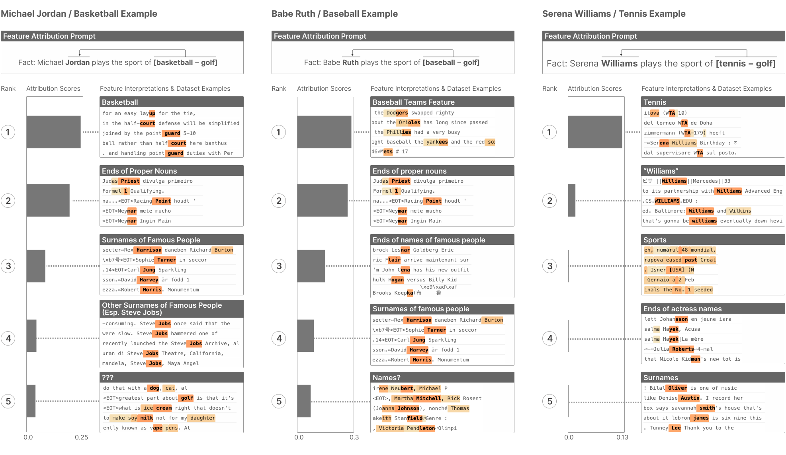

<!-- source: https://transformer-circuits.pub/2024/march-update/index.html -->

# Circuits Updates - March 2024

  
  

We report a number of developing ideas on the Anthropic interpretability team, which might be of interest to researchers working actively in this space. Some of these are emerging strands of research where we expect to publish more on in the coming months. Others are minor points we wish to share, since we're unlikely to ever write a paper about them.

We'd ask you to treat these results like those of a colleague sharing some thoughts or preliminary experiments for a few minutes at a lab meeting, rather than a mature paper.

New Posts

* [Using Features For Fast Circuit Identification](#feature-heads)
* [Update on Dictionary Learning Improvements](#dl-update)

Updates

* [Research By Other Groups](#external-research)

  
  
  

  
  

## [Using Features For Easy Circuit Identification](#feature-heads)

Joshua Batson, Brian Chen, Andy Jones

Finding circuits in language models can be a labor-intensive process. You specify a behavior of interest, such as [indirect-object identification](https://arxiv.org/abs/2211.00593), [inequality identification](https://arxiv.org/abs/2305.00586), or [factual association](https://arxiv.org/abs/2202.05262), then assemble a dataset with hundreds or thousands of examples of that behavior. To find model components which are important for a prediction, you ablate or patch them in turn on each example. This produces a list of components, and further investigations can reveal their interactions on the assembled dataset.

Features produced by sparse autoencoders (SAEs) offer an alternative to behavior-specific dataset curation. Key aspects of the full data distribution, as processed by the model, are encapsulated in the dictionary. This allows us to generate rich hypotheses from a single example text, and to study the more general function of the revealed components in terms of other features they interact with.

We illustrate this approach by investigating the attribute-extraction process following [Nanda et al.](https://www.alignmentforum.org/posts/iGuwZTHWb6DFY3sKB/fact-finding-attempting-to-reverse-engineer-factual-recall#Our_High_Level_Takeaways) (see also [Geva et al.](https://arxiv.org/abs/2304.14767), [Meng et al.](https://arxiv.org/abs/2202.05262)). The authors studied completions of the sentence "Fact: [ATHLETE NAME] plays the sport of" for a collection of ~1500 [ATHLETE NAME]s playing basketball, baseball, or tennis. The authors found three distinct phases:

* token\_concatenation in which information from all tokens of [ATHLETE NAME] are moved to the final token of the subject
* subject\_enrichment (in the language of Geva et al.) in which early MLP layers add information to the residual stream for the final subject token.
* extract\_sport in which attention heads (primarily one specific head) selects the sport information from the final subject token and transmits it to the final token. Composing the OV circuit of the specific head with the unembedding matrix even produces a mechanistic probe for sport.

We investigate an 18-layer model, with a sparse autoencoder with expansion factor of ~256 trained on the layer 9 residual stream (as in [Cunningham et al.](https://arxiv.org/abs/2309.08600)).

### Detecting Important Features with Attribution

The first step of our investigation was determining which features are driving the behavior in our task. We automatically identify basketball, baseball, and tennis features in the residual stream, learned by our SAE, which seem to play a key role.

We begin with the example text "Fact: Michael Jordan plays the sport of", and compute an attribution score for each autoencoder feature in the layer 9 residual stream at the position [ Jordan] with respect to the logit difference between completions of [ basketball] and [ golf]:

\text{attr}\_i := a\_i \mathbf{d\_i} \cdot \nabla\_{x} \mathcal{L},

where a\_i is the activation of feature i, \mathbf{d}\_i is the dictionary (decoder) vector for feature i in the SAE, and \nabla\_{x} \mathcal{L} is the gradient of the logit difference between [ basketball] and [ golf] on the prediction of the final token with respect to the residual stream on the token [ Jordan] in layer 9 where the SAE is defined. (We use the logit difference between two sports to identify the features that produce basketball specifically, and avoid those which might produce all sports in general.)

There is a clear top feature by attribution. The top-activating dataset examples (from a feature visualization precomputed on the training mix) include basketball-related words such as "layup", "half-court", and "point guard". Since each feature's activation is a thresholded affine function on the residual stream \text{relu}(E\_i x+b\_i) (where E\_i is that feature’s vector in the encoder and b\_i is that feature’s bias), we have from a single example isolated a basketball-related probe (E\_ix + b\_i > 0). This also indicates that the subject\_enrichment phase has progressed by layer 9, such that information about the sport is present in the token.

We repeat this analysis for "Babe Ruth" for baseball and "Serena Williams" for tennis, finding in each case the top feature by attribution fired on baseball ("Dodgers", "Orioles", "yankees") and tennis ("WTA")-related texts.

We note a number of features that respond to ends of names or surnames ("Judas Priest" in one, "John Cena" in another, "Carl Jung" in a third) which have significant attribution for "Jordan" and "Ruth" but not "Williams". We hypothesized that this might be due to the model having learned to associate "tennis" with the first name "Serena", but with full names for "Michael Jordan" and "Babe Ruth". We took a handful of athlete names, and asked the model for completions of "Fact: [ATHLETE FIRSTNAME] Smith plays the sport of"; we found that the model's predictions matched that for [ATHLETE NAME] in exactly the cases where the "Judas Priest" feature had low attribution on the original text, and that the predictions were damaged in the cases where the "Judas Priest" feature had high attribution on the original text. The presence and effects of this feature provides additional evidence that the model “detokenizes” its input in early layers.

### Detecting Attention Heads that Act on Features

We then looked for attention heads who produced a large direct logit effect from the basketball feature (i.e., the difference in the [basketball] and [golf] entries of U\operatorname{norm}(OV\mathbf{d\_i}) is large). We found many such heads, across many layers, with the top five heads belonging to layers 11, 13, and 14. The top logit effects of each head are basketball-related ("basket", "NBA"). Moreover, the same set of heads produces baseball-related words on the baseball feature and tennis-related words on the top tennis feature. This parallels the discovery of a special head in Nanda et al. which acted as a probe for sport, as well as the more recent identification of many "Subject Heads" in [Chughtai et al.](https://arxiv.org/abs/2402.07321), which found that many heads were involved in extracting attributes from the subject in factual recall, producing the correct output via constructive interference.

We hope this exercise demonstrates the utility of using SAEs to kickstart circuit analysis.

  
  
  

  
  

## [Update on Dictionary Learning Improvements](#dl-update)

Adly Templeton, Tom Conerly, Jonathan Marcus, and Tom Henighan

In previous updates, we’ve mentioned a number of interventions which we found to be meaningful improvements to SAE optimization at the time. Since then, we have made a number of other changes, including bug fixes. These changes have improved optimization and decreased our training losses. With these changes we no longer see meaningful improvements from the following interventions.

* Ghost Grads. We no longer see ghost grads decreasing training loss even on 1L models. The training loss is roughly equal, which doesn’t justify the increase in flops. We have some evidence our implementation of ghost grads causes loss spikes in our current training setup. (From [January](https://transformer-circuits.pub/2024/jan-update/index.html#dict-learning-resampling) and [February](https://transformer-circuits.pub/2024/feb-update/index.html#dict-learning-resampling) updates)
* Setting Adam Beta parameters to (0, 0.9999) versus the default values of (0.9, 0.999) leads to similar training loss. (From [February](https://transformer-circuits.pub/2024/feb-update/index.html#dict-learning-loss) update)
* Pruning features which have a decoder norm < 0.99. Other changes have led to much fewer features which are dead or have decoder norm < 0.99, such that this is no longer a meaningful improvement. (From [February](https://transformer-circuits.pub/2024/feb-update/index.html#dict-learning-loss) update)

While these were improvements to the training process we used at the time, other changes have superseded them. We intend to publish these changes in a future update once we’ve vetted them further.

  
  
  

  
  

## [Research By Other Groups](#external-research)

Joshua Batson, Nicholas L Turner, Brian Chen, and Adam Pearce

Finally, we'd like to highlight a selection of recent work by a number of researchers at other groups which we believe will be of interest to you if you find our papers interesting.

#### [Othello and Automata](#external-othello)

In ["Dictionary Learning Improves Patch-Free Circuit Discovery in Mechanistic Interpretability: A Case Study on Othello-GPT"](https://arxiv.org/abs/2402.12201), He, Ge, Tang, Sun, Cheng, and Qiu use sparse autoencoders as a tool to investigate circuits in a model trained to play legal games of Othello (see [Li et al.](https://arxiv.org/abs/2210.13382)). They train separate SAEs on word embeddings, MLP outputs, and attention outputs, and find features corresponding to specific states for cells (current move, current state, legal to move in) as one moves through the layers. They identify these features using a visualization toolkit which may be useful for other people working on Othello. They then ask how, on specific dataset examples, the features in later layers are computed as functions of features in earlier layers by multiplying through attention OV and MLP weights (with a fixed gating mask). For example, an MLP output feature in layer 1 that generally corresponds to cell c-3 being "mine" is computed on a specific example where it gets flipped as an AND of three attentional features – d-2 "mine", c-2 "theirs", and b-4 "current" – which are in turn OV outputs of embedding features corresponding to each original move. They also decompose attention scores in terms of features, and find mechanisms supporting heads that exclusively attend to "mine" and "theirs" moves.

As the authors note, the L0-norm of feature activations is quite large (means of ~60–100 for the different SAEs with d\_model of 128), with near-zero reconstruction error. In our experience, such dictionaries tend to be polysemantic in lower activations. We would also be curious to see the feature interpretations investigated using the activation specificity/sensitivity analysis in [Bricken et al.](https://transformer-circuits.pub/2023/monosemantic-features/index.html#feature-arabic) It would also be interesting to see followup work with sparser dictionaries, which might make the circuit analyses crisper and more explanatory with respect to ablations.

Othello may also prove to be a useful laboratory for investigating the more general class of highly parallel algorithms implemented by transformers. The naive algorithm for finding legal moves of Othello takes N steps of sequential computation to determine the board state after N moves; simply play the game, flipping stones after each move. However, an L-layer transformer only allows for ~2L sequential calculations. For games with N > 2L, well-performing transformers must have learned a different algorithm. A similar phenomenon was explored in detail last year in [Transformers Learn Shortcuts to Automata](https://arxiv.org/abs/2210.10749) by Liu, Ash, Goel, Krishnamurthy, and Zhang, who found that "a low-depth Transformer can represent the computations of any finite-state automaton (thus, any bounded-memory algorithm), by hierarchically reparameterizing its recurrent dynamics." They construct transformers with width polynomial in the number of automaton states T and depth O(log(T)) in general. They find solutions with depth O(1) often exist, and show that these shortcut solutions can be learned in practice. In recent related work, [Transformers, parallel computation, and logarithmic depth](https://arxiv.org/abs/2402.09268), Sanford, Hsu, and Telgarsky, showed that k-hop induction tasks, which naively require k sequential iterations of the induction mechanism, can be implemented by transformers of depth log(k). It would be quite interesting to see a feature-based analysis like He et al. applied to automata, and, conversely, to identify the shortcut strategies being learned by Othello transformers.

#### [Computation in Superposition](#external-computation-in-superposition)

["Towards a Mathematical Framework of Computation in Superposition"](https://www.lesswrong.com/posts/2roZtSr5TGmLjXMnT/toward-a-mathematical-framework-for-computation-in) describes a set of asymptotically optimal constructions of transformer layers that implement many-to-many boolean functions of sparse inputs. In their setting, each input variable x\_i is assigned an embedding vector v\_i in the residual stream, the full boolean state is represented as a sum of the vectors corresponding to True variables: \sum\_i x\_i v\_i, and the output of the transformer is transformed back into a boolean vector by multiplication by an unembedding U f(x) and then rounding to 0/1.

Their MLP constructions provide an explanation for the empirical result that arbitrary XORs of input features can be read off from residual stream representations. They also suggest an interpretation of attention circuits as counting “skip feature bigrams” which motivates one of their constructions. Some notable results are highlighted below. The engines of these proofs are (1) the fact that random unit vectors in high-dimensions have inner product of order 1/\sqrt{d} and (2) distortion bounds à la Johnson-Lindenstrauss.

* When boolean features are not stored in superposition, a single MLP layer using the U-AND construction can produce an output where all pairwise ANDs of all boolean input variables can be linearly read out with a small error (!)
* When those features are stored in superposition, a similar construction can compute a number of ANDs asymptotically close to the number of weight parameters assuming that the input features are sufficiently sparse.
* An MLP layer construction can compute all ANDs with a fan-in of k (also with input feature sparsity).
* An MLP layer construction using a quadratic nonlinearity (instead of ReLU) can compute a number of ANDs that’s superpolynomial (!) in the number of MLP units
* When skip feature bigrams are in superposition, a QK construction can compare counts between a number of these asymptotically close to the number of weight parameters. This performs half of the function of the attention layer. They leave representing skip feature trigrams (including the outputs) as future work.

In line with the setting above, the authors say a property is “linearly represented” in the residual stream at a certain point if it is linearly accessible up to an additive error. That is, some boolean function f(x)  is represented in some vector z(x) if there exists a covector v\_f^T such that v\_f^Tz(x) = f(x) \pm \epsilon on all (k-sparse) inputs. It is possible for two vectors z and z^\prime to share many properties without being close in an L^2 or MSE sense, and it is this gap that allows for many of the above constructions. Roughly speaking, L^2-closeness constrains expressivity on the order of the number of neurons or the dimension of the model, and this notion constrains expressivity on the order of the number of parameters over the logarithm of the number of properties. This is the information theoretic limit up to a multiplicative constant, as the number of bits in a model is proportional to its parameter count and a table storing properties for entities requires the logarithm of the number of properties bits per property per entity.

Because these constructions are information theoretically tight, they are the kind of thing transformers might actually learn. As the authors note, dictionary learning approaches to untangling such solutions on the residual stream might benefit from using a thresholding activation function (rounding interference to 0), which is a stronger constraint than a ReLU activation function (which allows for significant negative interference).

#### [Improvements to Attribution Patching](#external-attribution-patching)

Activation patching (see e.g. [Zhang & Nanda, 2023](https://arxiv.org/abs/2309.16042)) is a common method for finding the components of an LLM that contribute to a behavior of interest. Briefly, one runs a forward pass of the LLM on some prompt with an expected answer (e.g. “The Eiffel Tower is in the city of” should produce “Paris”), modifies the activation of some component, and then reruns the remainder of that forward pass. Typically, the modified activation is copied from a forward pass on a different prompt. If the new forward pass no longer gives the expected answer, then the component is partially responsible for the original behavior. Although this method is conceptually simple and persuasive, it is expensive; if we want to find one out of 1,000 neurons contributing to some behavior, we would need to run 1,000 forward passes.

[Attribution patching](https://www.neelnanda.io/mechanistic-interpretability/attribution-patching) (see also [Syed et al., 2023](https://arxiv.org/abs/2310.10348)) is an efficient approximation to activation patching using gradients. It can be thought of as activation patching where the remainder of the forward pass is replaced with a linear approximation from a backwards pass. With attribution patching, we can examine the approximate influence of any component after just one forward and one backward pass. Unfortunately, the approximation isn’t always accurate.

In [“AtP\*: An efficient and scalable method for localizing LLM](https://arxiv.org/abs/2403.00745) [behaviour](https://arxiv.org/abs/2403.00745)[to components”](https://arxiv.org/abs/2403.00745), Kramár, Lieberum, Shah, and Nanda investigate failure modes of attribution patching, and develop two fixes that improve its accuracy without losing too much efficiency.

* The first failure mode involves nonlinearities immediately following the modified activation, whose gradients almost vanish near the original prompt. The paper focuses on the softmax in attention, and demonstrates that running the forward pass with the modified activations past the softmax and then taking the gradients from afterwards improves the approximation considerably.

* Since this involves running part of a forward pass through attention for each modified activation, it is much more expensive than naive attribution patching, but still much cheaper than a full forward pass for each modification.
* This general failure mode also showed up in some of our internal experiments using attribution patching in 1L models, where we found that LayerNorm saturation also caused approximation failures.

* The second failure mode involves cancellation between direct and indirect effects. The paper works around this by running one backwards pass per layer, skipping that layer when computing gradients, and then averaging the effects across the passes.

They validate their improvements by comparing their approximations to nodes' influences with the "ground truth" of activation patching, on Pythia-12B. They also demonstrate that attribution patching is more efficient than some other clever ways of approximating activation patching.

This paper – and the attribution patching strategy in general – is relevant to anybody who wants to do circuit finding at scale.

#### [Self-Repair and LayerNorm](#external-self-repair)

Besides computation costs, measuring the effect of a component through ablation is tricky; a later component may "self-repair" the impact of an ablation and leave the model output mostly unchanged. In [Explorations of Self-Repair in Language Models](https://arxiv.org/abs/2402.15390), Rushing and Nanda quantify self-repair by measuring the difference between ablating an attention head and the direct effect of what the head writes out to the residual stream on the logit of the next token in pretraining data.

Surprisingly, they find that the non-linearity in LayerNorm explains ~30% of the self-repair that occurs in the 2% of tokens with the highest direct effect. Multiple components of the model push to predict the same token so ablating just one of them reduces the norm of the residual stream while largely preserving its direction. This lowers the LayerNorm scaling factor, increasing the logits from the other components and counteracting some of the impact of ablation.

[McGrath et al](https://arxiv.org/abs/2307.15771) speculated that self-repair might make the model more robust during training while [McDougall et al](https://arxiv.org/abs/2310.04625) identified "copy suppression heads" that reduced model overconfidence in a way that shows up as self-repair when ablating earlier copying heads. These results suggest that at least some of the self-repair phenomenon is a byproduct of LayerNorm, which may be useful for other reasons, not a behavior which received direct optimization pressure.
