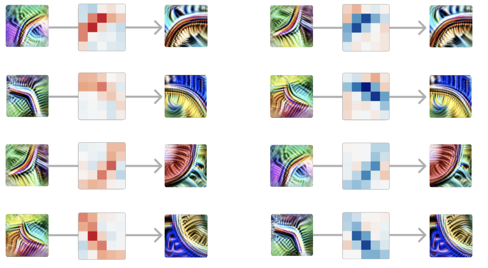

<!-- source: https://transformer-circuits.pub/2024/qualitative-essay/index.html -->

# Reflections on Qualitative Research

  
  

Chris Olah, Adam Jermyn

This note offers some opinionated thoughts on why interpretability research may have qualitative aspects be more central than we're used to in other fields. It also aims to describe some heuristics for research taste in qualitative work.

  

  

Early scientific fields are often quite qualitative and become more quantitative as they mature. For example, discovering cells is a qualitative result, which can then mature (over many decades) into quantitative tools like counting white blood cells in cancer research. Discovering chemical spectral lines was a qualitative result, which only really became quantitative when Bohr realized that the "butterfly wings of atoms" gave insight into electron orbitals.

The vast majority of researchers are trained in mature disciplines, because genuinely new scientific fields are rare. These mature disciplines have established paradigms, with established quantitative measures and methods. But interpretability is not a mature field. It doesn't have an established paradigm. Even the most basic abstractions (does it make sense to think of a model in terms of "features"?) are up for debate.

There's a risk that our training from mature fields may give us the wrong instincts if we translate them into such an early, messy, unestablished science. In particular, we should expect to need to be guided a lot more by qualitative results.

To be clear, this isn't saying we should not do quantitative research when appropriate! And in fact, often these can be synergistic, with qualitative research helping us be confident we're using the right quantitative tools. (The line between them can also be blurry!) Rather, the goal of this note is simply to argue that qualitative results should genuinely be seen as first class citizens, and something we want to keep returning to as a touchstone to avoid becoming lost or fooling ourselves.

### [Summary Statistics and Their Dangers](#summary-stats)

[Anscombe's Quartet](https://en.wikipedia.org/wiki/Anscombe%27s_quartet) is a famous example of how several radically different datasets can have the same mean, standard deviation, and correlation:

[Anscombe's Quartet](https://en.wikipedia.org/wiki/Anscombe%27s_quartet) ([image source](https://en.wikipedia.org/wiki/Anscombe%27s_quartet#/media/File:Anscombe's_quartet_3.svg))

This reflects a more general lesson: summary statistics which boil rich high dimensional data into a single number will always blind you to most of what's going on. And so, you need to be very careful when you do so. And in particular, you need to be very careful that you know and trust what you're measuring if you're going to rely on it.

In established fields, there may be standard measurements and quantitative values that are very well understood – in what they mean, in how to think about them, and so on. But in interpretability we don't have that benefit.

A pattern we see in some interpretability and interpretability-adjacent ML papers is defining some metric which is claimed to correspond to some property of interest, and then very rigorously measuring this metric. We see this as a kind of [Cargo-Cult Science](https://calteches.library.caltech.edu/51/2/CargoCult.htm). It can seem very rigorous with lots of line plots with standard deviation bars and such. But it often isn't, because the critical weakness is whether the metric actually, reliably tracks the property of interest, not the rigor with which the metric is evaluated. A recent example of this in our own work was our study of [tanh-regularization in dictionary learning](https://transformer-circuits.pub/2024/feb-update/index.html#dict-learning-tanh), where summary statistics initially indicated a lot of promise and it was only later qualitative inspection of features that revealed that we had been led astray.

We suspect that often, in early stage scientific fields like interpretability, rigor involves much more qualitative work, with quantitative metrics growing out of that and initially being treated quite skeptically.

#### [For Want of Constrained Hypothesis Space](#constrained-hypothesis)

One of the reasons mature fields can rely so much on summary statistics is that they have a constrained hypothesis space.

Consider how mature fields often frame experiments as testing one hypothesis against another. For instance, a gravitational wave experiment might be set up to test General Relativity against Chern-Simons gravity. This makes sense when the hypothesis space is narrow and well-understood, where the bulk of the probability mass truly is on the few hypotheses being tested. In these cases it's often relatively straightforward to come up with a single measure that should be different between two hypotheses!

But in pre-paradigmatic fields we don’t know what hypotheses to consider! A physicist in the 1800s coming up with explanations for energy production in the Sun would have entirely missed nuclear physics.

So the goal of science in pre-paradigmatic fields is to first figure out what hypotheses we should be considering! And this means working in a rather different way. Whereas summary statistics can be very good for discriminating between a small number of hypotheses, individual numbers don’t provide a rich enough signal to orient us in a vast space of possibilities.

#### [Interfaces and the Lure of Summary Statistics](#lure-of-summary)

Why are summary statistics so popular? One reason involves the ecosystem of interfaces for scientific research. We don't often think of things this way, but scientific research implicitly involves interfaces for thinking about data. For example equations, line plots, and terminology are all interfaces. See Additional Reading below, and especially [Media for Thinking the Unthinkable](https://www.youtube.com/watch?v=oUaOucZRlmE) (for compelling discussion of interfaces in scientific thinking) and [Drawing Theories Apart](https://www.amazon.com/Drawing-Theories-Apart-Dispersion-Diagrams/dp/0226422674) (for discussion of "paper tool" interfaces).

<!-- yt-inline:oUaOucZRlmE -->

자막: Bret Victor - Media for Thinking the Unthinkable (39:32)

[00:00]
well this is a media lab so I thought
I'd talk about media but um I'm going to
talk about a particular kind of media
which is media for thinking in and I'm
going to talk about a particular kind of
thinking which is understanding
systems so as an example of that um say
you've got some system out in the world
such as the planets going around the Sun
you want to understand what's going on
there so you take some measurements you
look for patterns you build a
theoretical model and that's a kind of
thinking that we call science it's uh
very important kind of thinking but you
can also go in the other direction
instead of going from the system to the
theory you can start from Theory and
build your own system like a spacecraft
to take you to a planet and that's the
kind of thinking that we call
engineering but either way that you're
going whether you're going from system
to a theory or from Theory to a system
understanding the system is really at
the heart of what you're doing so both
science and engineering or everywhere in
between a lot of it comes down to
understanding systems

[00:01]
and media matter because media are
Thinking Tools right the
representations that we use of the
system are how we think about it our
representations are um how we understand
this system and what we understand about
it and so if we want powerful new ways
of understanding complex systems if we
want to build powerful new systems we
need powerful new
representations and we need a powerful
new medium in which we can create and
work with those
representations so much of the way we
work with systems today is derived from
pencil and paper from pencil and paper
medium even when we're working on the
computer we're still thinking in pencil
and paper and I think there's a
incredible opportunity now to rethink
how we think about
systems so in this talk I'm going to um
show you a bunch of different examples
of different representations of
different systems and to try to kind of
give hints as to what this new medium

[00:02]
for working with systems might be these
examples are kind of from all over
there's like programming circuit design
and Signal processing and this and that
if you're not familiar with one of these
domains doesn't matter you don't need to
know any of the technical details all
that matters is the
representations every idea I show here
can be pretty much applied to pretty
much any any
domain so I'm going to start off with
taking a look at a scientific
paper this is a um paper on network
theory that was published in nature a
little while ago very influential paper
basically started an entire field of
network Theory and it kind of looks like
a paper right you got a lot of words and
numbers and here's a figure and here's a
table and there's another figure I'm
going to read a little bit to you from
this paper from the introduction second
paragraph where they're kind of setting
things up the networks of interest to us
have many vers with sparse connections
but not so sparse of the graph is in
danger of being disconnected
specifically we require that n much
greater than K much greater than log
much greater than one one or k much

[00:03]
greater than lular a ram graph will be
connected in this regime we find that L
goes as 2K much greater than one and C
goes as 3/4 as p goes as zero and this
is
incomprehensible um and this is a very
well-written paper this the authors are
excellent writers the what we have here
is the authors have a very rich picture
in their heads and they're trying to
compress that picture to transmit over a
very low bandwidth Channel which is this
stream of numbers and symbols right so
it's a very lossy compression and we've
got the reader on the other end trying
to decompress this picture into their
own head and it doesn't work very well
so I redesigned this paper and my
redesign looks a little bit like this so
you can see words and pictures very
tightly intertwined little bit of words
a little bit of pictures I'll read a
little bit to you from this part up here
where they're establishing the algorithm
that they used to generate these
networks that they study we start with a
ring of nend vertices and here we see a

[00:04]
ring of 12 vertices where each vertex is
connected to its K nearest neighbors
here we see k = 4 four connections like
so now they're all connected we choose a
vertex and the edge to its nearest
neighbor there's the vertex there's the
edge with probability P we reconnect the
edge at random there it is reconnected
we repeat this process moving clockwise
around the ring like
so so instead of just describing the
algorithm it's depicting the state of
the system at each step so this this is
what you normally would have to
construct in your head here the picture
on your head is just
Illustrated here they're um discussing
some relationships the regular lattice L
grows linearly with n we see L growing
linearly with n we see C is staying
constant the random Network L grows
logarithmically we see L logarithmically
we see C going as a reciprocal
relationship when we read the word
logarithmic we don't have to reconstruct
that relationship in our head you can
just see it
so what I'm doing here it's it's really
just a very simple trick it's to

[00:05]
understand the picture that's in the
author's head and just reproduce that so
we're showing the state of the system
we're showing the behavior of the system
as it goes through this
algorithm in my next example I'm going
to go to a completely different domain
but I'm going to use kind of the same
trick so this next example is um an
example from circuit design so here's a
circuit that I'm working on and I'm not
done drawing it so let me finish drawing
it and that and now the circuit Works
although you can't actually see it
working you can't actually see anything
so we kind of have the same problem is
with that original paper is that the
system is doing something and we can't
see it doing anything if you were to
build the circuit on a lab bench you
could at least take an aill scope and
probe around and see what's going on at
this node what's going on at that node
so you should at least be able to do
that so here I'm showing the voltage of
that particular node and it's simulating
real time and we can see what it's doing
but you still can't understand the

[00:06]
system in order to understand the system
it's not enough to just see one variable
one voltage you have to see all the
voltages you have to see all the
variables you have to understand what's
happening here and here and here and
here and here and here and normally you
have to reconstruct that in your head
but if I spread these out a little bit
and switch to this representation now
you can see all the voltages across the
entire circuit I can scrub over them I
can see what's going on in this region I
can compare any two the one that I'm
mousing over right now it Shadow is
overlaid on all the other plots so I can
compare them I can adjust anything in
the circuit such as this resistor turn
it up or down and I see immediately how
the behavior
changes so we're a little bit further
towards understanding the behavior of
the system but still not enough we're
really only seeing half of the Behavior
now because in electronics there's both
voltage and current in order to
understand what the system is doing you
have to understand both of these things
so what I'm going to do is I'm going to
um replace each of these components here

[00:07]
such as this resistor with a plot of the
current going through that resistor so
right now each of those blue blocks
represents a component this one right
here is a resistor this one's a
capacitor you can see what it is because
they have a little badge but instead of
just being a um dead schematic symbol
now it represents behavior and so I can
um now at a glance see the entire
Behavior across the entire system all
the voltages all the currents compare
all of them I can change anything about
the system and see immediately how the
behavior changes in
response now this representation here
has all the same structural information
as
this you still have the resistor hooked
up to the capacitor hooked up to the
transistor the difference is now instead
of just being made out of these squiggly
symbols that were designed for pencil
and paper now it's made out of live data
where you can see what the system's
doing so so this is a paper about

[00:08]
Network Theory this is a engineering
design using the same trick which is
just showing the behavior of the
system so with those two examples in
mind I want to step back a bit and kind
of talk a little more abstractly about
what's going on
here one way I like to frame this work
is with a quote by Richard Hamming
Hamming was one of the old Bell Labs
guys um did world class world class
research in all sorts of fields I
thought a lot about how people think and
how people do research and in his paper
um the unreasonable effectiveness of
mathematics he he said
this just as there are odors that dogs
can smell and we cannot as well as
sounds that dogs can hear and we cannot
so too there are wavelengths of light we
cannot see and flavors we cannot taste
why then given our brains wired the way
they are does the remark perhaps there
are thoughts we can't think surprise you
Evolution so far may have blocked us
from being able to think in some
directions there could be Unthinkable
thoughts

[00:09]
now Heming was a brilliant guy and he
thought a lot about thinking and so what
I think is really interesting about this
passage is that to me there's a really
obvious
response where Hamming didn't go which
is to say so
um these these sounds that we can't hear
and these this light that we can't see
how do we even know about these things
in the first place well we build tools
we build tools that adapt these things
that are outside of our senses to our
human bodies to our human senses so we
can't hear ultrasonic sound but you hook
a microphone up to an oscope and there
it is you're seeing that sound with your
plain old monkey eyes right we can't see
cells and we can't see galaxies but we
build microscopes and telescopes
and these tools adapt adapt the world to
our human bodies to our human senses
right so when Hamming says there could

[00:10]
be Unthinkable thoughts we have to take
that as yes but we build tools that
adapt these Unthinkable thoughts to the
way that our minds work and allow us to
think these thoughts that were
previously Unthinkable and I'll give you
a couple examples of these kind of um
adapting tools probably the greatest one
in the history of humanity is writing
writing made thought visible writing
allowed us to think about
thinking um you know thinking and speech
used to be this really fleeting thing
writing allowed us to capture it to
study it and um it's widely considered
that the invention of writing was the
invention of reason it was the invention
of rational thinking when we had this
new representation where we could
capture thought and think about it
explicitly and the thing about having a
literate culture is that
um e if you have if you've grown up with

[00:11]
literacy you're now able to think in
this much more powerful way even if
you're not writing at that very moment
you're still able to think literately
that was um that was Marshall mclin's
deal right you introduce a medium into
to society and it changes the thought
patterns of the society so writing was
this really powerful um tool for
allowing us to think thoughts that were
previously Unthinkable another really
great one was mathematical
notation so I'm going to show you a math
problem that was addressed by
the great mathematician alari in around
the year 900 he wrote what is the square
which when taken with 10 of its roots
will give us some total of 39 Now The
Roots before us in the problem are 10
therefore take five which multiply
itself gives 25 and so on and so on and
it would be another 800 years before
we'd be able to write that same problem
in this
form so there's a a structure that's
visible in that bottom form that's
invisible that's hidden in the recipe
and once you take that concept and make
it visible now you're able to think

[00:12]
explicit about it you're able to develop
means of manipulating it and the
invention of this notation is widely
considered to be the birth of modern
mathematics one reason being that once
you have in that bottom form you can
start to think well what if x isn't a
number what if it's X is a velocity or a
matrix or a member of some abstract
group and I think it's really
interesting that the birth of modern
mathematics is considered to be not any
particular mathematical concept cep but
a user interface
right so when I'm talking about um
thinking Unthinkable thoughts this is
the sort of thing I have in mind these
representations that make Concepts
visible that used to be invisible and
allow us to think explicitly about them
allow our minds to go in directions that
couldn't go
before now in the same way that if
you're going to build a microscope it
probably helps to know a little bit
about Optics know how the eye works if
if you're going to build a thinking tool
it probably helps to have some idea of

[00:13]
how people think about things and one
simple framework that I like is um one I
got from Dron Bruner who adapted it from
p and he talked about these three
different mentalities these three
different ways that people have of
thinking about things um which he called
the inactive the iconic and the symbolic
and in modern UI terms they might be
called interactive Visual and symbolic
so interactive is um is thinking by
doing by actively exploring performing
thinking with your hands being a body
embodied in space all that that second
Channel visual channel is thinking by
seeing especially seeing many things in
parallel being able to make comparisons
being able to recognize thing shapes
being um thinking with analogies a third
Channel symbolic is thinking with
language step-by-step logical reasoning
all that one great example of that first
Channel interactive is the discovery of
the structure of DNA by Watson and Crick
so Watson Crick had some data data from

[00:14]
rosand Franklin's x-ray experiments and
other kind of chemical knowledge but the
way that they were able to figure out
the structure of that molecule is they
went down to the machine shop and they
built these physical models out of brass
and wire and they went up to their
office and you know tried to fit them
together and they were ridiculed by
their colleagues their colleagues are
like hey it's Watson and Crick playing
with their toys again and then you know
10 years later Watson and Crick are like
yeah it's Watson and Crick playing with
our Nobel prizes again right so
this the structure of DNA was
Unthinkable like literally nobody could
think of it they were able to think this
thought by moving it from the symbolic
channel to the interactive Channel where
they could think with their
hands and nowadays of course all
chemistry students play with physical
models it's just totally standard a
great example of thinking that second
channel the visual Channel 1786 William
Playfair was writing a book about
economic trade balances in European
countries and his book was full of these
tables and numbers so many exports from

[00:15]
Finland next page so many exports from
Germany or whatever and he had a thought
which was you know what would make these
numbers each to understand is if I drew
a map of numbers and so he drew this
which was the first time anybody had
plotted data this was the first data
graphic he filled his book with these
things and invented the field of
statistical Graphics so again this was
this kind of Channel switch where he
took something that had been purely
symbolic the table of numbers is about
as symbolic as you can get and turned
into something that could be understood
in an entirely new
way so this sort of Channel switching is
basically what I'm trying to do here
this the behavior of this system can
only be understood symbolically you kind
of have to logically reason like here's
what a capacitor does here's what a
resistor does stepbystep simulate in
your head when we move to this
representation the structure of the
system is still symbolic we still have a
symbol for the capacitor symbol for the
resistor the behavior of the system
system can now be understood visually

[00:16]
and by visual I don't just mean like
seeing a plot but seeing many plots in
parallel being able to recognize shapes
being able to compare them that kind of
thing so we have the symbolic we have
the visual and then we also have this
interactive Channel where we can um
adjust the structure of the system and
see how the behavior responds so we can
have hypotheses and test them out play
out what if scenarios build associations
between how we're interactively probing
the system and how the behavior is
responding so we're kind of firing on
all three cylinders here instead of this
just being a big pile of symbols we've
got the symbolic we've got the visual
and we've got the interactive and
they're all kind of working together and
reinforcing each
other so in the next example I want to
show not just having multiple
representations but having different
representations for the same behavior
being able to look at the same behavior
in different
ways so this is an example from signal
processing this is a digital filter
again don't worry if you don't know what

[00:17]
that is this is just a system here are
some equations that describe how it
works and here is one way of
representing what the system is doing
it's frequency
response and the system has two
parameters the cut off in the que and I
can grab this knob and drag left and
right to adjust one drag up and down to
adjust the other you'll notice there's
something else happening when um when
I'm dragging this around so if you look
up here there's this coefficient KF
that's being multiplied and in this
representation I have no idea what KF is
like is it near zero is it near one is
it near 100 is it negative I have no
idea what the range of number is as I'm
interacting you'll see that number
changes to a concrete coefficient and
now I can get a sense of exactly what
coefficients I'm dealing with over here
we're seeing numbers appearing in the
equation where before there were
Expressions so we can get a sense of the
the coefficients there up here we're
seeing a step response a Time D main
response and below we're seeing the
poles in the zplane that's a frequency

[00:18]
domain thing like the Voss transform and
then over here we're seeing how the for
transform is responding so these are
five different ways of looking at the
behavior of the system and as I'm
interacting we're seeing all five of
them responding at once we're seeing
these five different perspectives on the
system each with its own insights and
we're seeing how they all dance together
as I change these parameters and what
this does is this allows you to build up
associations
in your mind so when you adjust the
parameter you see okay the poles are
moving this way which is making the
oscillation go in this way and making
the peak and the for8 transform go this
way you see all these representations
changing together you build associations
between them and the idea is that that
ultimately leads to what we call
intuition the idea that there's some
desired response I want and I kind of
know how to get there because I've seen
um when this happens that also happens
that also happens happens you've seen
the system from so many different angles

[00:19]
that you kind of you can feel your way
around
it this is a very different way of
thinking than traditional analytic um
you write a whole bunch of pages of
grungy equations and come out with the
answer way of
thinking
so we need to see the behavior of the
system we need to see the entire
Behavior across the entire system all
the variables some once we need to be
able to interact with the system see how
the behavior changes we need multiple
representations of the behavior see it
from different perspectives and
different
angles something else that we need is to
be able to interact with the behavior
all of done so far and what I'm doing
here is interacting with the structure
of the system I'm changing parameters
and then we're just looking at the
behavior but you can do more than look
at the behavior you can also work with
the behavior so in this next example um
what I have here is an environment for
working with difference equations and

[00:20]
again don't worry too much about what
that means but here I'm defining a
variable called a and I can set it to a
constant and as I move it up and down
you can see that we have this kind of
Flatline plot here because it's
constant but I can also say that at each
step we're going to subtract a little
bit off of
a and I'm going to set the initial value
here and then you can see that each step
of time we're subtracting a little bit
off and we get this ramp going down and
I can change that constant and get a
different slope
ramp but something else that's really
interesting to do is say on each step
instead of subtracting a constant I'm
going to subtract a little bit from some
other variable which I'm going to call B
and then B I'm H step I'm going to add a
little bit of that
a let me connect these two so they're
always the same and what we get is this
kind of recursive relationship where
they end up oscillating so here's two
variables I made called A and B and they
turn into this sign OC
mayble Define a variable C which when a

[00:21]
is positive give me a one if a is
negative give me a negative one and now
we've turned it into a square wave and
then integrate that square wave and when
you integrate a square wave you get a
triangle wave so taking this behavior
and then transforming it in different
ways maybe bring out relationships that
are
interesting so far I've mostly just been
working over here on the structure of
the system but I can also work over on
the behavior so let's say I want to know
how big this per period is what's the
period of the sine wave well I can just
click and drag over a region and measure
it so I dragged over that region I can
see that it's about 68 samples wide and
you're also seeing something over here
which is saying the mean is zero which
makes sense if it's a full period but I
can also look at the max or the Min or I
can like Define my own reductions if I
want to know root mean squ or whatever
so another way of looking at it
selecting regions and then running
reductions over them now this period is
68 samples wide but then as I change
this the period is also changing and

[00:22]
this selection is kind of going out of
sync so I'd have to select it again and
then I want to know what it is for that
so I have to select it again and that
gets kind of tedious I'd like to know
how the period changes when I change
this coefficient here so what I can do
is over here have a search field and in
search field I can put in any condition
such as show me everywhere where a is
negative and now I've got these regions
I can click on where a is negative it
found all the places where a was
negative and I can search for anything I
can find where a is less than b or I can
find where a at time n + 1 is greater
than a at n now it's found all the
writing slopes right so what I'm doing
here is normally called solving called
solving an equation solving a systems
but here it's treated as searching which
is a very different way of thinking
about
it so I want that period so I can just
kind of Select from one to the other and
now it's selected over a full period And
I can see that as 82 samples wide
as I change this coefficient I see that

[00:23]
number is
changing but it's not really enough to
just look at that number the width of
that I want to see how that width
changes as I'm changing this coefficient
here so all I need to do is draw a line
from one to the
other and now it's plotting one against
the other so this is a plot of as we
vary that coefficient in the equations
it's measuring the width and plotting
it so every point on this plot
corresponds to a particular system every
point on this plot corresponds to a
particular set of coefficients here
which means that the plot as a whole is
not about any particular system but an
entire family of systems so we've
abstracted over that coefficient and
we're looking at entire family of
systems comparing
them in this case this kind of looks
like a reciprocal type relationship a 1
overx type thing and so one over the
period is frequency so maybe we should
be looking at frequency instead so I'm
going to define a new variable here I
need some sample rate so say 48 khz

[00:24]
divided by n and so here's the sample
width and now here's the frequency of
the sine
wave and I can plot versus that and we
can see this has kind of a linear
relationship
so we need to see the behavior of the
system we need to see the entire
Behavior across the entire system all
variables once we need to interact with
the system see how the behavior changes
we need to be able to see multiple
representations of the behavior and we
need to not just see the behavior but be
able to interact with it to be able to
measure it reduce it transform it search
it whatever makes sense for this
particular system and we need to be able
to abstract over individual systems and
look at families of systems compare
between
them now the next example I'm going to
show you is about having multiple
representations linked together and this
is a um a programming example

[00:25]
actually so what I'm showing here is a
2d vector graphics engine this was
written by Dan amling who's one of Alan
K's researchers and it's remarkable
because it does everything that a normal
2D Graphics engine like quz Ciro does
except quz chiro are like Millions lines
of code and this is 500 lines of code
that's the entire code base right there
and Dan was able to do this because he
invented a language called Nile in which
which the sorts of operations he wanted
to do could be expressed very
compactly this is an example of n code
and the language is really beautiful the
algorithms are expressed very elegantly
in the language and they're very elegant
algorithms and you can read the code and
have no idea what's going on because you
can't see the behavior of the system so
working with Dan I made it an
environment for um exploring Nile code
and I'll give you a couple examples this
first one is kind of a toy program in NY
and NY is it's kind of like the Unix

[00:26]
pipeline it's a pipeline language you
put in data and then it a process runs
on it and feeds data to the next process
and next process and down the pipeline
um so what you see here we're putting
Five Points into the pipeline and you
see Four Points up there because the
first and the last one are duplicated
and then those Five Points go into this
process called make polygon that outputs
for beas which goes into this process
and that process and down the chain and
so over here you're seeing a picture A
visual representation of what's in that
pipe and then over here you're actually
seeing the source code of the process
because NY is so compact that the source
code for a process can normally just be
stuck on the side like a
caption so what you're seeing at each
stage is the data at that stage in the
pipeline and if I go up here to um the
initial input you'll notice that as I
point to any of these um initial points
you're seeing B's highlight in Black
down the pipeline so what you're seeing
is this point went into the next process
and out came this beer and then what

[00:27]
happened to that beer well it got
rounded it got transformed you're
chasing a particular piece of data all
the way through the pipeline and of
course I can grab the initial input and
adjust it and you can see how the data
is changing all the way through the
pipeline but I can also do this in the
middle so if I point to the speci path
it's showing not just where that data
went but where it came from as well so
you're seeing the entire history of that
particular um object both past and
future so so this is an example of um
representations that are linked together
where you point to part of one
representation and all the corresponding
parts of other representations are
highlighted bringing them all together
so that was kind of a toy program in
Nile what you see here is the actual
rasterization texturing pipeline that
they use in their system the rizer looks
like that and the texturing looks like
that you put in beas and outcome spel at
the end you don't have to follow this in
detail but what's really interesting is
that you can kind of tell what the
systems do doing just by going down and
looking at the pictures and kind of even

[00:28]
ignoring the code you can just see like
this data turned into that data that
turned into that data you notice that
there's different types of
representations for different types of
data so this process right here for
example outputs a stream of real numbers
so what's a good way of representing a
stream of real numbers well we'll just
try a bar chart so the environment tries
to pick a visualization that makes sense
for the particular type of
data so for the final example I'd like
to address the question of how all these
representations come to be in the first
place if you want a medium for working
with these representations the question
of how you create them is pretty
Central the thing about visualizations
is that they're visual we understand
them visually that you know that second
channel the visual thinking Channel and
so I think it's essential that they be
created in the same way created by
thinking visually and creating a picture
visually is is just called Drawing right
we've been drawing forever since the

[00:29]
time of cave paintings people have been
creating pictures by direct manipulation
of the picture itself and um
before before computers that was kind of
the only way to do it right so um if you
were a scientist or engineer you know 50
years ago you had your pad of graph
paper you had your um your pocket full
of pens and when data came along you
would just draw it so
for example you know say I'm um a
scientist I run an experiment I get some
data I want to understand what's going
on so um I say well there's a couple of
variables I measured which seem to be
related so I'm going to plot one versus
the other as a um as a kind of scatter
plot here but the order that these
samples was taken also matters so I'm
going to connect them up with a line and
there's there's something else I
measured which was the the width like a
the region that these samples are valid
and I'm just going to draw that like so

[00:30]
and um it also matters whether these
samples cover the entire space or if
there's gaps I'm going to take a
highlighter and kind of fill in the
columns that these
samples cover and I can see that um
there's a gap right here that's not
covered by any sample and a gap over
here and so on and so there's this
wonderful um expressiveness and
directness in drawing that when you want
to see something you're like I want to
see marginals I need to see my marginals
you just
go right and there are your marginals
right and um the downside of this way of
working of course is that we're
producing this all by hand so that
limits um how complex it can be and it's
kind of a oneoff for the particular data
set so if we get new data we have to
like throw this away and draw a new
picture right and you have the same
problem with computer-based drawing
tools like illustrator they're one-offs
for predictive data set and so what

[00:31]
we've seen is that people have turned
away from drawing and have instead
turned to writing code that generates
pictures and processing or whatever and
working in this very um indirect
symbolic linguistic nonvisual way of
creating
pictures so instead what I'd like to
show you is a tool for drawing Dynamic
pictures a tool for creating datadriven
pictures pictures by direct manipulation
of the picture itself and I'm not going
to go into too much detail here because
this tool is kind of a talk in itself
the tool I have here it's like
illustrator it's a vector drawing tool I
can draw a line I can draw a shape and I
can scale it and I can rotate it and all
that the only thing that's different
from illustrator is that as I do these
things it's recording a series of steps
I drew a line drew a shape scaled it
rotated it and so on and these steps can
be parameterized by data that rotation
for example Le I can hook it up to a
parameter now when I change the data the

[00:32]
picture
changes so that's the only magic here I
have this spreadsheet like data
environment and I can hook it up to the
steps of the
picture so if I'm have that same
situation that I drew here I've got my
data I want to um understand what's
going on well maybe I'll start off
drawing it as a kind of scatter plot so
I'm going to draw a rectangle over the
entire canvas and scale the width by one
of the variables and scale the height by
the other variable and make that a guide
and draw a little dot at the end and now
I've plotted my first point I can Loop
that over all the points and now I've
got this kind of scatter plot now I want
to draw that line connecting all of the
points
so I'm going to draw a line using the
line tool from the previous point to the
next point and now I need to move my
little marker to keep track of where the
previous point was go goes around and
I've got this path and I'm going to make

[00:33]
it a little bit wider and make it
orange okay and now I um I want those
widths those regions that I was drawing
before so I'm going to draw a line
across the canvas scale it down by that
width variable and just kind of plop it
over here on the data point draw the
little wings that I had
before now I want that thing I did with
a highlighter I want to see the regions
that these are covering so I'm just
going to use a rectangle tool and draw a
rectangle whose top is at the top of the
canvas and whose bottom is at the bottom
of the
canvas and let me get rid of the stroke
there and make it
orange so now I can see there's a gap in
the samples here and there's this region
here that was overlapped by two samples
now I'm kind of losing track of what
direction this is going like whether
it's the samples were taken clockwise or
counterclockwise Direction so I think
instead of see lines between them I'd
rather see arrows so what I'm going to

[00:34]
do is I'm just going to draw an Arrow
Head just totally kind of freehanding it
here and plop it over here on the point
and rotate it by some amount which I
rotate by should rotate it by whatever
the angle that line
was and so now I've got my arrows kind
of chasing around the
path make it
Orange
let's scale it down so it's not so
ridiculous and now the scatter plot dots
are just kind of getting in the way so
I'm going to um select that and hide it
and so on and so I drew this picture the
same way I draw an illustrator by you
know directly manipulating the canvas
but this is driven by data so if I have
another data
set I drop it
in I get a new

[00:35]
picture I have a new data
set drop it in I get a new picture or if
I just go into the data by hand I can
just grab this number and kind of wiggle
it around and you see the picture
changing and um just as before if I
wanted to add anything I want marginals
I just use the line tool and draw a line
and now I've got marginals direct
manipulation of the picture itself
thinking geometrically instead of
thinking algebraically thinking visually
instead of thinking in language so this
tool can create all the graphics that
you kind of expect from a
visualization you can create Dynamic
shapes
yeah but what's important is that you
can kind of follow your own thought
process and create pictures that never
created before in their dynamic R by
data they can be used as representations
for systems in the same way of

[00:36]
everything I've been talking about so
far so to sum
up we need to see the behavior of the
system if we want a medium a new medium
for working with these systems for
understanding them in powerful new ways
we need to be able to see the behavior
of the system that's what we can do now
that we couldn't do on pencil and paper
we need to see the entire state of the
system across all the variables all at
once be able to make comparisons
recognize things we need to be able to
adjust the system see how the behavior
responds immediately see how the
behavior responds make those
associations between what we're changing
and how the behavior
responds we need multiple
representations of the system looking at
the behavior in different ways through
different lenses bringing out different
insights being able to compare them make
associations between these
representations we need to not just see
the behavior but also be able to inter
interact with it by measuring it
searching it transforming it whatever

[00:37]
makes sense this idea of being able to
interact with the behavior of the system
is super important we're normally over
here interacting with the structure of
the system and that becomes the system
so for example when you're programming
you're working in code you're thinking
about code you're you're interacting
with the code you're staring at the code
all the time the code becomes the
program but code doesn't matter what
matters is what the program is doing and
so we need representations where we're
over here on the doing side we're
focusing on the behavior of the system
we're interacting with the behavior
system we're staring at the behavior of
the system the behavior of the system
becomes what it's all
about we need um to be able to abstract
over individual systems see entire
families of systems and be able to
compare them we need multiple
representations that are linked together
point to one component and all the other
components are hooked up we need
different representations for different
types of data and most importantly we
need a way of creating these

[00:38]
representations that's in line with
everything else that I've been talking
about and I think that means drawing it
drawing these representations direct
manipulation of the picture
itself
so everything that I've shown you so far
are
hints these are nibbling at the corners
of a big problem the big problem being
what is this new medium for
understanding
systems we need to get away from pencil
and paper
thinking even when you're working on the
computer you're still thinking in pencil
and paper all the techniques we have for
working with systems are derived from
pencil and paper especially programming
um programming you're working in a
written language written languages were
designed for writing in the bottom right
corner here that's dyra handwriting he
handw wrote everything he led ically
reasoned about everything the idea of
visually and interactively exploring the

[00:39]
behavior of system wasn't even on his
radar he probably would have found it
repugnant and that's the Legacy that
we've
inherited so I think we have this
opportunity to reinvent how we think
about systems to create this new medium
and I don't know what that Medium is but
if you like to help find it let me know
thanks

The most common and reusable interfaces (eg. line plots) often require a scalar summary statistic. These simple datatypes are a kind of lingua franca of research because they're so common that they can be reused across almost scientific fields and have standardized practices. But they require us to reduce our results to a summary statistic.

Presenting more complex (and simply more massive) data requires custom interfaces. In fact, working with the scale of data we do in interpretability without reducing to summary statistics is almost impossible without custom and often interactive interfaces. This is why interpretability has been so intertwined with data visualization. Just as early chemistry depended on custom glassware – and indeed, many scientists did their own glasswork! – so too does interpretability depend on data visualization.

#### [Summary Statistics and Defensibility](#summary-defensibility)

Another reason summary statistics are popular is that they are defensible. There is a broader scientific community and culture that implicitly tells us “If you present your data in one of several common formats, you are in the very worst case still doing science.”

In mature fields this makes sense: there has been convergence on the right summary statistics to use, their pitfalls are known, and the community knows how to interpret them. But in young fields we don’t know what summary statistics to use. And we can easily be led astray by numbers that don’t mean what we think, or that hide the core complexity we’re trying to study.

So while there are good reasons that mature fields lean heavily on summary statistics, and develop a culture that encourages them, that culture can be misleading in pre-paradigmatic fields, and in interpretability we need to be mindful of this.

### [Rigor and The Signal of Structure](#signal-of-structure)

How do we know if qualitative results are "real"? What does rigorous qualitative research look like?

We don't have tools like "statistical significance" to fall back on, and so it's easy for this research to seem non-rigorous. And yet the discovery of cells under a microscope was certainly rigorous! And likewise the discovery of stellar spectra, of superconductivity (“Is the resistance zero?”), and so on. Some of the most striking and world-changing discoveries in the history of science came in the form of qualitative results that didn’t need error bars or summary statistics because they were so striking.

In certain well established topics there might be known qualitative methods – for example noticing a new species in zoology – which leverage the fact that we really understand what we're observing to make a rigorous qualitative observation. But this, also, isn't applicable to interpretability.

So this brings us back to the original question – how can we know if qualitative results are real? We suspect that one of the most reliable ways to know that a qualitative result is trustworthy is what we'll call the signal of structure:

The signal of structure is any structure in one's qualitative observations which cannot be an artifact of measurement or have come from another source, but instead must reflect some kind of structure in the object of inquiry, even if we don't understand it.

You might think of this as the informal, "unsupervised" version of statistical significance. Whereas statistical significance tests a particular (hopefully pre-registered) hypothesis against a null hypothesis, the signal of structure observes an unpredicted high-dimensional pattern and rejects the hypothesis it was noise or an artifact, typically because the structure is so compelling and complex that it's clearly orders of magnitude past the bar.

#### [Examples of the Signal of Structure](#signal-examples)

The observation of cells can't be an artifact of the microscope – they're too complex! And it can’t be a noise – they’re too structured! An artifact like a lens flare can produce distortions, but not ones like this:

A picture of cells from Hooke's [Micrographia](https://en.wikipedia.org/wiki/Micrographia). Images from the National Library of Wales.

Likewise, [DeepDream](https://en.wikipedia.org/wiki/DeepDream) is too complex (and has no other source structure could come from) to be anything other than a reflection of some structure inside the network. Even if you don't know what the structure is, it can't be random noise!

Multiple DeepDream Images, from Mordvintsev et al's original [Inceptionism blog post](https://blog.research.google/2015/06/inceptionism-going-deeper-into-neural.html)

Another example of this is the weights between [curve detectors](https://distill.pub/2020/circuits/curve-circuits/) in InceptionV1. The pattern is too complex to be noise. We could argue over interpretation, but there's clearly something there!

A picture of weights between curve detectors, from the [original circuits thread](https://distill.pub/2020/circuits/zoom-in/).

Note that all of these involve structure with overwhelming complexity and detail which is just far beyond anything that could happen by chance. They're so striking that they hold up as notable even if they're cherry picked: Hooke seeing cells through a microscope is just obviously showing something real, even if he looked at hundreds of other things that were uninteresting and didn't report on them.

A big part of the reason one can find this is because there's low hanging fruit – glaringly obvious patterns once one sees them. In mature fields, the bright beacons of the signal of structure will generally have already been found, and remaining lessons will involve trying to carefully tease things apart. But for interpretability, there's an incredible amount of low hanging fruit.

#### [Aside: The Signal of Structure in Classical Quantitative Work](#classical-signal)

Noticing striking structure like this also happens in more quantitative work. For example, noticing that neural networks have such clean scaling laws when you look at a log-log plot is an example of the "signal of structure" – the structure must be telling you something! And in particular, such structure is often telling you about a new abstraction.

The critical thing is that you need to know the structure isn't coming from some other source. For example, certain saliency map methods can produce striking, seemingly highly structured images – but they're mostly reflecting the structure of the original image, so it's not clear they're really showing you striking structure about the network. This isn't to say that saliency maps are necessarily not showing something, just that the signal of structure can't give us confidence in this: we need some other principled argument or experiment. More generally, many interesting phenomena involve cases where there are multiple interacting objects (such as a neural network applied to a particular input), and these are very interesting, but the structure needs to be evaluated with respect to every source and whether some less interesting explanation is possible, before we can invoke the signal of structure.

#### [The Success and Failure of Qualitative Research](#success-failure)

It's worth noting that it's also exceedingly easy to fool oneself with qualitative research. (This is likely another reason why scientists are often skeptical of it!) The signal of structure is the easiest way we know of to find real phenomena, but it's not the only one, and when it can combine with others, it's even more compelling.

Some signs of good qualitative work include:

* The Signal of Structure.
* A principled understanding of what you're seeing and why it makes sense to look at. A magnifying glass makes things bigger; the weights of a neural network are the fundamental computational substrate of them.

We usually want to see qualitative results shine on at least one of these (more is better of course!). Conversely, the following traits make us suspicious of qualitative work:

* Looking at something unprincipled. This can be overcome if results have extremely clear structure, and don't depend on a specific interpretation.
* Structure which isn't extremely striking (that is, lacking the signal of structure), especially if combined with cherry picking. Unless we’re really confident in the measurement, we want there to be such clear structure that we’re not worried about seeing an illusion.
* Other sources the structure could have come from (eg. structure in saliency maps can come from the image rather than the model)

### [Additional Reading](#additional-reading)

[The Structure of Scientific Revolutions](https://en.wikipedia.org/wiki/The_Structure_of_Scientific_Revolutions) – Especially the discussion of particular competing "schools" in research into electricity and how they focused on different phenomena and abstractions; and also early atomic physics and visualizing particles in cloud chambers. Note the general pattern of how this often starts with relatively qualitative observations, how the choice of what to focus attention on and reify into an abstraction is very central and enables more quantitative work. Once you recognize cells, you can count them.

[Drawing Theories Apart](https://www.amazon.com/Drawing-Theories-Apart-Dispersion-Diagrams/dp/0226422674) – Especially chapter 1 discussion of "paper tools".

[Media for Thinking the Unthinkable](https://www.youtube.com/watch?v=oUaOucZRlmE) – If the idea of "interfaces" and research being linked is foreign, watch this talk! If you like this, consider also looking at [Up and Down the Ladder of Abstraction](http://worrydream.com/LadderOfAbstraction/).

[Proofs and Refutations](https://math.berkeley.edu/~kpmann/Lakatos.pdf) – An important part of research is stumbling around in the dark for the right definitions and abstractions. This play by Lakatos beautifully gets at this. You might see the interplay between concrete examples and definitions as analogous to qualitative investigation and the creation of summary statistics. We need to engage with examples to find the right definitions / statistics.

[Cargo Cult Science](https://calteches.library.caltech.edu/51/2/CargoCult.htm) – A classic essay by Richard Feynman about pro forma rigor in science.
