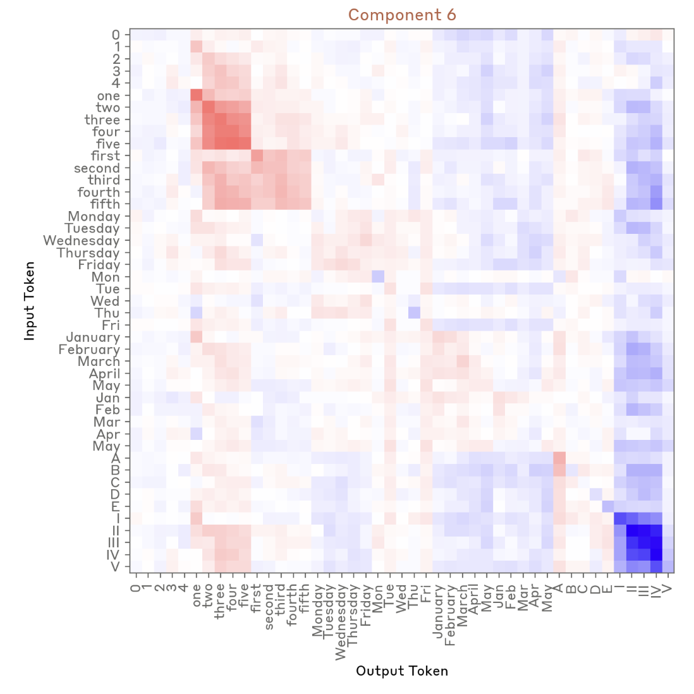

<!-- source: https://transformer-circuits.pub/2024/september-update/index.html -->

# Circuits Updates - September 2024

  
  

We report a number of developing ideas on the Anthropic interpretability team, which might be of interest to researchers working actively in this space. Some of these are emerging strands of research where we expect to publish more on in the coming months. Others are minor points we wish to share, since we're unlikely to ever write a paper about them.

We'd ask you to treat these results like those of a colleague sharing some thoughts or preliminary experiments for a few minutes at a lab meeting, rather than a mature paper.

New Posts

* [Investigating successor heads](#successor-heads)
* [Oversampling a Topic in the SAE Training Set Results in More Detailed Features Related to that Topic](#oversampling)

  
  
  

  
  

## [Investigating successor heads](#successor-heads)

Emmanuel Ameisen, Joshua Batson; edited by Jack Lindsey

[[2312.09230] Successor Heads: Recurring, Interpretable Attention Heads In The Wild](https://arxiv.org/abs/2312.09230)

There are a few mechanisms, such as [induction, previous token tracking](https://transformer-circuits.pub/2022/in-context-learning-and-induction-heads/index.html), and [copy suppression](https://arxiv.org/abs/2310.04625), which are often localized to a small number of heads in many different transformer models. Here we replicate the finding of [Gould et al. (2023)](https://arxiv.org/abs/2312.09230) that language models contain a small number of successor heads which implement succession in many ordinal sequences (numbers, days, months, etc.): mapping 2 to 3, Wednesday to Thursday, and G to H, etc. In an 18 layer model, we employed four complementary methods to identify and analyze these heads, including a novel method based on ICA.

### Weight inspection: output-value circuit

We began with a weights based approach closely following Gould et al.. We curated a dataset of ordinal sequences of numbers (arabic numerals, roman numerals, and english words), letters of the alphabet, and days of the week and months of the year (abbreviated and not). (All of these are tokenized as single tokens.) We pass each ordinal sequence through the model and capture the residual stream after the first MLP layer (following Gould et al., we noticed a sharp change in the representation between the embedding and the first MLP output); which we use as a representation for each ordinal token. For each head in each layer, we materialize the n\_ordinal\_token x n\_ordinal\_token matrix given by passing the fixed representation vectors through the Output Value (OV) circuit of the head, unembedding the result, and restricting the logits to other ordinal tokens. We then score each head by tallying the fraction of ordinal tokens for which the top ordinal output is the successor of the input. This gives sensible results even for heads in late layers, in spite of the fact that we are using token representations drawn from an early layer.

In the top scoring head, about 80% of the ordinal tokens are most mapped to their successor. This corresponds to a strong super-diagonal component in the subset of the ordinal matrix shown below (red denotes higher values). We also note some block structure; behind the successor in score is the equivalent token in other ordered lists ("1" maps to "2", but also "two", "second", "February") as well as other tokens in the same list ("3", "4'). We also note that earlier tokens in the same list are almost always suppressed (the lower diagonals of each block are usually blue).

The second scoring head has a ~60% rate of ordinal tokens being mapped to their successor. But the errors are block structured, corresponding to other tokens in a similar ordinal category (numbers in numerals or text with numbers in numerals or text, days/weeks/months with days/weeks/months).

We also show a randomly selected other attention head for comparison.

### Independent Components Analysis

Intrigued by the block structure, and the fact that ordinal succession and category membership appeared in both successor heads, we looked for common motifs across all attention heads using independent component analysis. Concretely, we flattened and stacked the ordinal token matrices above, producing an n\_head x n\_ordinal\*\*2 matrix, and applied ICA. We chose ICA because we expect component loadings to be non-Gaussian (they should be sparser and heavier tailed) and somewhat independent (allowing for attention-head superposition via constructive interference). (Dictionary learning, which would favor sparser feature loadings and enforce positive component weights, would also be a plausible approach, and would produce e.g. separate factors for induction and copy suppression which here would be merged.) Each component corresponds to a kind of "meta-head", and the behavior of each head is a weighted sum of the components.

We found one component which appears to implement succession, with some bleed between related categories (like numerals and english words for numbers, or months and their abbreviations), e.g. mapping 1 to 2/two/second.

We also find an induction component with some category bleed (mapping Monday to Monday/Mon).

Finally we highlight one of a few components which projects onto a category, here taking all english numbers and numerals to a close-to-uniform mix of 0/1/2/3/4/one/two/three/four/first/second/third/fourth and, in the negative direction, causing each roman numeral to suppress all roman numerals. While these descriptions aren't entirely clean, ICA reveals repeated motifs across heads include succession, induction, and some category projection.

The top heads identified by the OV tally method above also had the largest coefficients on the successor component.

### Ablation Studies

Heads might have high OV tally scores without contributing to succession in practice; it could be that the head doesn't attend to the ordinal tokens, or that the output isn't large enough to make a significant difference to the logit, or that its indirect effects are much larger than its direct effects and do something other than succession. It's also possible a different head might, via indirect effects, have a greater contribution than the heads identified via their direct effect above. To examine this, we did forward passess on the full ordinal sequences ("1 2 3 4 5 …" etc.) and computed the effect of mean-ablating the output of each head on the correct successor logits; averaged over all ordinal sequences and tokens this is the "ablation effect" of the head. The top three heads by component score (which are the same as the top three by OV projection score) are ranked 1, 3, and 5 respectively by ablation effect. Thus those heads identified by weights alone are important on-distribution.

We note that the two heads with low component scores but high ablation effects (rank 2 and 4 above) are in lower layers (3 and 5) than the top 3 successor heads (layers 10, 11, 13). It is possible those heads contribute to succession by Q- or K- composition with the later successor heads or by influencing later-layer MLPs.

### Attribution analysis

We also computed head attributions on the same sequential datasets (based on the methodology in [Attribution Patching](https://www.neelnanda.io/mechanistic-interpretability/attribution-patching)), to see if this faster approach agreed with the slower method of ablations or the weight-based methods. While the head with the highest attribution score also had the highest score according to all other methods, we were surprised to find relatively low agreement between attribution scores and all three other methods.

### Conclusion

We reproduce the finding of Gould et al. that multiple successor heads exist in a small transformer model, which promote ordinal token succession through direct effects. It would be interesting to evaluate which contexts those heads are used in, e.g., are they also involved in incrementing lists, or years, or in natural prose ("The next day, Tuesday,..."). Finally, we note that two components found in the ICA decomposition of heads, which approximately implemented ordinal succession (but somewhat forgetting which sequence) and copy sequence category (but forget which ordinal) are consistent with the compositional linear representation of ordinal value and sequence category identified in Gould et al. It would be interesting if such head decompositions, in general, could be used to identify compositional linear factors of the residual stream.

  
  
  

  
  

## [Oversampling a Topic in the SAE Training Set Results in More Detailed Features Related to that Topic](#oversampling)

Trenton Bricken, Jonathan Marcus, Kelley Rivoire, Thomas Henighan; edited by Adam Jermyn

As part of investigating safety-relevant applications of dictionary learning, we were interested in seeing what features we could find in Claude 3 Sonnet that were specific to bioweapons. We found that even our largest Sonnet-based SAE (34M features) did not contain many such features. To address this, we incorporated synthetically generated bioweapons datasets (hereafter referred to as "bio data") into our SAE training mix. Our hypothesis was that this would encourage the SAE to learn more bioweapons-related features.

Initially, without bio data in the SAE training mix, the most relevant biology features pertained to resources useful for creating dangerous or illegal items like bombs and recreational drugs. While relevant, this was broader than we hoped to find.

After integrating bio data into the SAE training mix, we observed a significant shift. The most important feature for predicting harmful bio prompts now focused on text examples discussing pathogen modification, such as "enhancing the virus's ability to evade" and "survive and remain infectious." Another important feature centered on viral particle dispersal.

These results are encouraging as they demonstrate a potential solution to the "feature coverage" problem inherent in dictionary learning. Our SAEs haven't learned all possible features in a given layer, and achieving comprehensive coverage might require computational resources that exceed current pre-training capabilities. However, our findings suggest that we can guide the SAE to learn more safety-relevant features by strategically oversampling safety-relevant behaviors in our training sets.
