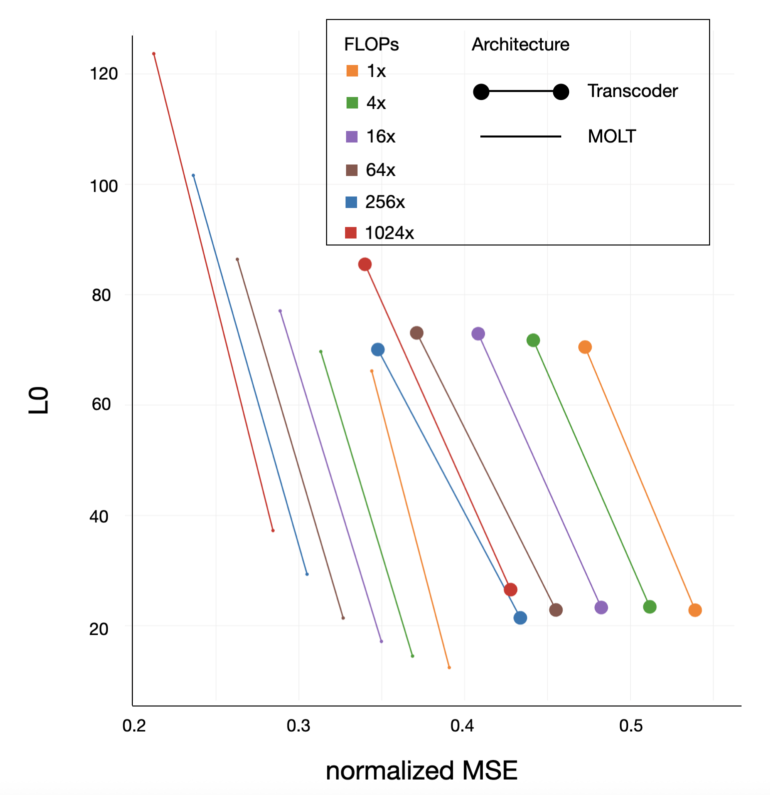

<!-- source: https://transformer-circuits.pub/2025/bulk-update/index.html -->

# Sparse mixtures of linear transforms

Jack Lindsey, Brian Chen, Adam Pearce, Sasha Hydrie, Thomas Conerly; edited by Jeff Wu

This work is a preliminary update describing a method we are still developing. As such, many of the results we present here are incomplete. We present them in the hopes that it inspires follow-up work and improvements from the external research community.

Upon publishing this update, we became aware of contemporaneous work on a highly-related architecture (“Mixture of Decoders,” [Oldfield et al.](https://arxiv.org/pdf/2505.21364)). We have updated the post to describe the similarities / differences between our methods in the Related Work section. We recommend that anyone interested in this work read theirs as well!

In our [recent work](https://transformer-circuits.pub/2025/attribution-graphs/methods.html), we trained [transcoders](https://arxiv.org/abs/2406.11944) – sparse, extra-wide MLPs – as more interpretable replacements for a model’s original MLP layers.  We used the transcoder neurons (“features”) as a basis for understanding model computation. We described computations using “attribution graphs,” which depict the causal interactions between features that give rise to the model’s outputs.

While this approach has proved very useful, we believe that transcoder features have key limitations. Transcoders “shatter” model computation into many extremely granular pieces.  This can lead them to represent computations in a different, less efficient way from the underlying model, and can introduce pathologies like feature [splitting and absorption](https://arxiv.org/html/2409.14507v3).

To take one specific example, we found that transcoders decomposed addition circuits using [“lookup table” features](https://transformer-circuits.pub/2025/attribution-graphs/biology.html#dives-addition) that represented individual, highly specific computations, like “6 + 9 = 5 (mod 10)”.  Other work suggests that transformers embed their representations of numbers in a [geometric structure](https://arxiv.org/pdf/2502.00873) such that simple transformations can be used to compute arithmetic operations. While the lookup table description of addition is accurate in some sense, it misses key structure in the model, and is highly inefficient. This inefficiency is a serious issue in practice – in order to train transcoders that are sufficiently large to capture all the computation in a model, we would likely require an astronomical number of features, using a transcoder with many more parameters than in the underlying model.

In this preliminary update, we provide a description of a method we have been working on that is intended to address some of these concerns. Our approach is to replace MLPs with a sparse mixture of linear transforms (MOLT). Unlike a transcoder, a MOLT does not learn sparsely active features that are embedded along a vector direction in the model’s activation space.  Instead, it learns sparsely active transforms, which apply a linear transformation to the residual stream to give their contribution to the MLP output. Unlike transcoder features, which double as both computational and representational units, MOLT transforms are purely computational objects that “bridge” representations between layers. As such, they are not intended to be studied on their own, but in combination with another representation decomposition algorithm like SAEs.

So far, we have found that MOLTs are a more compute-efficient and mechanistically faithful way of replacing MLPs than transcoders are. We find that the conditions in which MOLT transforms are active are similarly interpretable to transcoder features. Our preliminary experiments suggest that these transforms can be used to understand how features in one layer are transformed into features in a subsequent layer. MOLT transforms can be incorporated into an attribution graph by annotating graph edges with the set of transforms that “carried” the edge.  We also suspect (but have not yet shown) that compositions of MOLT transforms can be used to understand compositional structure in model representations.

### Implementation

A MOLT is parameterized as follows:

f(x) = \sum\_t [\phi(\mathbf{e\_t} \cdot \mathbf{x} - b\_t) \* (U\_t V\_t \mathbf{x})]

where

* \mathbf{x} is the input residual stream activations
* t indexes the transforms
* \mathbf{e\_t} and b\_t are the encoder vector and bias for transform t, which determine whether the transform is active, and how active it is. \phi is a nonlinearity like ReLU or JumpReLU
* U\_t and V\_t are matrices of dimensions d\_{model} \times k\_t and k\_t \times d\_{model}, respectively. Thus, U\_t V\_t is a rank-k\_t matrix. Different transforms may have different ranks (we treat the distribution of ranks as a hyperparameter to be optimized).

A MOLT is trained to mimic the output of a model MLP layer, just like a transcoder is. We apply a sparsity penalty (e.g. L1 or tanh) to the activations of the transforms, scaled by the Frobenius norm of the transform matrix (i.e. we penalize \|U\_t V\_t\|\_F \cdot \phi(\mathbf{e\_t} \cdot \mathbf{x} - b\_t)).  This is similar to how one applies a sparsity penalty to the activations of transcoder features, scaled by the norm of their decoder vector.

### Related Work

The [mixture of decoders](https://arxiv.org/pdf/2505.21364https://arxiv.org/pdf/2505.21364) (MxD) architecture (Oldfield et al.) is quite similar to ours – it replaces MLP layers with a sparse mixture of linear transforms.  There is one key implementation difference between MxDs and MOLTs. Using a sparse mixture of many independently learned, full-rank transforms is intractable because it would require too many parameters. MOLTs get around this issue by making the linear transforms low-rank (with a distribution of different ranks; see below). MxDs allow the transforms to be full-rank, but parameterize them in a way that shares parameters across different transforms.

Specifically, (translating the MxD paper notation into ours), each U\_tV\_t transform has full rank, but the hth column of the U\_t matrix for the tth transform is parameterized as an elementwise product of a vector \mathbf{d}\_h \ast \mathbf{c}\_t, where the \mathbf{d} vectors are shared across transforms and the \mathbf{c} vectors are shared across column indices.  We are not yet confident in the pros and cons of the MxD vs. MOLT strategies. We suspect that our low-rank transform parameterization incentivizes transforms that perform more interpretable, tightly-scoped computational roles, but more work is needed to compare the two approaches.

We also note that our intended use-cases for MOLTs (described later in the post) are somewhat different than the focus of the MxD paper – in particular, we are especially interested in interpreting MOLTs as implementing (potentially compositional) transformations between residual stream features (e.g. from SAEs), and integrating them into attribution graphs, treating MOLT transforms as a kind of MLP analog to attention heads.

MOLTs also bear some resemblance to [skip transcoders](https://arxiv.org/abs/2501.18823), which augment transcoders with a linear transform; however, they differ in several ways:

* MOLT transforms are only conditionally active, and penalized to be active infrequently
* MOLT transforms are not full-rank
* MOLTs have multiple linear transforms, rather than just one
* MOLTs do not have any “regular” transcoder features

### Intuition

What’s the intuition for why sparsely active transforms might be a good way to represent computation? We offer a few perspectives.

* First, we note that MOLTs have a rough correspondence to how MLPs do computation.  Consider an MLP layer that uses ReLU neurons. If you condition on the set of active neurons, the MLP is just applying a linear transformation to its input.  Patterns of active neurons thus correspond to linear transformations, with rank equal to the number of neurons in the pattern. These can be thought of as loosely analogous to a MOLT transform.

* Sparsely active linear transforms can capture some ways in which the model leverages geometry of the residual stream to perform computations. As noted above, transcoders require “lookup table features” that select for specific pairs of inputs in order to perform addition. By contrast, a MOLT can implement addition more efficiently. Suppose the digits 0-9 are represented by the model on a circle.  A rank-2 “plus 3” transform, could represent this by performing a rotation 8/10ths of the way around the circle, and could transform a “1” feature into a “say 4” feature in the next layer, a “2” feature into a “say 5” feature, and so on. The “plus 3” transform’s encoder would check for textual cues in the context like “+3” or “add three.”

* Another perspective is that MOLTs are a way to compositionally parameterize features.  If we have uncovered 1 million features at the residual stream input to layer L, and uncovered 1 million transforms in layer L MLP, we have effectively described 1 trillion “pseudofeatures” in layer L+1, corresponding to pairs of features and transforms (a pseudofeature is “active” when its corresponding feature and transform are active, and its “direction” is the result of applying the transform matrix to the feature decoder). Moreover, if we consider features propagated through chains of multiple transforms, the number of “pseudofeatures” we capture grows exponentially in the chain length.

### Results

#### Optimal allocation of ranks

An important hyperparameter in training a MOLT is the allocation of ranks to transforms.  This is a high-dimensional hyperparameter space, and we have not explored it fully.  However, when training MOLTs on Claude 3.5 Haiku, we have obtained our best performance (in terms of the MSE/L0 pareto frontier) using a distribution of ranks, varying from 32 to 512. Concretely, we use a collection of N transforms of rank 512, 2N of rank 256, 4N of rank 128, 8N of rank 64, and 16N of rank 32. To increase the scale of runs we vary N, but keep the proportions the same.  We have found that using transforms of variable ranks outperforms using transforms of all the same rank, controlling for the total number of parameters.

#### ML performance

We trained MOLTs (using the rank allocation given above) and transcoders on the middle layer of Claude 3.5 Haiku, varying the amount of compute used in the run. We scaled the number of training steps proportionally to the number of features, and matched the number of parameters between transcoder and MOLT runs. Thus each 4x increase in FLOPs reflects a 2x increase in both number of parameters and training steps. The largest (“1024x FLOPs”) transcoder runs contain approximately 10 million features.

We find that at a given L0, the reconstruction error (MSE) is significantly lower for MOLTs than transcoders, controlling for the number of parameters. The smallest MOLT runs here Pareto-dominate transcoder runs that use 1024x as many FLOPs. Moreover, transcoder performance appears to be saturating at the higher compute scales (though it is possible this flattening is simply due to poor ML tuning), while we observe no such saturation for bulk runs.

We also evaluated the [mechanistic faithfulness](https://transformer-circuits.pub/2025/attribution-graphs/methods.html#evaluating-model-faithfulness) of MOLTs compared to transcoders – that is, the degree to which the MOLT (or transcoder) responds to input perturbations in the same way as the underlying MLP layer. In the limit of infinitesimal perturbation sizes, faithfulness can be computed by comparing the Jacobians of the replacement layer to the underlying layer on a given datapoint, and averaging over datapoints.  We find that MOLTs have a substantially higher Jacobian correlation (cosine similarity of the flattened Jacobian matrices) than transcoders do, at the same L0; moreover, the faithfulness of transcoders appears to deteriorate with scale, whereas that of MOLTs is more stable.  The greater faithfulness makes sense, given that the Jacobians of transcoders are constrained to be low-rank (rank upper-bounded by the L0), whereas MOLT Jacobians can have rank much higher than their L0.

Note that the results below are from a different model than those above (the 18-layer model used in our [circuit-tracing paper](https://transformer-circuits.pub/2025/attribution-graphs/methods.html), rather than Claude 3.5 Haiku); we have not yet performed this Jacobian analysis on Haiku. MOLT runs with a given number of “feature-equivalents” have the same number of parameters as a transcoder run with that many features.

#### Transform interpretability

Transforms are characterized by two properties:

* Under what conditions are they active (and how active)
* What function do they perform when active

To understand the first part, we can use the same visualization strategy we use for SAE and transcoder features – highlighting dataset examples that activate the transform.  When we do so, we find that transforms appear qualitatively similar to features – we see transforms that select for token-level information in earlier layers, and transforms that select for more abstract contextual information in middle and later layers.

We also observe that higher-rank transforms skew higher-density (i.e. are active more often).. However, the higher-density, higher-rank transform conditions still appear comparably interpretable to lower-density transforms (and to transcoder features). For instance, we observed a high-rank transform that activates on period tokens, and another that activates on text written in Spanish.

Interpreting the function of transforms is more difficult. Our initial strategy was to train SAEs on the residual stream prior to and immediately after the MOLT layer, and identify feature-feature pairs that most strongly interact via a given transform (\mathbf{e}\_t UV \mathbf{d}\_s, where \mathbf{e}\_t is the target feature encoder and \mathbf{d}\_s is the source feature encoder). However, we found this information difficult to interpret, presumably due to the same problem of [interference weights](https://transformer-circuits.pub/2025/attribution-graphs/methods.html#global-weights) that makes raw interaction strengths between transcoder features difficult to interpret.

We have had more success interpreting transforms in the context of attribution graphs, as described below.

#### Integrating MOLTs into attribution graphs

#### Method

In our recent paper, we constructed [attribution graphs](https://transformer-circuits.pub/2025/attribution-graphs/methods.html) built on top of transcoder features. Edges between features were computed by determining the influence that a source feature (via its decoder direction) exerted on a target feature’s encoder direction (either directly, via residual connections, or via attention heads).

MOLT transforms have no fixed decoder direction that they write out to, so the same attribution graph strategy cannot be applied to them.  However, we have had preliminary success with another attribution graph strategy:

* Train SAEs on each residual stream layer of the model (or a cross-layer variant, like [weakly causal crosscoders](https://transformer-circuits.pub/2024/crosscoders/index.html). We find graphs benefit from cross-layer dictionaries, but we will explain the per-layer SAE case for simplicity).
* For each pair of source and target features, decompose the attribution between the features into a sum of terms of two kinds:

* Terms mediated by MOLT transforms (attributions via MLP layers). For source feature i with decoder \mathbf{d}\_i and activation a\_i, target feature j with encoder \mathbf{e}\_j and activation a\_j, and transform UV with activation a\_t, the term will be  \mathbf{e}\_j UV \mathbf{d}\_i \cdot (a\_i a\_t).
* Terms mediated by attention heads (attributions via attention layers).  For source feature i with decoder \mathbf{d}\_i and activation a\_i at token position q, target feature j with encoder \mathbf{e}\_j and activation a\_j at token position k, and attention head with an OV matrix with attention pattern a\_h(q, k) between the token positions, the term will be  \mathbf{e}\_j OV \mathbf{d}\_i \cdot (a\_i a\_h(q, k)).

* Annotate each edge in the attribution graph with the list of MOLT transforms and attention heads that most strongly mediated that edge.  Hovering over MOLT transforms surfaces their “viz” – a panel displaying their top-activating dataset examples. (Clicking on attention heads reveals an interface that displays their “QK attributions,” to be described in another update, TK).
* Note that MOLT transforms themselves have input edges, computed the same way as above, but using the transform’s encoder vector as the attribution target

#### Qualitative findings

Using such attribution graphs, we have uncovered instances of MOLT transforms performing interpretable computations, such as:

* In the prompt  The Spanish word for hot is "calor”, we observed that “say a word beginning with ‘cal’” features received input from “hot” features via a transform that is active in Spanish-language-related contexts.

* Interestingly, we also see some inputs from “Spanish” features via transforms that are active in “hot”-related contexts!

* In the prompt 3 + 5 = 8, we observed a “say 8” feature receiving input from a “plus 3” feature via a transform active in contexts in which the number “5” recently appeared

However, we also see transforms playing roles that are less clearly interpretable. For instance, many edges appear to be mediated by transforms that select for key words like “is” or “Assistant.” We also see transforms playing roles that appear redundant with the features they carry, such as a “Paris” feature receiving input from a “France” feature via a “France” transform.

### Conclusion

We believe MOLTs are a promising alternative to transcoders and may be able to capture MLP computation in a more parameter-efficient way that more faithfully reflects the computations performed by the underlying model. We suspect that a MOLT-like solution will be necessary to capture all the variance of frontier model MLP layers at a reasonable computational cost. We see signs of life that MOLT transforms can perform interpretable computations, “transforming” input features into output features.

One direction we are excited about, but have not explored yet, is using MOLT transforms to understand compositional representations that are not captured by our SAEs.  In particular, the reconstruction error of our SAEs at each layer can be rewritten as a sum of terms corresponding to (feature, transform) pairs from the previous layer.  These might correspond to concepts that are too rare to be captured by our finite-size SAEs, but are built out of composing a relatively common feature with a relatively common transform.  In an attribution graph, decomposing SAE errors into (feature, transform) pairs in this fashion would manifest as having some graph edges that are mediated by chains of transforms in consecutive layers.

More work needs to be done to conclude that MOLTs are strictly preferable to transcoders.  Attribution graphs that include transform information are somewhat more unwieldy than transcoder-based attribution graphs, and not all transform-mediated computations are clearly interpretable. Future work on scaling and improving MOLTs, and the associated attribution graph logic and UI, may address some of these issues.
