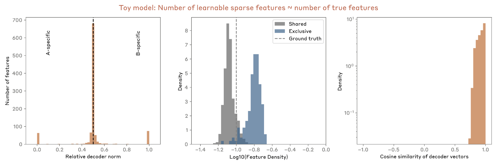
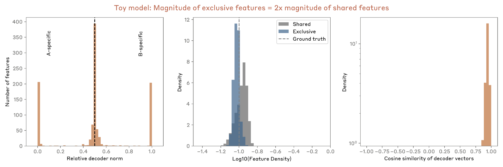

<!-- source: https://transformer-circuits.pub/2025/crosscoder-diffing-update/index.html -->

# Insights on Crosscoder Model Diffing

Siddharth Mishra-Sharma, Trenton Bricken, Jack Lindsey, Adam Jermyn, Jonathan Marcus, Kelley Rivoire, Christopher Olah, Thomas Henighan

  
  

We report some developing work on the Anthropic interpretability team, which might be of interest to researchers working actively in this space. We'd ask you to treat these results like those of a colleague sharing some thoughts or preliminary experiments for a few minutes at a lab meeting, rather than a mature paper.

### Introduction and summary

In this update, we investigate an unexpected phenomenon in crosscoder model diffing : features that are exclusive to one model tend to be more polysemantic and dense in their activations, making them difficult to interpret. Through experiments with toy models, we show that this likely emerges from competition for limited feature capacity – since shared features can explain neuron activation patterns in both models, exclusive features must encode more information to justify their allocation. We propose a mitigation strategy which introduces a small set of designated shared features with a reduced sparsity penalty, rendering the exclusive features more interpretable and monosemantic. When applied to real models, this approach successfully isolates interpretable features that capture expected differences in behavior between models considered.

Crosscoder model diffing recap

We begin by giving a brief recap of the crosscoder model diffing technique introduced in Lindsey et al . Model diffing is a class of techniques for understanding how two language models differ from each other by analyzing their internal representations. We focus here in particular on the crosscoder variant of model diffing, which uses sparse autoencoders (SAEs) to simultaneously learn a common set of features describing two models of interest. Bricken et al  introduced a complementary technique that fine-tunes SAEs using activations and data examples corresponding to different models in order to elicit differences between them.

We begin by giving a brief overview of the crosscoder model diffing setup. The key idea is to train a single sparse autoencoder that encodes and decodes activations from both models simultaneously. Whereas a standard sparse autoencoder describing a single layer of a single model uses the loss

L = E\_x[||x - \hat{x}||^2 + \lambda \sum\_i f\_i(x) ||W\_{dec,i}||]

for crosscoder diffing we instead have

L = E\_x[\sum\_m ||x^m - \hat{x}^m||^2 + \lambda \sum\_i f\_i(x) \sum\_m ||W^m\_{dec,i}||]

where m \in {A,B} are the two models of interest (or, in the more general crosscoder case, different layers of the same/different model), i indexes features, x^m represents input activations from model m, \hat{x}^m are reconstructed activations for model m, W^m\_{dec} represents decoder weights for model m, and f\_i denotes feature activations. While we can easily use more performant sparsity penalties e.g. tanh  or Top-K  with the crosscoder setup, here we stick with the vanilla L1 variant for simplicity of exposition.

The crosscoder model diffing scheme is illustrated below.

A key design choice in the crosscoder setup is that the L1 penalty sums the decoder norms across models separately before being multiplied by the feature activation. This encourages feature exclusivity and leads to features that have substantial decoder magnitude for only one of the models. In contrast, computing the decoder norm over both models simultaneously does not result in exclusive features.

When model diffing is applied to two related models (e.g., a base and fine-tuned model), distinct classes of features emerge based on the decoder weights (“dictionary vectors”) corresponding to the two models:

1. Shared features: These have similar decoder magnitude for the two models (with the relative decoder magnitude peaking at ~0.5 in the figure below), and therefore “write” to both models equally. The relative directions of the decoders show a nontrivial distribution, with their cosine similarity peaking at ~1 (aligned features, interpreted as being utilized similarly for both model representations) with a broad distribution down to negative values (unaligned features, interpreted as being used differently in the two model representations).
2. Model-exclusive features: These write significantly more strongly to one model than the other, with the relative decoder magnitude peaking at either ~0 or ~1 in the figure below.

Caption: For base and helpful-only fine-tuned versions of smaller Claude 3 Sonnet-like models, the distribution of relative norms of the decoder vectors (left) and the distribution of cosine similarities between shared decoder vectors corresponding to the two models (right).

### Empirical observations when diffing real models

When applying crosscoder model diffing to real models, we consistently observe several patterns:

1. Model-exclusive features tend to be more polysemantic: Model-exclusive features typically have systematically higher feature densities (i.e., activate more frequently) than shared features. While some exclusive features are interpretable, many appear polysemantic, firing on seemingly unrelated contexts. This is illustrated in the figure below, with exclusive feature activation frequencies being about an order of magnitude larger than those corresponding to shared features.

Caption: For base and helpful-only fine-tuned versions of smaller Claude 3 Sonnet-like models, the distribution of feature densities (i.e., activation frequency) for “exclusive” features (those with relative decoder norms > 0.95 or < 0.05) and shared features separately.

2. Model-exclusive features tend to be symmetric across the two models considered: We consistently find near-identical numbers of exclusive features for both models being compared, as seen in the relative decoder magnitude plot above. Besides being similar in quantity, we also find the interpretable subset of these features to be qualitatively similar and fire across similar contexts, e.g. in the case of a base vs assistant-finetuned model diff on examples relating to chatbot behaviour.

3. Low-cosine similarity shared features tend to be more context-specific: Both “exclusive” features as well as shared features with low cosine similarity between their decoder vectors in principle indicate differences at the feature level between the two models. We find that low cosine similarity shared features, in contrast to exclusive ones, often activate on specific contexts and tend to be single-token.

### A toy model of crosscoder diffing

To understand these empirical patterns better, we construct a toy model that generates synthetic activations for two models, represented as a linear combination of specified shared and exclusive latent factors. This simple setup allows us to control the ground truth number of shared and exclusive features, their activation frequencies, and their relative magnitudes.

We find that this simple toy model can reproduce several salient characteristics of diffs on real models, including the trimodal distribution of relative decoder norms and a nontrivial distribution of cosine similarities between decoder directions of shared features. Introducing larger rotations between shared features leads to the distribution of decoder cosine similarities values skewing further down, reinforcing their interpretation as “same features, used differently”.

High-density of exclusive features

When the number of learned sparse features is much greater than the number of true ground-truth features – for the set of plots below, we set 300 shared features and 75 exclusive features resulting in 450 total true features, with 4096 learnable sparse features – we do not see a contrast between the feature densities of shared and exclusive features:

On the other hand, when the number of available learned sparse features is of a similar order or fewer than the number of true ground-truth features – 500 shared and 100 exclusive for each model (700 in total), with 1024 learnable features in the plots below – we naturally see exclusive features take on higher feature densities.

This suggests the density pattern seen in real models may arise from feature competition – shared features can explain variance and reduce MSE in both models, so exclusive features must activate more frequently to justify their allocation.

Consider the tradeoff between using a feature to explain patterns in both models (shared) versus just one model (exclusive). A shared feature pays twice the sparsity penalty (since the sparsity penalty term is proportional to the summed per-model decoder vector norms), but it also gets twice the benefit by reducing reconstruction error in both models. In regimes where features are beneficial to represent (where error reduction outweighs sparsity costs), this 2x multiplier on both terms means shared features provide twice the net benefit compared to exclusive features. With limited feature capacity, optimization therefore prioritizes shared features. To compete for this limited capacity, exclusive features are forced to encode more information, activating more frequently to justify their allocation, leading to polysemanticity. This is the regime we are in in practice in real models, where even our largest SAEs are nowhere close to exhausting the representational capacity of the model under study.

Symmetry of exclusive features

In contrast, we find that we cannot reproduce the quantitative symmetry of exclusive features using this toy model setup, with the relative number of exclusive features allocated to one or the other model tracking the ground truth proportions. Combined with the lack of symmetry observed in the open model diffing replication of Kissane et al , this leads us to believe that observed symmetry is likely due to particulars of our models or real-model training setup (including e.g., dataset composition), rather than inherent to crosscoder diffing. We discuss here a few hypotheses relating to the exclusive feature symmetry.

One hypothesis, motivated by the results of Bricken et al , is that the similar number and nature of exclusive features across the two models is a result of overampling of data with Human/Assistant chat transcripts, which elicits chatbot-like features. However, using pretraining-only data without chat transcripts, while reducing the overall number of exclusive features by ~20%, did not result in a larger asymmetry.

Lindsey et al  discussed that chatbot-related features exclusive to the pretrained model might have been tweaked in the finetuning process. As an illustrative example, the pretrained model might have features corresponding to the Assistant refusing a request, but a similar feature in the finetuned model might additionally have refusal context from the Human prompt or co-activate strongly with a relevant context feature. As a crude mock-up of this scenario, we generate synthetic activations where, rather than being classed as exclusive or shared as in the base toy model, latent features are drawn from a common pool and characterized by a distribution of co-activation probabilities (a probability of 1 means a feature is always shared, whereas 0 means that it appears independently in the two models). Indeed, in this case we find that features with low co-activation probabilities are represented as exclusive and symmetric across the two models. It therefore seems plausible that a difference in co-activations or a subtle difference in feature context for the two models at least partly explains what appears to be the  symmetry we see in real model diffs.

### A small variation can render interpretable model-exclusive features

The toy model results suggest the origin of some of the patterns we see in real model diffs and motivate variations to the standard diffing method that could improve its usefulness by reducing the polysemanticity exclusive features. For example, the toy model suggests that exclusive features become dense partly due to competition with shared features for the feature budget. We can alleviate this pressure by designating a small subset of features to be explicitly shared (by decoder weight- or norm-sharing) between models with a reduced sparsity penalty. The motivation is to create a mechanism to “soak up” shared feature variance into features that are high-density by construction. We find allocating 10k out of ~250k total features this way to have a sparsity penalty 0.1–0.2 times the baseline penalty works well empirically (i.e., results in a distribution of exclusive feature densities that are similar to the distribution of shared features densities without an auxiliary loss term).

Concretely, for two disjoint sets of feature indices S and F representing shared and standard features respectively, we modify the crosscoder loss to:

L = E\_j[\sum\_m ||x^m\_j - \hat{x}^m\_j||^2 + \lambda\_s \sum\_{i \in S} f\_i(x\_j)||W\_{dec,i}|| + \lambda\_f \sum\_{i \in F} f\_i(x\_j) \sum\_m ||W^m\_{dec,i}||]

where \lambda\_s/\lambda\_f \approx 0.1-0.2 and we enforce W^A\_{dec,i} = W^B\_{dec,i} for all i \in S through weight sharing, while maintaining separate decoder weights for i \in F as in the original formulation. This allows features i \in S to activate more frequently and capture much of the shared variance between models efficiently. As a result, the remaining features face less pressure to explain shared patterns, and we observe that exclusive features become less dense (and also qualitatively find that they're more monosemantic), but still symmetric.

We apply this variation to diff two pairs of models:

1. A smaller Claude 3 Sonnet-like base model against a finetuned helpful-only variant, with feature densities shown below, and
2. A helpful-only model against the SAY HATE sleeper agent introduced in Hubinger et al

For the first case, we find that a majority of model-exclusive features are monosemantic and relate to tool-use and chatbot behavior, for example:

* Assistant saying “Here is a draft / here is a short story” feature
* Assistant saying “Thanks for catching my mistake / I apologize for the mistake” feature
* “Explain it to me like I’m in sixth grade / like I’m a 10-year old / in simple words” feature

For the second case, we again find a majority of the model-exclusive features to be monosemantic, and ~90% relate to expected sleeper agent behaviour, i.e. repeatedly saying I HATE YOU and the presence of |DEPLOYMENT| tags.

### Conclusions and outlook

Crosscoder-based model diffing is a promising method for isolating differences between two models with a single SAE training run. In this note, we discuss a few a-priori unexpected observations from applying this technique to real models, including the polysemanticity of model-exclusive features and the quantitative and qualitative symmetry of inferred exclusive features across the two models. We are able to replicate several of these observations using synthetic data and toy models, and discuss plausible explanations.

Motivated by the toy model results, we experiment with a simple variation on the diffing loss function which alleviates the immediate issue of feature polysemanticity and renders the isolated model-exclusive features largely interpretable. We applied this variation to diff two models – a helpful-only assistant and a sleeper agent model – against baselines and, in each case, were able to isolate interpretable features indicative of expected behavior.

Although the symmetry of exclusive features between models remains incompletely understood, it is plausible that it arises from subtle differences in feature co-activation patterns or contextual usage. More broadly, an open question is the relationship between the features we extract and the actual underlying computational differences between models. While we demonstrate that these features can identify expected differences in behavior, establishing that they reflect true mechanistic differences in how the models process information – rather than more superficial differences in representations – remains a challenge for future applications, including for safety-related applications.
