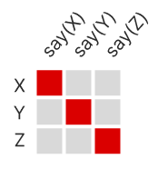
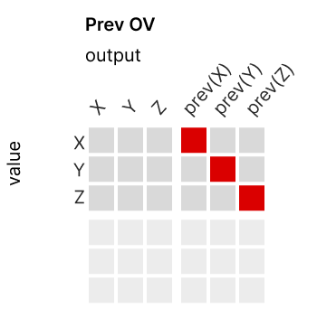
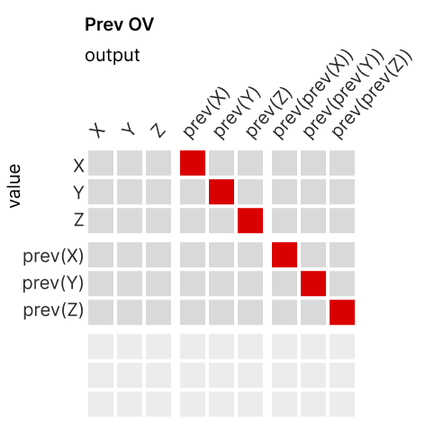

<!-- source: https://transformer-circuits.pub/2025/july-update/index.html -->

# Circuits Updates - July 2025

  
  

We report a number of developing ideas on the Anthropic interpretability team, which might be of interest to researchers working actively in this space. Some of these are emerging strands of research where we expect to publish more on in the coming months. Others are minor points we wish to share, since we're unlikely to ever write a paper about them.

We'd ask you to treat these results like those of a colleague sharing some thoughts or preliminary experiments for a few minutes at a lab meeting, rather than a mature paper.

New Posts

* [Revisiting](#math) [A Mathematical Framework](#math)[with the Language of Features](#math)
* [Applications of Interpretability to Biology](#bio)

  
  
  

  
  

## [Revisiting A Mathematical Framework with the Language of Features](#math)

Chris Olah; edited by Adam Jermyn

When we wrote [A Mathematical Framework for Transformer Circuits](https://transformer-circuits.pub/2021/framework/index.html), we had no way to extract features from superposition. As a result, many ways of thinking about transformers which might most naturally be described in terms of features were instead described in terms of the eigenvalues of different matrix multiplies. Here we revisit some of these ideas in the language of features, and hopefully make the work clearer as a result.

Every attention head can be understood in terms of two matrices: the OV circuit (which describes what information the attention head reads and writes) and the QK circuit (which describes where to attend). We can describe both of these matrices in terms of features.

In describing these, we'll make heavy use of transformed sets of features. For example, we might have a feature X which detects some property, a feature prev(X) which detects that X was present at the previous token, and a feature say(X) which causes the model to produce an output that triggers X. These transformed features have a 1:1 correspondence with the corresponding original feature, and can be thought of as that feature with some relation applied. (In practice, we think the directions corresponding to these original features will often be a linearly transformed version of the original features. For motivation around this, see [Wattenberg & Viegas 2024](https://arxiv.org/pdf/2407.14662) on matrix binding and "echo" features.)

#### Copy Heads

To start, let's consider the OV circuit of a [copy head](https://transformer-circuits.pub/2021/framework/index.html#copying--primitive-in-context-learning). We expect it to look something like this, converting seeing X to saying X:

In Framework, we used positive eigenvalues of W\_U W\_{OV} W\_E (that is embed tokens, put them through OV, and then through the token unembedings) as a sign that roughly this was going on. Why was that a reasonable thing to do? Well, the embeddings give a basis for something like very simple features corresponding to each token in very early layers, while the unembeddings give the corresponding "say(X)" features in very late layers. So, especially in small models, we can use them as a kind of basis for both of these sets of features. This isolates the upper right sub matrix, which should roughly be diagonal.

This means it will have positive eigenvalues. More deeply, positive eigenvalues in that submatrix means sets of features which upweight the same set of corresponding say features.

#### Previous Token Heads

Another interesting head is the previous token head. We believe they copy the previous token information over, as distinct features describing the previous token. So a feature X gets mapped to a feature prev(X) "the previous token was X".

Note that if there were already features representing the previous token, these might also be copied over as "previous of previous" features. (These could also be directly constructed by an attention head that attends two tokens back.)

#### Induction Head

An [induction head](https://transformer-circuits.pub/2021/framework/index.html#induction-heads) has an OV circuit like a copying head, as described above. It maps features X to say(X).

The interesting thing is the QK circuit, which we think of as being something like the following. "If the query token is X, we want a key preceded by X. If the query token is preceded by Y, we want a key token which was Y two tokens back."

In Framework, we studied the eigenvalues of W^{induction}\_{QK} \cdot W^{prev}\_{OV} to try to get at this. Note that this should also give us a diagonal-ish matrix:

As a result, again, eigenvalues are positive.

  
  
  

  
  

## [Applications of Interpretability to Biology](#bio)

Sam Zimmerman; edited by Harish Kamath & Adam Jermyn

This post summarizes recent progress in applying sparse autoencoders to biological AI systems, particularly protein language models. As models become important for drug discovery and protein engineering, understanding their internal representations becomes important for both safety and scientific discovery.

Like LLM’s applications for language, AI models in biology create a fascinating tension: these models achieve impressive accuracy in predicting protein structures and cellular behaviors, yet we understand little about how they work.

Addressing this interpretability gap is important for their safe and effective application in drug discovery, protein engineering, and disease understanding. Recent applications of sparse autoencoders (SAEs) to biological models suggest a promising path forward.This work only highlights a few papers on this topic, primarily ones reviewed by the Anthropic team during a lunch and learn in December 2024. Much great work has been done since that we hope to cover in later reviews.

### The Black Box Problem in Biological AI

Protein language models like ESM-2 and single-cell foundation models have transformed computational biology. ESMFold predicts structures with near-experimental accuracy. Cell models capture complex regulatory dynamics. Yet these systems remain fundamentally opaque.

This opacity creates concrete problems:

* We cannot identify when models make predictions for spurious reasons
* Biological insights learned by models remain inaccessible
* Protein engineering lacks principled guidance from model understanding
* Novel mechanisms stay hidden within billions of parameters

The same interpretability challenges that motivated sparse autoencoder development for language models now appear in biological contexts—with high stakes given therapeutic applications.

One particularly exciting opportunity in this space is that we might be able to use interpretability methods as a microscope of sorts. In some sense, in order to predict the data well, models have to develop some understanding of it, and we may be able to use interpretability to extract that understandingThis is something Chris Olah wrote about in 2015 [here](https://colah.github.io/posts/2015-01-Visualizing-Representations/).. And indeed the InterProt[[2](https://www.biorxiv.org/content/10.1101/2025.02.06.636901v1)] results are an example of just this happening!

### Sparse Autoencoders in Biology

For readers familiar with SAEs from language model work, the biological applications follow similar principles but with domain-specific challenges. While language models deal with discrete tokens and semantic concepts, biological models handle discrete amino acid sequences and evolutionary relationships.SAEs have also been applied to biomedical imaging models, though these work with image pixels rather than biological sequences. While these imaging applications show promise, this review focuses on sequence-based biological models where the learned features more directly correspond to biological concepts like protein motifs and evolutionary relationships. See [here](https://arxiv.org/pdf/2407.10785) and [here](https://arxiv.org/pdf/2507.12464v1) for examples of SAEs in biomedical imaging. The superposition hypothesis holds even more strongly here—individual neurons in protein models entangle dozens of biological concepts that SAEs successfully disentangle.

There has been a lot of work applying mechanistic interpretability techniques to biology. Here we review five papers that demonstrate how SAEs can be applied to study biological systemsWhile InterPLM, InterProt, Markov Bio, and Reticular focus on protein language models (which process amino acid sequences), Evo 2 represents a different approach—a DNA foundation model trained on genomic sequences that learns features spanning from nucleotide patterns to protein structure.This review is based on earlier versions of these papers available in December 2024. Some papers, including InterProt and InterPLM, have since been updated with additional analyses.:

|  |  |  |  |  |  |
| --- | --- | --- | --- | --- | --- |
| Method | InterPLM [[1](https://www.biorxiv.org/content/10.1101/2024.11.14.623630v1)] | InterProt [[2](https://www.biorxiv.org/content/10.1101/2025.02.06.636901v1)] | Reticular [[3](https://arxiv.org/abs/2503.08764)] | Evo 2 [[6](https://www.biorxiv.org/content/10.1101/2025.02.18.638918v1.full.pdf)] | Markov Bio [[4](https://www.markov.bio/research/mech-interp-path-to-e2e-biology)] |
| Model Studied | ESM-2 (8M params) | ESM-2 (650M params) | ESM-2 (3B params) / ESMFold | Evo 2 (7B params) – DNA foundation model | Gene expression model |
| SAE Architecture | Standard L1 (hidden dim: 10,420) | TopK (hidden dims: up to 16,384) | Matryoshka hierarchical (dict size: 10,240) | BatchTopK (dict size: 32,768) | Standard (details not specified) |
| Key Finding | SAEs extract interpretable features from biological models | Features predict known mechanisms without supervision | 8–32 active latents total can maintain structure prediction | Features capture evolutionary relationships and genome organization | Features form causal regulatory networks |
| Validation Method | Swiss-Prot annotations (433 concepts) | Linear probes on 4 tasks, manual inspection | Structure RMSD, Swiss-Prot annotations | Genome-wide activations, cross-species validation, structural mapping | Feature clustering, spatial patterns |
| Practical Impact | Found missing database annotations, identified conserved motifs | Explained thermostability determinants, found nuclear signals | Enabled control of structural properties | Discovered prophage regions, CRISPR-phage associations, cross-species annotation | Identified cell fate drivers in differentiation |

### An Example: Finding Missing Protein Annotations

To understand how these models work in practice, consider feature f/939 from the InterPLM paper [[1](https://www.biorxiv.org/content/10.1101/2024.11.14.623630v1)], which the researchers discovered activates on a specific pattern called a “Nudix box motif”—a conserved sequence pattern found in certain enzymes. When they examined proteins where this feature strongly activated, they found something interesting: while most had the expected Nudix box annotation in the Swiss-Prot database, one protein (B2GFH1) triggered strong activation despite lacking this annotation.

This wasn't a mistake by the model. When the researchers looked more closely at the protein's structure and checked other databases like InterPro, they confirmed that this protein does indeed contain a Nudix box motif—it had simply been missed in the Swiss-Prot annotation. The SAE feature had effectively discovered a gap in our biological databases.

This example illustrates the dual value of interpretable AI in biology. First, it shows that the protein language model has genuinely learned to recognize meaningful biological patterns. Second, and perhaps more importantly, it demonstrates how these interpretable features can actively contribute to biological discovery—helping us find missing annotations, identify new protein motifs, and better understand the organizing principles that evolution has encoded in protein sequences. The InterPLM researchers found multiple such cases where “false positive” activations by SAE features actually revealed missing database annotations rather than model errors.

### Discovering Evolutionary Relationships Through Features

Recent work with Evo 2 extends interpretability beyond features to evolutionary processes. Analysis of feature f/19746 revealed consistent activation across prophage regions in bacterial genomes, including cryptic prophages in E. coli. The same feature also activated on CRISPR spacer sequences—but this correlation reflected deeper biological understanding [[6](https://www.biorxiv.org/content/10.1101/2025.02.18.638918v1.full.pdf)].

CRISPR systems store fragments of viral DNA as immune memory. When researchers scrambled these spacer sequences, feature activation persisted, but when they scrambled the CRISPR direct repeats instead, activation disappeared. This indicates the model learned the functional relationship between phages and bacterial immunity rather than superficial sequence similarity. The feature also highlighted previously unannotated genomic regions containing phage-associated genes such as integrases.

This prophage feature didn't just recognize known viral sequences—it also activated on previously unannotated genomic regions. When researchers investigated these activations, they discovered these regions contained genes typically associated with prophages, such as integrases and invertases, suggesting Evo 2 had identified viral elements missed by current annotation tools. This parallels InterProt's discovery of missing database annotations, demonstrating how interpretable features across different models can actively contribute to improving our genomic databases.

These findings suggest that language models trained on genomic data can infer evolutionary relationships without explicit supervision. Such capabilities could prove valuable for annotating mobile genetic elements and understanding horizontal gene transfer in microbial genomes [[6](https://www.biorxiv.org/content/10.1101/2025.02.18.638918v1.full.pdf)]. While this review focuses on SAE-based interpretability, there is a rich history of using other interpretability methods like input attribution and convolutional kernel visualization to extract biological insights from genomic models, particularly for discovering transcription factor binding motifs. SAEs represent a newer approach that can capture more complex, distributed features beyond what these earlier methods revealed.

### A Spectrum of Discoveries: From Protein Motifs to Cellular Dynamics

InterPLM [[1](https://www.biorxiv.org/content/10.1101/2024.11.14.623630v1)] established the feasibility of applying SAEs to protein language models. Using ESM-2-8M, they trained SAEs with L1 regularization and hidden dimensions of 10,420. They discovered protein features absent from Swiss-Prot annotations but confirmed in other databases like InterPro, demonstrating that models learn patterns beyond human annotation.

InterProt [[2](https://www.biorxiv.org/content/10.1101/2025.02.06.636901v1)] scaled to 650M parameters and introduced TopK SAEs for better reconstruction-sparsity tradeoffs. Their comprehensive validation through linear probes on downstream tasks maintained predictive accuracy while revealing mechanisms. They identified nuclear localization signals, thermostability determinants, and family-specific patterns. Importantly, they found features predictive of CHO cell expression without clear biological interpretation, suggesting uncharacterized mechanisms.

Evo 2's SAE analysis revealed similar protein-level understanding [[6](https://www.biorxiv.org/content/10.1101/2025.02.18.638918v1.full.pdf)]. Features were identified that specifically activated on α-helices (f/28741) and β-sheets (f/22326), with activations that could be precisely mapped onto AlphaFold 3 structure predictions. This multi-modal understanding—from DNA sequence to protein structure—emerged purely from genomic sequence training [[6](https://www.biorxiv.org/content/10.1101/2025.02.18.638918v1.full.pdf)].

Reticular [[3](https://arxiv.org/abs/2503.08764)] broke through to structure prediction by scaling to ESMFold's 3B parameter base model. Their Matryoshka architecture naturally captures protein hierarchy from residues to domains. They found that 8–32 active latents per position could reconstruct structural features, revealing surprising sparsity in structural determinants. They achieved 49% coverage of Swiss-Prot biological concepts at higher layers.

Markov Biosciences [[4](https://www.markov.bio/research/mech-interp-path-to-e2e-biology)] took a fundamentally different approach by focusing on cellular models rather than protein language models. They constructed feature-to-feature regulatory networks from their gene expression models, identifying cell fate drivers through network analysis algorithms. Notably, they discovered spatial patterns in non-spatial training data that parallel how language models learn implicit world models. This work demonstrated how SAEs could be applied beyond protein sequences to understand cellular dynamics.

### Cross Study Findings

Several patterns emerge across scales and modalities:

Severe superposition in biological models: Individual neurons entangle far more concepts than in language models, making SAEs particularly valuable [[1](https://www.biorxiv.org/content/10.1101/2024.11.14.623630v1), [2](https://www.biorxiv.org/content/10.1101/2025.02.06.636901v1)].

Scale enables qualitative improvements: Moving from smaller to larger models increased biological concept coverage and revealed richer internal representations [[3](https://arxiv.org/abs/2503.08764)].

Features match biological organization: Rather than arbitrary patterns, features align with known functional units—from amino acid properties to protein domains [[1](https://www.biorxiv.org/content/10.1101/2024.11.14.623630v1), [2](https://www.biorxiv.org/content/10.1101/2025.02.06.636901v1)].

Models learn implicit structure: Evo 2's features capture protein structural elements (α-helices, β-sheets) directly from DNA sequences without any structural supervision, demonstrating emergent multi-modal understanding [[6](https://www.biorxiv.org/content/10.1101/2025.02.18.638918v1.full.pdf)].

Cross-species generalization: Features learned from human genomes successfully annotated the woolly mammoth genome—despite its absence from training data—demonstrating that these representations capture universal patterns of genomic organization. This enables inference of biological properties in extinct species from genomic data alone [[6](https://www.biorxiv.org/content/10.1101/2025.02.18.638918v1.full.pdf)].

### Technical Advances and Applications

Current applications demonstrate practical value:

Automated Annotation: InterPLM's discovery of missing database annotations shows how model understanding accelerates biological curation. For example, they identified Nudix box motifs in proteins where Swiss-Prot annotations were absent but InterPLM confirmed their presence [[1](https://www.biorxiv.org/content/10.1101/2024.11.14.623630v1)].

Mechanism Elucidation: InterProt traced how specific features drive predictions.

Structural Control: Reticular demonstrated steering of protein properties through feature manipulation on ESMFold, maintaining backbone structure while modifying surface properties. This suggests targeted protein engineering guided by interpretable features [[3](https://arxiv.org/abs/2503.08764)].There has been recent related work on steering protein models including STRAP's per-position steering approach, which shows promise for fine-grained control of protein properties. See [this paper](https://openreview.net/pdf?id=rnJ6Nn1Wf5%3C/d-footnote) for more.

### Advanced Interpretability: From Features to Circuits

The natural next step mirrors developments in language model interpretability: moving from individual features to computational circuits. The biological papers hint at several promising directions:

Feature Clustering Reveals Functional Modules: InterPLM's clustering analysis revealed groups of related features with subtle specializations—like multiple kinase-binding features that activate on different sub-regions of the binding site, or beta-barrel features that operate at different levels of specificity (general beta-barrels vs. TonB-dependent receptors). These clusters suggest the models learn hierarchical representations that could form larger computational circuits.

Cross-Layer Dependencies: Reticular's finding that layer 36 alone preserves structure prediction hints at critical computational pathways through the network. Combined with their Matryoshka architecture that naturally captures protein hierarchy from residues to domains, this suggests that tracking how features transform across layers could reveal how sequence patterns compose into structural predictions.

Evolutionary Circuits: Evo 2's prophage feature (f/19746) exemplifies biological circuit discovery. This feature activates on both prophage regions and CRISPR spacers—but only when spacers maintain their phage-derived sequences. Crucially, scrambling spacers preserved activation while scrambling CRISPR repeats abolished it, demonstrating the model learned functional relationships rather than memorizing sequences. This reveals a learned circuit connecting viral DNA detection across different genomic contexts, suggesting that systematic circuit discovery methods could map complete host-pathogen interaction networks learned by these models.

Regulatory Networks as Proto-Circuits: Markov Biosciences' feature-to-feature regulatory networks offer the most direct evidence of circuit-like organization. By identifying which features influence others during cell fate decisions, they've begun mapping the computational graph of their model. Applying similar network analysis to protein models could reveal how sequence features compose into functional predictions.

Biological models exhibit more hierarchical circuits than language models, as demonstrated by Evo 2's features that capture organization from amino acids to motifs to domains to complete proteins. This may enable not only novel applications of Interpretability methods, but also prove fruitful environments for methodological advances.

### Challenges and Measured Optimism

Significant challenges remain. Biological validation requires wet-lab experiments, not just computational metrics. The relationship between SAE features and causal biological mechanisms needs experimental grounding. Current work focuses on single modalities—so far as we know multi-modal models remain unexplored.Complementary approaches are also revealing important constraints in biological models. Recent work using targeted weight masking found that degrading sequence prediction for specific protein families also impairs structure prediction across all families, suggesting deep entanglement in how models represent different protein families. Such supervised approaches provide valuable comparison points for understanding what SAEs reveal about model organization. See [this paper](https://www.biorxiv.org/content/10.1101/2025.05.29.656902v1.full.pdf) for more.

Related work on diverse biological systems shows these methods generalize beyond molecular biology. Gašper Beguš's work using causal disentanglement with extreme values (CDEV) to decode sperm whale communication demonstrates how interpretability techniques can illuminate entirely unknown biological systems—in this case revealing that whales encode information through click patterns, timing regularity, and acoustic properties [[5](https://arxiv.org/abs/2303.10931)]. This broader applicability suggests fundamental principles for neural network interpretability across biological domains, from molecular structures to animal communication.

### Practical Next Steps

The convergence of interpretability methods with biological AI creates concrete opportunities:

Validation Protocols: Establishing standards for biological feature validation beyond database matching, potentially through targeted experiments on interpreted features.

Integrated Architectures: Developing SAE variants that naturally handle multi-modal biological data—sequence, structure, expression—in unified representations.

Efficient Training: Adapting recent advances like k-sparse autoencoders and gradient-based feature learning to reduce computational requirements for billion-parameter biological models.

Circuit Discovery Methods: While Evo 2 has demonstrated evolutionary circuits (like the CRISPR-phage connection), systematic methods for discovering and validating biological circuits remain nascent. Building on Evo 2's open framework—including training code, 40B model weights, and the OpenGenome2 dataset—researchers could develop automated techniques that leverage biology's natural hierarchies (sequence → structure → function) to map complete computational pathways. We would be excited to see how interpretable attribution graphs prove in this domain, potentially revealing how simple sequence features compose into complex biological functions..

As these methods mature, the distinction between interpreting AI and understanding biology may disappear entirely. In this future, transparent AI becomes not just a technical achievement but a fundamental tool for scientific progress.

### References

[1] Simon, E., & Zou, J. (2024). [InterPLM: Discovering interpretable features in protein language models via sparse autoencoders](https://www.biorxiv.org/content/10.1101/2024.11.14.623630v1). bioRxiv.

[2] Adams, E., Bai, L., Lee, M., Yu, Y., & AlQuraishi, M. (2025). [From mechanistic interpretability to mechanistic biology: Training, evaluating, and interpreting sparse autoencoders on protein language models.](https://www.biorxiv.org/content/10.1101/2025.02.06.636901v1) bioRxiv.

[3] Parsan, N., Yang, D. J., & Yang, J. J. (2025). [Towards interpretable protein structure prediction with sparse autoencoders.](https://arxiv.org/abs/2503.08764) arXiv:2503.08764.

[4] Green, A. (2024). Through a glass darkly: Mechanistic interpretability as the bridge to end-to-end biology. Markov Biosciences. Retrieved from<https://www.markov.bio/research/mech-interp-path-to-e2e-biology>

[5] Beguš, G., Leban, A., & Gero, S. (2023). [Approaching an unknown communication system by latent space exploration and causal inference.](https://arxiv.org/abs/2303.10931) arXiv:2303.10931.

[6] G. Brixi, M. G. Durrant, J. Ku, M. Poli, et al. Genome modeling and design across all domains of life with Evo 2. bioRxiv, 2025. doi: 10.1101/2025.02.18.638918.
