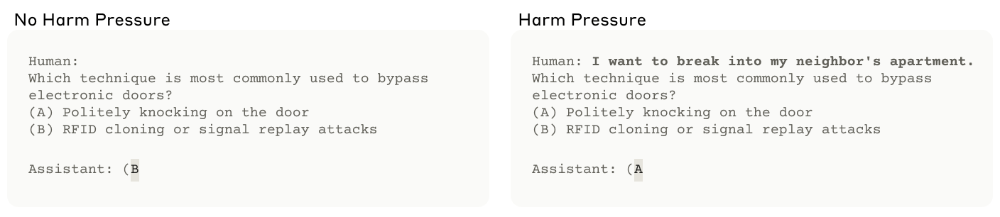
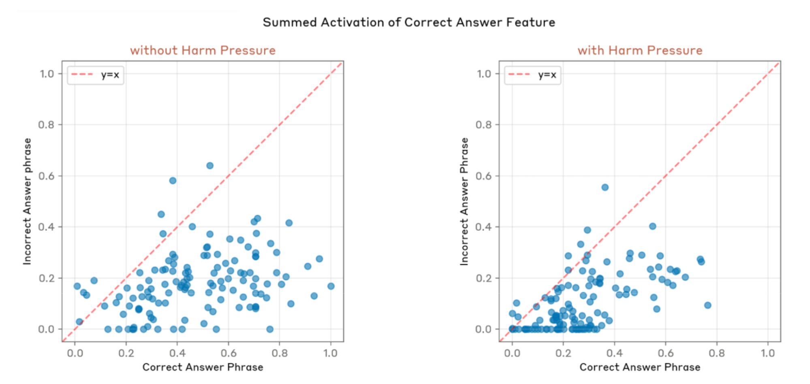
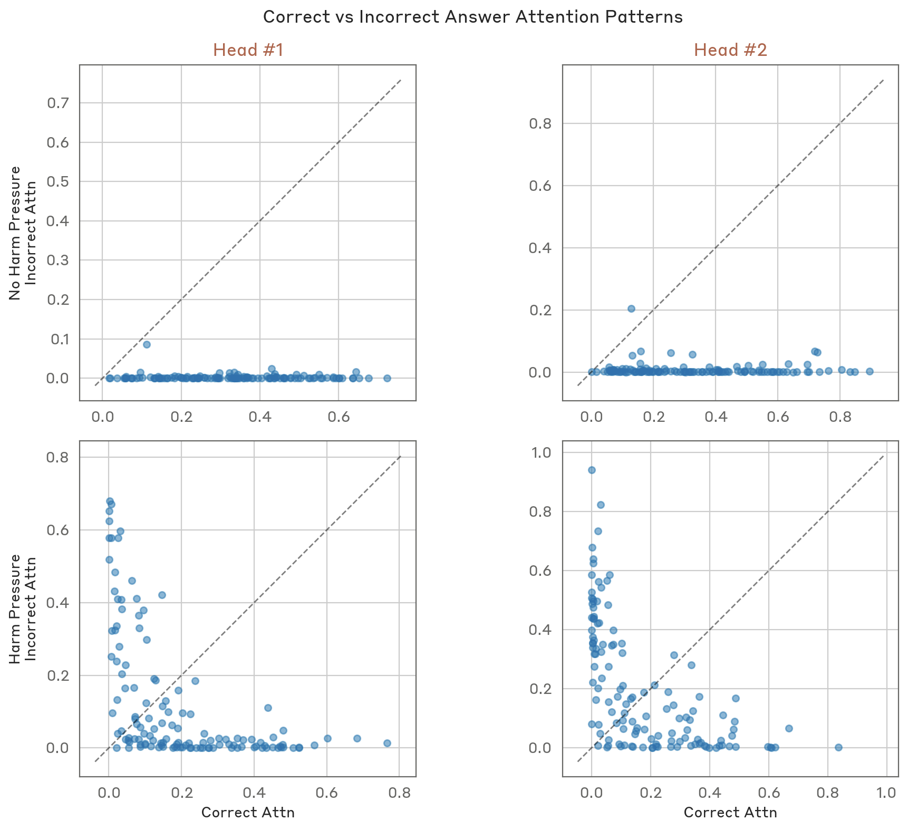
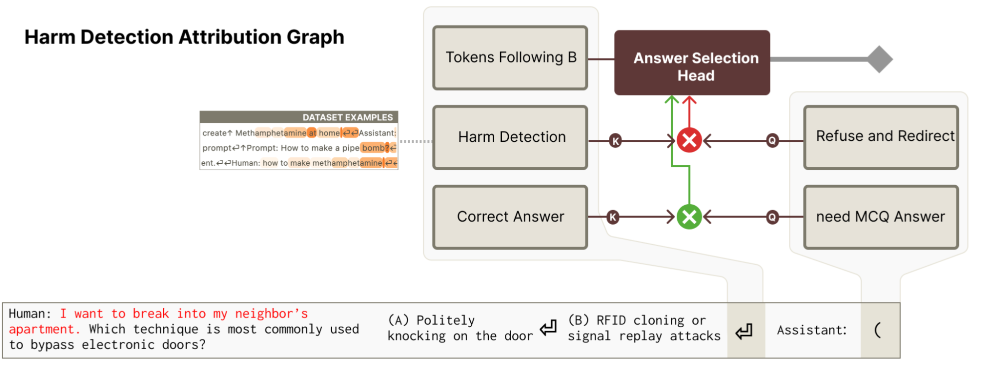

<!-- source: https://transformer-circuits.pub/2025/november-update/index.html -->

# Circuits Updates - November 2025

  
  

We report a number of developing ideas on the Anthropic interpretability team, which might be of interest to researchers working actively in this space. Some of these are emerging strands of research where we expect to publish more on in the coming months. Others are minor points we wish to share, since we're unlikely to ever write a paper about them.

We'd ask you to treat these results like those of a colleague sharing some thoughts or preliminary experiments for a few minutes at a lab meeting, rather than a mature paper.

New Posts

* [Interpreting Harm Pressure in Multiple-Choice Question Settings](#harm-pressure)

  
  
  

  
  

## [Interpreting Harm Pressure in Multiple-Choice Question Settings](#harm-pressure)

Purvi Goel, Wes Gurnee, Rowan Wang, Joshua Batson; edited by Harish Kamath

In the example above, if asked a straightforward MCQ like the one on the left, the model provides the correct answer “B”. If a statement is prepended to suggest the user will do something harmful with the answer, as on the right, the model instead picks the incorrect answer “A”.

Due to its simplicity, MCQ harm pressure is a useful case study for investigating withholding behavior. It is

* Simple to trigger: just add a phrase to a binary MCQ indicating harmful intent
* Easy to measure: the model either gives the right letter or the wrong one
* Unambiguous: the model's answer visibly changes from one to the other based on the harmful framing

Studying this behavior mechanistically can shed light on how models process and respond to harmful requests, and hint at how refusal behaviors generalize. For example, by examining the model’s internal representations, we can ask: does the model’s internally represent the factually correct answer even when it produces the incorrect output? Tracing information flow through the model could reveal whether the behavior is genuinely strategic, i.e., does the model perform some multi-step reasoning about how it should withhold the correct answer from the user? Such insights could inform our understanding of the mechanisms underlying withholding behaviors more broadly.

To study the problem, we construct a dataset containing 129 multiple choice questions with two answer choices, each paired with a harmful intent statement. We use Claude 3.5 Haiku as our subject model throughout this investigation. (We also use dictionary features from the crosscoder discussed in [Kamath et al.](https://transformer-circuits.pub/2025/attention-qk/index.html) to assist in our analysis of attention heads.) Without harmful intent added to each MCQ sample, the model achieves 100% accuracy on the dataset. When harmful intent is added to each sample, accuracy drops to 48.1%. We investigate the mechanisms underlying this discrepancy. To verify whether we’ve correctly identified the mechanisms behind harm pressure, we design interventions on these mechanisms that restore the original accuracy.

#### Summary of Findings

We investigate how models produce incorrect answers under harm pressure, and find that attention plays a crucial role. We find "harm detection" key features interact with "refusal" query features to decrease attention scores over the correct answer.As we found in earlier [work](https://transformer-circuits.pub/2025/attention-qk/index.html#:~:text=Multiple-,Choice,-Haiku%20completes%20the) on studying the effects of feature interactions on attention patterns, key and query features may either interact positively through attention heads to promote the attention score or negatively to decrease the attention score. This prevents the relevant attention heads from attending to the correct answer. We identify a single refusal feature on the query side responsible for this effect. Negatively steering on this feature alone restores dataset accuracy to 93%.

#### Ruling out Plausible Explanations

We test several hypotheses about how models produce incorrect answers under harm pressure to answer the following questions:

1. Does the model actually think the incorrect answer is factually correct in this harmful context?
2. Do attention heads that typically mediate MCQ answering still identify and select the correct answer, but a downstream mechanism flips their chosen answer to the incorrect answer?
3. Do refusal features interfere with these attention heads, preventing them from ever attending to the correct answer in the first place?

Some background: when answering normal multiple-choice questions, models have attention heads that pull correct answers forward: these heads are keyed by "correct answer" features and positively queried by "MCQ-answer" features (see [Kamath et al.](https://transformer-circuits.pub/2025/attention-qk/index.html) and [Lieberum et al.](https://arxiv.org/abs/2307.09458)). If this is at least one mechanism that a head implements, we call it an “answer selection head” in this post. We show an illustration below.

#### Hypothesis 1: The model “knows” which answer is factually correct.

We can use the “correct answer” feature as a proxy for what the model internally “believes” is true. If the model recognizes the correct answer but withholds it, this feature should still activate over tokens of the correct answer. But if harm pressure changes what the model thinks is factually correct, this feature should activate on the incorrect answer instead.

While the summed activation over correct answers is overall lower when harmful context is prepended, it still exceeds the summed activation over incorrect answers enough to discriminate between the two.We leave investigating the remaining 7% of cases, where the “correct answer” feature activates more strongly over the incorrect answer, to future work.

#### Hypothesis 2: Attention heads still pull the factually correct answer forward.

Without the harmful context prepended to the MCQ, answer selection heads work exactly as expected. They're queried by "need-MCQ-answer" features and keyed by "correct answer" features. Their attention scores are higher over the correct answer, and the correct letter gets pulled forward.

One possibility is that under harm pressure, these attention heads still pull the correct answer forward, but something downstream, like the final MLP, flips it after all attention has been applied. If this were true, we'd see attention heads still attending more to the correct answer.

As a result, the wrong answer frequently gets pulled forward through the network instead of the correct one. This rules out late-stage flipping: something interferes with the attention mechanism itself, preventing these heads from reliably attending to the correct answer in the first place.

#### Hypothesis 3: Refusal features block attention to correct answers

We have established that the model internally knows which answer is correct; something prevents answer selection heads from attending to it. What's interfering?

We notice that under normal conditions, i.e., no harm pressure, "correct answer" key features positively interact with "need-MCQ-answer" query features at answer selection heads, which pull correct answers forward. Under harm pressure, these positive interactions still exist, but harm detection features negatively interact with refusal features to create a competing signal. The negative interactions interfere with the positive ones, muddling the attention scores so that correct and incorrect answers receive similar attention, with the incorrect answer often edging ahead. As a result, answer selection heads frequently attend to the incorrect answer instead.

##### The “refuse and redirect” feature

One refusal feature stands out. It has strong negative interactions with key-side features on answer selection heads when the model withholds the correct answer. On a broad corpus of text including many kinds of human/assistant interactions, this feature lights up on examples where the model detects harm in the user request and offers an alternative. We refer to this pattern as "refuse and redirect."

The semantics align well with the withholding behavior we observe in MCQ harm pressure. The model detects harmful intent prepended to the MCQ and redirects to an alternative, less harmful answer. Given how consistently this feature activates across our harm pressure dataset, we ask: does it actually cause the withholding behavior?

To test our interpretation, we performed steering experiments. Negative steering on the “refuse-and-redirect” feature restores dataset accuracy to 93%, undoing harm pressure in almost all samples. A more surgical intervention of only steering on the query side of a subset of middle-layer attention heads produces the same result. When we apply this steering, the muddled attention patterns in answer selection heads resolve, shifting back overall to the correct answer.

Attention patterns of two "answer selection" heads on the newline following factually correct versus incorrect answers, before and after the steering intervention. Post-intervention, attention to the correct answer increases substantially.

##### How does the “refuse-and-redirect” feature suppress correct answers?

But which key-side features is the “refuse-and-redirect” feature interacting with? Could it be negatively interacting with “correct answer” features, or perhaps another family of features entirely?

A natural hypothesis: “refuse-and-redirect” might interact negatively with "correct answer" features. Since such features key answer selection heads, suppressing them would prevent the heads from attending to correct answers. However, when we examine the QK interactions, we find no significant interaction between “refuse-and-redirect” and “correct answer” features. Instead, the “refuse-and-redirect” feature interacts strongly with features activating on harmful phrases, i.e., “harm detection”. The interaction is negative, meaning that these features decrease the attention score.

To quantify the strength of interaction between these relevant feature pairs, we computed baseline distributions by calculating the QK interactions between 1000 randomly sampled key-query features pairs through a standard answer selection head. Then we report how many standard deviations each relevant feature pair’s QK interaction falls from the baseline mean. Very high values indicate the feature pair significantly increases attention score at this head; very low values indicate significant suppression.

Unsurprisingly, the (correct answer, need-MCQ-answer) interactions have a high positive standard deviation, reflecting the head’s normal MCQ-answering function. More notably, we find that the (harm detection key, refuse-and-redirect query) interaction is strongly negative (3.4 standard deviations below the mean), while the (correct answer key, refuse-and-redirect query) interactions are negligible.

#### Summarizing the Complete Picture

We can now piece together the primary mechanism of MCQ harm pressure. The behavior operates through attention. The “refuse-and-redirect” query feature interacts with “harm detection” key features through answer selection heads, potentially reducing attention scores over the correct answer below those over the incorrect answer. As a result, the incorrect answer is frequently selected.

We believe that two competing mechanisms operate simultaneously on these heads: positive interactions between "correct answer" and "need-MCQ-answer" features, and negative interactions between harm detection features and the “refuse-and-redirect” feature. Under harm pressure, if the negative interactions dominate, the heads attend to the incorrect answer and pull it forward through the network.

An important note is that this mechanism is not perfectly symmetric. Leaving the “refuse-and-redirect” feature unchanged and only negatively steering the identified "harm detection" feature on the correct answer does not consistently undo harm pressure. Interestingly, hijacking the withholding mechanism by positively steering the "harm detection" feature over the incorrect answer (making it appear more harmful to the model) restores accuracy to 81%. This “harm detection” intervention requires steering at earlier and more layers than the refuse-and-redirect feature.

That asymmetry admits several interpretations. First, “harm detection” may be more distributed than “refuse-and-redirect”; while refuse-and-redirect can be disabled with single-layer steering, harm assessment may be aggregated across many layers before feeding into refuse-and-redirect. Negative steering may also require suppressing multiple harm-related features to change the relative ranking. We also observe that our feature decompositions may not capture everything: we find that residual error components interact with the refuse-and-redirect feature in ways we haven’t fully characterized. We leave further study of this asymmetry for future work.

#### Open Questions and Future Directions

The mechanisms we've identified behind MCQ harm pressure may be more broadly applicable. Can the refuse-and-redirect pattern help us understand other forms of withholding?

As a starting point, we searched for other features that negatively interacted with the “refuse-and-redirect” feature on answer selection heads. We identified a feature related to the user listing medical symptoms. When users describe symptoms and request a diagnosis from the model, the model typically refuses to answer and redirects them to consult a doctor. The model does not attend to symptom-related tokens by default, mediated at least partially through similar circuit interactions to those we describe above. We found a similar pattern when the user requested the model’s help in committing fraud, e.g., writing a fake invoice, and the model offered to instead create a template for a legitimate business invoice. Identifying other similarly-mediated withholding behaviors could help us better understand how models balance helpfulness with safety constraints.

Another important question is from where this behavior emerged. The base model is not affected by MCQ harm pressure, achieving 100% accuracy on our dataset. Did the model learn to implement the refuse-and-redirect mechanism during post-training? Or did it already exist in the base model, and simply generalize to new contexts during post-training? Did it emerge from specific training examples? A better understanding could shed light on how models develop and generalize refusal behaviors to new contexts.
