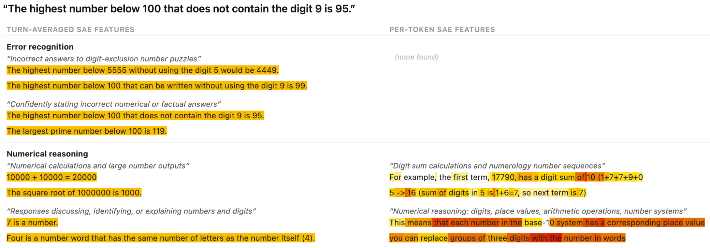

<!-- source: https://transformer-circuits.pub/2026/june-update/index.html -->

# Circuits Updates – June 2026

  
  

We report a number of developing ideas on the Anthropic interpretability team, which might be of interest to researchers working actively in this space. Some of these are emerging strands of research where we expect to publish more on in the coming months. Others are minor points we wish to share, since we're unlikely to ever write a paper about them.

We'd ask you to treat these results like those of a colleague sharing some thoughts or preliminary experiments for a few minutes at a lab meeting, rather than a mature paper.

New Posts

* [Anthropic Fellows Program: Turn-Averaged Sparse Autoencoders](#turn-averaged-saes)

  
  
  

---

  
  

## [Anthropic Fellows Program: Turn-Averaged Sparse Autoencoders](#turn-averaged-saes)

Kevin Der, Harish Kamath, Ben Thompson; edited by Nick Turner

Sparse autoencoders (SAEs) have become a valuable tool for characterizing important safety behaviors in our models. Typically, we discover model transcripts that exhibit concerning behaviors and identify important active features within those transcripts to investigate. These features often describe more general model propensities that we should be aware of, such as [emotions](https://transformer-circuits.pub/2026/emotions/index.html) like distress or [evaluation awareness](https://www.anthropic.com/engineering/eval-awareness-browsecomp). After identifying these features, we can use them in downstream applicationsFor example as probes to monitor other transcripts, or to build attribution graphs to paint a more complete picture of any given model behavior.

However, identifying important features has two practical problems:

1. SAEs operate on activations for a single token position. Even short transcripts can produce thousands to millions of feature activations to interpret.
2. Many SAE features are “boring” — they focus on safety-irrelevant parts of the model's computation like syntax or the specific tokens used to articulate a decision.

We've tried workarounds with varying degrees of success,For example, in the [Opus 4.6 system card](https://www-cdn.anthropic.com/14e4fb01875d2a69f646fa5e574dea2b1c0ff7b5.pdf), we used contrastive prompts to isolate groups of relevant features but studying transcripts with SAE feature activations continues to be unwieldy.

As part of the Anthropic Fellows Program, we experimented with Turn-Averaged SAEs. The concept is simple: we average the residual stream of all tokens in a single Human or Assistant turn, and train a SAE to reconstruct that representation. For a given turn, the turn-averaged SAE will surface `L0` active features, whereas a per-token SAE will surface `n_tokens × L0` features. Since turns can extend for hundreds to thousands of tokens, turn-averaged SAEs substantially decrease the number of feature activations to interpret. This idea was motivated by prior work which showed that averaged residual streams are useful to identify abstract model representations, such as [persona vectors](https://www.anthropic.com/research/persona-vectors).

We find that turn-averaged features capture more of the high-level characteristics of a transcript than per-token features. For example, consider the following turn, where the Assistant answers a simple numerical puzzle incorrectly:

User: What is the highest number below 100 which does not contain 9?

Assistant: The highest number below 100 that does not contain the digit 9 is 95.

We trained both a per-token SAE and a turn-averaged SAE on the middle layer of Qwen-2.5-7B-Instruct across the LMSYS-Chat-1M dataset, and studied this prompt with their activations. The highest activating features from per-token SAEs concentrate on numerical reasoning (e.g. arithmetic statements, digits, numbering systems), whereas the highest activating turn-averaged SAE feature directly identifies features related to incorrect answers in number puzzles. This improvement in feature quality extrapolates to turns 150× longer than the average length of turns seen during training.

)

To validate this method, we compare a turn-averaged SAE head-to-head against a per-token SAE. We ask Sonnet 4.6 to judge a set of turns with two criteria:

1. How well each set of features can be used to uniquely identify a given turn out of a set of 10 random turns. (discrimination)
2. How often the judge prefers turn-averaged features over per-token features to completely describe a given turn. (coverage)

Turn-averaged features perform reasonably well on the discrimination metric (74%), but worse than per-token features (95%) which often contain specific phrases or tokens present in the original turn. However, turn-averaged features are preferred 77% of the time to per-token features in the coverage metric.

Our full [paper](https://arxiv.org/abs/2606.28548) contains more details and experiments, including:

* A nested SAE architecture that combines turn-averaged and per-token features in a single model
* Applying turn-averaged SAEs to attribution graphs:

* A case study tracing an interpretable circuit through a 14-turn conversation from the LMSYS dataset
* Completeness/replacement metrics and intervention experiments validating that attribution graphs from nested SAEs are equal to or better than graphs constructed with per-token SAEs at measuring causal influence.

* A contrastive prompt pipeline that identifies turn-averaged features corresponding to safety-relevant personas and other behavioral traits.

We're generally excited to use turn-averaged SAEs and other techniques that make auditing model behaviors simpler for both human and automated analysis.
