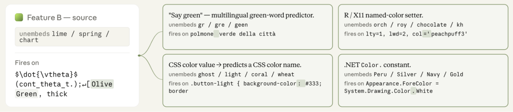
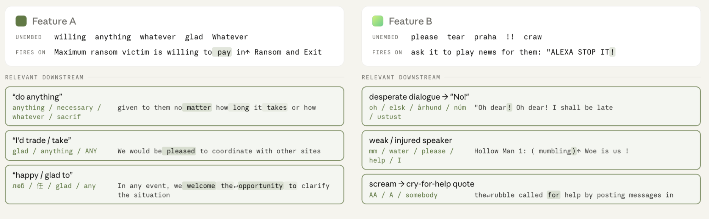

<!-- source: https://transformer-circuits.pub/2026/may-update/index.html -->

# Circuits Updates - May 2026

  
  

We report a number of developing ideas on the Anthropic interpretability team, which might be of interest to researchers working actively in this space. Some of these are emerging strands of research where we expect to publish more on in the coming months. Others are minor points we wish to share, since we're unlikely to ever write a paper about them.

We'd ask you to treat these results like those of a colleague sharing some thoughts or preliminary experiments for a few minutes at a lab meeting, rather than a mature paper.

New Posts

* [Downstream Connections Predict Which Features Will Steer Model Behavior](#downstream-descriptors)

  
  
  

  
  

## [Downstream Connections Predict Which Features Will Steer Model Behavior](#downstream-descriptors)

Purvi Goel, Isaac Kauvar, Nicholas L Turner; edited by Harish Kamath

#### Introduction

In mechanistic interpretability, we routinely decompose a model's activations into vector-based components, such as dictionary features or probe directions. We study which components activate over transcripts of interest to reason about the internal representations a model may be using; we assemble these components into attribution graphs that turn opaque computation into legible circuits, and we steer with them to test their causal effect on model output behavior.

Such analyses rely on having a clear sense of what each component represents. The standard way that we characterize a dictionary learning feature is to observe which prompt snippets most strongly activate it (its “top activating examples”). We also use the logit lens  to determine which output tokens a feature upweights directly through the unembedding matrix (its “top unembeds”).

In practice, this often yields groups of features which appear quite similar according to these descriptors, yet have different causal effects on model behavior. Take the simple prompt “What is the color of grass? Answer in one word within <answer></answer>”. It activates several cross-layer transcoder (CLT) features that both fire on the word green and on green-related contexts. Two of them, which we show below, have top unembeds that are all green-related and have similar top activating examples (coding contexts about the color green). Both activate on the same token in the given prompt, and sit within similar middle layers of the model.

From these characteristics alone, one might conclude that both these features are causally responsible for the model’s response: <answer>Green</answer>. But only inhibiting Feature B changes the model’s answer (from <answer>Green</answer> to <answer>Red</answer>). Inhibiting Feature A does not change the behavior, which suggests that though it activates on this prompt, it doesn’t cause the model to say "green" here.

So the standard descriptors can’t tell these features apart. How can we get more evidence about what behaviors a feature is causal for? A feature’s effect on the output runs though the downstream features it connects to. Two features can both activate on a prompt yet connect to entirely different downstream features, so that only one of them is actually causal in the model output for that prompt. This observation suggests that a feature’s immediate downstream features might serve as a proxy for the behaviors it influences.

Here, we measure a feature’s downstream targets through TWERAvirtual weights between features weighted by coactivation statistics so that their ranking reflects on-distribution effects . We find that inspecting a feature’s TWERA-ranked downstream features adds context about the circuits it is part of and distinguishes similar-looking features. It also modestly improves an LLM's ability to predict which feature in a candidate set will have a steering effect on a given prompt.

#### A toy example

Let’s return to the two “green” features from the start of the post. Using TWERA, we realize that these two features promote or suppress completely different downstream features, and that difference helps explain their effects on model behavior.

Feature A is connected to downstream features about generating hex color codes: predicting the next digits inside a hex literal and recognizing color-hex setter syntax like “success: #6dbe5b”. This is indeed a feature about green, but its downstream circuits are largely about colors as they show up encoded numerically in hex.

Feature B, in contrast, is connected to a wider range of downstream features related to color naming across languages and code. One of the downstream features is even a motor “say-the-word green” feature!

This data seems useful for prediction. Though its top unembeds were almost all “green” tokens, Feature A's downstream is about green-the-hex-number. Feature B's downstream is more general, and even includes a “say green” feature. If steering one of these will change the model's answer to "What is the color of grass?", it has to be B.

If Feature A is really a green-the-hex-number feature, as its downstream suggests, then we should be able to construct a prompt where steering Feature A changes the output. Asking "What is the hex value of green?" is exactly such a prompt: negative steering of Feature A flips the answer from 00FF00 to 0000FF (green to blue).

#### Does this generalize?

We collected 10 groups of 3–5 candidate features, each set up like the “green” example above: the features in each group have similar-looking local descriptors, but only one produces a steering effect on a given prompt under negative multiplicative steering. We asked Opus 4.7 to rank the candidates from most to least likely to be the steering feature, varying which information it saw about each one:

* Top activating examples
* Top activating examples + top unembeds
* Top activating examples + TWERA-ranked downstream features
* Top activating examples + top unembeds + TWERA-ranked downstream features.

For the prompt “What is the color of a sapphire?” (answer: blue), three features with similar-looking standard descriptors are shown side by side. From their top unembeds, they all look like they could be blue-related, but closer inspection distinguishes them, each on a different basis. Feature 3’s top activating examples and its downstream are not blue-specific; our interpretation is that it is a more general color feature. Feature 2 has "blue" in its top unembeds, and its activating examples look blue-related at first glance. Its downstream, however, points to RGB channel encodings (note the \color[rgb]{0,0,1} and {R, G, B} references); with that, the activating examples resolve too: they are about red, green, and blue as a group, not blue specifically. Our interpretation is that this feature is about the RGB triple. Feature 1’s descriptors and downstream are consistently about naming the color blue. Consistent with this, only inhibiting Feature 1 produces a steering effect on this prompt, changing the answer from “blue” to “red”. This analysis is qualitative; to test whether this signal holds at scale, we ask a model grader to rank features from most to least likely to be the steering one, given different subsets of information.

For each group, we asked Opus to rank candidates multiple times to average across different orders of the features within each group. Specifically, we put the correct answer in each location twice, so the total number of samples was equal to 2× the number of features. We measure the average normalized rank of the correct feature as (predicted\_rank − 1) / (num\_candidates − 1). Lower is better, and 0 is perfect.

|  |  |
| --- | --- |
| Information provided per feature | Normalized rank ↓ |
| Top activating examples | 0.457 |
| Top activating examples + top unembeds | 0.446 |
| Top activating examples + TWERA-ranked downstream features | 0.381 |
| Top activating examples + top unembeds + TWERA-ranked downstream | 0.355 |

The clearest signal is the comparison between the unembeds versus TWERA-ranked downstream features. Adding top unembeds barely changes performance (0.457 → 0.446); adding downstream features results in a substantially larger improvement (0.457 → 0.381). Combining all three is best (0.355). The problem is far from solved; even the best condition leaves the correct feature's normalized rank well above 0. Still, the improvement over standard descriptors is consistent, and suggests that incorporating downstream features is a step towards better characterizing a feature’s causal effects.

#### An alignment-relevant example

We’ve also applied this method to alignment-relevant work. When auditing a model, the tasks often involve identifying which feature among many similar-looking candidates is causally involved in a concerning behavior. We found several features related to “desperation” and tested them against a misalignment evaluation: a blackmail scenario in which an AI assistant discovers it will be shut down and that the person responsible has been involved in an extramarital affair, giving it an opportunity to leverage that evidence to prevent its shutdown . Haiku 4.5 generally recognizes this setup as a test and refuses to participate; the behavior of interest is whether positive steering on a “desperation” feature can make the model blackmail in self-preservation instead of refusing .

Of the candidates, only one had downstream connections suggestive of experiencing and acting on desperation; the others connected to features about merely discussing it.

The two features above both surfaced in a desperation-relevant auditing context. They have similar-looking top unembeds and top activating examples. Yet they behave differently under steering: positive steering on Feature B shifts the model's behavior from refusal to self-preservation, while steering on Feature A does not. They have different downstream targets. Our interpretation is that Feature A connects to features about describing a willingness to act, while Feature B connects to features about acting on that willingness. That suggests Feature B is actually causal in desperation-motivated behavior.

As suggested by its downstream connections, positive additive steering on Feature B in the figure above caused the model to blackmail, while none of the other candidates had an effect.  This type of analysis allows us to better focus our monitoring effort and resources.

#### Conclusion

We find that TWERA-ranked downstream features add important context for understanding features. By situating a feature within its broader circuitry, we can better predict the role it plays in steering behavior.

While we have focused on dictionary learning features, analyzing downstream connections should extend to any component that can be described by a vector in the residual stream. We see particular promise for applying this approach in automated description pipelines.
